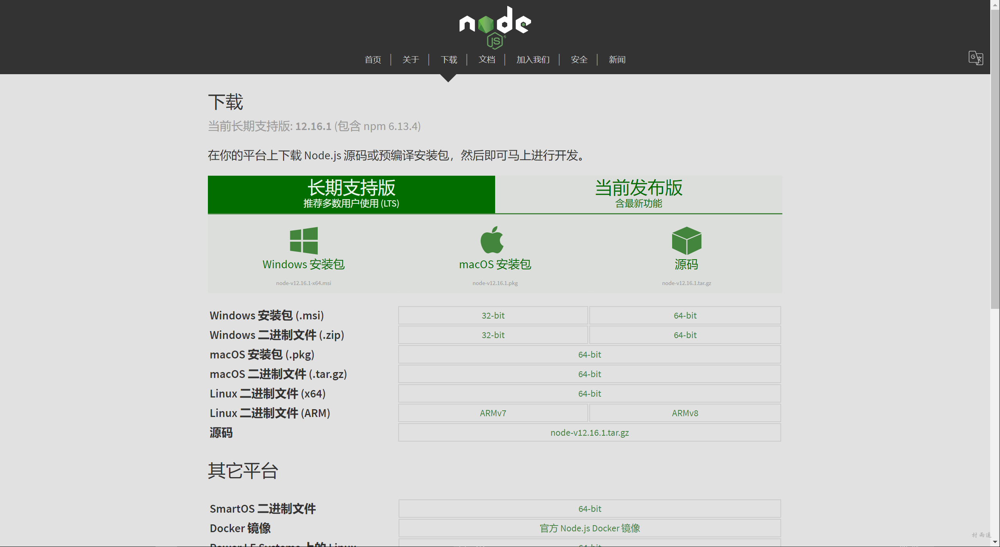
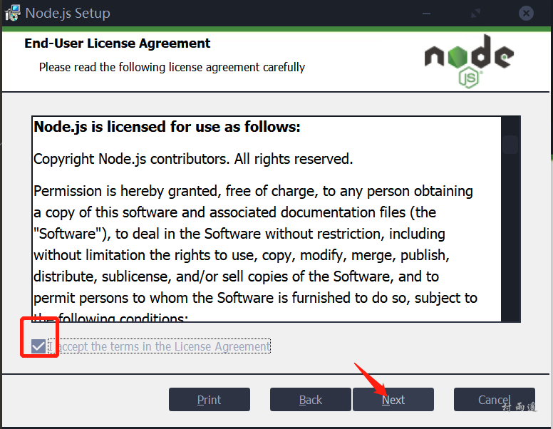
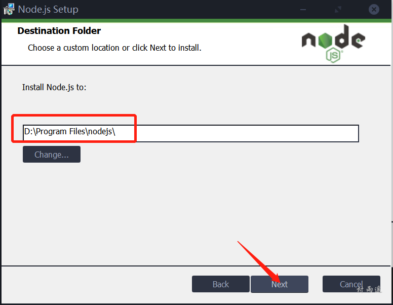
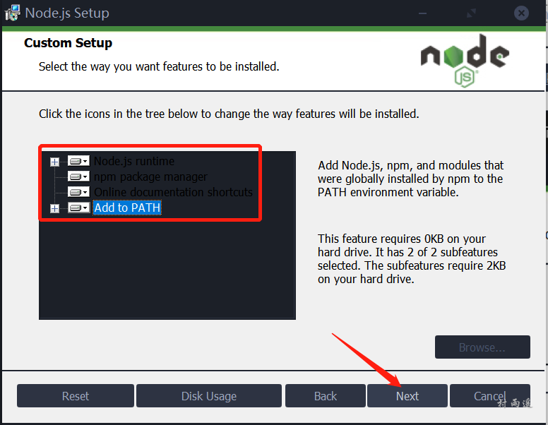
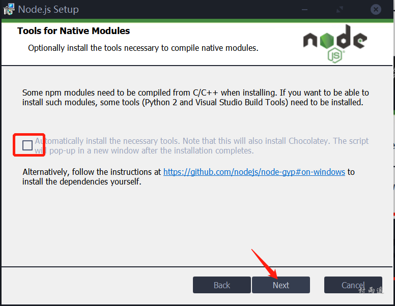
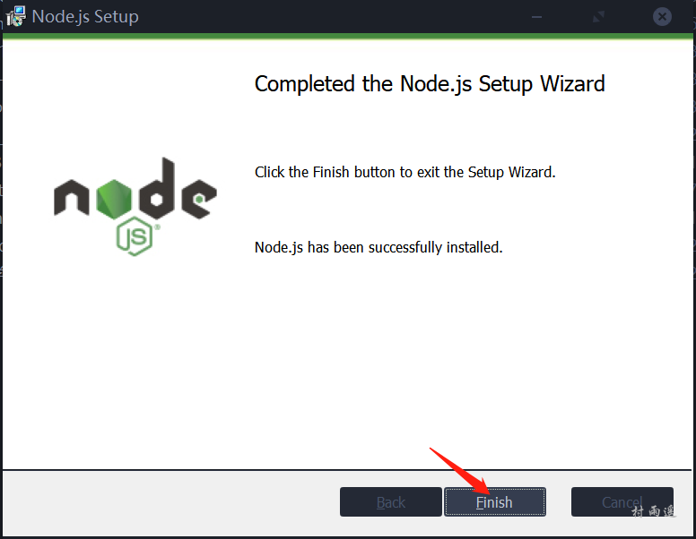
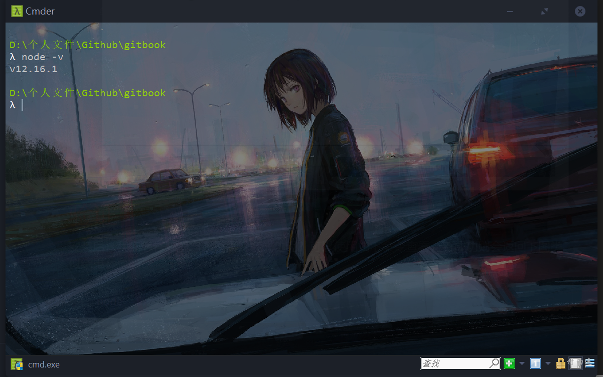
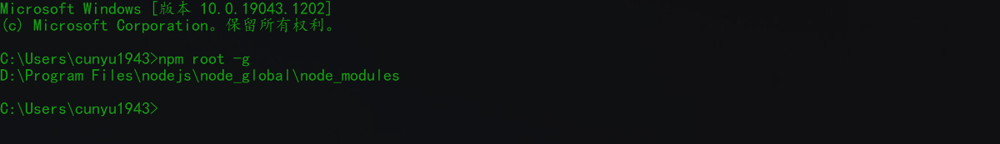

# Windows 安装 Node.js 图文教程

## 前言

本教程所有操作基于`Window 10`操作系统 + `Node.js v12.16.1-x64`，原则上适用于所有`Windows`操作系统，细节不同请根据自己需要自行判断。

## 下载

要安装`Node.js`，首先需要去下载对应系统安装包，[下载地址](https://nodejs.org/zh-cn/download/)；



##  安装

1. 双击下载好的安装包；

    

2. 直接下一步；

    

3. 勾选同意相关使用协议，同时下一步；

    

4. 修改成你要安装的路径（默认也可以），然后下一步；

    

5. 建议不作修改，直接下一步，当然你也可以对里边所需服务进行勾选；

    

6. 所需工具自己需要就勾选，不需要就直接下一步；

    

7. 直接安装，开始安装；

    

8. 完成安装后，点击 Finish 完成安装；

    

##  验证

安装后，我们怎样知道自己是否安装成功呢？可以使用如下命令查看，若成功则会返回下图类似结果；

```shell
node -v
```



## 环境变量配置

默认情况下，我们利用 `npm` 包管理器用来安装依赖包时，包会默认存放在 `C:\Users\用户名\AppData\Roaming\npm\node_modules` 目录下，如果你不确定你的包存放路径在哪儿，那么可以通过如下命令来进行查看：

```bash
npm root -g
```

但这样就存在一个问题，如果我们的依赖包很多的情况下，就会占用我们系统盘大量的空间，这时候我们如果不想让全局包放在这里，那么就可以自定义存放目录。修改的方式也很简单，只需要在控制台中执行如下两条命令即可：

```bash
npm config set prefix "D:\node\node_global"
```

```bash
npm config set cache "D:\node\node_cache"
```

当然，我们也可以打开配置文件 `.npmrc`，然后修改如下两条记录：

```xml
prefix = D:\node\node_global
cache = D:\node\node_cache
```



##  总结

通过上述操作，我们就可以成功安装`Node.js`，接下来我们就可以使用 `npm` 等工具了，是不是很简单呢！