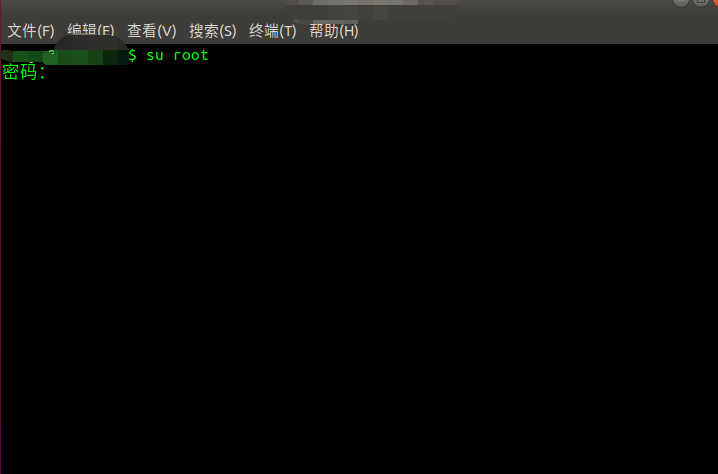
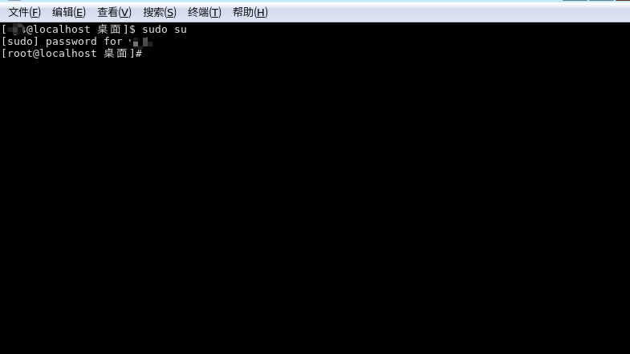
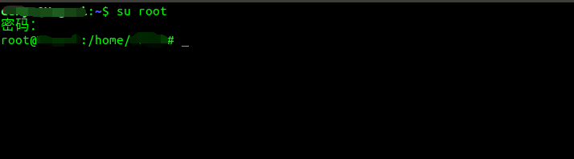

# 修改 Ubuntu 默认 root 密码

##  新安装的 Ubuntu 系统中默认的 root 用户密码是多少？该怎么修改？

 如题，相信许多刚接触 Ubuntu 系统的新手大多会遇到这个问题，那么我们该如何解决这个问题呢？Ubuntu 在安装过程中并没有让我们设置 root 用户密码，但当我们需要获取 root 用户的权限时，就会让我们输入 root 用户的密码，如下图，

这就搞得我们一头雾水了。当初我们安装系统的时候只是设置好了一个用户名和用户的密码，并没有设置 root 用户密码啊，该怎么输入呢？你可能会抱着试一试的心态，输入自己创建的用户的密码，结果当然是密码错误了！！！

 - 原因：未设置之前，Ubuntu 中默认的 root 密码是随机的，即每次开机都会有一个新的root 密码，所以此时的 root 用户密码并不确定；
 - 解决方法：Ubuntu 中打开终端(`ctrl + alt + t`)，输入 `sudo passwd`，如下图，然后重复两次你要设置的 root 密码，然后就会提示密码已更新了；





 - 测试是否设置成功：控制台中输入`su root`，然后输入刚才设置好的root密码，测试是否修改成功，成功后如下图所示；


 

## 修改指定用户的密码

- 首先需要切换到```root```用户下，输入```sudo su```，然后输入上面改好的root用户密码即可切换到```root```用户；

- 然后输入```passwd 用户名```，输入需要修改的新密码，重复两次即可，此时变回提示用户身份验证令牌已成功更新；
