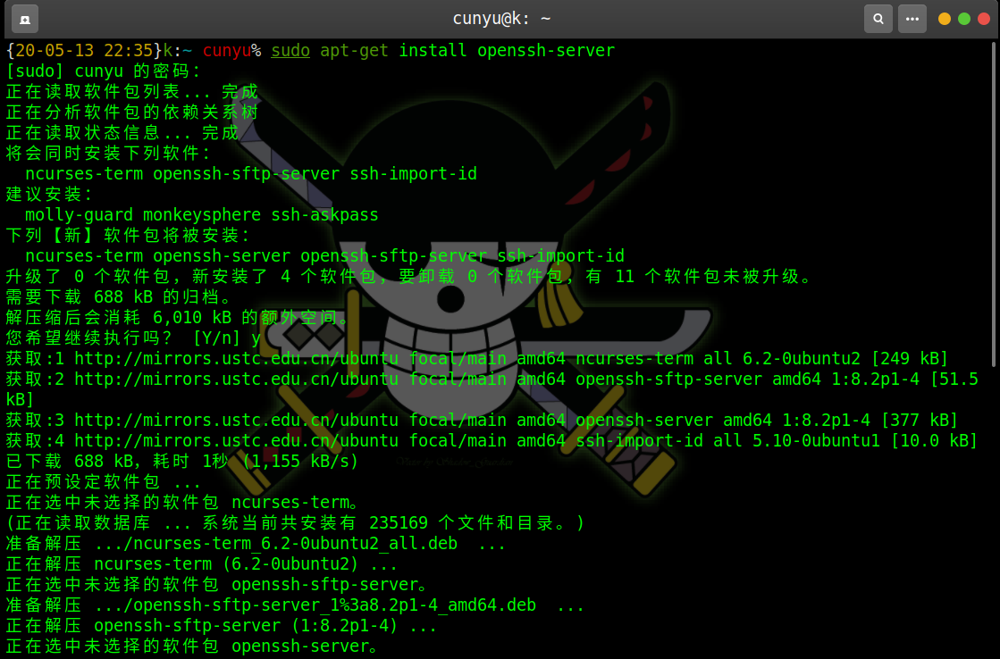
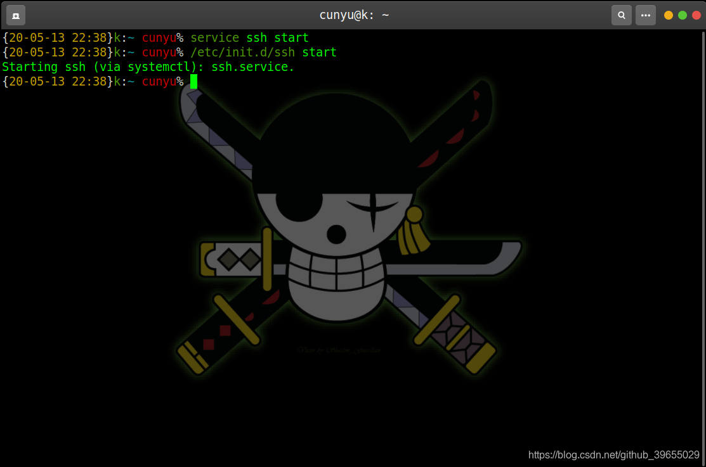
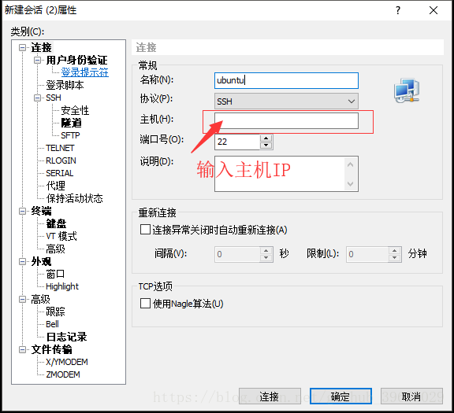
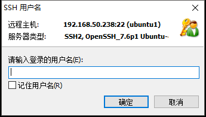
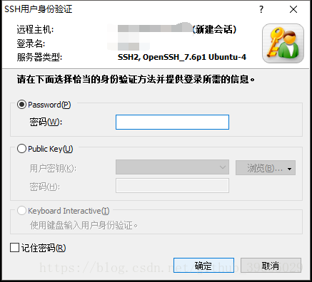
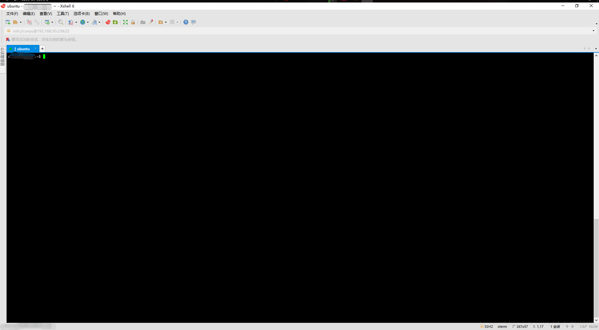

# XShell 连接 Ubuntu

## 🎈 号外

最近，公众号之外，建立了微信交流群，不定期会在群里分享各种资源（影视、IT 编程、考试提升……）&知识。如果有需要，可以**扫码或者后台添加小编微信备注入群**。进群后**优先看群公告**，**呼叫群中【资源分享小助手】**，还能免费帮找资源哦～

<center>
 
</center>

## 前言

一般情况下，安装好的 Ubuntu 系统中默认是只安装了 `openssh-client`，此时只能通过此系统连接访问其他系统，但不具有让其他系统访问的权限。在终端查看 ssh 进程，输入 `ps -e|grep ssh`，如果有安装 `openssh-client` 只会出现 `ssh -agent`，不会出现 `sshd`。


此时要想开放本机 SSH 服务以便其他系统登陆访问，就必须安装 `openssh-server`；

## openssh-server安装过程

1. 在终端中输入 `sudo apt-get install openssh-server`，然后输入自己的 `root` 密码就可以了；

    

    

    

2. 然后启动 `ssh-server` 服务即可，开启方式，当然这两种开启方式都是需要切换到```root```用户或者提供密码权限的；

    ```shell
    service ssh start
    /etc/init.d/ssh start
    ```

    


3. 验证是否开启成功；

    

4. 若再次查看```ssh```进程时，同时出现```sshd```、```ssh -agent```进程，则说明```openssh -service```已经安装成功；

    

    

5. 此时便可通过 XShell 访问 Ubuntu 了，依次填入主机 IP、用户名以及用户密码便可成功连接到 Ubuntu；

    







## 总结

经过上述一系列过程之后，就可以成功使用 `XShell` 连接到远程的 `Ubuntu` 服务器了。如果你有什么疑惑，欢迎留言交流，或者私信我！