# 手把手ç©è½¬ Ubuntu é…ç½®

> 作者：[æ‘雨é¥](https://github.com/cunyu1943)
> 
> ä¸è¦å“€æ±‚，学会争å–，若是如此，终有所è·
> 
>

## 🈠å·å¤–

最近，公众å·ä¹‹å¤–，建立了微信交æµç¾¤ï¼Œä¸å®šæœŸä¼šåœ¨ç¾¤é‡Œåˆ†äº«å„ç§èµ„æºï¼ˆå½±è§†ã€IT 编程ã€è€ƒè¯•æå‡â€¦â€¦ï¼‰&知识。如æœæœ‰éœ€è¦ï¼Œå¯ä»¥**扫ç æˆ–者åå°æ·»åŠ å°ç¼–微信备注入群**。进群å**优先看群公告**，**呼å«ç¾¤ä¸­ã€èµ„æºåˆ†äº«å°åŠ©æ‰‹ã€‘**，还能å…费帮找资æºå“¦ï½

<center>
 
</center>

# å‰è¨€

我们在工作或学习过程中，有许多时候会æ¥è§¦åˆ° Linux，然å便想è¦è‡ªå·±äº²è‡ªè¯•è¯•è¿™ä¸ªç³»ç»Ÿï¼Œä½†è‹¦äºæ²¡æœ‰ç³»ç»Ÿå­¦ä¹ è¿‡ï¼Œæ‰€ä»¥æƒ³è¦æ‰“造自己的工作ç¯å¢ƒéš¾å…会é‡åˆ°è®¸å¤šå›°éš¾ã€‚为了防止大家踩我踩过的å‘，æ‰æœ‰äº†è¿™ç¯‡åšå®¢ã€‚本åšå®¢å°†ä¸»è¦ä» **系统设置ã€å¸¸ç”¨è½¯ä»¶å®‰è£…ã€å¼€å‘ç¯å¢ƒæ­å»ºã€ç³»ç»Ÿç¾åŒ–** 几个方é¢ç€æ‰‹ï¼Œæ‰‹æŠŠæ‰‹æ•™ä½ å¦‚何ä»é›¶æ‰“造自己的 Ubuntu 工作ç¯å¢ƒã€‚

先展示下我自己的工作ç¯å¢ƒï¼š

- æ¡Œé¢


- 程åºå

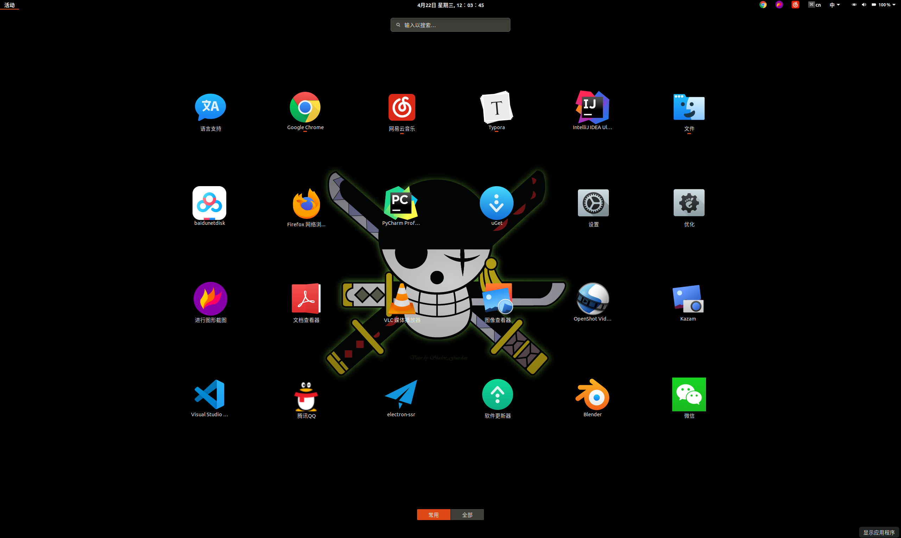

- 文件

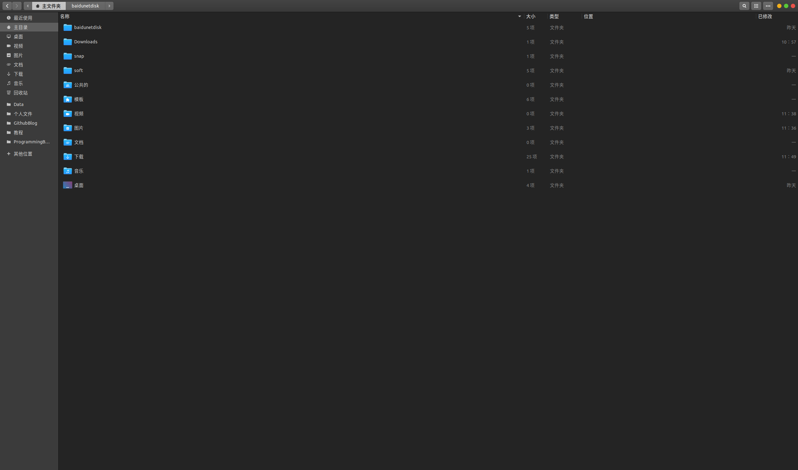

# 系统设置

## æ¢é•œåƒæº

å³å°†å®˜æ–¹è‡ªå¸¦çš„æºæ¢æˆå›½å†…é•œåƒæºï¼Œå¦‚阿里ã€å为ã€ç½‘易等；

打开 **软件和更新** ，然å选择下载自 **其他站点**，选择你è¦è®¾ç½®çš„é•œåƒæºç«™ç‚¹å³å¯ï¼Œä¹Ÿå¯ä»¥ç‚¹å‡»å³ä¾§é€‰æ‹©æœ€ä½³æœåŠ¡å™¨ï¼Œä¼šæ ¹æ®ä½ æ‰€å¤„地区然å自动选择网速最快的；

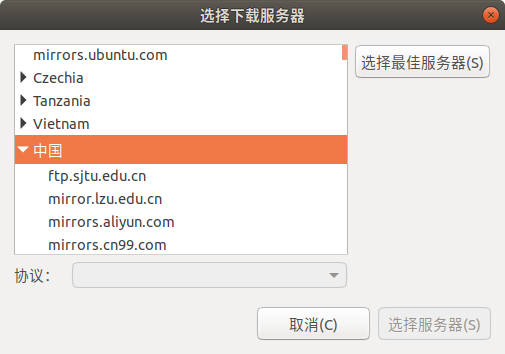

## 安装更新

æ¢æºä¹‹å，执行如下命令用äºæ›´æ–°ç³»ç»Ÿï¼›

```shell
sudo apt update
sudo apt-get  upgrade
```

## 使用本地时区

使用åŒç³»ç»Ÿæ—¶ï¼Œå¾€å¾€ä¸¤è€…时间会ä¸æ­£ç¡®ï¼Œå¯ä»¥é€šè¿‡å¦‚下命令让 Ubuntu 使用本地时区；

```shell
timedatectl set-local-rtc 1
```

## å¸è½½è‡ªå¸¦çš„“无用â€è½¯ä»¶

此处说的“无用â€è½¯ä»¶ï¼Œå› äººè€Œå¼‚，笔者åªæ˜¯æ供建议，建议å¸è½½è½¯ä»¶åˆ—表如下（å¯èƒ½è¿˜æœ‰äº›æ²¡å’‹ç”¨çš„没列出，读者å¯ä»¥è‡ªè¡Œå†³å®šæ˜¯å¦å¸è½½ï¼Œå¸è½½ä¹‹å如æœæœ‰ç”¨åˆ°ï¼Œè¿˜å¯ä»¥é‡æ–°å®‰è£…）；

- thunderbird 自带邮件
- rhythmbox 音ä¹
- gnome-mahjongg 对对碰游æˆ
- gnome-mines 扫雷
- gnome-sudoku 数独
- aisleriot 纸牌
- simple-scan 扫æ器
- onboard å±å¹•é”®ç›˜
- brasero 光盘å¯æ€œå·¥å…·
- cheese 茄å­ç›¸æœº
- libreoffice 套件，用 WPS 代替

# 常用软件安装

## 输入法

- æœç‹—输入法 for Linux

软件由æœç‹—输入法团队和 Ubuntu Kylin 团队共åŒå¼€å‘，能够满足我们日常输入需求；

- 安装

此处æ¨è下载安装包å安装，[下载地å€](https://pinyin.sogou.com/linux/?r=pinyin)，下载å的安装包如下；

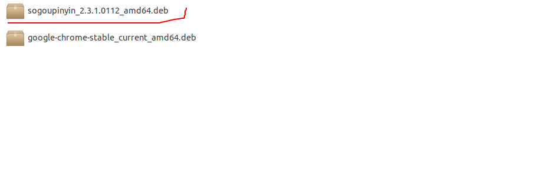

然å在当å‰æ–‡ä»¶å¤¹ä¸‹æ‰“开终端，输入如下命令安装å³å¯ï¼›

```shell
sudo dpkg -i sogoupinyin_2.3.1.0112_amd64.deb 
```

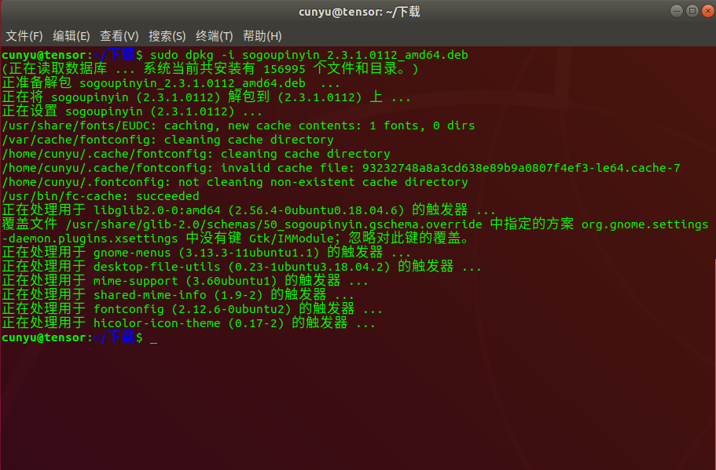

æ¥ç€åˆ° **设置 - &gt; 区域和语言** 点击已安装的语言；

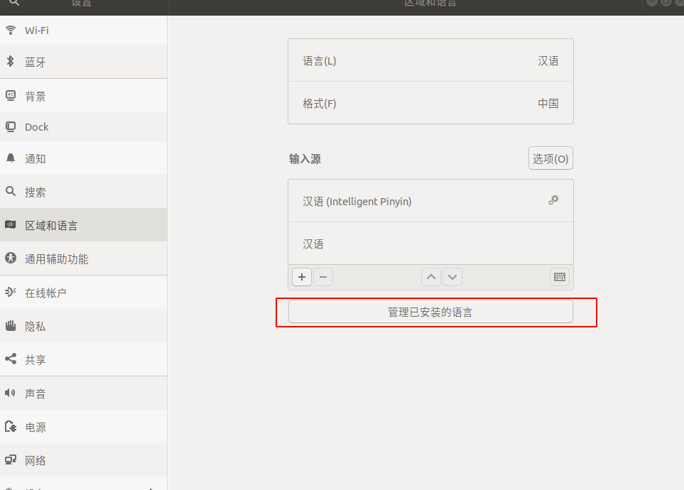

把键盘输入法设置为 **fcitx**，然å应用到整个系统å³å¯ï¼Œç„¶å注销或者é‡å¯å³å¯ä½¿ç”¨ï¼›
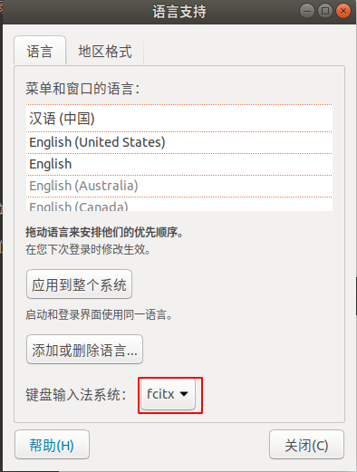

- 注æ„

当安装时，å¯èƒ½ä¼šæŠ¥ä¾èµ–相关问题，å¯ä»¥åœ¨æ‰§è¡Œä¸Šè¿°å‘½ä»¤å，在终端中输入如下命令修å¤ä¾èµ–安装，然åå†æ¬¡æ‰§è¡Œä¸Šé¢çš„安装命令å³å¯ï¼›

```shell
sudo apt-get --fix-broken install
```

## æµè§ˆå™¨

- Chrome
    说到æµè§ˆå™¨ï¼Œè™½ç„¶ Ubuntu 中预装了 Firefox，但笔者更习惯用 Chrome ，作为全çƒèŒƒå›´å†…份é¢æœ€é«˜çš„æµè§ˆå™¨ï¼Œè‡ªç„¶ä¸ç”¨è¯´å•¥ï¼Œå…¶å®å¾®è½¯æ–°å‡ºçš„ Edge æµè§ˆå™¨ä¹Ÿå¾ˆä¸é”™ï¼Œåªæ˜¯ç›®å‰è¿˜æ²¡æœ‰æ”¯æŒ Linux，åç»­å¯èƒ½ä¼šè¿›ä¸€æ­¥æ”¯æŒã€‚

- 安装

建议使用 deb 安装包安装，先 [下载](https://www.google.cn/intl/zh-CN/chrome/) 安装包，然å在本地终端使用如下命令进行安装；

```shell
sudo dpkg -i google-chrome-stable_current_amd64.deb 
```


- æˆå“

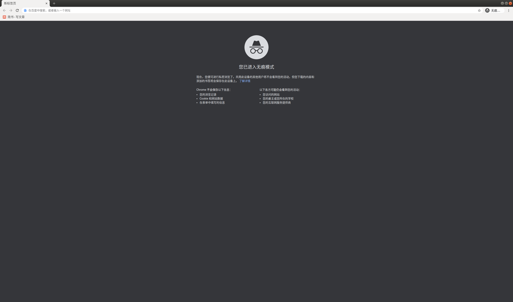

## QQ

å»å®˜ç½‘ [下载](https://im.qq.com/linuxqq/download.html) 对应安装包，然å在终端使用如下命令安装；

```shell
sudo dpkg -i linuxqq_2.0.0-b2-1082_amd64.deb
```

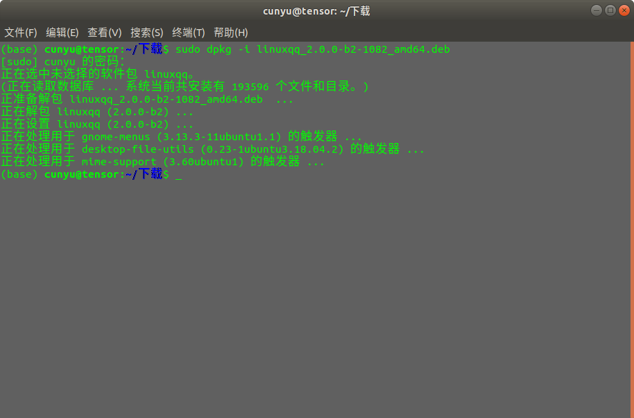

- æˆå“


## 微信

- 安装

此处æ¨è使用网页版å³å¯ï¼Œwine 版虽然网上也有，但有许多 bug，所以æ¨è使用网页版；

- 创建快æ·æ–¹å¼

打开网页版微信，然å打开æµè§ˆå™¨è®¾ç½®ä¸­çš„ **更多工具 -&gt; 创建快æ·æ–¹å¼** å³å¯ï¼Œç„¶å在桌é¢å°±ä¼šå‡ºç°å¿«æ·æ–¹å¼ï¼Œä¿¡ä»»å³å¯ï¼›

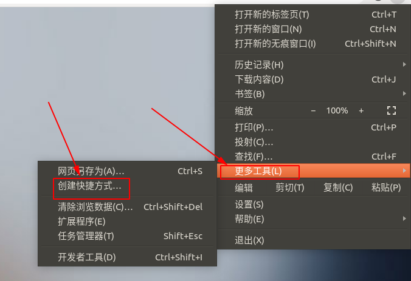

- æˆå“

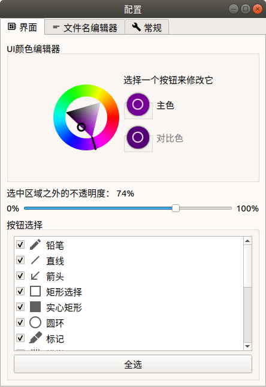

## 音ä¹æ’­æ”¾å™¨

- 网易云音ä¹

作为网易旗下的音ä¹è½¯ä»¶ï¼Œè™½ç„¶ç‰ˆæƒé—®é¢˜æµå¤±äº†è®¸å¤šç”¨æˆ·ï¼Œä½†ä¸å½±å“它越æ¥è¶Šå—广大用户喜欢。而我们在学习工作之余å¬å¬éŸ³ä¹ï¼Œæ”¾æ¾ä¸‹è°ƒæ•´çŠ¶ä½“也是æ好的。

- 安装

[下载](https://music.163.com/#/download) Linux 版本安装包，然å使用如下命令在终端中安装å³å¯ï¼›

```shell
sudo dpkg -i netease-cloud-music_1.2.1_amd64_ubuntu_20190428.deb
```

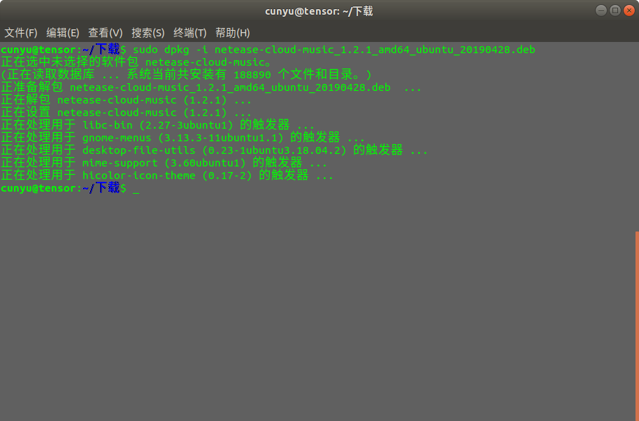

- æˆå“


## 截图工具

- flameshot
    flameshot，能够用äºæ ‡æ³¨ã€æ¨¡ç³Šï¼ŒåŒæ—¶è¿˜æ”¯æŒä¸Šä¼ åˆ° imgur 图床的新å¼æˆªå›¾å·¥å…·ï¼›
- 安装

```shell
sudo apt install flameshot
```

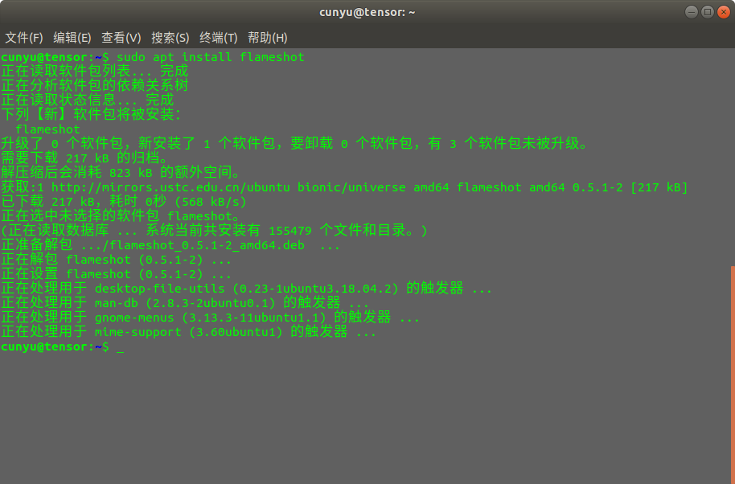

- 设置快æ·é”®

ä¾æ¬¡è¿›å…¥ **设置 -&gt; 设备 -&gt; 键盘** ，然å滑到最底端会有一个 `+` 按钮，点击 `+` 添加自定义快æ·é”®ï¼Œå¹¶è®¾ç½®å称和命令，然å点击å³ä¸Šè§’添加就å¯ä»¥è®¾ç½®è‡ªå·±æƒ³è¦çš„截图快æ·é”®ï¼Œæ¯”如我设置的是 `Ctrl + Alt + A`，如下图所示；

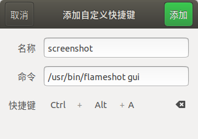

- æˆå“


## 图片编辑器

- Gimp

GIMP是 GNU Image Manipulation Program（GNU图åƒå¤„ç†ç¨‹åºï¼‰çš„缩写，它是 Peter Mattis å’Œ Spencer Kimhall å¼€å‘çš„å…费照片和图åƒå¤„ç†å’Œåˆ›ä½œå·¥å…·ï¼ŒåŠŸèƒ½å分强大。支æŒå¤šç§å›¾åƒå¤„ç†å·¥å…·ã€å…¨é€šé“ã€å¤šçº§æ’¤é”€æ“作æ¢å¤æ—§è²Œä¸æ˜ åƒä¿®é¥°ç­‰åŠŸèƒ½ã€‚支æŒæ•°ç›®ä¼—多的效æœæ’件（plug-ins），完全å¯ä»¥ä¸ Windows å¹³å°ä¸‹è‘—å的图åƒå¤„ç†è½¯ä»¶ Photoshop 媲ç¾ï¼›

- 安装

ç›´æ¥ä½¿ç”¨å¦‚下命令安装å³å¯ï¼›

```shell
sudo apt-get install gimp
```


- æˆå“

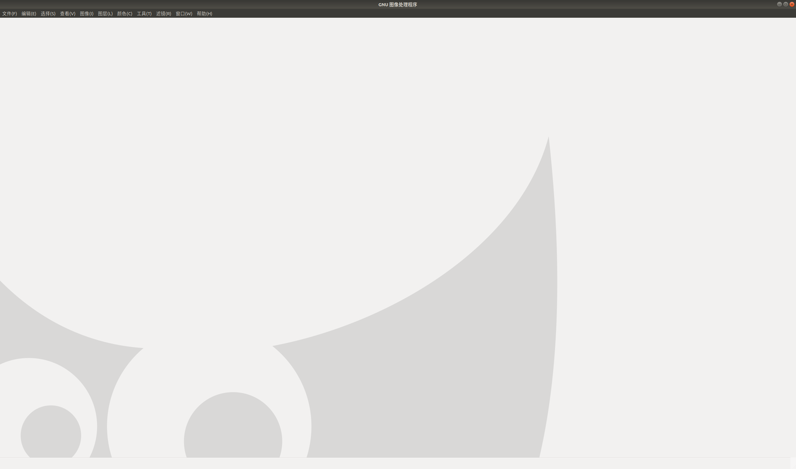

## 文字处ç†

- WPS

Ubuntu 中自带了 LibreOffice åŠå…¬å¥—件，但此处更æ¨è使用 WPS，更加符åˆæˆ‘们国人的使用习惯。

- 安装

先下载安装包，然åä¾ç„¶åœ¨æœ¬åœ°ç»ˆç«¯ä½¿ç”¨å¦‚下命令进行安装；

```shell
sudo dpkg -i wps-office_11.1.0.9505_amd64.deb
```

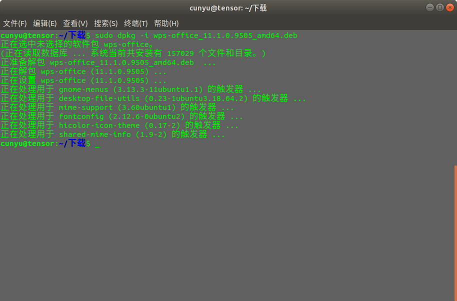

- æˆå“

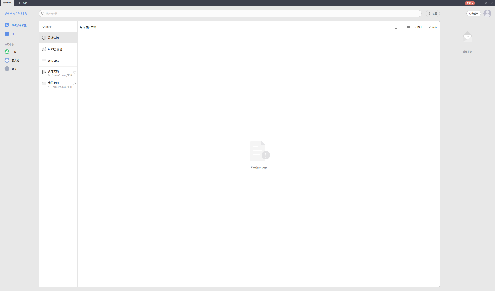

## Markdown 编辑器

- Typora

作为一款æ简的 Markdown 编辑器，åˆå¹¶äº†å†™ä½œå’Œé¢„览。支æŒè¡¨æ ¼ã€ä»£ç ç¼–辑，拖拽æ’图等，é常好用；喜欢它的åŸå› ä¹Ÿå°±æ˜¯ï¼šç¾è§‚ã€å…费，而且跨平å°ï¼›

- 安装

ä¾æ¬¡ä½¿ç”¨å¦‚下命令å³å¯å®‰è£…ï¼›

```shell
wget -qO - https://typora.io/linux/public-key.asc | sudo apt-key add -

sudo add-apt-repository &#39;deb https://typora.io/linux ./&#39;

sudo apt-get update

sudo apt-get install typora
```


-   æˆå“

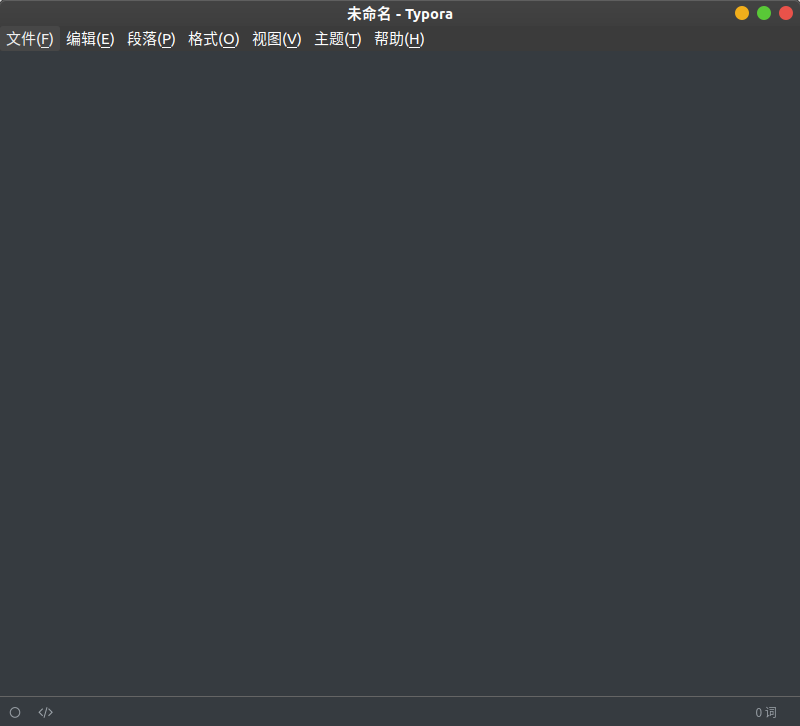

## 文档阅读器

- Okular

å¯ä»¥è¯´æ˜¯ Linux 中最好的 PDF 阅读器，而且还支æŒå¸¸ç”¨çš„ CHMã€EPub 等格å¼æ–‡æ¡£çš„查看；

- 安装

ç›´æ¥åœ¨ç»ˆç«¯ä¸­ä½¿ç”¨å¦‚下命令安装å³å¯ï¼›

```shell
sudo apt-get install okular
```

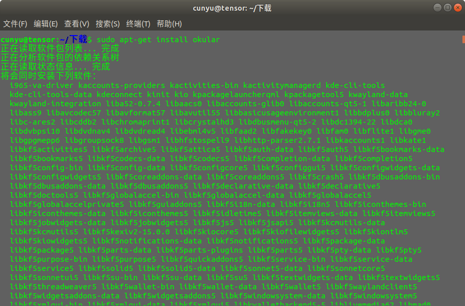

- æˆå“

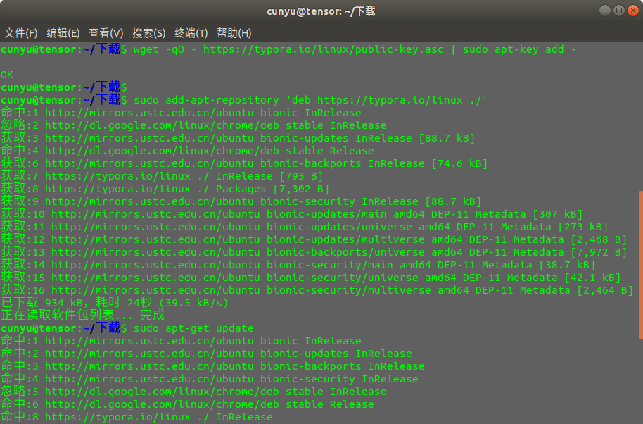

## æ€ç»´å¯¼å›¾

- XMind

åšäº‹æˆ–者写作之å‰ï¼Œéƒ½å–œæ¬¢å…ˆåšä¸€ä¸ªæ€»ä½“çš„æ€ç»´å¯¼å›¾ï¼Œç„¶åæ ¹æ®æ€ç»´å¯¼å›¾å»ç»†åŒ–æ¯ä¸€éƒ¨åˆ†ï¼Œè€Œ XMind 正是这么一款工具；

- 安装

å» [下载](https://www.xmind.cn/download/) 安装包之å，在终端中使用如下命令行安装å³å¯ï¼›

```shell
sudo dpkg -i XMind-2020-for-Linux-amd-64bit-10.1.2-202004142327.deb 
```

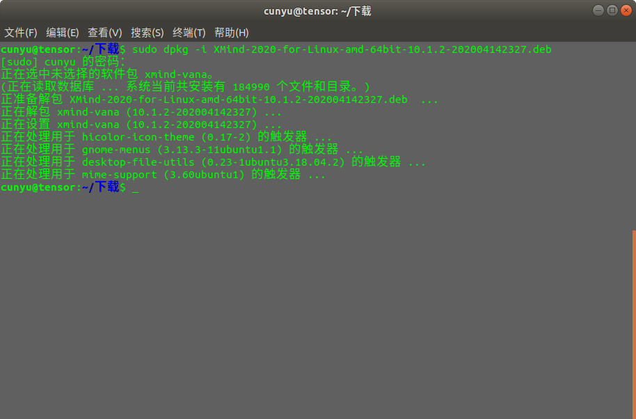

- æˆå“
    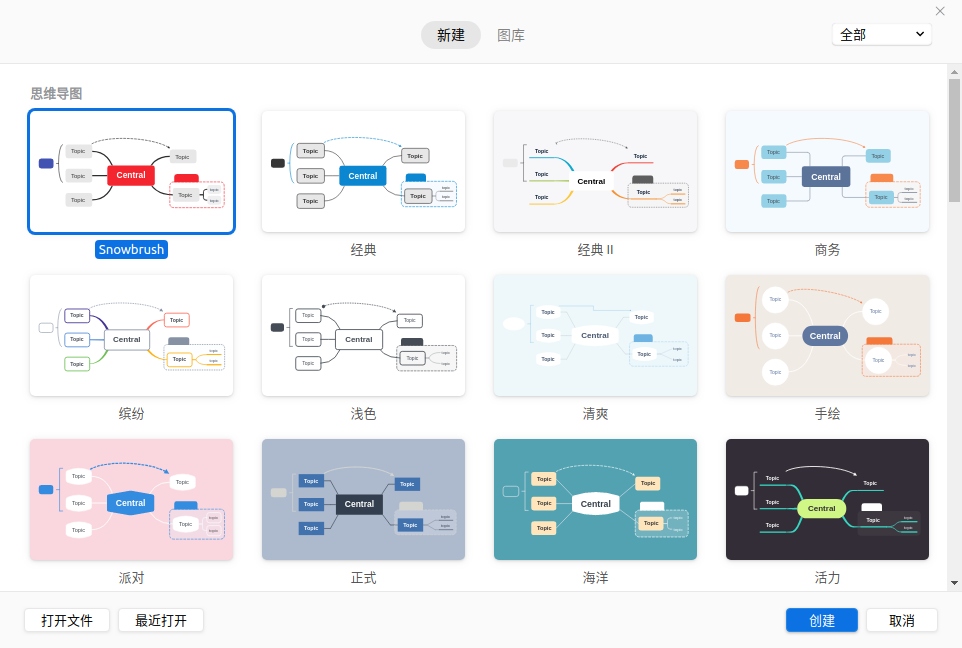

## 多媒体播放器

- VLC

支æŒä¼—多音频ä¸è§†é¢‘解ç å™¨åŠæ–‡ä»¶æ ¼å¼ï¼Œå¹¶æ”¯æŒ DVD 影音光盘，VCD 影音光盘åŠå„ç±»æµå¼å议。也能作为 unicast 或 multicast çš„æµå¼æœåŠ¡å™¨åœ¨ IPv4 或 IPv6 的高速网络è¿æ¥ä¸‹ä½¿ç”¨ã€‚èåˆäº† FFmpeg 计划的解ç å™¨ä¸ libdvdcss 程åºåº“使其有播放多媒体文件åŠåŠ å¯† DVD 影碟的功能，是 Linux 中多媒体播放器的ä¸äºŒä¹‹é€‰ï¼›

- 安装

ç›´æ¥åœ¨ç»ˆç«¯ä¸­ä½¿ç”¨å¦‚下命令安装å³å¯ï¼›

```shell
sudo snap install vlc
```

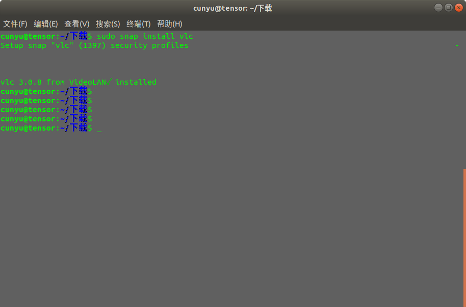

- æˆå“

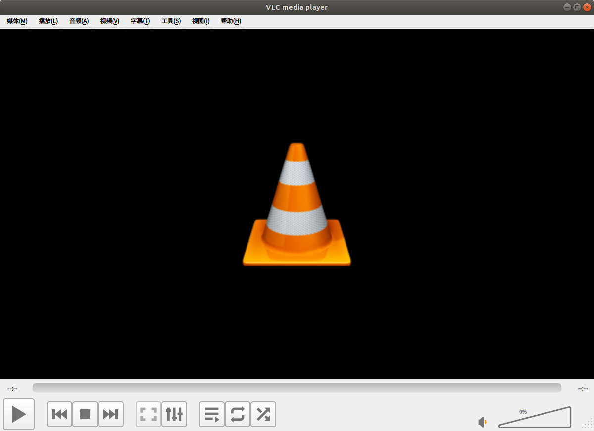

## 录å±è½¯ä»¶

-   Kazam

å°å·§è€Œå¼ºå¤§ï¼Œæ˜“安装，å³å¯é€‰æ‹©åŒºåŸŸå½•åˆ¶ï¼Œä¹Ÿå¯é€‰æ‹©å…¨å±å½•åˆ¶ï¼ŒåŒæ—¶è¿˜å…¼å…·æˆªå›¾åŠŸèƒ½ï¼›

-   安装

ç›´æ¥åœ¨ç»ˆç«¯ä¸­ä½¿ç”¨å¦‚下命令安装å³å¯ï¼š

```shell
sudo apt install kazam
```


-   æˆå“

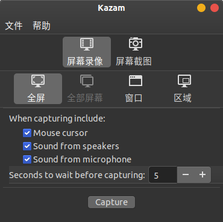

## 视频编辑软件

-   OpenShot

OpenShot 是 Linux 上的一个多用途视频编辑器，å¯ä»¥å¸®åŠ©ä½ åˆ›å»ºå…·æœ‰è¿‡æ¸¡å’Œæ•ˆæœçš„视频。

-   安装

ç›´æ¥åœ¨ç»ˆç«¯ä¸­ä½¿ç”¨å¦‚下命令安装å³å¯ï¼›

```shell
sudo apt install openshot
```

-   æˆå“

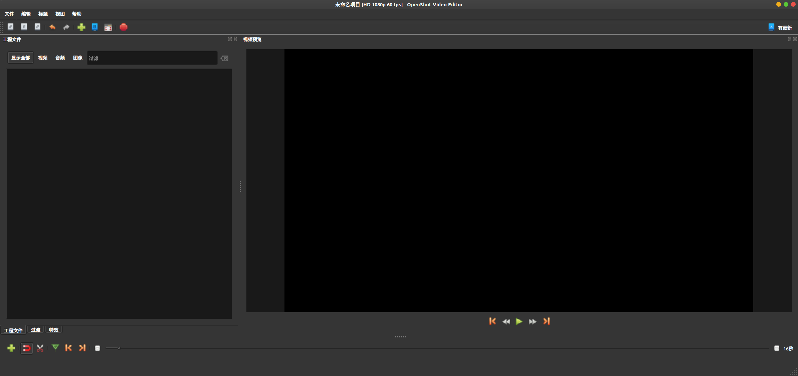

## 下载工具

- uGet

Uget（åŸå：Urlgfeï¼‰æ˜¯ä¸€ä¸ªåŸºäº GTK+ 编写的自由和开放æºç çš„下载管ç†å™¨ ，跨平å°ï¼ˆWindowså’ŒGNU / Linux的），支æŒæ–­ç‚¹ç»­ä¼ å’Œåˆ†ç±»ä¸‹è½½ ，uGet åŒæ—¶ 具备 多线程下载能力；

- 安装

```shell
sudo apt-get install uget
```

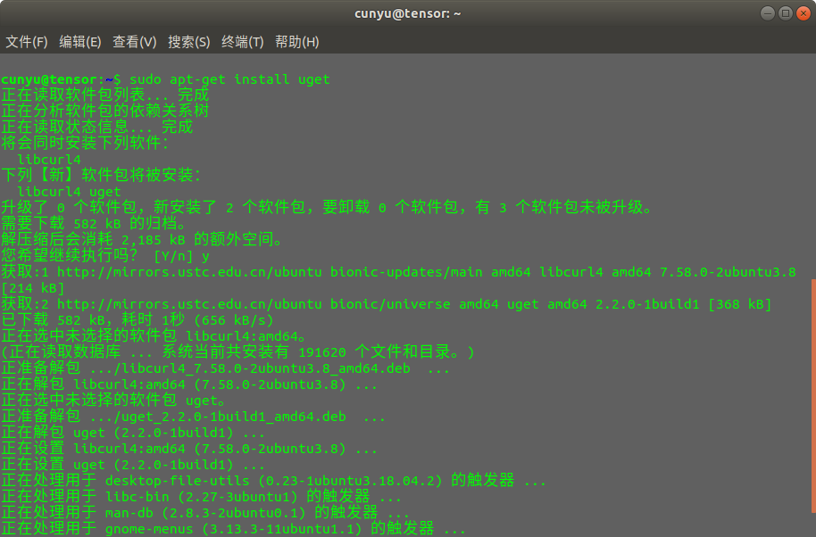

- æˆå“


# å¼€å‘ç¯å¢ƒæ­å»º

## git 安装

ç›´æ¥åœ¨ç»ˆç«¯ä¸­ä½¿ç”¨å¦‚下命令安装å³å¯ï¼›

```shell
sudo apt install git
```

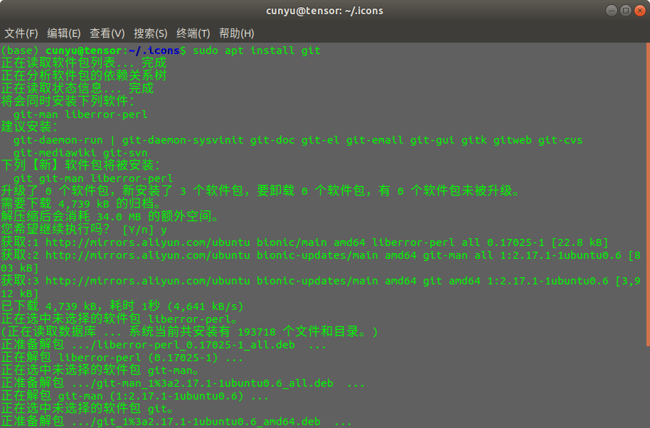

## Node.js 安装

- 安装

ä»æ·˜å®é•œåƒæº [下载](https://npm.taobao.org/mirrors/node/) 对应版本å‹ç¼©åŒ…，然å解å‹åˆ°ä½ è¦å­˜å‚¨çš„路径，比如我的是 `/home/cunyu/soft/node-v12.16.2`ï¼›

- é…ç½®

安装（解å‹ï¼‰å¥½å，在 `/etc/profile` é…置文件中é…置；

```profile
export NODEJS_HOME=/home/cunyu/soft/node-v12.16.2
export PATH=$NODEJS_HOEM:$PATH
```

- æ¢æ·˜å®é•œåƒæº

```shell
npm config set registry http://registry.npm.taobao.org/
```

- 验è¯

```shell
node -v
npm -v
```

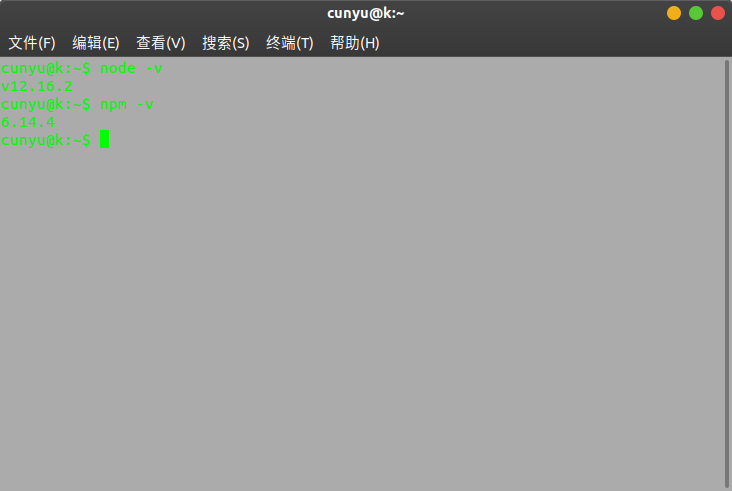

## JDK 安装

- 安装

å…ˆå» [下载](https://www.oracle.com/java/technologies/javase-downloads.html) è¦å®‰è£…çš„ JDK 版本，然å解å‹åˆ°æœ¬åœ°ï¼Œç§»åˆ°ä½ è¦å­˜æ”¾çš„ä½ç½®ï¼›

```shell
tar -zxvf jdk-11.0.7_linux-x64_bin.tar.gz 
```

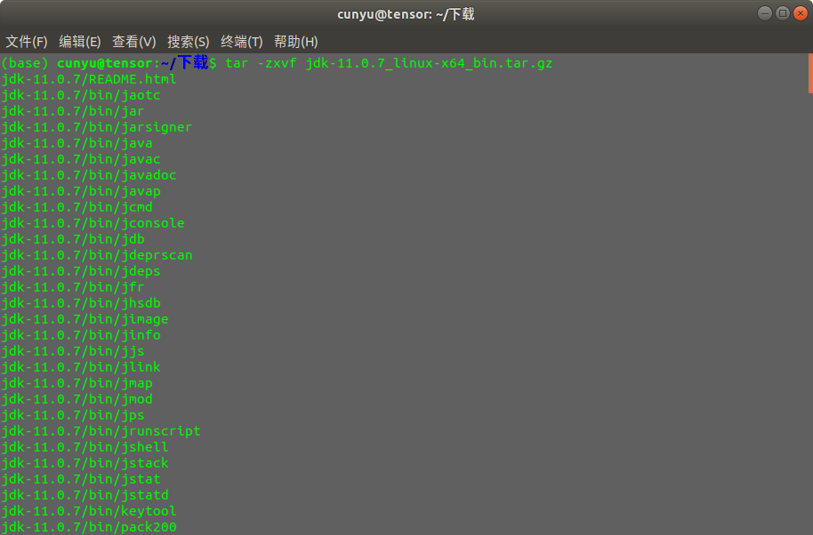

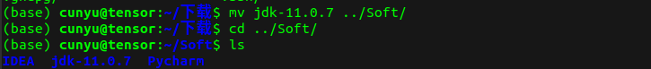

- é…ç½®

打开é…置文件 `/etc/profile`，然å加入如下内容；

```profile
export JAVA_HOME=/home/cunyu/Soft/jdk11.0.7
export PATH=$JAVA_HOME:$PATH
```

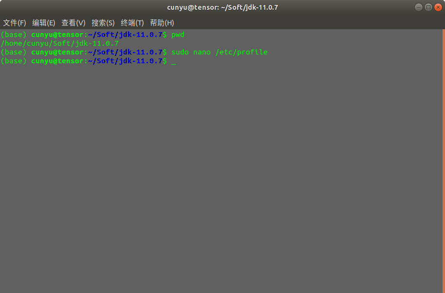

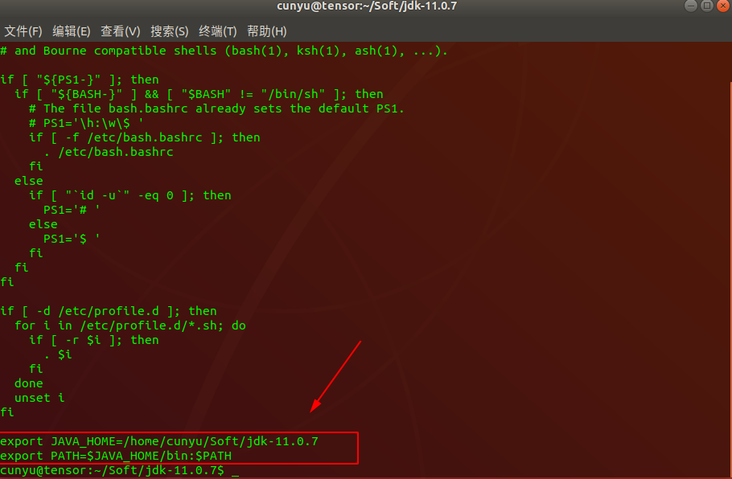

- 验è¯

安装和é…置之å，在终端中输入如下命令进行验è¯æ˜¯å¦æˆåŠŸï¼›

```shell
# 查看版本
java -version
# 编译
java
# 执行
javac
```

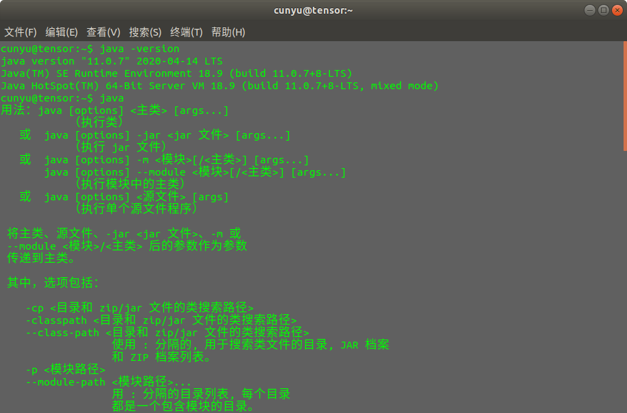

## MiniConda 安装

- 安装

ç›´æ¥å» [下载](https://docs.conda.io/en/latest/miniconda.html) 对应版本安装包，此处以 3.7 版本为例，然å在终端中对é½èµ‹äºˆæ‰§è¡Œæƒé™å执行；

```shell
chmod +x Miniconda3-latest-Linux-x86_64.sh 

sh Miniconda3-latest-Linux-x86_64.sh 
```

执行å会让你阅读相关æƒé™ï¼Œç„¶å输入 yes åŒæ„，然å会让你指定安装目录，默认就直æ¥å›è½¦å°±å¥½ï¼Œæœ€å等安装好å³å¯ï¼›

- é…ç½®

打开 `~/.bashrc` 文件，在其中加入如下 内容；

```
# 注æ„输入你自己安装 miniConda 的目录
export  PATH="/home/cunyu/miniconda3/bin:"$PATH
```

- 验è¯

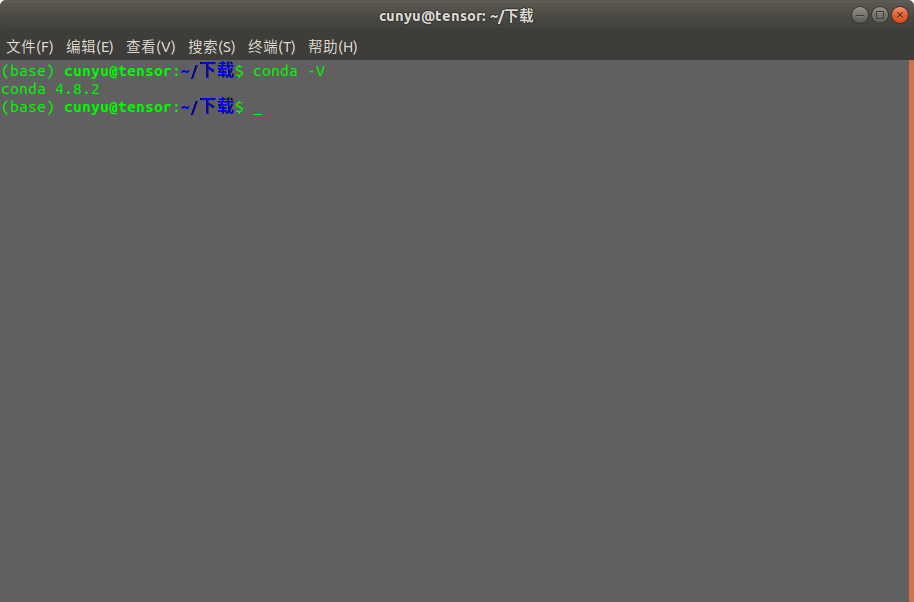

## MySQL 安装

- 安装

```shell
sudo apt-get install mysql-server
```

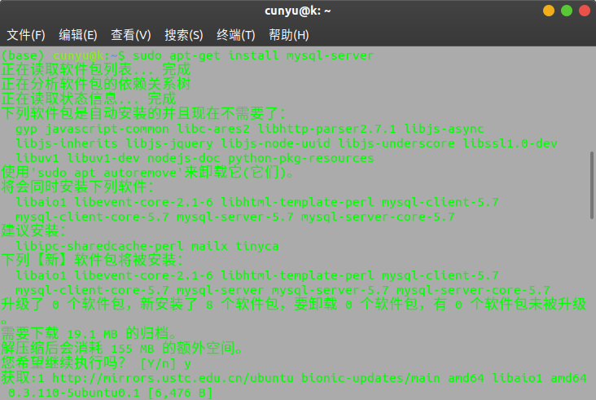

- 设置 root 用户密ç 

上述安装过程结æŸå，直æ¥ç™»å½•ï¼Œæ­¤æ—¶ root 用户没有设密ç ï¼Œéœ€è¦è¾“入密ç æ—¶ç›´æ¥å›è½¦ï¼›

```shell
myslq -u root -p
```

登录å，使用如下命令æ¥ä¿®æ”¹ root 用户密ç ï¼Œé€€å‡ºåå†æ¬¡ç™»å½•è¾“入你修改的密ç å³å¯ï¼›

```shell
SET PASSWORD FOR &#39;root&#39;@&#39;localhost&#39; = PASSWORD(&#39;ä½ è¦è®¾ç½®çš„密ç &#39;);
```

## VS Code 安装

- 安装

ç›´æ¥å» [下载](https://code.visualstudio.com/) 对应安装包，然å在终端使用如下命令安装；

```shell
sudo dpkg -i code_1.44.2-1587059832_amd64.deb
```

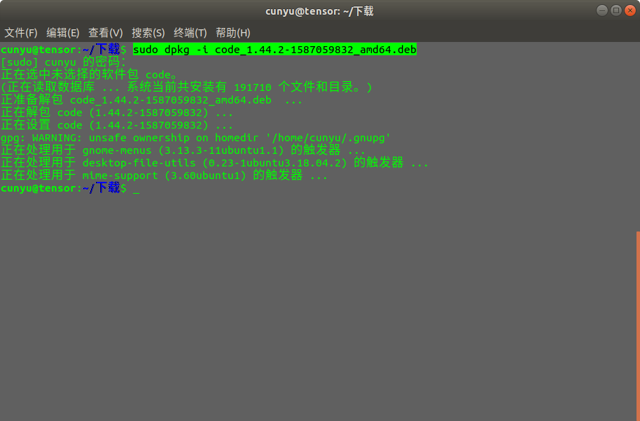

- æˆå“

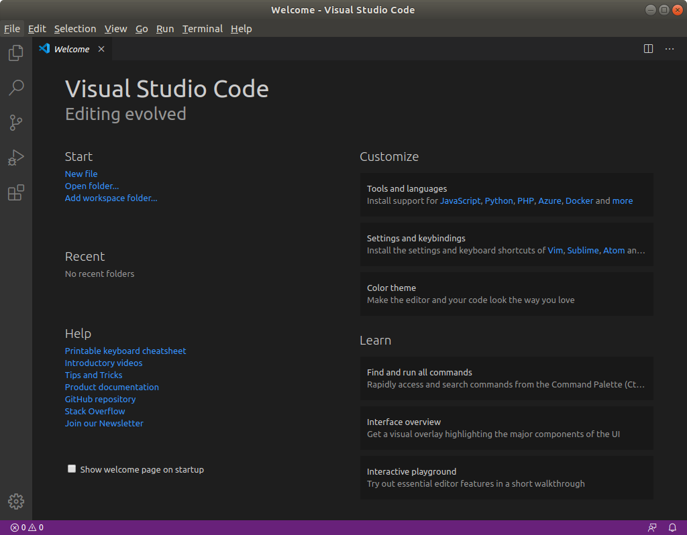

## IntelliJ IDEA 安装

- 安装

ä»å®˜ç½‘ [下载](https://www.jetbrains.com/idea/download/#section=linux)
 对应安装包，然å将其解å‹ï¼›

```shell
tar -zxvf ideaIU-2020.1.tar.gz 
```

进入 **IDEA/bin** 目录下，执行 `idea.sh` å³å¯ï¼›

- 生æˆå¿«æ·æ–¹å¼

打开 IDEA å，进入 **Configure -&gt; Create Desktop Entry**，然å输入 root 用户密ç å³å¯ï¼›

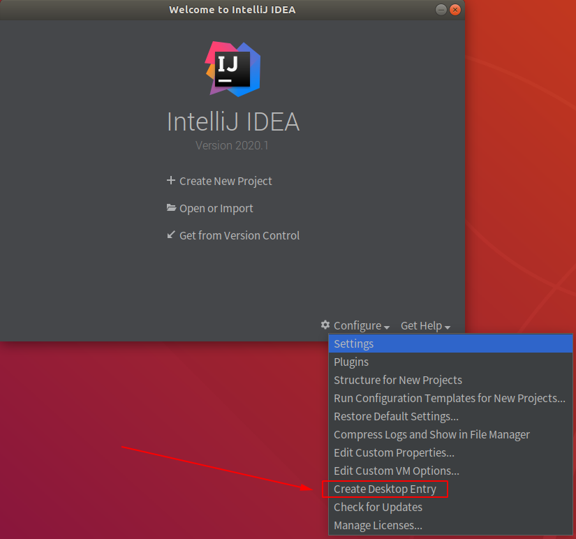

## Pycharm 安装

- 安装

ä»å®˜ç½‘ [下载](https://www.jetbrains.com/pycharm/download/#section=linux) 对应安装包，然å将其解å‹ï¼›

```shell
tar -zxvf pycharm-professional-2020.1.tar.gz 
```

进入 **Pycharm/bin** 目录下，执行 `pycharm.sh` å³å¯ï¼›

- 生æˆå¿«æ·æ–¹å¼

打开 Pycharm å，进入 **Configure -&gt; Create Desktop Entry**，然å输入 root 用户密ç å³å¯ï¼›

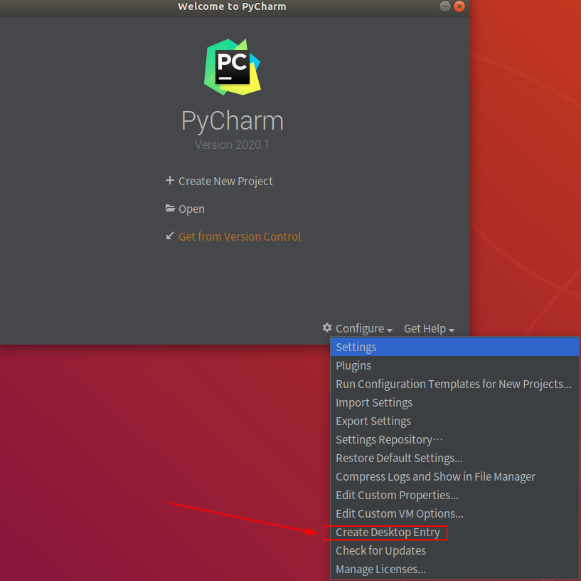

# 系统ç¾åŒ–

## Grub ç¾åŒ–

- 对äºå®‰è£…åŒç³»ç»Ÿæˆ–多系统的读者，想è¦è‡ªå·±çš„å¯åŠ¨é¡µé¢å˜å¾—好看一点，那么你一定ä¸èƒ½é”™è¿‡ã€‚

到 [这里](https://www.gnome-look.org/browse/cat/109/ord/latest/) å»é€‰æ‹©è‡ªå·±å–œæ¬¢çš„主题，然å进行安装，这里笔者选择的是 [Grub-theme-vimix](https://github.com/vinceliuice/grub2-themes)ï¼›

- 安装

把 Grub-theme-vimix 克隆到本地，然å使用如下命令进行安装å³å¯ï¼›

```shell
sudo ./install.sh -t -2 -b
```

## é”å±ç•Œé¢ç¾åŒ–

ç›´æ¥ä¿®æ”¹ç›¸å…³é…置文件：`/etc/alternatives/gdm3.css` ，然å修改代ç ä¸­çš„ `#lockDialogGroup` 部分如下å³å¯ï¼›

```
#lockDialogGroup {
  background: #2c001e       
  url(file:///home/cunyu/imgs/lock.png);
  background-size: cover;
  background-repeat: no-repeat;
  background-position: center;
}
```

## ç¾åŒ–工具安装

ç¾åŒ–之å‰ï¼Œéœ€è¦å®‰è£… gnome-tweak-tool，安装命令如下；

```shell
sudo apt-get install gnome-tweak-tool
```

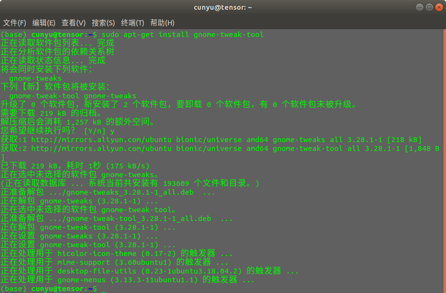

## 主题安装

- 下载

æ¨è使用这套，macos é£æ ¼çš„主题，[下载链æ¥](https://www.gnome-look.org/p/1275087/)ï¼›

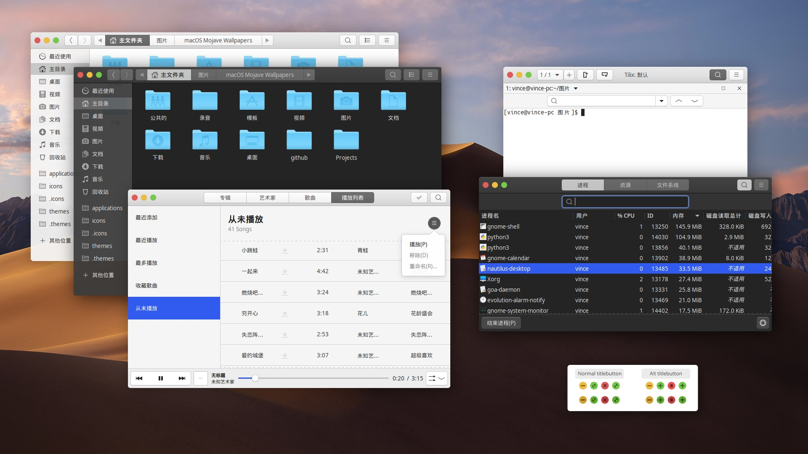

- 安装

把下载好的å‹ç¼©åŒ…解å‹ä¹‹å，移动到 `/usr/share/themes` 目录下å³å¯ï¼›

## 图标安装

- 下载

æ¨è这款图标，[下载链æ¥](https://github.com/keeferrourke/la-capitaine-icon-theme)ï¼›

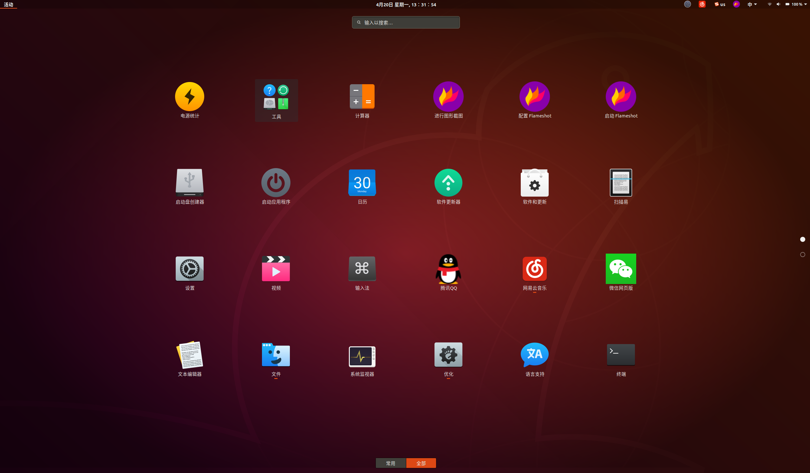

- 安装

把下载好的å‹ç¼©åŒ…解å‹ä¹‹å，移动到 `/usr/share/icons` 目录下å³å¯ï¼›

## 终端安装

- 安装

Ubuntu 自带终端已ç»å¾ˆå¼ºå¤§ï¼Œä½†æˆ‘æ›´æ¨è使用 ZSHï¼›

在终端中使用如下命令安装å³å¯ï¼›

```shell
sudo apt install zsh
```

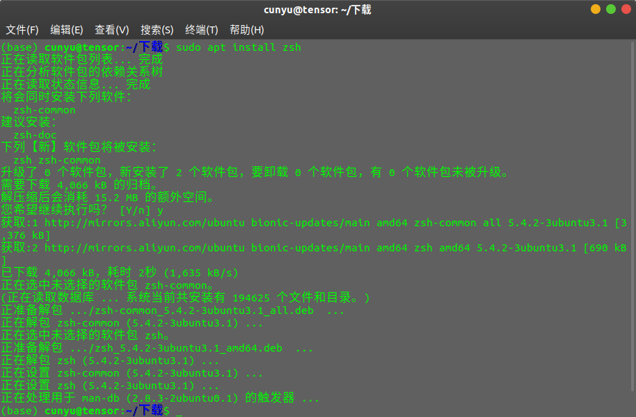

- 设为默认 Shell

```shell
chsh -s /usr/bin/zsh
```

-   ç¾åŒ–

安装 [oh-my-zsh](https://github.com/robbyrussell/oh-my-zsh)，通过如下任一命令安装；

```shell
# via crul
sh -c "$(curl -fsSL https://raw.githubusercontent.com/ohmyzsh/ohmyzsh/master/tools/install.sh)"
# via wget
sh -c "$(wget -O- https://raw.githubusercontent.com/ohmyzsh/ohmyzsh/master/tools/install.sh)"
```

也å¯ä»¥é€šè¿‡å¦‚下命令安装；

```shell
git clone git://github.com/robbyrussell/oh-my-zsh.git  ~/.oh-my-zsh
cp ~/.oh-my-zsh/templates/zshrc.zsh-template ~/.zshrc
```

安装好之å，对 zsh 进行é…置，打开 `~/.zshrc` é…置文件，进行é…置；

进入 [主题列表](https://github.com/ohmyzsh/ohmyzsh/wiki/Themes)，挑选自己喜欢的主题，然å在上述é…置中改æˆä½ å–œæ¬¢çš„主题，比如我的é…置文件如下；

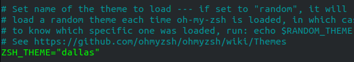

```.bashrc
# If you come from bash you might have to change your $PATH.
# export PATH=$HOME/bin:/usr/local/bin:$PATH

# Path to your oh-my-zsh installation.
export ZSH=$HOME/.oh-my-zsh

# Set name of the theme to load --- if set to "random", it will
# load a random theme each time oh-my-zsh is loaded, in which case,
# to know which specific one was loaded, run: echo $RANDOM_THEME
# See https://github.com/ohmyzsh/ohmyzsh/wiki/Themes
# 主题
ZSH_THEME="dallas"

# Set list of themes to pick from when loading at random
# Setting this variable when ZSH_THEME=random will cause zsh to load
# a theme from this variable instead of looking in ~/.oh-my-zsh/themes/
# If set to an empty array, this variable will have no effect.
# ZSH_THEME_RANDOM_CANDIDATES=( "robbyrussell" "agnoster" )

# Uncomment the following line to use case-sensitive completion.
# CASE_SENSITIVE="true"

# Uncomment the following line to use hyphen-insensitive completion.
# Case-sensitive completion must be off. _ and - will be interchangeable.
# HYPHEN_INSENSITIVE="true"

# Uncomment the following line to disable bi-weekly auto-update checks.
# DISABLE_AUTO_UPDATE="true"

# Uncomment the following line to automatically update without prompting.
# DISABLE_UPDATE_PROMPT="true"

# Uncomment the following line to change how often to auto-update (in days).
# æ¯æ¬¡æ›´æ–°çš„时间
export UPDATE_ZSH_DAYS=30

# Uncomment the following line if pasting URLs and other text is messed up.
# DISABLE_MAGIC_FUNCTIONS=true

# Uncomment the following line to disable colors in ls.
# DISABLE_LS_COLORS="true"

# Uncomment the following line to disable auto-setting terminal title.
# DISABLE_AUTO_TITLE="true"

# Uncomment the following line to enable command auto-correction.
# ENABLE_CORRECTION="true"

# Uncomment the following line to display red dots whilst waiting for completion.
# COMPLETION_WAITING_DOTS="true"

# Uncomment the following line if you want to disable marking untracked files
# under VCS as dirty. This makes repository status check for large repositories
# much, much faster.
# DISABLE_UNTRACKED_FILES_DIRTY="true"

# Uncomment the following line if you want to change the command execution time
# stamp shown in the history command output.
# You can set one of the optional three formats:
# "mm/dd/yyyy"|"dd.mm.yyyy"|"yyyy-mm-dd"
# or set a custom format using the strftime function format specifications,
# see 'man strftime' for details.
# HIST_STAMPS="mm/dd/yyyy"

# Would you like to use another custom folder than $ZSH/custom?
# ZSH_CUSTOM=/path/to/new-custom-folder

# Which plugins would you like to load?
# Standard plugins can be found in ~/.oh-my-zsh/plugins/*
# Custom plugins may be added to ~/.oh-my-zsh/custom/plugins/
# Example format: plugins=(rails git textmate ruby lighthouse)
# Add wisely, as too many plugins slow down shell startup.

# æ’件
# git

# zsh-syntax-highlighting 输入正确会绿色高亮显示，输入错误会显示其他的颜色
# git clone https://github.com/zsh-users/zsh-syntax-highlighting.git ~/.oh-my-zsh

# zsh-autosuggestions 自动建议补全
git clone git://github.com/zsh-users/zsh-autosuggestions ~/.oh-my-zsh

# extra 解å‹
# z
plugins=(
    git zsh-syntax-highlighting zsh-autosuggestions extract z
)

source $ZSH/oh-my-zsh.sh

# User configuration

# export MANPATH="/usr/local/man:$MANPATH"

# You may need to manually set your language environment
# export LANG=en_US.UTF-8

# Preferred editor for local and remote sessions
# if [[ -n $SSH_CONNECTION ]]; then
#   export EDITOR='vim'
# else
#   export EDITOR='mvim'
# fi

# Compilation flags
# export ARCHFLAGS="-arch x86_64"

# Set personal aliases, overriding those provided by oh-my-zsh libs,
# plugins, and themes. Aliases can be placed here, though oh-my-zsh
# users are encouraged to define aliases within the ZSH_CUSTOM folder.
# For a full list of active aliases, run `alias`.
#
# Example aliases
# alias zshconfig="mate ~/.zshrc"
# alias ohmyzsh="mate ~/.oh-my-zsh"
```
## 总结
好了，文章的内容到此就结æŸäº†ã€‚我主è¦ä»ç³»ç»Ÿè®¾ç½®ã€å¸¸ç”¨è½¯ä»¶å®‰è£…ã€å¼€å‘ç¯å¢ƒæ­å»ºã€ç³»ç»Ÿç¾åŒ–四个方é¢ä»‹ç»äº†è‡ªå·±å¦‚何é…置并使用 Ubuntu 的，希望也给你带æ¥ä¸€å®šçš„帮助ï¼å¦‚æœä½ æœ‰æ›´å¤šå¥½ç©çš„技巧，欢è¿ç•™è¨€äº¤æµï¼