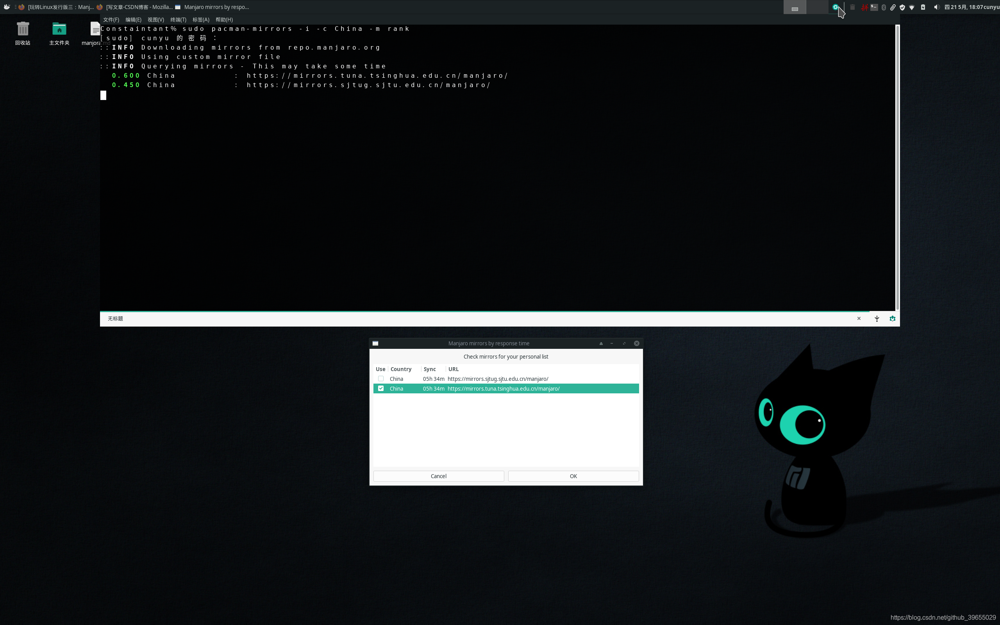
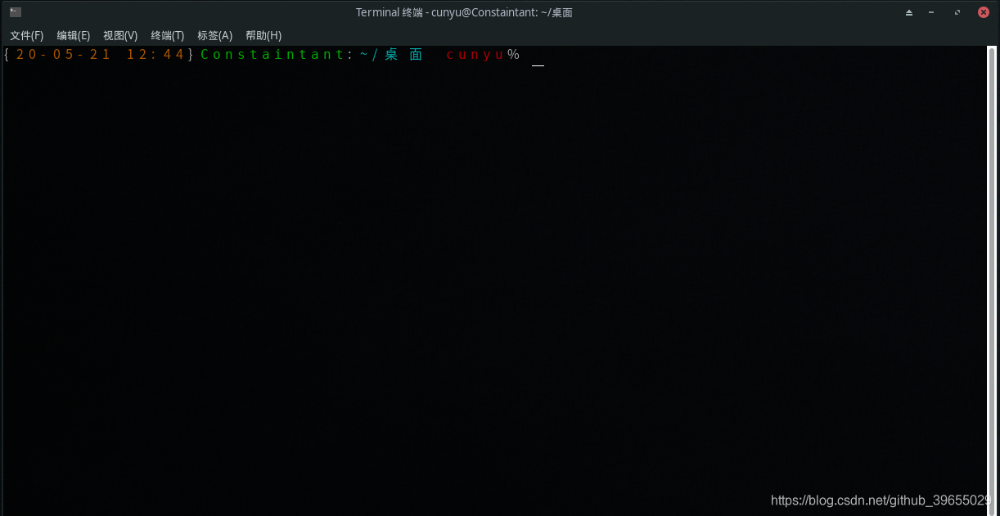

# 玩转 Manjora

> 作者：[村雨遥](https://github.com/cunyu1943)
> 
> 不要哀求，学会争取，若是如此，终有所获
> 
>

## 🎈 号外

最近，公众号之外，建立了微信交流群，不定期会在群里分享各种资源（影视、IT 编程、考试提升……）&知识。如果有需要，可以**扫码或者后台添加小编微信备注入群**。进群后**优先看群公告**，**呼叫群中【资源分享小助手】**，还能免费帮找资源哦～

<center>
 
</center>

## 0. 前言

安装好 manjora 后，基础配置往往不够我们日常需求，然后我们就需要对其进行一些改造，让其成为我们称手的工具。
先介绍下常用软件命令，后边的过程中将会频繁使用它们。

- 软件安装

```shell
pacman -S softwareName
```

- 软件更新

```shell
pacman -Syu
```

- 软件移除

```shell
pacman -R softwareName
```

## 1. 基础配置

### 1.1 配置国内源

```shell
sudo pacman -Syy
sudo pacman-mirrors -i -c China -m rank  # 选一个清华源就行
sudo pacman -Syyu
```



## 1.2 系统更新

```shell
sudo pacman -Syyu
```

### 1.3 添加 Archlinuxcn 源

打开 **/etc/pacman.conf** 文件，然后在末尾加入以下两行即可；

```.profile
[archlinuxcn]
SigLevel = Optional TrustedOnly
Server = https://mirrors.tuna.tsinghua.edu.cn/archlinuxcn/$arch
```

### 1.4 安装 anchlinuxcn 签名钥匙

进行上一步的添加后，导入 GPG key，避免在后边安装软件时提示 GPG 签名损坏问题；

```shell
sudo pacman -S archlinuxcn-keyring
```

### 1.5 中文字体安装

```shell
sudo pacman -S wqy-zenhei
sudo pacman -S wqy-bitmapfont
sudo pacman -S wqy-microhei
sudo pacman -S adobe-source-han-sans-cn-fonts
```

## 2. 软件安装

### 2.1 搜狗拼音输入法

首先安装如下软件：

```shell
sudo pacman -S fcitx-im 
# 安装fcitx-qt4可能与之前安装的有冲突，但必须安装，不然搜狗安装后无法正常使用。
sudo pacman -S fcitx-qt4
sudo pacman -S fcitx-configtool
sudo pacman -S fcitx-sogoupinyin
```

然后配置 fcitx 环境，新建 `~/.xprofile` 文件，同时添加如下内容后，重启系统即可切换搜狗中文输入法；

```profile
export GTK_IM_MODULE=fcitx
export QT_IM_MODULE=fcitx
export XMODIFIERS=“@im=fcitx”
```

### 2.2 yay

一个非常好用的 AUR 包管理器助手，用于装软件，能提供最少化用户输入的 pacman 界面、yaourt 式的搜索，同时几乎没有任何依赖软件；

```shell
sudo pacman -S yay
```

然后修改 aur 源为清华镜像；

```shell
yay --aururl "https://aur.tuna.tsinghua.edu.cn" --save
```

### 2.3 Chrome 

虽然已经自带 firefox ，但是个人还是偏好 Chrome；

```shell
yay -S google-chrome
```

### 2.4 网易云音乐

工作闲暇之余，怎么能少了音乐的陪伴呢；

```shell
yay -S netease-cloud-music
```

### 2.5 Typora

最好的 Markdown 编辑器，没有之一；

```shell
yay -S typora
```

### 2.6 WPS

作为一个生产力工具，办公工具怎么能少呢；

```shell
yay -S wps-office
```

安装后，会提示缺失字体，可以通过安装字体解决；

```shell
yay -S ttf-wps-fonts
```

针对打开后菜单栏是英文的情况，可以安装 WPS 中文语言包后切换即可；

```shell
yay wps|grep zh
```

安装好之后，切换即可；


### 2.7 flameshot

非常好用的截图软件，不仅支持批注等基础功能，还支持上传图片到图床；

```shell
yay -S flameshot
```

### 2.8 git

```shell
yay -S git
```

安装后配置；

```shell
git config --global user.name "xxxx"
git config --global use.email "xxx@qq.com"
ssh-keygen -t rst -C "xxx@qq.com"
```

### 2.9 zsh

这是一款强大的 shell，推荐使用，使用如下命令安装；

```shell
yay -S zsh
```

安装好之后，将其设置为默认 shell，然后重启 shell 即可生效；

```shell
chsh -s /bin/zsh
```

然后安装 **oh-my-zsh** 即可；

```shell
git clone git://github.com/robbyrussell/oh-my-zsh.git ~/.oh-my-zsh
cp ~/.oh-my-zsh/templates/zshrc.zsh-template ~/.zshrc
```

然后可以在配置文件中配置 `~/.zshrc` 我们喜欢的主题，以及安装相关插件后进行配置激活，常用的插件推荐如下；

- **extract**

用于解压文件，不管什么压缩文件，都可以用如下命令进行解压，不用再记忆参数；

```shell
x filename
```

- **zsh-autosuggestions**

自动建议补全；

```shell
git clone https://github.com/zsh-users/zsh-autosuggestions ~/.oh-my-zsh/custom/plugins/zsh-autosuggestions
```

- **zsh-syntax-highlighting**

语法高亮显示；

```shell
git clone https://github.com/zsh-users/zsh-syntax-highlighting.git ~/.oh-my-zsh/custom/plugins/zsh-syntax-highlighting
```

然后在配置文件中加入如下配置即可：

```profile
# 主题
ZSH_THEME="dallas"
# 插件
plugins=(
    git zsh-syntax-highlighting zsh-autosuggestions extract z
)
```



### 2.10 utools

效率工具神器；

```shell
yay -S utools
```

### 2.11 XMind

思维导图工具；

```shell
yay -S xmind
```

### 2.12 okular

PDF 阅读器；

```shell
yay -S okular
```

### 2.13 微信

```shell
yay -S wechat
```

### 2.14 QQ

```shell
yay -Sy deepin.com.qq.office
```

解决字体发虚的问题：

```shell
yay -S lib32-freetype2-infinality-ultimate
```

### 2.15 坚果云

```shell
yay -S nutstore
```

### 2.16 百度网盘

```shell
yay -S baidunetdisk-bin
```


## 3. 开发环境

### 3.1 IntelliJ IDEA

最强 Java IDE；

```shell
yay -S intellij-idea-ultimate-edition
```

### 3.2 VSCode

微软家自己出的编辑器；

```shell
yay -S visual-studio-code-bin
```

### 3.3 Postman

Web 开发利器；

```shell
yay -S postman-bin
```

### 3.4 Pycharm

一款 Python IDE；

```shell
yay -S pycharm-professional
```

### 3.5 JDK

输入如下命令，然后选择想要安装的版本安装即可；

```shell
yay jdk
```

安装之后可以用如下命令查看已有 JDK 版本，然后设置默认 JDK 版本；

```shell
# 查看已有 JDK
archlinux-java status

# 设置默认版本
sudo archlinux-java set java-11-openjdk
```

### 3.6 MySQL

-   数据库安装；

```shell
yay -S mysql
```

-   初始化数据库，此时会生成数据库登录密码，记得保存

```shell
sudo mysqld --initialize --user=root --basedir=/usr --datadir=/var/lib/mysql
```

-   启动数据库

```shell
sudo systemctl start mysqld
```

-   登录并修改密码

```shell
# 登录，密码是刚才初始化时生产的密码
mysql -u root -p 

# 修改密码
ALTER USER 'root'@'localhost' IDENTIFIED WITH mysql_native_password BY '新密码';

# 使得密码生效
FLUSH PRIVILEGES;
```
- 然后退出后重新登录时使用修改后的密码即可；
## 总结
好了，以上就是我自己在使用 Manjora 过程中所摸索出来的经验了。主要从基础配置、系统更新、软件安装、开发环境搭建几个方面进行了展开介绍。如果你也恰好在使用 Manjora，那就一起交流交流吧！