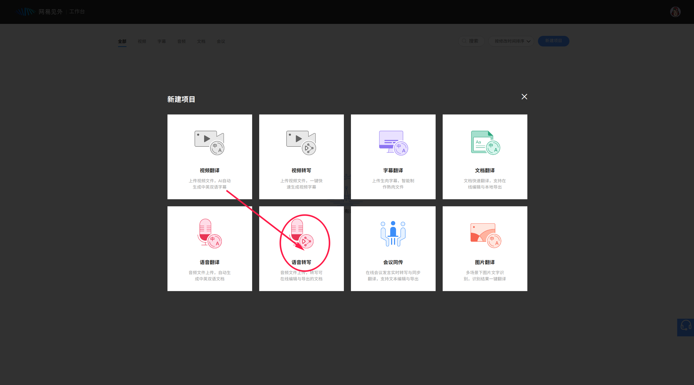
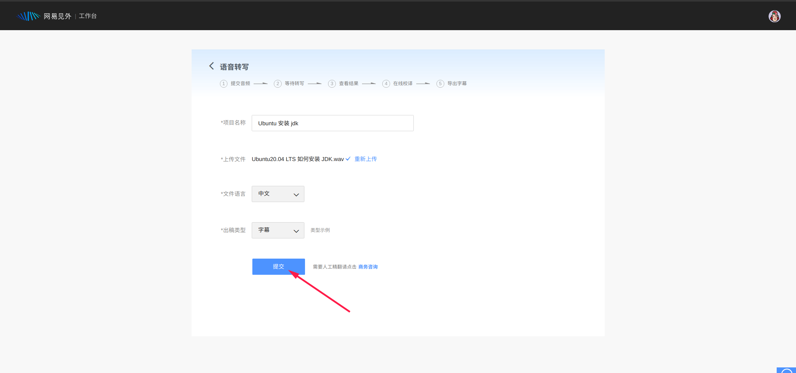
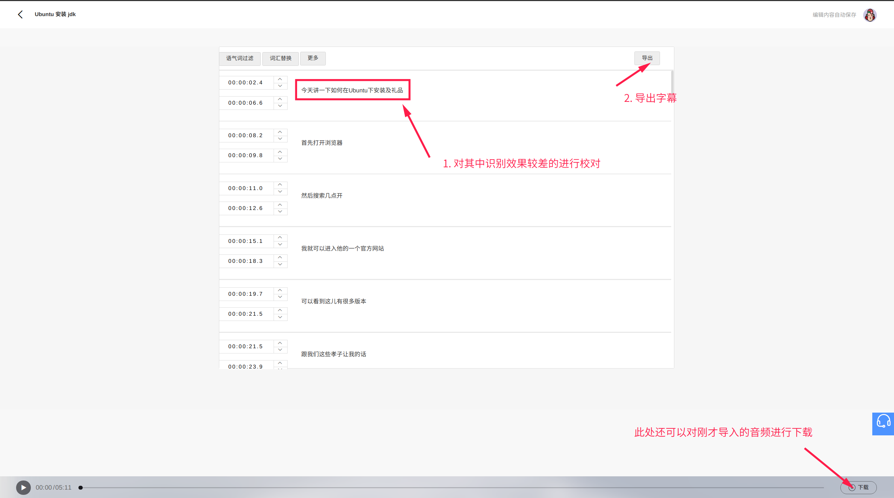
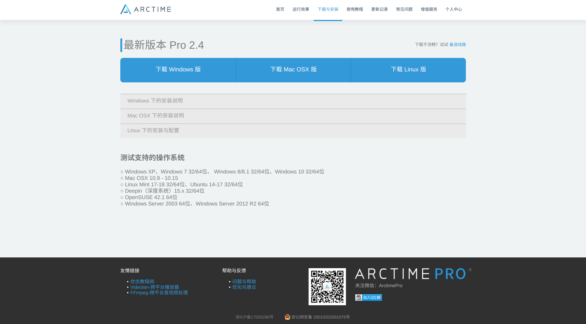
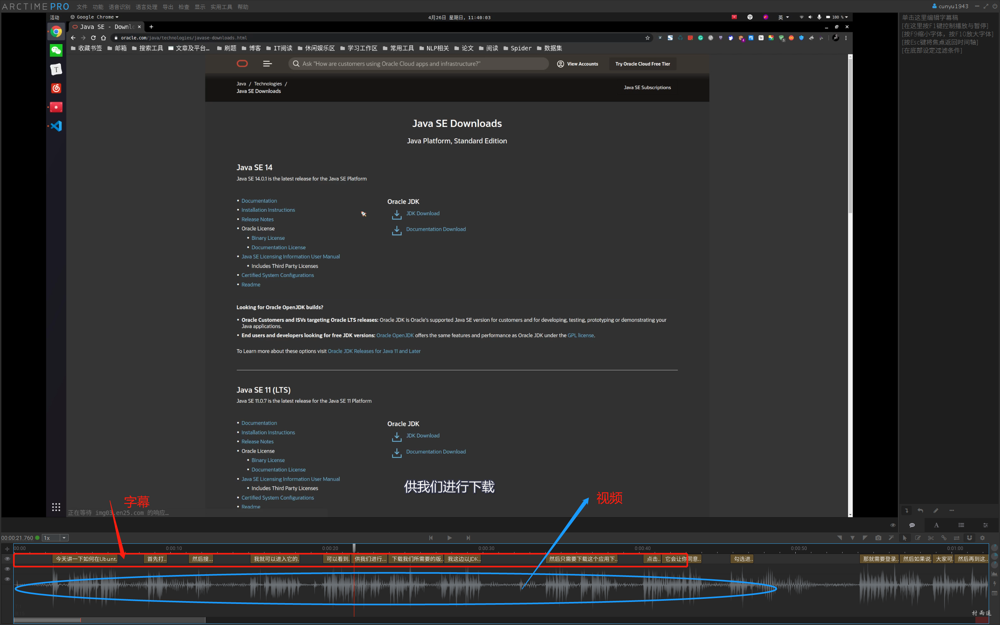
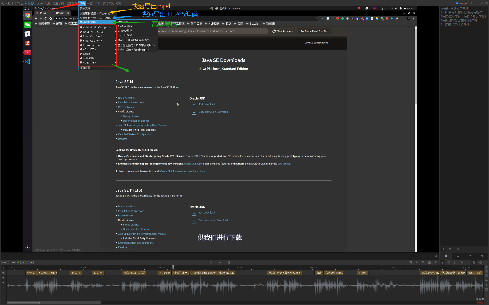

# 免费给视频加字幕

## 前言

自己在制作视频的过程中，难免需要给自己的视频加入字幕，从而方便观众理解。这篇文章就是手把手教你如何免费给自己的视频加上字幕。

## 前期准备

开始制作之前，需要做一些准备工作，下边这是就是给视频免费制作字幕的必要准备：

1. **视频素材**，这是先决要素，没视频咋做。
2. **音频素材**，通过视频提取出来的音频素材，这是为了下边做字幕做准备。
3. **[网易见外](https://jianwai.youdao.com/)**，AI智能语音转写听翻平台，通过建立一个网易账号即可登录。
4. **[ArcTime](http://arctime.cn/index.html)**，简单、强大、高效的跨平台字幕制作软件。

## 字幕制作

好了，有了上边的准备工作之后，接下来就可以进行视频字幕的制作了。

### 视频转音频

首先呢，我们先把自己录制的视频转成音频，供下边的步骤使用。视频转音频的方法很多，比如使用 PR 等专业软件进行提取，此处介绍一个在线提取的网站 [蜜蜂剪辑](https://beecut.cn/extract-audio-online)，如下图所示。只要把我们要转换的视频拖进来，然后就可以进行提取了，此外还有客户端进行下载，对于比较小的视频完全够用了。如果你的视频资源较大或者出于一些其他原因，那还是推荐你使用 PR 等专业软件进行提取。

### 音频转字幕

好了，有了上一步中的音频之后，我们就可以进行转字幕工作了。

首先注册并登录 [网易见外](https://jianwai.youdao.com/) 工作台，登陆后见面如下图所示。接着进行音频转字幕工作，步骤如下：

1. 点击右上方新建项目，选择 **语音转写**

2. 填写项目名，上传音频文件，需要输出的字幕语言（中、英），以及出稿类型（文本还是字幕）

3. 进行提交，等待转写

4. 提交后等待一段时间，一般是几分钟，然后就可以对字幕进行编辑，对其中识别的错误进行改写

5. 对识别结果进行校对，然后就可以直接导出字幕文件了

6. 字幕制作到此成功，接下来就是将字幕添加到视频中了。

## 合并视频+字幕

到这一步只有，视频和字幕资源我们都有了，接下来就需要借助 [ArcTime](http://arctime.cn/index.html) 这款软件来将视频和字幕合并。

1. 先去 [官网下载](http://arctime.cn/download.html) 对应系统的软件，里边已经有详细的说明，在此就不再赘述安装过程

2. 安装后打开软件，导入视频和字幕素材，并将其拖动到下边的轨道中，开头对齐即可

3. 然后可以在这里进行再次校对，点击字幕栏就可以进行编辑
4. 再次校对结束后，就可以直接对文件进行导出了，还可以导出到其专业软件中进行再次编辑

## 总结

经过上边的过程之后，就可以给你的视频加上字幕了。简单且快速，最重要的免费哟。