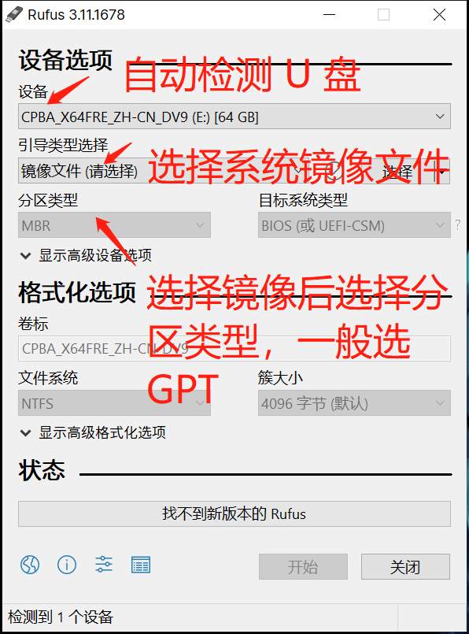
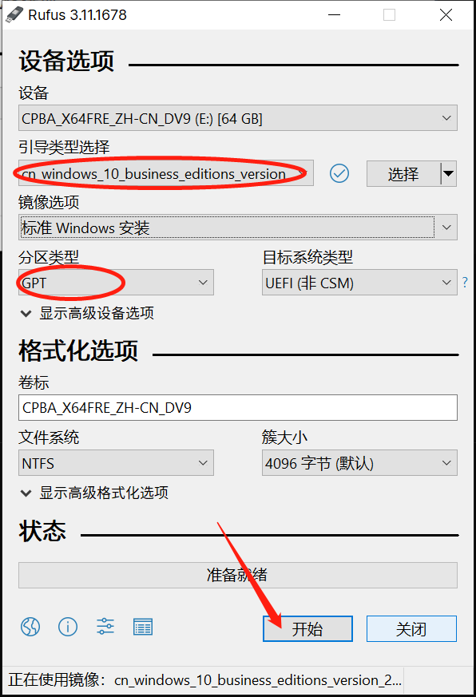
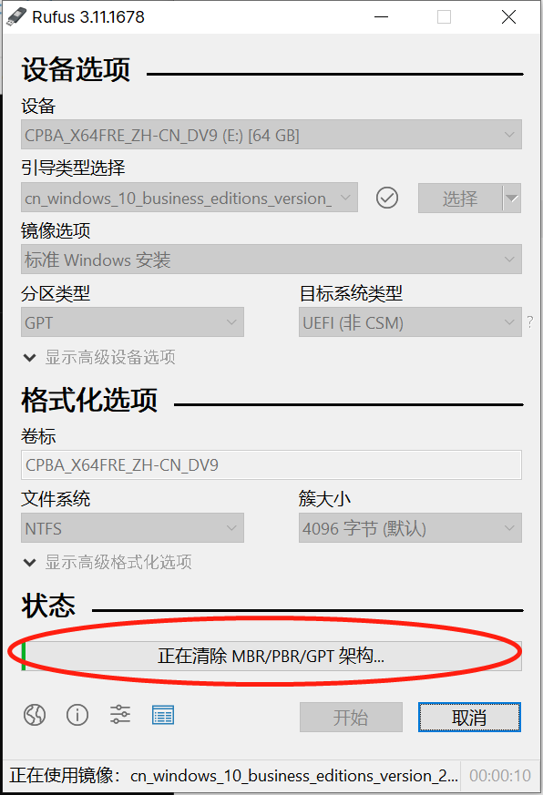
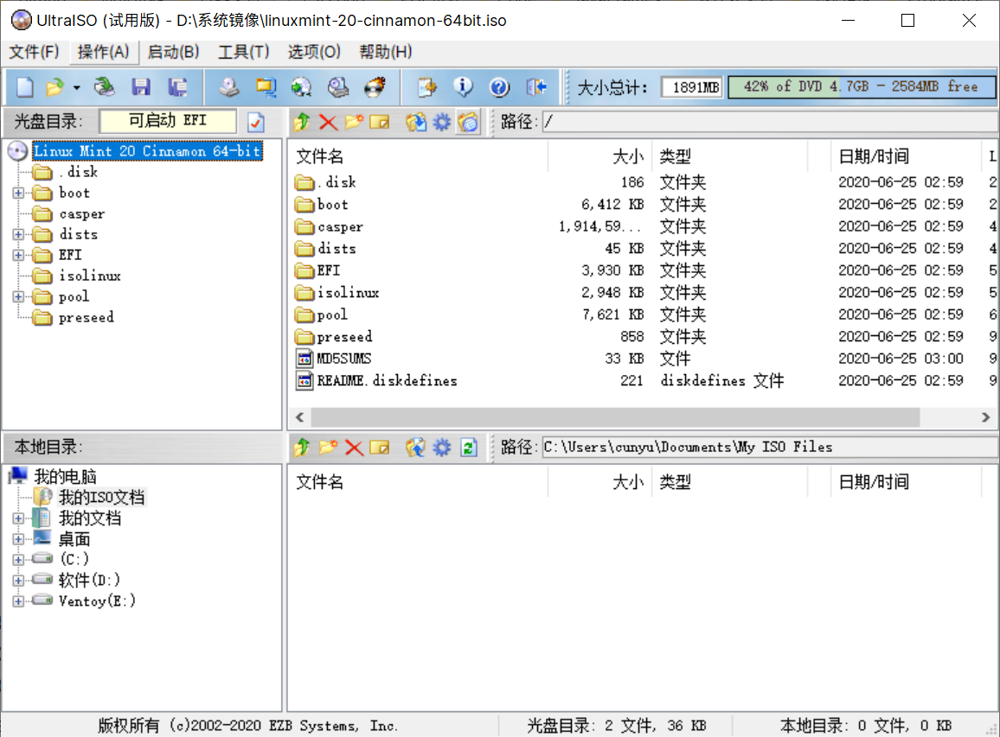
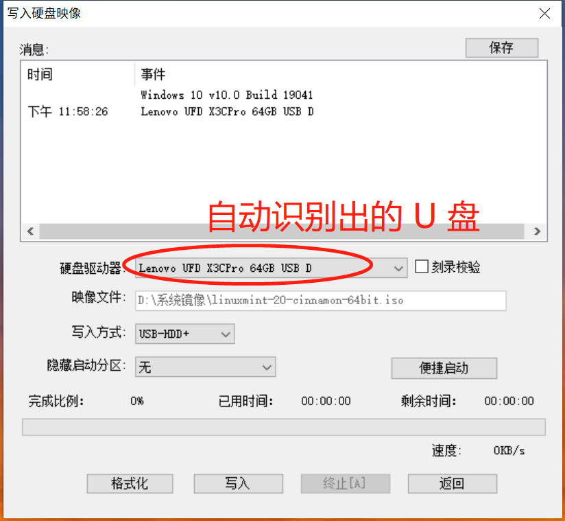
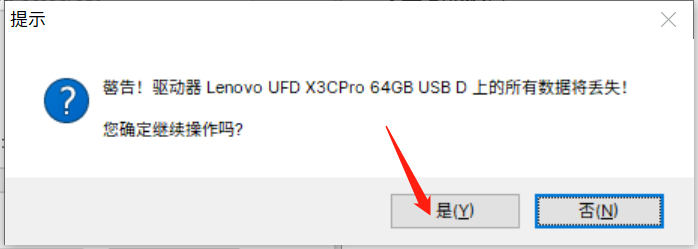
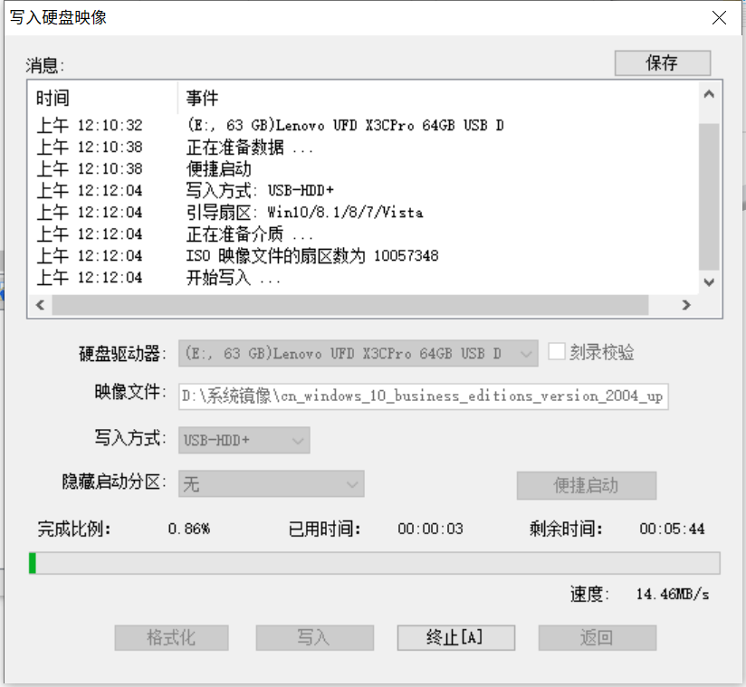
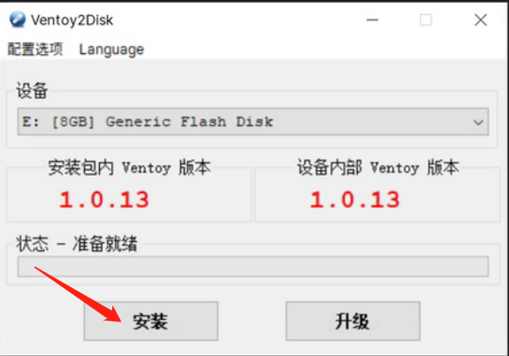

# 制作 U 盘启动盘

## 1. 前言

在我们日常使用电脑的过程中，难免会遇到电脑卡顿的情况，大多时候我们可以通过重装系统的方式来让我们的电脑重焕新生。但是这时候就遇到个难题呀，不会装系统咋办？？？去电脑城或者维修店花钱装？    

作为我的读者，怎么可能让你花那么多钱就为了装个系统呢，留着买吃的他不香么？

那今天咱就来聊聊，怎么装系统！在正式开始装系统之前呢，我们需要做一些准备工作，那就是先得搞个系统启动盘呀。当然了，你可能说直接解压安装也行呀，但那样个人觉得始终安装不干净，还是有之前系统残留的一些东西。所以今天就来看看，怎么制作一个系统启动盘！

在日常安装系统时，最好制作 U 盘启动盘来安装，而且往往需要每个系统做一次，既然这么麻烦，那有没有办法只做一次启动盘，然后每次换不同系统只要拷贝镜像文件即可呢？答案是：**当然有了！！！**。今天呢，就教给你们两种办法，一种是每次都需要制作的方式，而另一种呢则是一次制作，多次使用的方式！

这里推荐大家使用 U 盘来制作启动盘，而且 **U 盘的容量最好是在 8G+**，而且在制作系统启动盘之前呢，一点要注意：

>   **请一定事先备份好 U 盘中的重要资料！**
>
>   **请一定事先备份好 U 盘中的重要资料！**
>
>   **请一定事先备份好 U 盘中的重要资料！**

重要的事情说三遍，那么接下来我们就分别介绍两种制作系统启动盘的方式。

## 2. 单次单系统

这里又可以分为两种方式，一种是 Refus，另一种是 UltraISO，大家可以根据自己的喜好来进行选择，那么我们就来正式开始吧！

### 2.1 Refus：http://rufus.ie/

Refus 十一款 Windows 下十分小巧强大的刻录软件，打开即用，十分方便，以下介绍如何通过 Refus 制作 U 盘启动盘的具体过程。

1.  到上面给的链接下载好 Refus 后，不用安装，双击打开即可，打开后的界面如下：

2.  然后选择镜像文件，然后选择分区类型，最后点击 **开始** 即可；

3.  点击开始之后，会提示格式化 U 盘，确定后等待完成即可，之后我们就能得到一个刻录好的 U 盘启动盘了；

### 2.2 UltraISO：https://cn.ultraiso.net/

UltraISO（软碟通）是一款老牌的刻录工具，虽然可以免费提供试用，但是有广告。如果无法忍受这一点，可以自己去网上找找破解版，又或者自己买一个正式版本，下面就介绍利用 UltraISO 制作 U 盘启动盘。

1.  插入 U 盘，打开 UltraISO，然后在 **文件 -> 打开** 准备好的系统镜像文件；

2.  然后点击 **启动 -> 写入硬盘映像…**，此时会自动识别出 U 盘；

3.  不用修改其他配置，直接点击 **写入**，此时会提示操作会格式化 U 盘，点击 **是** 即可；

4.  点击是之后，此时开始刻录过程，等待刻录完成，退出软件即可，此时我们就得到了一个刻录好的 U 盘启动盘了，拿它去安装系统就可以了！

## 3. 单次多系统

通过上面的方式我们每次都需要重新制作一次系统盘，尤其是当系统版本升级或者系统不同时，那这就很麻烦呀。

那接下来我们就来看看，一次制作，多次使用的方式。不管你是系统版本升级还是系统不同，只要制作好了，你把系统镜像拷到 U 盘里边，你就能直接用了，方便的一批！那接下来就开始正式工作！

### 3.1 准备工作

今天的主角就是：**Ventoy**，一个新一代的多系统启动 U 盘解决方案，支持 Windows 和 Linux，其官网地址是：

>   https://www.ventoy.net/cn/download.html

### 3.2 具体步骤

首先从官网上下载 Ventoy 之后，就可以动手实操了：

1.  首先插入 U 盘；
2.  双击打开下载好的 Ventoy 安装包，不需要安装，打开即用；
3.  然后 Ventoy 会自动识别 U 盘，然后点击安装即可；

4.  开始安装前会提示抹除 U 盘数据，所以需要先将 U 盘中的资料备份好，然后等待安装过程结束即可；
5.  接下来，将我们要安装的系统镜像拷贝到我们的 U 盘即可，然后就可以用来安装系统了；

### 3.3 视频教程

为了方便大家，单次多系统部分我还制作了视频教程，欢迎移步 B 站观看，记得关注投币一键三连哦 😘😘😘！

详情请戳：https://www.bilibili.com/video/BV1MA411i7gj

## 4. 总结

通过上面的学习呢，大家应该都已经能独立完成 U 盘启动盘的制作了。但是不要高兴得太早，这才只是个准备工作呢。开玩笑开玩笑，其实只要把启动盘做好了，我们装系统的工作就算完成了一半了，接下来就是正式安装了。但今天呢讲的已经够多了，我得去休息休息了。