# 手把手 Windows 系统安装教程

## 前言

最近女朋友由于工作原因，一直缠着我教她装系统（连系统都不会装，大（la）佬（ji））。

嘘！！！小声 BB，别让她听见了，🤣🤣🤣。那没有办法呀，女朋友的话，你敢不听么，🤪🤪🤪。

于是就有了之前的如何制作 U 盘启动盘和这篇文章，手把手教她如何安装 Windows 系统。也可以扔给你的女朋友看看，我不介意的哈 😏😏😏。

接下来就是正文部分了，各位看官准备好，那么开始之前，我们先来看看一些基本常识，备好小板凳和瓜子！

###  什么是 BIOS？

> BIOS 是英文 "Basic Input Output System" 的缩略词，直译过来后中文名称就是"基本输入输出系统"。**其实，它是一组固化到计算机内主板上一个 ROM 芯片上的程序**，它保存着计算机最重要的基本输入输出的程序、开机后自检程序和系统自启动程序，它可从 CMOS 中读写系统设置的具体信息。其主要功能是为计算机提供最底层的、最直接的硬件设置和控制。此外，BIOS 还向作业系统提供一些系统参数。系统硬件的变化是由 BIOS 隐藏，程序使用 BIOS 功能而不是直接控制硬件。

上面来自百度百科，说白了我们了解这些基本没啥用，我们只想知道装系统为啥要涉及到 BIOS。这么说吧，BIOS 就是能够让我们正常打开电脑工作的重要工具。这么一说就明白了吧。

我们装系统，其实也不用改 BIOS 里边的其他设置，一般来讲只用 **调整系统的启动介质的启动顺序。** 一般正常的都是优先从硬盘启动，而我们要通过 U 盘安装，所以我们要做的只是：

> ✅✅✅
>
> **将 U 盘启动项调整到最前面，让它作为启动介质的优先级最高。**

要进入 BIOS 的方式一般来讲就是：**开启电脑笔记本电源后，狂按 F2，然后一般就会听见 “哔” 的一声，这说明我们成功进入 BIOS 设置面板。**

当然了，对于大多数电脑是 **F2**，但实际上不同电脑厂家对应有不同的启动键，而且就算同一家的笔记本和台式机也可能不同，所以具体启动键可以在 **进入之前建议百度一下对应电脑的启动键**，一般的电脑厂商对应的 BIOS 启动键如下（只是部分，如果不知道是那一个，可以去网上百度对应型号电脑的启动键，一般都能找到）：

| 电脑厂商 | 启动键 |
| -------- | ------ |
| Lenovo   | F2     |
| Asus     | F2     |
| DELL     | F2     |
| HP       | F10    |
| Acer     | F2     |

### MBR vs GPT

具体介绍就不展开了，如果想要进一步了解，推荐阅读：https://zhuanlan.zhihu.com/p/26098509。你只需要记住，现在的新电脑一般都是硬盘 GPT 模式，刻录 U 盘启动盘时选择 GPT 模式，一般是不会出错的。如果电脑稍微老一点的，选用 GTP 模式刻录后，安装会失败，此时选用 MBR 模式，一般就能解决这个问题。

## 准备工作

既然要装系统，那么首先你需要事先准备好如下的工具：

1.  **一个 8G 及以上内存的 U 盘**
2.  **Windows 系统镜像**
3.  **刻录软件**

### 8G + 内存的 U 盘

要装系统，虽然可以直接直接下载到本地后解压安装，但是更推荐使用 U 盘安装，此时就需要准备一个最小内存为 8G 的 U 盘（现在 Windows 系统镜像大小一般都超过了 4G）。然后需要注意一点：

> ⚠⚠⚠
>
> **一定要事先把 U 盘中的重要文件进行备份 ❗❗❗，因为刻录时会抹除 U 盘中原有内容。**

### Windows 系统镜像

要装系统，下一个纯净的镜像是十分重要的，因为现在网上大多都是经过植入一定软件，就算到时候自己卸载，也很麻烦，而且也保证不了别人往里边注入了啥软件，安全性也未可知，所以此处 **推荐在官方进行下载**。但是官方下载很慢呀，所以此处推荐两个下载渠道：

1.  **MSDN**

**https://next.itellyou.cn**

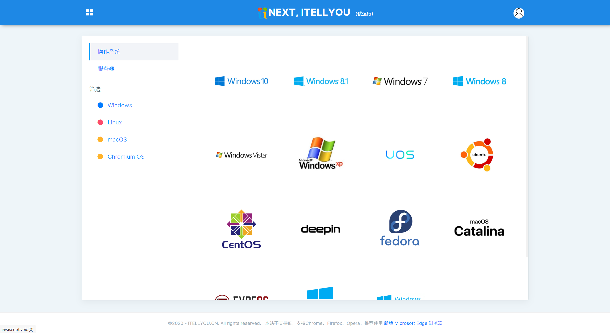

这是一个老牌的 Windows 系统下载的网站，上图是进行改版后的界面，如果你想要访问之前的老版本网站，请移步：https://msdn.itellyou.cn/. 新版本的 MSDN 中，不仅仅提供 Windows 系统的下载，还包括 Linux、MacOS 和 Chromium OS 等系统的下载，比之前所提供下载的系统更丰富了。比如我们选中 Windows 10 的 2004 版后，只要复制 BT 或 ED2K 到相关下载软件（一般是迅雷）中，添加新任务进行下载即可。

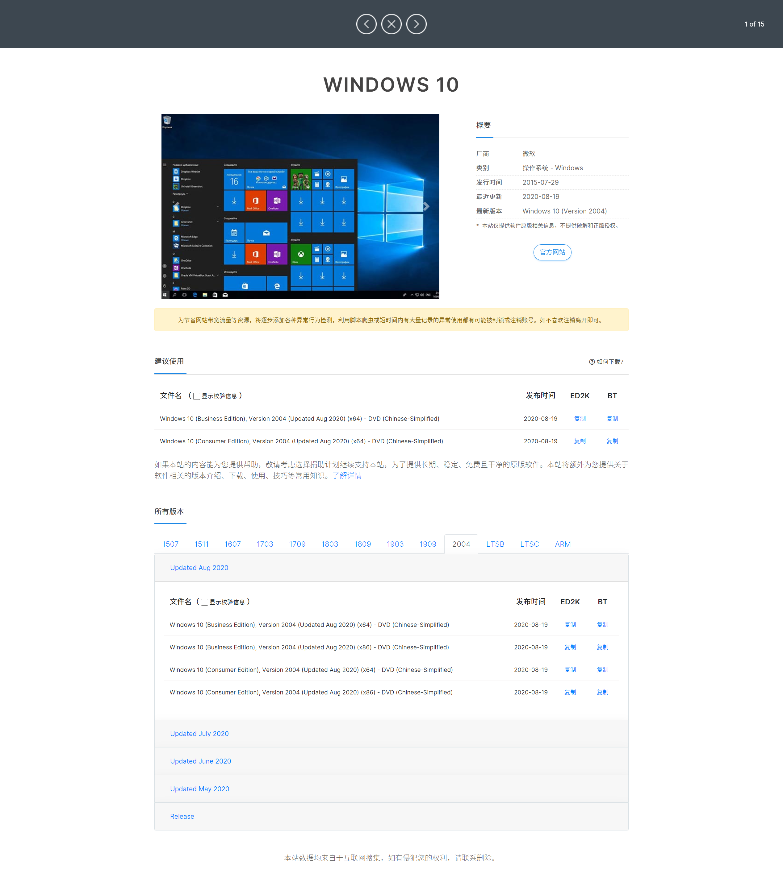

2.  **TechBench**

**https://tb.rg-adguard.net/public.php**

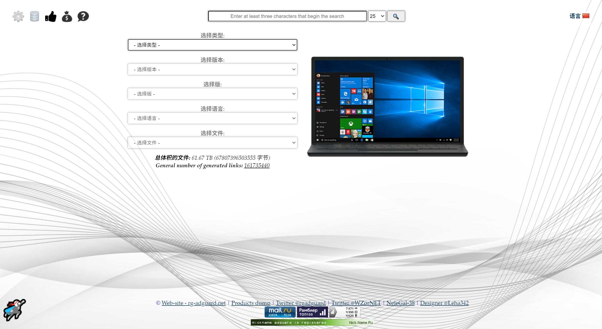

如上图，如果你不想通过种子的方式进行下载，那这个方式一定适合你。它无需通过其他下载工具进行下载，只需要选中系统类型、版本、版、语言以及文件后，右侧就会出现一个下载按钮，然后点击下载按钮就会进行下载，十分方便，如下图中我以 Windows 10 2004 版简体中文的 64 位系统，选中后点击下载进行下载即可。

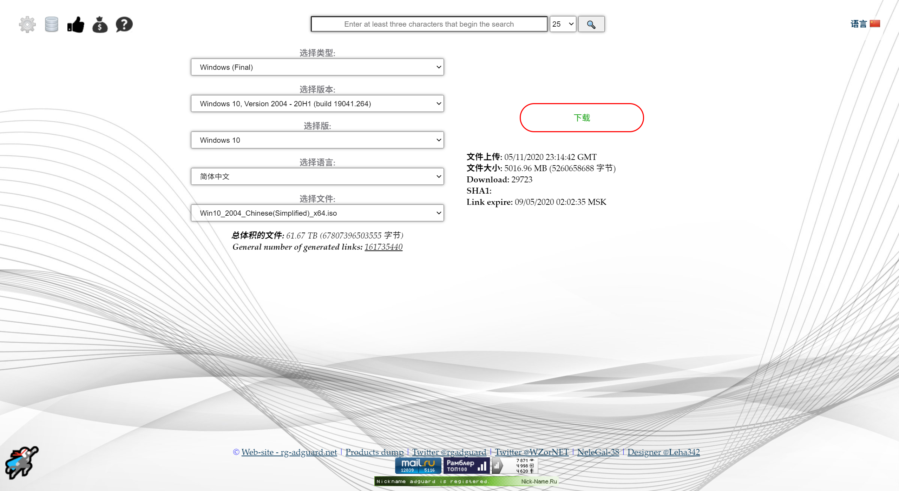
### 刻录软件

这一部分其实昨天都已经说过了，鉴于有的读者可能不爱翻了，就在这儿再啰嗦几句。

网上有很多刻录软件，比如什么老毛桃、大白菜等等，但是这些刻录软件都有个毛病：客户端不仅大，而且刻录后安装好系统里边会植入某些软件（别问我咋知道，这是自己当初是小白时一一踩过的坑 😭😭😭），本来我们就想要纯净的，这就很烦了。所以在此推荐几个刻录软件：

1.  **Ventoy**

**https://www.ventoy.net/cn/index.html**

这是一个支持 Windows 和 Linux 双平台的刻录软件，**不需要进行安装，打开即用**。最大的特点就是：**可以一次制作，多次使用，即支持多系统**。我们只需要刻录一次，然后将我们的系统镜像拷到 U 盘中就行了（不管你的系统是 Windows 还是 Linux），具体使用可以参照我的另一篇文章 如何一次制作多系统启动盘。

2.  **Refus**

**https://rufus.ie/**

这是一个 Windows 下小巧而强大的刻录软件，如果 **只是需要刻录某一个系统的启动盘，可以优先考虑这个软件，** 具体使用过程请参见 [制作 U 盘启动盘的两种方式](https://mp.weixin.qq.com/s?__biz=MzIyNTg2MjkzNw==&mid=2247492186&idx=1&sn=f5f51614b6d7de666f90aa7e4484f6d8&chksm=e87b962cdf0c1f3ae0889f530e7b8a6f95188f54eeb1d1773bed7c7568d0b302c4c58b6f885d&token=2004299281&lang=zh_CN#rd)

3.  **UltraISO**

**https://cn.ultraiso.net/**

UltraISO 软碟通是一款功能强大、方便实用、老牌优秀的光盘映像文件制作/编辑/转换工具。不仅可以直接编辑 ISO 文件，从 ISO 中提取文件和目录；也可以从 CD - ROM 制作光盘映像或者将硬盘上的文件制作成 ISO 文件；同时还可以处理 ISO 文件的启动信息，从而制作可引导光盘。使用 UltraISO，你可以随心所欲地制作/编辑/转换光盘映像文件。但是有个问题就是：**虽然 UltraISO 可以免费用，但是是有广告的，如果你比较烦广告，那你就得花钱购买。** 具体使用教程请参见 制作 U 盘启动盘的两种方式。

## 安装过程

经过上面的准备过程之后，我们整理下现在手里的资源。不出意外地话，你应该已经手拿一个刻录好的系统启动盘（即刻录进系统镜像的 U 盘）。看吧，搞了半天，最后需要的就是这个玩意儿，是不是很简单 🤣🤣🤣。那接下来，我们就来开始安装过程吧。

### 设置 BIOS 启动顺序

进入 BIOS 之后，一般是在 BOOT 选项下，将 U 盘的启动顺序调整到最前边（就是图中的 USB HDD 调到第 1 位），然后按 F10 保存退出即可。一般这个时候重启后就会进入 U 盘启动盘中，接下来就是具体的系统安装设置了。

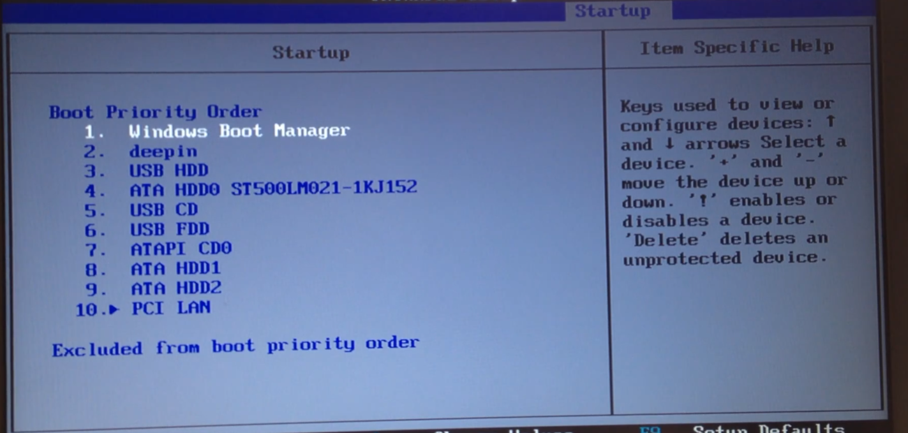

### 系统安装设置过程

1.  设置好 BIOS 启动顺序之后，保存重启等一会儿会自动进入如下主安装界面，根据自己的喜好选择语言，时间格式和键盘输入方式后，点击 **下一步**；

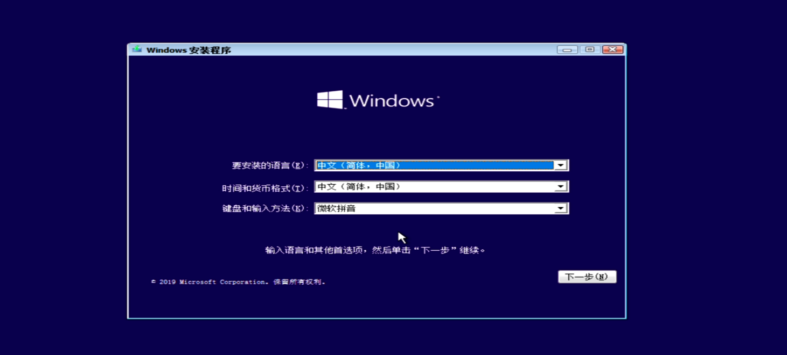

2.  接着点击现在安装；

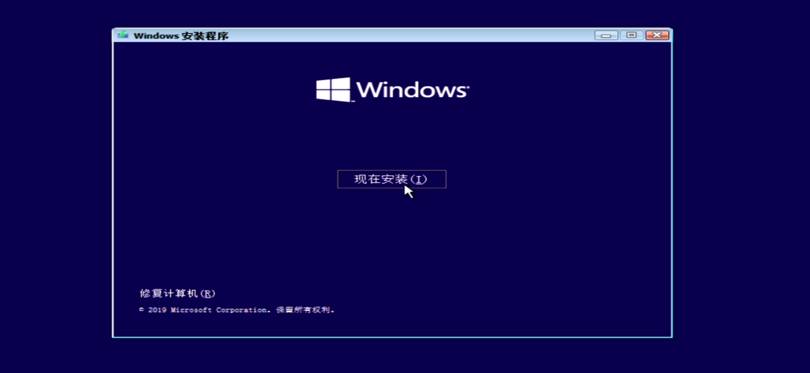

3.  接着会让你输入产品秘钥，如果有的话，直接输入后下一步即可，没有的话，直接点击我没有产品秘钥即可；

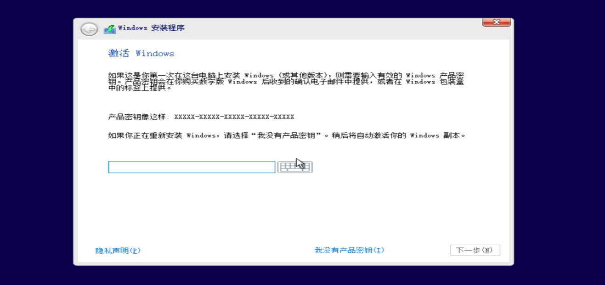

4.  接着选择自己要安装的版本，然后点击下一步即可（一般 **推荐选择专业版**）；

5.  接着勾选许可条款，继续下一步；

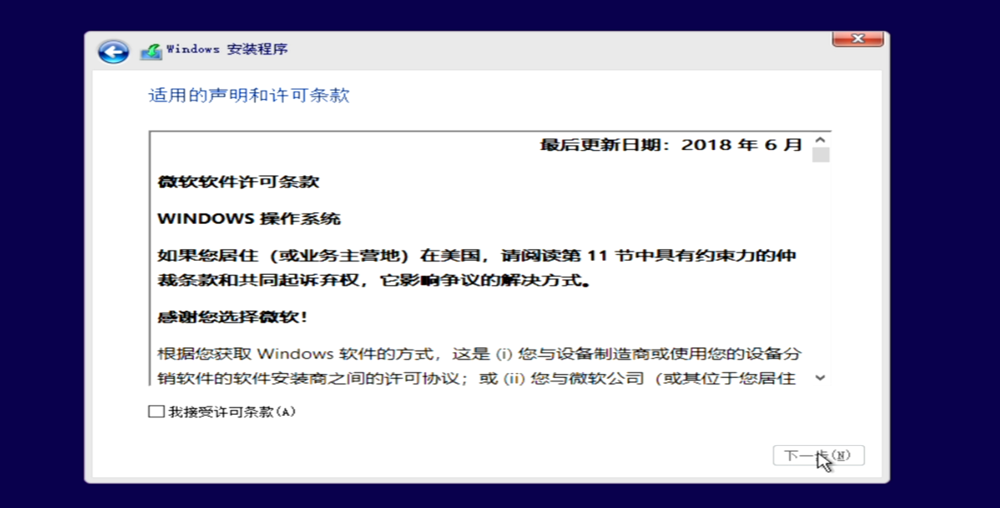

6.  选择自定义：仅安装 Windows；

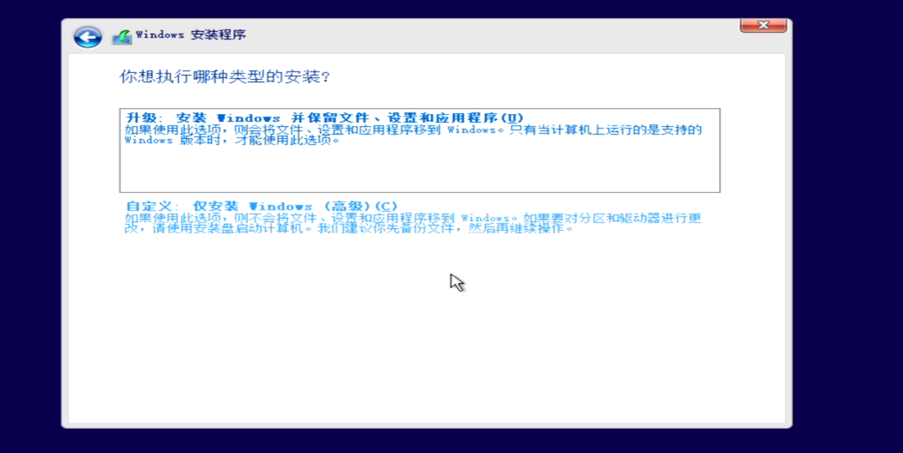

7.  接着选择你要安装系统的硬盘，接着下一步，**注意一定要选中你要安装系统的盘，否则可能把其他盘的数据也给搞掉，而且你也可以自己分区！！！**；

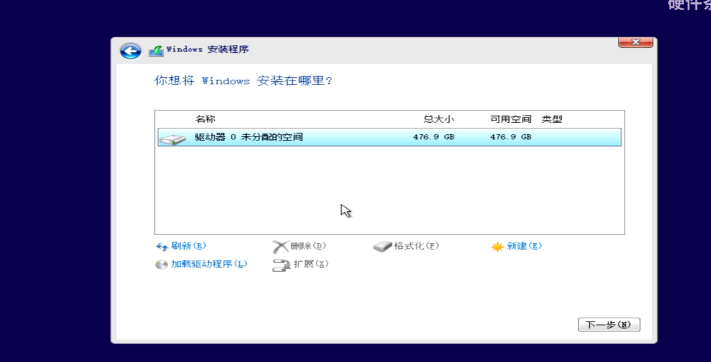

8.  好了，到此系统正式安装开始了，等他装完，**拔掉 U 盘重启即可**；

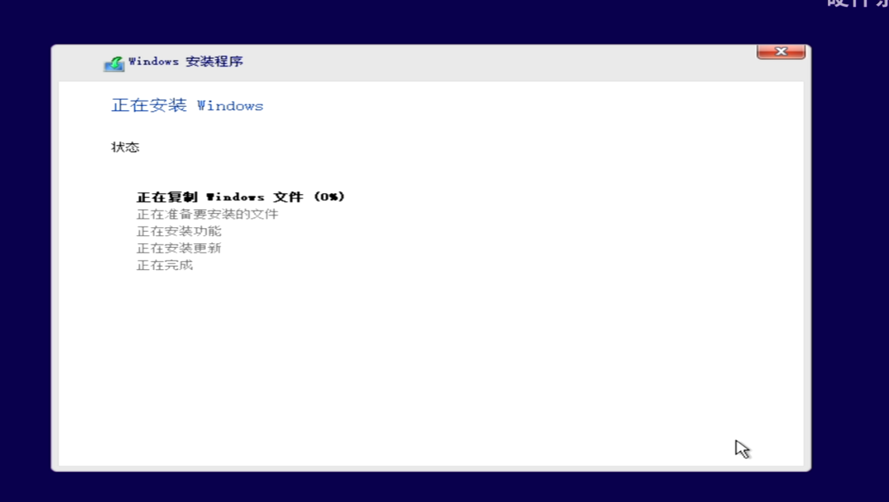

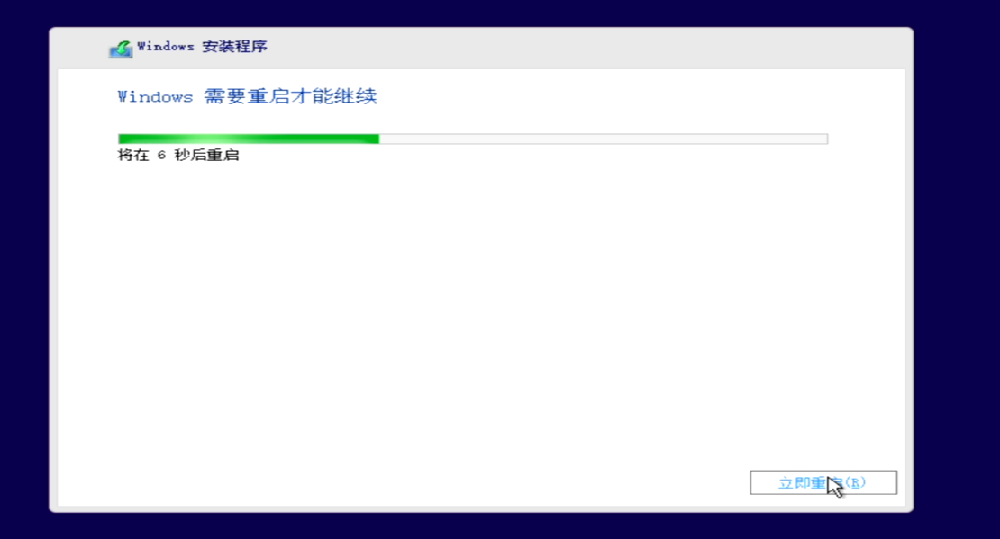

9.  重启之后就是 Windows 的一些初始化设置，一般是时区、用户、密码、输入方式等设置，这个没啥好讲了，根据自己的喜好进行选择即可；

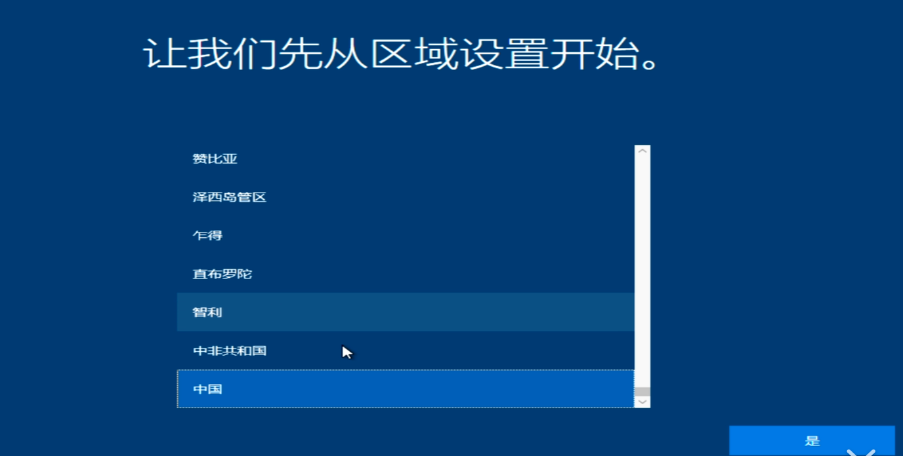

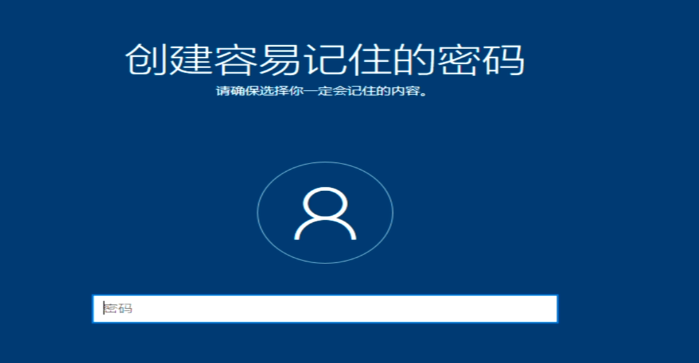

## 总结

好了，看到这儿，那你就应该能够完整的安装好一个系统了，赶快去试试吧。

PS：一开始可能会遇到不同的小问题，但是不要慌，电脑一般装个系统是不会坏的，我当初也是一遍遍尝试，最后才安装成功。如果实在是觉得搞不定，你也可以关注我的公众号或者添加我的私人微信，加入我的交流群，大家一起交流哦！！！

🤪🤪🤪，完了完了，女朋友发现我发的文章了，我得溜了。