# 电子签名制作

>   PS：白色背景版和透明背景版可能在某些平台预览效果一样，但实际上是不同的，大家自己尝试就清楚了。

## 前言

受疫情的影响，网上办公已经成为一种大趋势。而在网上办公时，也存在一些不方便的地方，比如需要签名的地方我们应该怎么办呢？这时候就需要制作我们的电子签名，而今天文章的主要内容就是教大家如何制作自己的电子签名，主要分为：

1.  **PPT 制作电子签名**
2.  **PS 制作电子签名**

## PPT 制作电子签名

这是一种十分简单地方法了，只需要我们电脑上装了 Office 中的 PowerPoint 即可，以下就是具体的制作过程。

### 准备工作

-   PowerPoint
-   一张有你手写签名的照片

### 制作过程

1.  新建 PPT 并导入图片

打开 PowerPoint，新建一个空白文档，然后在 `插入 -> 图片 -> 插入图片来自本设备`；

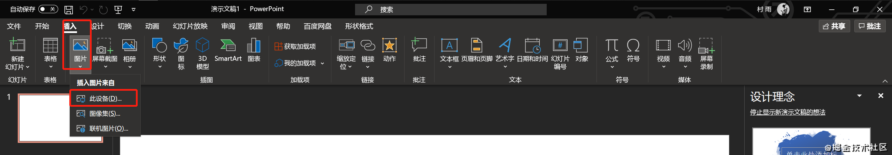

2.  图片旋转裁剪

具体步骤是，选中导入的图片，然后在 `图片格式` 下边进行旋转和裁剪，讲你的签名摆正，并裁减到只剩下你的签名；

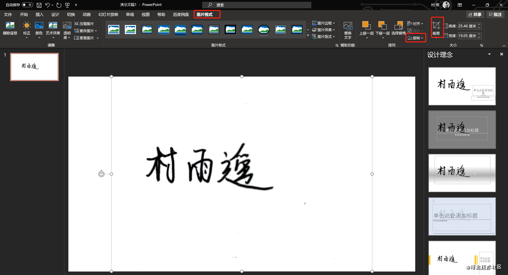

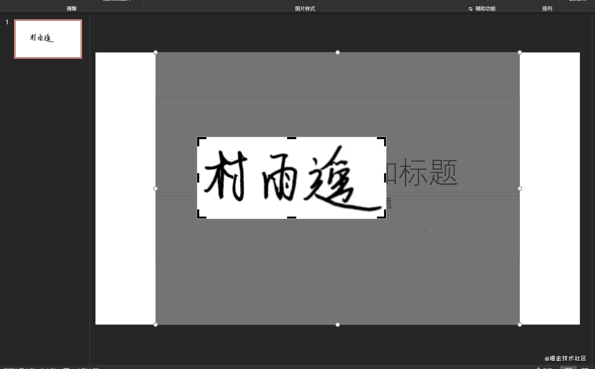

3.  对比度设置

选中图片右键，然后选择 **设置图片格式**，然后在 **图片校正** 下将对比度设置为最大 100%。

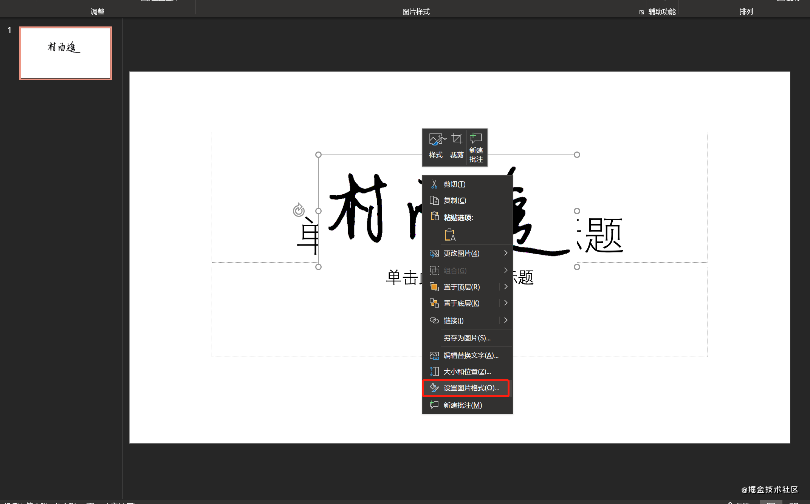

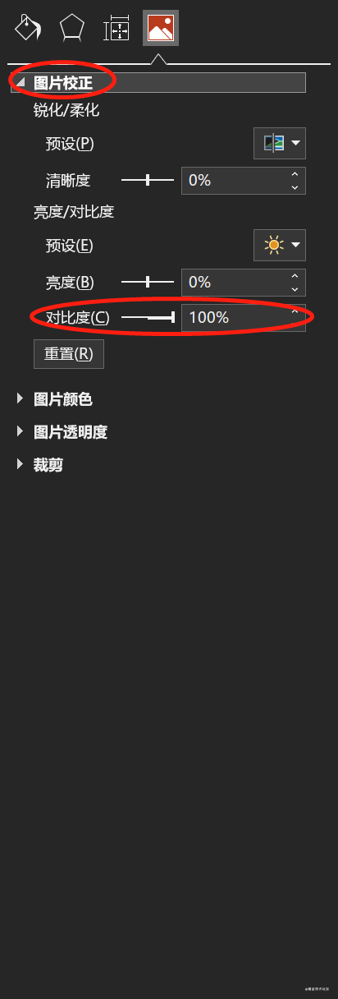

4.  保存签名

此时我们就得到我们的签名，可以看到我们的效果还是蛮好的。

同样的，选中图片右键，然后选择 **另存为图片** 即可。

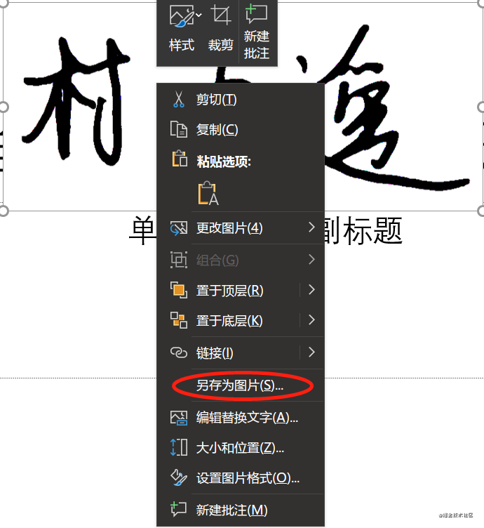

5.  效果优化

到上一步我们的电子签名就已经做好了，但是我们会发现这个时候的签名底色是纯白的，这时候就不太方便了，我们希望它的底色是透明度，方便嵌入到不同的文档，具体操作步骤如下：

选中图片，然后在 **图片格式** 下选中 **颜色** 中的 **设置透明色**，然后再次点击我们的签名，此时我们的签名就是透明的了。接着就是保存了，保存步骤同 4.

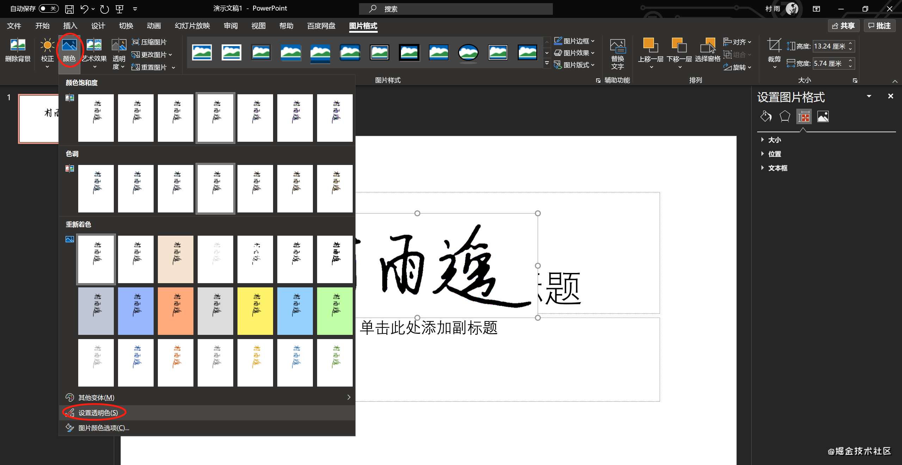

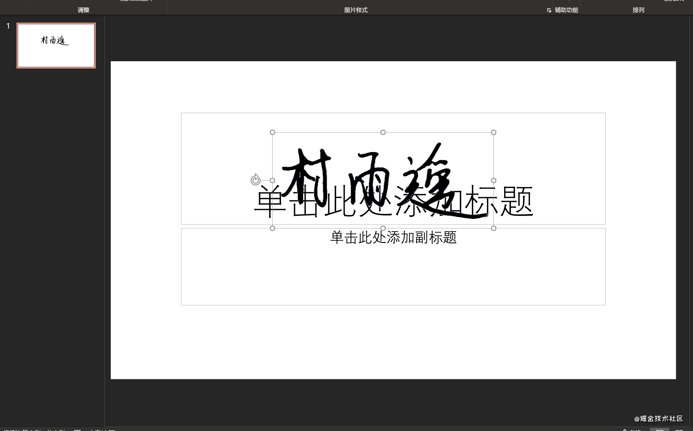

### 效果对比

## PS 制作电子签名

### 准备工作

-   Photoshop（也可以利用在线版 PS）

-   一张有你手写签名的照片

### 制作过程

1.  导入图片

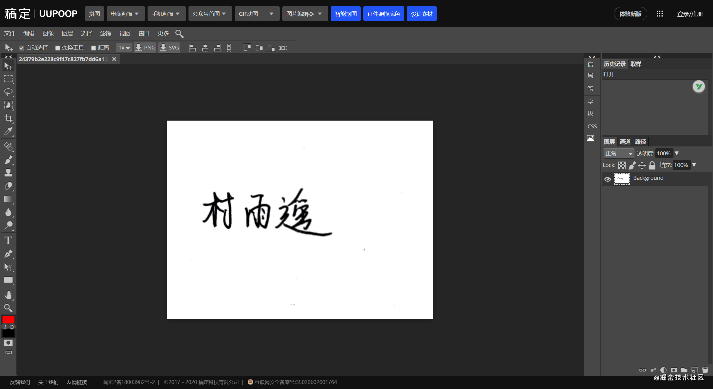

2.  提取签字区域

依次打开工具栏的 **选择 -> 色彩范围**；

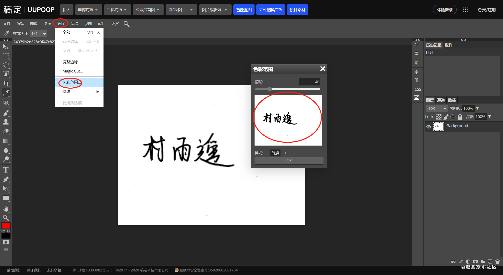

接着选择左侧工具栏中的 **吸管**，然后点选签字的黑色区域，得到下图的效果；

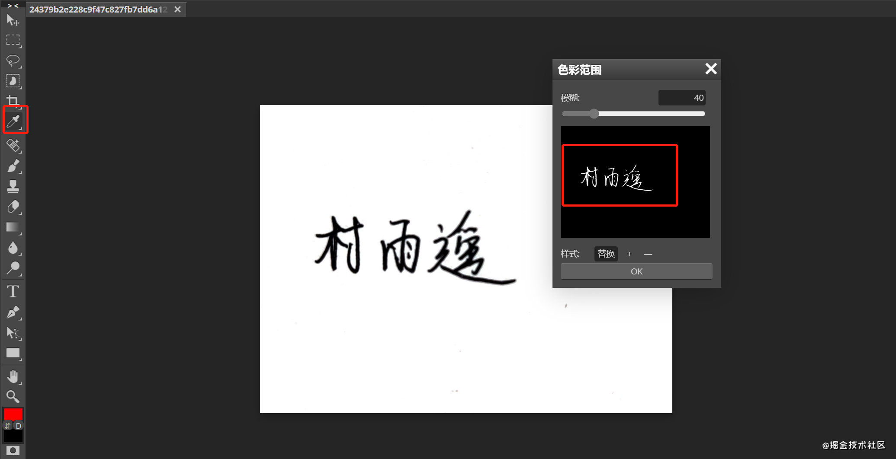

然后利用快捷键 **Ctrl + J** 创建一个新的图层，然后点击 `Background` 前边的小眼睛，把它给隐藏掉，就得到我们的图层 1 的视图；

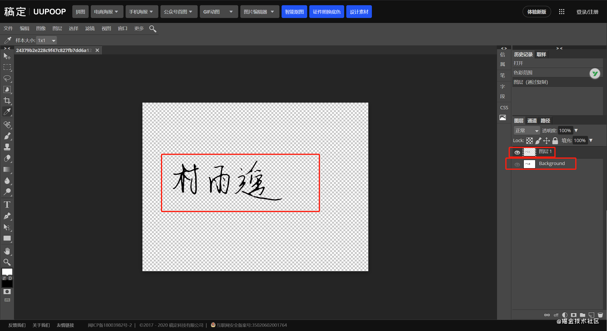

3.  保存签名

完成上面的步骤之后，点击 **文件 -> 导出为 **，选择你想要导出的格式即可；

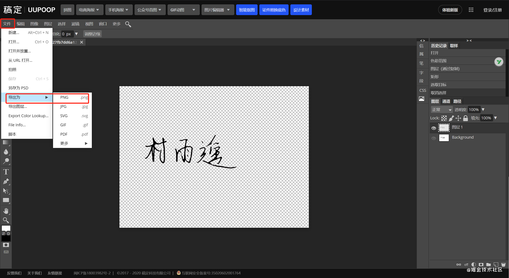

以导出 `png` 为例，我们还可以设置导出的宽度和高度，以及导出的质量，然后点击保存即可；

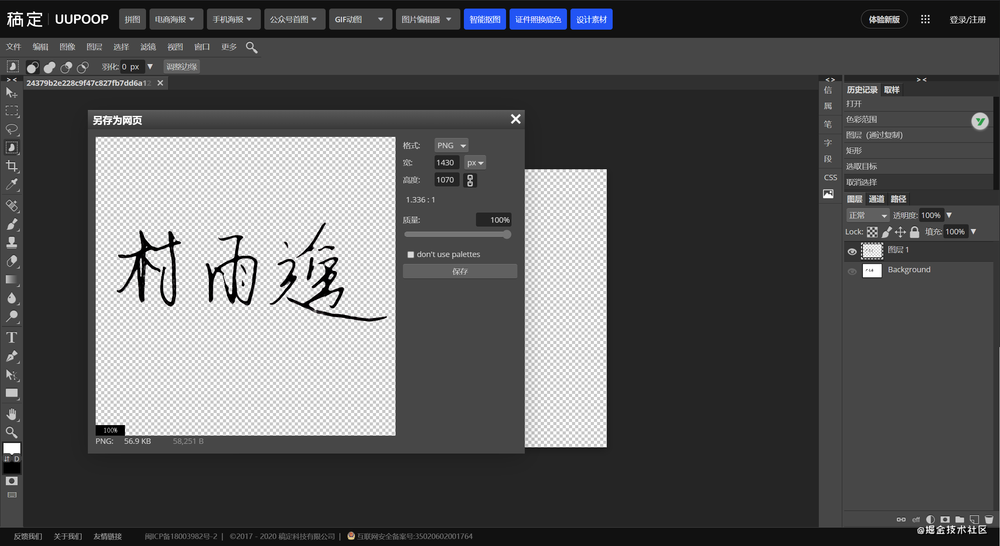

### 效果预览

## 总结

好了，以上就是今天文章的主要内容了，主要介绍了两种制作电子签名的方式。如果文中的内容对你也有用，那就点赞关注一波吧。

如果你有更好的制作方法，也可以在评论区中评论，大家一起交流！