# Windows 安装 PostgreSQL

## 前言

之前由于学习，所以选择的是受众范围较广的 `MySQL`。至于 `MySQL`，在这里就不用说了，想必大家都是很熟悉的。正式参加工作之后，才发现原来不同的公司选择的数据库都不一样，有的选择 `Oracle`，有的选择 `MySQL`，而有的则选择 `PostgreSQL`。`Oracle` 的确很厉害，不过始终是面向收费的，一般小体量的公司用起来成本太高，所以大家还是更倾向于 `MySQL`。关于 `MySQL` 的教程、知识分享博客有很多，而且大家写的也很详细，所以在这里就不在赘述了。我们今天就主要来聊聊另一款数据库 `PostgreSQL`，揭开他的神秘面纱，一探究竟。

## PostgreSQL 的安装

### 什么是 PostgreSQL

它是一个免费的对象-关系数据库服务器(ORDBMS)，它自称是 "世界上最先进的开源关系型数据库"，那么它是否有它所自称的那么强大呢，下面我们就先来看看如何安装它。

### 准备工作

经过上面的介绍之后，现在我们就来看看如何安装 PostgreSQL。

在正式安装过程之前，我们先需要准备好安装包，这里我主要是以 Windows 平台为例，理论上来讲普遍适用于全系 Windows 系统。

那么我们首先要做的就是去 PostgreSQL 官网：https://www.postgresql.org/ 去下载最新版本 PostgreSQL 安装包。

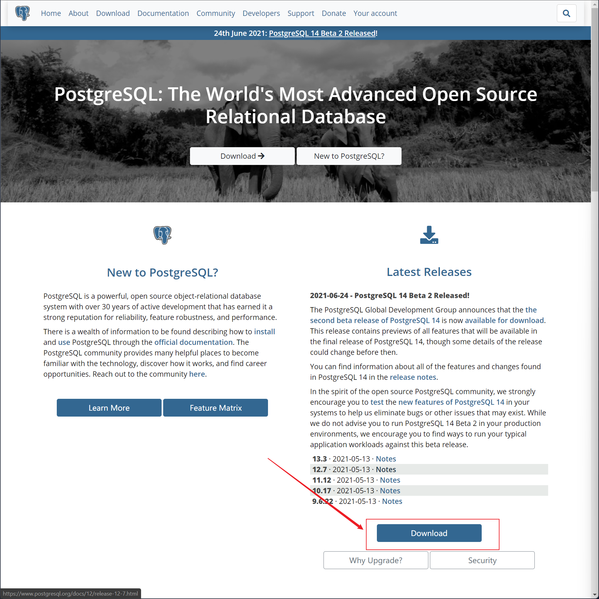

然后选择对应平台进入下载安装包，这里提供 `.exe` 的安装包，也支持下载 `.zip` 的压缩包形式解压缩安装，这里根据自己的喜好进行下载即可，下边我主要以 `.exe` 形式的安装包安装为例。

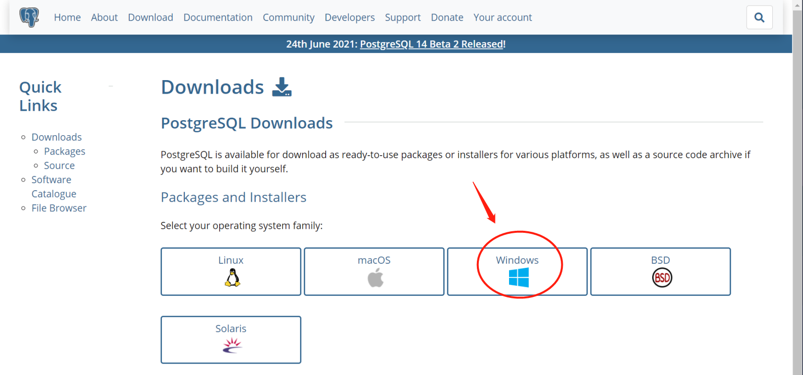

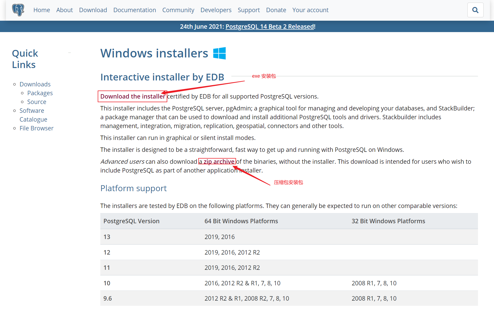

### 安装过程

准备工作好了之后，接下来就是正式安装过程了。

1.   双击我们下载好的安装包之后，进入安装界面，首先是一个欢迎界面，直接 `Next` 下一步即可；

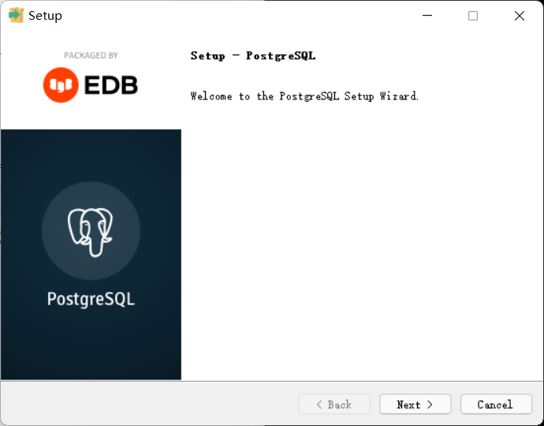

2.   然后是选择安装路径，这里默认是在 `C:\Program Files\PostgreSQL\13` 下，不过我们一般推荐安装到自己平常安装软件的地方，不要直接安装在 C 盘；

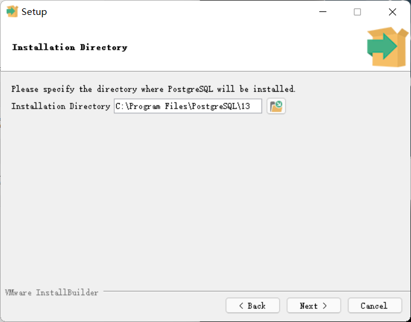

3.   选择所要安装的组件，这里默认是全部安装，如果你们有特殊的要求，那就默认直接点击 `Next` 下一步即可；

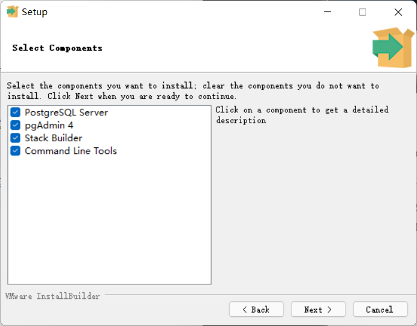

4.   选择数据数据存放的地方，这里默认实在安装路径下的 `data` 子目录下，如果你之前在第 2 步中自定义了安装路径，那么这里直接选择 `Next` 下一步即可；

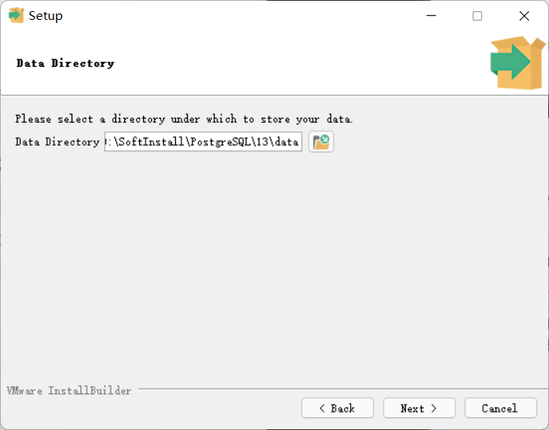

5.   设置密码，也就是待会儿我们安装结束后登陆时所需的密码，这里自己设置即可（**一定要记住！**）；

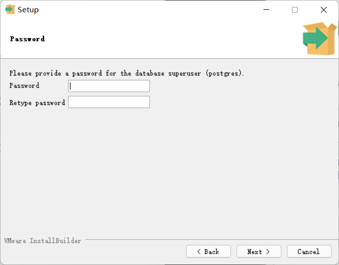

6.   端口设置，PostgreSQL 默认端口是 5432，如果你不想使用默认端口，可以自定义想要使用的端口，这里如果改动了也要记住，确保不要和其他服务冲突；

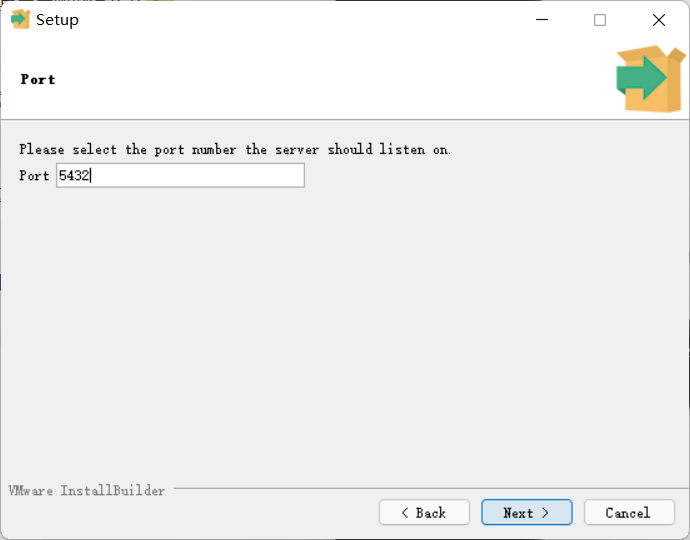

7.   其实就是时区选择，这里直接默认点击 `Next` 下一步即可；

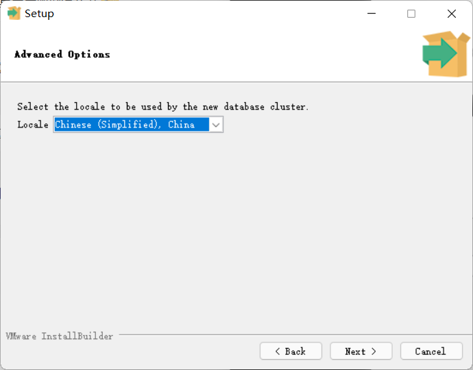

8.   然后是确认信息，确保我们已经准备好了要开始 PostgreSQL 的安装，直接点击 `Next` 下一步即可；

9.   接下来就是相对漫长的安装过程了，这里等待即可；

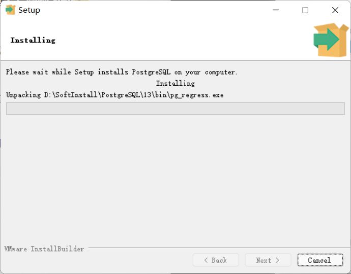

10.   好了，显示此界面就说明我们的安装过程结束了，点击 `Finish` 完成安装即可。

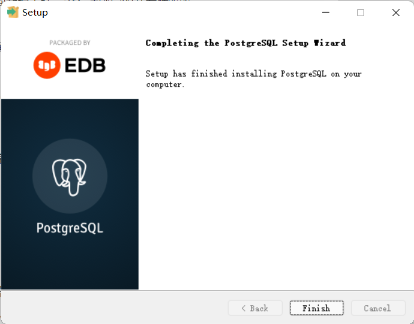

### 验证

既然我们的 PostgreSQL 安装好了，那么接下来就是看看如何使用它了。

去我们的程序列表中找到 `SQL Shell(psql)`，也就是下图中的程序打开（这里我因为安装了快捷搜索软件，所以你查找的界面会和我不一样，但是软件是一个）。

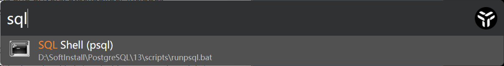

然后就是登陆过程了，首先是 `Server`，也就是说数据库 url，默认是在本地（所以是 `localhost`），没有该动的就直接回车下一步好了。

接着是 `Database`，也即我们数据库，这里默认是使用 `postgres`，因为我们是第一次登陆，所以这里也就直接回车下一步就好了。

再接着是 `Port`，也就是端口号，默认是 5432，如果你安装的时候改动了，那么此时你最好也改成你当时改的端口，否则可能导致连接失败。

然后是 `Username`，也就是 PostgreSQL 的用户，这里一般默认是超级用户（`postgres`，这里不同于 MySQL 的 `root`，要注意），而我们也是第一次登陆，没有建立新账户，直接默认回车下一步即可。

最后要输入的则是口令，也就是登陆数据库的密码，这里我们已经在上边设置过了，直接输入后回车即可。

如果我们登陆成功，那么就会出现下面图中的提示了。

## 总结

OK，今天的文章到此就结束了，主要介绍了如何在 Windows 中安装 PostgreSQL，以及 PostgreSQL 的一些简介和如何验证安装是否成功。

原创不易，如果你觉得本文对你有所帮助，那就来个点赞关注吧。