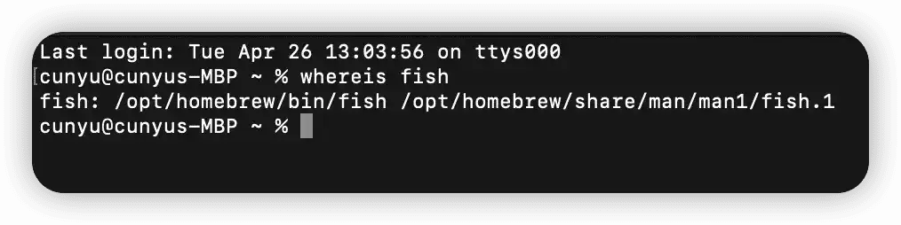

# iTerm2 + Fish 高效终端

## 什么是 Fish

作为一个程序员，难免会和命令行打交道。而提及到命令行，那 Shell 肯定绕不开，说白了，其实学习各种命令实质就是在学习 Shell。

当前市面上有很多 Shell，用的最多的可能就是 Bash 和 zsh 了。比如 macOS 中默认的 Shell 就是 Bash，然后之前也用过一段时间 zsh，两者各有千秋，看自己的喜好，不过个人觉得总体来讲 zsh 更好用！

zsh 虽然比较强大，也提供了各种丰富的插件，但有一点就是略为臃肿，用起来感觉太重了。无意中在网上冲浪是发现了 Fish 这个 Shell，于是用了一段时间，最后在 zsh 和 Fish 中选择了 Fish，于是特在此记录安装过程。

Fish 是 “the friendly interactive shell” 的简称，最大特点是简单易用。Fish 做到了开箱即用，不需要任何配置，提供了许多其他 Shell 需要通过配置才能使用的功能。如果你既想要一个好用的 Shell，又不要去配置各种配置，那么推荐尝试一下 Fish。

## 安装

这里使用 `homebrew` 进行安装，如果你还没有 `homebrew`，那么推荐你安装一下，这可是 macOS 中的一大神器。

当然，在你安装 `homebrew` 时，可以使用官网所提供的脚本：

```sh
/bin/bash -c "$(curl -fsSL https://raw.githubusercontent.com/Homebrew/install/master/install.sh)"
```

不过基本上都会安装失败，此时大概率会报如下错误。

```sh
curl: (7) Failed to connect to raw.githubusercontent.com port 443: Connection refused
```

当然这也不是我们网络的问题，主要是 `http://raw.githubusercontent.com` 访问实在不稳定，因此推荐使用以下这种更加高效的方式。

```sh
/usr/bin/ruby -e "$(curl -fsSL https://cdn.jsdelivr.net/gh/ineo6/homebrew-install/install)"
```

安装好 `homebrew` 之后，使用如下命令进行安装即可。

```sh
brew install fish
```

如果顺利的话，此时是可以安装成功的，但如果你也和我一样在安装时报以下错误信息，那么你可以根据下面的解决方法尝试解决。


```shell
Error: No such file or directory @ rb_sysopen - /Users/cunyu/Library/Caches/Homebrew/downloads/7c65a980f7151e14dc5cf1e45ff29b9456a318d6868b1e78a7cd9369a3de144b--pcre2-10.39.arm64_monterey.bottle.tar.gz
```


这是因为 `pcre2-10.39.arm64_monterey` 依赖包下载失败了，则可以单独将依赖包下载安装，从而避免依赖版本的错误。

```sh
brew install pcre2
```


接着再使用上面安装 `Fish` 的命令进行安装即可。


## 切换默认 shell

虽然我们已经安装好了 `Fish`，但是我们还要对它进行手动切换才能生效。

首先使用以下的命令来查看下本机中的 shell，默认情况下 `fish-shell` 应该还没用加到 shell 列表中的。

```sh
cat /etc/shells
```

接着，我们手动来更改 shell 列表，使用如下命令即可。使用 `sudo` 是因为要用到管理员的权限，所以这里还需要你知道管理员的密码。

```sh
sudo vim /etc/shells
```

然后将 `Fish` 添加进去到 shell 列表中。

```sh
/opt/homebrew/bin/fish
```


我的电脑安装后 `Fish` 是位于上面的位置，但是如果你不确定你安装后不知道在哪儿，那么可以使用以下命令进行查询 `Fish` 所在位置。

```sh
whereis fish
```



最后则是切换默认 shell，让我们之后打开终端后都是使用 `Fish`，运行如下命令即可。

```sh
chsh -s /opt/homebrew/bin/fish
```

至此，我们的 `Fish` 就安装成功了，退出终端后重新打开终端即可使用安装好的 `Fish`。

 

## 安装 Oh My Fish

官网提供了两种方式，第一种是直接在线安装。

```sh
curl -L github.com/oh-my-fish/oh-my-fish/raw/master/bin/install | fish
```

第二种则是通过将脚本下载之后再进行安装。

```sh
curl -L github.com/oh-my-fish/oh-my-fish/raw/master/bin/install > install
fish install
```

两种方法我都试了以下，第一种呢大概率是不会成功的，那么我们选择第二种，将脚本下载之后安装。但是同样的使用这个命令可能会失败，此时则可以去 `https://raw.githubusercontent.com/oh-my-fish/oh-my-fish/master/bin/install` 把脚本内容复制到本地的一个文件中。然后再用以下命令安装即可。

```sh
fish 脚本文件名
```

安装好 `Oh My Fish` 之后，我们就可以安装一个漂亮的主题了。

如果要查看所有可用的主题，那么可以使用如下命令。

```sh
omf theme
```


可以看到还是有很多主题的，确定好之后，接下来就可以安装我们心仪的一款主题了，安装命令如下。

```sh
omf install 主题名
```


最后则是效果预览了，这里我自己是安装了 `randomrussel`，最终的效果预览如下。


此外，`Oh My Fish` 辅助命令工具 `omf` 还提供了一些常用命令用于管理插件和主题。

| 命令                      | 说明                                 |
| ------------------------- | ------------------------------------ |
| `omf update`              | 更新自身和已安装的所有插件及默认主题 |
| `omf list`                | 显示本地已安装的所有插件             |
| `omf install [url\|name]` | 安装一个或多个插件                   |
| `omf destroy`             | 卸载 `Oh My Fish`                    |

## 总结

以上就是我们关于 `Fish` 的安装以及简单的配置教程了，如果你也想拥有如此酷炫的终端，那就赶紧来试试吧！