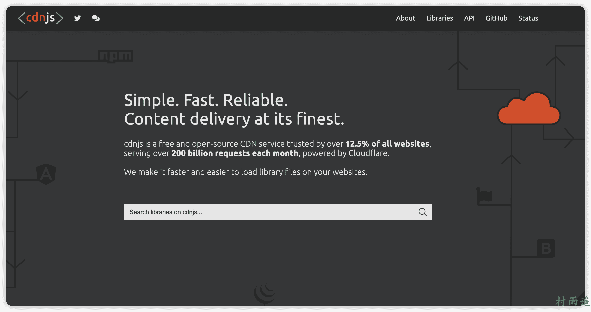
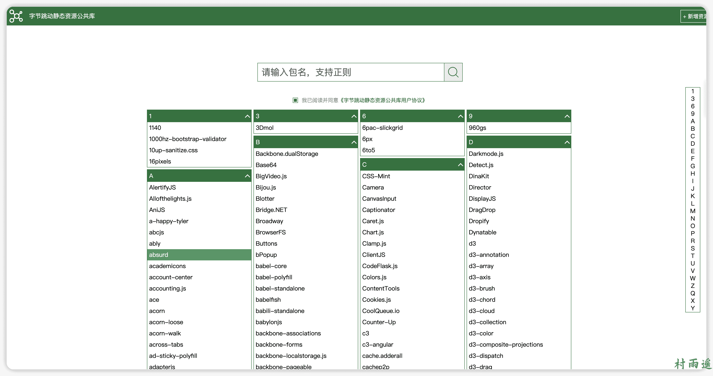
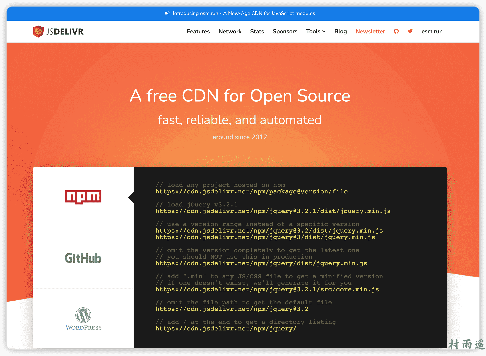
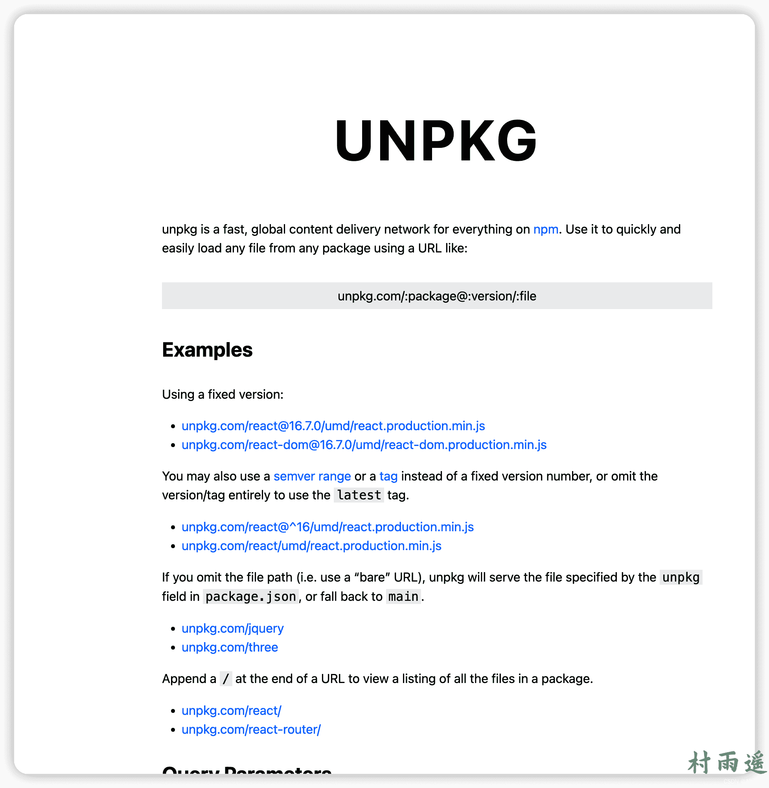
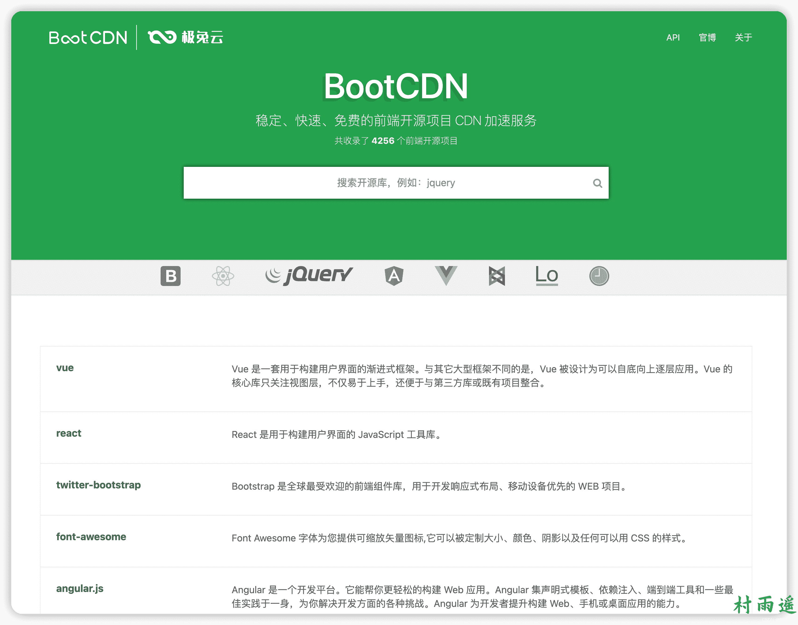
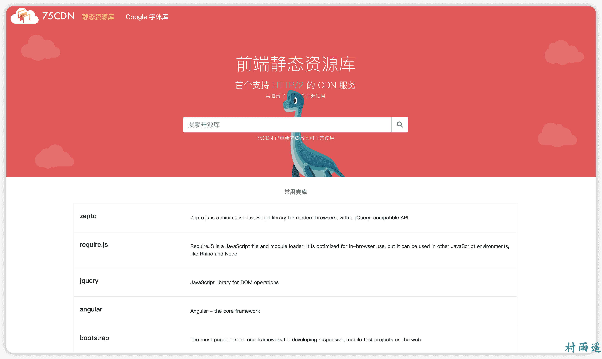

# 网站访问太慢，不妨试试这些 CDN

:::info
不要哀求，学会争取。若是如此，终有所获。
:::
:::tip
原文：https://mp.weixin.qq.com/s/WDOc5kI0jVtsbxgWwCoJkQ
:::


## 前言

前端开发时，为了让网站的资源快速响应，提高网站的响应速度，我们通常会使用到 CDN。CDN 又叫做内容分发网络，原理是将服务内容分发到全网加速节点，让用户优先从最近的服务器节点上获取内容，从而加速网站访问速度。大多服务商，比如阿里云、腾讯云、又拍云、七牛云等的 CDN 都是按量收费的，但也有一些服务商体用了免费的 CDN 服务。今天就来看看，我从网上给大家找到的一些免费可用的 CDN！

## cdnjs.com



-   官网：https://cdnjs.com/

作为全球最为著名的开源 CDN 库，想必每个从事前端的工作的小伙伴都对他有所了解吧。该网站使用 `CloudFlare` 分发，如果你是在国外使用，那速度没的说，嗖嗖的。不过要是在国内，那还是优先考虑下其他的吧，因为它在国内访问时实在是太慢了！

## 字节跳动



-   官网：http://cdn.bytedance.com/

由国内字节跳动公司所出品的公共库，同步 `cdnjs.com`，但有时候可能针对部分库未及时更新到最新版本，需要注意这一点，否则在使用时可能会导致一些莫名的错误。

## jsDelivr



-   官网：https://www.jsdelivr.com/

 jsDelivr 是一个免费开源的 CDN 解决方案，用于帮助开发者和站长。包含 JavaScript 库、jQuery 插件、CSS 框架、字体等等 Web 上常用的静态资源。想必这个 CDN 大家都不会陌生吧，没准儿在看博客的各位就一直在用着它。

当然，除了以上作用之外，它还可以作为我们图床的加速器，这里不用说，想必许多作者可能都搭配着 Github + jsDelivr 搭建了自己的图床吧。 

## UNPKG



-   官网：https://unpkg.com/

unpkg 是一个快速的全球内容交付网络，适用于 npm 中的所有内容。通过使用它，能够使用以下类似的 URL 就能快速轻松地从任何包加载任何文件！

```sh
unpkg.com/:package@:version/:file
```

## BootCDN



-   官网：https://www.bootcdn.cn/

BootCDN 是极兔云联合 Bootstrap 中文网共同支持并维护的前端开源项目免费 CDN 服务，致力于为 Bootstrap、jQuery、React、Vue.js 等优秀的前端开源项目提供稳定、快速的免费 CDN 加速服务。BootCDN 所收录的开源项目主要同步于 cdnjs 开源项目仓库，截止文章写作时共收录了 **4256** 个前端开源项目。而且自 2013 年以来已经累计为仅百万网站提供稳定可靠的免费 CDN 加速服务，可以说是相当靠谱了！

## 75 CDN



-   官网：https://cdn.baomitu.com

谐音于奇舞，是由 360 前端奇舞团支持并维护的开源项目免费 CDN 服务，支持 HTTPS 和 HTTP/2，囊括了上千个前端资源库和 Google 字体库。而且是首个支持 HTTP/2 的 CDN 服务，共收录了 4275 个开源项目，均同步于 cdnjs！

## Staticfile CDN


-   官网：https://staticfile.org/

这是一个免费、快速、开放的 CDN 服务。你可能没听过这个 CDN，不过没关系，它背后的双引擎：七牛云和掘金想必你不会陌生吧。该网站由七牛云提供 CDN 加速，由技术社区掘金支持。

网站的目标是提供这样一个仓库，让它尽可能全面收录优秀的开源库，并免费为之提供 CDN 加速服务，使之有更好的访问速度和稳定的环境。同时，也提供开源库源接入的入口，让所有人都能够提交开源库，包括 JavaScript、CSS、图片和 swf 等静态文件。

## 总结

以上就是今天分享的所有内容了，如果你正好在开发你的个人网站，但是又苦于响应速度太慢，不妨去试试使用这些 CDN，看看会不会加速网站响应速度呢？