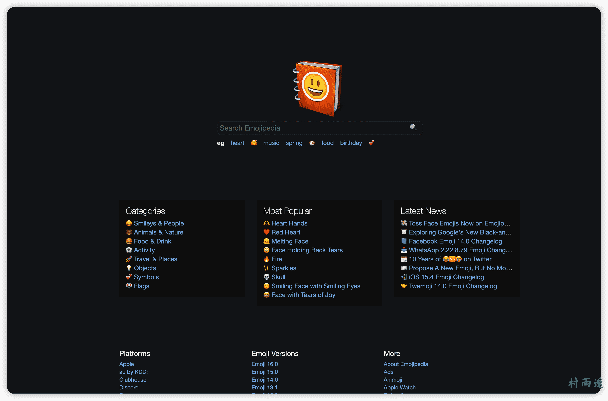
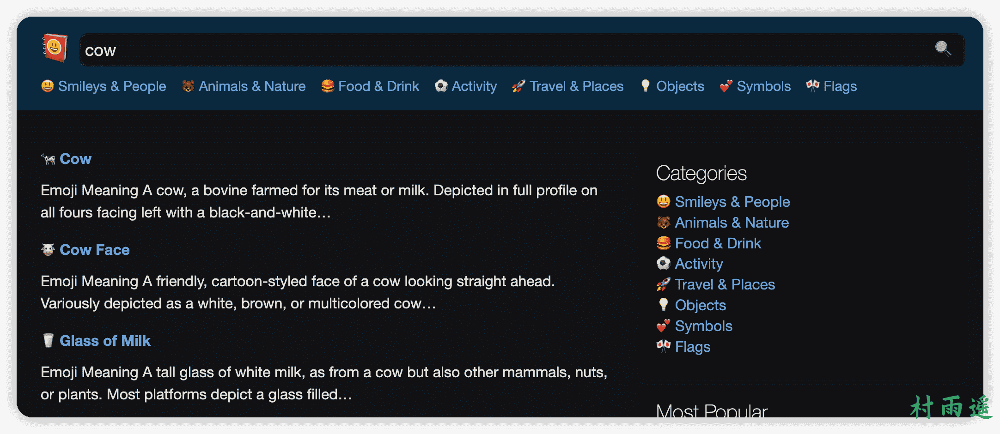
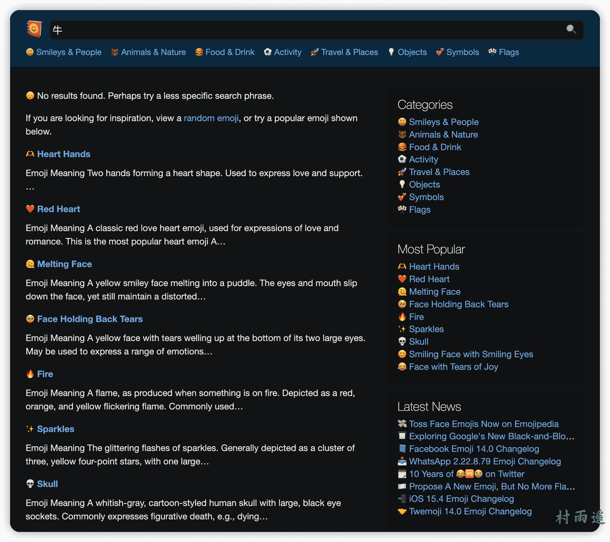
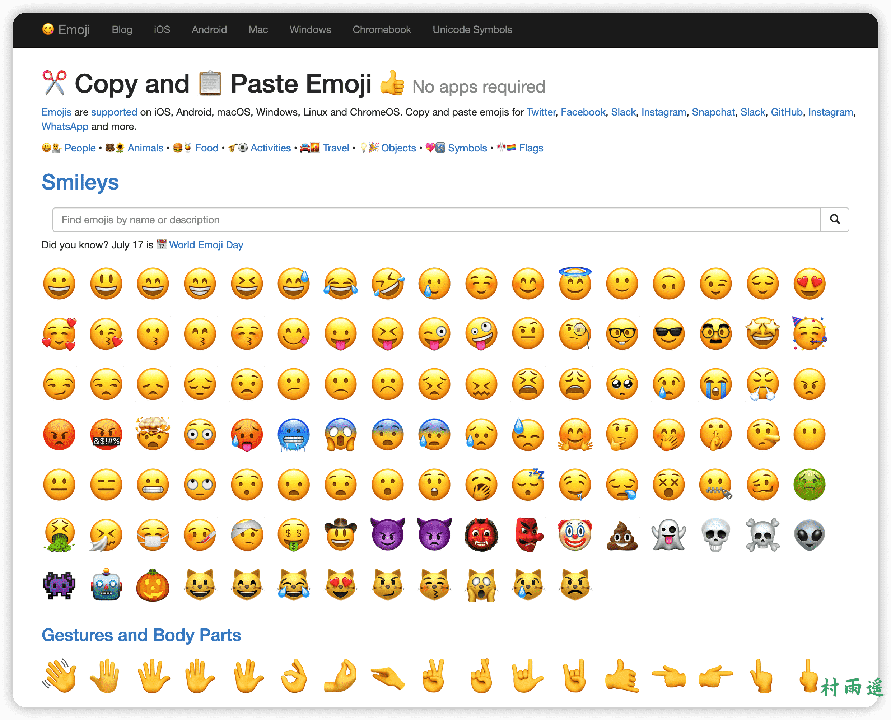
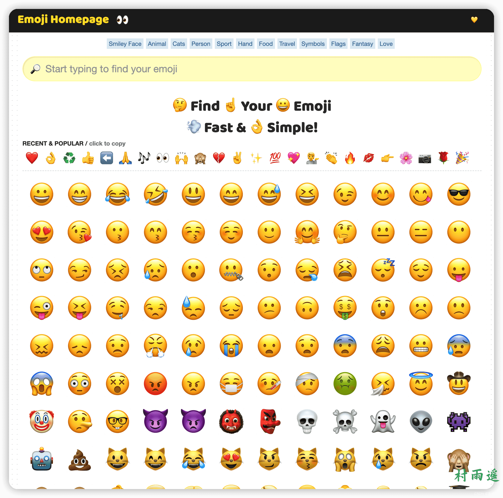
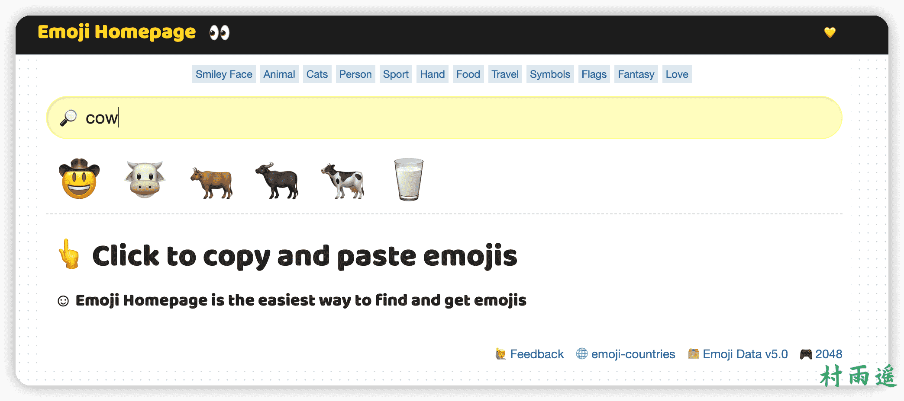
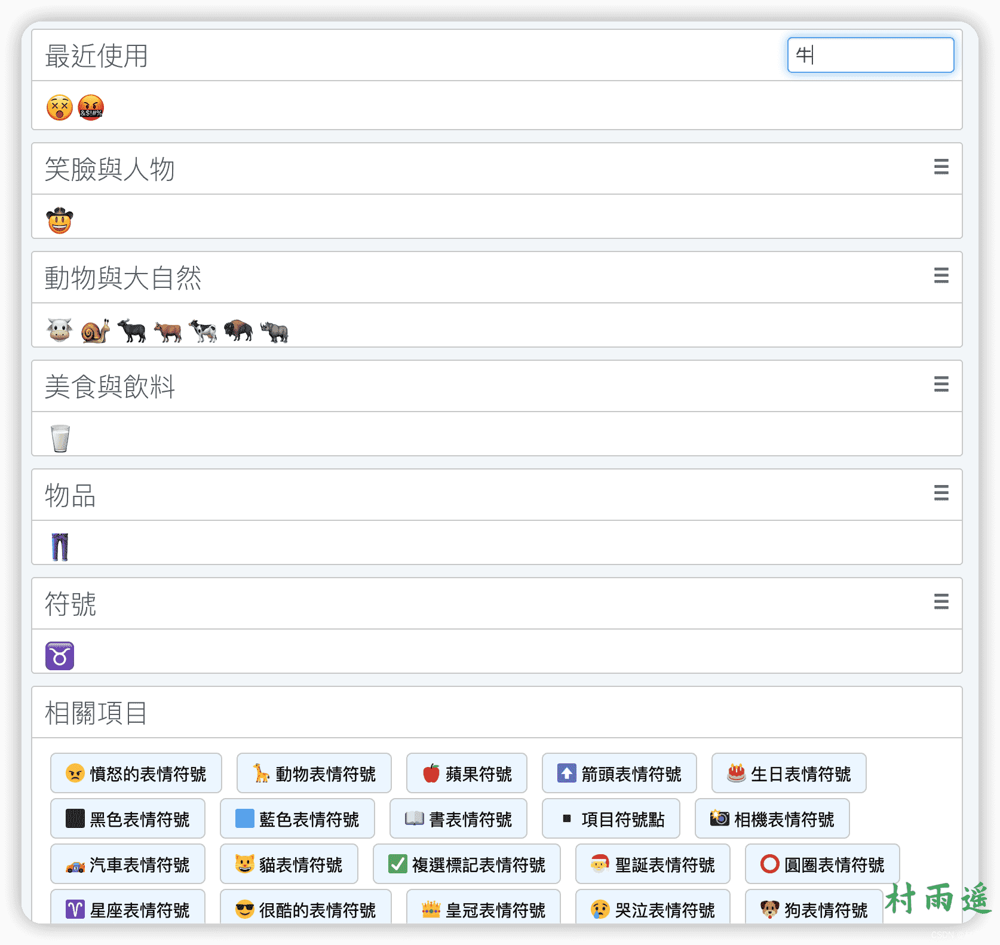

# Emoji 表情大作战

:::info 共勉
不要哀求，学会争取。若是如此，终有所获。
:::
:::tip 原文
https://mp.weixin.qq.com/s/TZMiXLTsHqVl3VMp2Dcdlg
:::

## 前言

在网上冲浪的时候，相信大家随处都能看见各种各样的 `emoji` 标签符号，虽然在微信、`QQ` 等聊天工具中也提供了许多 `emoji` 表情包，但是除此之外，你都知道还有哪些地方可以获取到这些可可爱爱的表情符号呢？

今天就来看看，给大家推荐几个可以免费获取 `emoji` 表情符号的神奇网站！

## 网站推荐

### EmojiAll

-   [链接](https://www.emojiall.com/zh-hans)

首先是 `Emoji` 中文网，这里不仅提供了各个 `Emoji` 表情符号的含义，是一个全面的 `Emoji` 字典。除此之外，还支持各种赋值粘贴各种表情符号，更有 `Emoji` 游戏等你来玩！

最最厉害的是，它还支持 `Emoji` 和汉字之间的互相转换！

你不仅可以将汉字转换为 `Emoji`，也可以将 `Emoji` 转换为汉字。

比如我在网站中搜索了 👅🐶，网站则给出了对应的汉字 -> 舔狗（手动狗头保命），是不是很刺激！

再来搜索一个“真滴牛逼”，你看，它也给出了相应的内容，是不是很好玩！

### Emojipedia

-   [链接](https://emojipedia.org/)

站如其名，`Emoji` 百科大全，这里有各个版本的 `Emoji`，只要在搜索框中搜索表情符号的关键词，就能给你搜出想要的答案！

比如我们搜索 `cow`，就会给出牛相关的表情符号。

但是需要注意，该网站只支持英文搜索，不支持中文搜索，如果你直接搜索“牛”这个关键字，那么给出的内容就差别较大了。

### Get Emoji

-   [链接](https://getemoji.com/)

这个网站就比较直接了，直接将各个表情符号进行了分类，然后只要在对应类别中去找我们需要的标签符号即可。当然了，网站也是支持直接搜索的，不过同样的，网站只支持英文搜索。

### Emoji Homepage

-   [链接](http://emojihomepage.com/)

同样的，给出了各个表情符号，你可以通过点击最上面给出的小标签跳转不同类别的表情符号集合，然后复制它到你的聊天窗口就可以使用它了！

当然，你也可以通过关键字搜索表情符号。

同样我们搜索 `cow`，可以看到这里给出的内容比 `Emojipedia` 更加全面！

### Emoji 列表

-   [链接](https://tw.piliapp.com/emoji/list/)

支持所有的 `IOS`、`Android 4.4+` 和 `Windows 8.1+` 系统，这里共分为 8 个类别，共含有 1800 个表情符号。我们可以通过点击下面不同类别中的表情符号，它就会自动到最上方的框中，然后点击右方复制按钮即可实现赋值！

同样的，该网站也支持在线搜索，不过不同于上面的网站，该网站支持中文搜索。而且通过中文搜索的结果比英文搜索结果更精确全面！

## 总结

以上就是今天的推荐了，希望对大家有用呀！

除此之外，说一点题外话，好像现在大家写博客之类的都挺喜欢插入各种表情包，之前也尝试过写过几篇文章，里边加了些表情包，但始终觉得不适合我，于是就放弃了。作为我个人来讲，觉得还是能避免就尽量避免。当然，关于这一点，大家都可以有不同的看法。你可以不认同我，但我仍然坚