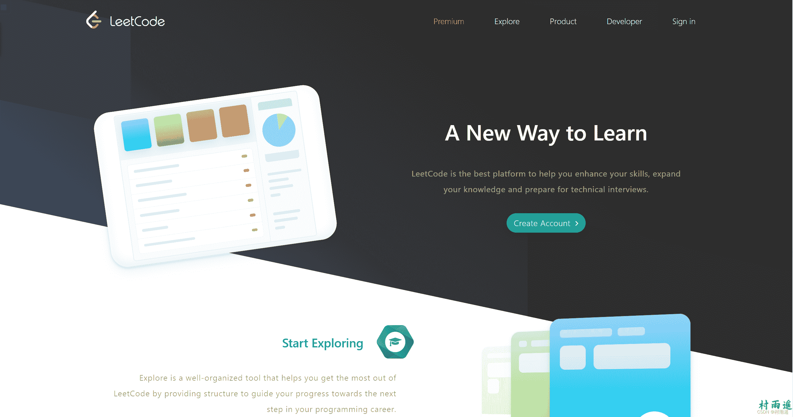
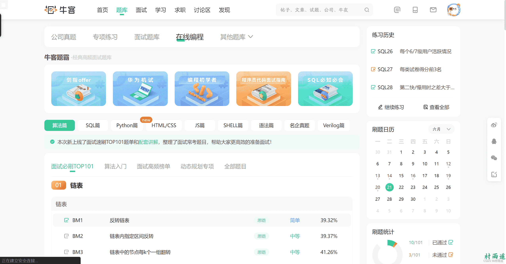
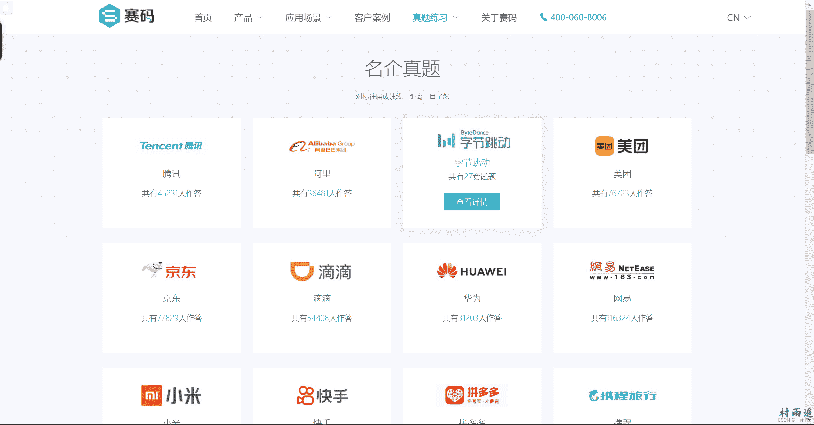
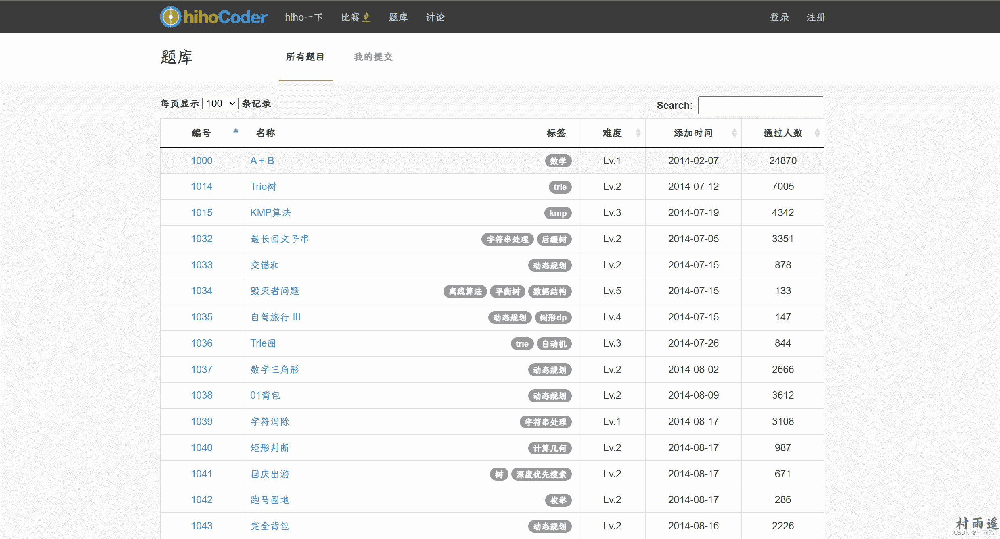
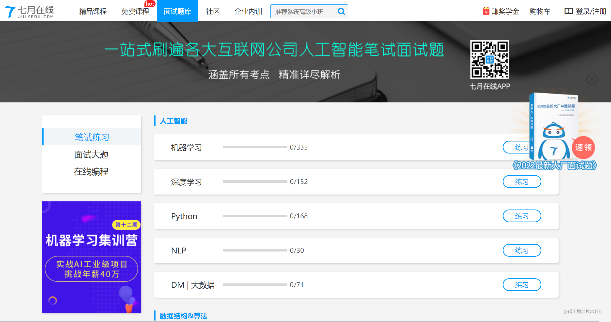

# 计算机专业涨薪必备的几个网站

:::info
不要哀求，学会争取。若是如此，终有所获。
:::
:::tip
原文：https://mp.weixin.qq.com/s/GGoYITwL0Symiqbi257kvA
:::

## 前言

刚学习编程时，你是不是很烦恼该去哪儿找找题目来练习下，看看自己学的怎么样。有或者在找工作时，需要准备面试，但是又不知道该去哪儿刷题？针对这个情况，今天我就来给大家分享几个可以在线练习算法和面试题的网站，为大家找工作助力！

## PTA

- [地址](https://pintia.cn/)

程序设计类实验辅助教学平台，由 7594 位来自 889 高校老师共同创建，囊括了 215679 道高质量题目，而且截止本文写作时已有 3137414 位注册用户。不过里边主要是针对 C、C++ 语言来进行答题，关于更多语言答题，还在进一步扩展中。
如果你在学习 C/C++ 语言，那么不妨进入他们，和各个高校的学子一起在线拼题吧。

## LeetCode 美国站

- [地址](https://leetcode.com/)

全球极客挚爱的技术成长平台，与其说国内在用，还不如说是因为国外一线科技公司如谷歌、评估、Meta 等公司都在这里选拔人才，所以才引入的国内。如果的英语能力还 OK，那么强烈推荐你来这里练习算法，和来自世界各地的程序员们 Battle 一下，谁才是王者！

## LeetCode 中国站

- [地址](https://leetcode.cn/)

当然了，除了美国站，LeetCode 还有中国站，相当于将美国站的内容翻译后搬运过来，但是又在此基础上进一步扩展了业务，加入了许多付费课程。如果你对自己的英语实在不自信，那么这里也不失为一个好去处。

## 牛客网

- [地址](https://www.nowcoder.com/)

牛客网是一个集笔面试系统、题库、课程教育、社群交流、招聘内推于一体的招聘类网站。牛客向企业提供校园招聘&技术人才招聘一站式解决方案服务，主要包括招聘渠道服务招聘SaaS工具服务（笔、面试，招聘传播服务（技术竞赛广告、线上招聘专场、牛客职播）等。
除此之外，牛客网题库中还包含了几万道题目，内容覆盖笔试题解析、面试技巧和机器学习等。
如果你正在准备校招或者准备换工作，那么强烈推荐你多去逛逛这个网站，不管是刷题也好，还是看看经验贴，没准儿面试的时候你就会在牛客进行。

## 炼码

- [地址](https://www.lintcode.com/)

通过在线实操的方式，提升你的编程能力，从而轻松斩获名企 Offer。
这里不仅有实操题目，还有各种精选题目集，更有针对热门编程语言如 Python、Java、SQL 等的学习教程，更有码力评测栏目，快来试试你的码力处于什么段位吧！

## 赛码

- [地址](https://www.acmcoder.com/)

一个免费在线考试系统、在线面试系统，稳定专业且易用。里边汇聚了腾讯、阿里、字节跳动、百度、京东、小米、华为等一线互联网的真题，如果你参加过校招，那么你肯定不会陌生这个网站，因为会有好多公司都会选择在这里进行笔试。

## 百面网

- [地址](http://www.100mian.com/) 

IT 公司面试神器，这里不仅提供了 300 本计算机编程经典书籍免费下载，还有针对互联网各个岗位的面试题，如果你也刚好需要找工作，不妨来这里看看经验和面试题。

## hihoCoder

- [地址](http://hihocoder.com/)

通过高水平的程序设计比赛提升编程水平，得到名企offer。致力于成为编程者与企业之间交流沟通的桥梁，同时也努力为编程爱好者提供提高自身编程水平的场所。

## 7 月在线

- [地址](https://www.julyedu.com/question/index)

一站式刷遍目前国内各大互联网公司人工智能笔试面试题，涵盖了所有考点，解析精准详尽。
站中主要分为笔试练习、面试大题、在线编程三大模块，而各个模块下又分别设置了：人工智能、数据结构与算法、数理逻辑、编程开发、计算机基础等子模块，可以说是非常详细了。

## N 诺

- [地址](https://noobdream.com/)

如果你有计算机学习考研方面的打算，那么推荐你一定要上去看看，这可以说是计算机学习考研的人所必备的神器。里面提供了许多免费的的学习资源。
网站设有有数学、英语、政治、C 语言、数据结构、操作系统、网络、组成原理、数据库等课程的专区，还有上岸的名校大佬来这里分享自己的考研经验。如果你苦于找考研方面的经验、试题等资料，那么不妨来这里看看吧！
## 总结

以上就是我在日常冲浪中发现的几个刷题网站了，基本上是涵盖了学习和工作过程中的需求吧。而且针对不同需要可以选择不同的网站进去学习，如果你要考研学习，那么可以去看看 N 诺；如果你只是为了提升算法，那么 LeetCode 可能更适合你；而如果你要求职找工作，那么牛客网、赛码网等常见面试网站就可以多逛逛；而如果你是想找人工智能方面的面试题，那么不妨去七月在线瞅一眼。