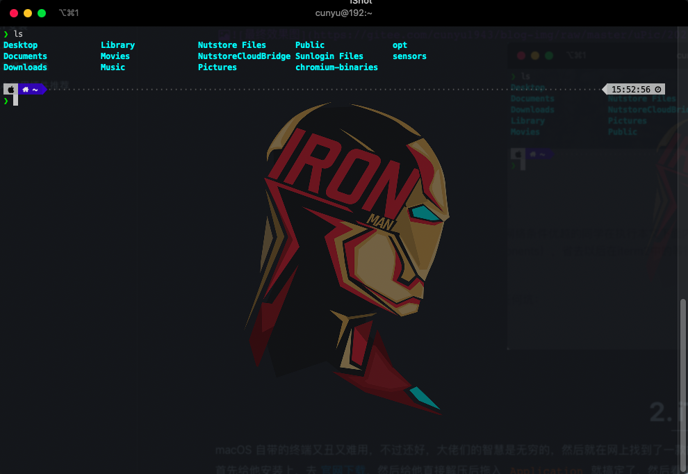
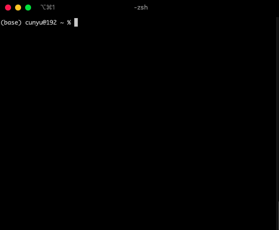
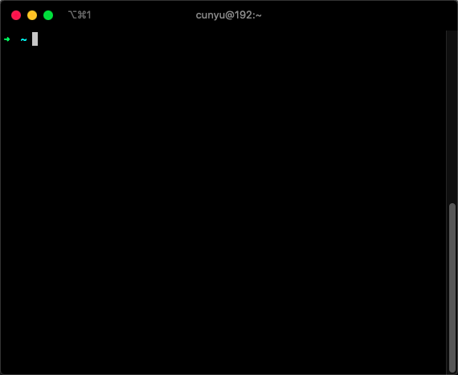
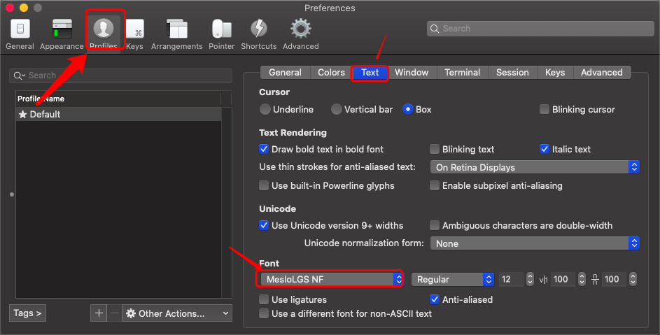
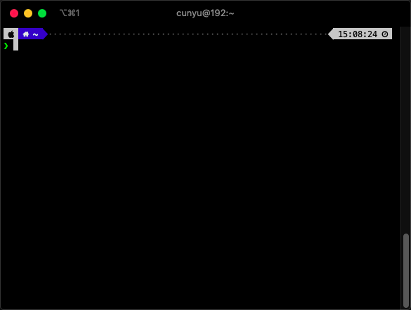

# iTerm2 + Oh My Zsh 终端神器

## 前言

说在前面，本文主要适合于的是使用 macOS 系统的小伙伴，如果你使用的 Windows 或者 Linux 系统的电脑，那可能暂时不太适合你。当然了，如果你只是想了解一下新知识，那么欢迎各位！

终端（也就是 Windows 中所说的控制台）在我们大多数人的印象中，应该都是黑乎乎的一片，然后再加几个白色的文字吧。如果你还这样想，那你可就 Out 了，现在，我们的终端也可以改造成酷炫时尚的模样，就像下面这张图，那该怎么改呢？赶紧来看看吧。




## iTerm2

macOS 自带的终端又丑又难用，不过还好，大佬们的智慧是无穷的，然后就在网上找到了一款能够完全代替原生终端的工具 - [iTerm2](https://iterm2.com/index.html)。

首先安装上 iTerm2，去 [官网下载](https://iterm2.com/index.html)，然后直接解压后拖入 `Application` 就搞定了，然后我们首先来看看他的原皮！



好像还是很丑，咋回事儿，不是说 iTerm2 很酷炫的么，不还是一样丑不拉叽的么？？？


别慌呀，接下来才是正菜！

## Oh My Zsh

好了，主角正式登场！


>   Oh My Zsh is an open source, community-driven framework for managing your zsh configuration.

上面这句话是官网给出的描述，即它是开源、由社区驱动的用于管理 zsh 配置的框架！好了，那就动手整起来！

### 安装

官网提供了以下两种自动安装的方式：

1.   通过 `curl` 的方式

```bash
# via curl
sh -c "$(curl -fsSL https://raw.github.com/ohmyzsh/ohmyzsh/master/tools/install.sh)"
```

2.   通过 `wget` 的方式

```bash
# via wget
sh -c "$(wget -O- https://raw.githubusercontent.com/ohmyzsh/ohmyzsh/master/tools/install.sh)"
```

不过由于某些不知名原因，通过上面两种方法一般来说都是安装不成功的，那咋搞？

既然自动安装搞不定，那就自己手动来呗。

1.  首先下载 `oh-my-zsh` 源码；

```bash
git clone git://github.com/robbyrussell/oh-my-zsh.git ~/.oh-my-zsh
```

2.  把配置文件拷贝到根目录；

```bash
cp ~/.oh-my-zsh/templates/zshrc.zsh-template ~/.zshrc
```

3.  使配置文件生效；

```bash
source ~/.zshrc
```

好了，这时候界面应该变了！




### .zshrc

这个文件是 `oh-my-zsh` 的配置文件，位于根目录下，一般可以通过如下命令可以对其进行查看或编辑；

```bash
vim ~/.zshrc
```

每次修改之后，如果要让配置利马生效，需要执行如下命令：

```bash
source ~/.zshrc
```

### 修改配色

打开配置文件 `.zshrc`，可以看到关于配色方案的配置：

```bash
# Set name of the theme to load --- if set to "random", it will
# load a random theme each time oh-my-zsh is loaded, in which case,
# to know which specific one was loaded, run: echo $RANDOM_THEME
# See https://github.com/ohmyzsh/ohmyzsh/wiki/Themes
ZSH_THEME="agnoster"
```


关于配色，你可以去 [主题市场](https://github.com/ohmyzsh/ohmyzsh/wiki/Themes) 进行选择，不过在这里推荐一下自己用的一款主题 [PowerLevel10k](https://github.com/romkatv/powerlevel10k)；

使用如下命令进行安装，然后打开配置文件 `.zsrch`，把主题设置为 PowerLevel10k；

```bash
git clone --depth=1 https://gitee.com/romkatv/powerlevel10k.git ${ZSH_CUSTOM:-$HOME/.oh-my-zsh/custom}/themes/powerlevel10k
```

```bash
ZSH_THEME="powerlevel10k/powerlevel10k"
```

接着安装 `MesloLGS NF` 字体（ [PowerLevel10k](https://github.com/romkatv/powerlevel10k) 安装手册里有），然后依次打开：`iTerm2->Preferences->Profiles->Text`，把字体选为 `MesloLGS NF` 即可；



然后重启 iTerm2，输入 `p10k configure` 按照自己的喜好进行主题配置即可，一般配置的问题大概是以下意思：

1.  这个符号看起来像钻石（旋转的正方形）吗？
2.  这个符号看起来像锁吗？
3.  这个符号看起来像 Debian logo 吗？
4.  这些图标都交叉分布在 X 之间吗？
5.  风格
6.  编码
7.  是否显示时间
8.  目录层级分隔符
9.  头部（左边）
10.  尾部（右边）
11.  是否换行
12.  左边和右边是否有连接线
13.  命令行和提示是否连接
14.  两行命令之间分布稀疏还是松散
15.  是否需要图标



### 常用插件推荐

要想让我们的终端更好用，推荐安装如下插件；

1.  **git**：自带插件，默认已经开启

它可以让我们使用非常好用的的 `git` 命令，提高开发效率：

| 未用插件前            | 用插件后 |
| --------------------- | -------- |
| `git add --all`       | `gaa`    |
| `git branch -D`       | `gbD`    |
| `git commit -a -m`    | `gcam`   |
| `git checkout -b`     | `gcb`    |
| `git checkout master` | `gcm`    |

上面表中只是部分配置，如果要看所有配置，可用使用如下命令查看：

```bash
vim ~/.oh-my-zsh/plugins/git/git.plugin.zsh
```

2.  **autojump**：自动跳转对应目录

该插件会记录你所有的访问记录，不同单独配置，直接访问即可，安装方式如下：

```bash
brew install autojump
```

然后在配置文件 `.zshrc` 中添加如下配置即可：

```bash
[ -f /usr/local/etc/profile.d/autojump.sh ] && . /usr/local/etc/profile.d/autojump.sh
```

使用时，利用 `j` 命令加上目标目录即可，如我要跳到 `/home/cunyu/code` 目录，只需要使用如下命令即可，不过前提是你之前访问过 `code` 目录。

```bash
j code
```

3.  **zsh-autosuggestions**：命令提示

该插件会在你输入命令的时候提示并且自动完成；

安装命令如下：

```bash
git clone git://github.com/zsh-users/zsh-autosuggestions $ZSH_CUSTOM/plugins/zsh-autosuggestions
```

接着在配置文件 `.zshrc` 中加入如下配置即可；

```bash
plugins=(zsh-autosuggestions git)
```

4.  **zsh-syntax-highlighting**：高亮

该插件命令会自动高亮显示;

安装命令如下：

```bash
git clone https://github.com/zsh-users/zsh-syntax-highlighting.git $ZSH_CUSTOM/plugins/zsh-syntax-highlighting
```

5.  **extract**：一键解压

tar, gz, zip, rar 等格式的压缩包都可以使用 extract 命令来进行解压，其别名是 `x`，使用方法如下；

```bash
x 压缩包名
```


## 总结

好了，以上就是今天文章的所有内容了。主要介绍了 macOS 中的终端 iTerm2，然后介绍了如何配置 iTerm2 + Oh My Zsh，最后则是推荐几款常用的插件，方便让我们的 iTerm2 更加强大。

最后，原创不易，如果你觉得我的文章对你有所帮助，那就点赞关注一波吧！