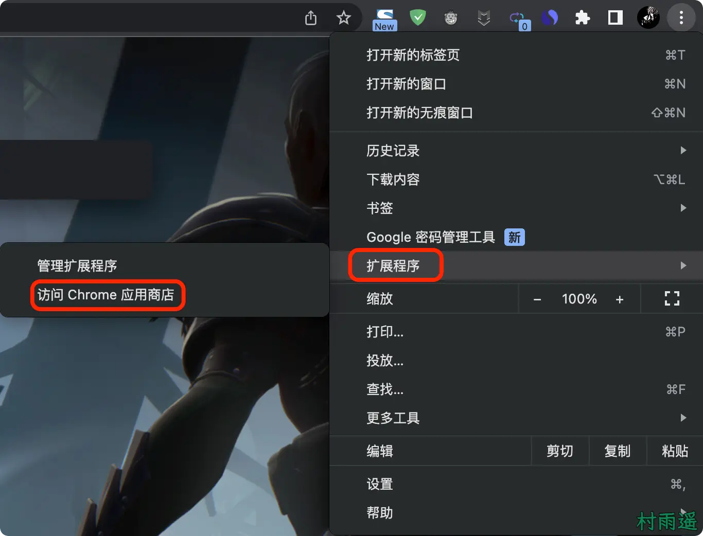
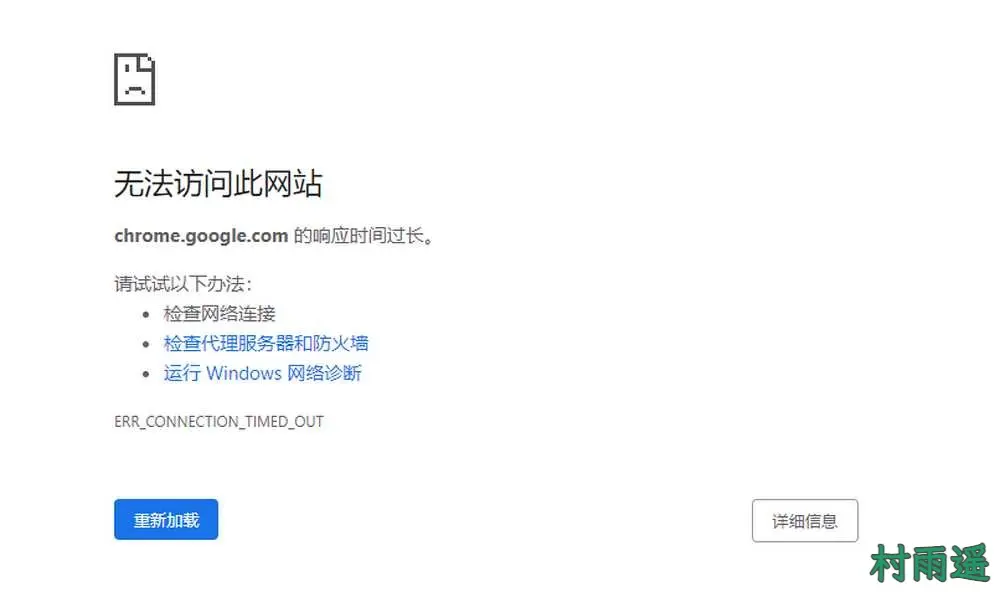
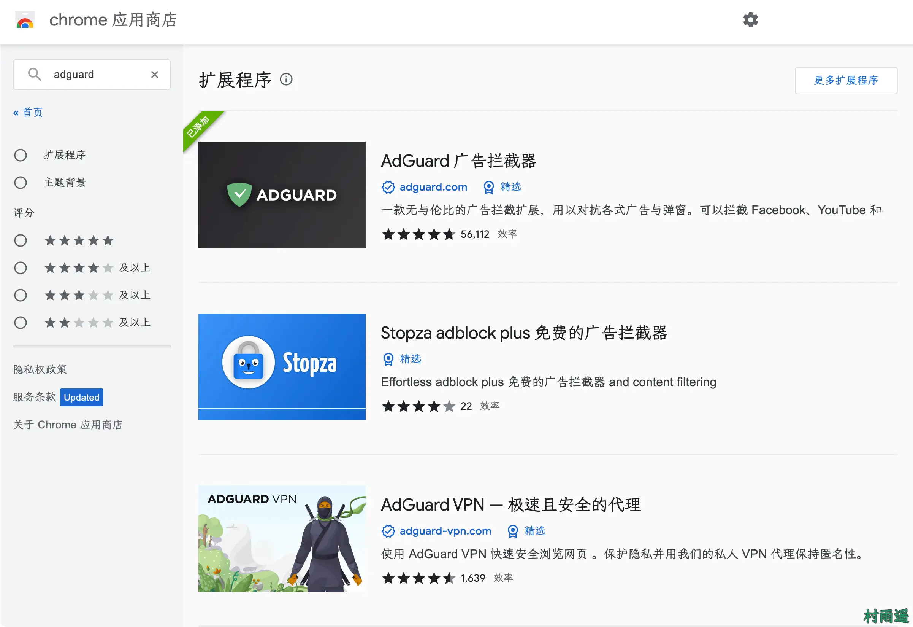
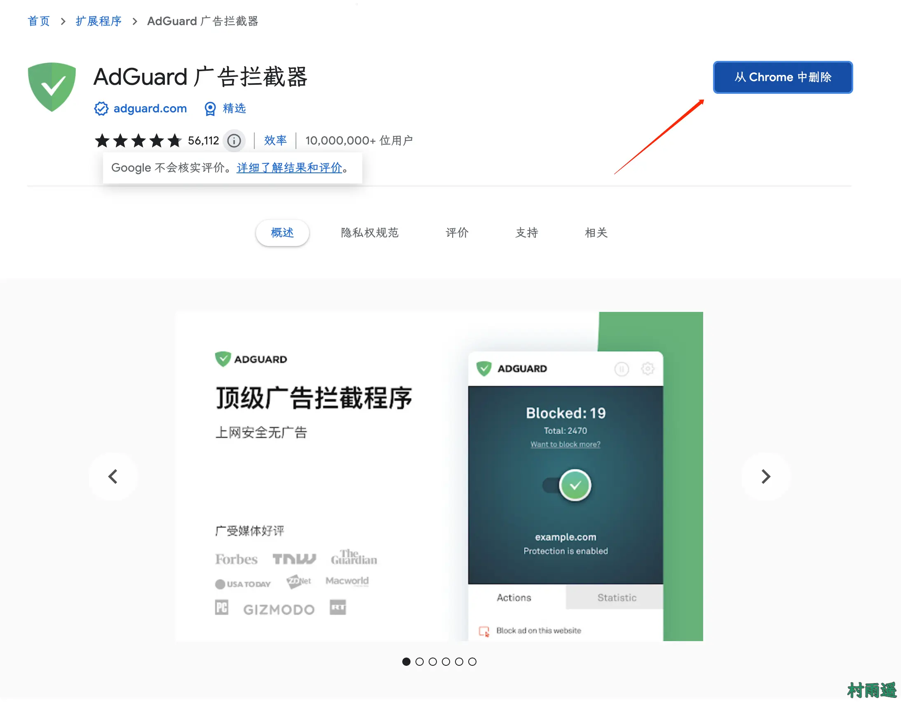
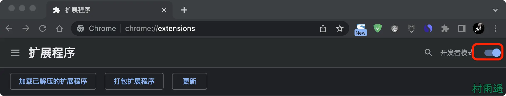
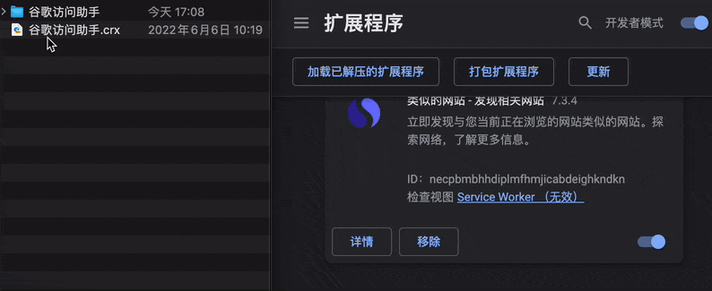
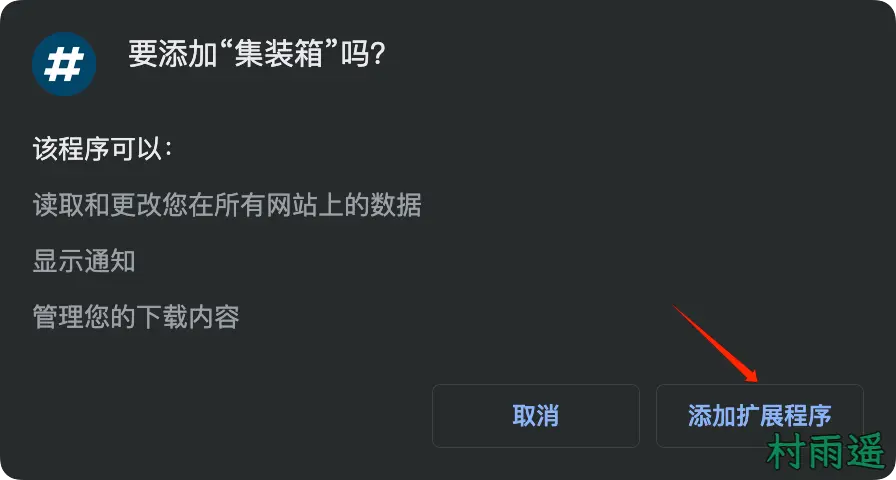
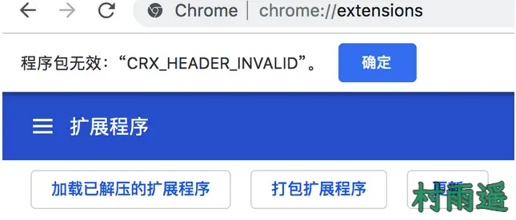
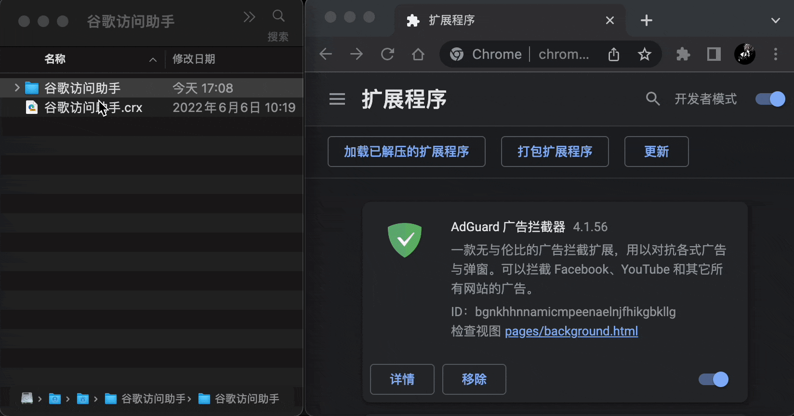
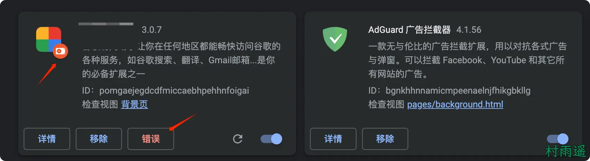

# 如何在浏览器中安装插件

:::info
不要哀求，学会争取。若是如此，终有所获。
:::
:::tip
原文：https://mp.weixin.qq.com/s/KNiUsB_yMNjjmKXrcSjrXg
:::

## 一、前言

在我的[好物周刊](https://mp.weixin.qq.com/mp/appmsgalbum?__biz=MzIyNTg2MjkzNw==&action=getalbum&album_id=2884869589325889537&scene=173&from_msgid=2247498110&from_itemidx=1&count=3&nolastread=1#wechat_redirect)系列文章中，想必看过的朋友都知道有一类叫做 **插件** 的分享。可能有的朋友不是很清楚，这个插件到底是什么，而又该如何安装和使用这些插件。于是，就有了这篇文章。以多图形式，简单地教大家如何使用这些插件。

所谓插件，肯定是需要有一个载体的，否则它往哪儿安装呢？而这个载体，就是我们日常工作生活中用得最多的浏览器。

声明：以下教程均基于 `Chrome` 最新版，但不用担心，该教程还适用于 `Edge` 浏览器、`QQ` 浏览器、搜狗浏览器等主流浏览器。

## 二、安装

这里主要有三种方式，分别是：

1.   **在线安装**
2.   **拖动安装**
3.   **解压安装**

下面就分别来看看，这三种方式都是怎么安装的。

### 1、在线安装

在线安装很简单，只需要打开 `Chrome` 的在线应用商店，然后挑选你想要安装的插件即可。打开在线应用商店的方式也很简单，入口在浏览器登录后的头像右边菜单栏中的的扩展程序 -> 访问 `Chrome` 应用商店。

不过，大多数人都会卡在这一步，正常情况下你是打不开这个 `Chrome` 应用商店的。原因也很简单，谷歌在国内被屏蔽了，所以打不开很正常。要想能够正常访问，那就需要靠你聪明的小脑袋瓜了。出于某些原因，这里我也不展开了。

所以就没有办法在线安装了吗？当然不是，既然此路不同，那我们可以换一种方式。

不知道大家知不知道微软推出的 `Edge` 浏览器，如果还不知道的朋友，推荐大家使用它。该浏览器其实也可以看做是另一个版本的 `Chrome`，因为它俩都是基于 `Chromium` 开发而来的。

而最大的不同就在于，`Edge` 浏览器的应用商店是可以直接访问的，这一点对于大家就很友好了。虽然插件不如 `Chrome` 应用商店丰富，但是至少可用了。而且它俩之间的插件是通用的，如果一个插件能在 `Chrome` 中使用，那么它就一定能在 `Edge` 中使用。

>   -   **Edge 在线商店**：https://microsoftedge.microsoft.com/addons/Microsoft-Edge-Extensions-Home
>   -   **Chrome 在线商店**：https://chrome.google.com/webstore/category/extensions?utm_source=ext_app_menu

打开在线商店之后，我们就可以挑选自己想要安装的插件了。比如我这里以 `AdGuard` 为例：

1.   首先输入关键词搜索

2.   进入具体插件的详细页

3.   点击插件详细页右上方的 **添加至 Chrome** 即可进行安装，因为我这里已经安装过了，所以显示的是 **从 Chrome 中删除**

### 2、拖动安装

如果不能在线安装，那么我们可以从网上找资源，把插件给下载下来后安装。

下载后的插件安装文件正常是以 `.crx` 为后缀，然后我们就可以去进行拖动安装了。

不过在那之前，需要先把浏览器扩展程序中的开发者模式打开。

入口：扩展程序 -> 管理扩展程序，然后打开右上方的开发者模式开关即可。

最后，将我们下载的插件安装包拖动到浏览器，浏览器会弹窗提示是否要添加插件，点击 **添加扩展程序** 即可。

### 3、解压安装

正常情况下，大多数插件都能通过拖动的方式进行安装。

不过也有特殊情况，如果你在拖动安装过程中，浏览器提示以下错误：

>   **程序包无效 CRX_HEADER_INVALID**

此时说明我们想安装的插件已经长时间未更新了，而且有可能已经从 `Chrome` 应用商店下架了。此时如果你还想要装上该插件来看看是否还能用，那么也行，你可以通过以下方式来进行安装。

1.   下载插件安装包，得到后缀为 `.crx` 的文件
2.   将插件安装包的后缀从 `.crx` 改为 `.zip`
3.   将 `.zip` 的安装包用解压软件进行解压
4.   将解压后的文件夹拖动到 **管理扩展程序页** 即可进行安装

不过需要注意，通过解压安装的插件，相比于其他正常安装的插件，会在 `logo` 右下角多一个红色框，而且还会有 **错误** 的标识，这些都不影响插件的正常使用，忽略就好了。

## 三、总结

以上就是在浏览器中安装插件的 3 种方式了，屏幕前的你是否学会了呢？

如果看完了本篇文章，你还是无法成功安装插件，那么可以留言，或者添加我微信发送报错截图，我会在工作之余第一时间回复哦！