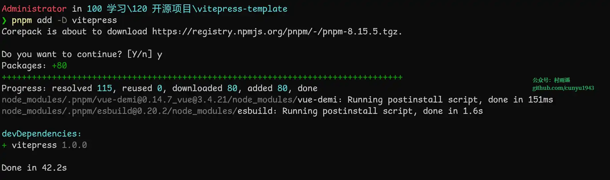

# vitpress


## 🎈 号外

最近，公众号之外，建立了微信交流群，不定期会在群里分享各种资源（影视、IT 编程、考试提升……）&知识。如果有需要，可以**扫码或者后台添加小编微信备注入群**。进群后**优先看群公告**，**呼叫群中【资源分享小助手】**，还能免费帮找资源哦～

<center>
 
</center>

## 安装

```shell
corepack enable pnpm
```


```shell
pnpm add -D vitepress
```



```shell
pnpm vitepress init
```


```shell
pnpm run docs:dev
```


