# 创建 Java 入门应用

## 前言

本篇文章中，我们将学习如何使用 IDEA 来创建、运行并打包我们的第一个 `Hello World!` Java 程序。通过阅读该教程，希望大家能对如何使用 IDEA 来创建、运行并打包 Java 程序有一个简单的了解，熟悉一下 IDEA 的一些简单使用技巧，去感受 IDEA 为我们开发者所带来的便利，接下来我们就来具体看看具体的创建、运行以及打包过程。

## 创建一个 Java 项目

首先，我们来看看，如何利用 IDEA 来创建一个 Java 项目，以下是具体的创建过程。

1.   打开 IDEA 主界面，然后点击 `New Project`。

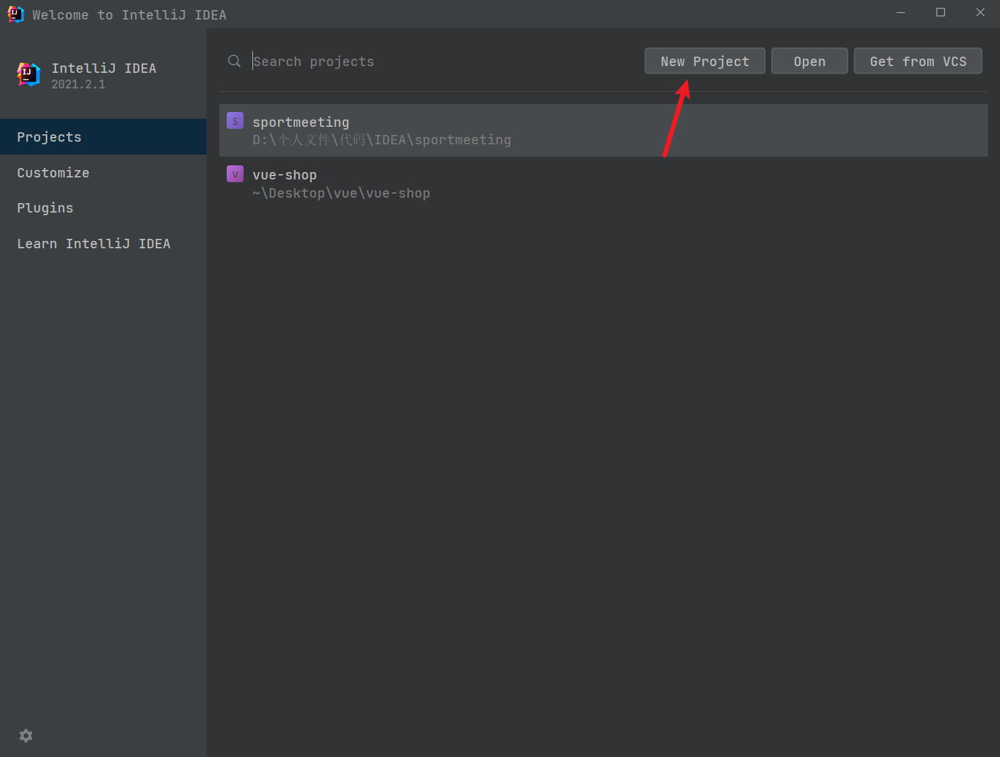

2.   接着选中左侧的 `Java` 选项，然后设置项目的 `JDK`，这里如果你事先安装好了 `JDK`，一般 IDEA 会自动检测出来，如果没有检测出来，那么选中 `Add JDK …`，然后去找你所安装 `JDK` 的路径即可，最后则是选择最下方的 `Next`。 

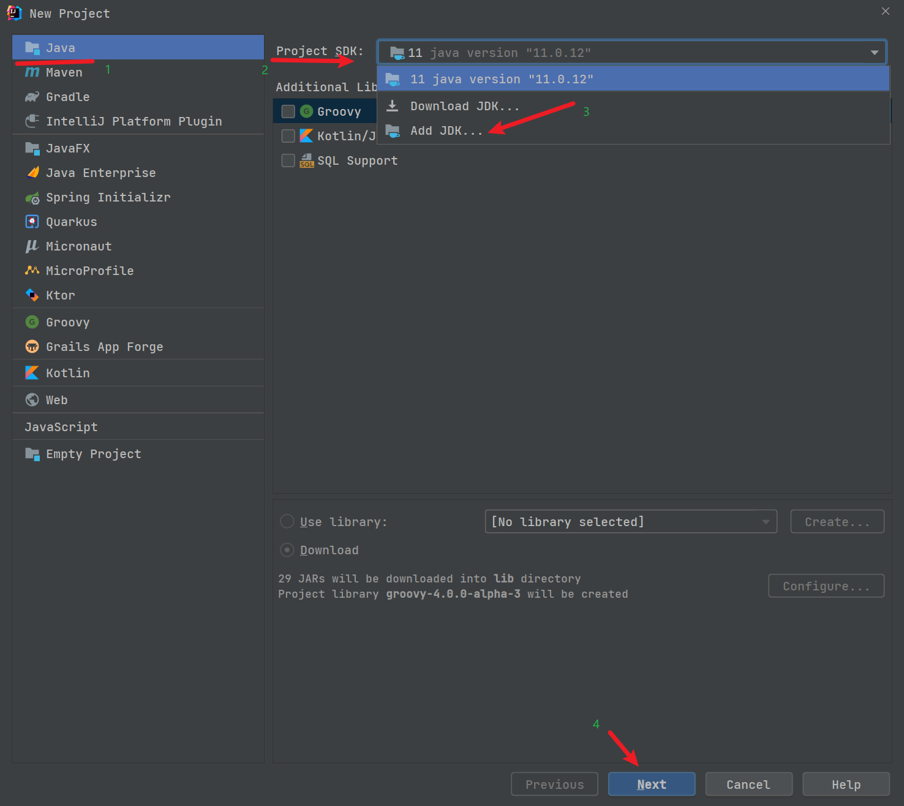

3.   选择是否从模板创建，默认 IDEA 自带有模板，如果你要基于改模板创建，那么就勾选 `Create project from template`，默认我们不勾选，则是创建一个空项目，这里直接点击 `Next` 进入下一步即可。

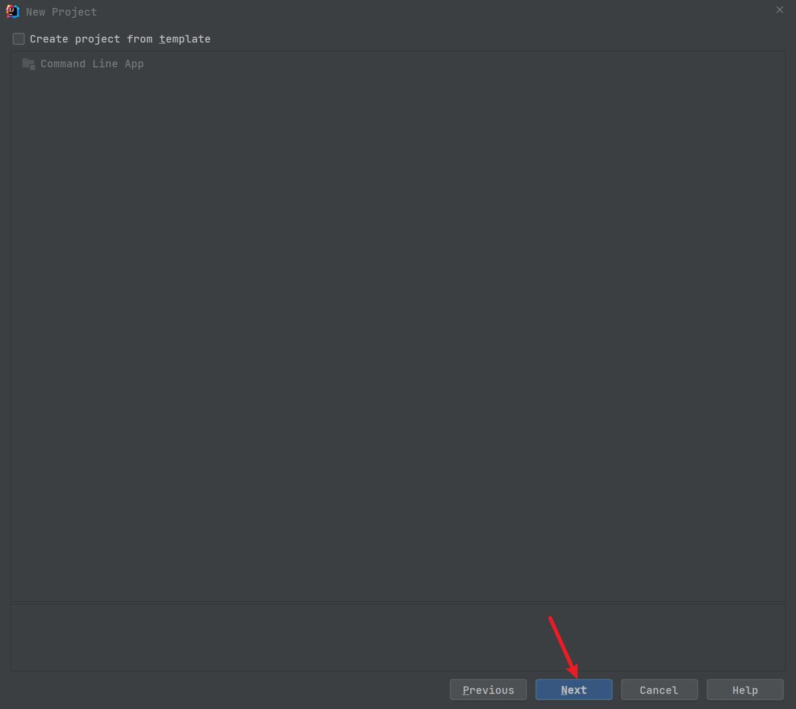

4.   设置项目名以及项目存放路径，这里可以根据自己的需要来自定义，我们这里以 `HelloWolrd` 为示例，设置好项目名和项目存放路径后直接 `Finish` 即可。

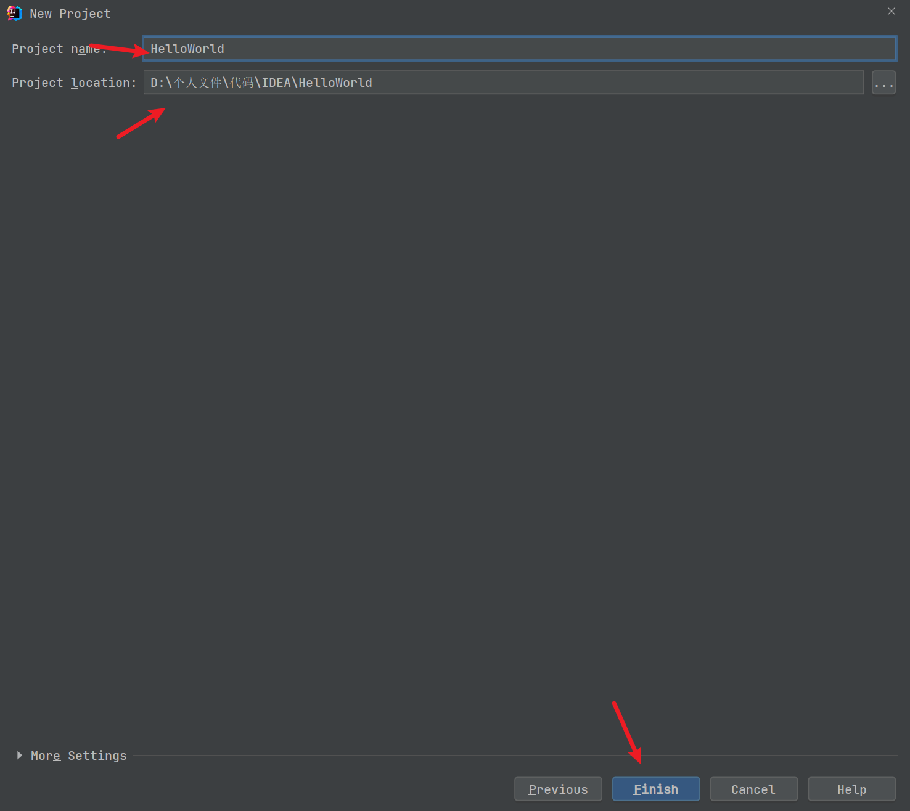

5.   这时候我们的项目就创建好了，创建好项目结构如下图所示。

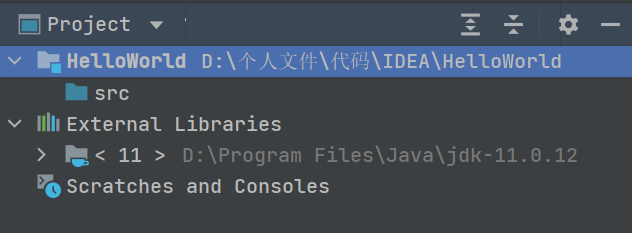

## 编写代码

虽然我们的项目创建好了，但是里边啥都没有，这时候我们就需要来编写我们的代码了。

1.   首先，我们在项目工具窗口鼠标右击 `src` 文件夹，然后选择 `New`，接着选择 `Java Class`（也可以直接使用快捷键 `Alt + Insert`）。

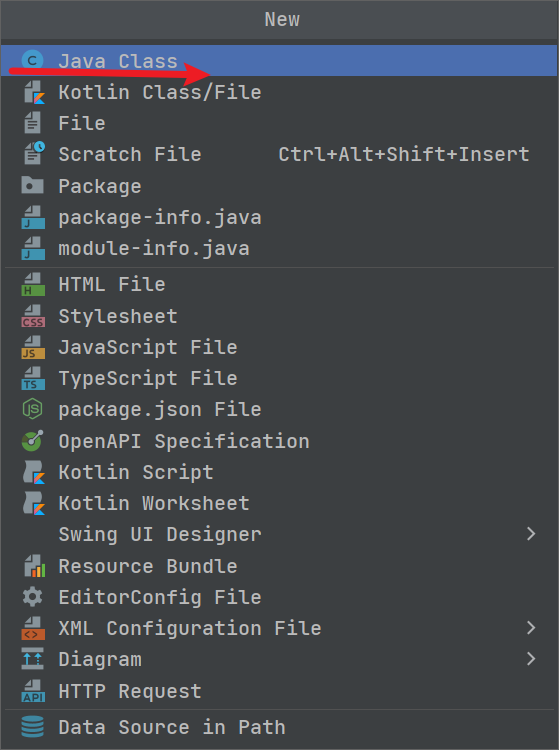

2.   接着在 `Name` 域输入 `com.cunyu1943.helloworld.HelloWorld`，然后回车，接着 `com.cunyu1943.hellowold` 包和 `HelloWorld` 类就创建好了。

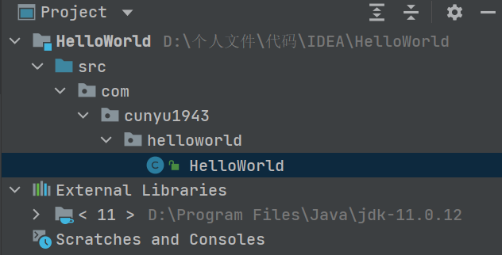

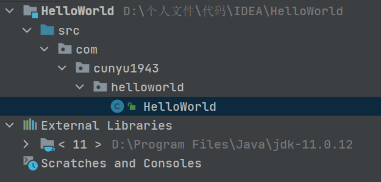

```java
package com.cunyu1943.helloworld;

/**
 * Created with IntelliJ IDEA.
 *
 * @author : 村雨遥
 * @version : 1.0
 * @project : HelloWorld
 * @package : com.cunyu1943.helloworld
 * @className : HelloWorld
 * @createTime : 2021/9/14 9:53
 * @email : 747731461@qq.com
 * @公众号 : 村雨遥
 * @website : https://cunyu1943.github.io
 * @description :
 */
public class HelloWorld {
} 
```

3.   然后输入 `main` 并选择 `main()` 方法的声明，接着在 `main()` 方法中输入如下打印 `Hello World!` 的代码。

```java
package com.cunyu1943.helloworld;

/**
 * Created with IntelliJ IDEA.
 *
 * @author : 村雨遥
 * @version : 1.0
 * @project : HelloWorld
 * @package : com.cunyu1943.helloworld
 * @className : HelloWorld
 * @createTime : 2021/9/14 9:53
 * @email : 747731461@qq.com
 * @公众号 : 村雨遥
 * @website : https://cunyu1943.github.io
 * @description : Hello World 类
 */
public class HelloWorld {
    public static void main(String[] args) {
        System.out.println("Hello World!");
    }
}
```

##  编译并运行项目

代码写好之后，我们先编译下代码，选择工具栏中的编译按钮（也可以使用快捷键  `Ctrl + F9`），项目就会自动进行编译。


编译如果没有出错，那我们就可以接着运行项目了。点击 `main()` 方法之前的绿色三角箭头，项目就会运行起来了（也可以使用快捷键 `Ctrl + Shift + F10`。


或者点击工具栏中的绿色三角箭头即可运行（或者使用快捷键 `Shift + F10`），不过此时运行的是整个项目，而上面的方法则是只运行当前类中的主方法。

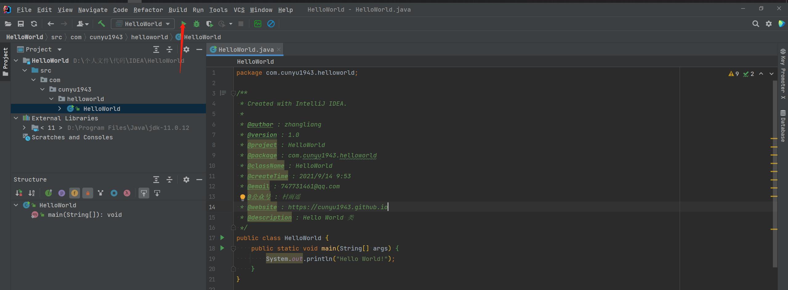

然后就在控制台就可以看到我们程序的输出了。

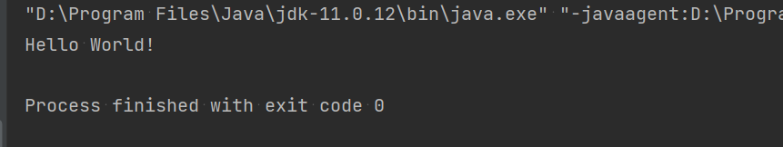

## 打包项目为 JAR 应用

依次点击 `File -> Project Structure`，进入项目结构（或者使用快捷键 `Ctrl + Shift + Alt + S`），然后进入选中 `Project Settings -> Artifacts`。

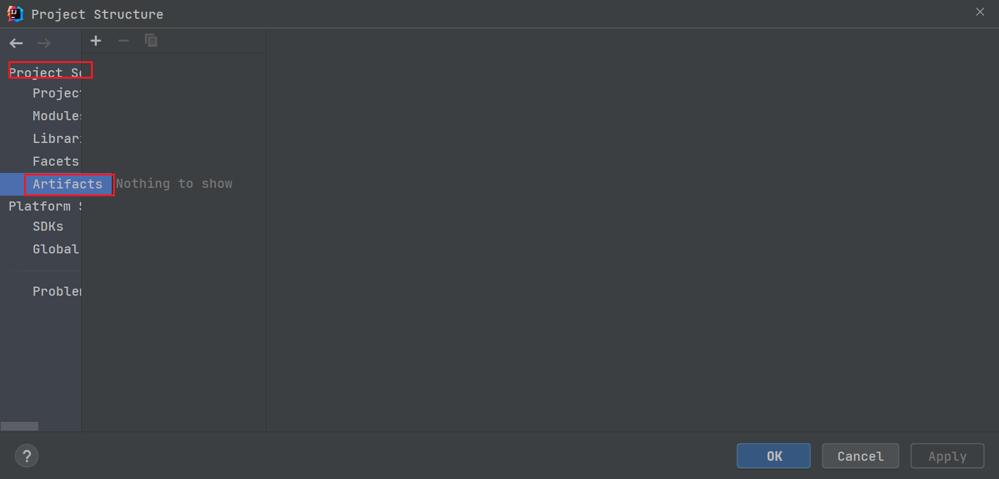

点击左上角的 `+`，然后选中 `JAR -> From modules with dependencies`，接着会进入 `Create JAR from Modules`，将 `Main Class` 设置为刚才的 `HelloWolrd`，最后点击 `ok` 即可。

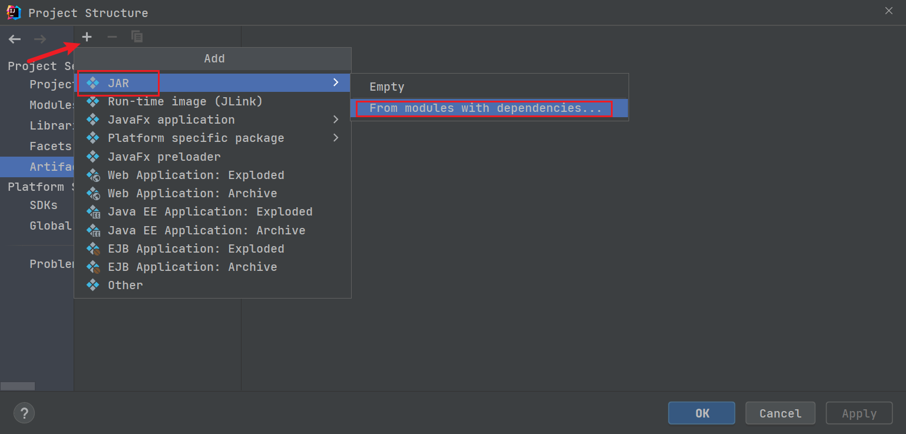

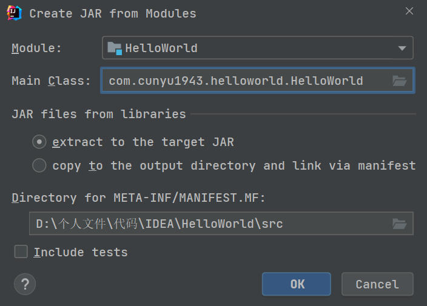


确定并 `apply` 之后，此时项目打包就配置好了，然后选择菜单栏中的 `Build -> Build Artifacts`，然后点击 `HelloWorld:jar` 并选择 `Build`，然后等待打包完成即可。

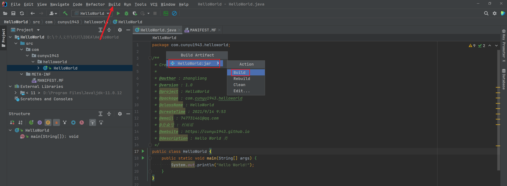

接着在我们项目的  `out -> artifacts` 目录下，就可以找到 `HelloWorld.jar` 了，此时我们项目的打包工作也完成了。

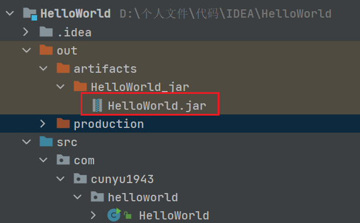

## 运行 JAR 应用

既然我们把项目打包了，那这个时候我们就不需要再在 IDEA 中就能运行我们的项目。找到我们打包好的 `HelloWorld.jar`，然后在控制台中运行如下命令即可。

```bash
java -jar HelloWorld.jar
```

可以看到同样打印出了 `Hello Wolrd!`，说明我们项目打包成功，而且也将其顺利运行。

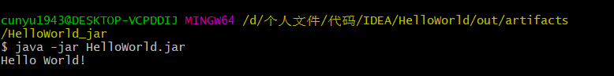

## 总结

今天的内容就到此结束了，本文主要讲了如何利用 IDEA 来创建、编译、运行、打包我们的 Java 项目。如果你有更多关于 IDEA 使用的小技巧，欢迎在评论区留言。

创作不易，如果你觉得本文对你有所帮助，那就来一波点赞关注吧。
