# 集成并使用 Git 图文教程

## 前言

一般在进行项目开发时，都离不开版本控制，当前主流的版本控制工具无非就是 Git 和 SVN，而且现在 Git 的使用率可以说是已经远远超过 SVN，本文就主要看看，如何使用 IDEA + Git 来控制代码版本，让团队开发更流畅！

## Git 安装及配置

既然要使用 Git，那么首当其冲的当然是需要安装 Git 了，具体安装过程就不说了，就直接下一步下一步的事儿。

接下来就来说说，当我们安装好 Git 后的事。安装好 Git 之后，打开 IDEA 的设置界面，依次进入 `File -> Settings -> Version Control -> Git`（也可以通过快捷键 `Ctrl + Alt + S` 进入设置），然后将 `Path to Git executable` 设置为你安装的 Git 所在路径即可，比如我的是 `D:\Program Files\Git\bin\git.exe`。

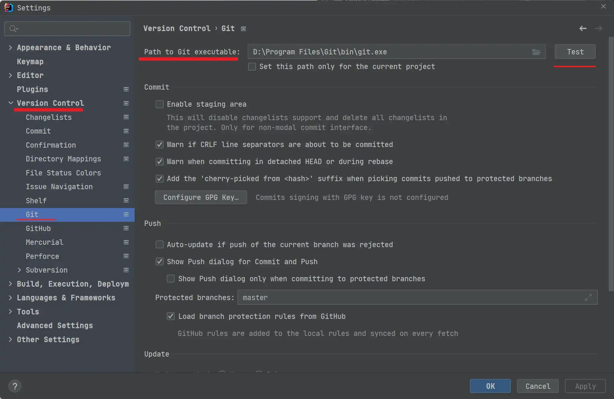

设置完成之后，点击右方的 `Test`，如果 Git 安装成功且路径正确，就会弹出如下的提示信息，说明我们的配置也就成功了。

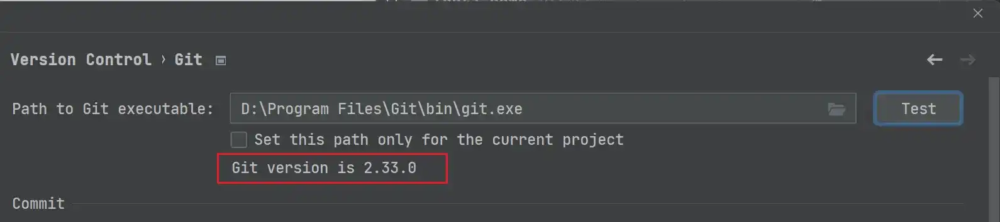‘

## Github 设置

同样的，我们可以发现 `Version Control` 中还有一个 Github 选项卡，这里我们可以使用自己的 Github 账号进行登录，即 `Log In via Github`，然后就可以直接将我们 Github 上的代码拉取下来了。

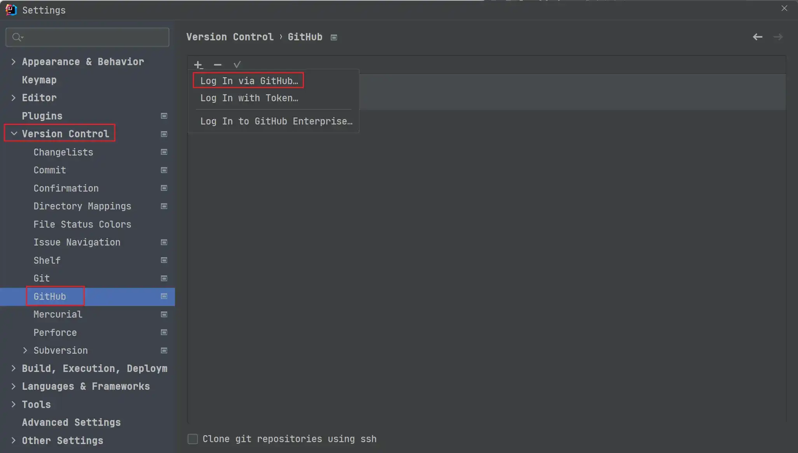

登陆成功后，则会出现我们 Github 账号的相关信息，如下图。

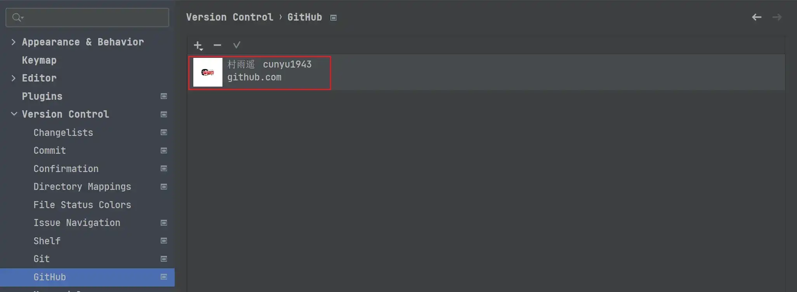

## 拉取远程 Git 仓库代码

这里平时可能更多的是将公司的 Git 库中的代码拉取到本地进行协同开发，不过这里没法演示，所以就用 IDEA 从 Github 拉取代码为例，来演示如何从远程 Git 仓库拉取代码。

这里主要有两种方式，第一种是事先通过 Git 工具将代码拉取到本地，然后再通过 IDEA 进行打开；而另一种则是通过 IDEA 直接将代码拉取下来，下面分别演示下这两种操作。

### 先拉取，再打开

首先找到我们要 Github 仓库，然后复制 Github 仓库路径。

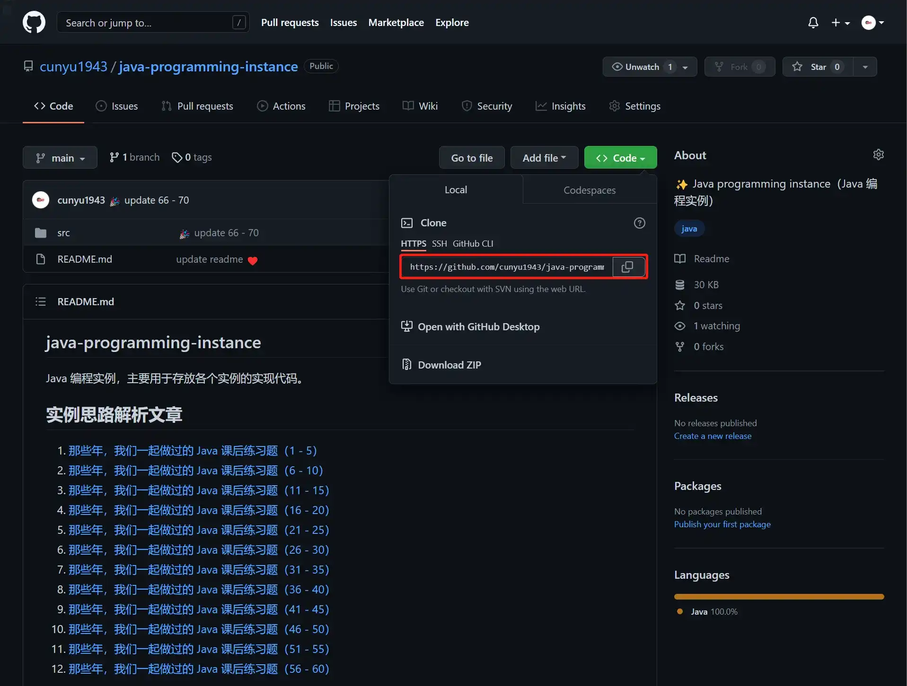

然后打开终端，使用如下命令克隆到本地。

```shell
git clone Githu 仓库地址
```

```shell
git clone https://github.com/cunyu1943/java-programming-instance.git
```

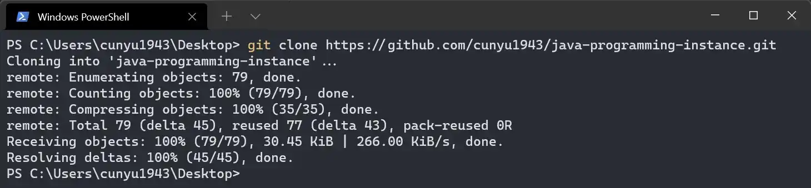

拉取成功后，我们就可以通过 IDEA 打开该项目，依次进入 `File -> Open`，然后找到上一步中克隆下来的代码所在路径，即可打开项目。

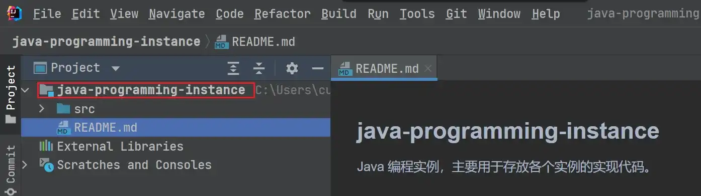

### 直接拉取打开

除开上面的方式之外，我们也可以直接通过 IDEA 拉取代码，依次进入 `File -> New -> Project from Version Control`，然后这里也有两种方式拉取。

1.   **URL 拉取**

这里我们将我们在上一部分中所复制的仓库库地址 url 填入 `URL`，然后 `Version control` 选择 `Git`，`Directory` 则是我们要存放该代码的本机路径，后面拉取下来的代码将放在该路径中。

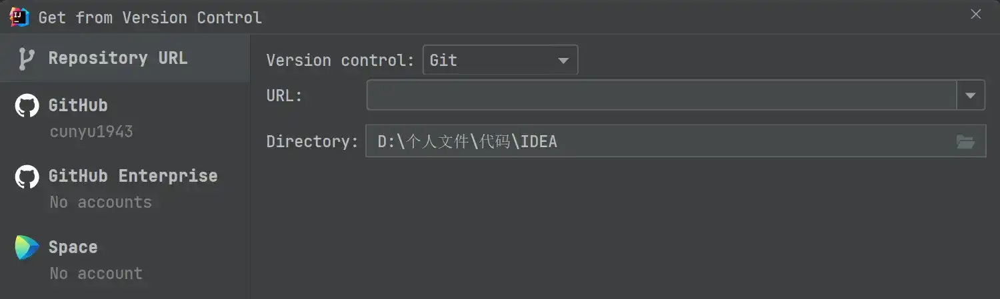

2. **账号拉取**

Github 设置部分我们已经登陆了 Github 账号，此时也可以通过 Github 选项，然后找到我们要拉取代码的仓库，这里可以通过最上方的搜索框进行搜索快速定位，然后点击下方的 `Clone` 即可进行拉取，其中 `Directory` 同上一种拉取方式，也是我们拉取代码存放的路径。

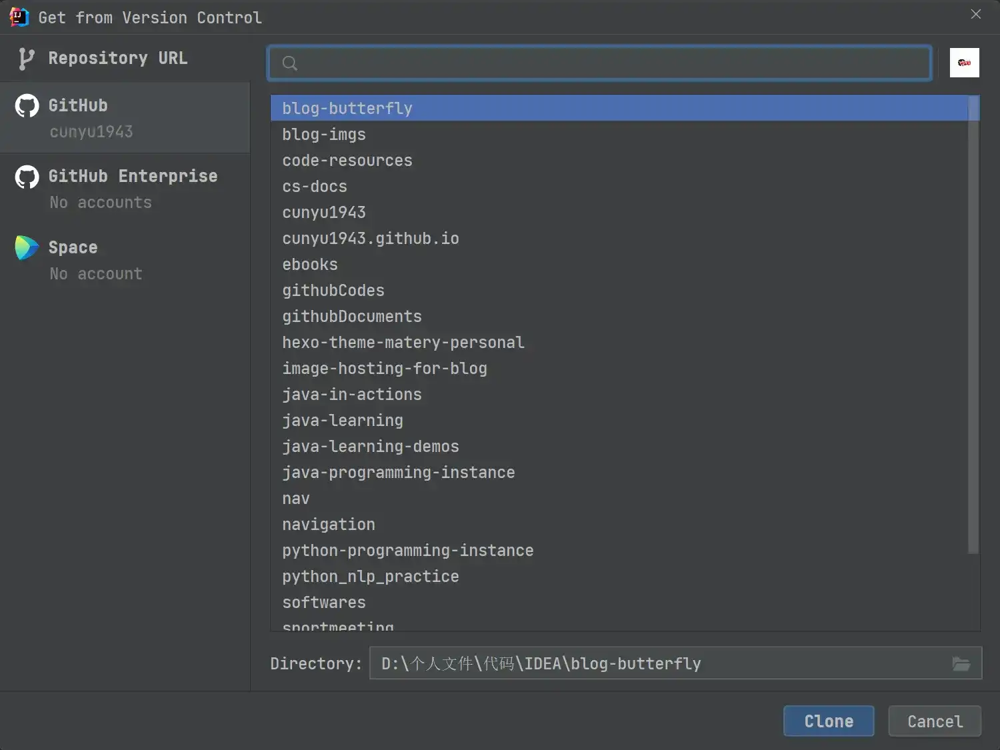

此外，还有 `Githu Enterprise` 和 `Space` 两种方式拉取，不过这两种方式更偏向于公司或者组织，一般个人的话是不需要用到这部分的，这里知道就好，使用方法和上述两种方式大同小异。

## 更新代码

一般在将本地代码提交到远程仓库时，最好先更新下远程仓库的代码到本地，从而避免不必要的冲突。

更新的方式也很简单，可以通过快捷键 `Ctrl + T` 进行拉取，也可以通过工具栏中的按钮来实现。

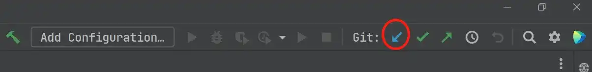

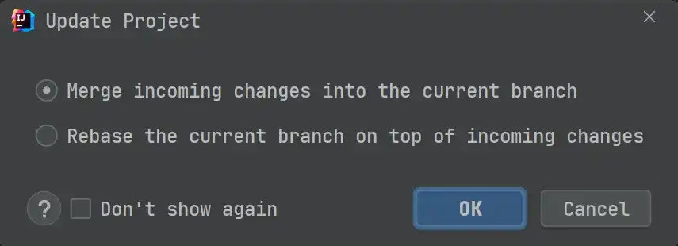

更新时有两种方式，一种是 `Merge incoming changes into the current brance`，而另一种则是 `Rebase the current branch on top of incoming changes`。

其中 `Merge` 的原理是找到两个分支的祖先 `commit`，然后将公共分支最新版合并到自己的分支，形成一个新的 `commit` 提交，用图表示如下。

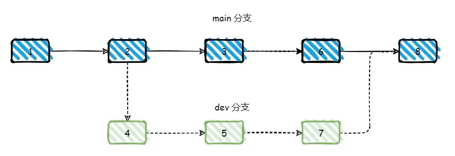

`Rebase` 则是重新基于一个分支进行 `commit`，即将当前分支从祖先的 `commit` 后所提交的 `commit` 均撤销，将他们放到一个缓存中，然后基于一个分支的后面，将缓存的 `commit` 按照顺序以一个个新增到该分支后面，用图表示如下，将 4 和 5 所提交的 `commit` 放到缓存中，然后按顺序将其新增到 6 的后面。

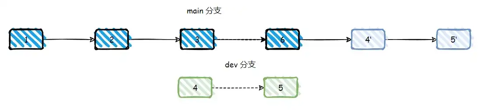

而使用 `Rebase` 和 `Merge` 的基本原则可以总结如下三条：

1.   **下游分支更新上游分支内容时使用 `Rebase`**
2.   **上游分支合并下游分支内容时使用 `Merge`**
3.   **更新当前分支内容时一定要使用 `--rebase` 参数**

更多关于 `Rebase` 和 `Merge` 的区别，可以参考这篇文章：

>   https://zhuanlan.zhihu.com/p/34197548

除开快捷键和点击工具栏中按钮更新的方式之外，还可以在项目上点击鼠标右键，然后依次进入 `Git -> Pull` 进行更新。

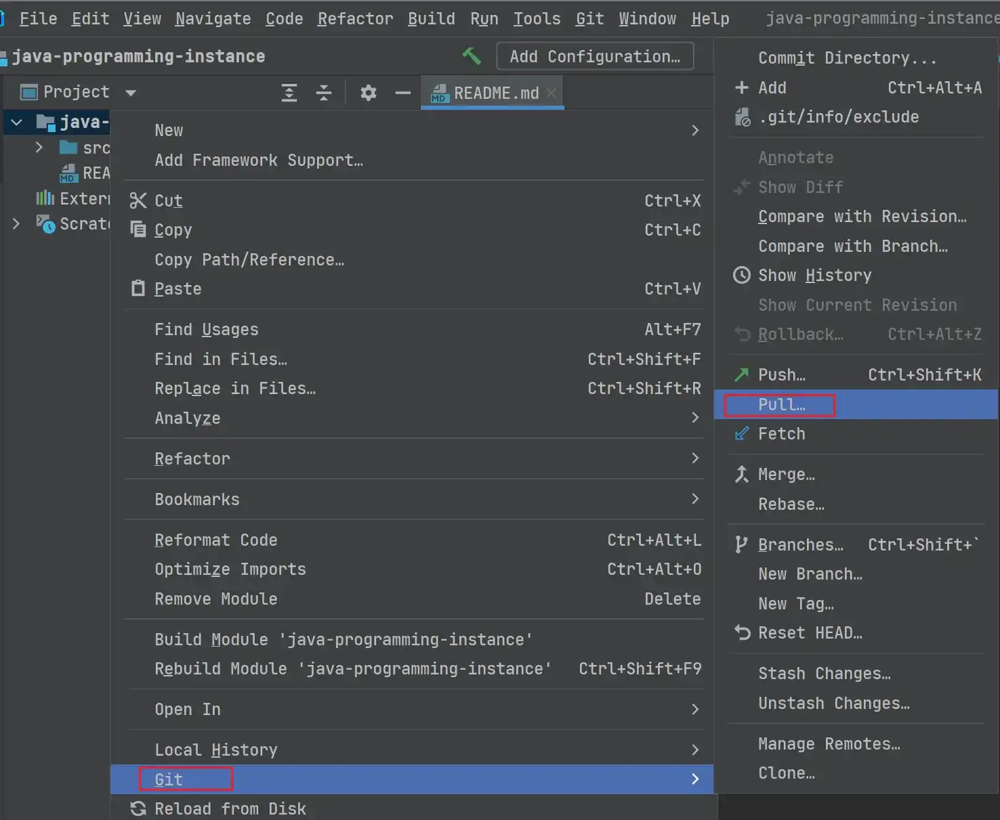

## 提交代码

本地进行开发工作后，我们需要将我们的代码提交到远程仓库，此时也可以通过以下两种方式进行。

1.   **快捷键**

通过快捷键 `Ctrl + K` 打开代码提交工作区，可以看到文件会被标识成不同的颜色，一般是红色、绿色、蓝色，三者的意义分别代表如下：

-   **红色**：表示该文件未加入到版本控制中，比如 Java 项目中的 `target` 文件夹，这里我们可以在 `.gitignore` 文件中进行配置。
-   **绿色**：表示该文件是新加入版本控制中的文件，比如我们项目中新建的文件，但此时它还未被提交到远程代码仓库。
-   **蓝色**：表示该文件是修改的文件，在我们远程的代码仓库中已经存在该仓库，只是我们对它进行了修改还没有提交而已。

此外，还有一个 `Amend` 区域，这里主要用于填写我们的提交信息。

完成勾选我们需要提交的代码文件以及填写提交信息后，我们就可以点击 `commit` 按钮完成代码提交。

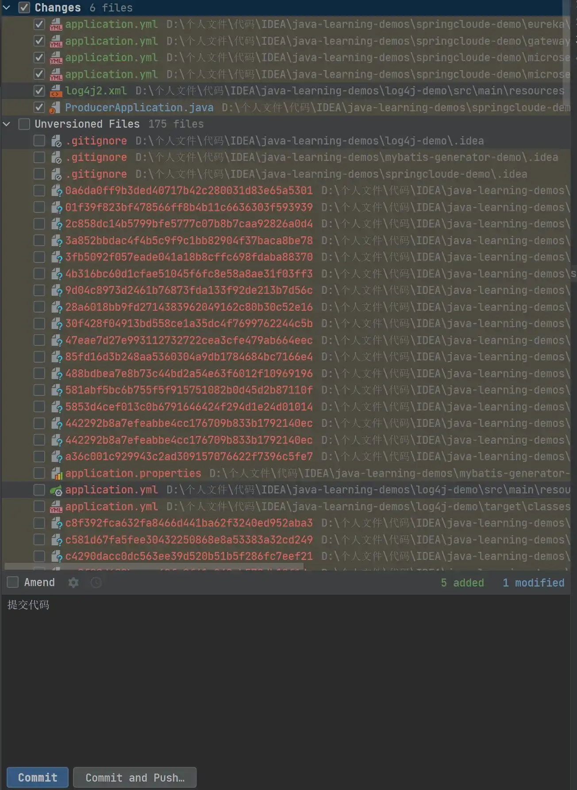

2.   **工具栏按钮**

同样的，我们也可以通过工具栏中的按钮进行提交，点击该按钮后，出现的界面应该和通过快捷键提交方式的界面一致。


## 推送代码

提交代码后，只是将代码提交到了本地缓冲区，要真正提交到远程代码仓库中，还需要我们进行推送，这里同样有多种方式进行推送。

1.   **快捷键**

通过快捷键 `Ctrl + Shift + K`，我们可以打开如下界面，此时我们只要选中我们所要提交的记录，然后点击右下方的 `Push` 按钮即可。


2.   **工具栏按钮**

通过工具栏按钮，我们同样进行推送工作，点击如下图中的按钮后，出现的界面应该和通过快捷键推送的界面一致。

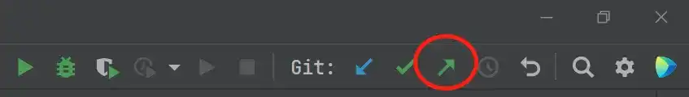

3.   **鼠标右键**

通过在项目上点击鼠标右键，然后选择 `Git -> Push`，同样可以进行我们的推送工作。

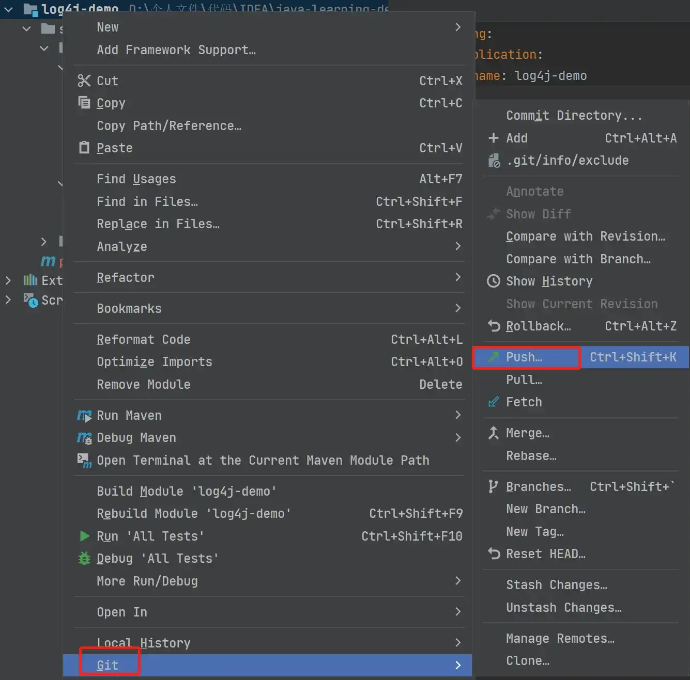

4.   **提交的同时进行推送**

可能在提交时，大家会发现左下角除了 `Commit` 按钮之外，还存在一个 `Commit and Push` 按钮。通过点击该按钮，我们就可以在提交的同时弹出推送解码，然后点击需要推送的记录，点击右下方的 `Push` 按钮即可。

## 分支管理

一般来说，我们的项目肯定是有多个分支的，假设我们此时要在 IDEA 切换分支，该怎么办呢？

此时就需要关注下 IDEA 底部的状态栏了，在这里我们不仅可以切换不同分支，还能进行新建分支、Checkout 分支代码、Compare 分支代码、`Rebase`、`Merge`、`Pull` 等一系列操作。


## 总结

好了，以上就是本文的所有内容了，主要从 Git 安装及配置、Github 设置、拉取远程代码、更新、提交、推送代码、分支管理等几方面给大家介绍了如何在 IntelliJ IDEA 中使用 Git，希望能对大家有所帮助。

同时，大家如果有任何的疑问，还可以在评论区畅所欲言，我将在看到的第一时间进行回复！