# 原来大厂都是这么提交代码的

:::info 共勉
不要哀求，学会争取。若是如此，终有所获。
:::
:::tip 原文
https://mp.weixin.qq.com/s/Mhc7tygE6Fl5_3h8mz7A9g
:::

## 前言

在开发大型项目时，通常都是由团队来进行开发。此时，每个人有每个人的代码编写风格和提交习惯，如果放任自由发挥，那么代码质量和代码提交日志就难免风格各异，导致项目代码质量难以保持统一。针对这一问题，往往公司在以项目组进行开发时，在进入正式编码前，都会制定一个标准的流程，用来规范代码提交前的流程，同时对提交日志进行规范化。从而最大程度上保持项目的代码风格统一，提高代码可读性。

以下就给大家介绍一下最常见的代码提交前的规范化流程，以及如何模板化我们的代码提交日志。

## 代码提交前检查流程

### 推荐插件

#### p3c

- **下载地址**

> https://plugins.jetbrains.com/plugin/10046-alibaba-java-coding-guidelines/versions

- **安装及使用**

> https://github.com/alibaba/p3c/wiki/IDEA%E6%8F%92%E4%BB%B6%E4%BD%BF%E7%94%A8%E6%96%87%E6%A1%A3

#### SonarLint

- **下载地址**

> https://plugins.jetbrains.com/plugin/7973-sonarlint/versions

- **安装及使用**

> https://www.cnblogs.com/cocoxu1992/p/11336723.html

### 提交前的配置项

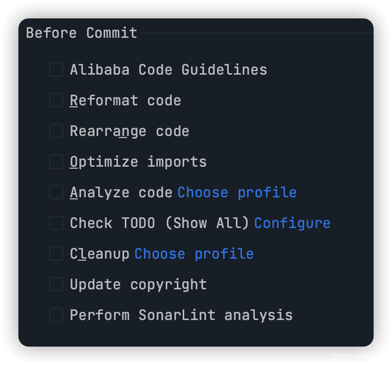

#### Alibaba Code Guidelines

安装 `p3c` 插件后，才会有该选项。在提交代码改动之前，如果勾选此选项，则会去扫描代码中不符合 `p3c` 规则中的代码，然后弹窗提示存在可疑代码，此时可以到控制台查看存疑的代码。然后只需要根据控制台中提示的去修改代码即可。

- 代码存疑弹窗
  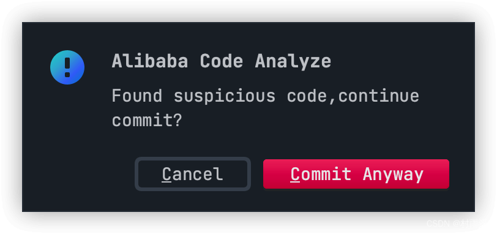
- 控制台中存疑的代码提示
  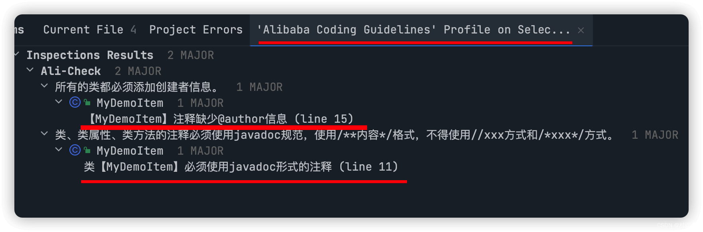

#### Reformat code

提交前格式化代码，假设我们在代码中写了如下代码：

```java
int a=3;
```

如果我们在提交前勾选了此选项，提交时 `IDEA` 就会自动对此行代码进行格式化，变成以下的格式，从而大大提高代码可读性。

```java
int a = 3;
```

#### Rearrange code

重新编排代码，IntelliJ IDEA 支持各种复杂的编排设置选项，当我们在 IDEA 中设置好了编码功能之后，这里就可以尝试勾选这个进行自动编排。不过一般没有去做特定的编码功能设置，因此建议不勾选。

#### Optimize imports

优化导包（删除无用的导包）。假如在写代码时一开始引入了 `Scanner` 包，但后续又没有用到，此时勾选此选项 `IDEA` 就会自动将引入的 `Scanner` 包删除。

- 勾选前

```java
package com.demo;

import java.util.Scanner;

public class Main {
    public static void main(String[] args) {
        System.out.println("Hello World!");
    }
}
```

- 勾选后

```java
package com.demo;

public class Main {
    public static void main(String[] args) {
        System.out.println("Hello World!");
    }
}
```

#### Analyze code

勾选该选项后，`IDEA` 会用默认的配置文件去扫描我们所写代码的质量。如果扫描发现问题，则会弹出以下类似的弹窗，此时只要点击 `Review` 就可以对代码中存在问题的地方进行 `Review`，根据所给提示对代码进行修改。

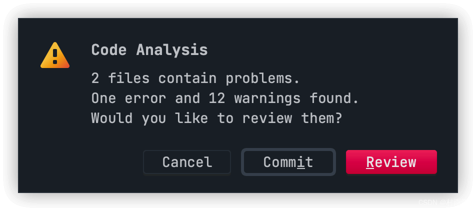

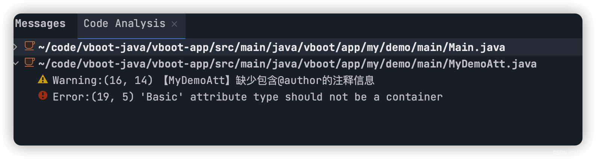

#### Check TODO

检查代码中存在 `@todo` 注解的地方并给出提示。一般在代码中添加 `@todo` 表示此时代码中还有未完成的功能，此时可以提醒你去补全还未完成的功能代码。

```java
public class Main {
    public static void main(String[] args) {
        System.out.println("Hello World!");
        //@todo
    }
}
```

如果我们新增的代码如上，此时如果在提交点前勾选 `Check TODO` 选项，就会弹窗提示。

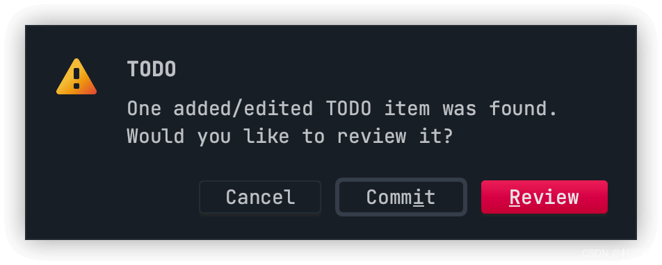

此时点击 `Review` 就可以去查看对应分析结果，然后去找到对应 `todo` 所在的代码对它进行补充。

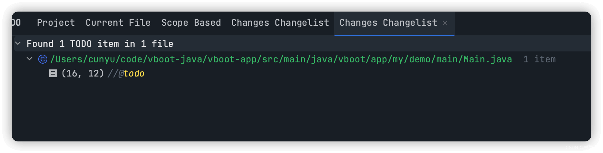

#### Cleanup

清除下版本控制系统，去掉一些版本控制系统的错误信息，主要针对 SVN，Git 不适用，一般建议不勾选。

#### Update copyright

如果代码需要版权标识时，需要提前在 `IDEA` 中配置相关版权信息。配置的流程 `settings->Editor->copyright->copyright profiles`，然后添加类似于以下的版权信息：

```java
Copyright(c)2002-2022, xxx 有限公司
项目名称:$project.name
文件名称:$file.fileName
Date:$today
Author:xxx
```

配置完成后，当提交你的代码更改时，勾选该选项可以检查更新版权，这样提交后更改的文件将有它们的版权更新。

#### Perform SonarLint analysis

安装 `SonarLint` 插件后才会有的选项。勾选该选项后，`SonarLint` 会对代码进行检查，发现代码中的一些 bug、漏洞、异味。然后根据控制台中的提示信息对代码进行修改后再次提交，能够一定程度上提高代码质量。

```java
public class Main {
    public static void main(String[] args) {
        System.out.println("Hello World!");
        System.out.println("demo");
        int a;
        boolean flag = false;
        //@todo
    }
}

```

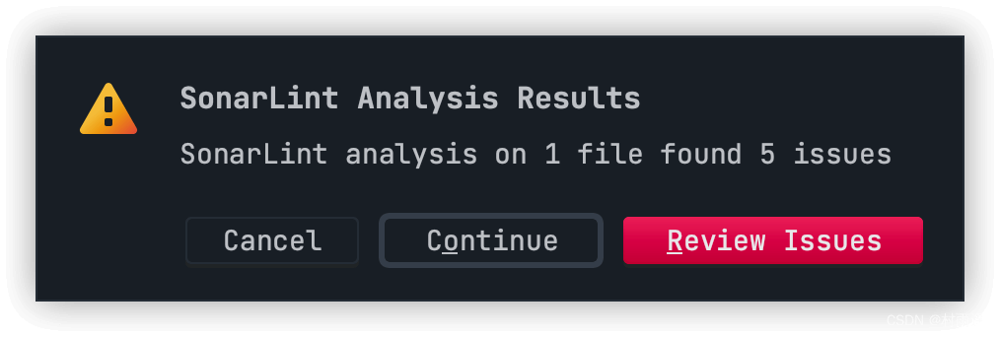

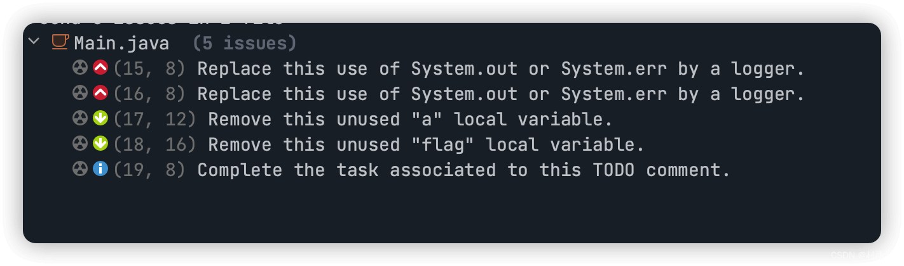

## 提交日志模板化（Git Commit Template）

### 概述

通过使用该插件，能够规范在使用 `IDEA` 提交代码时的注释说明。通过模板化后的日志，便于快速查找，回溯之前的工作。

### 下载安装

1.  **下载地址**

> https://plugins.jetbrains.com/plugin/9861-git-commit-template/versions

2.  **安装**

> https://blog.csdn.net/m0_46636892/article/details/122116712

### 使用教程

#### 提交信息的模板

```
<type 类型>(<scope 可选作用域>): <subject 描述>
// 空行
<body 可选的正文>
// 空行
<footer 可选的脚注>
```

主要分为三部分：

- Head（`<type 类型>(<scope 可选作用域>): <subject 描述>`）
- Body（`<body 可选的正文>`）
- Footer（`<footer 可选的脚注>`）

#### Head 参数说明

1.  **type（必填）**

| 类型       | 英文                                                                                                    | 中文说明                                       |
| ---------- | :------------------------------------------------------------------------------------------------------ | ---------------------------------------------- |
| `feat`     | `A new feature`                                                                                         | 新功能                                         |
| `fix`      | `A bug fix`                                                                                             | `bug` 修复                                     |
| `docs`     | `Documention only`                                                                                      | 文档注释                                       |
| `style`    | `Changes that do not affect the meaning of the code(white-space、formatting、missing semi-colons、etc)` | 不影响代码运行的变动（格式化、去空格等）       |
| `refactor` | `A code change that neither fixes a bug nor adds a feature`                                             | 重构、优化（既不增加新功能，也不是修复 `bug`） |
| `perf`     | `A code change that improves performance`                                                               | 性能优化                                       |
| `test`     | `Adding missing tests or correcting existing tests`                                                     | 增加测试                                       |
| `build`    | `Changes that affect the build system or external dependencies`                                         | 影响生成构建或外部依赖项的更改                 |
| `ci`       | `Changes to our CI configuration files and scripts`                                                     | 对配置项配置文件和脚本的更改                   |
| `chore`    | `Other changes that don't modify src or test files`                                                     | 其他不影响源码和测试的改动                     |
| `revert`   | `Reverts a previous commit`                                                                             | 回退版本                                       |

2.  **scope（可选）**

用户说明此次提交所影响的范围，常见的有数据层、控制层、视图层等，这个需要根据自己的项目来具体定义。

3.  **subject（必填）**

此次提交的概括，一般建议不超过 50 字，结尾不加任何标点符号。

#### Body 参数说明

对此次提交的详细描述，可以分为多行，每行建议控制在 72 个字以内，以条目的形式给出，范例如下：

```
- 修复 bug1
- 修复 bug2
```

#### Footer 参数说明

主要用于两种情况：

1.  不兼容的变动，对应具体使用部分图中的 `Breaking changes`.
2.  关闭 `Issue`，对应具体使用部分图中的 `Closed issues`.

#### 具体使用

1.  安装完成后，在代码提交界面会有以下图标，点击进行参数配置。

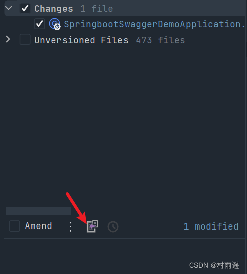

2.  根据自己的需求进行相关配置。

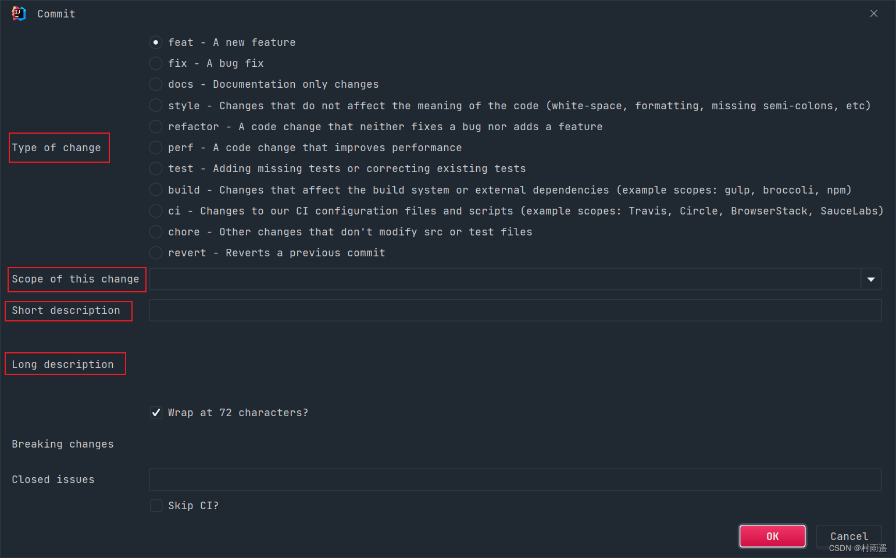

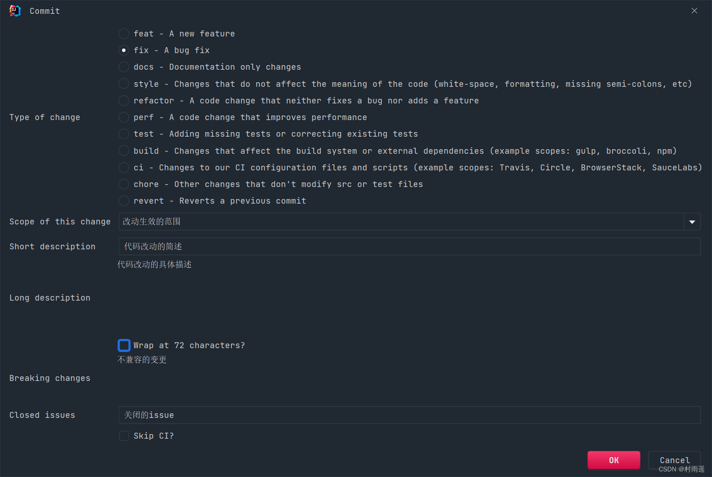

3.  完成配置之后，点击右下角的 `ok`，就会自动根据模板生成提交的具体信息，最后进行提交即可，一个自动生成的具体示例如下：

```java
fix(改动生效的范围): 代码改动的简述

代码改动的具体描述1

BREAKING CHANGE: 不兼容的变更

Closes 关闭的issue
```

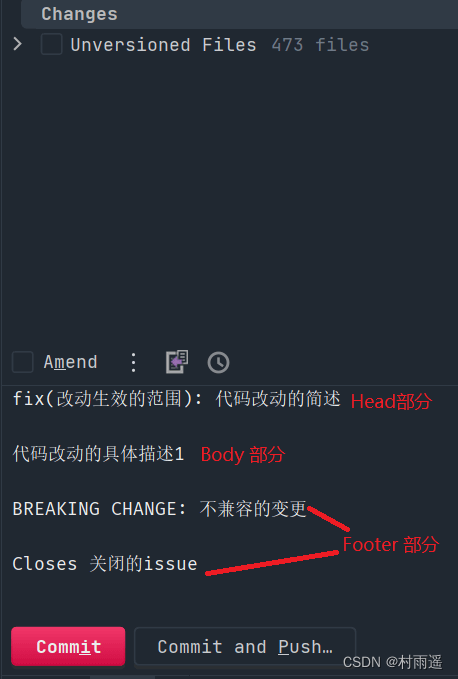

## 总结

可能屏幕前的你所在的项目组并没有这么多的流程和提交规范，但养成良好的编码习惯总归是好的。代码不仅仅是写给自己看的，一个高手不仅仅是能够实现复杂的功能，能把代码编写得能让人看着简洁清爽也是一种艺术。

好了，今天的文章到此就结束了，感谢大家赏脸阅读。对于文中如果有描述不清的地方，或者有什么建议我改进的建议，欢迎与我讨论交流。