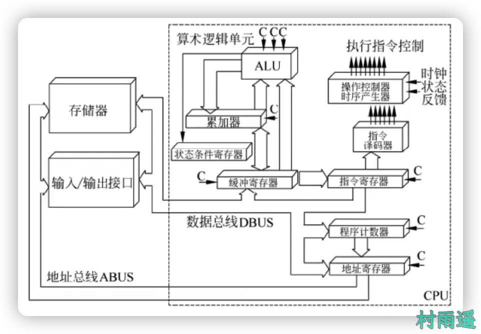
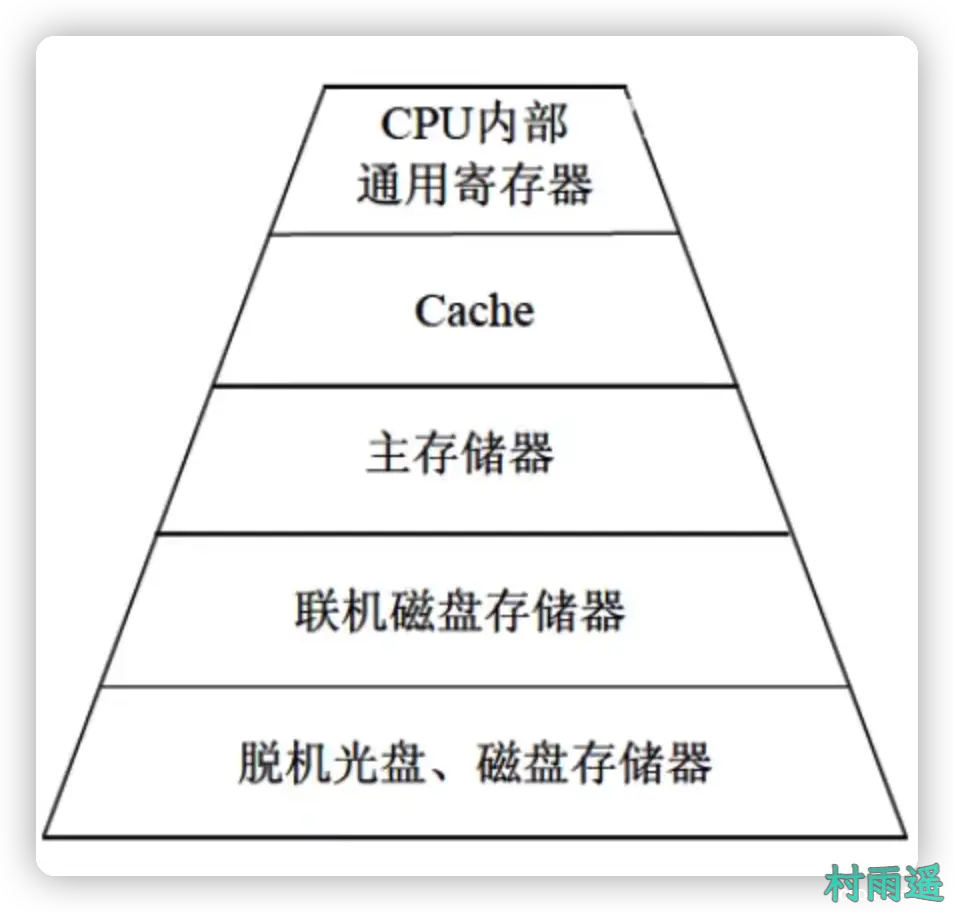
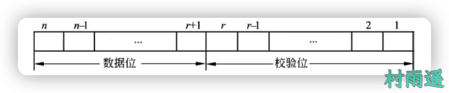

# 计算机系统

::: info 共勉
不要哀求，学会争取。若是如此，终有所获。
:::

## CPU

### 计算机系统硬件组成
计算机系统是由软硬件共同组成，协同运行程序。计算机的基本硬件由 **运算器、控制器、存储器、输入设备、输出设备** 5 大部件组成。其中，运算器和控制器等部件集成到一起的部分称为中央处理器（`CPU`）。`CPU` 是硬件系统的核心，用于加工处理各种数据，能完成各种算术、逻辑运算以及控制功能。

其中，存储器是计算机系统中的记忆设备，分为 **内部存储** 和 **外部存储**。内部存储速度快，但容量小，一般用来临时存放程序、数据及中间结果。而外部存储容量大，但速度慢，能长期保存程序和数据。

输入和输出设备共称为外部设备，输入设备用于输入原始数据及各种命令，最常见的就是键盘，而输出设备则用于输出计算机运行结果，最常见的就是屏幕。

### CPU 功能

`CPU` 是计算机系统的核心部件，负责获取程序指令、对指令译码并加工。其功能主要分为以下 4 点：

1.   **程序控制**：`CPU` 通过执行指令来控制程序的执行顺序。
2.   **操作控制**：一条指令功能的实现需要若干操作信号配合完成，`CPU` 产生每条指令的操作信号并将操作信号送往对应部件，控制相应部件按指令功能要求进行操作。
3.   **时间控制**：指令执行过程中操作信号的出现时间、持续时间以及出现的时间顺序都需要严格控制。
4.   **数据处理**：`CPU` 对数据进行算术和逻辑运算等方式进行加工处理，然后我们就可以利用这些加工后的结果。因此，对数据的加工处理也是 `CPU` 最根本的任务。

除开以上 4 点之外，`CPU` 还需要对系统内外部的中断（异常）做出响应，进行相应处理。

### CPU 组成

`CPU` 主要由运算器、控制器、寄存器组以及内部总线等部件组成。

## 运算器

运算器由 **算术逻辑单元（ALU）**、**累加寄存器** 、**数据缓冲寄存器**、**条件寄存器** 共同组成。它是数据加工处理部件，用于完成计算机的各种算术逻辑运算。相对控制器而言，运算器接受控制器的命令而进行动作，即运算器所进行的全部操作均由控制器发出的控制信号来指挥，因此它是执行部件。

运算器主要功能如下：

1.   执行所有算术运算，如加、减、乘、除等。
2.   执行所有的逻辑运算并进行逻辑测试，如与、或、非等。

此外，运算器的各组成部件功能如下：

1.   **算术逻辑单元（ALU）**：负责处理数据，实现对数据的算术逻辑运算。
2.   **累加寄存器（AC）**：又叫累加器，是一个通用寄存器。当算术逻辑单元执行算术逻辑运算时，为 `ALU` 提供一个工作区。如，执行一个甲酸运算器，先将一个加数取出暂存在 `AC` 中，再从内存储器中取出另一个加数，然后同 `AC` 的内容相加，并将所得结果送回 `AC`。运算的结果是放在累加器中的，运算器中至少要有一个累加寄存器。
3.   **数据缓存寄存器（DR）**：对内存储器进行读/写时，用 `DR` 暂存有内存储器读/写的一套指令或一个数据中，将不同时间段内读/写的数据分隔。`DR` 的主要作用是 **作为 `CPU` 和内存、外部设备间数据传送的中转站；作为 `CPU` 和内存、外围设备之间的操作速度上的缓冲；在单累加器结构的运算器中，数据缓冲寄存器还可以兼作为操作数寄存器**。
4.   **状态条件寄存器（PSW）**：保存由算术指令和逻辑指令运行或测试的结果建立的各种条件码内容，主要分为状态标志和控制标志。这些标志通常分别由 1 位出饭前保存，保存了当前指令执行完成后的状态。通常来说，一个算术操作产生一个运算结果，而一个逻辑操作产生一个判决。

## 控制器

顾名思义，所谓控制器，就是用来控制整个 `CPU` 的工作，决定了计算机运行过程的自动化。它不仅要保证程序的正确执行，还要能够处理异常事件。一般包括指令控制逻辑、时序控制逻辑、总线控制逻辑、中断控制逻辑等。

指令控制逻辑要完成**取指令**、**分支指令**和**执行指令**操作，其过程分为**取指令、指令译码、按指令操作码执行、形成下一条指令地址**等步骤。

1.   **指令寄存器（IR）**：当 `CPU` 执行一条指令式，先将其从存储器读取到缓冲寄存器中，再送入 `IR` 暂存，指令译码器根据 `IR` 内容产生各种未操作指令，控制其他组成部件工作，完成所需功能。
2.   **程序计数器（PC）**：`PC` 具有**寄存信息和计数**两种功能，又叫指令计数器。程序执行分两种情况，一种是顺序执行，一种是转移执行。程序开始执行前，将程序的起始地址送入 `PC`，该地址在程序加载到内存时确认，因此 `PC` 的内容即为程序第一条指令的地址。执行指令时，`CPU` 自动修改 `PC` 中的内容，一遍使其保持的总是将要执行的下一条指令的地址。由于大多指令都是按顺序执行，所以修改的过程常只是简单地对 `PC` 加 `1`。当遇到转移指令时，后继指令的地址根据当前指令的地址加上一个向前或向后转移的位移量得到，或者根据转移指令给出的直接转移的地址得到。
3.   **地址寄存器（AR）**：`AR` 保存当前 `CPU` 所访问的内存单元的地址。由于内存和 `CPU` 存在操作速度上的差异，因此需要用 `AR` 保存地址信息，直到内存中的读/写操作完成。
4.   **指令译码器（ID）**：指令包含操作码和地址码，为了能执行任何给定的指令，必须对操作码进行分析，以便识别所完成的操作。指令译码器就是对指令中的操作码字段进行分析解释，识别该指令规定的操作，向操作控制器发出具体的控制信号，控制各部件工作，完成所需功能。

总结而言，**指令寄存器（IR）存放的是从内存中获取的指令，类似于中间站，用于存放指令。而程序计数器（PC）则存放的是指令的地址，同时还具有计数的功能。地址寄存器（AR）存放的是 `CPU` 访问内存单元的地址。指令译码器（ID）就是把操作码解析为对应的指令操作**。

## 计算机中的基本单位

| 单位   | 表示   | 说明                             |
| ------ | ------ | -------------------------------- |
| 比特   | `bit`  | 最小的数据单位                   |
| 字节   | `Byte` | 最小的存储单位，`1 Byte = 8 bit` |
| 千字节 | `KB`   | `1 KB = 1024 Byte`               |
| 兆字节 | `MB`   | `1 MB = 1024 KB`                 |
| 吉字节 | `GB`   | `1 GB = 1024 MB`                 |
| 太字节 | `TB`   | `1 TB = 1024 GB`                 |

## 进制转换

计算机中，常见的数据表示有以下几种：

1.   二进制，以 `B` 标识，由 `0`、`1` 组成，满 `2` 则进 `1` 位。
2.   十进制，以 `D` 标识，由 `0 ~ 9` 组成，满 `10` 则进 `1` 位。
3.   八进制，以 `O` 标识。由 `0 ~ 7` 组成，满 `8` 则进 `1` 位。
4.   十六进制，以 `H` 标识。由 `0 ~ 9` 以及 `A、B、C、D、E` 组成，满 `16` 则进 `1` 位。

一个十六进制的数要用 `4` 个二进制的数来表示，而一个八进制需要转成对应 `3` 个二进制。

## 原码、反码、补码、移码

计算机中，数值是以机器数的形式来表示的，特点是采用了二进制计数法，数的符号用 `0` 和 `1` 表示，小数点则银行，表示不占位置，而机器数所对应的实际数值就叫做数的真值。

机器数又分为**有符号数**和**无符号数**。其中，无符号数对应正数，表示在机器数中没有符号位。对于无符号数，如果约定小数点的位置在机器数的最低位之后，则该数为纯整数。如果约定小数点的位置在机器数的最高位之前，那么这个数是纯小数。对于带符号数，机器数的最高位是表示正、负的符号位，其余位则表示数值。

为了方便运算，带符号的机器数可以采用原码、反码、补码等不同编码方式，而这些编码方式就叫做码制。

### 原码

原码表示法中，最高位是符号位，其中 `0` 表示正号，`1` 表示负号，其余的 `n - 1` 为则表示数值的绝对值。这里要注意 `0` 比较特殊，它的原码有两种表示形式：

$$[+0]_\text{原} = 00000000$$

$$[-0]_\text{原} = 10000000$$

### 反码

同样的，反码表示中，最高位仍然是符号位，`0` 表示正号，`1` 表示负号。如果该数是一个正数，那么它的反码和原码相同。而如果该数是一个负数，那么它的反码则是原码除符号位之外的其他位按位取反。`0` 的反码也有两种表示形式：

$$[+0]_\text{反} = 00000000$$

$$[-0]_\text{反} = 11111111$$

### 补码

补码中，最高位为符号位，`0` 表示正号，`1` 表示负号。如果一个数是正数，那么它的补码与原码和反码一样。而如果一个数为负数，则补码为反码末位加 `1`。此时 `0` 有惟一的编码表示。

$$[+0]_\text{补} = [-0]_\text{补} = 00000000$$

### 移码

移码的表示与补码有很大关系，它就是将一个数的补码的符号位取反即可。如 `+1` 的补码为 `00000001`，那么它的移码为 `10000001`。

### 注意

当机器字长为 `n` 时，此时该机器中各种码制所表示的带符号数的范围如下：

| 码制 | 定点整数                      | 定点小数                            |
| ---- | ----------------------------- | ----------------------------------- |
| 原码 | $-(2^{n-1}-1)\sim(2^{n-1}-1)$ | $-(1-2^{-(n-1)})\sim(1-2^{-(n-1)})$ |
| 反码 | $-(2^{n-1}-1)\sim(2^{n-1}-1)$ | $-(1-2^{-(n-1)})\sim(1-2^{-(n-1)})$ |
| 补码 | $-(2^{n-1})\sim(2^{n-1}-1)$   | $-1\sim(1-2^{-(n-1)})$              |
| 移码 | $-(2^{n-1})\sim(2^{n-1}-1)$   | $-1\sim(1-2^{-(n-1)})$              |

在做相关题目时，可以记住以下要点：**当给定一个数的补码求它的原码时，先将这个数补码的反码求出来，然后再求出它反码的补码，此时得到的就是这个数的原码。**

## 浮点数

当机器字长为 `n` 时，定点数的补码和移码可以表示为 `2^n` 个数，而其原码和反码只能表示 `2^n - 1` 个数（`0` 的表示占了两个编码）。因此定点数能表示的数值范围较小，运算时很容易越界溢出。而浮点数是小数点范围不固定的数，能表示的范围更大。

浮点表示法中，阶码是带符号的纯整数，而位数是带符号的纯小数。浮点数的表示格式如下：

$$N = 2^E×F$$

其中 `E` 称为阶码，`F` 称为尾数。

一个数的浮点表示不是唯一的。当小数点的位置改变时，阶码也会随之改变，因此一个数可以用多个浮点形式表示。

浮点数所能表示的数值范围主要由阶码决定，而其表示的精度则由尾数决定。为了充分利用尾数来表示更多的有效数字，常采用规格化浮点数。规格化就是将尾数的绝对值限定在 `[0.5, 1]`。此外，当尾数用补码表示时，需要注意以下问题：

1.   若位数 `F >= 0`，则其规格化的位数形式为 `F = 0.1xxx……x`，其中 `x` 既可以为 `0`，也以为 `1`，即将尾数限定在 `[0.5, 1]`。
2.   若尾数 `F < 0`，则其规格化的尾数形式为 `F = 1.0xxx……x`，其中 `x` 可以为 `0`，也可以为 `1`，即将限定在 `[-1, -0.5]`。

若浮点数的阶码（包括 `1` 位阶符）用 `R` 位的移码表示，尾数（包括 `1` 位数符）用 `M` 位的补码表示，则该浮点数的范围为：

$$-1*2^{(2^{R-1}-1)}\sim(1-2^{1-M}*2^{2^{R-1}-1})$$

## 寻址方式

常用的寻址方式：

1.   **立即寻址**：操作数包含在指令中。
2.   **直接寻址**：操作数存放于内存单元，指令中直接给出操作数所在存储单元的地址。
3.   **寄存器寻址**：操作数放在某一寄存器中，指令中给出存放操作数的寄存器名。
4.   **寄存器间接寻址**：操作数存放于内存单元，操作数所在存储单元的地址在某个寄存器中。
5.   **间接寻址**：指令中给出操作数地址的地址。
6.   **相对寻址**：指令地址码给出的是一个偏移量（可正可负），操作数地址等于本条指令的地址加上该偏移量。
7.   **变址寻址**：操作数地址等于变址寄存器的内容加偏移量。

寻址速度由高到低：**立即寻址** > **寄存器寻址** > **直接寻址** > **寄存器间接寻址** > **间接寻址**

## 校验码

所谓码距，指的是一个编码系统中任意两个合法编码间至少有多少个二进制位不同。

### 奇偶校验码

奇偶校验是一种简单有效的校验方法，通过在编码中增加一位校验位来使编码中 `1` 的个数为奇数（奇校验）或偶数（偶校验），从而使码距变为 `2`。对于奇校验，可以检测代码中奇数位出错的编码，但不能发现偶数位出错的情况，即当合法编码中的奇数位发生错误时，编码中的 `1` 变成了 `0` 或者 `0` 变成 `1`，则该编码中 `1` 的个数的奇偶性就发生了变化，从而可以发现错误。

常见的奇偶校验码有三种：**水平奇偶校验码**、**垂直奇偶校验码**、**水平垂直校验码**

**注意**：奇偶校验码只能检查错误但是不能纠错，而且奇数校验只能检查出代码奇数个出错的编码，而不能检查出偶数个出错的编码。

### 海明码

海明码由贝尔实验室的 *Richard Hamming* 设计，一种通过利用奇偶校验性来检错和纠错的校验方法。海明码的构成方法是在数据位之间的特定位置上插入 `k` 个校验位，通过扩大码距来实现检错和纠错。

假设数据位为 `n` 位，校验位为 `k` 位，则 `n` 和 `k` 必须满足以下条件：

$$2^k>= n + k + 1$$

### 循环冗余校验码（CRC）

循环冗余码常用于数据通信领域和磁介质存储系统，利用生成多项式为 `k` 个数据位产生 `r` 个校验位来进行编码，其编码长度为 `k + r`，`CRC` 的代码格式为：

循环冗余校验码由两部分组成，左边是**信息码（数据）**，右边是**校验码**，如果信息码占 `k` 位，则校验码占 `n - k` 位。其中 `n` 是 `CRC` 码的字长，所以又叫 `(n, k)` 码。校验码由信息码产生，校验码位数越多，代码校验能力越强。在求 `CRC` 编码时，才用的是模 `2` 运算。模 `2` 加减运算的规则是按位运算，不发生借位和进位。要注意，当码距为 `2` 时，`CRC` 只能检错而不能纠错。

## CISC & RISC

|                | RISC（精简指令集计算机）         | CISC（复杂指令集计算机） |
| -------------- | -------------------------------- | ------------------------ |
| 指令种类       | 少、精简                         | 多、复杂                 |
| 指令复杂度     | 低                               | 高                       |
| 指令长度       | 固定                             | 变化                     |
| 寻址方式       | 少                               | 复杂多样                 |
| 译码方式       | 硬布线控制逻辑（组合逻辑控制器） | 微程序控制技术           |
| 通用寄存器数量 | 多、大量                         | 一般                     |
| 流水线技术     | 支持                             | 不支持                   |

## 流水线

**吞吐率 = 指令条数 / (一条完整指令的时间 + (n - 1) * 流水线周期)**

**流水线总共时间 = 一条完整指令的时间 + (n - 1) * 流水线周期**

## ⏳ 联系

想解锁更多知识？不妨关注我的微信公众号：**村雨遥（id：JavaPark）**。

扫一扫，探索另一个全新的世界。

<Share colorful />

