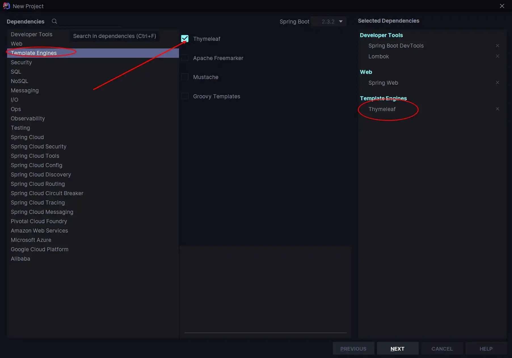
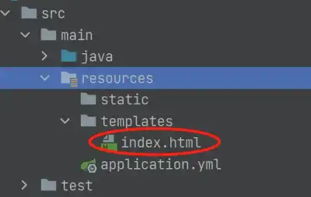

# 整合 Thymeleaf 实例

## 什么是 Thymeleaf

-   Thymeleaf 是新一代的 Java 模板引擎，类似于 Velocity、FreeMarker 等传统引擎，其语言和 HTML 很接近，而且扩展性更高；

-   Thymeleaf 的主要目的是将优雅的模板引入开发工作流程中，并将 HTML 在浏览器中正确显示。同时能够作为静态引擎，让开发成员之间更方便协作开发；
-   Spring Boot 官方推荐使用模板，而且 Spring Boot 也为 Thymeleaf 提供了完整的自动化 配置解决方案；

-   Thymeleaf 使用教程请戳 [Tutorial: Using Thymeleaf](https://www.thymeleaf.org/doc/tutorials/3.0/usingthymeleaf.html)，配合 Spring 使用的教程请戳 [Tutorial: Thymeleaf + Spring](https://www.thymeleaf.org/doc/tutorials/3.0/thymeleafspring.html)。

## 整合过程

### 准备过程

正式开始整合过程之前，这里先给出本文的搭建环境，方便大家进行后续内容的学习。

-   JDK 11（理论上其他版本的 JDK 也是可以的，但是更为推荐 JDK 1.8 及以后的版本）
-   IDEA（这里没有啥要求，但我个人的话是出新的版本我就会更新，虽然臃肿，但是更新了确实好用 😂）
-   SpringBoot 2.x（现在主流应该都是 2.x 版本，1.x 的都是老一点的版本了）

### 添加 Thymeleaf 依赖

添加 Thymeleaf 依赖有两种方式：

1.  **第一种**

在新建项目时添加，在 `Templeate Engines` 中勾选 Thymeleaf；




2.  **第二种**

对于忘记在新建项目时未添加 Thymeleaf 依赖的项目，可以直接在项目的 `pom.xml` 中手动添加依赖即可；

```xml
<dependency>
    <groupId>org.springframework.boot</groupId>
    <artifactId>spring-boot-starter-thymeleaf</artifactId>
</dependency>
```

### 编写实体类和 Controller

1.  新建实体类 `User`

这里因为使用 Lombok，所以省去了各种 `setter`、`getter`，同时还省去了各种构造方法和重写 `toString()` 等方法，大大简化了代码。而我们所要做的，仅仅是在 `pom.xml` 中添加 Lombok 的依赖，然后在我们的实体类中加入对应的注解即可。

以下是在 `pom.xml` 中插入 Lombok 依赖的对应代码。

```xml
<dependency>
    <groupId>org.projectlombok</groupId>
    <artifactId>lombok</artifactId>
    <optional>true</optional>
</dependency>
```

然后我们就可以编写我们的实体类，这里主要用到了 `@Data`、`@Component`、`@AllArgsConstructor` 、`NoArgsConstructor` 四个注解，其中各个注解的含义如下：

-   `@Component`：把类实例化到 Spring 容器，相当于在配置文件中配置；

-   `@Data` ：给类的所有属性提供 `get` 和 `set` 方法，此外还有 `equals、canEqual、hashCode、toString` 方法以及 **默认参数为空的构造方法**；
-   `@AllArgsConstructor`：为类提供一个 **全参构造方法**，但此时不再提供默认构造方法；
-   `@NoArgsConstructor`：因为使用了 `AllArgsConstructor` 会导致类没有默认空参构造方法，所以此时需要它为类提供一个 **无参构造方法**；

```java
package com.cunyu.pojo;

import lombok.AllArgsConstructor;
import lombok.Data;
import lombok.NoArgsConstructor;
import org.springframework.stereotype.Component;

/**
 * @author : cunyu
 * @version : 1.0
 * @className : User
 * @date : 2020/7/29 16:20
 * @description : User 实体类
 */

@Component
@Data
@AllArgsConstructor
@NoArgsConstructor
public class User {
    private int age;
    private String name;
    private String email;
}
```

2.  编写 Controller

此时主要需要注意的是 `setViewName()` 和 `addObject()`，前者表示方法对应的前端页面，也就是我们模板中对应文件名的 `.html` 文件，而后者则主要给属性注入值，然后将属性传递到前端模板。

```java
package com.cunyu.controller;

import com.cunyu.pojo.User;
import org.springframework.stereotype.Controller;
import org.springframework.web.bind.annotation.GetMapping;
import org.springframework.web.bind.annotation.RequestMapping;
import org.springframework.web.servlet.ModelAndView;

/**
 * @author : cunyu
 * @version : 1.0
 * @className : UserController
 * @date : 2020/7/29 16:22
 * @description : UserController
 */

@Controller
public class UserController {

    // 访问 ip:port/index
    @GetMapping("/index")
    public ModelAndView index() {
        ModelAndView modelAndView = new ModelAndView();
        // 设置跳转的视图，即位于 templates/index.html
        modelAndView.setViewName("index");
        modelAndView.addObject("title", "Thymeleaf 使用");
        modelAndView.addObject("desc", "Spring Boot 整合 Thymeleaf");

        User author = new User(25, "村雨遥", "747731461@qq.com");

        modelAndView.addObject("author", author);
        return modelAndView;
    }
}
```

### 创建Thymeleaf 模板

第上面的代码中，我们设置了跳转的视图为 `index`，所以我们需要在 `src/main/resources/templates` 中创建 `index.html`。



```html
<!DOCTYPE html>
<html xmlns="http://www.w3.org/1999/xhtml"
      xmlns:th="http://www.thymeleaf.org">
<head>
    <meta charset="UTF-8">
    <!-- 即 Controller 中的 title 属性 -->
    <title th:text="${title}"></title>
    
</head>
<body>
<!-- 即 Controller 中的 desc 属性 -->
<h1 th:text="${desc}" th:align="center"></h1>
    
<!-- 即 Controller 中的 author 信息 -->
<h2 th:align="center">=====作者信息=====</h2>
<p th:text="${author?.name}"></p>
<p th:text="${author?.age}"></p>
<p th:text="${author?.email}"></p>
</body>
</html>

```

### 测试

启动项目，然后在浏览器中访问 `http://localhost:8080/index`，如果出现下图中的信息，说明整合成功。


## 注意事项

为了方便使用，我们在使用 Thymeleaf 模板时，可以添加一些自己的配置。而添加的位置则是项目的配置文件 `application.yml`，项目默认配置文件应该是 `application.properties`，但 SpringBoot 更加推荐使用 yml 来配置，所以我们这里需要手动将其改为 yml 的格式。

```properties
spring:
  thymeleaf:
    cache: false
    prefix: classpath:/templates/
    suffix: .html
    mode: HTML
    encoding: UTF-8
    servlet:
      content-type: text/html
```

## 总结

好了，以上就是我们今天的所有内容了。今天主要介绍了 Themeleaf 的相关简介，然后对利用 SpringBoot 整合 Thymeleaf 的过程进行了描述，最后则是使用 Thymeleaf 中常用的一些相关配置的注意事项。