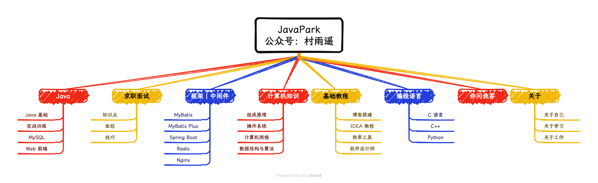

⏰ 在阅读本博客内容时，若遇到任何内容、代码、图片等有关错误，都可以提交 **issues** 或者 **PR** 的方式进行勘误反馈，我会陆续进行完善改进，感谢支持。

- issues: `https://github.com/cunyu1943/JavaPark/issues`
- PR: `https://github.com/cunyu1943/JavaPark/pulls`，仅需在文章的末尾找到 **在 GitHub 上编辑此页**，即可完成克隆和提交 `PR`。
- 本站为整理公众号文章的知识库，关注公众号：[村雨遥](https://cunyu1943.gitee.io/contact/wechatpublic.svg) 及时获取最新推文，避免错过最近更新。
- 此外，如果在学习本站内容有疑惑的地方，还可以通过微信：`coder_cunYu` 联系我，备注 **加群**，拉你进技术交流群！

---

## 零、本站知识图谱

## 一、Java

## 二、求职面试

## 三、框架｜中间件

## 四、计算机知识

## 五、基础教程

## 六、编程语言

## 七、你问我答

## 八、好物周刊

## 九、关于