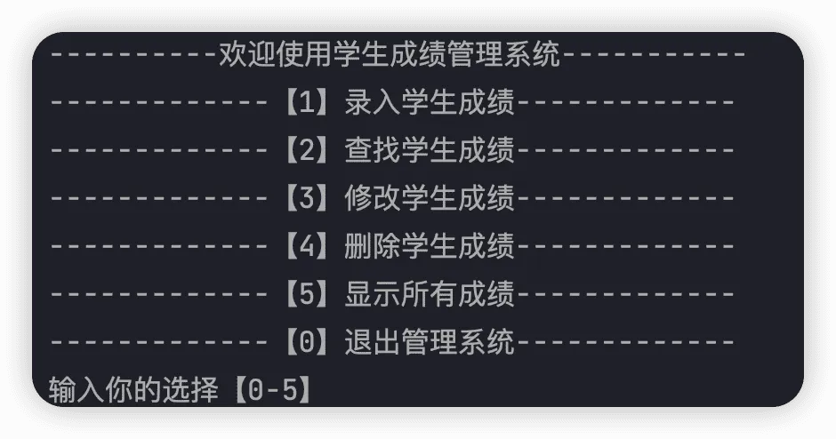
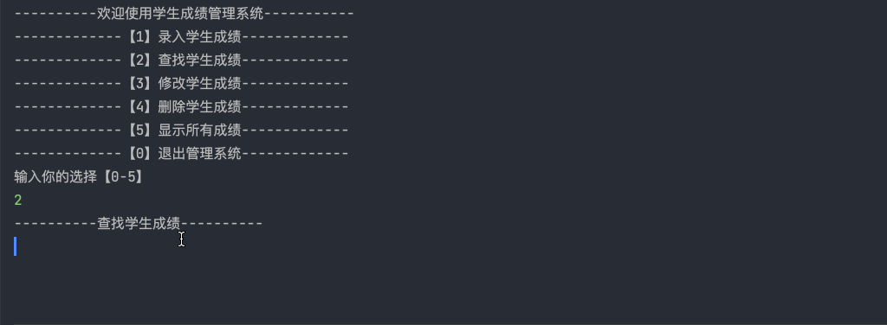
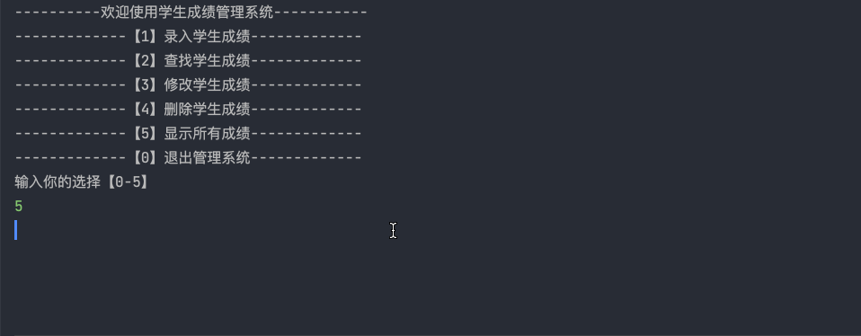
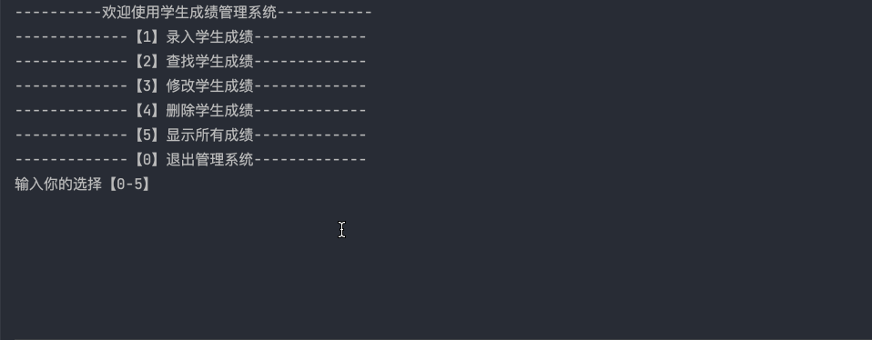
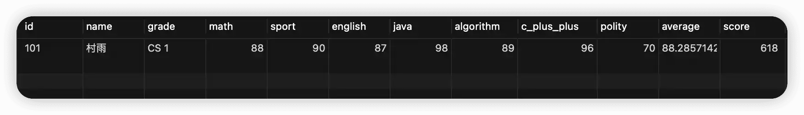

# MySQL + MyBatis 版学生管理系统

## 前言

之前写了一篇文章，是关于 `Java SE` 版本的学生成绩管理系统，发现反响还不错。同时也有不少小伙伴通过评论或者私信的方式问过有没有和数据库交互版本的学生成绩管理系统，然后自己也把这件事儿列入了自己的计划。害，都怪自己懒，所以一直拖到了现在。不过终究是逼迫自己完成了，也算是给私信和评论的小伙伴们一个交代吧。

同样的，本次和数据交互版本的学生成绩管理系统具有增删改查成绩等功能。不过相比于之前 `SE` 版本的功能做了点精简，少了两个小的功能点。因此此次版本的学生成绩管理系统主要分为如下功能：

1.  **录入学生成绩**
2.  **查询单个学生成绩**
3.  **查询所有学生成绩**
4.  **更新学生成绩**
5.  **删除学生成绩**
6.  **退出管理系统**


## 系统演示

1.  **主菜单**

将我们的系统运行起来之后，应该有对应的系统菜单，然后可以根据我们的输入进行不同的操作。



2.  **录入学生成绩**

进入录入学习成绩菜单后，会提示我们依次录入学号、年级、姓名、高数、英语、体育、Java、C++、政治、算法等科目的成绩，录入成功后进行下一次功能选择。


3.  **查找单个学生成绩**

该功能主要通过我们所输入的学生学号，然后查询对应学号学生的成绩，如果查到则进行打印，如果没查到就进行提示。但无论是查询到成绩与否，都会进入下一次的功能选择。



4.  **查询所有学生成绩**

该功能可以查询当前数据库中的所有成绩，无论是否查询到成绩与否，都将进入下一次的功能选择。




5.  **更新学生成绩**

该功能通过输入对应学号，然后如果找到对应学号的学生，则重新依次输入各科成绩，然后对数据库中的成绩进行更新。如果没有找到对应学号的学生，则进行提示。




6.  **删除学生成绩**

该功能通过对应学号，然后删除对应学号的学生成绩，如果没有对应学号的学生，则进行提示。




## 功能设计与实现

与 SE 项目不同的是，本系统需要与数据库进行交互，所以这里选择使用 MyBatis 作为数据库交互框架。接下来我就对本系统的搭建过程做一个记录，留给有需要的小伙伴。

### 环境搭建

本项目主要采用 Maven 来构造，而 IDE 则用的是最新版的 IntelliJ IDEA。所以首要工作就是搭建一个 Maven 工程，因为之前我已经写过相关的文章了，所以这里就不再啰嗦了，如果你还对创建 Maven 工程不太熟悉，可以参考：👉 [如何使用 IDEA 创建 Maven 项目](https://cunyu1943.github.io/posts/373ef5ea/ "如何使用 IDEA 创建 Maven 项目")。

### POM 文件

要实现本项目，主要需要以下依赖，所以我们需要在项目的 `pom.xml` 文件引入对应依赖。

- **MyBatis**
- **Lombok**
- **MySQL 驱动**

```xml
<?xml version="1.0" encoding="UTF-8"?>
<project xmlns:xsi="http://www.w3.org/2001/XMLSchema-instance"
         xmlns="http://maven.apache.org/POM/4.0.0"
         xsi:schemaLocation="http://maven.apache.org/POM/4.0.0 http://maven.apache.org/xsd/maven-4.0.0.xsd">
    <modelVersion>4.0.0</modelVersion>

    <groupId>com.cunyu</groupId>
    <artifactId>score-management-system</artifactId>
    <version>1.0-SNAPSHOT</version>

    <properties>
        <maven.compiler.source>11</maven.compiler.source>
        <maven.compiler.target>11</maven.compiler.target>
    </properties>

    <dependencies>
        <dependency>
            <groupId>org.mybatis</groupId>
            <artifactId>mybatis</artifactId>
            <version>3.5.7</version>
        </dependency>
        <dependency>
            <groupId>mysql</groupId>
            <artifactId>mysql-connector-java</artifactId>
            <version>8.0.25</version>
        </dependency>

        <dependency>
            <groupId>org.projectlombok</groupId>
            <artifactId>lombok</artifactId>
            <version>1.18.22</version>
            <scope>provided</scope>
        </dependency>
    </dependencies>
</project>
```

这里你可能对 Lombok 比较陌生，它主要是为了简化我们的代码而使用，所以也推荐大家了解下。对于 Lombok 的简单使用，我之前特意写了一篇相关文章，如果有感兴趣的小伙伴，可以去了解一下。传送门 👇：

> [Lombok 安装及使用指南](https://cunyu1943.github.io/posts/f7032e71/ "Lombok 安装及使用指南")

### 数据库准备

既然要把数据存入数据库，那肯定得准备下数据库。关于数据库的安装以及环境搭建，可以去网上找个教程看一下，我这里的话只提供创建表的数据脚本。

```sql
/*
 Navicat Premium Data Transfer

 Source Server         : mbp-mysql
 Source Server Type    : MySQL
 Source Server Version : 80028
 Source Host           : localhost:3306
 Source Schema         : score_management_system

 Target Server Type    : MySQL
 Target Server Version : 80028
 File Encoding         : 65001

 Date: 05/03/2022 23:02:47
*/

SET NAMES utf8mb4;
SET FOREIGN_KEY_CHECKS = 0;

-- ----------------------------
-- Table structure for student
-- ----------------------------
DROP TABLE IF EXISTS `student`;
CREATE TABLE `student` (
  `id` varchar(50) CHARACTER SET utf8mb4 COLLATE utf8mb4_0900_ai_ci NOT NULL COMMENT '学号',
  `name` varchar(255) NOT NULL COMMENT '姓名',
  `grade` varchar(50) NOT NULL COMMENT '年级',
  `math` double NOT NULL COMMENT '高数',
  `sport` double NOT NULL COMMENT '体育',
  `english` double NOT NULL COMMENT '英语',
  `java` double NOT NULL COMMENT 'Java',
  `algorithm` double NOT NULL COMMENT '算法',
  `polity` double NOT NULL COMMENT '政治',
  `average` double NOT NULL COMMENT '平均分',
  `score` double NOT NULL COMMENT '总分',
  `c_plus_plus` double NOT NULL COMMENT 'C++',
  PRIMARY KEY (`id`)
) ENGINE=InnoDB DEFAULT CHARSET=utf8mb4 COLLATE=utf8mb4_0900_ai_ci;

-- ----------------------------
-- Records of student
-- ----------------------------
BEGIN;
INSERT INTO `student` (`id`, `name`, `grade`, `math`, `sport`, `english`, `java`, `algorithm`, `polity`, `average`, `score`, `c_plus_plus`) VALUES ('101', '村雨', 'CS 1', 88, 90, 87, 98, 89, 70, 88.28571428571429, 618, 96);
COMMIT;

SET FOREIGN_KEY_CHECKS = 1;
```

### MyBatis 配置

既然要使用 MyBatis，那肯定少不了对它配置一番。这里呢，主要需要配置 MyBatis 的核心配置文件以及设置一个工具类。然后添加对数据库进行增删改查的接口，方便后边使用。如果你对 MyBatis 不是很熟悉，建议先去了解下，关于更多 MyBatis 的使用方法，可以参考我之前写的一些文章：[MyBatis 专栏](https://cunyu1943.github.io/MyBatis-%E4%B8%93%E6%A0%8F/ "MyBatis 专栏")。

1.  **MyBatis 配置文件**

在项目的 `main/resources` 文件夹下创建一个文件，命名为 `mybatis-config.xml`，在这里主要是配置数据库连接。

```xml
<?xml version="1.0" encoding="UTF-8" ?>
<!DOCTYPE configuration
        PUBLIC "-//mybatis.org//DTD Config 3.0//EN"
        "http://mybatis.org/dtd/mybatis-3-config.dtd">

<configuration>
    <!--  驼峰命名  -->
    <settings>
        <setting name="mapUnderscoreToCamelCase" value="true"/>
    </settings>
    <!-- 数据库配置信息 -->
    <environments default="development">
        <environment id="development">
            <transactionManager type="JDBC"/>
            <dataSource type="POOLED">
                <property name="driver" value="com.mysql.cj.jdbc.Driver"/>
                <property name="url"
                          value="jdbc:mysql://localhost:3306/score_management_system?useUnicode=true&amp;characterEncoding=utf-8"/>
                <property name="username" value="root"/>
                <property name="password" value="123456"/>
            </dataSource>
        </environment>
    </environments>
    <!--  xml 存放路径  -->
    <mappers>
        <mapper resource="mapper/StudentMapper.xml"/>
    </mappers>
</configuration>
```

2.  **MyBatis 工具类**

为了方便后续各个方法的调用，推荐大家先配置一个 MyBatis 的工具类，免去一些重复建立连接操作。

```java
package com.cunyu.util;

import org.apache.ibatis.io.Resources;
import org.apache.ibatis.session.SqlSession;
import org.apache.ibatis.session.SqlSessionFactory;
import org.apache.ibatis.session.SqlSessionFactoryBuilder;

import java.io.IOException;
import java.io.InputStream;

/**
 * Created with IntelliJ IDEA.
 *
 * @Package : com.cunyu.util
 * @ClassName : MyBatisUtil.java
 * @CreateTime : 2022/3/5 17:11
 * @Version : 1.0
 * @Author : 村雨
 * @Email : 747731461@qq.com
 * @公众号 : 村雨遥
 * @Website : https://cunyu1943.github.io
 * @Description :
 */
public class MyBatisUtil {
    private static SqlSessionFactory sqlSessionFactory;

    static {
        try {
            String resource = "mybatis-config.xml";
            InputStream inputStream = Resources.getResourceAsStream(resource);
            sqlSessionFactory = new SqlSessionFactoryBuilder().build(inputStream);
        } catch (IOException e) {
            e.printStackTrace();
        }
    }

    /**
     * 获取 SqlSession 连接
     *
     * @param
     * @return
     * @Author 村雨遥
     * @Version 1.0
     * @Description
     * @Date 17:12 2022/3/5
     */
    public static SqlSession getSession() {
        return sqlSessionFactory.openSession();
    }
}
```

3.  ### **设计接口**

```java
package com.cunyu.mapper;

import com.cunyu.entity.Student;
import org.apache.ibatis.annotations.Mapper;

import java.util.List;

/**
 * Created with IntelliJ IDEA.
 *
 * @Package : com.cunyu.mapper
 * @ClassName : StudentMapper.java
 * @CreateTime : 2022/3/5 16:34
 * @Version : 1.0
 * @Author : 村雨
 * @Email : 747731461@qq.com
 * @公众号 : 村雨遥
 * @Website : https://cunyu1943.github.io
 * @Description :
 */
@Mapper
public interface StudentMapper {
    /**
     * 录入学生成绩
     *
     * @param student 学生对象
     * @return
     * @Author 村雨遥
     * @Version 1.0
     * @Description
     * @Date 16:38 2022/3/5
     */
    int insertScore(Student student);

    /**
     * 查看所有学生成绩
     *
     * @param
     * @return List<Student> 学生列表
     * @Author 村雨遥
     * @Version 1.0
     * @Description
     * @Date 16:45 2022/3/5
     */
    public List<Student> showStudentList();

    /**
     * 通过学号查询学生成绩
     *
     * @param id 学号
     * @return
     * @Author 村雨遥
     * @Version 1.0
     * @Description
     * @Date 16:50 2022/3/5
     */
    public Student queryById(String id);

    /**
     * 修改对应学号学生的成绩
     *
     * @param student 学生
     * @return
     * @Author 村雨遥
     * @Version 1.0
     * @Description
     * @Date 16:53 2022/3/5
     */
    public int updateById(Student student);


    /**
     * 删除对应学号学生的成绩
     *
     * @param id 学号
     * @return
     * @Author 村雨遥
     * @Version 1.0
     * @Description
     * @Date 17:02 2022/3/5
     */
    public int deleteById(String id);
}
```

4.  **映射 SQL 文件**

记得上面 MyBatis 配置中的 XML 存放路径么，那就是我们用来映射 SQL 的文件。一般我们是在 `resource` 下新建一个 `mapper` 目录，然后在 `mapper` 目录中创建用于映射接口的 SQL 文件。

```xml
<?xml version="1.0" encoding="UTF-8" ?>
<!DOCTYPE mapper PUBLIC "-//mybatis.org//DTD Mapper 3.0//EN"
        "http://mybatis.org/dtd/mybatis-3-mapper.dtd">

<mapper namespace="com.cunyu.mapper.StudentMapper">

    <insert id="insertScore" parameterType="com.cunyu.entity.Student">
        INSERT INTO student (id, name, grade, math, english, sport, polity, java, c_plus_plus, algorithm, score,
                             average)
        VALUES (#{id}, #{name}, #{grade}, #{math}, #{english}, #{sport}, #{polity}, #{java}, #{cPlusPlus}, #{algorithm},
                #{score}, #{average})
    </insert>

    <update id="updateById" parameterType="com.cunyu.entity.Student">
        UPDATE student
        SET math        = #{math},
            english     = #{english},
            sport       = #{sport},
            polity      = #{polity},
            java        = #{java},
            c_plus_plus = #{cPlusPlus},
            algorithm   = #{algorithm},
            score       = #{score},
            average     = #{average}
        WHERE id = #{id}
    </update>

    <delete id="deleteById">
        DELETE
        FROM student
        WHERE id = #{id}
    </delete>

    <select id="showStudentList" resultType="com.cunyu.entity.Student">
        SELECT *
        FROM student
    </select>

    <select id="queryById" resultType="com.cunyu.entity.Student">
        SELECT *
        FROM student
        WHERE id = #{id}
    </select>

</mapper>
```

### 主类设计

系统主要是针对学生成绩信息管理，所以主要涉及的是一个学生类。

```java
package com.cunyu.entity;

import lombok.AllArgsConstructor;
import lombok.Data;
import lombok.NoArgsConstructor;

import java.util.List;
import java.util.Scanner;

/**
 * Created with IntelliJ IDEA.
 *
 * @Package : com.cunyu.entity
 * @ClassName : Student.java
 * @CreateTime : 2022/3/5 14:38
 * @Version : 1.0
 * @Author : 村雨
 * @Email : 747731461@qq.com
 * @公众号 : 村雨遥
 * @Website : https://cunyu1943.github.io
 * @Description :
 */

@AllArgsConstructor
@NoArgsConstructor
@Data
public class Student {
    /**
     * 学号
     */
    private String id;
    /**
     * 姓名
     */
    private String name;
    /**
     * 班级
     */
    private String grade;
    /**
     * 高数
     */
    private Double math;
    /**
     * 体育
     */
    private Double sport;
    /**
     * 英语
     */
    private Double english;
    /**
     * Java
     */
    private Double java;
    /**
     * 算法
     */
    private Double algorithm;
    /**
     * 政治
     */
    private Double polity;
    /**
     * C ++
     */
    private Double cPlusPlus;
    /**
     * 总分
     */
    private Double score;
    /**
     * 平均分
     */
    private Double average;
}
```

### 主界面

主界面主要是打印出系统功能菜单，然后根据我们的指令进入不同的子功能模块。

```java
import com.cunyu.entity.Student;

import java.util.Scanner;

/**
 * Created with IntelliJ IDEA.
 *
 * @Package : PACKAGE_NAME
 * @ClassName : Main.java
 * @CreateTime : 2022/3/5 17:13
 * @Version : 1.0
 * @Author : 村雨
 * @Email : 747731461@qq.com
 * @公众号 : 村雨遥
 * @Website : https://cunyu1943.github.io
 * @Description :
 */
public class Main {
    public static Scanner scanner = new Scanner(System.in);

    public static void main(String[] args) {
        while (true) {
            System.out.println("----------欢迎使用学生成绩管理系统-----------");
            System.out.println("-------------【1】录入学生成绩-------------");
            System.out.println("-------------【2】查找学生成绩-------------");
            System.out.println("-------------【3】修改学生成绩-------------");
            System.out.println("-------------【4】删除学生成绩-------------");
            System.out.println("-------------【5】显示所有成绩-------------");
            System.out.println("-------------【0】退出管理系统-------------");

            Student student = new Student();

            System.out.println("输入你的选择【0-5】");
            String choice = scanner.next();
            switch (choice) {
                case "1":
                    // 录入学生成绩
                    student.insertScore();
                    break;
                case "2":
                    // 查找对应学生成绩
                    student.queryScoreById();
                    break;
                case "3":
                    // 修改学生成绩
                    student.update();
                    break;
                case "4":
                    // 删除学生成绩
                    student.delete();
                    break;
                case "5":
                    // 查询所有学生成绩
                    student.queryScores();
                    break;
                case "0":
                    System.exit(0);
                    break;
                default:
                    break;
            }
        }
    }
}
```

### 录入学生成绩

首先录入学号，判断是否可用，不可用则重新输入，可用则继续输入后续其他信息。

然后将信息赋值到学生对象，最后将该学生对象插入数据库就可以了。

```

```

```java
/**
     * 录入学生成绩
     *
     * @param
     * @return
     * @Author 村雨遥
     * @Version 1.0
     * @Description
     * @Date 18:05 2022/3/5
     */
public void insertScore() {
    SqlSession sqlSession = MyBatisUtil.getSession();
    StudentMapper mapper = sqlSession.getMapper(StudentMapper.class);
    Scanner scanner = new Scanner(System.in);
    System.out.println("----------录入学生数据----------");
    System.out.println("请依次输入如下数据：");
    String id;
    while (true) {
        System.out.println("学号");
        id = scanner.nextLine();
        if (isValid(id)) {
            System.out.println("学号重复，请重新输入");
        } else {
            break;
        }
    }
    System.out.println("年级");
    String grade = scanner.nextLine();

    System.out.println("姓名");
    String name = scanner.nextLine();
    System.out.println("数学");
    Double math = scanner.nextDouble();
    System.out.println("英语");
    Double english = scanner.nextDouble();
    System.out.println("体育");
    Double sport = scanner.nextDouble();
    System.out.println("Java");
    Double java = scanner.nextDouble();
    System.out.println("C++");
    Double cPlusPlus = scanner.nextDouble();
    System.out.println("政治");
    Double polity = scanner.nextDouble();
    System.out.println("算法");
    Double algorithm = scanner.nextDouble();

    // 创建对象，并设置属性，并插入数据库
    Student student = new Student();
    student.setId(id);
    student.setName(name);
    student.setGrade(grade);
    student.setSport(sport);
    student.setCPlusPlus(cPlusPlus);
    student.setJava(java);
    student.setMath(math);
    student.setPolity(polity);
    student.setEnglish(english);
    student.setAlgorithm(algorithm);
    student.setScore(math + polity + english + algorithm + cPlusPlus + java + sport);
    student.setAverage(student.getScore() * 1.0 / 7);
    int i = mapper.insertScore(student);
    if (i > 0) {
        sqlSession.commit();
        System.out.println("录入成绩成功");
    } else {
        System.out.println("录入成绩失败，请重新录入");
    }

    sqlSession.close();

}
```

### 查询单个学生成绩

先判断数据库中是否有数据，有数据则进行后续操作。通过对输入的学号进行查询，从数据库中找到对应学号的学生成绩。

```java
/**
     * 通过学号查询成绩
     *
     * @param
     * @return
     * @Author 村雨遥
     * @Version 1.0
     * @Description
     * @Date 18:06 2022/3/5
     */
public void queryScoreById() {
    SqlSession sqlSession = MyBatisUtil.getSession();
    StudentMapper mapper = sqlSession.getMapper(StudentMapper.class);
    Scanner scanner = new Scanner(System.in);
    System.out.println("----------查找学生成绩----------");
    List<Student> students = mapper.showStudentList();
    Student result = new Student();
    Boolean flag = false;
    if (students.size() == 0) {
        System.out.println("当前无数据，请录入成绩后重试");
    } else {
        System.out.println("请输入要查找成绩学生的学号");
        String id = scanner.nextLine();
        for (Student student : students) {
            if (id.equals(student.getId())) {
                flag = true;
                result = student;
            }
        }
        if (flag) {
            System.out.println("对应学号的学生成绩如下：");
            System.out.println("学号\t\t班级\t\t姓名\t\t数学\t\t英语\t\t体育\t\tJava\t\tC++\t\t政治\t\t算法\t\t平均分\t\t总分");
            System.out.format("%s\t%s\t\t%s\t\t%.2f\t%.2f\t%.2f\t%.2f\t%.2f\t%.2f\t%.2f\t%.2f\t%.2f\n", result.getId(), result.getGrade(), result.getName(), result.getMath(), result.getEnglish(), result.getSport(), result.getJava(), result.getCPlusPlus(), result.getPolity(), result.getAlgorithm(), result.getAverage(), result.getScore());
            System.out.println("查找成绩成功！");
        } else {
            System.out.println("未找到对应学号学生的成绩，请确认后重新输入！");
        }
    }
    sqlSession.close();
}
```

### 查询所有学生成绩

先判断是否有数据，有数据再进行后续操作。从数据库中查询所有数据，接着打印各个学生的成绩信息即可。


```java
/**
     * 查询所有学生成绩
     *
     * @param
     * @return
     * @Author 村雨遥
     * @Version 1.0
     * @Description
     * @Date 18:26 2022/3/5
     */
public void queryScores() {
    SqlSession sqlSession = MyBatisUtil.getSession();
    StudentMapper mapper = sqlSession.getMapper(StudentMapper.class);
    List<Student> students = mapper.showStudentList();
    if (students.size() == 0) {
        System.out.println("数据库当前无数据，请先添加数据");
    } else {
        System.out.println("----------所有学生成绩如下----------");
        System.out.println("学号\t\t班级\t\t姓名\t\t数学\t\t英语\t\t体育\t\tJava\t\tC++\t\t政治\t\t算法\t\t平均分\t\t总分");
        for (Student student : students) {
            System.out.format("%s\t%s\t%s\t%.2f\t%.2f\t%.2f\t%.2f\t%.2f\t%.2f\t%.2f\t%.2f\t%.2f\n", student.getId(), student.getGrade(), student.getName(), student.getMath(), student.getEnglish(), student.getSport(), student.getJava(), student.getCPlusPlus(), student.getPolity(), student.getAlgorithm(), student.getAverage(), student.getScore());
        }
    }
    sqlSession.close();
}
```

### 修改学生成绩

先判断是否有数据，有数据再进行后续操作。通过对输入的学号进行匹配，找到对应学号的学生，然后对其成绩信息进行修改，但不修改个人其他信息。

```java
/**
     * 更新对应学号学生的成绩
     *
     * @param
     * @return
     * @Author 村雨遥
     * @Version 1.0
     * @Description
     * @Date 18:40 2022/3/5
     */
public void update() {
    SqlSession sqlSession = MyBatisUtil.getSession();
    StudentMapper mapper = sqlSession.getMapper(StudentMapper.class);
    Scanner scanner = new Scanner(System.in);
    List<Student> students = mapper.showStudentList();
    System.out.println("----------修改学生成绩----------");
    if (students.isEmpty()) {
        System.out.println("当前数据库无数据，请添加后重试");
    } else {
        System.out.println("请输入要修改学生的学号");
        String id = scanner.nextLine();
        Student student = mapper.queryById(id);
        if (student == null) {
            System.out.println("未找到对应学号学生信息，请确认后再删除！");
        } else {
            System.out.println("请重新输入该学生的成绩");
            System.out.println("数学");
            Double math = scanner.nextDouble();
            System.out.println("英语");
            Double english = scanner.nextDouble();
            System.out.println("体育");
            Double sport = scanner.nextDouble();
            System.out.println("Java");
            Double java = scanner.nextDouble();
            System.out.println("C++");
            Double cPlusPlus = scanner.nextDouble();
            System.out.println("政治");
            Double polity = scanner.nextDouble();
            System.out.println("算法");
            Double algorithm = scanner.nextDouble();

            student.setSport(sport);
            student.setEnglish(english);
            student.setPolity(polity);
            student.setMath(math);
            student.setJava(java);
            student.setCPlusPlus(cPlusPlus);
            student.setAlgorithm(algorithm);
            student.setScore(sport + math + english + polity + java + cPlusPlus + algorithm);
            student.setAverage(student.getScore() / 7);
            if (mapper.updateById(student) > 0) {
                sqlSession.commit();
                System.out.println("----------更新成功----------");
            } else {
                System.out.println("----------更新失败----------");
            }
        }
    }
    sqlSession.close();
}
```

### 删除学生成绩

先判断是否有数据，有数据再进行后续操作。然后通过对输入的学号进行匹配，找到对应学号的学生，然后将其从数据库中删除即可。

```java
/**
     * 删除对应学号学生成绩
     *
     * @param
     * @return
     * @Author 村雨遥
     * @Version 1.0
     * @Description
     * @Date 18:38 2022/3/5
     */
public void delete() {
    SqlSession sqlSession = MyBatisUtil.getSession();
    StudentMapper mapper = sqlSession.getMapper(StudentMapper.class);
    Scanner scanner = new Scanner(System.in);
    List<Student> students = mapper.showStudentList();
    System.out.println("----------删除学生成绩----------");
    if (students.size() == 0) {
        System.out.println("当前数据库无数据，请添加后重试");
    } else {
        System.out.println("输入要删除学生成绩的学号");
        String id = scanner.nextLine();
        if (mapper.queryById(id) == null) {
            System.out.println("未找到对应学号学生信息，请确认后再删除！");
        } else {
            if (mapper.deleteById(id) > 0) {
                sqlSession.commit();
                System.out.println("----------删除成功----------");
            } else {
                System.out.println("----------删除失败----------");
            }
        }
    }
    sqlSession.close();
}
```

## 总结

以上就是关于本次数据库版本学生成绩管理系统的相关设计的所有内容了，相信读到这里的小伙伴应该也能够顺利完成本次的课程设计了。如果还是对其中的一些细节不理解，欢迎评论或者关注私信我。

## 代码实例

最后，关于本文示例的代码，我已经上传到了 GitCode ，需要的小伙伴可以自取！

> 🏳️‍🌈 传送门：https://gitcode.net/github_39655029/java-learning-demos