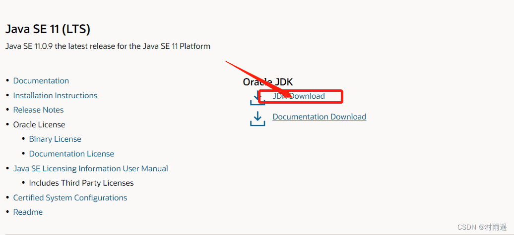
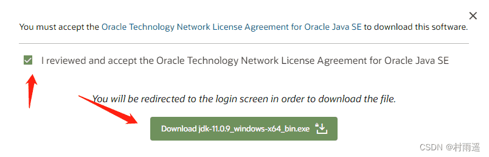
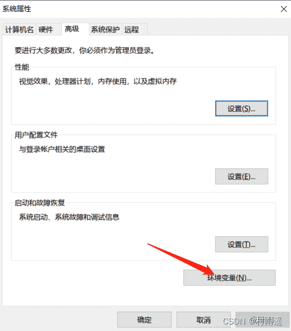
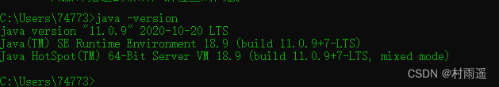
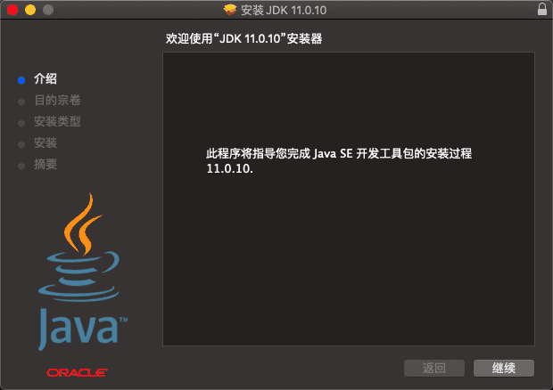
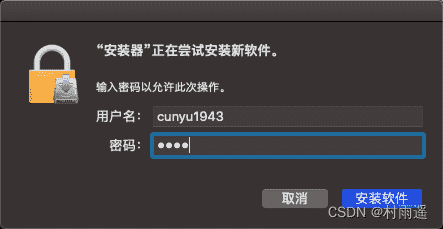

# 开发环境配置

::: info 共勉
不要哀求，学会争取。若是如此，终有所获。
:::
::: tip 原文

:::

## 一、前言

学习完 `Java` 的主要特性、发展历程以及常见误解之后。本篇文章再来学习，如何在当前主流操作系统下搭建 `Java` 开发环境，为接下来的开发做好准备。

## 二、Windows 环境配置

### 1. 安装

1.  首先进入 [Oracle 官网](https://www.oracle.com/java/technologies/javase-downloads.html)，然后找到自己想要的 `JDK` 版本，这边以 `JDK` 11 为例。



2.  点击 JDK Download 后，它会跳转到具体下载页面，然后根据自己的系统来进行选择，此处以 Windows 10 64 位为例。


3.  点击最后的连接后，它会让你同意协议，勾选同意，然后登陆你的 `Oracle` 账户即可开始下载，若是没有 `Oracle` 账户，点击下面的创建一个就可以了。




4.  下载完成后，进行安装即可，安装流程和我们平常安装软件的一样，就再赘述，需要注意的是要记住如下的安装路径，因为一般我们都不会安装到默认路径，所以一定要记住你所安装到的路径，这关系到后续的配置步骤。


### 2. 配置

好了，经过上面的配置，我们的 JDK 就已经安装好了，但是这个使用你是用不了的，我们还需要进一步的配置；

打开系统属性来进行环境变量配置，打开系统属性并进行配置的方式如下：

1.  **Windows + R** 快捷键组合唤醒 Windows 运行窗口，然后输入 `sysdm.cpl`，紧接着回车即可，一般会打开如下界面，然后点击最上方的 **高级**；


2.  点击高级后，就会打开如下界面，然后打开环境变量。



3.  新建环境变量 **JAVA_HOME**，然后变量值填入刚才安装 JDK 的路径（刚才提醒过要记住！）。


4.  编辑 **Path** 环境变量，然后新建一个变量值，填入如下内容：`%JAVA_HOME%\bin`。


5.  各种确定，然后突出系统属性即可，到这一步，理论上我们的 JDK 就安装并配置成功了，接下来我们就去确认一下到底安装好了没有。

### 3. 验证

按照上述步骤操作完成之后，接下来就是验证了，一般我们可以通过如下三个命令来进行验证；

```bash
# 查看 JDK 版本
java -version

# 编译命令
javac

# 运行命令
java
```

打开命令控制台（**Windows + R，然后输入 cmd 回车**），然后输入如上三个命令，如果安装成功，一般是会出现如下内容的；




## 三、macOS 环境配置

### 1. 安装

1.  首先去 [官网下载](https://www.oracle.com/java/technologies/javase-jdk11-downloads.html) 对应安装包；


2.  接受相关协议并登录下载；

3.  双击下载好的 `.dmg` 安装包，然后开始安装；



4.  安装过程中会让你输入密码，也就是你本机的密码。



5.  安装成功；


### 2. 验证

不同于 Windows，macOS 下不用再去配置了，它会给你自动配置好，我们只需要去验证即可；

1.  查看 JDK 版本；

```bash
java -version
```


2.  编译命令；


3.  运行命令；


## 四、Linux 环境配置

### 1. 安装

1.   先去 [下载](https://www.oracle.com/java/technologies/javase-downloads.html) 要安装的 JDK 版本，然后解压到本地，移到你要存放的位置；

```shell
tar -zxvf jdk-11.0.7_linux-x64_bin.tar.gz
```


### 2. 配置

打开配置文件 `/etc/profile`，然后加入如下内容；

```profile
export JAVA_HOME=/home/cunyu/Soft/jdk11.0.7
export PATH=$JAVA_HOME:$PATH
```


### 3. 验证

安装和配置之后，在终端中输入如下命令进行验证是否成功。

```shell
# 查看版本
java -version
# 编译
java
# 执行
javac
```


## 五、安装目录详解

安装好 `JDK` 之后，打开安装路径，通常情况下会有如下的目录结构，而各个模块的功能则如下表所示。

```shell
.
├── LICENSE -> legal/java.base/LICENSE
├── README
├── bin
├── conf
├── include
├── jmods
├── legal
├── lib
└── release
```

| 目录      |                                                                                           |
| --------- | ----------------------------------------------------------------------------------------- |
| `bin`     | 用于存放各种工具命令，比如我们最常用的 `javac`、`java` 等                                 |
| `lib`     | 存放工具的一些补充 `jar` 包                                                               |
| `conf`    | 存放相关配置文件                                                                          |
| `include` | 存放一些平台特定的头文件，比如 `Windows`、`macOS`、`Linux` 平台下这里的头文件是有所不同的 |
| `legal`   | 存放各模块的授权文件                                                                      |
| `jmods`   | 存放各种模块                                                                              |
| `release` | 版本发布内容以及版本信息                                                                  |
| `README`  | `JDK` 信息                                                                                |
| `LICENSE` | 版权和签证相关的说明文档                                                                  |

## ⏳ 联系

想解锁更多知识？不妨关注我的微信公众号：**村雨遥（id：JavaPark）**。

扫一扫，探索另一个全新的世界。


<Share colorful />