# 数据库简介

之前在 Java 基础部分的学习中，我们更多的是写一些和控制台进行交互的小程序，而这些小程序有个特点就是：一旦程序终止，那么程序中的数据就消失了。为了满足存储数据的需求，我们可以选择将程序中的数据保存到文本文件或者数据库中。而今天，我们就来看看数据库的简单知识，为后续基于数据库的开发打下基础。

## 为什么使用数据库

- **持久化**

数据保存后，掉电也可以在存储设备中进行使用，是一种将内存中数据保存到硬盘中加“固化”，这个过程大都通过各类数据库来完成。

- **持久化的作用**

将内存中的数据存储在关系型据库中，也可以存到其他存储介质，如磁盘文件、XML 数据文件、Json 数据文件中。

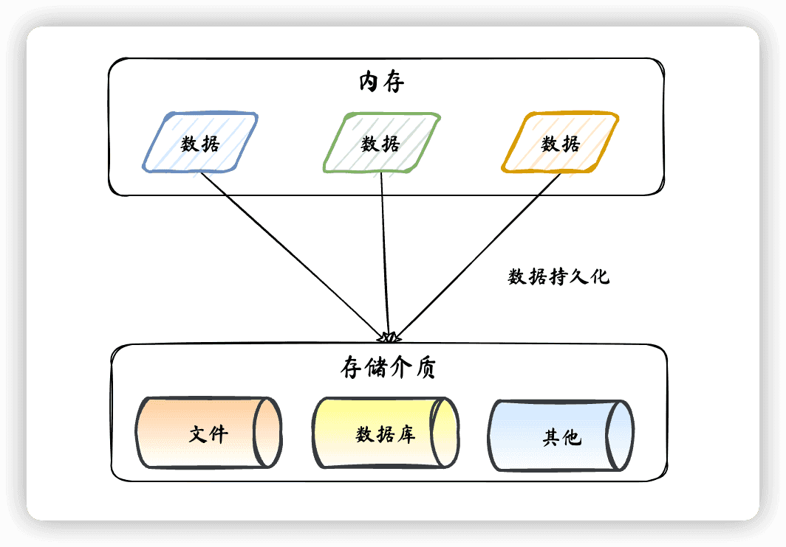

- **实例**

## 数据库与数据库管理系统

### 数据库相关概念

- **DB**

即数据库（Database），用于存储数据的“仓库”，本质上是一个文件系统，用于保存一系列有组织的数据。

- **DBMS**

即数据库管理系统（Database Management System），用于操纵和管理数据库的大型软件。主要用于数据库的创建、使用以及维护，通过统一的管理和控制，使得用户可以通过该系统来访问数据库中表内的数据。

- **SQL**

即结构化查询语言（Structured Query Language），用来专门和数据库进行通信的编程语言，定义了一套操作关系型数据库统一标准。

### 数据库与数据库管理系统的关系

一般而言，数据库管理系统可以管理多个数据库。我们一般会针对一个应用就创建一个对应的数据库，而为了保存应用中的数据，就会在数据库中创建多个表，用于保存对应实体用户的数据。

而数据库管理系统和数据库的关系就类似于视频播放器和视频的关系，其中数据库管理系统对应视频播放器，而数据库就类比于视频。通过数据库管理系统我们可以操作数据库，而通过视频播放器我们可以打开视频。

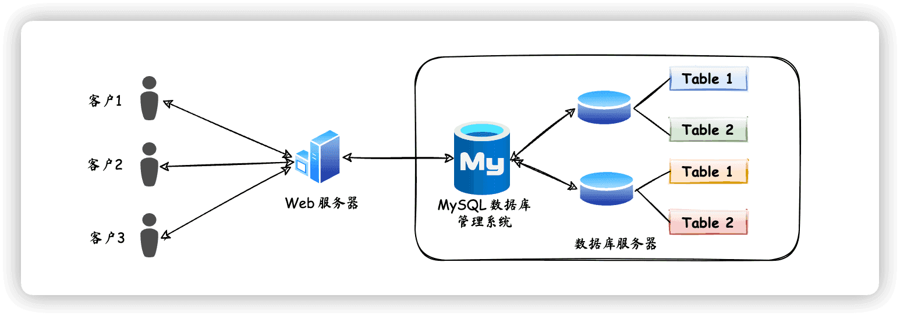

### 常见数据库管理系统排名

> https://db-engines.com/en/ranking#/
>
> https://db-engines.com/en/ranking_trend#/

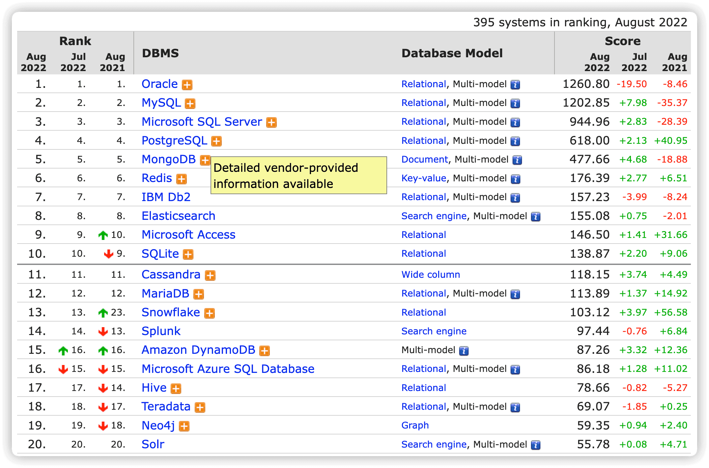

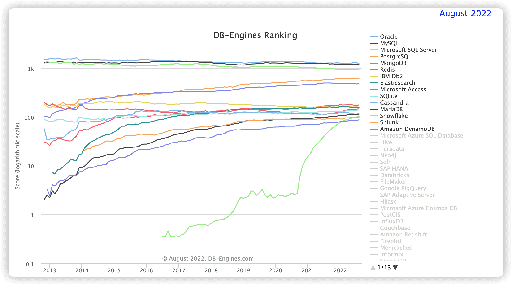

以上两张图片是截止 2022 年 8 月份市场上各大数据库的市场占有率，可以看到 MySQL 无论是在现在，还是从历年的排名来看，排名都是较为靠前的。所以不缺乏使用 MySQL 的使用场景，也从侧面说明学好 MySQL 尤其重要。

## RDBMS 和 非 RDBMS

RDBMS，即关系型数据库，是当前 DBMS 的主流，其中以 Oracle、MySQL 和 SQL Server 最为典型。

### 关系型数据库（RDBMS）

- **实质**

关系型数据库是最古老的数据库类型，其模型是将复杂的数据结构归结为简单的二元关系，即二维表格形式，如下图形式。

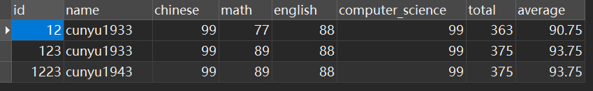

关系型数据库以行（`row`）和列（`column`）的形式存储，两者共同组成表（`table`），而一个数据库（`database`）则通常包含着一系列的表（`table`）。

- **特点**

1.  使用表存储数据，格式统一，方便维护。
2.  使用 SQL 语言操作，标准统一，方便使用。

而表之间的数据记录存在着关系（`relationship`），对应着日常生活中各种实体之间的联系，这种联系也用**关系模型**来表示。而关系型数据库，就是建立在**关系模型**上的数据库。

- **优势**

1.  **支持复杂查询**：可以利用 SQL 语句方便地在一个表及多个表之间做非常复杂的数据查询工作。
2.  **支持事务**：使得对于安全性能较高的数据访问要求也得以实现。

### 非关系型数据库（非 RDBMS）

非关系型数据库，相对于传统的关系型数据库功能较少，基于键值对来进行数据的存储，无需经过 SQL 层的解析，而且减少关系型数据库中了不常用的功能，所以性能相比于关系型数据库更高。

相比于关系型数据库，常见的非关系型数据库有如下晋中类型：

- 键值型数据库

- 文档型数据库

- 搜索引擎数据库

- 列式数据库

- 图形数据库

1.  **键值型数据库**

键值型数据库通过 `key-value` 的形式来存储数据，其中 `key` 和 `value` 既可以是简单的对象，也能是复杂的对象。其中 `key` 作为唯一的标识符，所以是不允许重复的，因此优点也很明显，查找速度极快，但缺点是无法像关系型数据库一样使用条件来进行数据过滤。如果你不知道要查找的数据的对应的 `key`，那就必须去遍历整个数据库所有的键，消耗大量计算。

当前，Redis 可以说是最流行的键值型数据库，最经典的使用场景就是作为**内存缓存**。

2.  **文档型数据库**

文档型数据库可以用来获取文档，一般以 `XML`、`JSON` 等格式存放。在数据库中文档是最基本的处理信息单位，一个文档就相当于 MySQL 数据库中的一条记录，类似于键值型数据库中对应的 `value`。当前最流行的文档型数据库是 MongoDB，除此之外，还有 `CouchDB` 等。

3.  **搜索引擎数据库**

关系型数据库中为了提升检索效率，通常会采用索引，但是针对全文索引的效率却比较低。搜索引擎数据库是搜索引擎领域采用的数据存储形式，其核心原理是“倒排索引”。搜索引擎通过爬取大量的数据，然后以特定的格式进行存储，从而保证了检索时性能最优化。当前主流的搜索引擎数据库主要有：Elasticsearch、Solr、Splunk 等。

4.  **列式数据库**

之所以叫列式数据库，主要是针对行式存储的数据库而言。列式数据库通过将数据以列的形式存储到数据库中，从而大量降低了数据的 IO。基于该特点，列式数据库通常用在分布式文件系统中，功能也比较有限，当前最典型的列式数据库为 HBase 等。

5.  **图形数据库**

图形数据库用图这种数据结构存储了对象之间的关系，数据模式以节点和边（关系）来实现，用于高效解决复杂的关系问题，应用最多的是社交网络中人与人之间的关系。最常用的图形数据库有 Neo4j、InfoGrid 等。

利用图这种数据结构，将对象之间的关系进行存储。关系型数据库中，存储的一般都是关系比较明确的数据，对于关系较为复杂的数据，此时关系型数据库就有些力不从心了，此时，我们就可以采用图形数据库来进行存储。

## 关系型数据库设计原则

关系型数据库中，最典型的数据结构就是数据表，而这些表的组成都是格式化的。通过将数据到表中之后，再将多个表存放到库中。因此一个数据库里边通常包含了多个表，而每个表都有且仅有一个名字，用于标识自己。表中的多个特性则定义了数据如何存储在表中，就像 Java 中的类设计，一个表就类似于一个类，表中的每一列特征对应类中的各个属性，每一行则对应由类所生成的一个对象。

通常，一个数据库和编程语言 Java 中一个类的关系映射如下，也就是我们常说的 ORM（`Object Relational Mapping`） 思想的体现：

| 数据库   | Java           |
| -------- | -------------- |
| 一个表   | 一个类         |
| 一条记录 | 类中的一个对象 |
| 一个列   | 类中的一个属性 |

### 表、字段、记录

`E-R（Entity-Relationship）` 模型中，最核心的三个概念分别是：

- **实体集**
- **属性**
- **联系集**

一个实体集（`class`）对应着数据库中的一个表（`table`），一个实体（`instance`）则对应与数据库中的一行（`row`），也叫做一条记录（`record`）。一个属性（`attribute`）则对应于数据库表中的一列（`column`），也叫做一个字段（`field`）。

### 表之间的关联关系

既然一个表之间往往对应中 Java 中的一个类，那么不同表之间肯定也像类与类之间一样存在或多或少的联系，而最常见的则主要可以分为如下几种：

- **一对一关联**

- **一对多关联**

- **多对多关联**

1.  **一对一（one-to-one）**

这种关系非常简单，而且实际应用中并不多，因为我们可以将存在一对一关系的两个表合并成一个表，而不用创建多个表。

通常，针对存在一对一关系的表，建表时通常遵循以下原则：

- **外键唯一**：主表的主键和从表的外键形成主外键关系，要保证外键唯一。
- **外键是主键**：主表的主键和从表的主键共同形成主外键关系。

2.  **一对多（one-to-many）**

一对多关系建表原则：在从表（多方）中创建一个字段，字段作为外键指向主表（一方）的主键。

一个最常见的例子：一个学生存在着多门课程的成绩，因此学生表和成绩表之间的关系就是一对多的关系，我们可以在成绩表中创建一个字段（学号）作为外键，然后指向学生表的主键（学号），从而形成一对多的关系。

3.  **多对多**

除开上述两种关系之外，还有一种关系就是多对多关系，要表示多对多关系，此时两个表是满足不了的，必须创建第三个表，通常也称为**联接表**。通过将多对多关系划分为两个一对多关系，从而将这两个表的主键都插入到联接表中。

一个最常见的例子如下，学生和课程之间就存在多对多关系，一个学生可以选多门课，而一门课也可以被多个学生选择，因此必须创建一个联接表，也即选课表，来将两者的多对多的关系进行划分，然后将学生表中的主键（学号）和课程表中的主键（课程编号）插入到选课表中，用于表示学生和课程之间的多对多关系。

## MySQL 简介

### MySQL 版本

就像 IntelliJ IDEA 一样，MySQL 也主要提供了两个不同的版本，一个是社区版（`MySQL Community Server`），而另一个则是商业版（`MySQL Enterprise Edition`）。其中，社区版是免费的，大家都可以免费使用，但是 `MySQL` 官方是不提供任何技术支持的。商业版则是需要付费才能使用，和社区版的最大区别就在于官方会为它提供技术支持。同时，商业版还有免费的 30 天试用期，如果你只是想体验一把，那么大可在这个时间范围内去摸索对比下社区版和商业版在使用过程中的一些体验。

### 为什么选用 MySQL

主要归结于 MySQL 的如下特点：

- 基于 C 和 C++ 编写，使用多种编译器进行测试，保证了代码的可移植性。
- 支持多种操作系统，如 Windows、Linux、macOS。
- 为多种编程语言提供了 API，如 Java、Python、C++ 等。
- 支持多线程，充分利用 CPU 资源，支持多用户。
- 优化的 SQL 查询算法，有效提高查询速度。
- ……

### 如何选择 MySQL & Oracle

如果对于费用不是太敏感，而且对于性能和安全性有着更高的要求，那么推荐优先使用 Oracle。而由于 MySQL 体积小、速度快、成本低、源码开放等特点，许多互联网公司和中小型网站更喜欢选用 MySQL 作为网站数据库。

# 环境搭建
了解了数据库的相关知识之后，接下来就是搭建 MySQL 的开发环境了。今天就来看看，如何在你的电脑中安装 MySQL。在正式安装过程开始之前，你需要先下载好 MySQL 的安装压缩包，下载地址如下。

> https://dev.mysql.com/downloads/mysql/

## 解压缩

将下载的 MySQL 压缩包解压并移到你所要安装的路径，下面以我的安装路径 `D:\Softs\mysql-8.0.24-winx64` 为例。

## 配置文件

解压完成后，在解压后的目录下新建`my.ini`文件，然后在文件中加入以下配置。

```shell
[mysqld]
# 设置3306端口
port=3306
# 设置mysql的安装目录
basedir=D:\Softs\mysql-8.0.24-winx64
# 设置mysql数据库的数据的存放目录
datadir=D:\Softs\mysql-8.0.24-winx64\data
max_allowed_packet = 20M
# 允许最大连接数
max_connections=200
# 允许连接失败的次数
max_connect_errors=10
# 服务端使用的字符集默认为utf8
character-set-server=utf8

[mysql]
# 设置mysql客户端默认字符集
default-character-set=utf8
[client]
# 设置mysql客户端连接服务端时默认使用的端口
port=3306
# 设置mysql客户端默认字符集
default-character-set=utf8
```

## 配置环境变量

1.  依次打开控制面板->系统与安全->系统，进入高级系统设置，如下图所示。

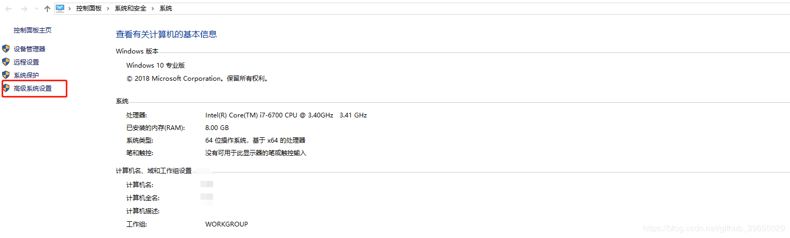

2.  然后进行环境变量的设置，需要设置两个环境变量：

- `MYSQL_HOME`：也就是我们存放 MySQL 8.0.x 解压缩包的位置；
- `Path`：`%MYSQL_HOMT%\bin`；

具体设置见以下的图：

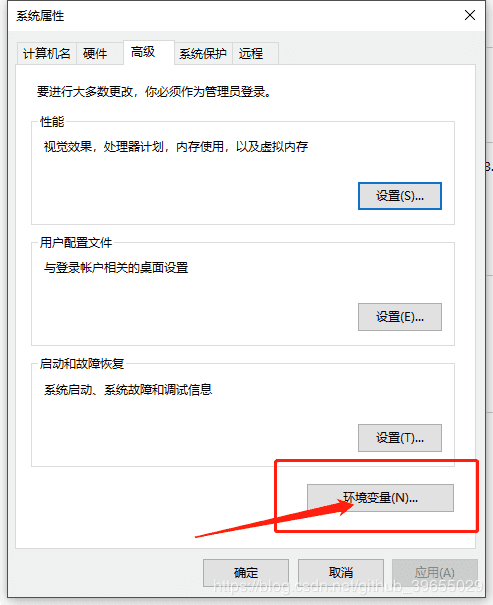


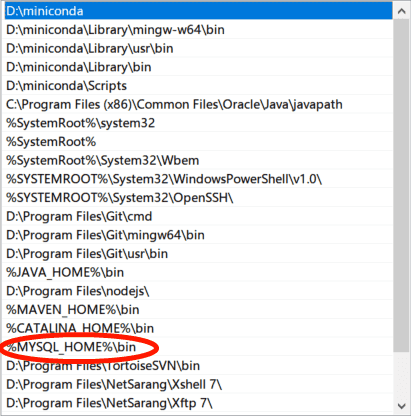

## 初始化

设置好环境变量之后，从控制台进入 MySQL 解压后的路径，然后以管理员身份执行如下命令。

```shell
mysqld --initialize --console
```

**注意**：执行成功后会打印出初始的 root 用户密码，一定要记住！！！方便后边修改密码；

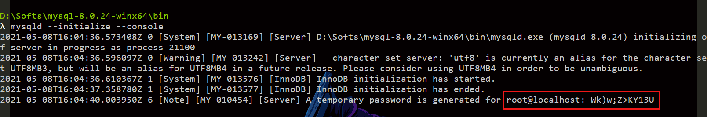

## 安装数据库服务

接上一步初始化数据库后，继续执行如下命令。

```shell
mysqld --install mysql8
```

表示安装名为 `mysql8` 的服务。

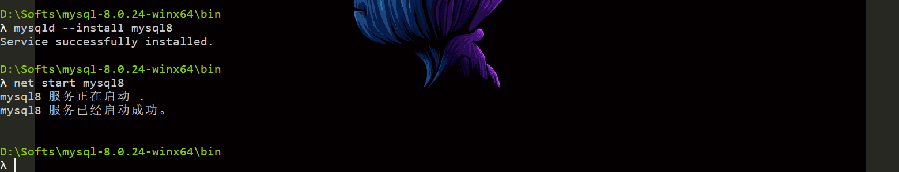

## 启动与关闭 MySQL 数据库服务

```shell
# 开启
net start mysql8
# 关闭
net stop mysql8
```

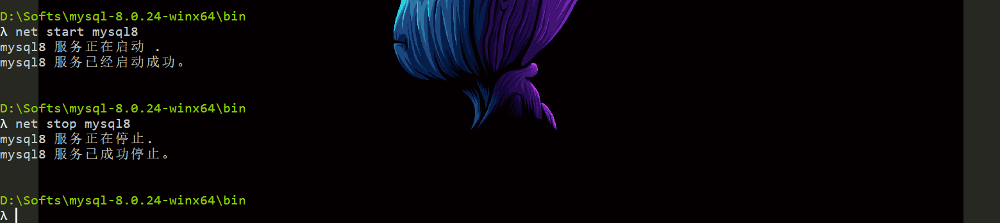

## 修改初始 root 用户密码

先用刚才记住的初始 `root` 用户密码登陆，然后进行密码更改，命令如下。

```shell
# 登陆
mysql -u root -p
# 然后提示你输入密码，输入上边初始化时默认给的初始化密码，进行登陆
# 密码修改
alter user 'root'@'localhost' identified by '新密码';
# 修改密码
```

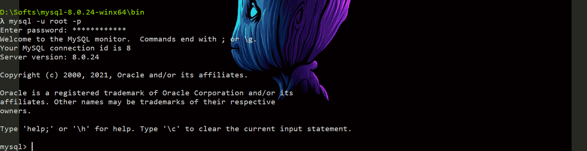

## 创建普通用户并设置密码

登入 `root` 用户后，创建新的用户并指定密码如下。

```shell
CREATE USER 'userName'@'localhost' IDENTIFIED BY 'password';
```

接着退出 `root` 用户登陆，尝试用你所创建的新用户进行登陆，登陆成功的提示如下。

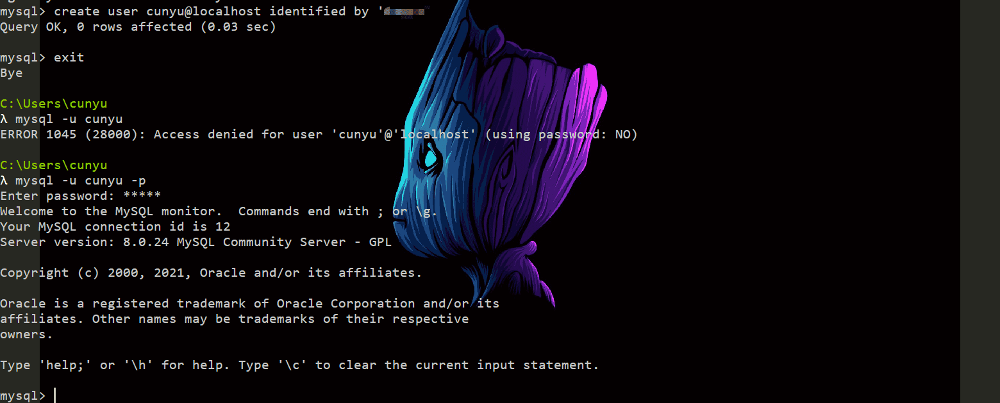

## 总结

好了，通过上面的流程，是不是知道了如何在 Windows 系统下安装最新的压缩包版 MySQL-8.0.x 呢，而且文中也对如何修改 `root` 用户的默认密码以及如何创建新用户给出了解决方案，是不是简单，那就亲自动手试试吧。

# 常用语法


之前了解了数据库的相关知识，然后又学习了如何安装 MySQL，接下来就来看看 SQL 常用语法，然后利用所学语法来操作我们的 MySQL 数据库实现增、删、改、查。

## SQL 通用语法

所谓通用语法，就是适用于所有关系型数据库的语法，而不是只针对某一个数据库。

常用的 SQL 通用语法主要有以下内容：

1.  SQL 语句可以以单行或多行书写，并且用分号 `;` 来表示一条语句的结束。

```sql
SELECT * FROM user;
```

```sql
SELECT *
FROM
user;
```

也就是说，以上两种方式书写的 SQL 语句其实最终实现的效果都是一样的。

2.  MySQL 中的 SQL 语句不区分大小写，但是为了将关键字和自定义变量分开，建议关键字使用大写。

```sql
SELECT * FROM user;
```

```sql
select * from user;
```

3.  SQL 中的两种种注释方式。

- **单行注释**

```bash
SQL语句 -- 注释内容
SQL语句 # 注释内容（MySQL 特有）
```

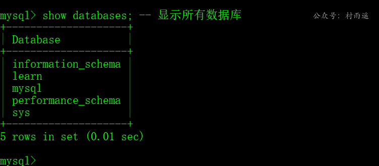

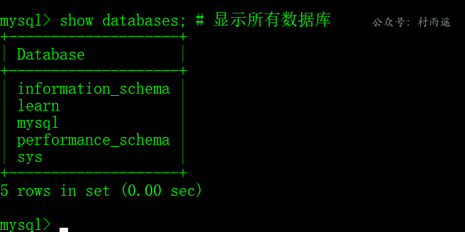

- **多行注释**

```bash
SQL语句 /* 注释内容 */
```

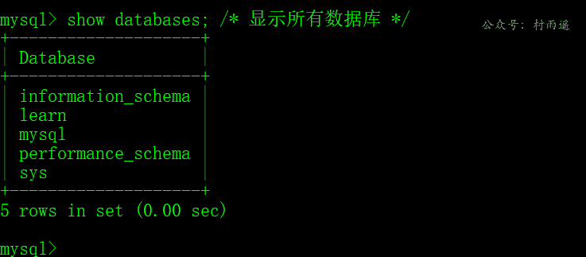

## SQL 分类

对于 SQL 语句，可以分为如下几类：

- **DDL**
- **DML**
- **DQL**
- **DCL**

| 分类    | 全程                       | 解释                                                   |
| ------- | -------------------------- | ------------------------------------------------------ |
| **DDL** | Data Definition Language   | 数据定义语言，用于定于数据库对象（数据库、表、字段等） |
| **DML** | Data Mainpulation Language | 数据操作语言，用于对数据库表中的数据进行增、删、改     |
| **DQL** | Data Query Language        | 数据查询语言，用于查询数据库中表的记录                 |
| **DCL** | Data Control Language      | 数据控制语言，用于创建数据库用户、控制数据库的访问权限 |

## DDL（Data Definition Language）

### 定义

用于**定义数据库对象**：数据库、表、列等，相关关键字：`CREATE`、`DROP`、`ALTER`……

### 数据库操作

#### 创建

- 通用

```sql
CREATE DATABASE [IF NOT EXISTS] 数据库名 [DEFAULT CHARSET 字符级] [COLLATE 排序规则];
```

- 创建数据库

```sql
CREATE DATABASE 数据库名;
```

- 创建数据库前先判断是否存在，不存在再创建

```sql
CREATE DATABASE IF NOT EXISTS 数据库名;
```

- 创建数据库的同时指定字符集

```sql
CREATE DATABASE 数据库名 CHARACTER SET 字符集名;
```

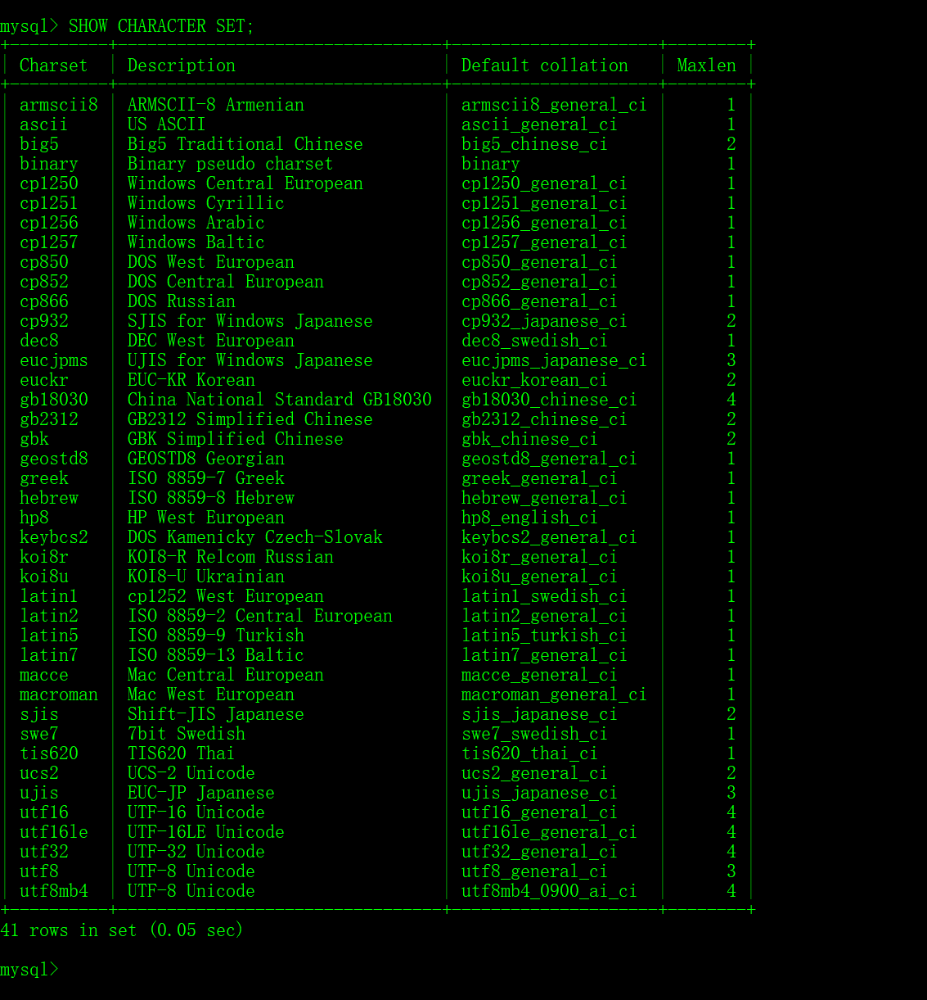

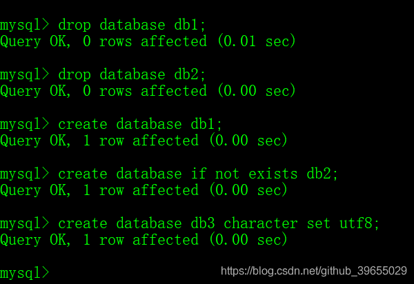

#### 查询

- 查询所有数据库名称；

```sql
SHOW DATABASES;
```

- 查询某一数据库的字符集和它的创建语句；

```sql
SHOW CREATE DATABASE 数据库名;
```

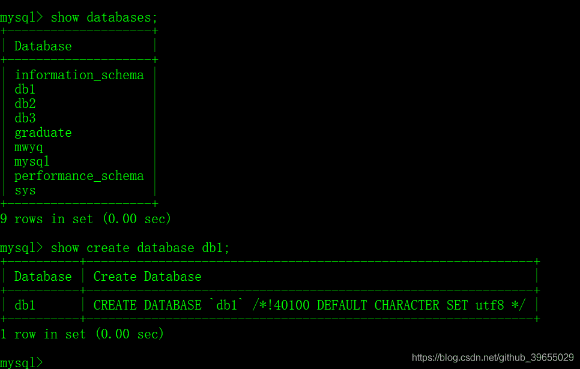

#### 更新

- 修改表名

```sql
RENAME TABEL 表名 TO 新表名;
```

- 修改数据库字符集

```sql
ALTER DATABASE 数据库名 CHARACTER SET 字符集名;
```


#### 删除

- 删除数据库

```sql
DROP DATABASE 数据库名;
```

- 判断数据库是否存在，存在再删除

```sql
DROP DATABASE IF EXISTS 数据库名;
```

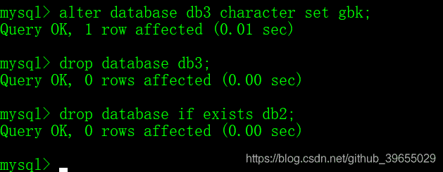

#### 使用

- 使用某一个数据库

```sql
USE 数据库名;
```

- 查询当前正在使用的数据库

```sql
SELECT DATABASE();
```

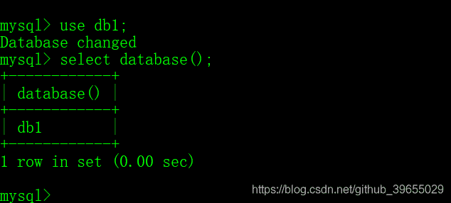

### 表操作

#### 创建

- 语法

```sql
CREATE TABLE 表名(
	列名1 数据类型 [COMMENT 列注释],
    列名2 数据类型 [COMMENT 列注释],
    ……
    列名n 数据类型 [COMMENT 列注释]
)[COMMENT 表注释];
```

- 常用数据类型

MySQL 中，数据类型有很多，但主要还是分为三大类：**数值类型**、**字符串类型**、**日期时间类型**。

1.  **数值类型**

| 类型        | 大小    | 有符号范围                                              | 无符号范围                                                  | 描述                 |
| ----------- | ------- | ------------------------------------------------------- | ----------------------------------------------------------- | -------------------- |
| TINYINT     | 1 Byte  | $(-128, 127)$                                           | $(0, 255)$                                                  | 小整数值             |
| SMALLINT    | 2 Bytes | $(-32768, 32767)$                                       | $(0, 65525)$                                                | 大整数值             |
| MEDIUMINT   | 3 Bytes | $(-8388608, 8388607)$                                   | $(0, 16777215)$                                             | 大整数值             |
| INT/INTEGER | 4 Bytes | $(-2147483648, 2147483647)$                             | $0, 4294967295$                                             | 大整数值             |
| BIGINT      | 8 Bytes | $(-2^{63}, 2^{63}-1)$                                   | $0, 2^{64}-1$                                               | 极大整数值           |
| FLOAT       | 4 Bytes | $(-3.402823466 E+38, 3.402823466351 E+38)$              | 0 和 $(1.175494351 E-38, 3.402823466 E+38)$                 | 单精度浮点数值       |
| DOUBLE      | 8 Bytes | $(-1.7976931348623157 E+308, 1.7976931348623157 E+308)$ | 0 和 $(2.2250738585072014 E-308, 1.7976931348623157 E+308)$ | 双精度浮点数值       |
| DECIMAL     |         | 依赖于精度（M）和标度（D）的值                          | 依赖于精度（M）和标度（D）的值                              | 小数值（精确定点数） |

2.  **字符串类型**

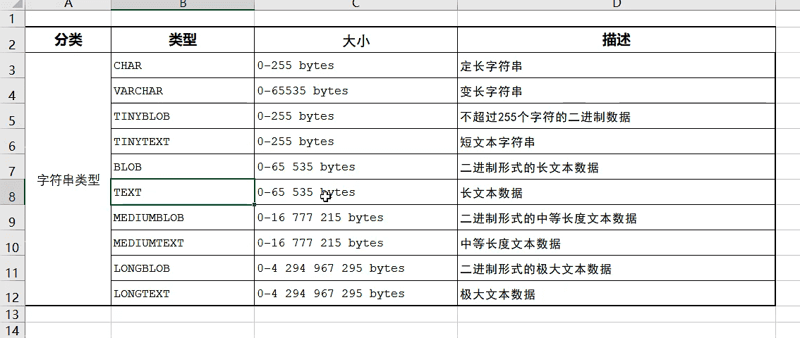

| 类型       | 大小                 | 描述                          |
| ---------- | -------------------- | ----------------------------- |
| CHAR       | 0 - 255 Bytes        | 定长字符串                    |
| VARCHAR    | 0 - 65535 Bytes      | 变长字符串                    |
| TINYBLOG   | 0 - 255 Bytes        | 不超过 255 个字符的二进制数据 |
| TINYTEXT   | 0 - 255 Bytes        | 短文本字符串                  |
| BLOB       | 0 - 65535 Bytes      | 二进制形式的长文本数据        |
| TEXT       | 0 - 65535 Bytes      | 长文本数据                    |
| MEDIUMBLOB | 0 - 16777215 Bytes   | 二进制形式的中等长度文本数据  |
| MEDIUMTEXT | 0 - 16777215 Bytes   | 中等长度文本数据              |
| LONGBLOB   | 0 - 4294967295 Bytes | 二进制形式的极大文本数据      |
| LONGTEXT   | 0 - 4294967295 Bytes | 极大文本数据                  |

3.  **日期时间类型**

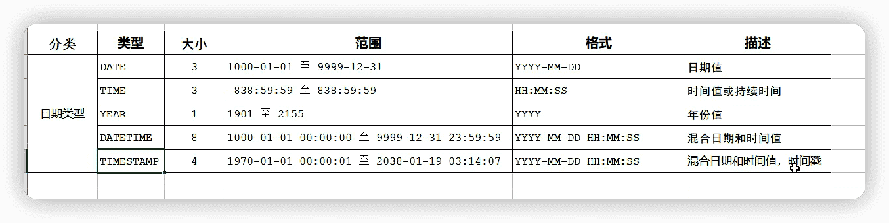

| 类型      | 大小 | 范围                                      | 格式                | 描述                     |
| --------- | ---- | ----------------------------------------- | ------------------- | ------------------------ |
| DATE      | 3    | 1000-01-01 ~ 9999-12-31                   | YYYY-MM-DD          | 日期值                   |
| TIME      | 3    | -838:59:59 ~ 838:59:59                    | HH:MM:SS            | 时间值或持续时间         |
| YEAR      | 1    | 1901 ~ 2155                               | YYYY                | 年份值                   |
| DATETIME  | 8    | 1000-01-01 00:00:00 ~ 9999-12-31 23:59:59 | YYYY-MM-DD HH:MM:SS | 混合日期和时间值         |
| TIMESTAMP | 4    | 1970-01-01 00:00:01 ~ 2038-01-19 03:14:07 | YYYY-MM-DD HH:MM:SS | 混合日期和时间值，时间戳 |

- 表复制

```sql
CREATE TABLE 新表名 LIKE 被复制的表名;
```

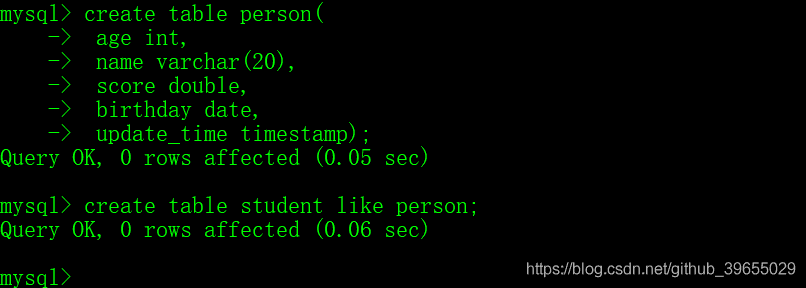

#### 查询

- 查询某个数据库中所有的表

```sql
SHOW TABLES;
```

- 查询表结构

```sql
DESC 表名;
```

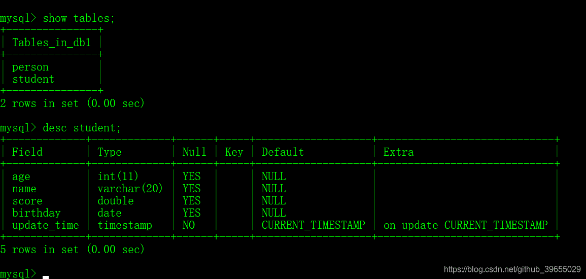

#### 更新

- 修改表名

```sql
ALTER TABLE 旧表名 RENAME TO 新表名;
```

- 修改表的字符集

```sql
ALTER TABLE 表名 CHARACTER SET 字符集名;
```

- 在表中添加一列

```sql
ALTER TABLE 表名 ADD 列名 数据类型;
```

- 修改列名称以及对应的数据类型

```sql
ALTER TABLE 表名 MODIFY 列名 新数据类型;
ALTER TABLE 表名 CHANGE 列名 新列名 新数据类型;
```

- 删除列

```sql
ALTER TABLE 表名 DROP 列名;
```

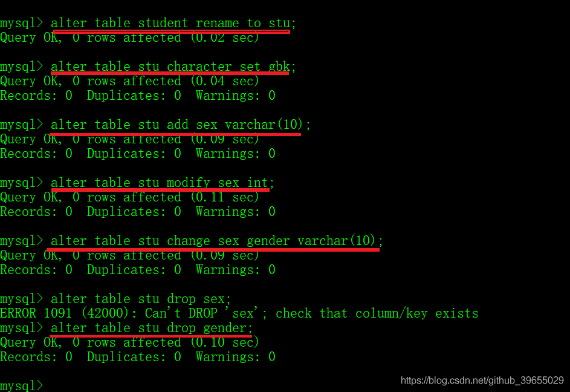

#### 删除

- 直接删除表

```sql
DROP TABLE 表名;
```

- 判断表是否存在，存在则删除

```sql
DROP TABLE IF EXISTS 表名;
```

- 删除指定表，并重新创建该表。

```sql
TRUNCATE TABLE 表名;
```

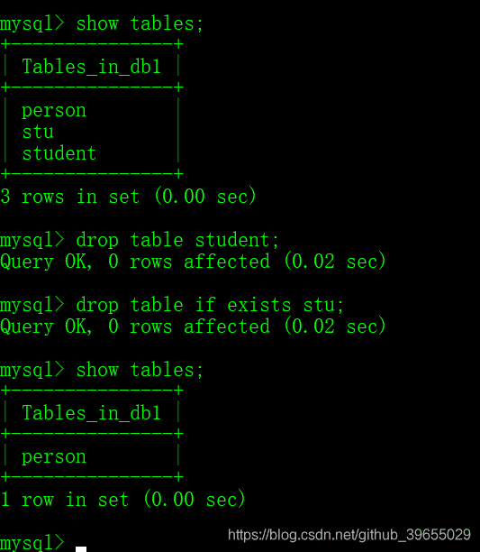


## DML（Data Manipulation Language）

### 定义

用于**对数据库中表的数据进行增删改**，相关关键字：`INSERT`、`UPDATE`、`DELETE`……

### 添加数据

1.  给指定字段添加数据

```sql
INSERT INTO 表名(列名1, 列名2, ……, 列名n) VALUES (值1, 值2, ……, 值n);
```

2.  给全部字段添加数据

```sql
INSERT INTO 表名 VALUES (值1, 值2, ……, 值n);
```

3.  批量添加数据

```sql
INSERT INTO 表名(列名1, 列名2, ……, 列名n) VALUES (值1, 值2, ……, 值n),(值1, 值2, ……, 值n),(值1, 值2, ……, 值n);
INSERT INTO 表名 VALUES (值1, 值2, ……, 值n),(值1, 值2, ……, 值n),(值1, 值2, ……, 值n);
```

### 删除数据

- 删除所有记录，有多少条记录就执行多少次删除操作

```sql
DELETE FROM 表名 [WHERE 条件];
```

- 删除所有数据，先删除表，然后创建一张结构一样的表，比 `DELETE` 效率更高

```sql
TRUNCATE TABLE 表名;
```

### 修改数据

```sql
UPDATE 表名 SET 列名1=值1, 列名2=值2, ……, 列名n=值n [WHERE 条件];
```

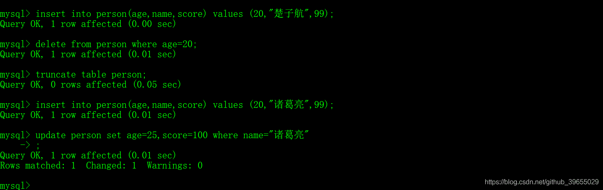

## DQL（Data Query Language）

### 定义

用于 **查询数据库中的数据**，相关关键字：`SELECT`、`HAVING`、`WHERE`……

### 语法

```sql
SELECT
	字段列表
FROM
	表名列表
WHERE
	条件列表
GROUP BY
	分组字段
HAVING
	分组后的条件
ORDER BY
	排序
LIMIT
	分页限定
OFFSET
	开始分页的起始位置
```

不过之得注意的是，以上只是 DQL 的编写顺序，当我们书写 DQL 语句时，需要按照以上顺序来书写。但在实际执行过程中，却不是按照书写顺序来执行的，而是按照以下顺序来执行的。

```sql
FROM
	表名列表
WHERE
	条件列表
GROUP BY
	分组后的条件
HAVING
	分组的条件列表
SELECT
	字段列表
ORDER BY
	排序字段列表
LIMIT
	分页参数
```

### 基础查询

- 多字段查询

```sql
SELECT 字段1,字段2,…… FROM 表名;
```

- 全部字段查询

```sql
SELECT * FROM 表名;
```

- 去重查询

```sql
SELECT DISTINCT 去重字段,字段1,字段2,…… FROM 表名;
```

- 起别名

```sql
# 两者其一
SELECT 字段名 AS 别名 FROM 表名;
SELECT 字段名 别名 FROM 表名;
```

### 条件查询

- 语法

```sql
SELECT 字段列表 FROM 表名 WHERE 条件列表;
```

- `WHERE` 后加条件

| 关键字                          | 意思                                                 | 例子                                 |
| ------------------------------- | ---------------------------------------------------- | ------------------------------------ |
| `>`、`<`、`>=`、`<=`、`=`、`!=` | 大于、小于、不小于、不大于、等于、不等于             | `col_name != 4`                      |
| `BETWEEN…AND…`                  | 介于两数之间，包含左右边界                           | `col_name BETWEEN 10 AND 100`        |
| `NOT BETWEEN…AND…`              | 不在两数之间                                         | `col_name NOT BETWEEN 10 AND 100`    |
| `IN(…)`                         | 在一个列表中                                         | `col_name IN (1, 4, 5)`              |
| `NOT IN(…)`                     | 不在一个列表                                         | `col_name NOT IN (1, 4, 5)`          |
| `LIKE`                          | 模糊查询，`_` 表示单个的任意字符，`%` 表示多个字符串 | `col_name like "ABC_"`               |
| `IS NULL`                       | 判断某一字段是否为 `NULL`                            | `col_name IS NULL`                   |
| `AND` 或 `&&`                   | 表示并行关系                                         | `col_name1 == 5 AND col_name2 == 10` |
| `OR` 或 `                       |                                                      | `                                    | 表示满足其中任一条件即可 | `col_name1 == 5 OR col_name2 == 10` |
| `NOT` 或 `!`                    | 表示否定                                             | `col_name IS NOT NULL`               |

### 聚合函数

通过将一列数据作为一个整体，进行纵向计算的函数，但是要注意的是，列中的所有 `null` 值都是不参与运算的。

| 函数    | 说明     |
| ------- | -------- |
| `count` | 统计数量 |
| `max`   | 最大值   |
| `min`   | 最小值   |
| `avg`   | 平均值   |
| `sum`   | 求和函数 |

### 分组查询

```sql
SELECT 字段列表 FROM 表名 [WHERE 条件] GROUP BY 分组字段名 [HAVING 分组后过滤条件];
```

这里需要注意 `HAVING` 和 `WHERE` 的区别，主 要有两点不一样，分别是：

1.  **执行时机**：`WHERE` 是在分组前进行过滤，不满足条件的就不参与分组，而 `HAVING` 则是对分组后的结果进行过滤。
2.  **判断条件**：`WHERE` 不能对聚合函数进行判断 ，但是 `HAVING` 可以。

### 分页查询

```sql
SELECT 字段列表 FROM 表名 LIMIT 起始索引, 查询记录数;
```

其中，起始索引一般是从 0 开始，起始索引 = （查询页码 - 1）\* 每页显示的记录数。

## DCL（Data Control Language）

### 定义

用于**定义数据库的访问权限和安全级别，以及用户创建**，相关关键字：`GRANT`、`REVOKE`……

### 用户管理

1.  查询用户

```sql
USE mysql;
SELECT * FROM user;
```

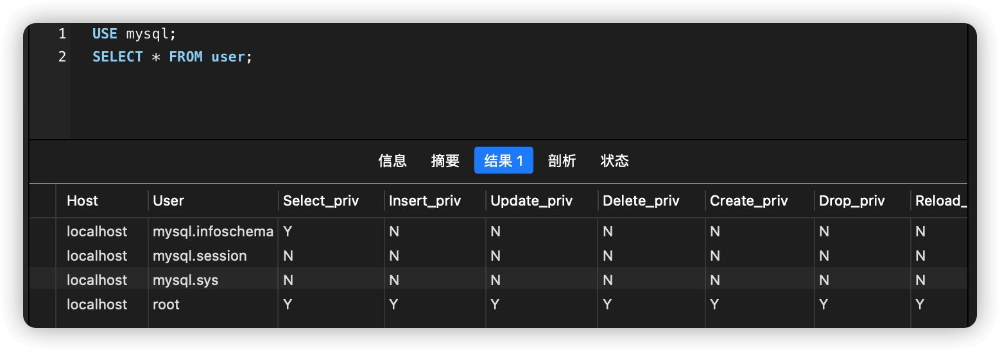

2.  创建用户

```sql
CREATE USER '用户名'@'主机名' IDENTIFIED BY '密码';
```

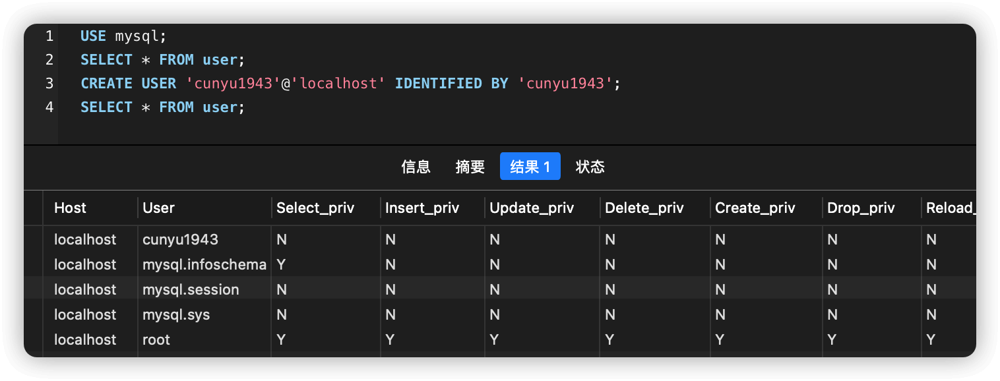

3.  修改用户密码

```sql
ALTER USER '用户名'@'主机名' IDENTIFIED WITH mysql_native_password BY '新密码';
```

4.  删除用户

```sql
DROP USER '用户名'@'主机名';
```

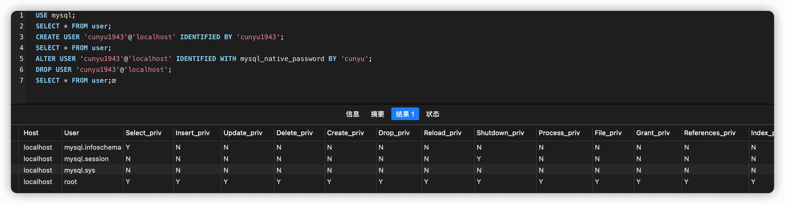

### 权限控制

| 权限                    | 说明               |
| ----------------------- | ------------------ |
| `ALL`、`ALL PRIVILEGES` | 所有权限           |
| `SELECT`                | 查询数据           |
| `INSERT`                | 插入数据           |
| `UPDATE`                | 修改数据           |
| `DELETE`                | 删除数据           |
| `ALTER`                 | 修改表             |
| `DROP`                  | 删除数据库/表/视图 |
| `CREATE`                | 创建数据库/表      |

1.  查询权限

```sql
SHOW GRANTS FOR '用户名'@'主机名';
```

2.  授权

```sql
GRANT 权限列表 ON 数据库名.表名 TO '用户名'@'主机名';
```

3.  撤销权限

```sql
REVOKE 权限列表 ON 数据库名.表名 FROM '用户名'@'主机名';
```

# 函数

## 定义

所谓函数，就是指的一段可以直接被另一端程序所调用的程序或者代码，就像 Java 中的方法一样。

## 字符串函数

| 函数                         | 说明                                                                  |
| ---------------------------- | --------------------------------------------------------------------- |
| `concat(S1, S2, …, Sn)`      | 字符串凭借，将 `S1`、`S2`、……`Sn` 拼接成一个字符串                    |
| `lower(str)`                 | 将字符串 `str` 全部转换为小写                                         |
| `upper(str)`                 | 将字符串 `str` 全部转换为大写                                         |
| `lpad(str, n, pad)`          | 左填充，用字符串 `pad` 对 `str` 的左边进行填充，达到 `n` 个字符串长度 |
| `rpad(str, n, pad)`          | 右填充，用字符串 `pad` 对 `str` 的右边进行填充，达到 `n` 个字符串长度 |
| `trim(str)`                  | 去除字符串头部和尾部的空格                                            |
| `substring(str, start, len)` | 返回字符串 `str` 从 `start` 位置起长度为 `len` 的字符串               |

## 数值函数

| 函数          | 说明                                     |
| ------------- | ---------------------------------------- |
| `ceil(x)`     | 向上取整                                 |
| `floor(x)`    | 向下取整                                 |
| `mod(x, y)`   | 返回 `x/y` 的模                          |
| `rand()`      | 返回 `0~1` 内的随机数                    |
| `round(x, y)` | 求参数 `x` 四舍五入的值，保留 `y` 位小数 |

## 日期函数

| 函数                                 | 说明                                                  |
| ------------------------------------ | ----------------------------------------------------- |
| `CURDATE()`                          | 返回当前日期                                          |
| `CURTIME()`                          | 返回当前时间                                          |
| `NOW()`                              | 返回当前日期和时间                                    |
| `YEAR(date)`                         | 获取指定 `date` 的年份                                |
| `MONTH(date)`                        | 获取指定 `date` 的月份                                |
| `DAY(date)`                          | 获取指定 `date` 的日期                                |
| `DATE_ADD(date, INTERVAL expr type)` | 返回一个日期/时间值加上一个事件间隔 `expr` 后的时间值 |
| `DATEDIFF(date1, date2)`             | 返回起始时间 `date1` 和结束时间 `date2` 之间的天数    |

## 流程函数

| 函数                                                      | 说明                                                                |
| --------------------------------------------------------- | ------------------------------------------------------------------- |
| `IF(value, t, f)`                                         | 若 `value` 为 `true`，则返回 `t`，否则返回 `f`                      |
| `IFNULL(value1, value2)`                                  | 若 `value1` 不为空，则返回 `value1`，否则返回 `value2`              |
| `CASE WHEN [val1] THEN [res1]……ELSE [default] END`        | 若 `val1` 为 `true`，则返回 `res1`，否则返回 `default` 默认值       |
| `CASE [expr] WHEN [val1] THEN [res1]……ELSE [default] END` | 若 `expr` 的值等于 `val1`，则返回 `res1`，否则返回 `default` 默认值 |

# 约束

## 概述

所谓约束，就是作用于表中字段上的规则，用来限制存储在表中的数据。使用的目的是为了保证数据库中数据的正确性、有效性以及完整性。

约束有很多种，常见的约束分类如下表。

| 关键字        | 约束                        | 描述                                                         |
| ------------- | --------------------------- | ------------------------------------------------------------ |
| `NOT NULL`    | 非空约束                    | 限制该字段的数据不能为 `null`                                |
| `UNIQUE`      | 唯一约束                    | 保证该字段的所有数据都是唯一不重复的                         |
| `PRIMARY KEY` | 主键约束                    | 主键是一行数据的唯一标识，要求非空且唯一                     |
| `DEFAULT`     | 默认约束                    | 保存数据时，若未指定该字段的值，则采用默认值                 |
| `CHECK`       | 检查约束（8.0.16 版本之后） | 保证字段值满足某一个条件                                     |
| `FOREIGN KEY` | 外键约束                    | 用于让两张表之间的数据建立连接，从而保证数据的一致性和完整性 |

## 外键约束

所谓外键约束，就是让两张表之间的数据建立连接，从而保证数据的一致性和完整性。

### 创建/删除约束

添加外键的方式主要有两种，一种是在创建表时添加，而另一种则是在创建表之后添加。

1.  **创建时**

```sql
CREATE TABLE 表名(
	字段名 数据类型,
    ……
    [CONSTRAINT] [外键名] FOREIGN KEY(外键字段名) REFERENCES 主表(主表列名)
);
```

2.  **创建后**

```sql
ALTER TABLE 表名 ADD CONSTRAINT 外键名称 FOREIGN KEY(外键字段名) REFERENCES 主表(主表列名);
```

既然添加了外键，那当然就有对应删除外键的方式。

```sql
ALTER TABLE 表名 DROP FOREIGN KEY 外键名称;
```

### 删除/更新行为

| 行为          | 说明                                                                                                             |
| ------------- | ---------------------------------------------------------------------------------------------------------------- |
| `NO ACTION`   | 主表中删除/更新对应记录时，先检查该记录是否有对应外键，若有则不允许删除/更新（与 `RESTRICT` 一致）               |
| `RESTRICT`    | 主表中删除/更新对应记录时，先检查该记录是否有对应外键，若有则不允许删除/更新（与 `NO ACTION` 一致）              |
| `CASCADE`     | 主表中删除/更新对应记录时，先检查该记录是否有对应外键，若有则删除/更新外键在从表中的记录                         |
| `SET NULL`    | 当在主表中删除对应记录时，先检查该记录是否有对应外键，若有则设置从表中该外键值为 `NULL`（要求外键可以取 `NULL`） |
| `SET DEFAULT` | 主表有变更时，从表将外键列设置为一个默认值（`Innodb` 不支持）                                                    |

```sql
ALTER TABLE 表名 ADD CONSTRAINT 外键名称 FOREIGN KEY (外键字段) REFERENCES 主表名(主表字段名) ON UPDATE CASCADE ON DELETE CASCADE;
```

# 多表查询

## 多表关系

项目开发进行数据库表结构设计时，需要根据业务需求和业务模块之间的关系，分析并设计表结构。但由于不同业务之间存在着的关联关系，因此各个表结构之间也存在着各种关系，常见的表结构之间的关系可以分为以下三种：

1.  一对多（多对一）
2.  多对多
3.  一对一

### 一对多（多对一）

常见的就是部门和员工之间的关系，一个部门下边有多个员工，但是每个员工只能有一个部门。为了在数据库中实现这一关系，可以**在多的一方建立外键，然后指向一的一方的主键。**

### 多对多

最常见的有学生和课程之间的关系，每个学生可以选修多门课程，而一门课程也可以供多个学生选择。为了在数据库中实现这一关系，通常**需要建立一个第三方的中间表，而且这个中间表应该至少包含两个外键，用于关联两方的主键。**

### 一对一

最常见的是用户与用户详情之间的关系，多用于**单表拆分**，将一张表的基础字段放在一张表中，其他详情字段则放在另一张表中，从而提升操作效率。为了在数据库中实现这一关系，可以**在任意一张表中加入外键，用来关联另一张表的主键，并且设置该外键唯一（`UNIQUE`）**。

## 多表查询

所谓多表查询，指的是从多张表中查询数据。

笛卡尔积：笛卡尔乘积指在数学中，两个集合 A 集合和 B 集合中的所有组合情况，在进行多表查询时，要注意消除掉无效的笛卡尔积。

多表查询可以分为**子查询**和连接查询，其中，连接查询又可以分为：**内连接、外连接、自连接**。

对于内连接，相当于查询两个表 A、B 之间的交集数据，即既存在表 A 中，也存在表 B 中的数据。

自连接表示当前表和它自身的连接查询，需要注意的是自连接查询时必须使用表别名。

最后是外连接，外连接可以分为**左外连接和右外连接**。其中，左外连接表示查询**左表**中的所有数据，以及左右两张表中的交集部分数据。

右外连接表示查询**右表**中的所有数据，以及左右两张表中的交集部分数据。

## 内连接

内连接表示的是查询两张表的交集部分，其查询语法可以分为**隐式内连接**和**显式内连接**。

1.  **隐式内连接**

```sql
SELECT 字段列表 FROM 表1, 表2 WHERE 条件 …;
```

2.  **显式内连接**

```sql
SELECT 字段列表 FROM 表1 [INNER] JOIN 表2 ON 连接条件 …;
```

## 外连接

外连接可以分为左外连接和右外连接，其查询语法如下。

1.  **左外连接**

```sql
SELECT 字段列表 FROM 表1 LEFT [OUTER] JOIN 表2 ON 条件 …;
```

2.  **右外连接**

```sql
SELECT 字段列表 FROM 表1 RIGHT [OUTER] JOIN 表2 ON 条件 …;
```

## 自连接

自查询查询语法如下，自连接查询既可以是内连接查询，也可以是外连接查询。

```sql
SELECT 字段列表 FROM 表A 别名A JOIN 表A 别名B ON 条件 …;
```

## 联合查询

联合查询，顾名思义，就是把多次查询的结果合并，从而形成一个新的查询结果集的查询。

```sql
SELECT 字段列表 FROM 表A ……
UNION [ALL]
SELECT 字段列表 FROM 表B ……
```

## 子查询

子查询指 SQL 语句中嵌套 `SELECT` 语句，所有又叫做**嵌套查询**。

```sql
SELECT * FROM 表1 WHERE 字段名 = (SELECT 字段名 FROM 表2);
```

子查询返回的结果是一列（也可以是多列），这种子查询叫做**列子查询**。

常用的操作符有：`IN`、`NOT IN`、`ANY`、`SOME`、`ALL`

| 操作符   | 说明                             |
| -------- | -------------------------------- |
| `IN`     | 在指定集合范围内，多选一         |
| `NOT IN` | 不在指定集合范围内               |
| `ANY`    | 子查询返回列表中，有任一满足即可 |
| `SOME`   | 等同于 `ANY`，可以用 `ANY` 代替  |
| `ALL`    | 子查询返回列表的所有值都必须满足 |

子查询返回的结果是一行（可以是多列），这种子查询叫做**行子查询**。

常用的操作符有：`=`、`<>`、`IN`、`NOT IN`

若子查询返回的结果是多行多列，那么这种子查询叫做**表子查询**，常用操作符为：`IN`。

# 事务

## 事务简介

事务是一组操作的集合，是一个不可分割的工作单位，它会将所有的操作当做一个整体一起向系统提交或者撤销操作请求，因此这些操作**要么同时成功，那么同时失败**，最常见的就是业务场景就是银行转账。

## 事务操作

1.  查看/设置事务提交方式

```sql
SELECT @@autocommit;
SET @@autocommit = 0;
```

| 提交方式 | 说明     |
| -------- | -------- |
| `0`      | 手动提交 |
| `1`      | 自动提交 |

2.  提交事务

```sql
COMMIT;
```

3.  回滚事务

```sql
ROLLBACK;
```

4.  开启事务

```sql
START TRANSACTION / BEGIN
```

## 事务四大特性

- **原子性(Atomicity)**：事务是不可分割的最小操作单元，要么全部成功，要么全部失败。
- **一致性(Consistency)**：事务完成时，必须使所有数据都保持一直状态。
- **隔离性(Isolation)**：数据库系统提供的隔离机制，保证事务在不收外部并发操作影响的独立环境下运行。
- **持久性(Durability)**：事务一旦提交或回滚，那么它对数据库中数据的修改就是永久的。

## 并发事务问题

| 问题       | 说明                                                                                         |
| ---------- | -------------------------------------------------------------------------------------------- |
| 脏读       | 一个事务读到另一个事务中还未提交的数据                                                       |
| 不可重复读 | 一个事务先后读取同一条记录，但两次读取的数据不同                                             |
| 幻读       | 一个事务按照条件查询时，没有对应的数据行，但在插入数据时，又发现改行数据已存在，如同幻影一样 |

## 事务隔离级别

| 隔离级别                | 脏读 | 不可重复读 | 幻读 |
| ----------------------- | ---- | ---------- | ---- |
| `Read Uncommitted`      | √    | √          | √    |
| `Read Committed`        | ×    | √          | √    |
| `Repeatable Read`(默认) | ×    | ×          |      |
| `Serializable`          | ×    | ×          | ×    |

1.  查看事务隔离级别

```sql
SELECT @@TRANSACTION_ISOLATION;
```

2.  设置事务隔离级别

```sql
SET [SESSION|GLOBAL] TRANSACTION ISOLATION LEVEL {READ UNCOMMITED | READ COMMITED | REPEATABLE READ | SERIALIZABLE}
```