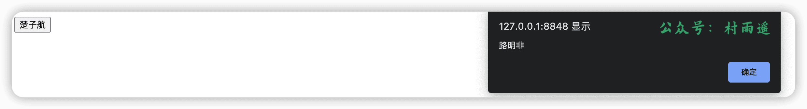
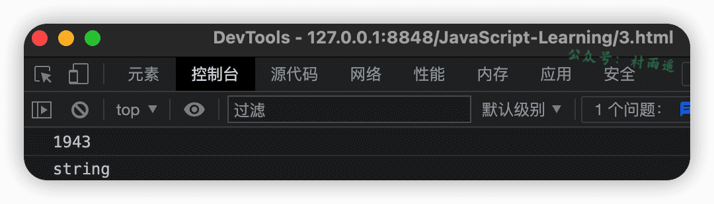

# 一、Web 简介

## 什么是 Web

什么是 `Web` 呢？所谓 `Web`，就是全球广域网，也叫做万维网（`www, World Wide Web`），通过浏览器就能够访问的网站。

## Web 网站工作流程


## Web 前端

网页组成：文字、图片、音频、视频、超链接

而看到的网页，本质都是前端代码。通过浏览器对前端代码的的解析和渲染，形成用户看的网页。而在浏览器中对代码解析渲染的工具就叫做浏览器内核。需要注意，不同的浏览器内核是不一样的，所以对于相同的代码解析后的效果也有所有差异。

为了让浏览器将一套代码都能渲染出相同的效果，所以制定了一系列的标准，而这些标准大部分都由 `W3C(World Wide Web Consortium，万维网联盟)` 负责制定。

一个网页由三个部分共同组成：

-   **HTML**：网页的结构（页面元素 + 内容）
-   **CSS**：网页的表现（页面元素的外观、位置等页面样式）
-   **JavaScript**：网页的行为（交互效果）

# 二、HTML

## 什么是 HTML

`HTML(HyperText Markup Language)`，中文译为超文本标记语言。

所谓超文本，就是超越了文本的限制，较普通文本更为强大。除开文字信息外，还能定义图片、音频、视频等诸多内容。

而标记语言也很简单，就是由标签所构成的语言。在 `HTML` 中，所有标签都是预先定义好的。写好的 `HTML` 代码能直接在浏览器中运行，然后由浏览器解析。

## HTML 快速入门

1.   先建一个文本，保存后缀名为 `.html` 的文件中。
2.   接着编写 `HTML` 结构标签

```html
<!DOCTYPE html>
<html lang="en">
    <head>
        <meta charset="UTF-8">
        <title>Title</title>
    </head>
    <body>

    </body>
</html>
```

3.   在 `<body>` 中填写内容即可

```html
<!DOCTYPE html>
<html lang="en">
    <head>
        <meta charset="UTF-8">
        <title>Title</title>
    </head>
    <body>
        <h1>HTML 快速入门</h1>
    </body>
</html>
```

4.   效果预览


`HTML` 特点：

-   标签不区分大小写
-   标签属性值单双引号均可
-   语法松散


## 基础标签

既然说了 HTML 是由一系列的元素组成，那我们就来看看元素相关的内容。

元素又是由一对标签加上内容所共同构成，以下是一个简单的文本标签示例。


该元素中，主要组成部分如下：

- **开始标签**：由标签名称，大于号、小于号所组成，表示元素从此处开始生效。
- **结束标签**：类似于开始标签，只是在标签名之前多了一个斜杠 `/`，表示元素的结尾。
- **内容**：元素的内容。

以下就来看看，`HTML` 中的各种常用标签。

### `<!DOCTYPE html>`

放在 HTML 文件中的首行，主要用于标识文档类型。

### `<html>`

HTML 文档中的根标签，包含了整个页面的所有内容，其他所有标签都包含在 `html` 标签中。

### `<head>`

这个元素中的内容对用户是不可兼得，主要用于设置网页字符编码、CSS 样式、页面描述、搜索关键字等信息。

```html
<!DOCTYPE html>
<html>
	<head>
		<meta charset="utf-8" />
		<meta name="viewport" content="width=device-width, initial-scale=1">
		<title>HTML 标题</title>
	</head>
</html>
```

### `<body>`

网站主体内容，如果想让我们的内容显示在网页中让其他用户在访问该界面时看见，则内容需要写在该标签中，主要包括文本、图形、视频或其他内容。

以下是一个在网页中显示内容的实例。

```html
<!DOCTYPE html>
<html>
    <body>
		公众号：村雨遥
	</body>
</html>
```


### `<title>`

网页标题，在 `head` 标签中设置后，打开网页时将显示为网页标题。

以下是一个实例。

```js
<!DOCTYPE html>
<html>
	<head>
		<title>HTML 标题</title>
	</head>
</html>
```


### `<p>`

文本标签，用于定义段落。该标签会自动在其前后创建一些空白，浏览器将自动添加这些空间。

```html
<!DOCTYPE html>
<html>
	<head>
		<meta charset="utf-8" />
		<meta name="viewport" content="width=device-width, initial-scale=1">
		<title>HTML 标题</title>
	</head>
	<body>
		<p>这是一段文本</p>
	</body>
</html>

```


### 标题

此处的标题不同与上边的 `title` 标签，`title` 设置的主要是网页标题，二次数的标题主要是是针对 `body` 标签中的标题。

这里的标题又可以分为 6 级，其对应标签分别是：`<h1>`、`<h2>`、`<h3>`、`<h4>`、`<h5>`、`<h6>`。

```html
<!DOCTYPE html>
<html>
	<head>
		<meta charset="utf-8" />
		<meta name="viewport" content="width=device-width, initial-scale=1">
		<title>HTML 标题</title>
	</head>
	<body>
		<h1>一级标题</h1>
		<h2>二级标题</h2>
		<h3>三级标题</h3>
		<h4>四级标题</h4>
		<h5>五级标题</h5>
		<h6>六级标题</h6>
	</body>
</html>
```


### `</br>`

表示换行，不同于 `title` 等标签，它是一个单标签，即开始标签和结束标签都是同一个，单词放在标签名之前。

```js
<!DOCTYPE html>
<html>
    <body>
		公众号</br>
		村雨遥
	</body>
</html>
```


### ``

表示图片标签，通过该属性我们可以在网页中添加一张图片。

此外，`img` 标签提供 `src` 属性用于设置图片路径，`height` 属性设置图片高度，`width` 属性设置图宽度。为了防止图片失效造成误解，我们还可以给图片添加一个提示，此时使用 `alt` 属性即可。

```html
<!DOCTYPE html>
<html>
	<head>
		<meta charset="utf-8" />
		<meta name="viewport" content="width=device-width, initial-scale=1">
		<title>HTML 标题</title>
	</head>
	<body>
		
	</body>
</html>
```


```html
<!DOCTYPE html>
<html>
	<head>
		<meta charset="utf-8" />
		<meta name="viewport" content="width=device-width, initial-scale=1">
		<title>HTML 标题</title>
	</head>
	<body>
		
	</body>
</html>
```


### `<a>`

在某一个网页中，我们要通过超链接来跳转到另一个页面，则此时需要用到 `<a>` 标签，当然该标签中最重要的 `href` 属性也不能少，它用于指示跳转的目标网页。

```html
<!DOCTYPE html>
<html>
	<head>
		<meta charset="utf-8" />
		<meta name="viewport" content="width=device-width, initial-scale=1">
	</head>
	<body>
		<a href="https://cunyu1943.github.io/JavaPark">JavaPark(Java 自学指南)</a>
	</body>
</html>
```


### 列表

列表可以分为有序列表和无序列表，其中有序列表是由 `ol` 标签标识。

```html
<!DOCTYPE html>
<html>
	<head>
		<meta charset="utf-8" />
		<meta name="viewport" content="width=device-width, initial-scale=1">
		<title>HTML 标题</title>
	</head>
	<body>
		<ol>
			<li>《网球王子》</li>
			<li>《灌篮高手》</li>
			<li>《鬼灭之刃》</li>
		</ol>
	</body>
</html>
```


有序列表中，可以在 `ol` 标签中添加 `start` 属性，用于表示从第几位开始，`type` 属性用于标识所要显示的类型。

| type | 说明                       |
| ---- | -------------------------- |
| `1`  | 显示类型为数字类型         |
| `A`  | 显示类型为大写字母类型     |
| `a`  | 显示类型为小写字母类型     |
| `I`  | 显示类型为大写罗马数字类型 |
| `i`  | 显示类型为小写罗马数字类型 |

```html
<!DOCTYPE html>
<html>
	<head>
		<meta charset="utf-8" />
		<meta name="viewport" content="width=device-width, initial-scale=1">
		<title>HTML 标题</title>
	</head>
	<body>
		<ol type="I" start="2">
			<li>《网球王子》</li>
			<li>《灌篮高手》</li>
			<li>《鬼灭之刃》</li>
		</ol>
	</body>
</html>
```


除开有序列表之外，还有无序列表，无序列表以 `ul` 标识。

```html
<!DOCTYPE html>
<html>
	<head>
		<meta charset="utf-8" />
		<meta name="viewport" content="width=device-width, initial-scale=1">
		<title>HTML 标题</title>
	</head>
	<body>
		<ul>
			<li>嵩山派</li>
			<li>泰山派</li>
			<li>恒山派</li>
		</ul>
	</body>
</html>
```


无序列表虽然没有顺序之分，但是同样提供了 `type` 属性。

| type     | 说明                   |
| -------- | ---------------------- |
| `disc`   | 小圆黑点，默认显示方式 |
| `circle` | 空心圆圈               |
| `square` | 小黑方形               |

```js
<!DOCTYPE html>
<html>
	<head>
		<meta charset="utf-8" />
		<meta name="viewport" content="width=device-width, initial-scale=1">
		<title>HTML 标题</title>
	</head>
	<body>
		<ul type="circle">
			<li>嵩山派</li>
			<li>泰山派</li>
			<li>恒山派</li>
		</ul>
		<ul type="square">
			<li>西施</li>
			<li>王昭君</li>
			<li>杨玉环</li>
		</ul>
	</body>
</html>
```


### `<b>`

要实现对内容加粗，可以使用 `<b>` 标签。

```html
<!DOCTYPE html>
<html>
	<head>
		<meta charset="utf-8" />
		<meta name="viewport" content="width=device-width, initial-scale=1">
	</head>
	<body>
		<b>重点</b>提醒
	</body>
</html>
```


### `<u>`

有时需要对内容做下划线处理，则可以使用 `<u>` 标签。

```html
<!DOCTYPE html>
<html>
	<head>
		<meta charset="utf-8" />
		<meta name="viewport" content="width=device-width, initial-scale=1">
	</head>
	<body>
		<u>下划线</u> 展示
	</body>
</html>
```


### `<i>`

为了将文本以斜体的方式显示给浏览器，可以使用 `<i>` 标签。

```html
<!DOCTYPE html>
<html>
	<head>
		<meta charset="utf-8" />
		<meta name="viewport" content="width=device-width, initial-scale=1">
	</head>
	<body>
		<i>世界上只有一种真正的英雄主义，就是认清了生活的真相后还依然热爱它 -- 罗曼.罗兰</i>
	</body>
</html>
```


### 上下标

有时候我们需要在网页中显示数学或者化学公式，那么此时需要用到上下标，其中上标用标签 `<sup>` 表示，下标用标签 `<sub>` 表示。

```html
<!DOCTYPE html>
<html>
	<head>
		<meta charset="utf-8" />
		<meta name="viewport" content="width=device-width, initial-scale=1">
	</head>
	<body>
		x<sub>1</sub><sup>2</sup> + x<sub>2</sub><sup>2</sup> = 100;
	</body>
</html>
```


### `<table>`

表格标签 `<table>` 中又含有多个子标签，常用的子标签有如下。

- `th`：表头列
- `tr`：行
- `td`：列

同样的，表格标签还提供了以下这些常用的属性，用于给表格增加样式。但现在大多都是用 CSS 来对表格进行修饰，所以这些属性简单了解即可，不用太过深入。

| 属性          | 说明           |
| ------------- | -------------- |
| `border`      | 表格边框的粗细 |
| `width`       | 表格的宽度     |
| `cellspacing` | 单元格间距     |
| `cellpadding` | 单元格填充     |

```html
<!DOCTYPE html>
<html>
	<head>
		<meta charset="utf-8" />
		<meta name="viewport" content="width=device-width, initial-scale=1">
	</head>
	<body>
		<table border="1" width="500">
			<tr>
				<th>名字</th>
				<th>性别</th>
				<th>职业</th>
			</tr>
			<tr>
				<td>亚瑟</td>
				<td>男</td>
				<td>战士</td>
			</tr>
			<tr>
				<td>伽罗</td>
				<td>女</td>
				<td>射手</td>
			</tr>
			<tr>
				<td>米莱迪</td>
				<td>女</td>
				<td>法师</td>
			</tr>
		</table>
	</body>
</html>
```


### `<form>`

`<form>` 表示文档中的一个区域，主要包含交互空间，用来向服务器提交信息。`<form>` 标签通常包含一个或者多个表单标签，常用的表单标签如下：

| 表单标签     | 说明   |
| ------------ | ------ |
| `<input>`    | 输入框 |
| `<textarea>` | 文本域 |
| `<button>`   | 按钮   |
| `<select>`   | 单选框 |

```html
<!DOCTYPE html>
<html>
	<head>
		<meta charset="utf-8" />
		<meta name="viewport" content="width=device-width, initial-scale=1">
	</head>
	<body>
		<form action="" method="post">

			<label for="name">姓名: </label>
			<input type="text" name="name" id="name"></br>
			<label for="email">邮箱: </label>
			<input type="email" name="email" id="email"></br>

			<input type="submit" value="提交">

		</form>
	</body>
</html>
```


其中 `action` 属性用来处理表单提交的 URL，`method` 属性表示使用何种 HTTP 方式来提交表单，常用的值有 `post` 和 `get`。

# 三、CSS

## 什么是 CSS

`CSS(Cascading Style Sheet)`，中文译为层叠样式表，用于控制页面的样式。

# 四、JavaScript 简介

## 什么是 JavaScript

作为世界上最流行的语言之一，是一种运行在客户端的脚本语言。而所谓脚本语言，就是不需要编译就能运行的编程语言，`JavaScript` 在运行过程中通过 `JS` 解释器来逐行解释然后执行。

## JavaScript 能做什么？

最初的时候，`JavaScript` 被设计出来的初衷是为了实现表单的动态校验，比如密码长度校验、邮箱格式校验等。但渐渐随着 `JavaScript` 的发展，`JavaScript` 变得越来越强大，也发展出了许多产物，如 `Node.js`、`Electron`、`Cordova`、`Ruff`、`cocos2d-js`。利用这些产物，我们可以用来进行服务器的开发、桌面程序的搭建、`APP` 的开发、硬件-物联网的控制、游戏开发等等工作。

## HTML、CSS、JavaScript 之间的关系

`HTML` 和 `CSS` 不同于 `JavaScript`，它们都是描述类语言，其中 `HTML` 主要用于决定网页结构和内容（决定网页上能看到什么），而 `CSS` 则主要用于定义网页所呈现给用户的模样（决定网页是否美观）。`JavaScript` 则是专注于实现业务逻辑和页面控制（决定网页提供的功能）。

如果把这三者比作一个王者荣耀中的英雄的话，那 `HTML` 就相当于原皮的英雄，而 `CSS` 则是相当于英雄的皮肤，让我们的英雄更帅气，而 `JavaScript` 则相当于英雄的技能，我们可以通过控制英雄通过技能来实现杀敌清兵的效果。

## 浏览器如何执行 JavaScript

`JavaScript` 一般运行在网页中的，所以一般是在浏览器中运行。而浏览器一般分为两部分，一个是**渲染引擎**，另一个则是 **JS 引擎**，两者的功能如下：

- **渲染引擎**：用于解析 `HTML` 和 `CSS` 代码，大家一般把它叫做内核，比如 `Chrome` 浏览器的 `Blink`，`Firefox` 浏览器的 `Gecko`。
- **JavaScript 引擎**：也叫做 `JavaScript` 解释器，主要用于读取网页中的 `JavaScript` 代码，然后对其处理用执行，如 `Chrome` 浏览器的 `V8`，`Firefox` 的 `TraceMonkey`。

所以名义上虽然说是浏览器执行了 `JavaScript` 代码，但如果看底层的话，却会发现其实 `JavaScript` 代码是通过浏览器中的 `JavaScript` 引擎来执行的。`JavaScript` 引擎在执行代码时会逐行解释源代码，将其转换为机器语言，然后交由计算机执行。也正因为如此，所以将 `JavaScript` 划分为脚本语言，它会逐行去解释执行，而不是像 `HTML`、`CSS` 类似的标记语言。

## JavaScript 的组成


1.  **ECMAScript**

`ECMAScript` 是由 `ECMA` 国际进行标准化的一门编程语言，往往被大家称为 JavaScript 或者 `JScript`，但实际上并不是一个东西，后两者其实是基于 `ECMAScript` 的实现和扩展。其中，`JavaScript` 是由网景公司所提出，而 `JScript` 则是由微软公司所提出。 所以 `ECMAScript` 更像是一种规范，它规定了 `JavaScript` 的编程语法和基础核心知识，然后所有的浏览器厂商都需要共同遵守这一套 `JavaScript` 语法工业标准。

2.  **DOM**

`DOM`（`Document Object Model`）即文档对象模型，是由 `W3C` 组织推荐的用于处理可扩展标记语言的**标准编程接口**。通过 `DOM` 所提供的各种接口，我们就能够轻易地对网页上的各种元素进行操作，如调整位置、大小、颜色等。

3.  **BOM**


`BOM`（`Browser Object Model`）即浏览器对象模型，它提供了独立于内容，能够与浏览器进行交互的对象结构。通过使用 `BOM`，我们就能够十分方便的操作浏览器窗口，如弹出提示框、控制跳转、获取分辨率等操作。

## JavaScript 引入方式

`JavaScript` 的引入方式主要有 3 种，分别是 **行内式**、**内嵌式** 和 **外部式**，以下就分别来看看各种引入方式的写法。

1.  **行内式**

首先是行内式，顾名思义，所谓行内式，就是将少量的 `JavaScript` 代码直接写在 `HTML` 标签的相关属性中，比如下面的代码。通过点击页面中的按钮，页面就会弹窗。

```html
<!DOCTYPE html>
<html>
    <head>
        <meta charset="utf-8" />
        <meta name="viewport" content="width=device-width, initial-scale=1">
        <title>JavaScript 入门体验</title>
    </head>
    <body>
        <input type="button" value="楚子航" onclick="alert('路明非')"/>
    </body>
</html>
```



行内式的特点就是比较简单，但是也存在很多问题。比如可读性较差，如果需要在 `HTML` 编写大量 `JavaScript` 代码时，此时阅读就很不方便。除此之外，`JavaScript` 和 `HTML` 中都会使用到引号，如果出现多层引号相互嵌套时，会非常容易混淆，导致代码实现结果出错。所以除非特殊情况，否则一般不推荐使用行内式。

2.  **内嵌式**

相比于单行式，内嵌式就更加清晰明了。我们通过将 `JavaScript` 代码封装到 `<script>` 标签中，然后就可以实现简单的弹窗功能了。内嵌式的代码可读性更高，也更方便纠错。

```html
<!DOCTYPE html>
<html>
    <head>
        <meta charset="utf-8" />
        <meta name="viewport" content="width=device-width, initial-scale=1">
        <title>JavaScript 入门体验</title>
        <script>
            alert("罗罗诺亚.索隆")
        </script>
    </head>
    <body>
    </body>
</html>
```


3.  **外部式**

最后一种就是外部式，通过在外部新建一个后缀名为 `.js` 的文件，然后将 `JavaScript` 直接写到该文件中，最后在 `HTML` 页面中通过 `<script>` 标签的 `src` 属性引入即可。

外部式的优点是很明显的：

- 首先，可读性提高。`JavaScript` 代码量较大时，通过放在独立的文件中，排除了 `HTML` 和 `CSS` 元素的干扰。
- 其次，代码复用率提高。假设我们其他业务需要同样的功能，我们只需要将封装好的 `.js` 文件引用过去即可使用。

```javascript
alert("手塚国光")
```

```html
<!DOCTYPE html>
<html>
    <head>
        <meta charset="utf-8" />
        <meta name="viewport" content="width=device-width, initial-scale=1">
        <title>JavaScript 入门体验</title>
        <script src="js/my.js"></script>
    </head>
    <body>
    </body>
</html>
```


# 五、JavaScript 基础语法

## 注释

为了提高代码的可读性，我们往往需要在代码中添加一些额外的信息，但是我们又不想让这些信息影响到代码的执行。这时候，我们就需要使用到注释。`JavaScript` 中，主要有两种注释，一种是单行注释，另一种则是多行注释，和 `Java` 中的注释很相似。

1.  **单行注释**

单行注释以 `//` 开头，后边接上需要注释的信息即可。

```js
// 单行注释
alert("虞姬");
```

2.  **多行注释**

多行注释则是以 `/*` 开头，以 `*/` 结尾，两者中间所包含的内容则是我们的注释。

```js
/*
    多行注释
 */
alert("网球王子");
```

## 输入输出

为了方便信息的输入输出，`JavaScript` 中也像其他编程语言一样，提供了常用的输入输出语句。而其中最常用的，莫过于以下 3 个方法了。

| 方法               | 功能                         | 归属   |
| ------------------ | ---------------------------- | ------ |
| `alert(msg)`       | 弹出警示框                   | 浏览器 |
| `console.log(msg)` | 控制台打印输出信息           | 浏览器 |
| `prompt(info)`     | 弹出输入框，用户可以输入信息 | 浏览器 |

1.  **prompt(info)**

通过使用该方法，我们可以让用户在打开页面时让浏览器自动弹出输入框，然后用户就能够根据提示来进行信息输入。以下是一个简单的示例，通过弹窗让用户输入想要观看的动漫。

```html
<!DOCTYPE html>
<html>
    <head>
        <meta charset="utf-8" />
        <meta name="viewport" content="width=device-width, initial-scale=1">
        <title>Java 基础语法</title>
    </head>
    <body>
        <script>
            prompt('请输入你要观看的动漫名');
        </script>
    </body>
</html>
```


2.  **alert(msg)**

该方法可以在网页中弹出警示框，将信息展示给用户。紧接着上一个方法，假设用户输入后我们要让用户再次看到他刚才的输入，那我们就可以通过弹窗将刚才输入的信息进行展示。

```html
<!DOCTYPE html>
<html>
    <head>
        <meta charset="utf-8" />
        <meta name="viewport" content="width=device-width, initial-scale=1">
        <title>Java 基础语法</title>
    </head>
    <body>
        <script>
            var name = prompt('请输入你要观看的动漫名');
            alert(name);
        </script>
    </body>
</html>
```


3.  **console(msg)**

这个方法主要是用于在浏览器的控制台打开，而一般用户也用不到这个，更多的是开发人员用于调试开发时使用。


## 变量

### 什么是变量

其实在上面的例子中我已经试用过变量了，也就是在使用 `alert(msg)` 方法举例时，其中用的 `name` 其实就是一个变量。

所谓变量，可以把它看做是用来存放数据的容器。我们通过**变量名**来获取容器中的数据，也可以进行数据修改等操作。其本质其实是程序在内存中所申请的用来存放数据的一块空间。

### 如何使用变量

要使用一个变量也很简单，同样以下面的例子来说。

```js
var name = prompt('请输入你要观看的动漫名');
alert(name);
```

主要可以把变量的使用拆解为两个步骤，第一步就是对变量进行声明，第二步则是对变量进行赋值。上面的例子是将两个步骤合二为一，而这个过程我们也叫做**变量的初始化**，在声明变量的同时也给对象赋了值。如果要对其进行拆分，则可以拆分为以下步骤：

```js
// 声明变量
var name;
// 变量赋值
name = prompt('请输入你要观看的动漫名');
// 使用变量
alert(name);
```

其中 `var` 是 `JavaScript` 中的一个关键字，用于声明变量。 通过使用该关键字对变量进行声明后，计算机就会自动为变量分配内存空间，而无需我们程序员去操作。`name` 则是我们所定义的变量名，通过变量名，我们就可以访问计算机在内存中所分配的空间了。

### 变量命名规范

学习了变量的定义以及如何使用变量，接下来就要看看如何规范地进行变量命名。变量命名时，我们常常需要遵守以下的相关规则。

1.  只能由字母（`a-zA-Z`）、数字（`0-9`）、美元符号（`$`）、下划线（`_`） 组成。
2.  严格区分大小写。
3.  不能以数字开头。
4.  不能是 `JavaScript` 中的关键字、保留字。
5.  变量名应该有意义，而且应当遵守驼峰命名法。

## 数据类型

学习了注释、输入输出以及变量的相关知识后，继续来学习 `JavaScript` 中的数据类型知识。

### 什么是数据类型

在计算机中，不同数据所需要的存储空间是不一样的，为了尽可能的提高内存利用率，方便把数据划分为所需内存大小不同的数据，于是需要将不同数据定义为对应的数据类型。

最常见的就是字符串和数字，就像“公众号：村雨遥”这个字符串和 1943 这个数字所对应的类型是不一样。

不同于 `Java` 这样的编程语言，`JavaScript` 是一种弱类型的语言。这意味在 `JavaScript` 中，不用提前声明变量的类型，在程序运行过程中，`JavaScript` 引擎会自动确定变量类型。在 `Java` 中，如果我们要定义一个变量，通常需要像如下形式：

```java
int name = "村雨遥";
```

但是在 `JavaScript` 中，我们只需要按照下面的方式定义即可。

```js
var name = '村雨遥';
```

也正是由于 `JavaScript` 的动态特性，所以在 `JavaScript` 中，变量的数据类型是可以变化的。

以下是一个变量数据类型动态变化的实例，一开始变量是一个字符串，然后我们又把它变成了数字类型。

```js
var name = '村雨遥';
name = 1943;
```

### 数据类型分类

在 `JavaScript` 中，数据类型可以分为两大类：

- **基本数据类型**：`Number`、`String`、`Boolean`、`Undefined`、`Null`

- **复杂数据类型**：`object`

基本数据类型详情如下表所示：

| 数据类型    | 说明                                                     | 默认值      |
| ----------- | -------------------------------------------------------- | ----------- |
| `Number`    | 数字类型，包括整形和浮点型                               | 0           |
| `String`    | 字符串类型                                               | `""`        |
| `Boolean`   | 布尔值类型                                               | `false`     |
| `Undefined` | 如果一个变量声明了但是未赋值，则此时该变量为 `undefined` | `undefined` |
| `Null`      | `var num = null`，声明变量 `num` 为空值                  | `null`      |

#### 数字类型（`Number`）

JavaScript 中，不分整型和浮点型，它们统一称之为数字类型。也就是说，JavaScript 中数字类型的既可以保存整数值，也可以保存小数值。

```js
var num = 1943;
var wepublic = "村雨遥";
```

数字型中，有以下几个特殊值需要值得注意：

- **最大值**：`Number.MAX_VALUE`
- **最小值**：`Number.MIN_VALUE`
- **无穷大**：`Infinity`，表示大于任何数值。
- **无穷小**：`-Infinity`，表示小于任何数值。
- **非数字**：`NaN`，`Not a number`，表示一个非数字。

如果要确认一个变量是否是非数字，`JavaScript` 提供了一个方法 `isNaN(x)`。如果 `x` 是一个数字，则返回 `false`，如果 `x` 不是数字，则返回 `true`。

```js
alert(isNaN('村雨遥'));
alert(isNaN(12));
```


#### 字符串类型（`String`）

`JavaScript` 中，把用引号括起来的任意文本叫做字符串类型，其中引号既可以使用双引号 `""`，也可以使用单引号 `''`。

以下的 `name` 就是一个字符串类型，可以使用单引号或双引号将其包括，两者的功能是一样的。

```js
var name;
name = '村雨遥';
name = "村雨遥";
```

除此之外，和其他编程语言一样，JavaScript 也提供了许多转义符，常见的转义符如下表所示。

| 转义符 | 说明       |
| ------ | ---------- |
| `\n`   | 换行       |
| `\\`   | `\` 右斜杠 |
| `\'`   | `'` 单引号 |
| `\"`   | `"` 双引号 |
| `\t`   | `tab` 缩进 |
| `\b`   | 空格       |

`JavaScript` 中对于字符串的常用操作主要有以下几种。

1.  **获取字符串长度**

字符串是由如果字符所组成，而字符串的长度就是这些字符的数量。在 `JavaScript` 中，可以通过字符串的 `length` 属性获取整个个字符串的长度。

```js
var wepublic = '村雨遥';
alert(wepublic.length);
```


2.  **字符串拼接**

如果存在多个字符串，可以使用 `+` 来进行拼接，其具体方式为：

> 字符串 + 任何类型 = 拼接后的新字符串

```js
var wepublic = '村雨遥：';
var id = 'cunyu1943';
alert(wepublic + id);
```


#### 布尔类型（`Boolean`）

只有 `true` 和 `false` 两个值，`true` 代表真，而 `false` 表示假。但是当它们和数字类型相加时，此时 `true` 的值就变成了 1，而 `false` 的值变成了 0。

```js
// 2
alert(true + 1);
// 1
alert(false + 1);
```


#### `Undefined` 和 `Null`

在 `JavaScript` 中，如果一个变量被声明后但却没有赋值，那么此时该变量的默认值就是 `undefined`。

如果一个对象的值未设置，那么则该对象此时为 `null`。

### 获取变量数据类型

假设我们有一个变量，但是没有找到他的定义所在位置，那么此时也不用慌，`JavaScript` 提供了 `typeof` 关键字来帮助我们确定变量的数据类型。

```js
var num = 1943;
console.log(typeof num);
var wepublic = '村雨遥';
console.log(typeof wepublic);
var focus = true;
console.log(typeof focus);
```


### 数据类型转换

日常开发中，在浏览器中通过表单或者 `prompt` 等获取来的变量默认都是字符串类型，但实际上我们所需要的类型往往都不是字符串，此时就需要对变量的数据类型进行转换。而这一过程就叫做数据类型转换，即将一种数据类型的变量转换为另一种数据类型。

最常用的主要有以下三种：

- **转换为字符串类型**
- **转换为数字类型**
- **转换为布尔类型**

#### 转换为字符串类型

转换为字符串类型的方法总结如下表，以下就分别来看看这三种方法的使用。

| 方法                | 说明                         |
| ------------------- | ---------------------------- |
| `toString()`        | 转换为字符串                 |
| `String()` 强制转换 | 转换为字符串                 |
| `+` 拼接            | 和字符串拼接的结果都是字符串 |

1.  **toString()**

通过调用 `toString()` ，可以实现由其他类型向字符串类型的转变。

```js
var num = 1943;
var str = num.toString()
console.log(str);
console.log(typeof str);
```


2.  **String()**

```js
var num = 1943;
var str = String(num);
console.log(str);
console.log(typeof str);
```



3.  **`+` 拼接**

字符串和其他任意类型的变量相拼接，最后得到的一定是字符串。

```js
var num = 1943;
var str = num + "";
console.log(str);
console.log(typeof str);
```


#### 转换为数字类型

最常用的一般是字符串类型转换为数字类型，这里既可以将字符串类型转换为具体的整数数值类型或者浮点数数值类型，也可以将直接将其转换为数值型而不用区分整数数值还是浮点数数值。除此之外，还经常利用运算符来进行隐式转换。

| 方法                   | 说明                           |
| ---------------------- | ------------------------------ |
| `parseInt(string)`     | 字符串类型转换为整数数值类型   |
| `parseFloat(string)`   | 字符串类型转换为浮点数数值类型 |
| `Number()`             | 字符串转换为数值型             |
| `-`、`*`、`/` 隐式转换 | 利用算数运算隐式转换为数值型   |

1.  **parseInt(string)**

```js
var str = '1943';
var num = parseInt(str);
console.log(num);
console.log(typeof num);
```


2.  **parseFloat(string)**

```js
var str = '19.43';
var num = parseFloat(str);
console.log(num);
console.log(typeof num);
```


3.  **Number()**

```js
var str1 = '19.43';
var str2 = '1943';
var num1 = Number(str1);
var num2 = Number(str2);
console.log(num1);
console.log(typeof num1);
console.log(num2);
console.log(typeof num2);
```


4.  **运算符隐式转换**

```js
var str1 = '2022';
var str2 = '2';
var num1 = str1 * str2;
var num2 = str1 / str2;
var num3 = str1 - str2;
console.log(num1);
console.log(typeof num1);
console.log(num2);
console.log(typeof num2);
console.log(num3);
console.log(typeof num3);
```


#### 转换为布尔类型

| 方法        | 说明                     |
| ----------- | ------------------------ |
| `Boolean()` | 将其他类型转换为布尔类型 |

在 `JavaScript` 中，代表**空、否定**的值都会转变为 `false`，比如 `''`、 `0`、`NaN`、`undefined`、`null` 等。而其他值则会转换为 `true`。

```js
// false
console.log(Boolean(''));
// false
console.log(Boolean(NaN));
// true
console.log(Boolean(1943));
// true
console.log(Boolean('村雨遥'));
```


## 运算符

运算符（`operator`），也叫做操作符，主要是用于实现赋值、比较以及执行算数运算等功能的符号。在 `JavaScript` 中，主要有以下几类常见的运算符：

- 算数运算符
- 递增递减运算符
- 比较运算符
- 逻辑运算符
- 赋值运算符

以下就分别来看看，这些运算符都是怎么用的。

### 算数运算符

这个我们应该都不陌生，从小学开始，我们就学习加、减、乘、除、取余等算数运算。而算数运算符也就是供我们算术运算所使用的的符号，主要用来执行两个变量或值的算数运算。

| 运算符 | 说明 |
| ------ | ---- |
| $+$    | 加   |
| $-$    | 减   |
| $*$    | 乘   |
| $/$    | 除   |
| $\%$   | 取余 |

```js
var num1 = 100;
var num2 = 5;
// 105
console.log(num1 + num2);
// 95
console.log(num1 - num2);
// 500
console.log(num1 * num2);
// 20
console.log(num1 / num2);
// 100 % 5 = 0
console.log(num1 % num2);
```


但是在进行算数运算时，特别需要注意的是浮点数的计算，浮点数值的最高精度是 17 位小数，但算数运算时却远不如整数。同时，我们也需要注意，不要用浮点数来直接进行比较。

### 表达式与返回值

所谓表达式，就由数字、运算符、变量等组成的式子。而且表达式最终能够求得一个结果，而这个返回给我们的值就叫做返回值。

### 递增递减运算符

如果要实现让一个变量自己加 1，以前的做法是按照如下方式：

```js
var num = 1;
num = num + 1;
```

但现在可以利用递增计算符（`++`）来给实现给变量加 1，同样，递增计算符的位置也会对最终的结果造成影响。

如果递增计算符放在变量前面，则该递增计算符又称为前置递增运算符。若递增计算符放在变量后面，则称为后置递增运算符。

同样类比，有递增那就有递减。而且和递增一样，也可以根据递减运算符所放置的位置将其分为前置递减运算符和后置递减运算符。

```js
var num = 10;
// 前置递增
++num;
console.log(num);
// 后置递增
num++;
console.log(num);
// 前置递减
--num;
console.log(num);
// 后置递减
num--;
console.log(num);
```


前置和后置如果是单独使用，那么它们实现的效果是一样的。而两者的区别在于：

- 使用前置时：先自加/减 1，然后再返回结果。
- 使用后置式：先返回原值，然后再自加/减 1。

```js
var num = 10;
console.log(num++ + 10);
num = 10;
console.log(++num + 10);
```


### 比较运算符

比较运算符又叫做关系运算符，是两个数据之间进行比较时所使用的运算符，通过比较，返回一个布尔值作为比较运算的结果，常见的比较运算符总结见下表。

| 运算符 | 说明                     |
| ------ | ------------------------ |
| `<`    | 小于                     |
| `>`    | 大于                     |
| `>=`   | 大于等于                 |
| `<=`   | 小于等于                 |
| `==`   | 判等，值相等即可         |
| `!=`   | 不等于                   |
| `===`  | 全等，值和数据类型都一致 |

```js
var num1 = 1;
var num2 = 10;
var str1 = '1';
console.log(num1 > num2);
console.log(num1 < num2);
console.log(num1 >= num2);
console.log(num1 <= num2);
console.log(num1 == str1);
console.log(num1 != str1);
console.log(num1 === str1);
```


可以注意到 `==` 和 `===` 是不一样的，我们在比较时，一定要注意它们之间的区别。

### 逻辑运算符

逻辑运算符是用来进行布尔值运算的运算符，其最终返回结果也是一个布尔值，常用于条件判断。常见的逻辑运算符见下表。

| 运算符 | 说明   |
| ------ | ------ |
| `&`    | 与     |
| `&&`   | 逻辑与 |
| `      | `      | 或 |
| `      |        | `  | 逻辑或 |
| `!`    | 逻辑非 |

其中 `&` 和 `&&` 的区别在于：`&` 中一旦符号前布尔值为 `false` 时，还会继续符号后布尔值的运算，然后判定两个布尔值的运算结果为 `false`。而 `&&` 一旦符号前布尔值为 `false`，就不再进行符号后布尔值的运算，直接判定两个布尔值最终结果为 `false`，这个过程就叫做短路运算。

而 `||` 表示只要符号前后任一布尔值为 `true`，则最终结果为 `true`。

```js
// false
console.log(1 > 2 && 2 > 1)
// true
console.log(1 > 2 || 2 > 1)
// false
console.log(!true)
```

### 赋值运算符

顾名思义，所谓赋值运算符就是用来将数据赋值给变量的运算符，常用的赋值运算符总结如下。

| 运算符       | 说明               |
| ------------ | ------------------ |
| `=`          | 直接赋值           |
| `+=、-=`     | 加、减一个数后赋值 |
| `*=、/=、%=` | 乘、除、取余后赋值 |

```js
// 直接赋值
var num1 = 10;
var num2 = 20;
// 30
console.log(num1 += num2);
num1 = 10;
num2 = 20;
// 10
console.log(num2 -= num1);
num1 = 10;
num2 = 20;
// 200
console.log(num1 *= num2);
num1 = 10;
num2 = 20;
// 2
console.log(num2 /= num1);
num1 = 10;
num2 = 20;
// 10
console.log(num1 %= num2);
```


### 运算符优先级

运算符的优先级决定了我们表达式中运算执行的先后顺序，优先级越高，则执行顺序越靠前。常见的运算符的优先级分级如下表。总的来说，在开发过程中要尽量避免复杂的表达式，如果实在是要用，也可以多利用小括号来提高代码的可读性，防止因疏忽代码运算执行先后顺序而导致程序结果错误。

| 优先级 | 运算符     | 顺序                     |
| ------ | ---------- | ------------------------ |
| 1      | 小括号     | `()`                     |
| 2      | 一元运算符 | `++`、`--`、`!`          |
| 3      | 算数运算符 | `*`、`/`、`%`、 `+`、`-` |
| 4      | 关系运算符 | `>`、`>=` 、`<`、`<=`    |
| 5      | 相等运算符 | `==`、`!=`、`===`、`!==` |
| 6      | 逻辑运算法 | 先 `&&` 后 `             |  | ` |
| 7      | 赋值运算符 | `=`                      |
| 8      | 逗号运算符 | `,`                      |

## 流程控制

一个程序中，各个代码之间的执行顺序对于程序结果是会造成影响的。就拿下面简单的例子来说，假如我们拿先使用 `num` 这个变量然后再定义和先定义变量再使用相比。先使用再定义会报错 `undefined`，而定义再使用就没有问题。也就是说，代码的先后顺序会对我们的程序结果造成直接影响。

```js
console.log(num);
var num = 10;
var num = 10;
console.log(num);
```

而今天要说的流程控制，就是为了解决这个问题。通俗来讲，流程控制就是控制我们的代码按照既定的结构顺序来执行。

而流程控制主要分为三种结构，分别是：

- **顺序结构**
- **分支结构**
- **循环结构**

这三种结构分别代表了三种代码执行的顺序，用流程图示意如下。

| 顺序结构                                                                       | 分支结构                                                                         | 循环结构                                                                       |
| ------------------------------------------------------------------------------ | -------------------------------------------------------------------------------- | ------------------------------------------------------------------------------ |
|  |  |  |

### 顺序结构流程控制

顺序结构是代码中最基本、最简单的流程控制，它没有特定的语法结构，代码会按照**代码位置的先后顺序，依次执行**。基本上程序中的代码都会存在顺序结构。

### 分支结构流程控制

由上而下执行代码时，根据不同的条件，从而流向不同的代码路径，最终得到不同的结果。`JavaScript` 中，提供了两种分支结构语句，分别是：

- `if` 语句
- `swtich` 语句

#### if

`if` 的语法结构如下：

```js
if(条件表达式){
    // 执行语句
}
```

如果 `if` 语法结构中的条件表达式为 `true`，则执行大括号中的语句，若条件表达式结果为 `false`，则跳过大括号中的代码，执行大括号之后的代码。

```js
if(10 > 20){
    console.log('10 大于 20');
}
console.log('10 小于 20');
```


除开单分支语句 `if` 之外，`JavaScript` 也提供了双分支语句 `if…else…`，其语法结构如下：

```js
if(条件表达式){
    // 执行语句 1
}else{
    // 执行语句 2
}
```

如果条件表达式为 `true`，则执行条件语句 1，若条件表达式为 `false`，则执行语句 2。

```js
var age = prompt('请输入你的年龄');
if(age >= 18){
    alert('你可以玩王者荣耀 5 小时');
}else{
    alert('你只能玩王者荣耀 2 小时');
}
```


当然，除开单分支和双分支之外，还有多分支语句 `if…else…if…`，其语法结构如下：

```js
if(条件表达式 1){
    // 语句 1
}else if(条件表达式 2){
    // 语句 2
}else if …
```

通过多个条件来选择不同的语句执行，从而得到不同的结果。

#### 三元表达式

除了使用 `if` 来进行条件选择之外我们也可以利用三元表达式来做一些简单的条件选择，其语法结构如下：

```js
条件表达式?条件表达式为真时执行语句:条件表达式为假时执行语句;
10 > 4?alert('10 大于 4'):alert('10 小于 4');
```

三元表达式也可以转换为 `if` 条件分支判断，两者的效果是等价的。比如上面的三元表达式就可以转换为以下 `if` 条件表达式。

```js
if(10 > 4){
    alert('10 大于 4');
}else{
    alert('10 小于 4');
}
```

#### switch

`switch` 语句对应于 `if` 语句中的多分支语句，主要用于基于不同条件来执行不同的代码。如果要针对变量设置一系列的**特定值**的选项时，就可以使用 `switch`。

`switch` 语法结构如下，通过表达式的值和 `case` 中的选项值相匹配，如果有对应匹配项，则执行该 `case` 中的语句，如果没有对应匹配项，则执行 `default` 中的代码。

```js
switch(表达式){
    case value1:
        // 执行语句1
        break;
    case value2:
        // 执行语句2
        break;
    ……
    default:
        执行最后的语句;
}
```

#### switch 和 `if else if` 的区别

一般情况下，两者是可以相互替换的。其中 `switch…case` 语句通常用于处理 `case` 是确定值的情况，而 `if…else…` 语句则更加的灵活，通常用语范围判断。

此外，`switch` 语句进行条件判断后会直接执行到程序的条件语句，效率更高。而 `if…else` 语句有多少种情况，就需要判断多少次，较为耗费时间。

### 循环结构流程控制

实际处理问题时，经常要做许多具有规律性的重复操作，为了更高效的完成这类操作，所以需要重复执行这些语句，而这就是我们程序中所说的循环结构。

在 `JavaScript` 中，主要有三种类型的循环语句：

- `for` 循环
- `while` 循环
- `do…while` 循环

#### for 循环

程序中，一组被重复执行的语句被叫做**循环体**，而是否需要继续重复执行，取决于**循环的终止条件**，由循环体和循环终止条件共同组成语句就叫做**循环语句。**

`for` 循环主要用于将某些代码循环若干次，通常跟计数有关系，其语法结构如下：

```js
for(初始化变量;条件表达式;操作表达式){
    // 循环体
}
// 计算 1 + 2 + …… + 100 的值
var i = 0;
var sum = 0;
for(i = 1; i <= 100; i++){
    sum += i;
}
console.log(sum);
```


`for` 循环语句的执行顺序可以总结为如下：

- 首先去执行初始化变量语句，该语句在整个 `for` 循环中只执行一次。
- 接着去执行条件表达式，若满足条件则执行循环体，如果不满足则退出循环。
- 执行完循环体之后，最后去执行操作表达式，至此第一轮循环结束。
- 然后开始第二轮循环，继续执行条件表达式，重复上面的两个步骤直到退出循环。

#### while 循环

`while` 语句可以在表达式为真的情况下，循环执行某一段指定的代码，直到不满足表达式时才结束循环，其语法结构如下：

```js
while(条件表达式){
    // 循环体代码
}
```

执行时，先判断条件表达式，若结果为 `true`，则进入循环体执行循环体代码，如果结果为 `false`，则退出循环，执行 `while` 循环后边的代码。

```js
// 计算 1 + 2 + …… + 100 的值
var sum = 0;
var num = 1;
while(num <= 100){
    sum += num;
    num++;
}
// 5050
console.log(sum);
```

以上代码同样可以用于求 `1 + 2 + …… + 100` 的值，能够达到与 `for` 循环同样的效果。

#### do…while 循环

`do…while` 其实是 `while` 循环的一个变体，其语法结构如下：

```js
do{
    // 循环体代码
}while(条件表达式);
```

执行时，无论如何都会先进入循环体执行一次循环体代码，然后再对条件表达式进行判断，如果条件为 `true`，则继续执行循环体代码，若条件为 `false`，则退出循环。

#### continue 和 break

`continue` 用于立即**跳出当次循环，继续进入下一次循环**。

```js
for(var i = 0; i <= 5; i++){
    if(i == 2){
        continue;
    }
    console.log(i);
}
```


以上实例中，设置了当 `i` 为 2 时，跳出当次循环，所以程序打印出了 `0-5` 中除 2 之外的其他元素。

`break` 主要用于立即**跳出整个循环**。

```js
for(var i = 0; i <= 5; i++){
    if(i == 2){
        break;
    }
    console.log(i);
}
```


以上实例设置了当 `i` 为 2 时跳出整个循环，所以程序只打印出了 0、1，2 及以后的数不再打印。

## 数组

### 什么是数组

之前的学习中，如果我们要存储一个值，一般都是通过变量来存储。但如果我们现在想要存储一系列的值，又该如何存储呢，你可能会说可以用多个变量来进行存储。这种方法也可以，但如果你想，一旦值过多，那岂不是就要多个变量，到时候管理就很混乱了。这时候就想，有没有一个可以存储多个值的数据结构，方便我们进行多个值的存储管理呢？

针对上面这一需求，提出了数组这一数据结构。

数组是指一组数据的集合，数组中的每个数据被称为元素，而且数组中可以存放任意类型的元素。通过使用数组，当我们需要存储多个值时，就可以不用再去多个创建变量，而只需要创建一个数组就好了。

```js
var num = 1;
var arr = [1, 2, 3, 4, 5];
```

### 如何创建数组

既然知道了数组这种数据结构，那怎么才能创建一个数组呢。这里主要用两种方式：

- 利用关键字 `new` 创建数组。
- 利用数组字面量创建数组。

#### 利用 `new` 创建数组

这里其实跟 `JavaScript` 中的面向对象相关，和 `Java` 中也类似，其语法结构为：

```js
var 数组名 = new Array();
```

除了数组名，其他都是固定的，通过这种方式，我们就创建了一个新的空数组，此时中没有任何元素，数组长度为 0。

```js
var arr = new Array();
console.log(arr);
```

#### 利用数组字面量创建数组

除开利用关键字 `new` 来创建数组之外，也可以利用字面量来创建数组，其语法结构如下：

```js
var 数组名 = [];
```

通过这种方式所创建的数组也是一个空数组，效果和利用 `new` 创建空数组一样，此时数组长度为 0，里边没有任何元素。

```js
var arr = [];
console.log(arr);
```

此外，还可以创建带有初始值的数组，其中的各个元素用逗号 `,` 分隔，其语法结构如下：

```js
var 数组名 = [value1, value2, value3];
var arr = ['村雨遥', 'cunyu1943', '村雨'];
console.log(arr);
```


通过字面量的方式，我们就创建了一个含有三个初始值的数组。

### 获取数组中元素

创建好了数组，接下来就是如何拿到数组里边的元素了。`JavaScript` 中，是通过索引（下标）来访问数组中的元素的。需要注意的是，数组索引是从 0 开始的，而不是从 1 开始。

```js
var arr = ['村雨遥', 'cunyu1943', '村雨'];
// 村雨遥
console.log(arr[0]);
```


以上的实例中，我们通过索引获取到了数组中的第一个元素 `村雨遥`。

通过索引不仅能访问数组元素，还能设置和修改数组元素，通过 `数组名[索引]` 的形式即可实现。

```js
var arr = ['村雨遥', 'cunyu1943', '村雨'];
// 村雨遥
console.log(arr[0]);
// 修改数组元素
arr[0] = '村雨1943'
// 村雨1943
console.log(arr[0]);
```


### 遍历数组

如果要拿到数组中的所有元素，那是不是得一个一个以 `数组名[索引]` 的形式来获取呢？答案是，不用！

还记得我们之前学习的循环么，通过循环，我们就能十分简单地实现获取数组所有元素。

不过在那之前，我们还可以学习下如何获取数组的长度，数组提供了一个属性 `length`，通过该属性，我们就能获取到数组的长度（即数组中元素个数）。

```js
var arr = ['村雨遥', 'cunyu1943', '村雨'];
// 3
console.log(arr.length);
```


接着，我们就可以通过循环来获取到数组中的所有元素了。

```js
var arr = ['村雨遥', 'cunyu1943', '村雨'];
for(var i = 0; i < arr.length; i++){
    console.log(arr[i]);
}
```


### 数组新增元素

学习了创建数组、如何获取数组元素以及遍历数组，接下来就来看看，如何往初始化后的数组中新增元素。

先来看看第一种，我们修改数组的长度，然后再往数组里边新增元素。

```js
var arr = ['村雨遥', 'cunyu1943', '村雨'];
console.log(arr.length);
arr.length = 4;
console.log(arr.length);
arr[3] = '村雨1943';
console.log(arr);
```


通过实例结果可以看到，通过修改数组长度奏效了，数组长度从一开始的 3 变成了 4，而且数组中增加元素也成功了。

再来看看第二种，我们通过修改索引号的方式来增加数组元素。

```js
var arr = ['村雨遥', 'cunyu1943', '村雨'];
console.log(arr.length);
arr[3] = '村雨1943';
console.log(arr);
console.log(arr.length);
```


同样达到了往数组中新增元素的效果，区别在于没有事先修改数组长度，而是直接修改数组索引的方式来增加元素。

需要注意的时，在向数组中增加元素时，不能利用数组原有的索引来增加元素，否则会修改掉数组原有元素。

```js
var arr = ['村雨遥', 'cunyu1943', '村雨'];
// 会修改掉数组中原有元素
arr[1] = '村雨1943';
console.log(arr);
```


### 数组常用 API

| 方法           | 描述                                         |
| -------------- | -------------------------------------------- |
| `concat()`     | 连接两个或更多的数组并返回结果               |
| `copyWithin()` | 从数组指定位置拷贝元素到数组的另一个指定位置 |
| `entries()`    | 返回数组的可迭代对象                         |
| `every()`      | 检测数值元素的每个元素是否都符合条件         |
| `fill()`       | 使用一个固定值来填充数组                     |
| `filter()`     | 检测数值元素，并返回复合条件所有元素的数组   |
| `find()`       | 返回复合传入条件的数组元素                   |
| `findIndex()`  | 返回复合传入条件的数组元素索引               |


# 六、JavaScript 函数

编程时，可能会定义许多相同或者功能相似的代码，此时我们每需要使用一次，就需要重写编写一次。虽然利用循环结构也能够实现一些简单的重复操作，但是功能较为局限。此时，我们就需要使用到 `JavaScript` 中的函数。

所谓函数，就是通过将一段可以重复调用的代码块进行封装，从而实现代码的重复利用。

## 函数使用

了解函数的相关概念后，接下来就来看看如何使用函数。

函数使用，主要可以分为两步：**声明函数**和**调用函数**。

- **函数声明**

函数声明，也就是说明函数用来干啥的，其语法结构如下：

```js
function 函数名(){
    // 函数体
}
```

其中 `function` 是声明函数的关键字，而函数一般是对应某一个功能，所以函数名一般是动词。

- **函数调用**

既然声明了函数，那就要去调用！调用函数时，通过调用其函数名来执行函数体代码，其语法结构如下：

```js
函数名();
```

以下我们在 `JavaScript` 中定义一个函数，用于求 `1 + 2 + … + num` 的值。

```js
function sum(num){
    let result = 0;
    for(let i = 1; i <= num; i++){
        result += i;
    }
    return result;
}

let num = prompt('请输入一个整数');
alert('和为：' + sum(num));
```


## 函数的参数

为了让函数能够准确地实现我们的功能，有时候我们需要用到参数。而参数又分为形参和实参，其中，形参位于声明函数的小括号中，而实参位于函数调用的小括号中。

声明带有参数的函数时，其语法结构如下：

```js
function 函数名(形参1, 形参2……){
    // 函数体
}
```

当需要调用函数时，则可以通过以下形式调用。

```js
函数名(实参1, 实参2……);
```

函数声明时，在函数名后的小括号中紧跟一些参数，这些参数被叫做**形参**，而在函数调用时，同样需要传递对应的参数，而这些参数就叫做**实参**。两者的区别总结如下：

| 参数     | 说明                                                   |
| -------- | ------------------------------------------------------ |
| **形参** | 形式上的参数，函数定义时传递的参数                     |
| **实参** | 实际上的参数，函数调用时传递的参数，实参是传递给形参的 |

所以参数的作用在于，在函数内部某些不能固定的值，可以通过参数在调用函数时传递不同的值进行。

假设我们定义一个函数时，传递了不同数量的参数，就可能出现以下情况。

- 实参个数与形参个数相匹配
- 实参个数多于形参个数
- 实参个数少于形参个数

以下以实例来分别看着三种情况会出现怎样的结果。

```js
function sum(num){
    let result = 0;
    for(let i = 1; i <= num; i++){
        result += i;
    }
    return result;
}

let num = 10;
console.log('和为：' + sum(num));
console.log('和为：' + sum(num, 20));
console.log('和为：' + sum());
```


可以看到实参和形参个数匹配时，程序输出了正确的结果，而当实参个数大于形参个数时，程序同样输出了正确的结果。而当实参个数小于形参个数时，程序结果出错。因此，在定义和调用参数时，一定要注意形参和实参的匹配问题，否则可能会导致程序出错。

## 函数返回值

在调用函数时，我们会希望将函数调用的结果返回到调用者，此时就可以通过关键字 `return` 语句来实现，其语法结构如下：

```js
function 函数名(形参1, 形参2……){
    // 函数体
    return 返回结果;
}
```

其实上面的实例中我已经给出了函数的返回值了，其中 `result` 就是函数的返回值。实例中将函数的结果进行了返回，所以在调用时直接能够直接进行输出。

当然，不是所有函数都需要返回值，具体是否需要要根据自己的实际需求来编写。

## 作用域

通常来讲，程序中用到的代码并不是一直有效的，而用于限定这个代码可用范围的就是这段代码的**作用域**。因为作用域的存在，改高了程序逻辑的局部性，增强了可靠性，最大程度上减少了代码中的冲突。

`JavaScript` 中，主要有三种作用域：

- 全局作用域
- 局部作用域
- 块级作用域

1.  **全局作用域**

顾名思义，全局作用域也就是在整个代码中都有效。作用于所有代码执行的环境。

2.  **局部作用域**

局部有效，作用于函数内的代码环境，因为和函数息息相关，所以也叫做函数作用域。

3.  **块级作用域**

块级作用域由 `{}` 所包含，比如 `if` 和 `for` 语句中的 `{}`。

```js
let num = 1943;
function demo(num1, num2){
    let tmp = num1;
    num1 = num2;
    num2 = tmp;
}
demo(num, 10);
```

以上实例中 `num` 的作用域是全局作用域，`num1` 和 `num2` 的作用域为局部作用域，而 `tmp` 的作用域则是块级作用域。

## 匿名函数

所谓匿名函数，其实指的就是没有函数名的函数。其语法结构如下，主要有两种定义的方式。

```js
(function (){
    // 函数体
});
(function (){
    // 函数体
});
(function (num1, num2){
    console.log(num1 + num2);
});
```

以上就是一个简单的匿名函数，要注意匿名函数是不能单独使用的，它通常作为立即执行函数的基础。

为了避免全局变量之间的污染，因此我们有时候需要在定义函数时立即执行函数，这时候我们就可以使用到立即执行函数。立即执行函数是基于匿名函数来实现的，也没有函数名，但是他会在定义后立即执行，其语法结构如下。

立即执行函数也有两种形式，第一种是将匿名函数包裹在一个括号运算符中，然后再跟一个括号。

```js
(function (){
    // 函数体
})();
```

另一种则是在匿名函数后面跟上一个括号，然后再将整个包裹在一个括号运算符中。

```js
(function (){
    // 函数体
}());
(function (num1, num2){
    console.log(num1 + num2);
}(10, 20));
```


但是需要注意的是，如果存在多个匿名函数，那它们之间要用 `;` 分隔开，否则将会导致报错。

## 高阶函数

高阶函数，简单的说可以被理解为函数的高级应用，`JavaScript` 中函数能够当成值来对待，然后基于这个值来实现函数的高级应用。

### 函数表达式

函数表达式其实和普通的函数没有本质上的区别，以下是一个函数表达式和一个普通函数。

- 函数表达式

```js
let sum1 = function(x, y) {
    return x + y;
}
```

- 普通函数

```js
function sum2(x, y){
    return x + y;
}
```

在调用时，可以发现调用方式其实都一样，两者最终得到的结果也一致。

```js
// 函数表达式调用
sum1(10, 20);
// 普通函数调用
sum2(10, 20);
```

### 回调函数

如果有两个函数 A 和 B，假设我们将函数 A 作为参数传递给函数 B，那么我们此时将函数 A 叫做 **回调函数**。总结来说就是如果一个函数被当做参数来传递给另一个函数时，则这个被当做参数的函数就叫做回调函数。

```js
function A(){
    ……
}
// 此时 A 就是一个回调函数
setInterval(A, 100);
```

# 七、JavaScript 对象

## 什么是对象

之前学习的数据类型在存储一些复杂的信息时，十分不方便，而且也难以区分。为此，为了更加详细方便的描述某一个事物，因而提出面向对象的概念。

那什么是对象呢？

所谓对象，也是 `JavaScript` 中的一种数据类型，可以看做是一系列无序数据的集合。

有了对象，就可以用来描述某一个事物，比如用对象来描述一个人。其中人的一些静态特征比如姓名、年龄、性别、身高、体重我们就可以用数字类型、字符串类型、数组、布尔类型等数据结构来表示，而人的一些动作比如吃喝拉撒啥的，就可以用函数来进行表示。

## 如何使用对象

要使用对象之前，我们需要先进行声明，其语法结构如下：

```js
let 对象名 = {};
```

比如要创建一个王者荣耀中的英雄对象，则可以按照如下方式：

```js
let hero = {};
```

那既然创建了一个对象，那对象里边还有各种属性和方法呀。比如英雄的性别、职业、初始血条值、初始魔法值等等，此外，各个英雄还有各自的技能，用于杀敌清兵。

我们将上面的英雄对象添加上属性和方法，其语法结构如下：

```js
let 对象名 = {
    属性名: 属性值,
    方法名: 函数
}
```

```js
let hero = {
    name: '妲己',
    sex: '女',
    profession: '法师',
    skill: ['灵魂冲击', '偶像魅力', '女王崇拜']
}
```

声明对象并添加若干属性之后，我们既可以利用 `.` 或者 `[]` 来获取对象中属性所对应的值。紧接着上述实例，我们定义了一个英雄对象，并含有姓名、性别、职业、技能等属性，假设我们要获取其中的姓名属性，这可以通过以下两种方式来获得。

```js
方法名.属性名;
```

```js
alert(hero.name);
```

```js
方法名[属性名];
```

```js
alert(hero['name']);
```

除开属性之外我们的英雄还拥有其他行为，比如放各种技能。以下我们就来看看，如何在对象中添加一个方法。

```js
let hero = {
    soulCrash: function(){
        alert('一技能：灵魂冲击');
    }
}
```

对象中的方式是由方法名和函数两部分共同组成，并且中间使用 `:` 分隔。

当要使用该方法是，就可以通过以下方式来调用。

```js
对象名.方法名();
```

```js
hero.soulCrash();
```

## 操作对象

对象作为一种无序的数据集合，要对对象进行操作，无非是给对象增加、修改、查询、删除各个属性或方法。

假设我们现在有以下的对象：

```js
let hero = {
    name: '伽罗',
    sex: '女',
    profession: '射手',
    silentArrow: function(){
        alert('二技能：静默之箭');
    }
}
console.log(hero);
```


1.  **增加**

现在我们要给 `hero` 属性添加一个新的属性，就可以通过以下的语法形式形式：

```js
对象名.新属性名 = 新属性值;
```

```js
let hero = {
    name: '伽罗',
    sex: '女',
    profession: '射手',
    silentArrow: function(){
        alert('二技能：静默之箭');
    }
}
console.log(hero);
hero.height = 172;
console.log(hero);
```


2.  **修改**

如果要修改其中的一个属性或者方法，则可以通过以下的方式：

```js
// 修改属性
对象名.属性名 = 新的属性值;
// 修改方法
对象名.方法名 = function(){
    // 函数体;
}
```

以下为修改属性和方法的实例：

```js
let hero = {
    name: '伽罗',
    sex: '女',
    profession: '射手',
    silentArrow: function(){
        alert('二技能：静默之箭');
    }
}
console.log(hero);
hero.silentArrow();
hero.height = 175;
hero.silentArrow = function(){
    alert('二技能：静默之箭，冷却时间缩短');
}
console.log(hero);
hero.silentArrow();
```


3.  **查询**

而如果要查询对象的属性或者方法，则可以使用的方式：

```js
// 查询属性，以下方法 2 选 1
对象名.属性名;
对象名[属性名];
// 查询方法
对象名.方法名();
```

```js
let hero = {
    name: '伽罗',
    height: 175,
    sex: '女',
    profession: '射手',
    silentArrow: function(){
        alert('二技能：静默之箭');
    }
}
console.log(hero.name);
console.log(hero.silentArrow());
```


4.  **删除**

删除对象中的属性，可以通过以下方式：

```js
delete 对象名.属性名;
```

```js
let hero = {
    name: '伽罗',
    height: 175,
    sex: '女',
    profession: '射手',
    silentArrow: function(){
        alert('二技能：静默之箭');
    }
}
console.log(hero);
delete hero.height;
console.log(hero);
```


## 遍历对象

类似于数组，如果我们想要输出数组中的所有元素，我们可以对数组进行遍历。而同样的，对象也可以进行遍历，从而输出对象中所有属性和方法。

但是由于对象是无序的，而且也不像数组一样可以通过 `length` 属性来确定数组长度，因此要遍历对象，需要用到一个增强型的 `for` 循环，其语法结构如下：

```js
for(let 变量 in 对象名){
    // 循环体
}
```

例如针对以下对象，要输出对象的属性及其属性值，则可以通过 `for…in` 的方式。

```js
let hero = {
    name: '伽罗',
    height: 175,
    sex: '女',
    profession: '射手',
    silentArrow: function(){
        alert('二技能：静默之箭');
    }
}
```

```js
for(let key in hero){
    // 打印属性名
    console.log(key);
    // 打印属性值
    console.log(hero[key]);
}
```


## 内置对象

所谓内置对象，就是 `JavaScript` 中内部已经提供的对象，里边包含了各种属性和方法，当我们开发者需要时，就可以直接进行调用而不必去重新创建。

我们常用的有 `Math` 对象，它提供了一些用于数学运算符的方法，常见方法总结如下：

| 方法       | 说明                                                   |
| ---------- | ------------------------------------------------------ |
| `random()` | 生成 0 - 1 之间的随机数，左闭右开，即包括 0 但不包括 1 |
| `ceil()`   | 向上取整                                               |
| `floor()`  | 向下取整                                               |
| `max()`    | 求最大值                                               |
| `min()`    | 求最小值                                               |
| `pow()`    | 幂运算                                                 |
| `abs()`    | 求绝对值                                               |

```js
console.log(Math.random());
console.log(Math.ceil(3.2));
console.log(Math.floor(3.2));
console.log(Math.max(1, 23, 4, 5));
console.log(Math.min(1, 23, 4, 5));
console.log(Math.pow(10, 3));
console.log(Math.abs(-1.3));
```


## 环境对象

环境对象是指函数内部特殊的变量 `this`，它代表着当前函数运行时所处的环境。

JavaScript 中，`this` 不是固定不变的，它会随着执行环境的变化而变化。`this` 在不同位置，也有着不同的含义。

| 位置     | 含义                        |
| -------- | --------------------------- |
| 方法中   | `this` 表示该方法所属的对象 |
| 单独使用 | `this` 表示全局对象         |
| 函数中   | `this` 表示全局对象         |
| 事件中   | `this` 表示接收事件的元素   |

1.  **方法中**

假设有一个对象，则此时对象方法 `info` 中的 `this` 就代表 `hero` 这个对象。

```js
let hero = {
    name: '伽罗',
    sex: '女',
    info: function(){
        return this.name + " , " + this.sex;
    }
}
```

2.  **单独使用**

单独使用时，`this` 指向了全局对象。

```js
let num = this;
alert(num);
```


3.  **函数中**

函数中使用 `this` 时，同样指向全局对象。

```js
function func(){
    return this;
}
alert(func());
```


# 八、JavaScript 事件监听

## 什么是 Web API

`Web API` 是指网页服务器或者网页浏览器的应用程序接口。简单来讲，就是我们在编写 `JavaScript` 代码时，可以通过 `Web API` 来操作 `HTML` 网页和浏览器。

`Web API` 又可以分为两类：

- `DOM`（文档对象模型）
- `BOM`（浏览器对象模型）


`DOM`（`Document Object Model`），即文档对象模型，主要用来呈现以及与 `HTML` 或 `XML` 文档交互的 `API`。说白了就是用来操作网页内容，实现各种特效，让用户用起来更顺手。

再来看看 `DOM` 树的概念，`DOM` 树又叫文档树，指的是将 `HTML` 文档以树状结构直观呈现出来，从而将 `HTML` 中标签与标签之间的关系直观体现出来。

我们都知道 `HTML` 页面中包含了许多标签，而 `DOM` 对象就是浏览器根据这些标签所生成的 `JavaScript` 对象。通过这个对象，我们就可以找到标签的各种属性，而通过修改这个对象的属性的结果也会映射到 `HTML` 页面中标签中。也就是说，通过修改 `JavaScript` 中的对象属性，我们就能够改变对象对应 `HTML` 中的标签属性。

```js
<!DOCTYPE html>
<html>
	<head>
		<meta charset="utf-8" />
		<meta name="viewport" content="width=device-width, initial-scale=1">
		<title>DOM</title>
	</head>
	<body>
		<button>点击</button>
		<script>
			// 获取 JavaScript 对象
			let btn = document.querySelector('button');
			// 打印所有属性
			console.dir(btn);
			// 修改对象属性
			btn.innerText = '村雨遥';
		</script>
	</body>
</html>
```


可以看到原本 `button` 标签的属性 `innerText` 从原先的点击变成了 村雨遥，说明通过修改 `JavaScript` 对象属性从而改变 `HTML` 中标签属性的目的达到了。

## DOM 对象获取

1. **匹配的首个元素**

上一小节实例中我们其实已经获取过相关 `DOM` 对象了，也就是以下这一句：

```js
let btn = document.querySelector('button');
```

这其实是通过 `CSS` 选择器来获取的我们网页中的标签，通过以下语法，我们将会从网页中选择到匹配的第一个元素。

```js
document.querySelector('CSS 选择器');
```

其中的参数包含了一个或多个有效的 `CSS` 选择器字符串，然后返回的结果就是匹配到的 `CSS` 选择器中的**第一个元素**，是一个 `HTMLElement` 元素。当然，如果没有匹配到任何元素，则返回 `null`。

以下是一个获取 `DOM` 对象的实例。

```html
<!DOCTYPE html>
<html>
	<head>
		<meta charset="utf-8" />
		<meta name="viewport" content="width=device-width, initial-scale=1">
		<title>DOM 元素获取</title>
	</head>
	<body>
		<div>DOM 元素获取</div>

		<script>
			// 获取 js 元素
			let div = document.querySelector('div');
			console.log(div);
		</script>
	</body>

</html>

```


2. **匹配的多个元素**

之前我们已经学习了如何获取匹配的首个元素，但是在日常开发中，我们常常需要获取匹配到的多个元素，此时我们就可以使用如下语法来获取匹配的多个元素。

```js
document.querySelectorAll('CSS 选择器');
```

```html
<!DOCTYPE html>
<html>
	<head>
		<meta charset="utf-8" />
		<meta name="viewport" content="width=device-width, initial-scale=1">
		<title>DOM 元素获取</title>
	</head>
	<body>
		<div>DOM 元素获取1</div>
		<div>DOM 元素获取2</div>

		<script>
			// 获取 js 元素
			let div = document.querySelectorAll('div');
			console.log(div);
		</script>
	</body>

</html>
```


除开上述两种获取 `DOM` 对象之外，还提供了一些用于获取 `DOM` 元素的方法。最常见的几种总结如下：

- 根据 `id` 获取一个元素

```js
document.getElementById('id 元素名');
```

- 根据标签获取页面中的一类元素

```js
document.getElementsByTagName('标签名');
```

- 根据类名获取页面中的元素

```js
document.getElementsByClassName('类名')
```

以下是一个分别利用上述方法来获取页面中 `DOM` 元素的实例。

```js
<!DOCTYPE html>
<html>
	<head>
		<meta charset="utf-8" />
		<meta name="viewport" content="width=device-width, initial-scale=1">
		<title>DOM 元素获取</title>
	</head>
	<body>
		<div id="id1">DOM 元素获取1</div>
		<div id="id2">DOM 元素获取2</div>
		<div class="class1">DOM 元素获取3</div>
		<div class="class1">DOM 元素获取4</div>

		<script>
			// 获取 js 元素
			let divs = document.getElementsByTagName('div');
			console.log(divs);
			let id1 = document.getElementById('id1');
			console.log(id1);
			let id2 = document.getElementById('id2');
			console.log(id2);
			let classes = document.getElementsByClassName('class1');
			console.log(classes);
		</script>
	</body>

</html>
```


## DOM 元素内容

既然已经学会了如何获取 `DOM` 元素，接下来就是看看如何修改元素中的内容。

这里 `Web API` 主要提供了三种方式，分别是：

- `document.write()`
- `innerText` 属性
- `innerHTML` 属性

### doucument.write()

该方法只能将文本内容追加到 `</body>` 标签前面的位置，而且文本内容中所包含的标签也同样会被解析。

```js
<!DOCTYPE html>
<html>
	<head>
		<meta charset="utf-8" />
		<meta name="viewport" content="width=device-width, initial-scale=1">
		<title>DOM 元素内容</title>
	</head>
	<body>
		<script>
			document.write('公众号：村雨遥！</br>');
			document.write("<font color='red'>wePublic: cunyu1943</font>");
		</script>
	</body>
</html>
```


### innerText 属性

通过该属性，可以将文本内容添加或者更新到任意标签的位置，而且文本中的标签也不会被解析。

```html
<!DOCTYPE html>
<html>
	<head>
		<meta charset="utf-8" />
		<meta name="viewport" content="width=device-width, initial-scale=1">
		<title>DOM 元素内容</title>

	</head>
	<body>
		<div>
			测试
		</div>
		<script>
			let div = document.querySelector('div');
			div.innerText = 'Hello World!';
            div.innerText = '<h1>一级标题</h1>';
		</script>
	</body>
</html>
```


### innerHTML 属性

除了 `innerText` 属性之外，也可以是使用 `innerHTML` 属性来对文本内容进行添加或者更新，但不同于 `innerText` 的是，`innerHTML` 会将文本内容中中的标签也进行解析。

```js
<!DOCTYPE html>
<html>
	<head>
		<meta charset="utf-8" />
		<meta name="viewport" content="width=device-width, initial-scale=1">
		<title>DOM 元素内容</title>

	</head>
	<body>
		<div>
			测试
		</div>
		<script>
			let div = document.querySelector('div');
			div.innerHTML = 'Java Park!';
			div.innerHTML = '<a href="https://cunyu1943.github.io/JavaPark">JavaPark</a>';
		</script>
	</body>
</html>
```

| 文本                                                                                | 链接                                                                                |
| ----------------------------------------------------------------------------------- | ----------------------------------------------------------------------------------- |
|  |  |


### 修改元素样式属性

出了修改文本内容，我们还可以实现对元素样式的控制，主要可以通过以下三种方式：

- 通过 `style` 属性操作 `CSS`
- 通过类名 `className` 操作 `CSS`
- 通过 `classList` 操作类控制 `CSS`

1.  **通过 `style` 属性操作 `CSS`**

语法结构如下：

```js
对象.style.样式属性 = 样式属性值;
```

```html
<!DOCTYPE html>
<html>
	<head>
		<meta charset="utf-8" />
		<meta name="viewport" content="width=device-width, initial-scale=1">
		<title>属性修改</title>
		<style>
			div {
				background-color: black;
				width: 6.25rem;
				height: 12.5rem;
			}
		</style>
	</head>
	<body>
		<div>

		</div>
		<script>
			let div = document.querySelector('div');
			div.style.backgroundColor = 'green';
		</script>
	</body>
</html>
```


2.  **通过类名 `className` 操作 `CSS`**

当设计修改的样式较多时，如果直接通过 `style` 属性修改比较麻烦，此时就可以通过操作 `CSS` 类名的方式来进行批量修改，其语法结构如下：

```js
元素.className = '类名';
```

```js
<!DOCTYPE html>
<html>
	<head>
		<meta charset="utf-8" />
		<meta name="viewport" content="width=device-width, initial-scale=1">
		<title>属性修改</title>
		<style>
			div {
				background-color: black;
				width: 6.25rem;
				height: 12.5rem;
			}

			.demo {
				background-color: greenyellow;
				width: 25rem;
				height: 31.25rem;
			}
		</style>
	</head>
	<body>
		<div class="demo">

		</div>
		<script>
			let div = document.querySelector('div');
			div.className = 'demo';
		</script>
	</body>
</html>
```


使用类名来操作 `CSS` 时，需要注意一下，如果原先的元素中已经有了 `CSS` 类，那么此时新增的 `CSS` 类将覆盖之前 `CSS` 类。

3.  **通过 `classList` 来操作 `CSS`**

针对通过类名 `className` 操作 `CSS` 会覆盖以前类名的问题，`JavaScript` 中又提供了 `classList` 的方式来追加和删除类名。

| 方法             | 说明       |
| ---------------- | ---------- |
| `add('类名')`    | 追加一个类 |
| `remove('类名')` | 删除一个类 |
| `toggle('类名')` | 切换一个类 |

```html
<!DOCTYPE html>
<html>
	<head>
		<meta charset="utf-8" />
		<meta name="viewport" content="width=device-width, initial-scale=1">
		<title>属性修改</title>
		<style>
			div {
				background-color: black;
				width: 6.25rem;
				height: 12.5rem;
			}

			.demo1 {
				background-color: greenyellow;
				width: 10rem;
				height: 15rem;
			}

			.demo2 {
				background-color: aquamarine;
				width: 9.375rem;
				height: 12.5rem;
			}
		</style>
	</head>
	<body>
		<div class="demo">

		</div>
		<script>
			let div = document.querySelector('div');
			div.classList.add('demo1');
			div.classList.toggle('demo2');
			div.classList.remove('demo2');
		</script>
	</body>
</html>
```

|                                     greenyellow                                     |                                         aquamarine                                         |
| :---------------------------------------------------------------------------------: | :----------------------------------------------------------------------------------------: |
|  |  |


## 什么是事件

在之前 `DOM` 的学习中，我们主要学习了如何获取 `DOM` 元素，并且学会了如何给获取的元素进行属性修改等操作。但这些基本都是静态的修改，并没有接触到一些动作。而今天要学习的事件，其实就是这些动作的总称。

所谓事件，就是在编程时系统内所发生的动作或者发生的事情，比如在网页中点击一个按钮之后，我们就能实现登录或者注册之类的功能。

## 事件监听

事件监听，就是让程序检测是否有事件产生，一旦有事件触发，就立即调用一个函数做出响应，这个过程就叫做注册事件。其语法结构如下：

```js
元素.addEventListener('事件', 要执行的函数);
```

要实现事件监听，要同时包含以下三要素：

- **事件源**：也就是上面语法中所对应的元素，指的是谁发出的事件，也就是网页中哪个 `DOM` 元素被事件所触发。
- **事件**：以何种方式触发，比如鼠标单击 `click`。
- **事件调用函数**：也就是语法结构中要执行的函数，我们触发事件后，需要去做什么。

```html
<!DOCTYPE html>
<html>
	<head>
		<meta charset="utf-8" />
		<meta name="viewport" content="width=device-width, initial-scale=1">
		<title>DOM 事件</title>
	</head>
	<body>
		<button>点击开始</button>
		<script>
			let btn = document.querySelector('button');
			btn.addEventListener('click', function() {
				alert('马上开始');
			});
		</script>
	</body>
</html>
```

以上就是一个事件监听的实例，通过在网页中点击按钮，就会执行事件调用函数，弹窗显示内容。

## 常见事件类型

学习了事件的定义以及如何实现一个最简单的事件监听，接下来就来看看，`Web API` 中为 `DOM` 提供的常用事件类型有哪些。

主要有 4 种类型的事件，分为：

- **鼠标事件**
- **键盘事件**
- **表单事件**
- **页面加载事件**

以下就分别来看看这些类型的事件又可以细分为哪些小类。

1.  **鼠标事件**

| 事件            | 说明                                   |
| --------------- | -------------------------------------- |
| `onclick`       | 当用户点击某个对象时调用的事件句柄     |
| `oncontextmenu` | 在用户点击鼠标右键打开上下文菜单时触发 |
| `ondblclick`    | 当用户双击某个对象时调用的事件句柄     |
| `onmousedown`   | 鼠标按钮被按下                         |
| `onmouseenter`  | 当鼠标指针移动到元素上触发             |
| `onmouseleave`  | 当鼠标指针移出元素时触发               |
| `onmousemove`   | 鼠标被移动                             |
| `onmouseover`   | 鼠标移到某元素之上                     |
| `onmouseout`    | 鼠标从某元素移开                       |
| `onmouseup`     | 鼠标按键被松开                         |

2.  **键盘触发**

| 事件         | 说明           |
| ------------ | -------------- |
| `onkeydown`  | 键盘按下触发   |
| `onkeyup`    | 键盘抬起触发   |
| `onkeypress` | 键盘按下并松开 |

3.  **表单事件**

| 事件         | 说明                         |
| ------------ | ---------------------------- |
| `oninput`    | 表单获取用户输入时触发       |
| `onblur`     | 元素失去焦点时触发           |
| `onchange`   | 事件在表单元素内容改变时触发 |
| `onfocus`    | 元素获取焦点时触发           |
| `onfocusout` | 元素即将失去焦点时触发       |
| `onreset`    | 表单重置时触发               |
| `onsearch`   | 用户向搜索与输入文本时触发   |
| `onselect`   | 用户选取文本时触发           |
| `onsubmit`   | 表单提交时触发               |

4.   **页面加载事件**

| 事件     | 说明               |
| -------- | ------------------ |
| `onload` | 页面加载完成时触发 |


# Vue 概述

## 什么是 Vue
- 官网：https://v2.cn.vuejs.org/
- `Vue` 是一套前端框架，免除了原生 `JavaScript` 中的 `DOM` 操作，从而简化了 `DOM` 时的书写。
- `Vue` 基于 `MVVM(Model-View-ViewModel)` 思想，从而实现数据的双向绑定，让开发者能将关注点更多的聚焦到数据上。


而所谓框架，说明 `Vue` 是一个半成品的软件，是一套可重用、通用的、软件基础代码模型。当我们基于框架进行开发时，能够更加快捷与高效。

## Vue 快速入门

1. 首先新建 `HTML` 页面，同时引入 `Vue.js` 文件。

```html
<script src="https://cdn.jsdelivr.net/npm/vue@2/dist/vue.js"></script>
```

2. 接着在 `<head>`  或者 `<body>` 区域创建 `JavaScript` 代码区，创建 `Vue` 核心对象，定义数据模型。

```html
<script>
    // 定义 Vue 对象
    var app = new Vue({
        el: '#app', // Vue 接管的区域
        data: {
            message: 'Hello Vue2!'
        }
    })
</script>
```

3. 最后，在 `<body>` 中编写视图即可。

```html
<div id="app">
    <input type="text" v-model="message">
    {{message}}
</div>
```

4. 用浏览器打开，得到最终的效果预览如下。


# Vue 常用指令

所谓指令，就是指 `HTML` 标签上带有 `v-` 前缀的特殊属性，而不同的含义则代表不同含义，常用的指令有：

| 指令        | 说明                                                    |
| ----------- | ------------------------------------------------------- |
| `v-bind`    | 为 `HTML` 标签绑定属性值，比如设置 `href`、`css` 样式等 |
| `v-model`   | 为表单元素创建双向数据绑定                              |
| `v-on`      | 为 `HTML` 标签绑定事件                                  |
| `v-if`      | 条件性渲染某元素，判定为 `true` 时渲染，否则不渲染      |
| `v-else-if` | 条件性渲染某元素，判定为 `true` 时渲染，否则不渲染      |
| `v-else`    | 条件性渲染某元素，判定为 `true` 时渲染，否则不渲染      |
| `v-show`    | 根据条件展示某元素，区别在于切换的是 `display` 属性的值 |
| `v-for`     | 列表渲染，遍历容器元素或对象属性                        |

## 插值表达

### 语法

```js
{{ 表达式 }}
```

2. **表达式内容**

表达式中的内容可以是以下内容中的任意一种：

-  变量
- 三元运算符
- 函数调用
- 算术运算

### 实例

## 属性绑定

### 语法

为了实现属性绑定的效果，需要用到 `Vue` 中的 `v-bind` 指令。

```js
<h1 v-bind:class="green"></h1>
```
以上是 `v-bind` 指令的一个使用示例，书写时为了简化，也通常写成以下的形式。

```js
<h1 :class="green"></h1>
```

其中，指令冒号后的部分（`:class`）时指令的参数。 

### 实例


引入 `Vue` 的相关依赖后，按照之前快速入门时的示例。

1.   在 `<head>`  或者 `<body>` 区域创建 `JavaScript` 代码区，创建 `Vue` 核心对象，定义数据模型。

```html
<script>
    // 定义 Vue 对象
    var app = new Vue({
        el: '#app', // Vue 接管的区域
        data: {
            website: 'https://cunyu1943.site'
        }
    })
</script>
```

3. 接着在 `<body>` 中编写视图。

```html
<div id="app">
    <a v-bind:href="website">JavaPark</a>
</div>
```

4. 最后用浏览器打开，得到最终的效果预览如下。


其实，上面语句实现的效果和下边语句的效果相同，只是在 `Vue` 中，将链接绑定到了数据域中，从而能够实现一次修改，多处变化。

```html
<a href="https://cunyu1943.site">JavaPark</a>
```

同时，为了简化书写，`v-bind` 语法也经常写成如下形式：

```js
<div id="app">
    <a :href="website">JavaPark</a>
</div>
```

## 事件监听

## 表单绑定

### 语法

在表单元素上创建双向数据绑定。

```js
<input type="text" v-model="website">
{{website}}
```

### 实例

```js
<script>
    var app = new Vue({
        el: '#app',
        data: {
            website: 'https://cundyu1943.site'
        }
    })
</script>
```

```html
<div id="app">
    <input type="text" v-model="website">
    {{website}}
</div>
```


## 条件渲染

## 列表渲染

## 计算属性


# Vue 生命周期
