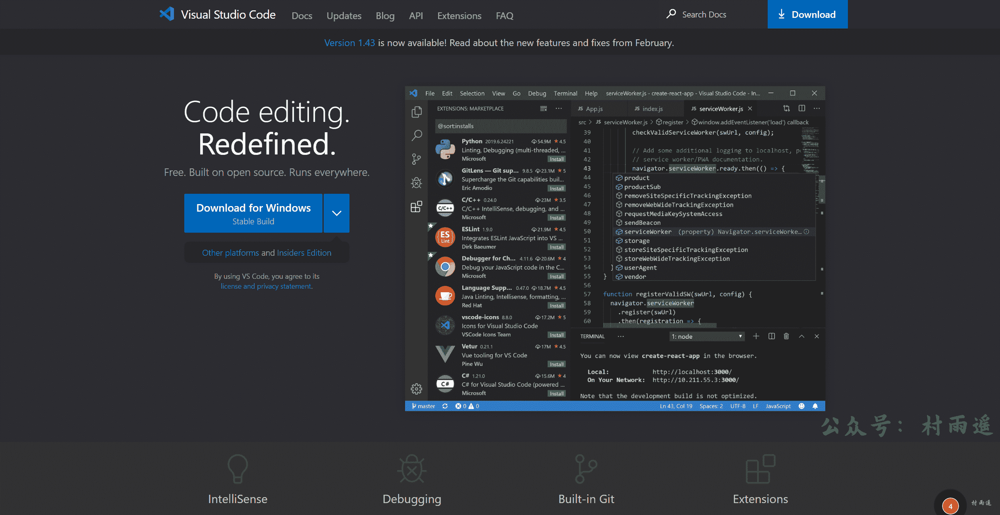

# 如何用 Markdown 写出好看的文章

:::info 共勉
不要哀求，学会争取。若是如此，终有所获。
:::
:::tip 原文
https://mp.weixin.qq.com/s/qIptV_MEGjsUjw_zqvGn_A
:::

## 简介

### 什么是 Markdown

欢迎来到这篇 `Markdown` 语法教程！`Markdown` 是一种轻量级标记语言，很多写作者喜欢使用它来编写文档、博客、笔记等。`Markdown` 语法简单易懂、规范明确，适合快速书写和修改文本。学习 `Markdown` 语法可以帮助作者更好地组织文本结构、添加格式、插入图片等，让文本更加清晰易读。在这篇教程中，我们将一步步地介绍 `Markdown` 的基本语法和应用方法，帮助您更快地了解和掌握这种语言。无论您是初学者还是有经验的用户，都可以从这篇教程中获得新的知识和技能，加强你的学习和写作能力。

### Markdown 的优点

相比于其他格式，`Markdown` 具有以下优点：

- 语法简洁易学，且功能比纯文本强大
- 格式转换方便，兼容性强，可读性极好
- 专注内容写作而不用关注排版样式
- 能导出 `PDF`、`HTML` 等格式的文件
- 迁移、反复编辑不会导致格式错乱

### Markdown 的应用场景

如果你经常逛 `Github`，你会发现大多数项目下边都会有一个 `README.md` 的项目说明文件，而它就是利用 `Markdown` 来进行编写的。而现在的大多数博客平台如 `CSDN`、博客园、掘金等，基本都支持 `Markdown` 格式，如果你有多平台发布文章的需求，那么学会用 `Markdown` 来编写内容未尝不是一个好的方法。

而且就算微信公众号，我们也可以借助第三方工具来进行排版，比起之前用 `Word` 来排版的方式省去了很多麻烦，实现一文多发变得更加容易，不用再去调格式适应不同平台。

## 基本语法

### 标题

在标题书写时不同数量的 `#` 对应不同的标题。一到六级标题如下，每多一级则多加一个`#`号。**注意**：符号和标题内容间的空格不能省略，而且最多支持到六级标题。具体语法格式及实例如下：

-   **语法**

```markdown
不同数量的 # + 空格 + 标题内容
```

-   **实例**

```markdown
# 一级标题

## 二级标题

### 三级标题

#### 四级标题

##### 五级标题

###### 六级标题
```

### 列表

列表又分为 **有序列表** 和 **无序列表**。

1.   **有序列表**

有阿拉伯数字及英文句号 `.` 后加空格后输入内容即可。具体语法格式及实例如下：

-   **语法**

```markdown
阿拉伯数字 + . + 空格 + 内容
```

-   **实例**

```markdown
1. 马刺
2. 湖人
3. 独行侠
```

2.   **无序列表**

在连线符号 `-` 后加空格后输入内容即可，具体格式以及实例如下：

-   **语法**

````markdown
- + 空格 + 内容
````


-   **实例**

```markdown
- Apple
- 华为
- 小米
```

### 粗体

在需要加粗的内容前后分别用两个 `*` 将其包围起来，具体格式以及实例如下：

-   **语法**

```markdown
** + 内容 + **
```

-   **实例**

```markdown
**公众号：村雨遥**
```

### 斜体

和加粗很类似，不过只需要将内容前后分别用一个 `*` 或者 `_` 包围起来即可，具体格式以及实例如下：

-   **语法**

```markdown
* + 内容 + *
_ + 内容 + _
```

-   **实例**

```markdown
*公众号：村雨遥*
_公众号：村雨遥_
```

### 删除线

要给内容加上删除线的效果，只需要在内容前后分别用两个 `~` 将其包围即可，具体格式以及实例如下：

-   **语法**

```markdown
~~ + 内容 + ~~
```

-   **实例**

```markdown
~~ 公众号：村雨遥 ~~
```

### 下划线

Markdown 语法中是不支持下划线的，如果要实现下划线的效果，可以借助 `HTML` 语法，具体格式以及实例如下：

-   **语法**

```html
<u> + 内容 + </u>
```

-   **实例**

```markdown
<u>公众号：村雨遥</u>
```

### 分割线

如果要将不同内容之间插入一条分割线，可以在一行中使用三个及以上减号 `-` 来建立一个分割线，同时需要在分割线的上面空上一行，具体格式以及实例如下：

-   **语法**

```markdown

---
```

-   **实例**

```markdown
公众号：村雨遥

---

个人博客：https://cunyu1943.site
```

### 引用

引用的格式是在大于符号 `>` 后面接上空格以及要引用的内容即可，具体格式以及实例如下：

-   **语法**

```markdown
> + 空格 + 内容
```

-   **实例**

```markdown
> 不要哀求，学会争取。若是如此，终有所获。
```

### 上下标

当我们需要写化学公式或者需要标记上下标时，该怎么办呢？`Markdown` 同样是不支持的，所以仍然需要借助 `HTML` 的相关语法。

-   **语法**

```markdown
1. 上标
<sup> + 内容 + </sup>

2. 下标
<sub> + 内容 + </sub>
```

-   **实例**

```markdown
1. 上标

H<sup>2</sup>O

2. 下标

H<sub>2</sub>O
```

### 高亮

高亮语法在有的 `Markdown` 标准中可能不支持，但在这里也给出其用法，具体格式以及实例如下：

-   **语法**

```markdown
== + 内容 + ==
```

-   **实例**

```markdown
==公众号：村雨遥==
```

### 任务列表

任务列表是我们经常接触到的东西，比如我们的备忘录，完成的事件和未完成事件，要在 `Markdown` 中实现同样效果，具体格式以及实例如下：

-   **语法**

```markdown
已完成：[x] + 内容
未完成：[] + 内容
```

-   **实例**

```markdown
1. 未完成
- [ ] 公众号：村雨遥
- [ ] 个人博客：https://cunyu1943.site

2. 已完成
- [x] 知乎：https://www.zhihu.com/people/cunyu1943
- [x] CSDN：https://blog.csdn.net/github_39655029
```

### 目录

当我们文章写完之后，想要像 `Word` 中那样自动生成目录，此时就可以使用 `[toc]` 单独占一行来实现，但是要注意，有的平台可能不支持该用法，具体格式如下：

-   **语法**

```markdown
[toc]
```

-   **实例**

```markdown
[toc]
```

### 表格

想在 `Markdown` 中使用表格也很方便，我们可以用 `:` 来调整表格对齐的方式，具体格式如下：

```markdown
1. 左对齐

| 平台     | 链接                                   |
| :------- | :------------------------------------- |
| 公众号   | 村雨遥                                 |
| 个人博客 | https://cunyu1943.github.io            |
| 知乎     | https://www.zhihu.com/people/cunyu1943 |

2. 居中对齐

|   平台   |                  链接                  |
| :------: | :------------------------------------: |
|  公众号  |                 村雨遥                 |
| 个人博客 |      https://cunyu1943.github.io       |
|   知乎   | https://www.zhihu.com/people/cunyu1943 |

3. 右对齐

|     平台 |                                   链接 |
| -------: | -------------------------------------: |
|   公众号 |                                 村雨遥 |
| 个人博客 |            https://cunyu1943.github.io |
|     知乎 | https://www.zhihu.com/people/cunyu1943 |
```

### 公式

`Markdown` 支持 `LaTeX` 语法，可以实现行间公式和独立公式块，公式的写法和 `LaTeX` 语法一样，具体格式如下

- 行间公式：`$ + 公式 + $`
- 独立公式块：`$$ + 公式 + $$`

```markdown
1. 行间公式

$x_1+x_2=0$

2. 独立公式块

$$x^2+y^2=0$$
```

### 代码块

同公式一样，代码块同样可以分为行间代码块和独立代码块，其区别在于用一个或多个 \` 将其括起来，具体语法及实例如下：

````markdown
1. 行间代码块

这是一个行间代码：`print("公众号：村雨遥")`

2. 独立代码块

```python
print("公众号：村雨遥")
```
````

### 链接与图片

链接和图片的唯一区别在于图片需要在最前面加上一个 `!`，两个具体格式如下：

- **链接**：`[链接说明](链接 url)`
- **图片**：``
- **实例**

```markdown
1. 链接

[村雨遥](https://cunyu1943.site)

2. 图片


```

## 工具和资源

### Markdown 编辑器

好了，学习了上面的之后，是不是想马上动手试试。既然如此，那就再给大家推荐几款编辑器，让你的效率更上一层楼，`PS`：**多学习快捷键使用，效果更佳哦！**

1. [Typora](https://www.typora.io/)

跨平台多功能编辑器，支持导出 `PDF`、`HTML` 等格式，不过目前已经开始收费，89 软妹币即可永久授权 3 台设备。


2.  [MarkText](https://marktext.app/)

跨平台开源 `Markdown` 编辑器，支持斗图哦！


3.  [Visual Studio Code](https://code.visualstudio.com/)

微软出品，相信这是许多程序员电脑上必装的一个软件了。支持超多插件，需要插件使用效果更佳哦！



### Markdown 插件

说到插件，就不得不推荐下浏览器插件 [Markdown Here](https://markdown-here.com/get.html) 了。

通过该插件，可以用 `Markdown` 来写一封漂亮的电子邮件。通常邮件都是没有格式的，通过该插件，可以实现将 `Markdown` 语法的邮件转换为想要的效果。

而使用步骤也很简单：

1.   在邮件客户端的富文本编辑器中编写 `Markdown` 格式的邮件内容。
2.   接着在编辑区右键后选择 `Markdown 转换` 即可。


### Markdown 在线编辑器和转换器

1.   [Markdown Nice](https://editor.mdnice.com/)

支持自定义样式的 `Markdown` 编辑器，支持微信公众号、知乎和稀土掘金，也是我在日常运营公众号时使用最多的转换器之一了。


2.   [Cmd Markdown](https://www.zybuluo.com/mdeditor)

作业部落出品的在线 `Markdown` 编辑阅读器，支持以下功能：

-   整理知识，学习笔记
-   发布日记，杂文，所见所想
-   撰写发布技术文稿（代码支持）
-   撰写发布学术论文（`LaTeX` 公式支持）


3.   [微信 Markdown 编辑器](https://doocs.gitee.io/md)

`Doocs` 开源社区出品的一款高度简洁的微信 `Markdown` 编辑器。


## 注意事项

1. `Markdown`兼容`HTML`相关语法。
2. 对于特殊字符，可以通过转义字符`\`将其显示出来。

## 总结

总而言之，`Markdown` 是一种非常实用的文档编辑和网页写作语言，在多种不同的场景中都有着广泛的应用。希望本教程能够帮助初学者快速掌握 `Markdown` 的基本语法，并在实用中不断深化自己的理解。如果你有任何问题或建议，欢迎给我们留言并共同探讨。让我们一起更好地运用 `Markdown`，让文档编辑和网页写作更加高效流畅！