# 手把手玩转 Ubuntu 配置

# 前言

我们在工作或学习过程中，有许多时候会接触到 Linux，然后便想要自己亲自试试这个系统，但苦于没有系统学习过，所以想要打造自己的工作环境难免会遇到许多困难。为了防止大家踩我踩过的坑，才有了这篇博客。本博客将主要从 **系统设置、常用软件安装、开发环境搭建、系统美化** 几个方面着手，手把手教你如何从零打造自己的 Ubuntu 工作环境。

先展示下我自己的工作环境：

- 桌面


- 程序坞

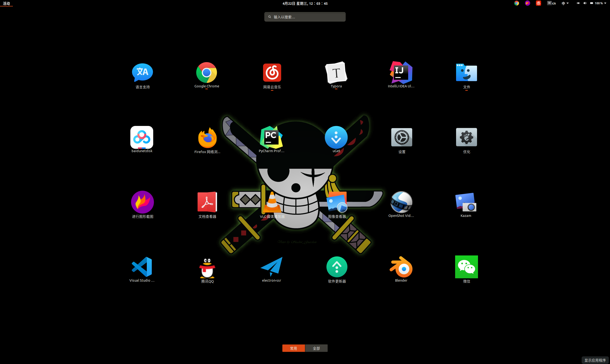

- 文件

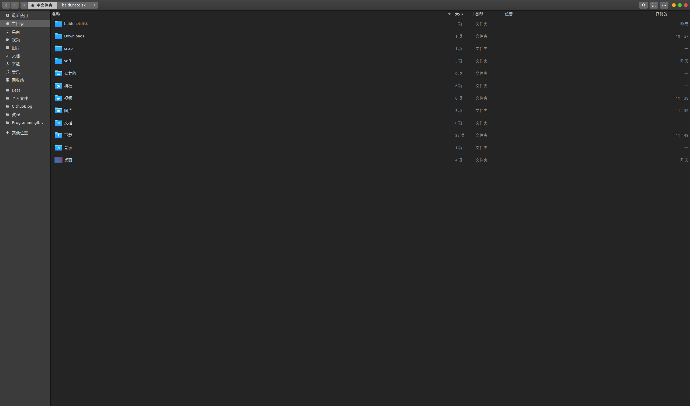

# 系统设置

## 换镜像源

即将官方自带的源换成国内镜像源，如阿里、华为、网易等；

打开 **软件和更新** ，然后选择下载自 **其他站点**，选择你要设置的镜像源站点即可，也可以点击右侧选择最佳服务器，会根据你所处地区然后自动选择网速最快的；


## 安装更新

换源之后，执行如下命令用于更新系统；

```shell
sudo apt update
sudo apt-get  upgrade
```

## 使用本地时区

使用双系统时，往往两者时间会不正确，可以通过如下命令让 Ubuntu 使用本地时区；

```shell
timedatectl set-local-rtc 1
```

## 卸载自带的“无用”软件

此处说的“无用”软件，因人而异，笔者只是提供建议，建议卸载软件列表如下（可能还有些没咋用的没列出，读者可以自行决定是否卸载，卸载之后如果有用到，还可以重新安装）；

- thunderbird 自带邮件
- rhythmbox 音乐
- gnome-mahjongg 对对碰游戏
- gnome-mines 扫雷
- gnome-sudoku 数独
- aisleriot 纸牌
- simple-scan 扫描器
- onboard 屏幕键盘
- brasero 光盘可怜工具
- cheese 茄子相机
- libreoffice 套件，用 WPS 代替

# 常用软件安装

## 输入法

- 搜狗输入法 for Linux

软件由搜狗输入法团队和 Ubuntu Kylin 团队共同开发，能够满足我们日常输入需求；

- 安装

此处推荐下载安装包后安装，[下载地址](https://pinyin.sogou.com/linux/?r=pinyin)，下载后的安装包如下；

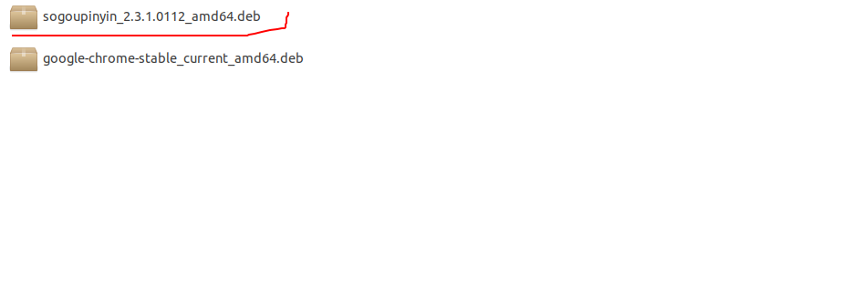

然后在当前文件夹下打开终端，输入如下命令安装即可；

```shell
sudo dpkg -i sogoupinyin_2.3.1.0112_amd64.deb 
```


接着到 **设置 - &gt; 区域和语言** 点击已安装的语言；


把键盘输入法设置为 **fcitx**，然后应用到整个系统即可，然后注销或者重启即可使用；


- 注意

当安装时，可能会报依赖相关问题，可以在执行上述命令后，在终端中输入如下命令修复依赖安装，然后再次执行上面的安装命令即可；

```shell
sudo apt-get --fix-broken install
```

## 浏览器

- Chrome
    说到浏览器，虽然 Ubuntu 中预装了 Firefox，但笔者更习惯用 Chrome ，作为全球范围内份额最高的浏览器，自然不用说啥，其实微软新出的 Edge 浏览器也很不错，只是目前还没有支持 Linux，后续可能会进一步支持。

- 安装

建议使用 deb 安装包安装，先 [下载](https://www.google.cn/intl/zh-CN/chrome/) 安装包，然后在本地终端使用如下命令进行安装；

```shell
sudo dpkg -i google-chrome-stable_current_amd64.deb 
```

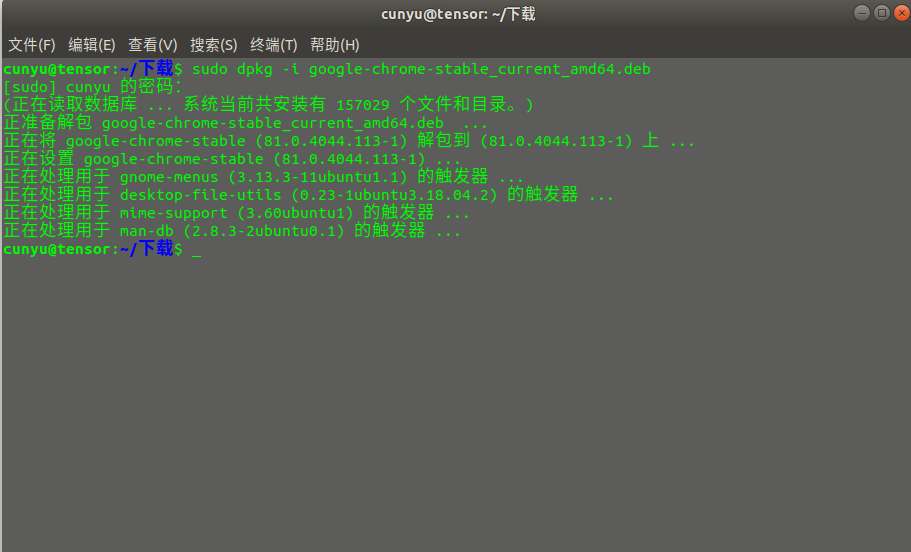

- 成品


## QQ

去官网 [下载](https://im.qq.com/linuxqq/download.html) 对应安装包，然后在终端使用如下命令安装；

```shell
sudo dpkg -i linuxqq_2.0.0-b2-1082_amd64.deb
```


- 成品


## 微信

- 安装

此处推荐使用网页版即可，wine 版虽然网上也有，但有许多 bug，所以推荐使用网页版；

- 创建快捷方式

打开网页版微信，然后打开浏览器设置中的 **更多工具 -&gt; 创建快捷方式** 即可，然后在桌面就会出现快捷方式，信任即可；


- 成品

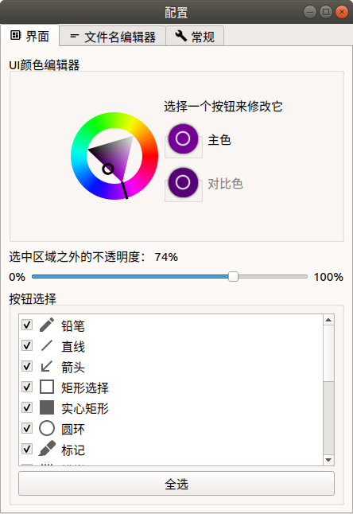

## 音乐播放器

- 网易云音乐

作为网易旗下的音乐软件，虽然版权问题流失了许多用户，但不影响它越来越受广大用户喜欢。而我们在学习工作之余听听音乐，放松下调整状体也是极好的。

- 安装

[下载](https://music.163.com/#/download) Linux 版本安装包，然后使用如下命令在终端中安装即可；

```shell
sudo dpkg -i netease-cloud-music_1.2.1_amd64_ubuntu_20190428.deb
```

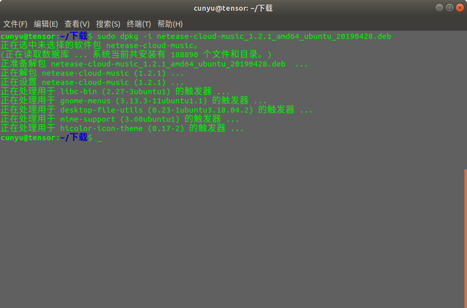

- 成品


## 截图工具

- flameshot
    flameshot，能够用于标注、模糊，同时还支持上传到 imgur 图床的新式截图工具；
- 安装

```shell
sudo apt install flameshot
```


- 设置快捷键

依次进入 **设置 -&gt; 设备 -&gt; 键盘** ，然后滑到最底端会有一个 `+` 按钮，点击 `+` 添加自定义快捷键，并设置名称和命令，然后点击右上角添加就可以设置自己想要的截图快捷键，比如我设置的是 `Ctrl + Alt + A`，如下图所示；

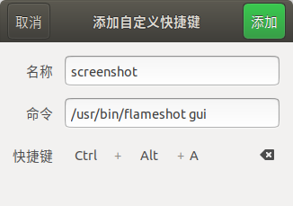

- 成品


## 图片编辑器

- Gimp

GIMP是 GNU Image Manipulation Program（GNU图像处理程序）的缩写，它是 Peter Mattis 和 Spencer Kimhall 开发的免费照片和图像处理和创作工具，功能十分强大。支持多种图像处理工具、全通道、多级撤销操作恢复旧貌与映像修饰等功能。支持数目众多的效果插件（plug-ins），完全可以与 Windows 平台下著名的图像处理软件 Photoshop 媲美；

- 安装

直接使用如下命令安装即可；

```shell
sudo apt-get install gimp
```


- 成品


## 文字处理

- WPS

Ubuntu 中自带了 LibreOffice 办公套件，但此处更推荐使用 WPS，更加符合我们国人的使用习惯。

- 安装

先下载安装包，然后依然在本地终端使用如下命令进行安装；

```shell
sudo dpkg -i wps-office_11.1.0.9505_amd64.deb
```

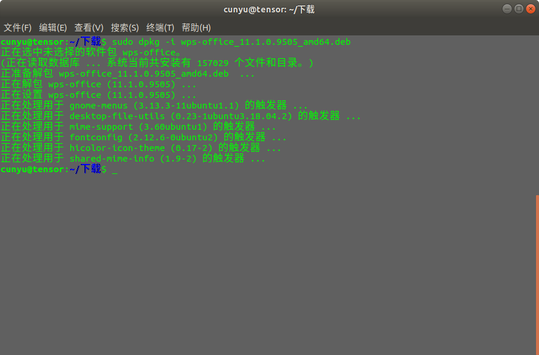

- 成品

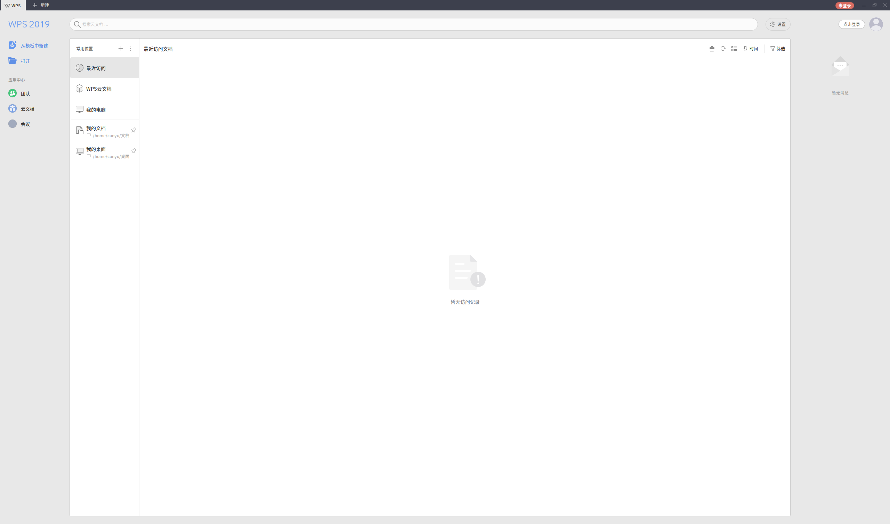

## Markdown 编辑器

- Typora

作为一款极简的 Markdown 编辑器，合并了写作和预览。支持表格、代码编辑，拖拽插图等，非常好用；喜欢它的原因也就是：美观、免费，而且跨平台；

- 安装

依次使用如下命令即可安装；

```shell
wget -qO - https://typora.io/linux/public-key.asc | sudo apt-key add -

sudo add-apt-repository &#39;deb https://typora.io/linux ./&#39;

sudo apt-get update

sudo apt-get install typora
```


-   成品

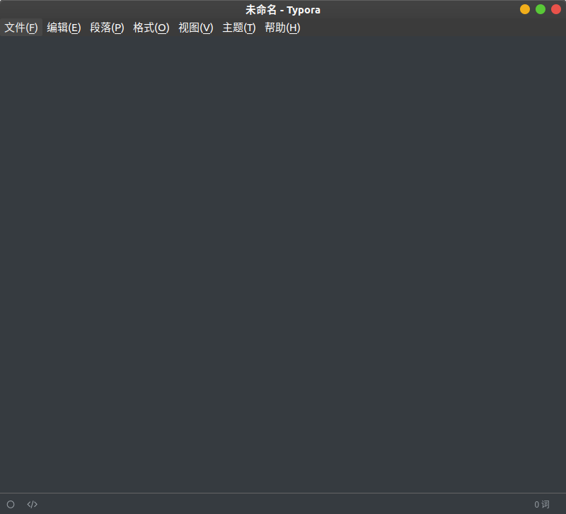

## 文档阅读器

- Okular

可以说是 Linux 中最好的 PDF 阅读器，而且还支持常用的 CHM、EPub 等格式文档的查看；

- 安装

直接在终端中使用如下命令安装即可；

```shell
sudo apt-get install okular
```

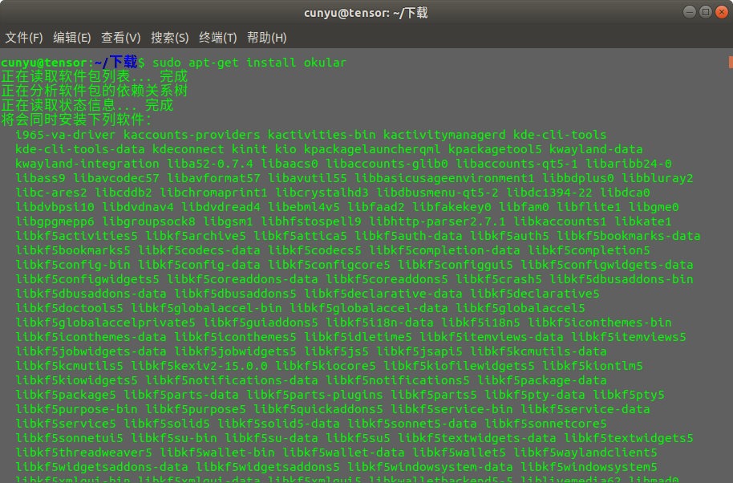

- 成品

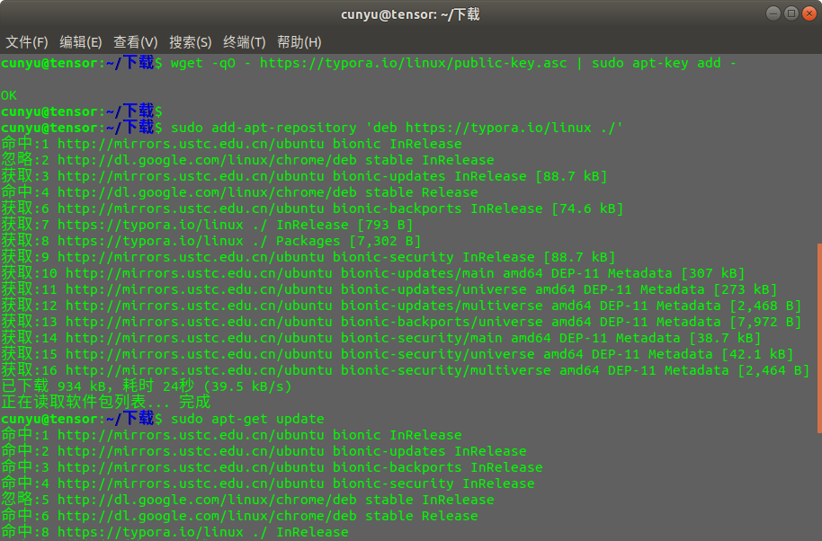

## 思维导图

- XMind

做事或者写作之前，都喜欢先做一个总体的思维导图，然后根据思维导图去细化每一部分，而 XMind 正是这么一款工具；

- 安装

去 [下载](https://www.xmind.cn/download/) 安装包之后，在终端中使用如下命令行安装即可；

```shell
sudo dpkg -i XMind-2020-for-Linux-amd-64bit-10.1.2-202004142327.deb 
```

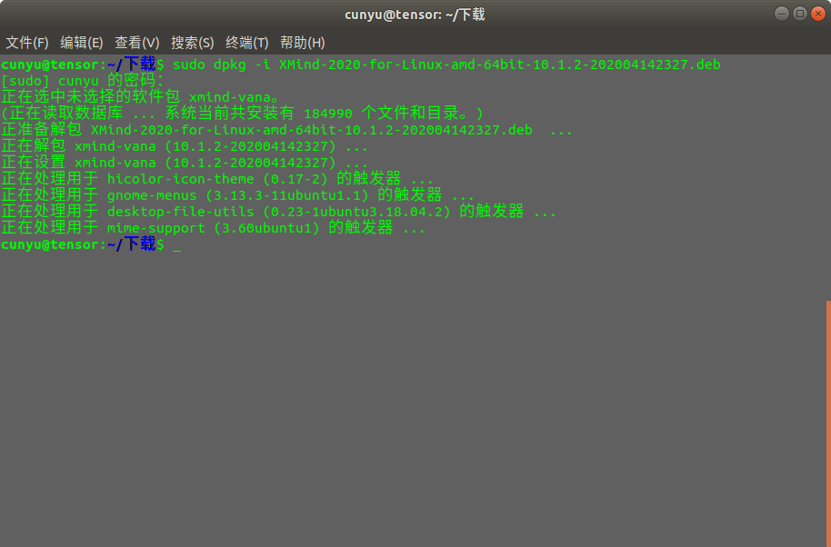

- 成品
    

## 多媒体播放器

- VLC

支持众多音频与视频解码器及文件格式，并支持 DVD 影音光盘，VCD 影音光盘及各类流式协议。也能作为 unicast 或 multicast 的流式服务器在 IPv4 或 IPv6 的高速网络连接下使用。融合了 FFmpeg 计划的解码器与 libdvdcss 程序库使其有播放多媒体文件及加密 DVD 影碟的功能，是 Linux 中多媒体播放器的不二之选；

- 安装

直接在终端中使用如下命令安装即可；

```shell
sudo snap install vlc
```


- 成品


## 录屏软件

-   Kazam

小巧而强大，易安装，即可选择区域录制，也可选择全屏录制，同时还兼具截图功能；

-   安装

直接在终端中使用如下命令安装即可：

```shell
sudo apt install kazam
```


-   成品


## 视频编辑软件

-   OpenShot

OpenShot 是 Linux 上的一个多用途视频编辑器，可以帮助你创建具有过渡和效果的视频。

-   安装

直接在终端中使用如下命令安装即可；

```shell
sudo apt install openshot
```

-   成品

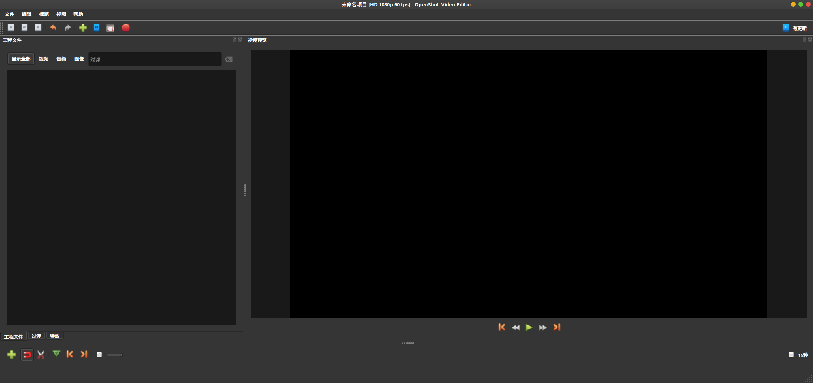

## 下载工具

- uGet

Uget（原名：Urlgfe）是一个基于 GTK+ 编写的自由和开放源码的下载管理器 ，跨平台（Windows和GNU / Linux的），支持断点续传和分类下载 ，uGet 同时 具备 多线程下载能力；

- 安装

```shell
sudo apt-get install uget
```

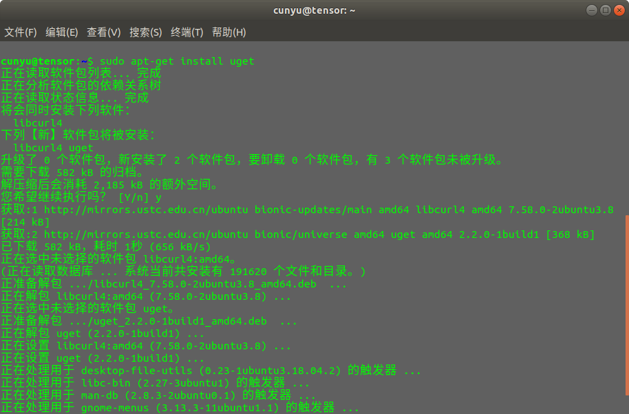

- 成品

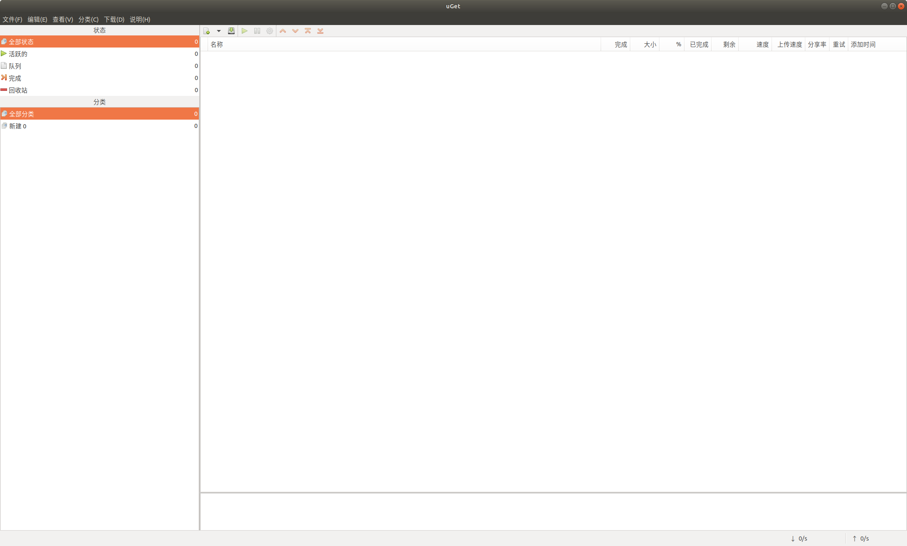

# 开发环境搭建

## git 安装

直接在终端中使用如下命令安装即可；

```shell
sudo apt install git
```


## Node.js 安装

- 安装

从淘宝镜像源 [下载](https://npm.taobao.org/mirrors/node/) 对应版本压缩包，然后解压到你要存储的路径，比如我的是 `/home/cunyu/soft/node-v12.16.2`；

- 配置

安装（解压）好后，在 `/etc/profile` 配置文件中配置；

```profile
export NODEJS_HOME=/home/cunyu/soft/node-v12.16.2
export PATH=$NODEJS_HOEM:$PATH
```

- 换淘宝镜像源

```shell
npm config set registry http://registry.npm.taobao.org/
```

- 验证

```shell
node -v
npm -v
```


## JDK 安装

- 安装

先去 [下载](https://www.oracle.com/java/technologies/javase-downloads.html) 要安装的 JDK 版本，然后解压到本地，移到你要存放的位置；

```shell
tar -zxvf jdk-11.0.7_linux-x64_bin.tar.gz 
```


- 配置

打开配置文件 `/etc/profile`，然后加入如下内容；

```profile
export JAVA_HOME=/home/cunyu/Soft/jdk11.0.7
export PATH=$JAVA_HOME:$PATH
```


- 验证

安装和配置之后，在终端中输入如下命令进行验证是否成功；

```shell
# 查看版本
java -version
# 编译
java
# 执行
javac
```


## MiniConda 安装

- 安装

直接去 [下载](https://docs.conda.io/en/latest/miniconda.html) 对应版本安装包，此处以 3.7 版本为例，然后在终端中对齐赋予执行权限后执行；

```shell
chmod +x Miniconda3-latest-Linux-x86_64.sh 

sh Miniconda3-latest-Linux-x86_64.sh 
```

执行后会让你阅读相关权限，然后输入 yes 同意，然后会让你指定安装目录，默认就直接回车就好，最后等安装好即可；

- 配置

打开 `~/.bashrc` 文件，在其中加入如下 内容；

```
# 注意输入你自己安装 miniConda 的目录
export  PATH="/home/cunyu/miniconda3/bin:"$PATH
```

- 验证


## MySQL 安装

- 安装

```shell
sudo apt-get install mysql-server
```

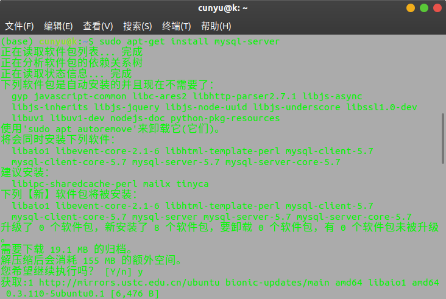

- 设置 root 用户密码

上述安装过程结束后，直接登录，此时 root 用户没有设密码，需要输入密码时直接回车；

```shell
myslq -u root -p
```

登录后，使用如下命令来修改 root 用户密码，退出后再次登录输入你修改的密码即可；

```shell
SET PASSWORD FOR &#39;root&#39;@&#39;localhost&#39; = PASSWORD(&#39;你要设置的密码&#39;);
```

## VS Code 安装

- 安装

直接去 [下载](https://code.visualstudio.com/) 对应安装包，然后在终端使用如下命令安装；

```shell
sudo dpkg -i code_1.44.2-1587059832_amd64.deb
```

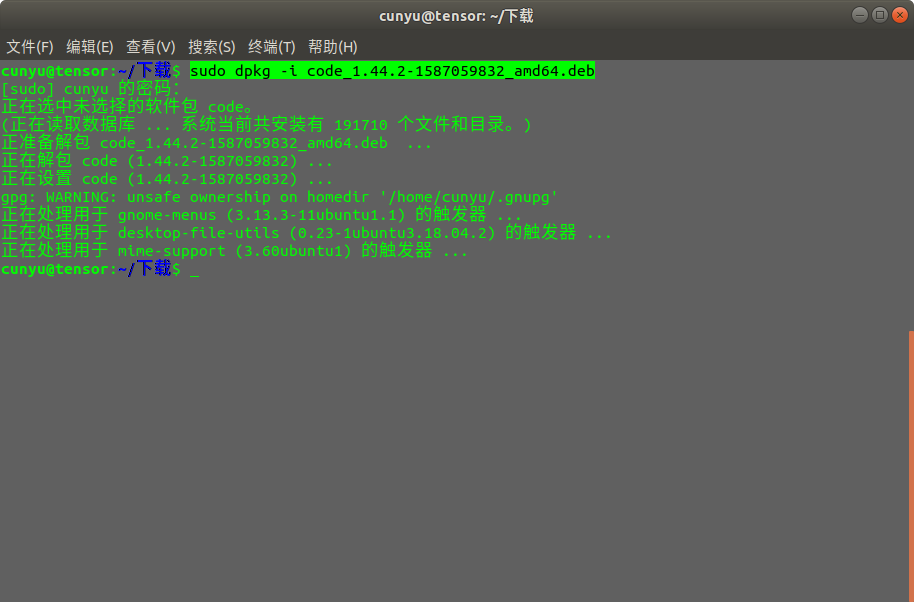

- 成品

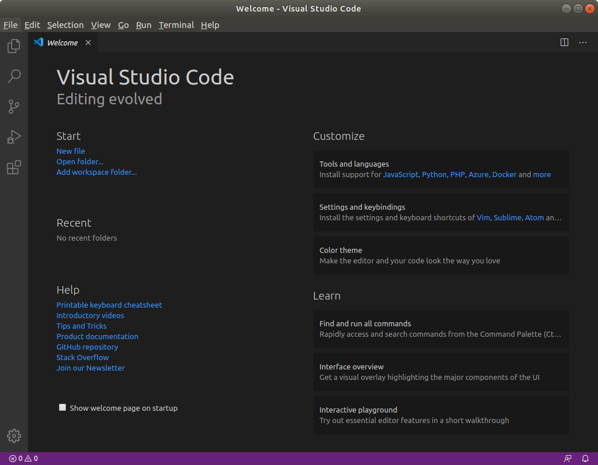

## IntelliJ IDEA 安装

- 安装

从官网 [下载](https://www.jetbrains.com/idea/download/#section=linux)
 对应安装包，然后将其解压；

```shell
tar -zxvf ideaIU-2020.1.tar.gz 
```

进入 **IDEA/bin** 目录下，执行 `idea.sh` 即可；

- 生成快捷方式

打开 IDEA 后，进入 **Configure -&gt; Create Desktop Entry**，然后输入 root 用户密码即可；


## Pycharm 安装

- 安装

从官网 [下载](https://www.jetbrains.com/pycharm/download/#section=linux) 对应安装包，然后将其解压；

```shell
tar -zxvf pycharm-professional-2020.1.tar.gz 
```

进入 **Pycharm/bin** 目录下，执行 `pycharm.sh` 即可；

- 生成快捷方式

打开 Pycharm 后，进入 **Configure -&gt; Create Desktop Entry**，然后输入 root 用户密码即可；

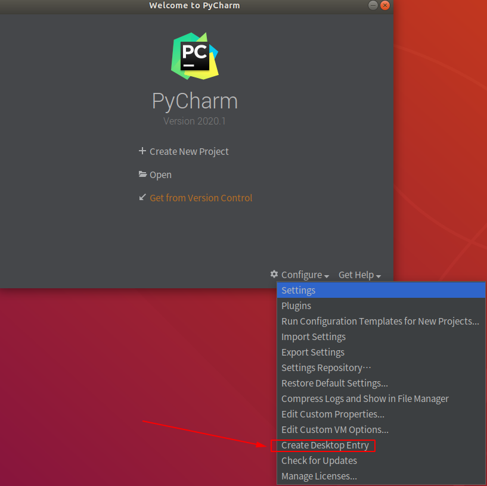

# 系统美化

## Grub 美化

- 对于安装双系统或多系统的读者，想要自己的启动页面变得好看一点，那么你一定不能错过。

到 [这里](https://www.gnome-look.org/browse/cat/109/ord/latest/) 去选择自己喜欢的主题，然后进行安装，这里笔者选择的是 [Grub-theme-vimix](https://github.com/vinceliuice/grub2-themes)；

- 安装

把 Grub-theme-vimix 克隆到本地，然后使用如下命令进行安装即可；

```shell
sudo ./install.sh -t -2 -b
```

## 锁屏界面美化

直接修改相关配置文件：`/etc/alternatives/gdm3.css` ，然后修改代码中的 `#lockDialogGroup` 部分如下即可；

```
#lockDialogGroup {
  background: #2c001e       
  url(file:///home/cunyu/imgs/lock.png);
  background-size: cover;
  background-repeat: no-repeat;
  background-position: center;
}
```

## 美化工具安装

美化之前，需要安装 gnome-tweak-tool，安装命令如下；

```shell
sudo apt-get install gnome-tweak-tool
```


## 主题安装

- 下载

推荐使用这套，macos 风格的主题，[下载链接](https://www.gnome-look.org/p/1275087/)；

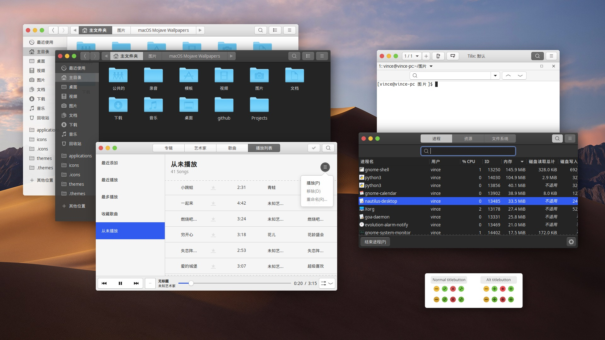

- 安装

把下载好的压缩包解压之后，移动到 `/usr/share/themes` 目录下即可；

## 图标安装

- 下载

推荐这款图标，[下载链接](https://github.com/keeferrourke/la-capitaine-icon-theme)；


- 安装

把下载好的压缩包解压之后，移动到 `/usr/share/icons` 目录下即可；

## 终端安装

- 安装

Ubuntu 自带终端已经很强大，但我更推荐使用 ZSH；

在终端中使用如下命令安装即可；

```shell
sudo apt install zsh
```


- 设为默认 Shell

```shell
chsh -s /usr/bin/zsh
```

-   美化

安装 [oh-my-zsh](https://github.com/robbyrussell/oh-my-zsh)，通过如下任一命令安装；

```shell
# via crul
sh -c "$(curl -fsSL https://raw.githubusercontent.com/ohmyzsh/ohmyzsh/master/tools/install.sh)"
# via wget
sh -c "$(wget -O- https://raw.githubusercontent.com/ohmyzsh/ohmyzsh/master/tools/install.sh)"
```

也可以通过如下命令安装；

```shell
git clone git://github.com/robbyrussell/oh-my-zsh.git  ~/.oh-my-zsh
cp ~/.oh-my-zsh/templates/zshrc.zsh-template ~/.zshrc
```

安装好之后，对 zsh 进行配置，打开 `~/.zshrc` 配置文件，进行配置；

进入 [主题列表](https://github.com/ohmyzsh/ohmyzsh/wiki/Themes)，挑选自己喜欢的主题，然后在上述配置中改成你喜欢的主题，比如我的配置文件如下；

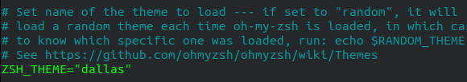

```.bashrc
# If you come from bash you might have to change your $PATH.
# export PATH=$HOME/bin:/usr/local/bin:$PATH

# Path to your oh-my-zsh installation.
export ZSH=$HOME/.oh-my-zsh

# Set name of the theme to load --- if set to "random", it will
# load a random theme each time oh-my-zsh is loaded, in which case,
# to know which specific one was loaded, run: echo $RANDOM_THEME
# See https://github.com/ohmyzsh/ohmyzsh/wiki/Themes
# 主题
ZSH_THEME="dallas"

# Set list of themes to pick from when loading at random
# Setting this variable when ZSH_THEME=random will cause zsh to load
# a theme from this variable instead of looking in ~/.oh-my-zsh/themes/
# If set to an empty array, this variable will have no effect.
# ZSH_THEME_RANDOM_CANDIDATES=( "robbyrussell" "agnoster" )

# Uncomment the following line to use case-sensitive completion.
# CASE_SENSITIVE="true"

# Uncomment the following line to use hyphen-insensitive completion.
# Case-sensitive completion must be off. _ and - will be interchangeable.
# HYPHEN_INSENSITIVE="true"

# Uncomment the following line to disable bi-weekly auto-update checks.
# DISABLE_AUTO_UPDATE="true"

# Uncomment the following line to automatically update without prompting.
# DISABLE_UPDATE_PROMPT="true"

# Uncomment the following line to change how often to auto-update (in days).
# 每次更新的时间
export UPDATE_ZSH_DAYS=30

# Uncomment the following line if pasting URLs and other text is messed up.
# DISABLE_MAGIC_FUNCTIONS=true

# Uncomment the following line to disable colors in ls.
# DISABLE_LS_COLORS="true"

# Uncomment the following line to disable auto-setting terminal title.
# DISABLE_AUTO_TITLE="true"

# Uncomment the following line to enable command auto-correction.
# ENABLE_CORRECTION="true"

# Uncomment the following line to display red dots whilst waiting for completion.
# COMPLETION_WAITING_DOTS="true"

# Uncomment the following line if you want to disable marking untracked files
# under VCS as dirty. This makes repository status check for large repositories
# much, much faster.
# DISABLE_UNTRACKED_FILES_DIRTY="true"

# Uncomment the following line if you want to change the command execution time
# stamp shown in the history command output.
# You can set one of the optional three formats:
# "mm/dd/yyyy"|"dd.mm.yyyy"|"yyyy-mm-dd"
# or set a custom format using the strftime function format specifications,
# see 'man strftime' for details.
# HIST_STAMPS="mm/dd/yyyy"

# Would you like to use another custom folder than $ZSH/custom?
# ZSH_CUSTOM=/path/to/new-custom-folder

# Which plugins would you like to load?
# Standard plugins can be found in ~/.oh-my-zsh/plugins/*
# Custom plugins may be added to ~/.oh-my-zsh/custom/plugins/
# Example format: plugins=(rails git textmate ruby lighthouse)
# Add wisely, as too many plugins slow down shell startup.

# 插件
# git

# zsh-syntax-highlighting 输入正确会绿色高亮显示，输入错误会显示其他的颜色
# git clone https://github.com/zsh-users/zsh-syntax-highlighting.git ~/.oh-my-zsh

# zsh-autosuggestions 自动建议补全
git clone git://github.com/zsh-users/zsh-autosuggestions ~/.oh-my-zsh

# extra 解压
# z
plugins=(
    git zsh-syntax-highlighting zsh-autosuggestions extract z
)

source $ZSH/oh-my-zsh.sh

# User configuration

# export MANPATH="/usr/local/man:$MANPATH"

# You may need to manually set your language environment
# export LANG=en_US.UTF-8

# Preferred editor for local and remote sessions
# if [[ -n $SSH_CONNECTION ]]; then
#   export EDITOR='vim'
# else
#   export EDITOR='mvim'
# fi

# Compilation flags
# export ARCHFLAGS="-arch x86_64"

# Set personal aliases, overriding those provided by oh-my-zsh libs,
# plugins, and themes. Aliases can be placed here, though oh-my-zsh
# users are encouraged to define aliases within the ZSH_CUSTOM folder.
# For a full list of active aliases, run `alias`.
#
# Example aliases
# alias zshconfig="mate ~/.zshrc"
# alias ohmyzsh="mate ~/.oh-my-zsh"
```
## 总结
好了，文章的内容到此就结束了。我主要从系统设置、常用软件安装、开发环境搭建、系统美化四个方面介绍了自己如何配置并使用 Ubuntu 的，希望也给你带来一定的帮助！如果你有更多好玩的技巧，欢迎留言交流！