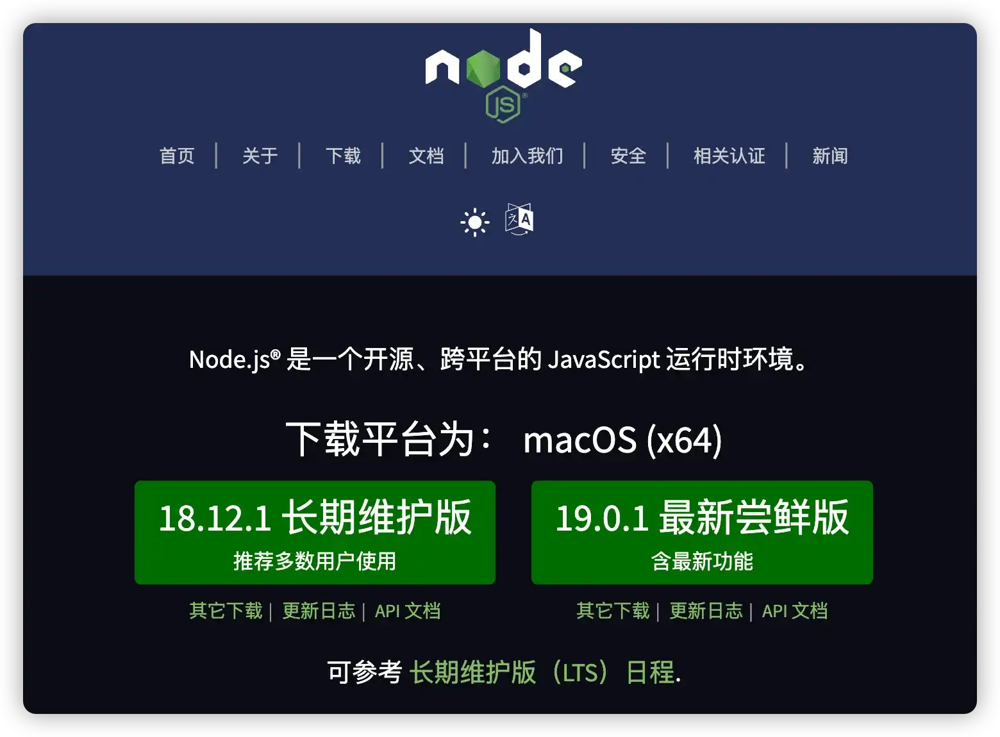
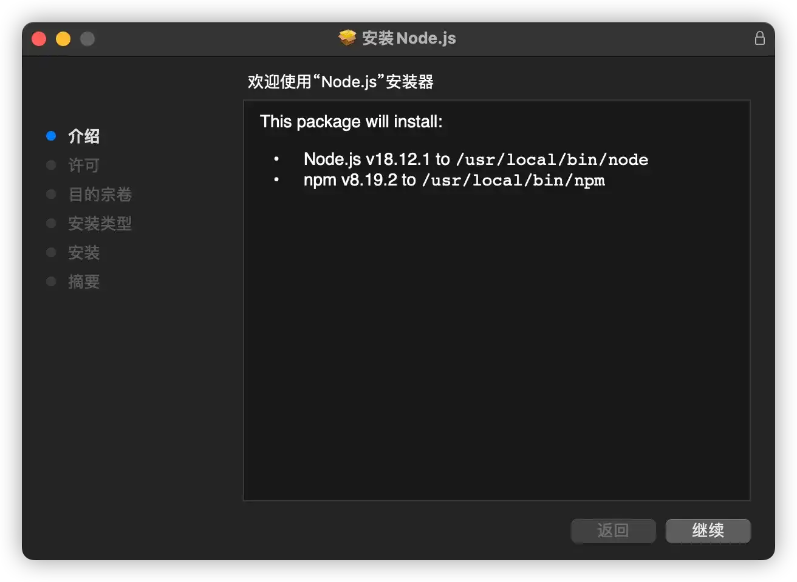
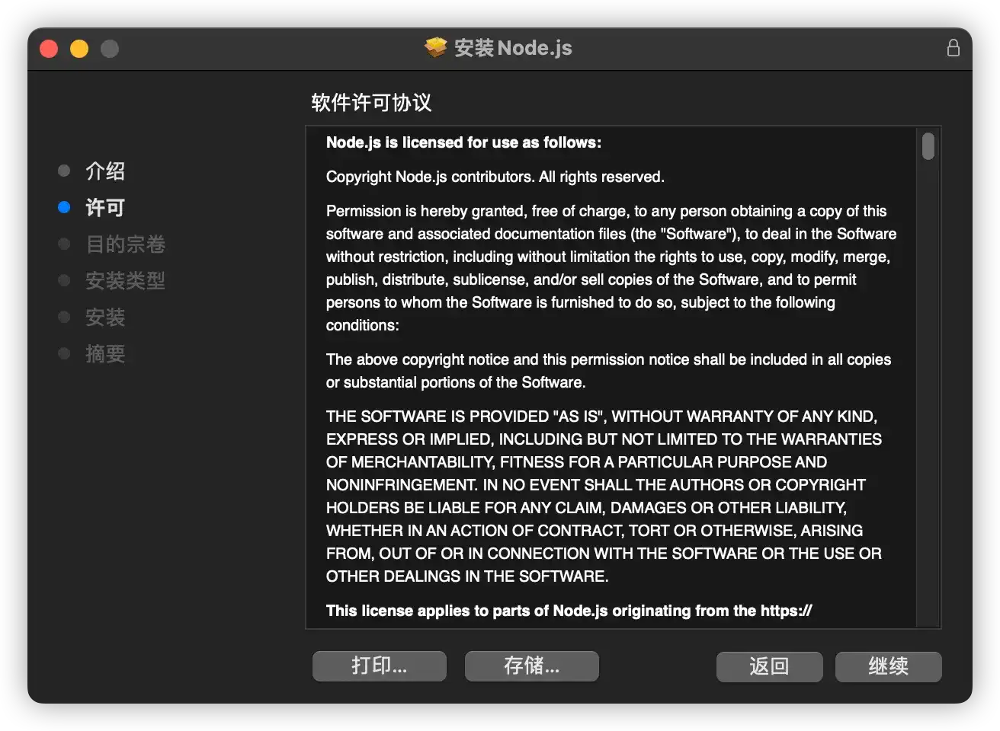
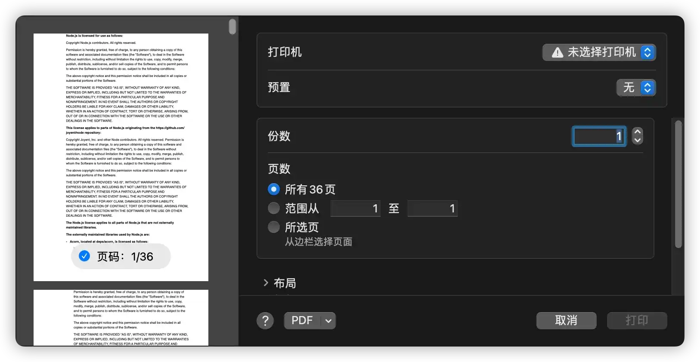
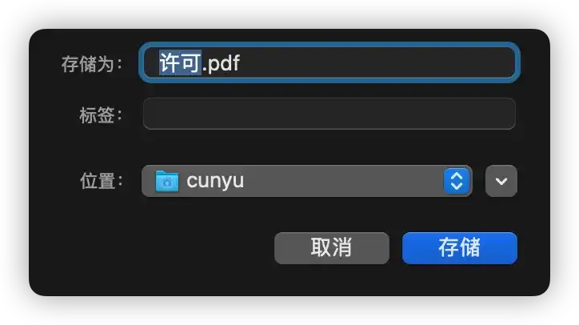
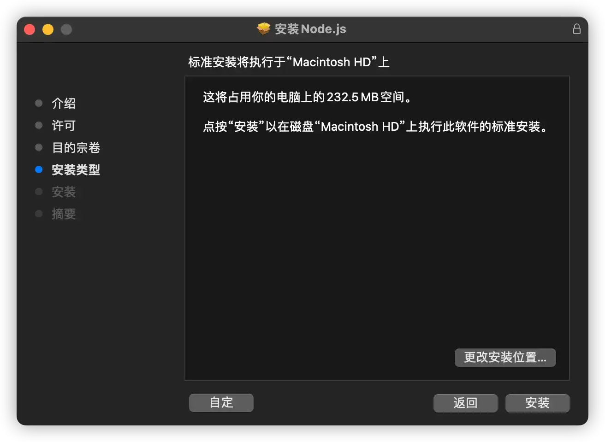
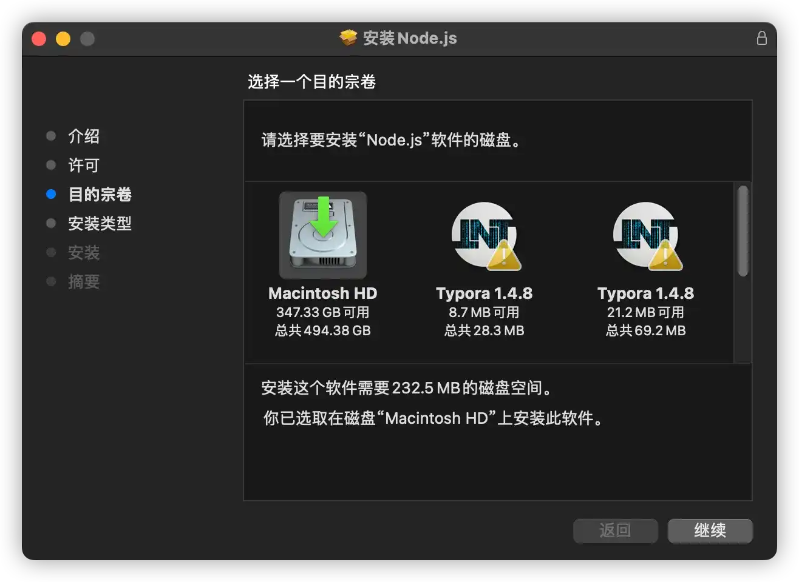
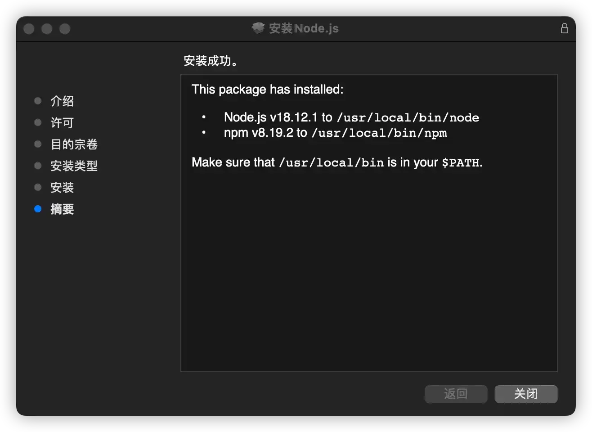

# macOS 中安装 Node.js

## 什么是 Node.js

`Node.js` 是一个基于 `Chrome V8` 引擎的 `JavaScript` 运行时环境。最早发布于 2009 年 5 月，由 `Ryan Dahl` 开发。它使用了一个事件驱动、非阻塞式 `I/O` 模型，让 `JavaScript` 运行在服务端的开发平台，能让 `JavaScript` 成为 `PHP`、`Python`、`Perl`、`Ruby` 等服务端语言的脚本语言。

## 下载 Node.js

> - [下载地址](https://nodejs.org/zh-cn/)

其中 `LTS` 表示长期维护版本，也更加推荐安装这个版本。

## 安装

1. 下载好安装包之后，双击后缀名为 `.pkg` 的安装包，会弹出以下的弹窗。弹窗中会提示欢迎语，然后提示 `Node.js` 和 `npm` 会安装到硬盘中的地址。

- `Node.js`：安装在硬盘中的 `/usr/local/bin/node` 目录。

- `npm`：安装在硬盘中的 `/usr/local/bin/npm` 目录。

这里注意和 `Windows` 区分一下，因为 `macOS` 是基于 `Unix` 开发而来的，所以它的目录结构和 `Linux` 类似，是在总的根目录 `/` 下存在子目录。

2. 点击**继续**，会提示软件的相关许可协议。

- 如果点击**打印**，而你的电脑也连接了打印机，那么这时候就能够将协议打印出来。

- 如果点击**存储**，此时会将协议保存为 `pdf`，由自己选择存放的路径。

3. 再次点击继续，会弹窗提示必须同意相关协议条款才能走下一步。

4. 选择软件安装的目的盘，一般来讲，`macOS` 中没有什么盘之分的，但如果你外接了硬盘，而你需要安装的软件也刚好要放在外接盘中，那么此时就可以选择另一个硬盘。

5. 下一步，此时会提示让输入电脑的密码来开始安装。

6. 安装成功，关闭安装窗口即可。

## 总结
以上就是在 `macOS` 中安装 `Node.js` 的具体详细步骤，如果你还有任何的疑惑，欢迎在评论区留言或者私信我。当然，如果该教程对你有所帮助，那就给我点个赞再走吧。