# 如何压缩截图同时添加水印

:::info
不要哀求，学会争取。若是如此，终有所获。
:::
:::tip
原文：
:::

## 一、前言

想必看过我文章的小伙伴都发现了，大部分我文章里的图片都添加了水印。同时，我还把文章都同步到了利用 `Github/Gitee Pages` 搭建的博客里。如果还没访问过，那还不赶紧去加入收藏夹 👇：

>   https://cunyu1943.github.io
>
>   https://cunyu1943.gitee.io

不过有个问题，`Github/Gitee Pages` 公共仓库都有容量限制的问题。虽说只是文字占不了多少存储，但是文章里的图片可是消耗了不少的空间。为了尽量避免满仓，我都把文章里的图片压缩成了 `.webp` 格式，从一定程度上缓解了容量焦虑。

屏幕前的你是不是很疑惑，把图片加水印同时压缩体积，我是怎么做到的呢？工作量是不是很大呢？

其实不然，文章里的图片大多都是截的图，所以完成水印添加和压缩的操作其实主要就借助了一款截图软件。

下面，就来介绍下这款强大的软件，以及如何利用它来截图的同时来添加水印并压缩为 `.webp` 格式。

## 二、软件安装

首先，当然是要安装今天文章的主角，开源强大的截图软件 - `ShareX`。

不过各位看官老爷需要注意，该软件目前仅支持 `Windows`，所以如果是使用 `macOS` 系统的朋友就得另寻他法了（这也是为啥我文章里的图有的有水印，有的没水印 😂）。

>   ⛩️ 下载地址：https://getsharex.com/

下载完成后，就是 `Windows` 中最简单的下一步下一步点就完事了。不过考虑到不同的需求，这里还是给大家更加详细点的教程。

第一步：去官网下载安装包。

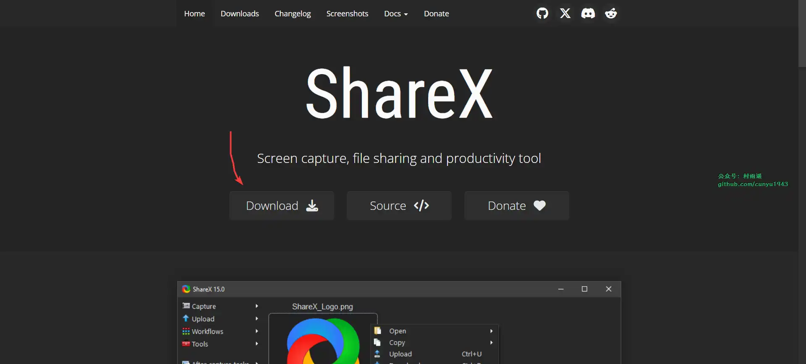

第二步：双击下载后的安装包，同意相关协议。

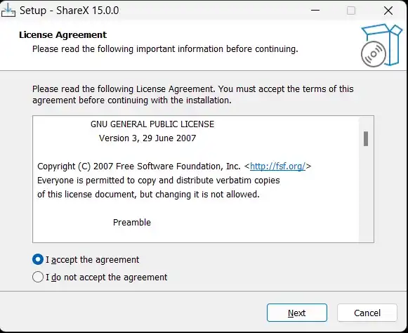

第三步：根据自己需要选择是否要创建快捷方式、集成文件管理器的右键上下文菜单、是否开机自启动。

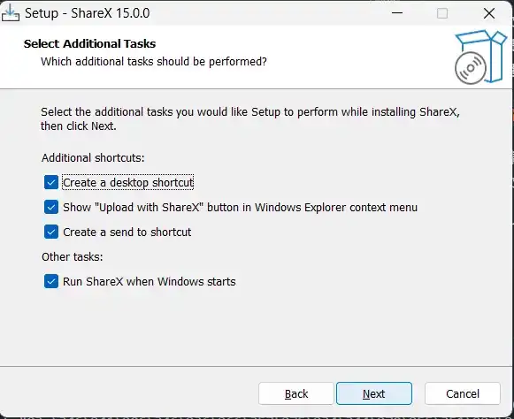

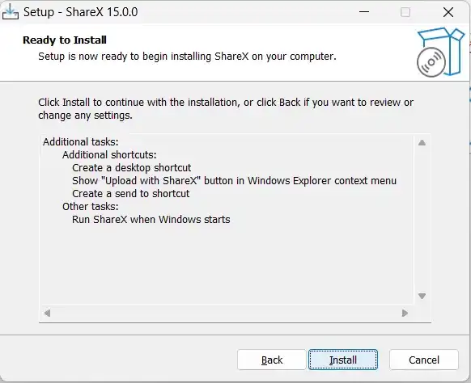

第四步：等待安装过程跑完，直到最后安装完成启动即可。

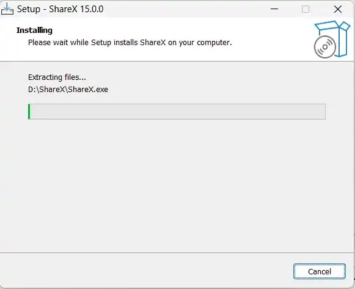

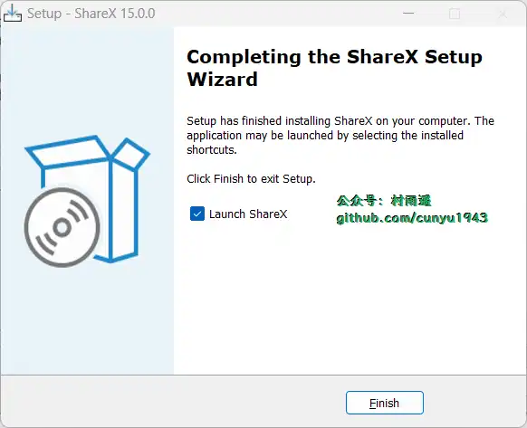

## 三、添加水印

安装完成后，最简单的截图功能就有了。`ShareX` 支持多种截图方式，还能录制 `gif` 和视频，可谓是六边形战士了。

接下来，我们就先来看看，如何在截图的同时添加水印。

第一步：打开 `ShareX` 的 **动作设置**，然后依次点击 **图像 -> 特效 -> 图像特像配置**。

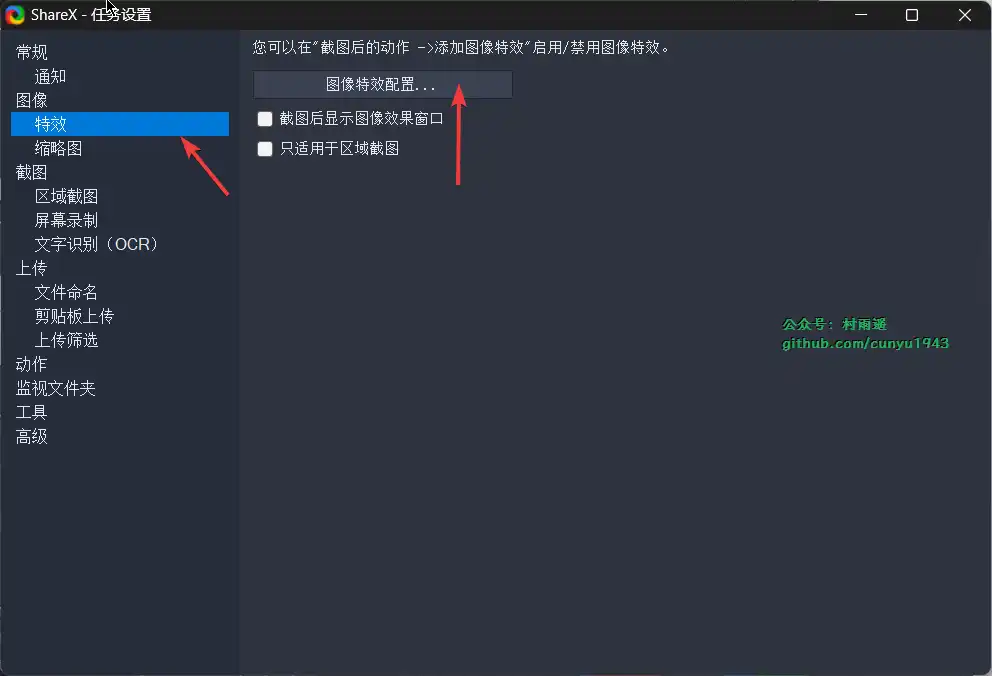

第二步：点击预设下的绿色 `+`，接着点击效果下的绿色 `+`，选择绘图下的 `Text watermark`，然后设置你的水印相关参数就可以了。

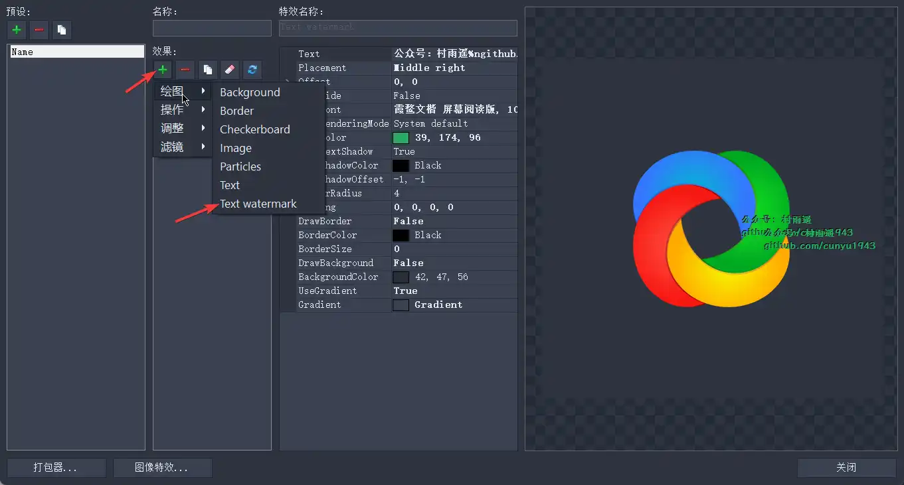

新增文本水印参数时，注意下水印的几个关键参数，其他的参数可以根据自己的需要进行自行调整。

-   `Text`：水印内容
-   `Placement`：水印位置
-   `TextFont`：水印内容字体
-   `TextColor`：水印字体颜色
-   `DrawBackground`：是否需要水印背景

以下是我的水印相关参数，给大家提供一个参考。设置完成后，你也应该可以得到类似下图中的水印设置。

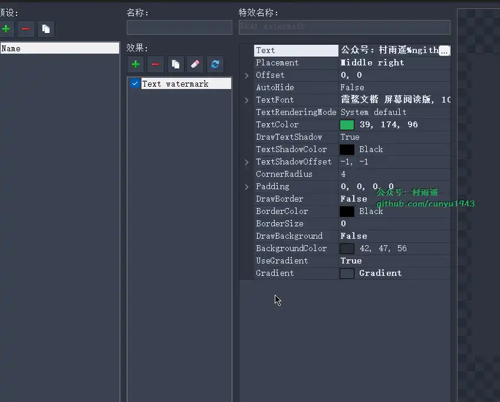

第三步：完成水印参数的设置后，需要在 **截图后的任务** 中，勾选以下两项操作：

-   添加图像特效
-   图像复制到剪贴板

这样一来，当你再去截图时，就会自动给你的截图加上设置的水印了。这时候带有水印的图片就已经在你的剪贴板了，只需要 `Ctrl + V` 即可粘贴。

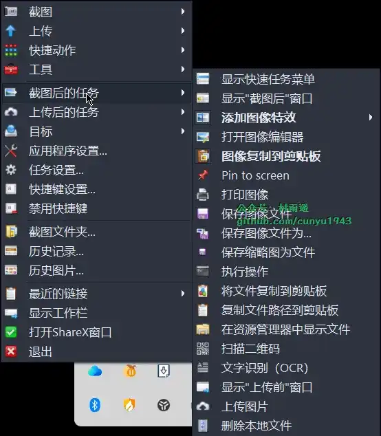

## 四、压缩为 webp

到这里，针对截图后添加水印的操作就已经完成了。那接下来继续看看，怎么给截的图压缩为 `.webp` 格式。

目前来说，只是借助 `ShareX` 是没办法做到压缩的，这里还需要借助另一个软件 `FFmpeg`。

### 1. FFmpeg 安装

首先，通过以下链接去下载最新版本的 `FFmpeg`。

-   [FFmpeg 最新版下载地址](https://github.com/BtbN/FFmpeg-Builds/releases)

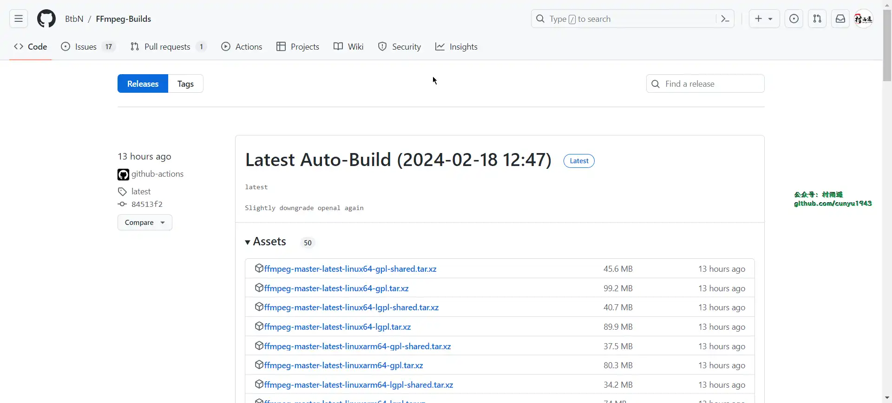

然后，安装的方式也很简单，把下载后的压缩包解压就行了。这里建议解压放到纯英文的路径下，尽量不要带有中文和空格之类的特殊字符。

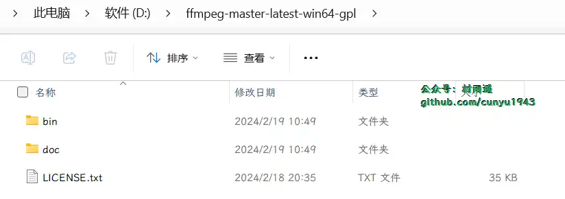

### 2. 压缩转换配置

`FFmpeg` 安装完成后，我们接着来做压缩转换相关的配置。

第一步：打开 `ShareX` 的 **动作设置**，选择 **图像** 栏，然后将 **图像格式** 设置为 `png`。

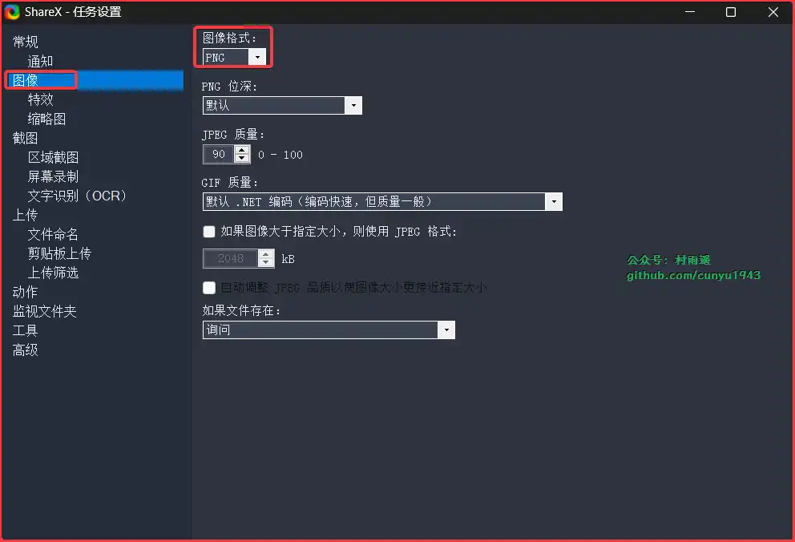

第二步：选择 **动作** 栏，在右侧进行添加一个新的动作。动作的相关参数如下：

-   名称：随意设置。
-   文件路径：上面步骤中 `FFmpeg` 的安装路径，注意这里一定要指定到 `FFmpeg.exe` 可执行文件。
-   参数：`-i "$input" -q 50 "$output"`，其中 `-q 50` 代表以 50% 的质量压缩，数值越小，压缩越狠。
-   输出文件的扩展名：`webp`
-   扩展名筛选：`png`，这也是为什么需要先统一设置图像格式为 `png`。

接着，勾选上 **隐藏窗口** 和 **删除输入文件** 配置，点击确定即可。

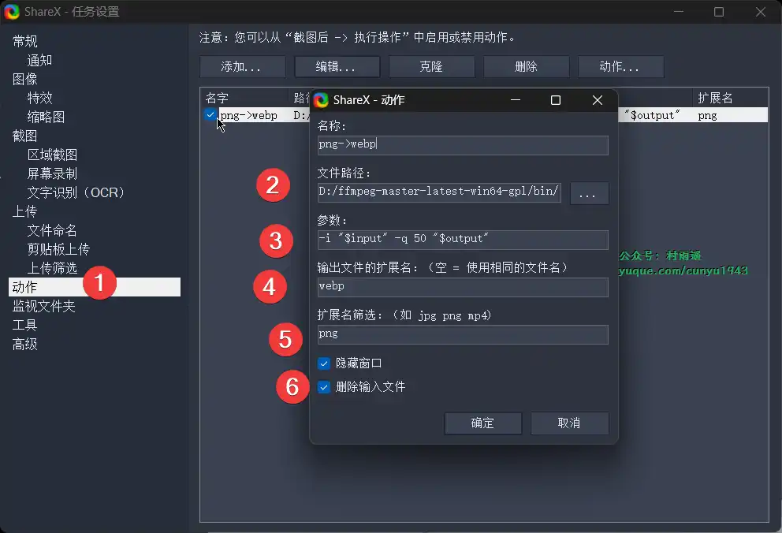

第三步：配置完成后，同样需要在 **截图后的任务** 中，勾选以下几项：

-   保存图像文件
-   执行操作
-   将文件复制到剪贴板

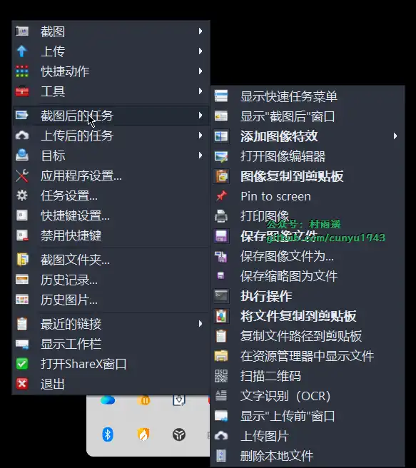

## 五、总结

经过我们的一番设置，就能在截图的时候实现添加水印的同时压缩为 `.webp` 格式了，是不是很方便？

如果我们要同时实现以上两项特色功能，需要注意，在截图后的任务中，一定要勾选上以下五项设置：

-   添加图像特效
-   图像复制到剪贴板
-   保存图像文件
-   执行操作
-   将文件复制到剪贴板

说了这么多，赶紧去实操试试吧，相信你也能轻松搞定。

注意，有时候压缩不生效可能是因为 `FFmpeg` 不是最新版导致的。这时候你只需要到上面提到的下载地址去下载最新版本的 `FFmpeg`，然后解压后覆盖掉之前的版本就可以了。