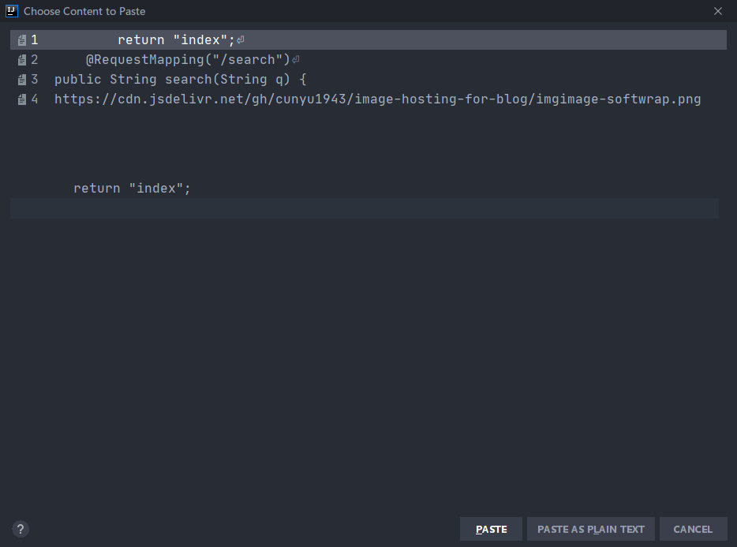
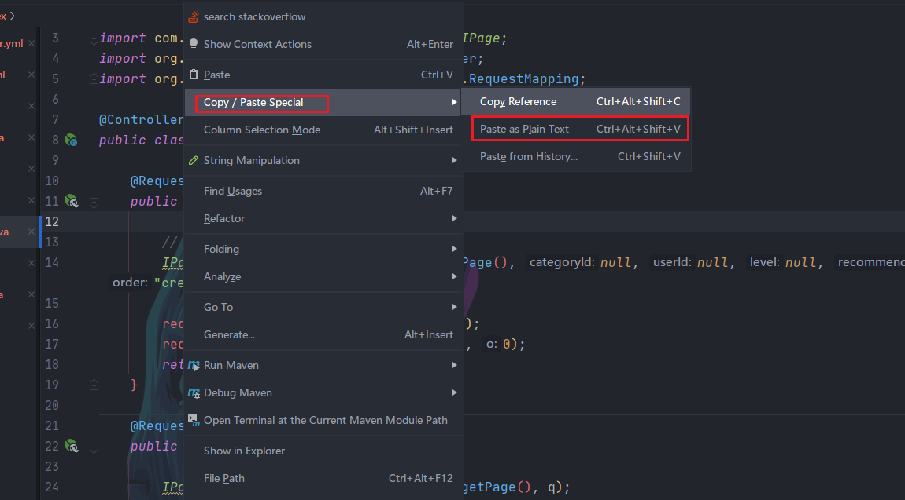
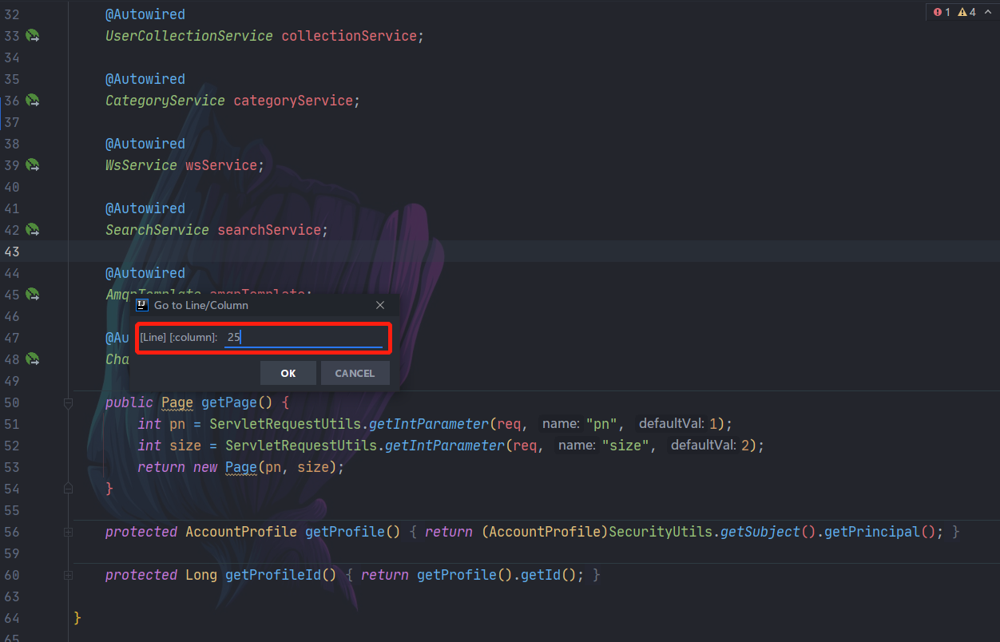
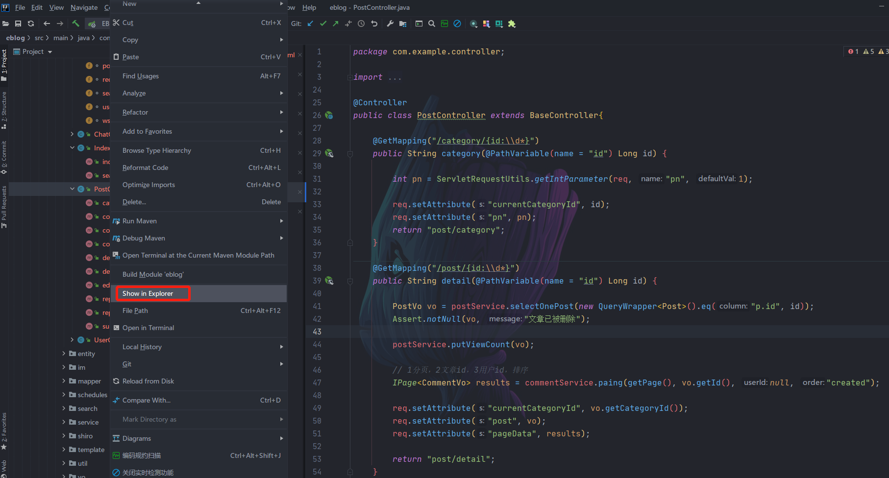
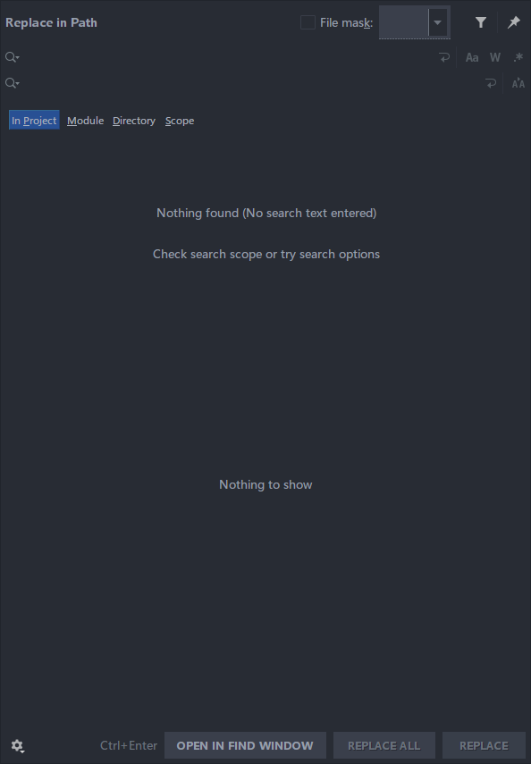
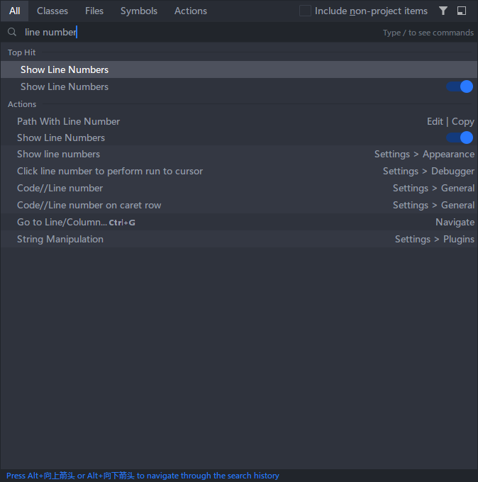

# 实用小技巧

## 前言

人人都说 IDEA 好，但你知道他的强大之处在哪儿么？今天就来看看，增进日常开发效率的 IDEA 小技巧。

## 代码编辑

### 复制 & 粘贴

我们知道，最常用的复制粘贴是通过 `Ctrl + C/V`，但如果要针对复制历史进行粘贴，此时在 IDEA 中可以通过 `Ctrl + Shift + V` 来进行自主选择自己想要粘贴的内容；

同时，在 IDEA 中，默认粘贴时是会对代码自动格式化的。如果我们不想让它自动格式化，那么此时可以利用快捷键 `Ctrl + Alt + Shift + V` 进行粘贴。或者通过右键菜单，选择 `Paste as Plain Text` 进行粘贴；

### 格式化代码

要自动进行格式化，我们可以先全选 `Ctrl + A` 或者选中你所要格式化的部分，然后利用快捷键 `Ctrl + Alt + L` 进行格式化；

###  剪切和复制一行或多行

剪切一行时，将鼠标光标移动到所要剪切的行，然后利用快捷键 `Ctrl + X` 进行剪切即可；

要复制一行，将鼠标光标移动到所要复制的行，然后利用快捷键 `Ctrl + D` 进行复制即可；

要复制多行，将所要复制的多行行进行选中，然后利用快捷键 `Ctrl + D` 进行复制即可；

### 上下移动一行或多行

上下移动一行时，将鼠标光标放在需要移动的行，然后通过快捷键 `Ctrl + Shift + 向上/向下` 进行快速移动；

上下移动多行时，选中需要需要移动的多行，然后通过快捷键 `Ctrl + Shift + 向上/向下` 进行快速移动；

##  快速跳转

### 根据行号定位

通过快捷键 `Ctrl + G`，然后输入所要跳转的行，快速跳转到对应行。

### Tab 切换

如果我们打开了多个文件，要想在不同文件之间快速切换，除了用鼠标点击对应文件标签之外，还可以通过快捷键 `Alt + 左/右` 进行 Tab 的快速切换。

### 查看最近浏览的文件列表

通过快捷键 `Ctrl + E`，能快速打开我们最近浏览的文件列表；

### 快速打开文件所在文件夹

要打开文件所在文件夹，一般是通过选中文件，然后鼠标右键选中 `Show in Explorer` 即可；

##  快速查找与替换

###  内容查找与替换

-   **单个文件**

    针对单个文件，可以用快捷键 `Ctrl + F` 进行查找，快捷键 `Ctrl + R` 进行替换；

-   **全局文件**

    针对全局查找，用 `Ctrl + Shift+ F`，而针对全局替换，则可以使用 `Ctrl + Shift + R`；

###  文件查找

要快速查找文件，可以通过 `Ctrl + Shift+ N` 来进行查找；

###  查找菜单或操作

通过 `Ctrl + Shift + A` 快捷键，然后就能通过关键字来查找我们所需要的菜单和操作；

###  万能查找

通过双击两次 `Shift`，来实现万能查找，既可以实现文件查找，也可以实现菜单、操作查找，但是要注意的是它不能进行文件内容查找；

### 注意

其实在 IDEA 的新版本中，文件查找、菜单或操作查找、万能查找都集成到了一起，所以我们只需要记住其中一种启动方式即可！

## 总结

以上就是有关于 IDEA 使用中的一些提升效率的小技巧了，如果你还没有用过，那就赶紧试验用起来吧 ~

最后，创作不易，如果你觉得本文对你有所帮助，那就帮忙点个赞再走吧！