# 最新版 IntelliJ IDEA 使用手册

:::info 共勉
不要哀求，学会争取。若是如此，终有所获。
:::

## 前言

因为自己电脑最近实在是太卡了，也一直提示更新，索性就直接重装了个系统。因为需要重装下 IDEA，而现在新版本的 IDEA 和之前的版本还是有很大变化的，所以在这里写一篇博客做个记录，方便自己后续配置，也顺便分享给大家。

## IDEA 的优势

为什么要使用 `IDEA` 呢？当然是因为它的强大。总结起来，`IDEA` 具有以下的主要优势：

1.  **功能强大**

一方面体现在强大的整合能力，`IDEA`支持集成各种开发过程中的编程框架，最常见的有`git`、`JVM`系编程语言、`Spring` 系产品、移动开发语言框架、前端开发语言。而另一方面，通过集成版本控制系统、对多种编程语言框架的支持，同时无需额外安装插件，带给我们开箱即用的体验。

2.  **符合人体工程学**

`IDEA` 的提示功能十分智能，提供了快速地智能代码补全、实时代码分析以及可靠的重构工具。此外 `IDAE` 的提示功能十分快速、便捷，而且提示范围也十分广泛。

## 准备工作

既然要安装 `IDEA`，那么首先需要前往 `JetBrains` 的官网下载最新版的 `IDEA`，下载地址如下：

https://www.jetbrains.com/idea/download/

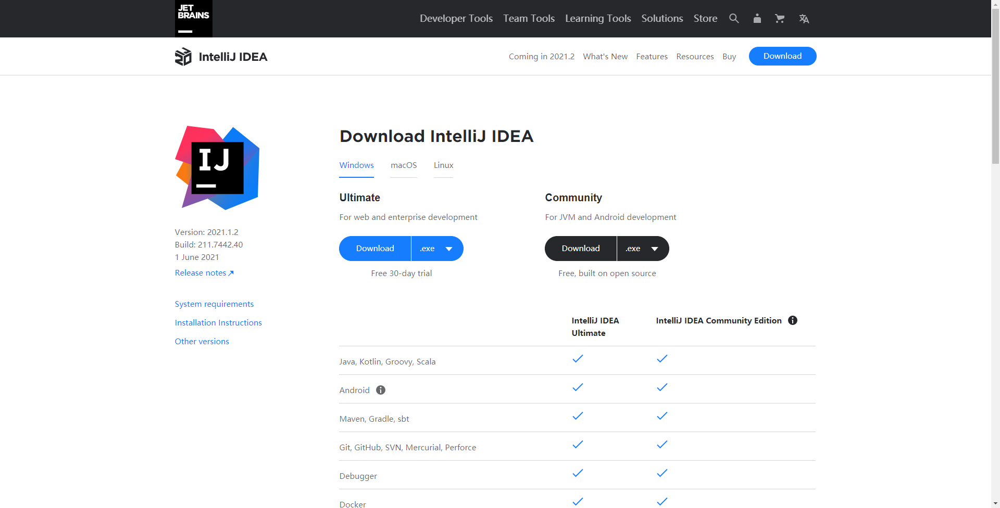

因为我有旗舰版的账号，所以这里就以旗舰版安装为例，其实社区版的安装也是一样的，只不过里边集成的东西有所不同。所以如果你安装的是社区版，参照此教程也是完全可以的！


## 安装

好了，完成下载后，我们就可以开始我们的安装过程了！

1.  双击我们的安装包之后，来到 `IDEA` 的欢迎界面，我们此时只需要 `Next` 即可。


2.  接着就是选择我们要安装 `IDEA` 的位置，它默认的安装位置是 `C:\Program Files\JetBrains\IntelliJ IDEA 2021.1.2`，这里就是看大家自己的喜好了，你喜欢安在哪儿都可以，但是需要满足它所需要的内存。更加推荐大家安装到自己的非系统盘位置，比如我的安装位置是 `D:\SoftInstall\IntelliJ IDEA`。

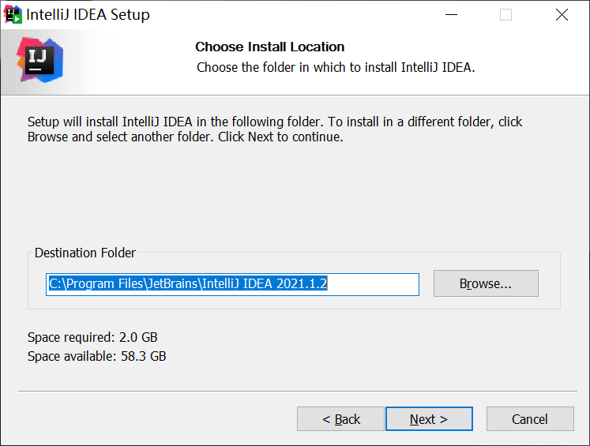

3.  选择安装的配置，这里主要选择创建 32 还是 64 位的桌面快捷方式、是否要将其加入到系统 `PATH` 环境变量、是否关联相关后缀文件等等。可以根据自己的使用习惯来进行选择，以我个人来说，因为不喜欢弄一些桌面快捷方式以及关联相关后缀文件等操作，所以我默认全都不勾选，直接 `Next`。


4.  选择开始菜单中给 IDEA 的文件夹名，这里默认即可，直接点击 `Install`，然后就是漫长的等待安装过程了！


5.  大功告成！显示此界面就说明我们的 `IDEA` 已经安装好了，直接点击 `Finish` 即可！

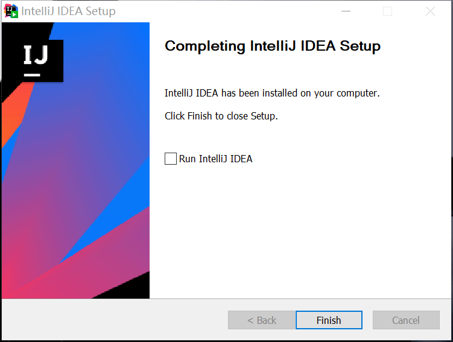

## 配置

安装好之后，为了让我们的 IDEA 使用起来更顺手，推荐做一些个性化的配置，提高我们的工作效率。

### 激活

首次打开旗舰版 `IDEA` 时，会让你激活，这里有 3 种选择：

- 利用你的 `JetBrains` 账号登录激活；
- 利用你的 `IDEA` 激活码激活；

- 最后则是许可证服务器地址激活；

当然你也可以选择 `Evaluate for free`，它是有 30 天的试用期的，你只需要在这 30 天之内激活即可，否则 30 天之后将会弹窗不可用。对于社区版，应该没有激活这一说法，因为它是免费的，我们直接打开用就可以了。

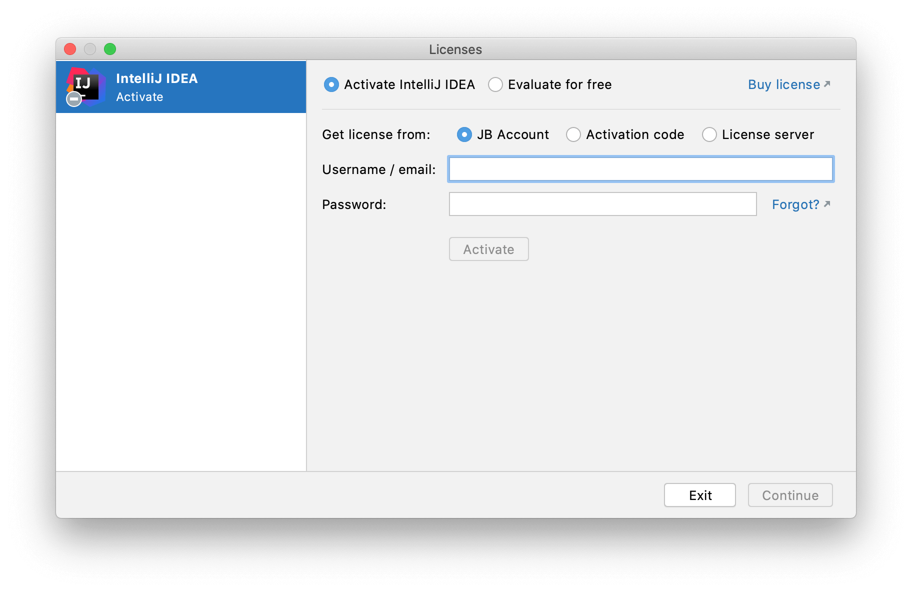

### 编码设置

一般 IDEA 的编码是和系统保持一致的，而为了通用，减少不必要的编码问题，所以一般统一设置为 UTF-8，设置入口如下，依次打开 `Settings -> Editor -> File Encodings`，然后将 `Global Encoding`、`Project Encoding`、`Default encoding for properties files` 均设置为 UTF-8。


### 外观设置

#### 整体 UI

安装并激活之后，进入 IDEA 的主界面，新版本的主界面如下图所示：

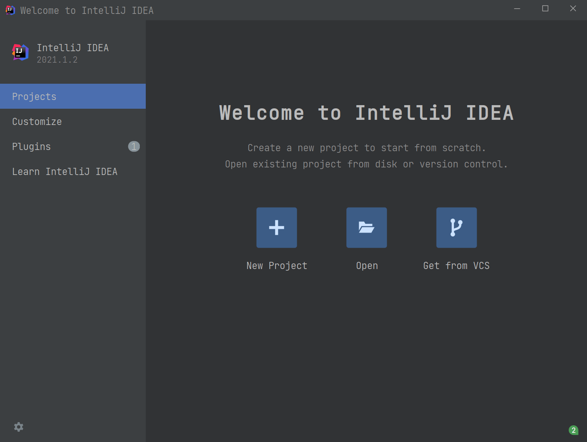

点击 `Customize`，可以看到右侧我们可以设置主题和字体。其中主题有如下 4 种选择：

1.  IntelliJ Light
2.  Windows 10 Light

3.  Darcula
4.  High contrast

这里可以根据自己的喜好进行主题选择，也可以勾选右方的 `Sync with OS` 选项，这样 IDEA 就会根据你系统的明亮还是黑暗主题进行自动切换了。

而字体大小设置这边，我个人更喜欢稍微大一点（主要是小的看久了眼睛疼 😂），所以设置的是 16 号字体。


而关于更多设置，可以点击下方的 `All settings…`，进入更详细的设置。比如这里 IDEA 默认界面字体是微软雅黑，我们要改成自己喜欢的字体就可以在这里进行更改，这里推荐 JetBrains 自家推出的 `JetBrains Mono` 字体。

设置入口，依次进入 `Settings -> Appearance & Behavior -> Appearance`，然后在右边设置主题，字体以及字体大小即可。


#### 编辑区

上述设置只是针对于 IDEA 整体界面风格的设置，而如果我们要对我们的代码编辑区进行设置，那么就需要进入：`Settings -> Editor -> Font`，然后设置字体和大小。这里依然推荐使用 `JetBrains Mono` 字体，字号 16。

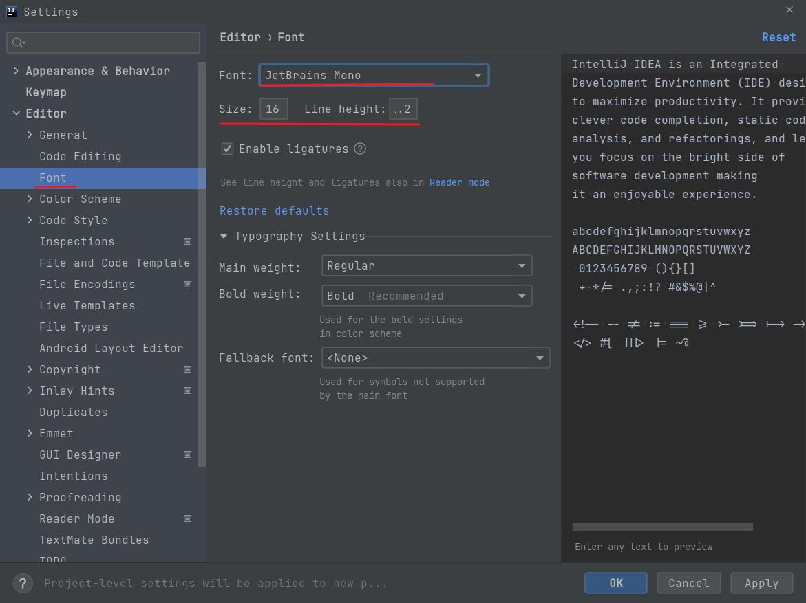

除开上面设置编辑区字体大小的方法外，我们还可以按住 `Ctrl`，然后通过鼠标滚轮来实现字体大小的调整，但是前提是你要先打开相关设置。设置入口如下，依次进入 `Settings -> Editor -> General`，然后勾选 `Change font size with Ctrl+Mouse Wheel` 即可。

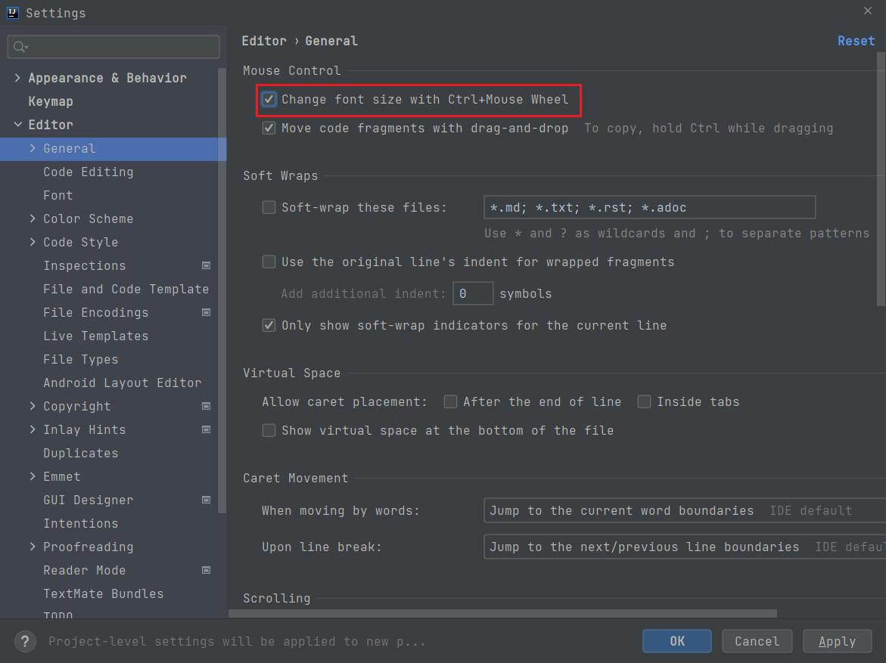

#### 控制台

一般情况下无需调整，它会沿用编辑器一样的配置，但如果你需要自定义，可以去如下入口：`Settings -> Editor -> Color Scheme -> Console Font`，然后勾选如下 `Use color scheme font instead of the default` 选项并进行设置即可。


### 扁平化显示及空包隐藏

有时候，我们项目的包结构会变成如下样式，有时会造成一定的不便，此时是因为开启了 `Flatten Packages` 所导致。

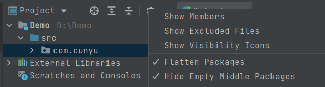

如果我们关闭此功能，则项目包结构如下所示：


其中 `Compact Middle Packages` 表示是否隐藏空包。

### 打开文件多行显示

平常使用 IDEA 时，你可能没有注意到，一旦我们打开过多的文件时，默认会堆积在一行显示，就像浏览器打开了多个标签一样，此时需要通过右侧箭头筛选的方式来选择其他文件。为了解决这一问题，让我们打开的所有文件能以多行显示的方式方便查看。

设置入口：依次打开 `Settings -> Editor -> General -> Editor Tabs`，然后将 `Show tabs in` 勾选为 `Multiples rows`。

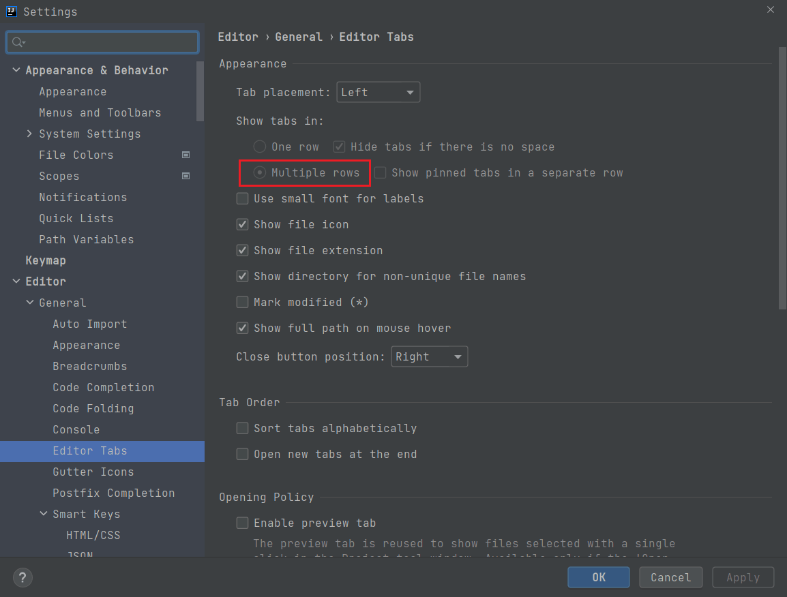

### 行号和方法分隔符

日常为了方便定位 Bug 所在位置，我们通常需要打开代码所对应的行号，方便我们查找。另外，如果我们代码中方法较多时，最好是在每个方法之间加一个分隔符，方便我们知道一个方法的开始和结束。而这两个功能，IDEA 都是提供的。设置入口：依次打开 `Settings -> Editor -> General -> Appearance`，然后勾选 `Show line numbers` 和 `Show method separators`。


### 自动导包

日常工作中，我们会经常用到第三方的包，每次都需要我们通过手动（`Alt + Enter`） 的方式来导入，但实际上 IDEA 也是提供自动导包功能的，设置入口如下：`Settings -> Editor -> General -> Auto Import`，将 `Insert imports on paste` 设置为 `Always`，再勾选 `Add unambiguous imports on the fly` 以及 `Optimize imports on the fly` 即可。


### 忽略大小写

通常 IDEA 在导入类时大小写是全匹配的，这样一样就极大影响了我们编码的速度。此时我们就可以通过设置 IDEA，让其忽略大小写字母，提高效率。设置入口如下，依次进入 `Settings -> Editor -> General -> Code Completion`，取消勾选 `Match case`。

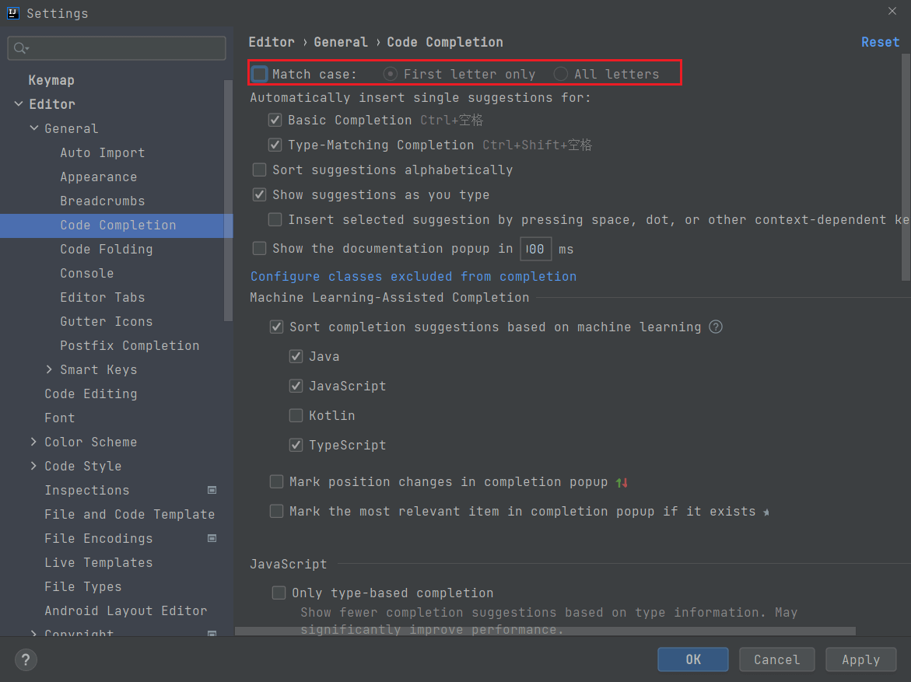

### 自动编译

IDEA 默认是不会对代码自动编译的，需要我们手动配置。设置入口：依次打开 `Settings -> Build,Execution,Deployment -> Compiler`，然后勾选 `Build project automatically` 和 `Compole independent modules in parallel`。


### 编译器设置

这里推荐使用 `Javac` 编译器，然后编译器版本最好保持和你本地使用的 JDK 版本相同。因为我本地使用的是 JDK11，所以这里版本我设置的是 11，这里最好根据你自己的实际情况进行设置。设置入口：依次打开 `Settings -> Build,Execution,Deployment -> Compiler -> Java Compiler`，然后将 `Use compiler` 设置为 `Javac`，并将 `Project bytecode version` 设置为你本地使用的 JDK 的版本。


### Maven 设置

默认情况下，IDEA 是由绑定的 Maven 的，但是我们一般是自己设置自己所使用的 Maven。需要设置的主要有三点：

1.  **Maven home path**：即自己本地的 Maven 所在目录；
2.  **User settings file**：即自己本地 Maven 环境下的 `settings.xml` 所在目录；

3.  **Local repository**：即自己本地的 Maven 仓库；

设置入口：依次打开 `Settings -> Build,Execution,Deployment -> Build Tools -> Maven`，然后设置以上三点即可。


### 类模板

当我们创建一个类时，希望每个类的前边都已经一些注释的代码，用于标识这是我们自己所写的代码。此时就需要到 `Settings -> Editor -> File and Code Templates`，然后在右边的 `Includes -> File Header` 右边的方框中，填入如下模板。设置完成之后，以后我们每次创建新的类文件时，IDEA 都会在文件的开头添加如下信息。

```java
/**
 * Created with IntelliJ IDEA.
 * @Project      : ${PROJECT_NAME}
 * @Package      : ${PACKAGE_NAME}
 * @ClassName    : ${CLASS_NAME}.java
 * @createTime   : ${DATE} ${TIME}
 * @version      : 1.0
 * @author       : 村雨遥
 * @Email        : 747731461@qq.com
 * @公众号        : 村雨遥
 * @Website      : https://cunyu1943.github.io/JavaPark
 * @Description  :
 */
```


### 导入导出设置

经过我们一番调教，IDEA 用起来就十分顺手了。但这时候问题就来了，要是我们换个系统或者电脑使用啥的，难道我们又得重新设置一遍么？当然不是了！IDEA 是支持导入导出我们的配置的，我们只需要将我们的设置导出，然后换电脑或者重装系统使用时进行导入即可。

#### 导出

导出入口：依次打开 `File -> Manage IDE Settings -> Export Settings…`。

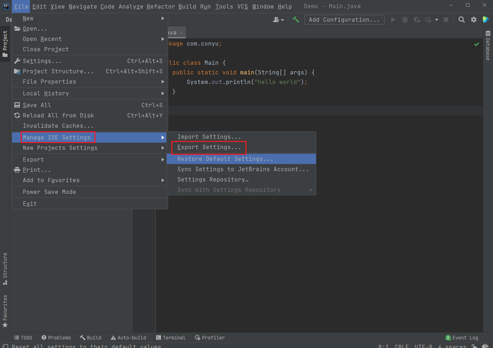

#### 导入

导入入口，依次打开 `File -> Manage IDE Settings -> Import Settings…`。


## 总结

好了，以上就是关于 IDEA 的安装以及安装之后的一些配置了。如果你觉得对你有用，那就点个赞再走吧！如果你还有更多关于 IDEA 的高级玩法，欢迎评论区留言，大家一起交流！
