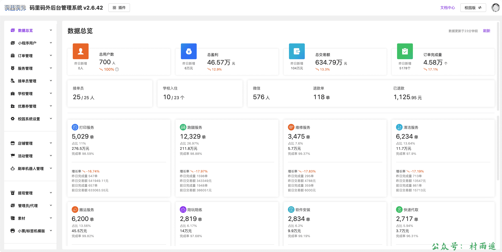
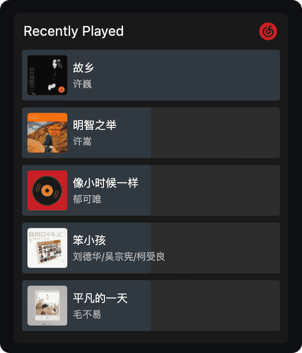
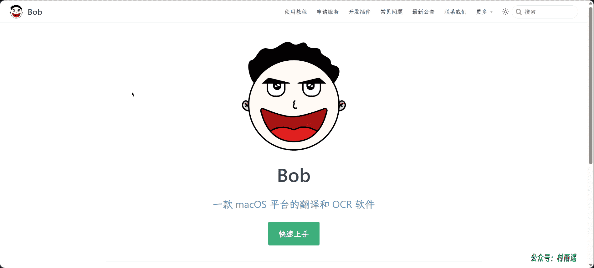
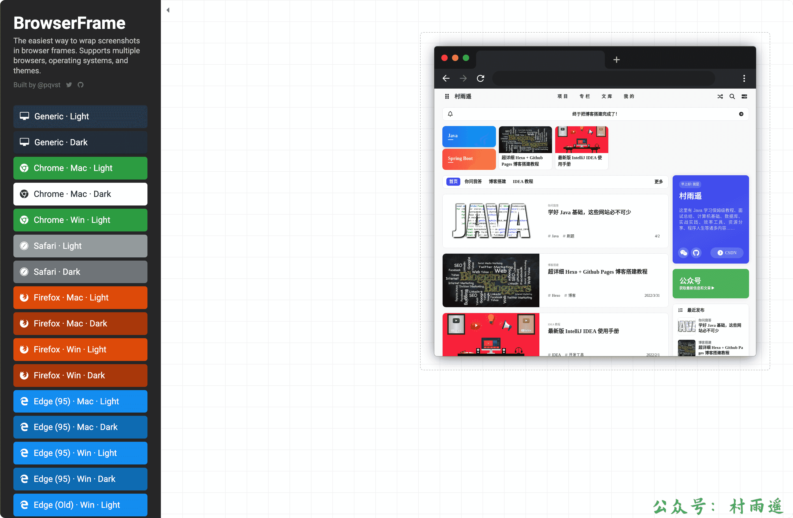
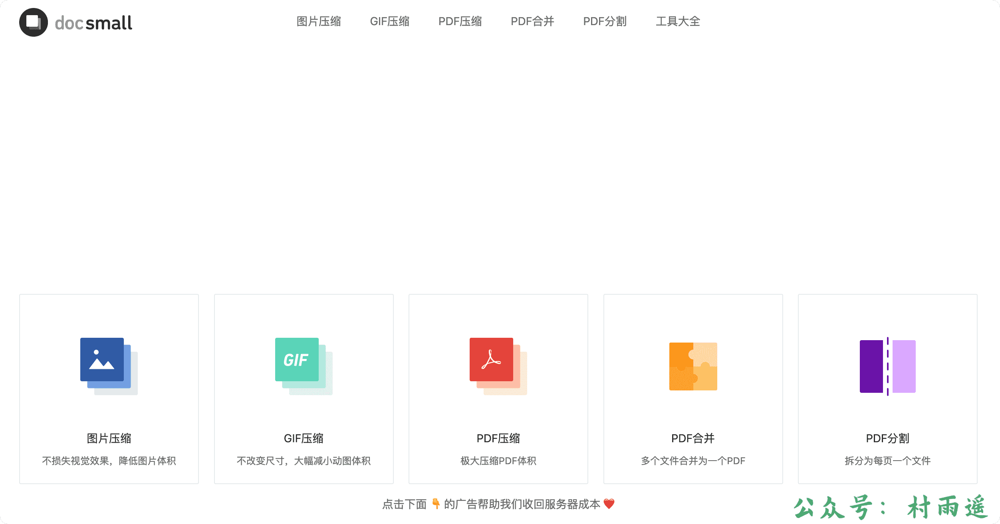
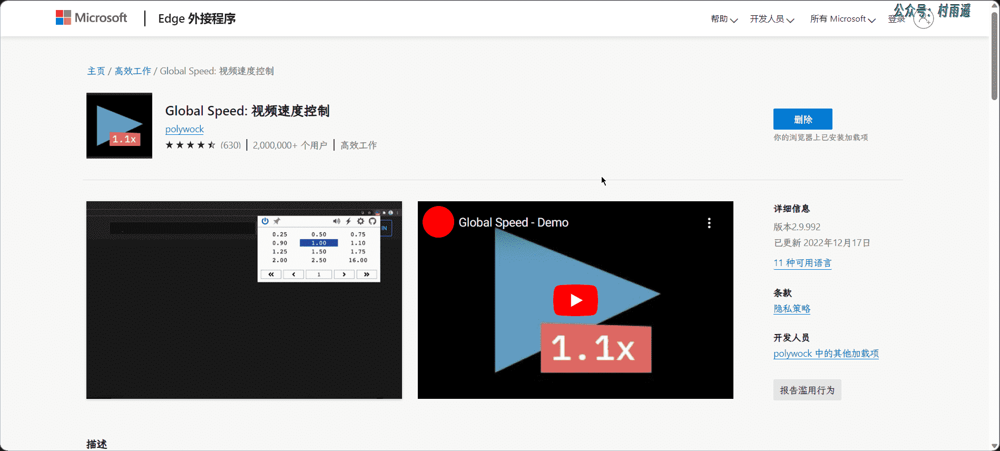
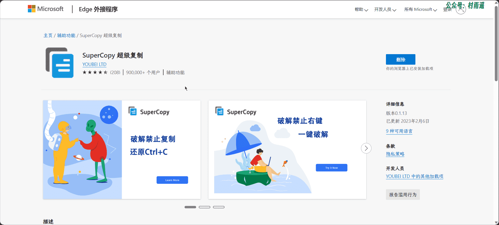
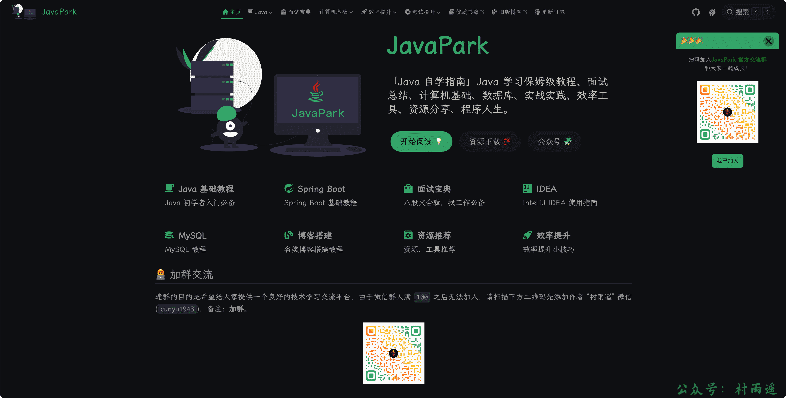
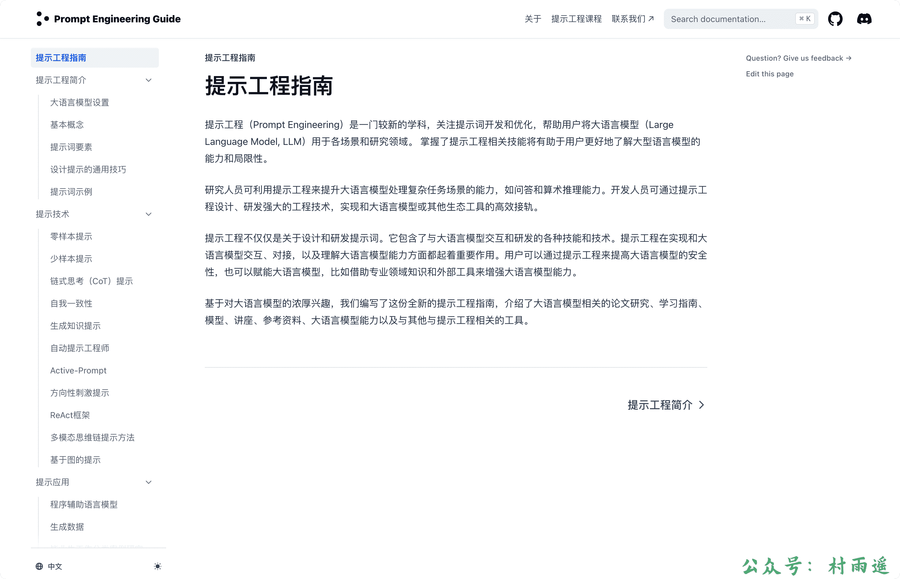
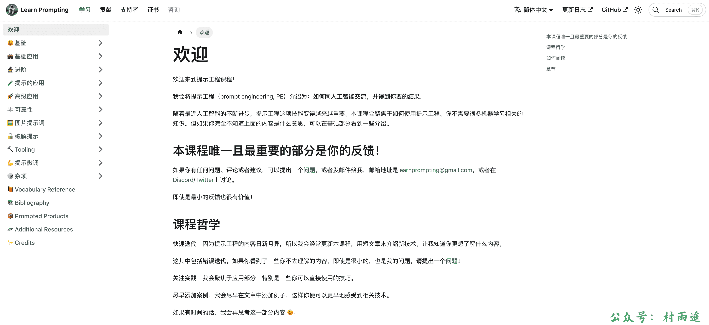

# 好物周刊#1：提示工程师养成指南

::: info 共勉
不要哀求，学会争取。若是如此，终有所获。
:::
::: tip 原文
https://mp.weixin.qq.com/s/tRCcFjolMuXqunWRQDgxGQ
:::

## 一、项目

### 1. [ddrun](https://gitee.com/landalfyao/ddrun)

后端采用 `midway3.0`，后台采用 `nuxt2.x`，小程序采用 `uniapp` 实现的一套跑腿下单接单系统。

适用于校园、社区、城市等场景，可提供打印服务、跑腿服务、搬家服务、清洁服务、维修服务、活动组织、快递代取、代买代送、软件安装、陪玩陪练等服务。

### 2. [tiny-vue](https://github.com/opentiny/tiny-vue)

`TinyVue` 是华为云出品的企业级设计体系，一个基于 `Vue` 的 `UI` 组件库，可以同时支持 `Vue 2.0` 和 `Vue 3.0`。

组件丰富，主要提供以下组件：

-   框架风格
-   导航组件
-   容器组件
-   表单组件
-   表格组件
-   数据组件
-   提示组件
-   其他组件

### 3. [netease-recent-profile](https://github.com/zonemeen/netease-recent-profile)

通过使用该组件，可以在 `Github Profile` 上显示你在网易云音乐上的听歌记录。

## 二、软件

### 1. [Bob](https://bobtranslate.com/)

1.   **使用场景**

仅适用于 `macOS`，学习工作中需要用到 `OCR` 的场景。

2.   **常用功能**

-   **划词翻译**：选中需要翻译的文本，按下划词翻译快捷键（默认 `⌥ + D`）即可翻译。

-   **截图翻译**：按下截图翻译快捷键（默认 `⌥ + S`），截取需要翻译的区域即可翻译。
-   **输入翻译**：按下输入翻译快捷键（默认 `⌥ + A`），输入需要翻译的文本，`Enter` 键翻译。
-   **截图 OCR**：按下截图 `OCR` 快捷键（默认 `⇧ + ⌥ + S`），截取需要识别的区域即可识别文本。
-   **静默截图 OCR**：按下静默截图 `OCR` 快捷键（无默认快捷键），截取需要识别的区域即可后台识别文本。
-   **访达选图 OCR**：按下访达选图 `OCR` 快捷键（无默认快捷键），在访达窗口选中图片文件即可识别文本。

### 2. [ScreenToGif](https://www.screentogif.com/)

一款非常好用的免费开源 `Gif` 动画录制工具，集 `GIF` 录制、制作、编辑等多种功能为一身。具有录制屏幕、录制摄像头、录制画板、编辑器等功能，软件小巧、界面简洁但功能却很强大，而且操作也很简单。不过需要注意一点，它目前只支持在 `Windows` 系统中使用。

### 3. [Snipaste](https://www.snipaste.com/)

一款强大的免费截图 + 贴图软件，目前支持 `Windows` 和 `macOS` 系统。免费版功能对于日常截图贴图已经完全足够，同时还推出了专业版，比起免费版更为强大。

专业版与免费版功能对比如下表，专业版目前定价 `99` 元，有需要的看官可以入手。

| 功能                                           | 免费版     | 专业版             |
| ---------------------------------------------- | ---------- | ------------------ |
| **截屏**                                       |            |                    |
| 自由矩形区域截屏                               | ✔️          | ✔️                  |
| 窗口检测                                       | ✔️          | ✔️                  |
| 界面元素检测                                   | ✔️          | ✔️                  |
| 延时截屏                                       | ✔️          | ✔️                  |
| 自定义尺寸截屏                                 | ✔️          | ✔️                  |
| 白板模式                                       | ✔️          | ✔️                  |
| 捕捉光标图案                                   | ✔️          | ✔️                  |
| 重复上一次截屏区域                             | ✔️          | ✔️                  |
| 精确控制光标移动                               | ✔️          | ✔️                  |
| 重放截图历史                                   | ✔️          | ✔️                  |
| 自动保存                                       | ✔️          | ✔️                  |
| 快速保存                                       | ✔️          | ✔️                  |
| 超级截屏                                       | ❌          | ✔️                  |
| 检测界面父/子元素                              | ❌          | ✔️                  |
| 识别二维码/条形码                              | ❌          | ✔️                  |
| 刷新截图                                       | ❌          | ✔️                  |
| 输入截屏区域尺寸                               | ❌          | ✔️                  |
| 切换截屏尺寸单位 (`px`/`dip`)                  | ❌          | ✔️                  |
| 活动窗口截屏                                   | ❌          | ✔️                  |
| 固定截图区域长宽比                             | ❌          | ✔️                  |
| 透明白板模式                                   | ❌          | ✔️                  |
| 带阴影/边框保存                                | ❌          | ✔️                  |
| 原生分享 (`Windows` 10+)                       | ❌          | ✔️                  |
| 配合 Listary 使用 (手动保存文件时隐藏截图窗口) | ❌          | ✔️                  |
| 发送截图到其他应用程序（通过自定义命令行参数） | ❌          | ✔️                  |
| **贴图**                                       |            |                    |
| 将剪贴板内容(文字/图像/文件)粘贴为置顶窗口     | ✔️          | ✔️                  |
| 调整大小/透明度                                | ✔️          | ✔️                  |
| 旋转/镜像                                      | ✔️          | ✔️                  |
| 以固定尺寸快速缩略图                           | ✔️          | ✔️                  |
| 贴图分组                                       | ✔️          | ✔️                  |
| 取消/启用贴图窗口置顶                          | ❌          | ✔️                  |
| 自由尺寸缩略图                                 | ❌          | ✔️                  |
| 贴图裁剪                                       | ❌          | ✔️                  |
| 灰度转换                                       | ❌          | ✔️                  |
| 反色                                           | ❌          | ✔️                  |
| 支持虚拟桌面                                   | ❌          | ✔️                  |
| `Solo` 模式                                    | ❌          | ✔️                  |
| 多选贴图窗口                                   | ❌          | ✔️                  |
| 背景模式 (对于有透明通道的贴图)                | ❌          | ✔️                  |
| 支持粘贴/拖拽网页图片                          | ❌          | ✔️                  |
| 贴图组管理                                     | ❌          | ✔️                  |
| 输入贴图尺寸/缩放比例                          | ❌          | ✔️                  |
| 可编辑的颜色卡片                               | ❌          | ✔️                  |
| **标注**                                       |            |                    |
| 矩形/椭圆                                      | ✔️          | ✔️                  |
| 直线/折线/箭头                                 | ✔️          | ✔️                  |
| 画笔                                           | ✔️          | ✔️                  |
| 记号笔                                         | ✔️          | ✔️                  |
| 马赛克/模糊                                    | ✔️          | ✔️                  |
| 文本标注                                       | ✔️          | ✔️                  |
| 橡皮擦                                         | ✔️          | ✔️                  |
| 序号标注                                       | ❌          | ✔️                  |
| 放大镜标注                                     | ❌          | ✔️                  |
| 圆角矩形标注                                   | ❌          | ✔️                  |
| 虚线/点线 (矩形/椭圆/直线/折线/箭头/画笔)      | ❌          | ✔️                  |
| 记号笔/马赛克/模糊/橡皮擦 支持 椭圆/圆形 形状  | ❌          | ✔️                  |
| 双向/反向箭头                                  | ❌          | ✔️                  |
| 更多箭头样式                                   | ❌          | ✔️                  |
| 文字背景填充                                   | ❌          | ✔️                  |
| 自定义文字描边的颜色/宽度                      | ❌          | ✔️                  |
| 旋转标注图形                                   | 仅文字标注 | 除线条标注外都支持 |
| 二次编辑                                       | ❌          | ✔️                  |
| 自由选中                                       | ❌          | ✔️                  |
| 笔尖数量                                       | 1          | 1-5                |
| 拖拽调色板以重新排序颜色                       | ❌          | ✔️                  |
| 滚轮调整颜色透明度                             | ❌          | ✔️                  |
| 为不同标注形状分别记忆颜色                     | ❌          | ✔️                  |
| 自定义调色板，分享调色板                       | ❌          | ✔️                  |
| **其他功能**                                   |            |                    |
| 屏幕触发角                                     | ❌          | ✔️                  |
| 复制截图为文件                                 | ❌          | ✔️                  |
| 命令行选项                                     | 基础       | 丰富               |
| **自定义选项**                                 |            |                    |
| 为任意功能绑定全局快捷键                       | ❌          | ✔️                  |
| 自定义放大镜样式                               | ❌          | ✔️                  |
| 完全隐藏放大镜                                 | ❌          | ✔️                  |
| 自定义托盘图图标的鼠标动作                     | ❌          | ✔️                  |
| 主题色跟随系统主题                             | ❌          | ✔️                  |
| **授权**                                       |            |                    |
| 使用限制                                       | 仅个人使用 | 没有限制           |
| 使用期限(但不包含大版本更新，如 `Snipaste` 3)  |            | 永久               |
| 小版本更新                                     | 仅缺陷修复 | 包含新功能         |
| 授权价格                                       | 免费       | `99` 人民币        |

## 三、网站

### 1. [BrowserFrame](https://browserframe.com/)

通过该网站，可以模拟在各大浏览器框架中的屏幕截图，支持 `Chrome`、`Safari`、`Firefox`、`Edge`、`Opera`等浏览器、`macOS`、`Windows` 系统以及 `Dark`、`Light` 主题。

### 2. [docsmall](https://docsmall.com/)

一个提供图片压缩、`Gif` 压缩、`PDF` 压缩、`PDF` 合并、`PDF` 分隔等功能的在线网站，最重要的一点，完全免费！

就像我文章里的图片，基本都是在这里压缩的。

### 3. [Dimmy.club](https://dimmy.club/)

模拟生成在各种设备模上的带壳屏幕截图，主要支持笔记本（`MacBook、Surface Book`）、一体机（`iMac`）、手机（`iPhone、Pixel、Nokia、Samsung`）、平板（`iPad、Nexus`）等设备。

## 四、插件

### 1. [AdGuard](https://adguard.com/zh_cn/welcome.html)

号称世界上最高级的广告拦截器，具有如下特点：

- 拦截所有种类的广告
- 移除烦人的网络元素
- 节省流量并加速页面载入
- 工作于浏览器与应用程序
- 保持网站功能和外观

### 2. [Global Speed: 视频速度控制](https://microsoftedge.microsoft.com/addons/detail/global-speed-视频速度控制/mjhlabbcmjflkpjknnicihkfnmbdfced)

1. **速度控制**

- 与几乎所有视频和音频流媒体站点兼容，包括 `Youtube`，`Netflix`，哔哩哔哩，腾讯视频，百度网盘，爱奇艺等。
- 如果固定，标签可以有自己的播放速率。
- `URL` 规则，可根据网站自动设置自定义播放速率。
- 可选的快捷键来控制速度。

2. **媒体热键**

- 倒带/前进，逐帧分析，调整音量，设置标记，转到标记，`AB` 重复等。

- 选择您要优先用于媒体热键的视频/音频。
- 热键可以处于全局模式，该模式允许您在使用其他程序时控制背景音乐或 `PiP` 视频。

3. **筛选器**

- 在视频甚至整个页面上应用滤镜（反转，灰度，亮度，对比度，镜像等）。
- 配置热键以切换反转，调整亮度或对比度等。

4. **音效**

- 效果包括音高变化，音量增强，`EQ` 等。
- 可以延迟音频以解决同步问题。
- 配置热键来调整音调，音量增强等。

5. **隐私**

- 无数据收集，无追踪器。

6.   **使用场景**

-   快速刷课
-   学习教程视频时加速等

### 3. [SuperCopy 超级复制](https://microsoftedge.microsoft.com/addons/detail/supercopy-超级复制/nhiheekdcnmfbapkmpbhmplfddenhjic?hl=zh-CN)

1.   **主要功能**

-   解除禁止复制
-   解除禁止右键
-   解除禁止全选
-   解除禁止粘贴

2.   **常用场景**

复制百度文库、腾讯文档、金山文档、起点文学、豆瓣读书等网页禁止复制的内容。 

3.   **插件特色**

点亮图标即可复制，操作简单，需复制的网站具有记忆功能。

4.   **使用方法**

在访问被禁止右键或禁止复制的网站上，点击 `SuperCopy` 图标解除禁止即可。当插件图标灰色表示未启用解除功能，当图标彩色表示解除生效。

5.   **可复制的常用网站**

-   百度文库
-   起点中文网、起点文学、起点女生网
-   创始中文网
-   磨铁中文网、磨铁文学、锦文小说网、墨墨言情网、逸云书院
-   纵横中文网、纵横文学
-   网易云阅读
-   腾讯原创馆
-   豆瓣阅读、豆瓣读书
-   熊猫看书
-   哔哩哔哩
-   微博
-   `Story Bird`、`Beetify`
-   刺猬猫
-   站酷
-   链家
-   环球人力资源智库
-   老烤鸭雅思等

## 五、资料

### 1. [JavaPark](https://cunyu1943.site/JavaPark/)

这里有 `Java` 学习保姆级教程、面试总结、计算机基础、数据库、实战实践、效率工具、资源分享、程序人生等诸多内容，学习 `Java` 的小伙伴不容错过。

### 2. [提示工程指南](https://www.promptingguide.ai/zh)

`ChatGPT` 的横空出世，造就了一种新的职业 - **人工智能提示工程师**。而如何学习相关知识就很重要了，此刻你肯定无比需要一份入门指南，指引你学习的方向。

而这个项目就提供了这样一份指南，介绍了大语言模型相关的论文研究、学习指南、模型、讲座、参考资料、大语言模型能力以及与其他与提示工程相关的工具。

### 3. [Learn Prompting](https://learnprompting.org/zh-Hans/docs/intro)

随着 `ChatGPT` 的发布，人工智能不断进步，提示工程技能变得越来越重要。

这套教程聚焦于如何使用提示工程，甚至学习者都不需要储备很多机器学习相关的知识。通过学习如何与人工智能交流，从而得到我们想要的结果。

## ✍️ 说明

周刊专栏相关信息：

- **项目地址**：[Github](https://github.com/cunyu1943/JavaPark/) | [Gitee](https://gitee.com/cunyu1943/JavaPark/) ，觉得不错麻烦给我一个**Star**，感谢 ❤️
- **浏览地址**：公众号 | [电子书](https://cunyu1943.github.io/) | [电子书（国内）](https://cunyu1943.gitee.io/)

如果你阅读到这里，说明我的工作没有白费。如果你想推荐项目/网站/软件/资源，欢迎提交 **[issue](https://github.com/cunyu1943/JavaPark/issues)** 或者添加我 **个人微信：cunyu1943** 与我交流。

## 🎬️ 广告

当前大环境下，就业形势严峻，尤其针对即将毕业的大学生。作为一个技术求职者，求职前应该做好哪些准备呢，一些面试实战技巧也十分有必要！而刚好最近掘金出了一本《技术人求职指南》小册，相信一定会对在找工作的你有所帮助。

从求职到拿下 `Offer`，一本职场的全方位攻略，快来和我一起学习吧！

## ⏳ 联系

想解锁更多知识？不妨关注我的微信公众号：**村雨遥（id：JavaPark）**。

扫一扫，探索另一个全新的世界。

<Share colorful />