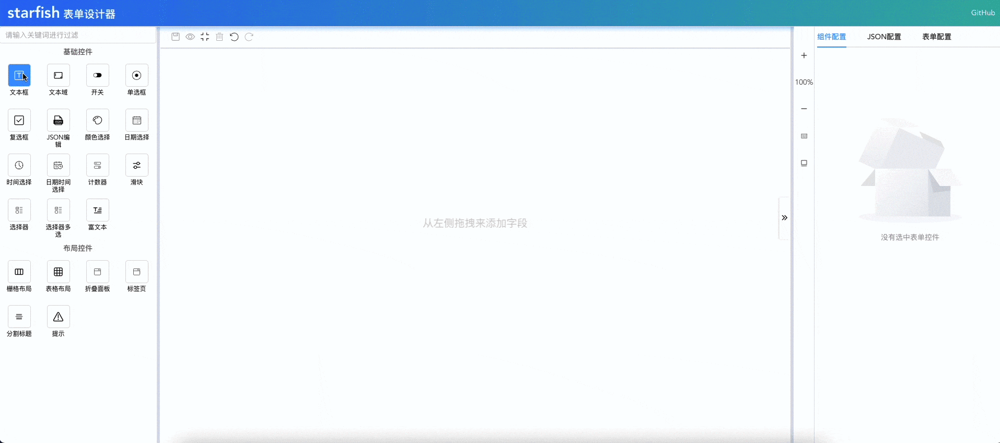
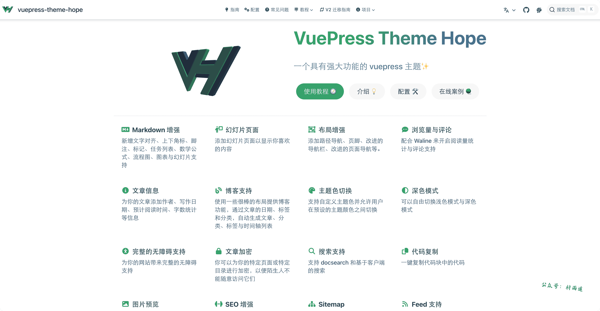
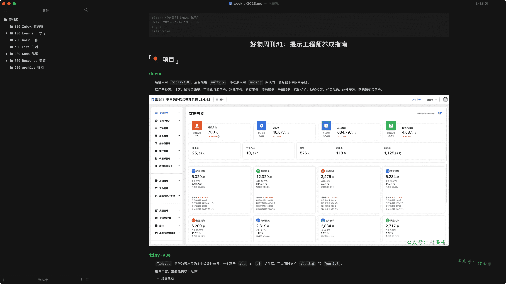
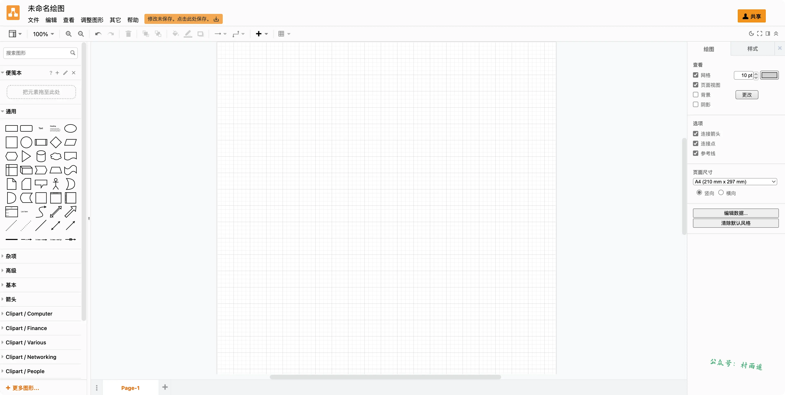
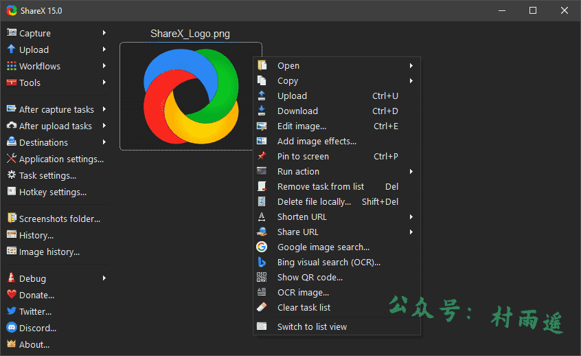
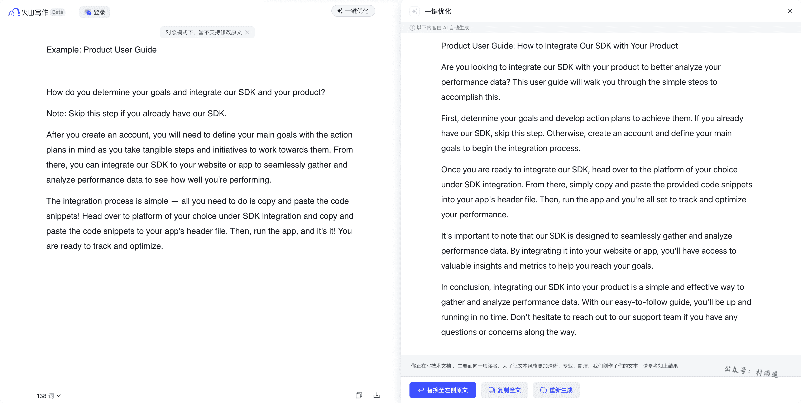
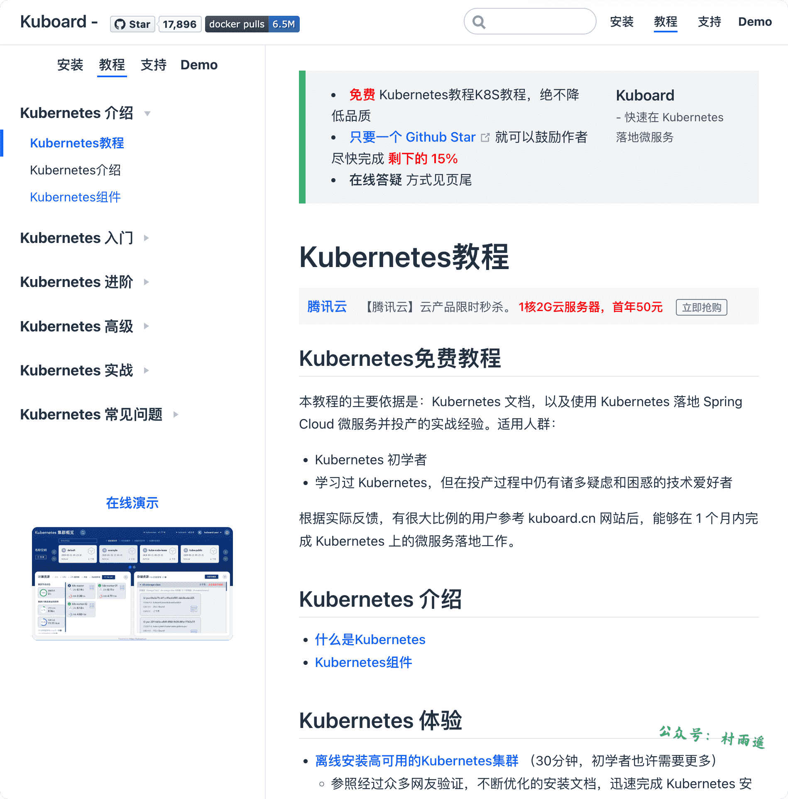
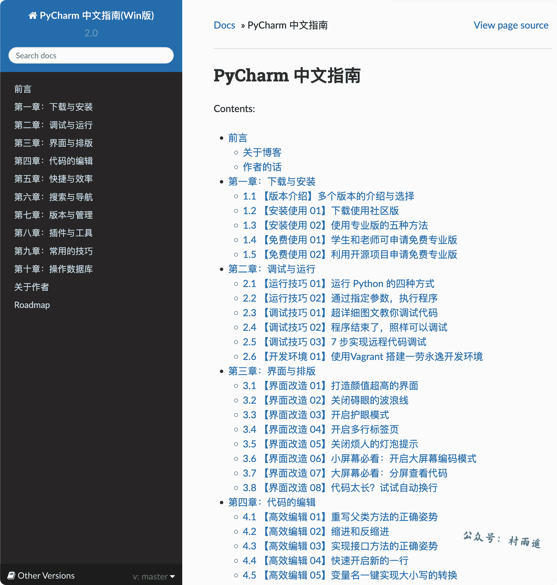
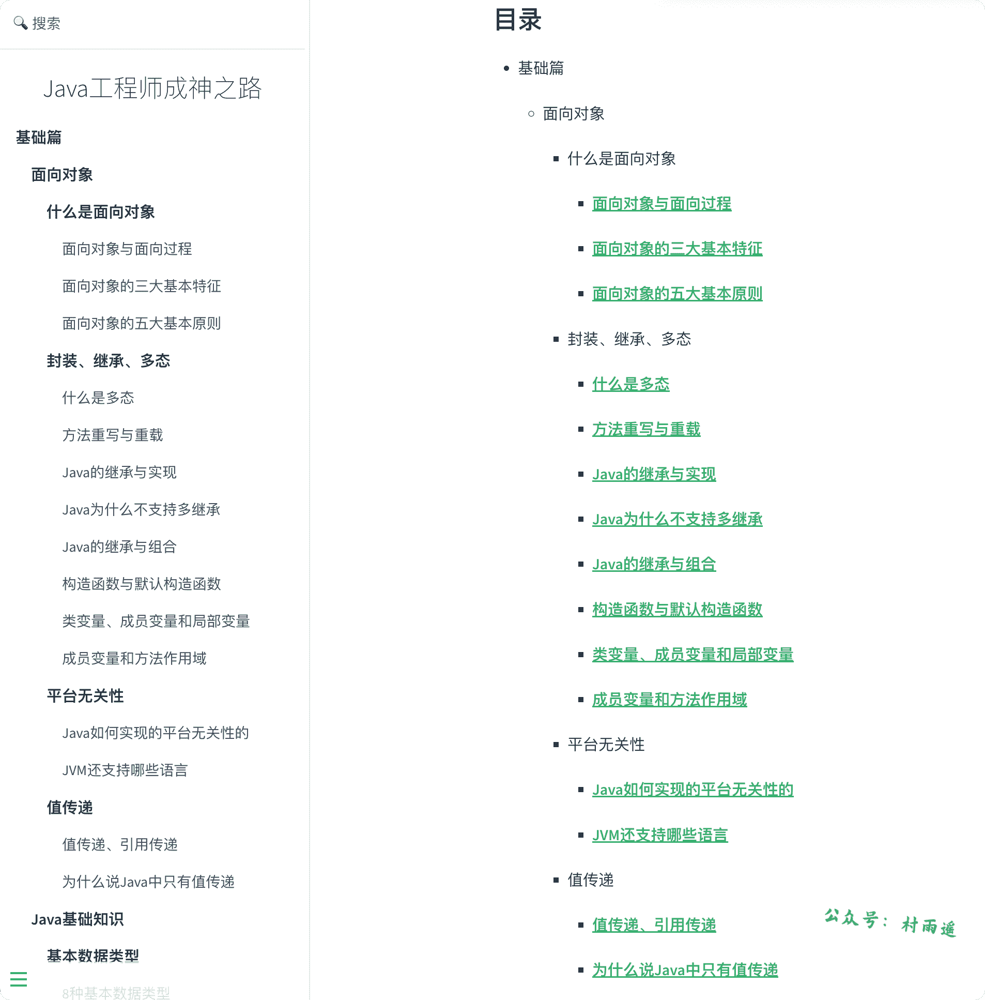

# 好物周刊#2：AI 写作助手

::: info 共勉
不要哀求，学会争取。若是如此，终有所获。
:::
::: tip 原文
https://mp.weixin.qq.com/s/PjyWCciDJoxW83N_MY92Dw
:::

## 一、项目

### 1. [vue-fabric-editor](https://github.com/nihaojob/vue-fabric-editor)

基于 `fabric.js` 和 `Vue` 的图片编辑器，可自定义字体、素材、设计模板。

目前已支持以下功能：

-   导入 `JSON` 文件
-   保存为 `PNG`、`SVG`、`JSON` 文件
-   插入 `SVG`、图片文件
-   多元素水平、垂直对齐方式
-   字体模板
-   组合/拆分组合
-   图层及顺序调整
-   撤销/重做
-   背景属性设置
-   外观属性/字体属性/描边/阴影
-   自定义字体
-   自定义模板素材
-   快捷键
-   右键菜单
-   辅助线
-   标尺
-   图片替换
-   图片滤镜
-   国际化

### 2. [starfish-vue3-lowcode](https://github.com/haixin-fang/starfish-vue3-lowcode)

`Vue3` 可视化低代码表单设计器，方便快捷的完成各类表单设计！

基于 `TypeScript` 开发，支持 `Vue3.0 API`。

### 3. [vuepress-theme-hope](https://github.com/vuepress-theme-hope/vuepress-theme-hope)

一个功能强大的 `vuepress` 主题，支持 `vuepress V1.0` 和 `V2.0` 版本，支持文档站和博客两种形式，目前仍在活跃更新中。除开支持 `vuepress` 默认功能之外，还具备以下特色功能：

-   `Markdown` 增强
-   幻灯片页面
-   布局增强
-   浏览量和评论
-   文章信息
-   博客支持
-   主题色切换
-   深色模式
-   无障碍支持
-   文章加密
-   搜索支持
-   代码复制
-   图片预览
-   `SEO` 增强
-   `Sitemap`
-   `Feed` 支持
-   `PWA` 支持
-   ……

## 二、软件

### 1. [Typora](https://typoraio.cn/)

一款跨平台 `Markdown` 编辑器和阅读器，支持 `macOS`，`Windows` 及 `Linux` 三大平台，也是我写作文章时的软件。毫不夸张地说，它是目前本地 `Markdown` 编辑器的天花板。测试阶段免费，目前已转入收费阶段，89 元买断制，支持三台设备，而且后续升级免费。

具有以下特点：

-   风格极简
-   主题丰富
-   实时预览
-   图片与文字
-   代码块
-   数学公式
-   图表
-   目录大纲
-   文件管理
-   导入与导出 
-   ……

### 2. [diagrams.net](https://app.diagrams.net/)

一个免费的拖放式在线图表工具，允许用户创建流程图、生成网络和实体关系 (`ER`) 图，甚至设计数据库模式。包括其易用性以及与 `GitHub`、`OneDrive` 和 `Google Drive` 等常见平台的无缝集成。全平台支持，同时支持 `Web` 在线，而且支持导出到本地，不用担心数据隐私问题。在我其他文章中的一些图，基本都是用它来画的。

### 3. [ShareX](https://getsharex.com/)

一款支持截图、文件分享、图片上传的生产力工具，不过目前仅支持 `Windows` 平台。

具有如下特点：

-   完全开源免费
-   轻巧却不失强大
-   无广告
-   支持录制 `Gif`
-   支持多种截图方式（全屏、活动窗口、自定义、窗口菜单、滚动……）
-   支持截图后的后续任务（贴图、打印、编辑、保存到文件、上传、`OCR`、粘贴到剪贴板、扫描二维码……）
-   ……

## 三、网站

### 1. [白描](https://web.baimiaoapp.com/)

一个高效准确的 `OCR` 文字识别、翻译与文件扫描工具，主要支持以下功能：

-   图片文字提取
-   数字公式识别
-   电子表格识别
-   扫描 `PDF` 转文字
-   证件扫描
-   ……

目前普通用户每日限制 5 次识别次数，批量识别次数限制为 1 次，每日翻译不超过 3 次且每次翻译字数不超过 1000 字。而普通会员（付费 30 元）识别次数无限制，批量识别次数限制为 3 次，每日翻译不超过 3 次且每次翻译字数不超过 1000 字，而且一次付费永久有效，多设备同步。黄金会员（付费 40 元）则无以上限制。

### 2. [火山写作](https://www.writingo.net/)

字节跳动最新推出的写作助手，致力于帮助用户提升英语写作能力，更好地与世界沟通。

支持学术论文、邮件、用户手册、个人陈述、学校申请、活动通知等类型的文章。点击一键优化还能让你选择目前在写作的文章类型、文章受众、修改风格、修改篇幅等类型，从而实现更精确的改写。目前，不登录情况下限制免费使用 3 次，有需要的小伙伴可以去试一下效果！

### 3. [Bigjpg](https://bigjpg.com/)

`AI` 人工智能图片无损放大工具。利用最新的人工智能深度学习技术，将图片噪点和锯齿部分进行补充，从而实现图片的无损放大。目前免费版可以上传 `3000 x 3000px` 图片, `5M` 以内，而付费版最大可支持 `50M`。而且登录后还提供 `API`，可以基于它来开发自己的应用。

## 四、插件

### 1. [沙拉查词](https://saladict.crimx.com/)

浏览器聚合词典专业划词翻译插件，具有以下特点：

1.   **词典丰富**

-   精选大量词典，手工打磨排版，涵盖几乎所有领域
-   自动发音，可选不同词典、英美音
-   各个词典支持个性化调整
-   整个网页翻译，谷歌和有道分级网页翻译
-   右键支持更多词典页面直达

2.   **划词方式组合变幻无穷**

- 支持四种划词方式，支持鼠标悬浮取词
- 查词面板可钉住可拖动可输入
- 钉住可以配置不同划词方式

3.   **情境模式快速切换词典组合**

- 每个情境模式下设置相互独立，快速切换

4.   **全键盘操作亦可**

- 支持设置浏览器快捷键
- 兼容 Vimium 全键盘操作
- 三按 ctrl 打开快捷查词
- 点击地址栏图标快速查词（可设快捷键）

5.   **单词管理**

- 保存上下文以及翻译，准确理解单词

6.   **支持添加生词**

- 可保存查词历史

7.   **支持黑白名单**
8.   **支持 PDF 划词**

- 支持 PDF 黑白名单

9.   **可显示当前页面二维码**

### 2. [简悦](https://simpread.pro/)

提供如杂志版沉浸式阅读体验的浏览器插件，提供以下特色功能：

-   阅读模式
-   聚焦模式
-   丰富的导出功能
-   快捷键
-   定制化
-   同步
-   主题丰富
-   标注
-   ……

### 3. [Markdown Here](https://markdown-here.com/get.html)

通过使用该插件，可以用 `Markdown` 来写一封漂亮的电子邮件。通常邮件都是没有格式的，通过该插件，可以实现将 `Markdown` 语法的邮件转换为想要的效果。

而使用步骤也很简单：

1.   在邮件客户端的富文本编辑器中编写 `Markdown` 格式的邮件内容。
2.   接着在编辑区右键后选择 `Markdown 转换` 即可。

## 五、资料

### 1. [Kuboard](https://kuboard.cn/)

`Kubernetes` 多集群管理界面，同时提供了 `Kubernetes` 教程，为使用 `Kubernetes`  落地 `Cloud` 微服务的任务提供实战经验。

### 2. [PyCharm 中文指南](https://pycharm.iswbm.com/)

作者使用 `PyCharm` 的多年经验总结，既包含面向初学者零基础的入门使用技巧，也提供了大量案例来讲解可提高工作效率的高级技巧。

### 3. [toBeTopJavaer](https://github.com/hollischuang/toBeTopJavaer)

`Java` 工程师成神之路，作者是阿里巴巴技术专家 `Hollis`。总结了作为 `Java` 开发者需要掌握的基础知识点，主要包括面向对象、基础数据类型、自动拆装箱、字符串、序列化、反射等知识点，较为全面地覆盖了 `Java` 开发者日常工作中需要用到的大部分基础知识。

目前也已经正式出版，在豆瓣开出了 `8.5` 的评分， 非常值得一读！

## ✍️ 说明

周刊专栏相关信息：

- **项目地址**：[Github](https://github.com/cunyu1943/JavaPark/) | [Gitee](https://gitee.com/cunyu1943/JavaPark/) ，觉得不错麻烦给我一个**Star**，感谢 ❤️
- **浏览地址**：公众号 | [电子书](https://cunyu1943.github.io/) | [电子书（国内）](https://cunyu1943.gitee.io/)

如果你阅读到这里，说明我的工作没有白费。如果你想推荐项目/网站/软件/资源，欢迎提交 **[issue](https://github.com/cunyu1943/JavaPark/issues)** 或者添加我 **个人微信：cunyu1943** 与我交流。

## 🎬️ 广告

作为程序员，掌握数据结构与算法的重要性就不言而喻了。掌握了数据结构与算法，可以说你的编程能力就会有质的飞跃。任凭各种热门技术的如何变化，只要掌握了核心技能，那都可以见招拆招，做一个“赢家”。

专栏共分为 4 个由浅入深的模块：

-   入门篇
-   基础篇
-   高级篇
-   实战篇

作者采用最适合工程师的学习方式，不拘泥于某一特定编程语言，从实际开发场景出发，由浅入深教你学习数据结构与算法的方法，帮你搞懂基本概念和核心理论，深入理解算法精髓，帮你提升使用数据结构和算法思维解决问题的能力。

想要进一步提升自己的竞争力么，那就赶紧加入和我一起学习吧！

## ⏳ 联系

想解锁更多知识？不妨关注我的微信公众号：**村雨遥（id：JavaPark）**。

扫一扫，探索另一个全新的世界。

<Share colorful />