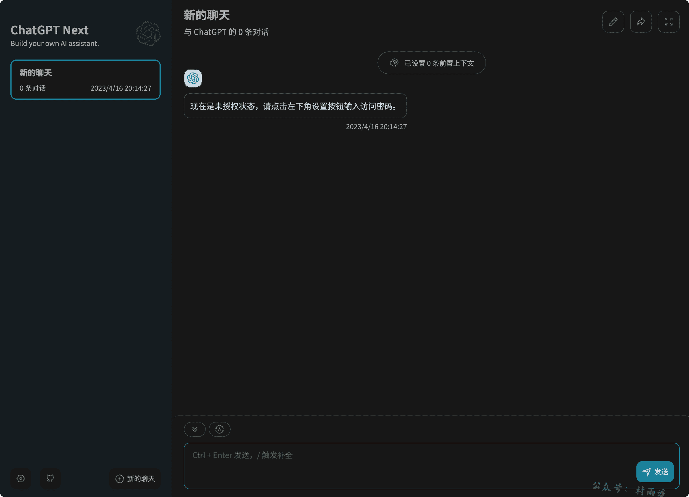
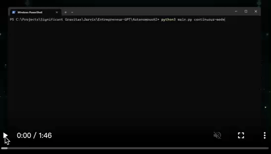
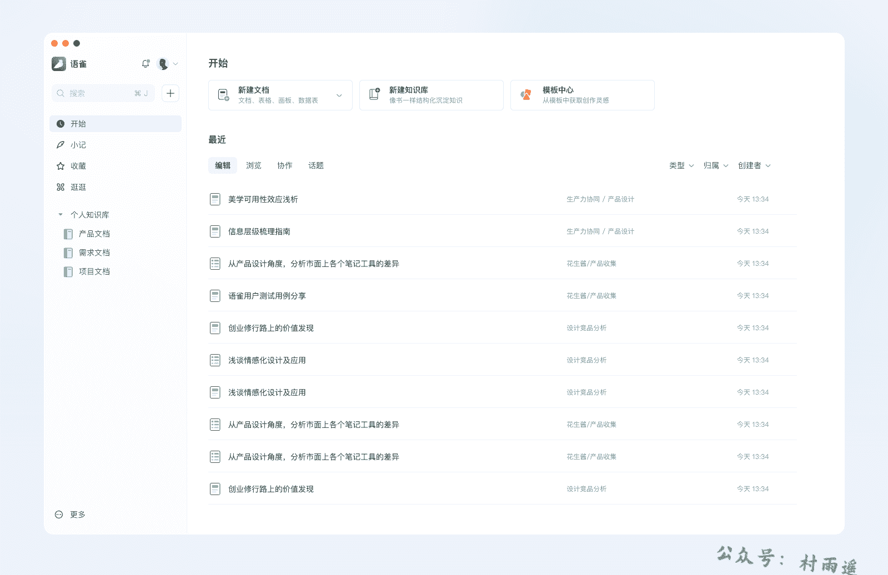
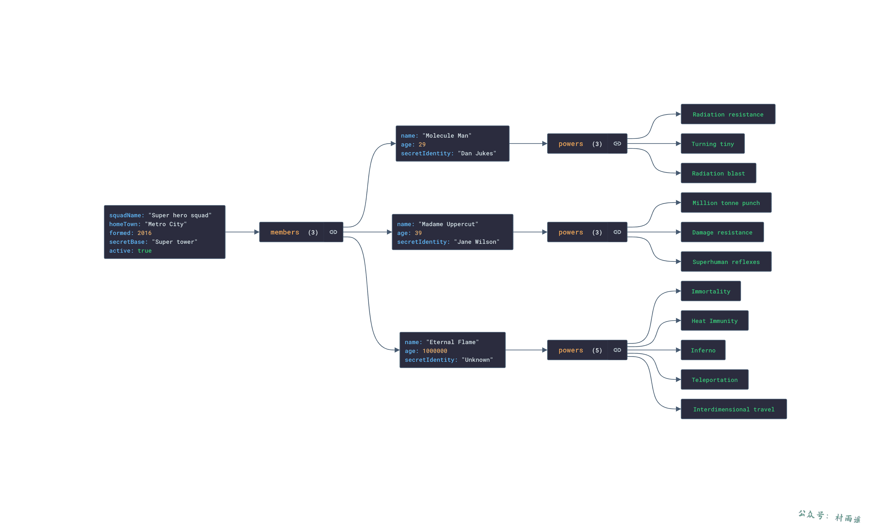
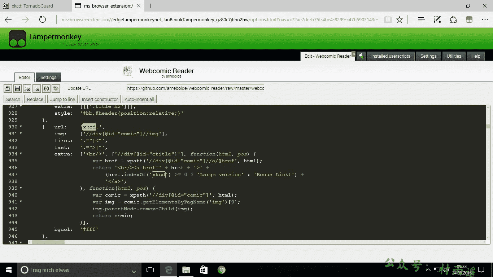
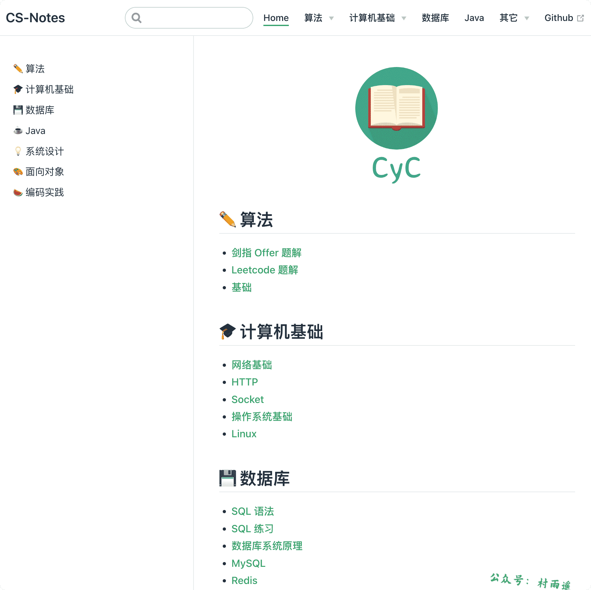
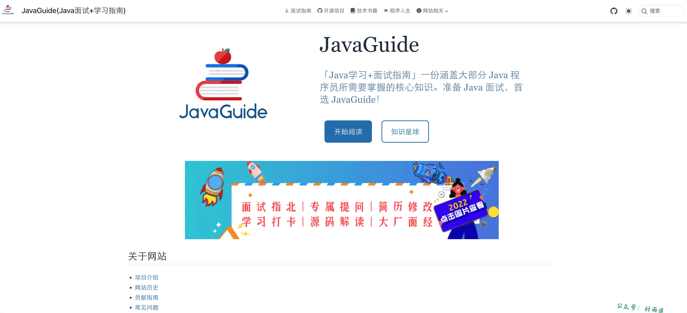
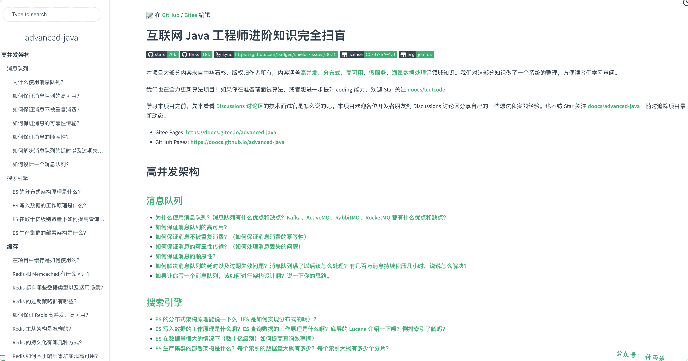

# 好物周刊#3：Java 学习面试指南

::: info 共勉
不要哀求，学会争取。若是如此，终有所获。
:::
::: tip 原文
https://mp.weixin.qq.com/s/vNyT3cSSxUMy9LuD6t91ag
:::

## 一、项目

### 1. [ChatGPT-Next-Web](https://github.com/Yidadaa/ChatGPT-Next-Web)

只要能申请到 `OpenAI API` 的 `key`，就能够通过该项目一键拥有你自己的 `ChatGPT` 网页服务，主要有以下功能：

-   在 1 分钟内使用 `Vercel` **免费一键部署**
-   精心设计的 `UI`，响应式设计，支持深色模式，支持 `PWA`
-   极快的首屏加载速度（~`100kb`），支持流式响应
-   隐私安全，所有数据保存在用户浏览器本地
-   海量的内置 `prompt` 列表
-   自动压缩上下文聊天记录，在节省 `Token` 的同时支持超长对话
-   一键导出聊天记录，完整的 `Markdown` 支持
-   拥有自己的域名？好上加好，绑定后即可在任何地方无障碍快速访问

### 2. [Auto-GPT](https://github.com/Significant-Gravitas/Auto-GPT)

一个实验性的开源项目，展示了 `GPT-4` 语言的模型。该项目由 `GPT-4` 驱动，将 `LLM` 的“思想”链接在一起，以自主地实现设定的任何目标。作为 `GPT-4` 完全自主运行的第一个例子，拓展了 `AI` 的可能性。

主要特性如下：

- 可用于搜索和信息收集的网络接入
- `LSTM` 管理
- 基于 `GPT-4` 的文本生成实例
- 接入主流网站和平台
- 利用 `GPT-3.5` 进行文件存储和摘要

### 3. [AgentGPT](https://github.com/reworkd/AgentGPT)

类似于 `ChatGPT-Next-Web`，拥有自己的 `OpenAI API` 的 `key` 之后，就能通部署自己的 `AI` 助理。该项目基于 `NextJs` + `Typescript` 技术栈开发，不仅支持自己手动部署，还支持 `Docker`，可以说是十分方便了！

## 二、软件

### 1. [语雀](https://www.yuque.com/)

新一代知识构建与分享工具。「语雀」是蚂蚁集团旗下的文档与知识库工具，源自蚂蚁集团和阿里巴巴内部文档协同需求，2018 年 1 月 8 日正式对外提供服务，现已服务于数十万企业组织和数百万个人用户。

官方愿景从最初的为了给开发者提供一个好用的工具来撰写技术文档，逐渐发展为致力为每个人和团队提供一款顺手的工具，让知识得以记录、沉淀和交流，让大家都能在语雀中平等快乐地创作与交流知识。

### 2. [EV 录屏](https://www.ieway.cn/evcapture.html)

一款免费无水印，集视频录制与直播功能于一身的桌面录屏软件。

官方号称无水印、无限制，想录就录！承诺以下功能使用无限制，永久免费：

1.   组合录制
2.   音频采集
3.   场景编辑
4.   直播推流
5.   定时录制

### 3. [极简笔记](https://minnote.v8cloud.cn/index.html)

一款现代化的 `Markdown` 笔记软件，能够在 `Windows`、`Linux`、`Mac` 系统、`iPhone` 以及安卓平台进行数据同步。

分为基础版和 `Pro` 版，`Pro` 版本订阅一个月需 `$1.5` ，订阅一年仅需 `$15`.相比于基础版，提供更好的数据安全服务，具体功能如下：

1.  提供数据自动保存、笔记快照功能。
2.  提供笔记导入导出功能，一键导出所有笔记到本地。
3.  多样化的主题功能，能够选择更多的主题，并能够定制主题。
4.  使用插件功能，能够自己编写插件，且能够使用别人共享的插件。

## 三、网站

### 1. [唐人街影视](https://www.tangrenjie.tv/)

致力于为海外华人提供影视观看的网站，站点不提供任何视听上传服务，所有内容均来自互联网其他分享站所提供的公开引用资源。

### 2. [JSON Crack](https://jsoncrack.com/editor)

`JSON Crack` 是一个很方便的 `JSON` 数据可视化工具。该项目并非简单的展示 `JSON` 数据，而是将其转化为类似思维导图的形式，支持放大/缩小、展开/收缩、搜索节点、导出图片等操作，对于经常和 `JSON` 格式的数据打交道的人会非常有帮助。

### 3. [jsDelivr](https://www.jsdelivr.com/)

`JSDelivr` 是一款开源的免费公共 `CDN`，是目前第二受欢迎的公共 `CDN`，并在 2020 年 10 月 14 日称为 `Bootstrap` 的官方 `CDN`，其稳定性不言而喻。

## 四、插件

### 1. [Tampermonkey](https://microsoftedge.microsoft.com/addons/detail/tampermonkey/iikmkjmpaadaobahmlepeloendndfphd)

中文名又叫油猴，是一个用户脚本管理器。它本身是无法为我们发挥什么作用的，它主要依靠各大社区编写的扩展脚本（`JavaScript` 代码）运行在浏览器上，来改变被访问网页的功能，提升我们的网页浏览体验 。

### 2. [Violentmonkey](https://violentmonkey.github.io/)

暴力猴是一款与 `Tampermonkey` 齐名的浏览器插件管理工具，为浏览器提供用户脚本支持。 它适用于支持 `WebExtensions` 的浏览器。支持 `Userscripts.org`、`GreasyFork`、`OpenUserJS` 三大脚本下载源，拥有丰富实用的油猴脚本。

插件特点：

1.   脚本根据元数据自动更新。
2.   脚本将按照列表中所示的顺序执行。
3.   支持 `GM` 功能。
4.   支持从 `zip` 文件导入和导出。
5.   同步到 `Dropbox` 和 `OneDrive`！

### 3. [蔚蓝主页](https://microsoftedge.microsoft.com/addons/detail/蔚蓝主页/epgghbgfoacieppkngapakodnbkhpldj)

蔚蓝主页是一款浏览器主页/新标签页，主要为用户提供搜索服务、网址导航服务。

区别于传统的主页或网址导航，是一款独特、有所分别的产品。产品核心理念是简洁、存粹，采用了简洁的页面设计，对主要功能加以提炼，让用户能更纯粹的享受该浏览器主页插件所带来的便利。

## 五、资料

### 1. [CS-Notes](https://github.com/CyC2018/CS-Notes)

技术面试必备，囊括算法、操作系统、网络、面向对象、数据库、`Java`、系统设计、工具、编码实践等诸多方面的内容，截止本文发布时在 `Github` 已经收获了 163k `star`，足以见得大家对它的认可。

### 2. [JavaGuide](https://github.com/Snailclimb/JavaGuide)

`Java` 学习+面试指南，一份涵盖大部分 `Java` 程序员所需要掌握的核心知识。主要有以下方面的知识点总结：

-   Java
-   计算机基础
-   数据库
-   开发工具
-   常用框架
-   系统设计
-   分布式
-   高性能
-   高可用
-   ……

截止本文发布时，已经在 `Github` 收获 133k `star`，比起 `CS-Notes` 也是不遑多让。

### 3. [advanced-java](https://github.com/doocs/advanced-java)

互联网 `Java` 工程师进阶知识完全扫盲：涵盖高并发、分布式、高可用、微服务、海量数据处理等领域知识。截止本文发布时，已经在 `Github` 收获 69k `star`。

---

## ✍️ 说明

周刊专栏相关信息：

- **项目地址**：[Github](https://github.com/cunyu1943/JavaPark/) | [Gitee](https://gitee.com/cunyu1943/JavaPark/) ，觉得不错麻烦给我一个**Star**，感谢 ❤️
- **浏览地址**：公众号 | [电子书](https://cunyu1943.github.io/) | [电子书（国内）](https://cunyu1943.gitee.io/)

如果你阅读到这里，说明我的工作没有白费。如果你想推荐项目/网站/软件/资源，欢迎提交 **[issue](https://github.com/cunyu1943/JavaPark/issues)** 或者添加我 **个人微信：cunyu1943** 与我交流。

---

## 🎬️ 广告

作为程序员，掌握数据结构与算法的重要性就不言而喻了。掌握了数据结构与算法，可以说你的编程能力就会有质的飞跃。任凭各种热门技术的如何变化，只要掌握了核心技能，那都可以见招拆招，做一个“赢家”。

专栏共分为 4 个由浅入深的模块：

-   入门篇
-   基础篇
-   高级篇
-   实战篇

作者采用最适合工程师的学习方式，不拘泥于某一特定编程语言，从实际开发场景出发，由浅入深教你学习数据结构与算法的方法，帮你搞懂基本概念和核心理论，深入理解算法精髓，帮你提升使用数据结构和算法思维解决问题的能力。

想要进一步提升自己的竞争力么，那就赶紧加入和我一起学习吧！

## ⏳ 联系

想解锁更多知识？不妨关注我的微信公众号：**村雨遥（id：JavaPark）**。

扫一扫，探索另一个全新的世界。

<Share colorful />