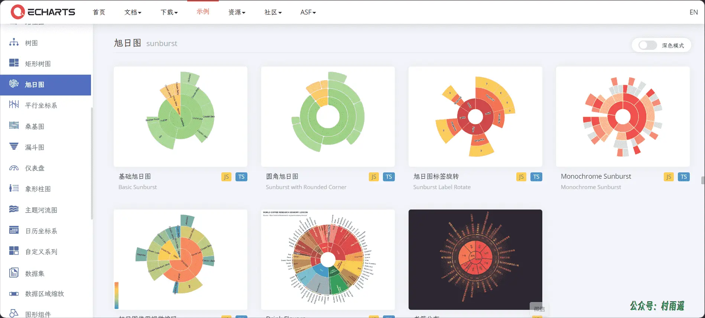
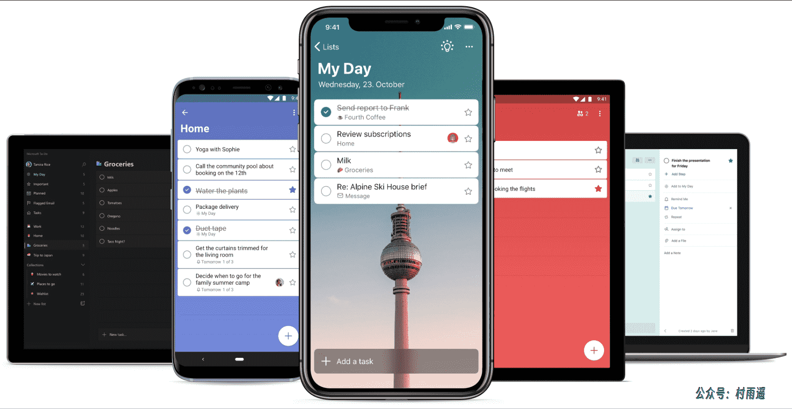
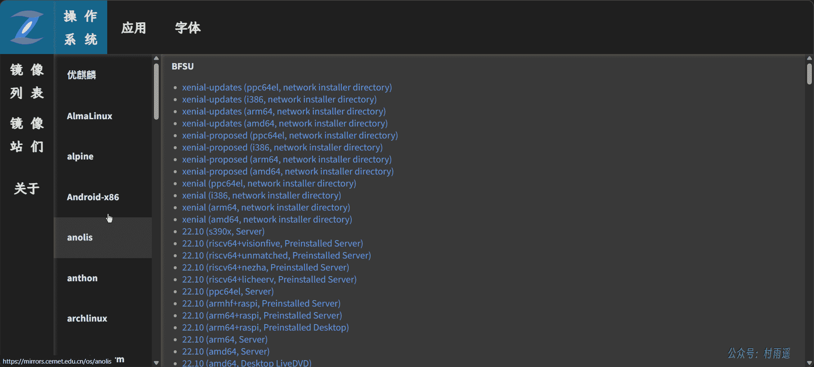
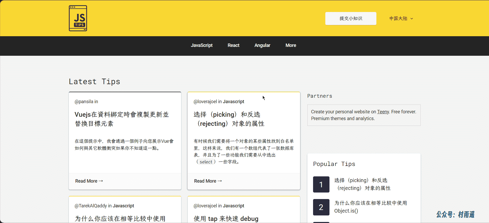
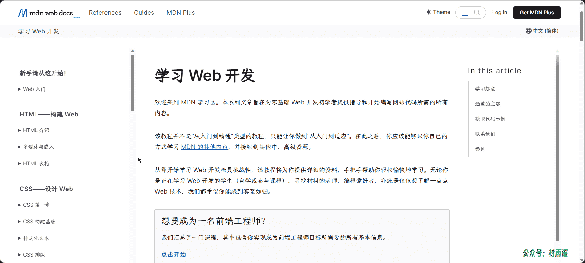
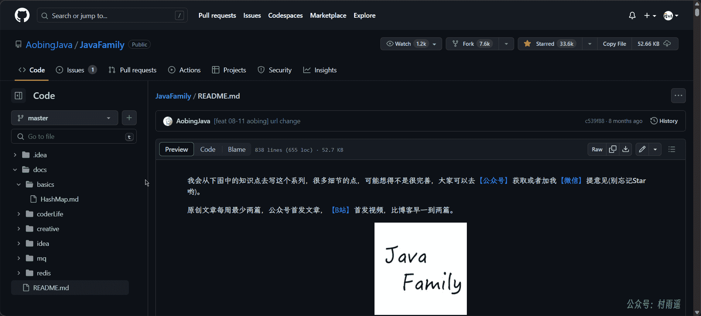

# 好物周刊#4：每天一条 JS 小技巧

::: info 共勉
不要哀求，学会争取。若是如此，终有所获。
:::
::: tip 原文
https://mp.weixin.qq.com/s/Tg3n71-R2ya4go_W1imIgw
:::

## 一、项目

### 1. [hexo-theme-butterfly](https://github.com/jerryc127/hexo-theme-butterfly)

一款基于 `Hexo` 的主题，美观而又不失强大，支持以下功能：

-   卡片化设计
-   支持二级目录
-   双栏设计
-   夜间模式
-   阅读模式
-   简繁体切换
-   `Pjax`
-   搜索
-   ……

### 2. [ECharts](https://echarts.apache.org/zh/index.html)

最初由百度开源的一个基于 `JavaScript` 的开源可视化图表库，后于 2018 年捐赠给 `Apache` 基金会。最新推出的 `Apache ECharts 5` 通过五大模块、十五项特性的全面升级，围绕可视化作品的叙事表达能力，让图“表”更能传“达”数据背后的故事，帮助开发者更轻松地创造满足各种场景需求的可视化作品。

五大模块，十五项特性分别是：

1.   **动态叙事**
     -   动态排序图
     -   自定义系列动画
2.   **视觉设计**
     -   默认设计
     -   标签
     -   时间轴
     -   提示框
     -   仪表盘
     -   扇形圆角
3.   **交互能力**
     -   状态管理
     -   性能提升
4.   **开发体验**
     -   数据集
     -   国际化
     -   `TypeScript` 重构
5.   可访问性
     -   主题配色
     -   贴花图案

### 3. [Magic Coder](http://www.magicalcoder.com/)

低代码应用开发平台，面向零基础、拖拽式、可视化，甚至零基础的人员都能搭建出想要的效果。

## 二、软件

### 1. [SuperCom](https://github.com/SuperStudio/SuperCom)

超级串口调试工具，用于 `Window` 串口日志的采集、存储、可视化等功能，最重要的是免费开源，具有以下特点：

-   可同时打开多个串口监听
-   串口日志自动保存
-   串口日志支持滚屏/固定
-   波特率、位大小等串口设置可设置
-   可发送各种 `AT` 指令
-   ……

### 2. [Alfred](https://www.alfredapp.com/)

`Alfred` 是一款屡获殊荣的 `macOS` 应用程序，它通过热键、关键字、文本扩展等提高您的效率。搜索您的 `Mac` 和网络，并通过自定义操作来控制您的 `Mac`，从而提高工作效率。

### 3. [Microsoft Todo](https://todo.microsoft.com/)

微软 `Todo` 是微软官方出品的一款轻量和智能的待办清单应用，它是 `Wunderlist` 的继任者，无论是工作计划，个人生活或家庭学习，它都一样可以帮助你更轻松地完成既定的计划。应用还支持 `iPhone`、安卓、`Windows` 和网页间无缝同步，多个设备也不必担心。

## 三、网站

### 1. [校园网联合镜像站](https://mirrors.cernet.edu.cn/)

站点提供对校园网镜像站的索引和跳转服务，仅索引各镜像站的元数据信息，具体内容由各镜像站提供，而且站点还获得了中国教育和科研计算机网网络中心的支持和帮助。

主要包含了操作系统、应用以及字体三方面资源的镜像，让下载更快一步！

### 2. [Web 前端导航](http://www.alloyteam.com/nav/)

汇集了众多前端资源的导航，主要包含了以下资源：

-   `IDE`
-   图标字体
-   在线工具
-   框架类库
-   前端门户
-   前端大会
-   开发平台
-   设计资源
-   ……

### 3. [Badger](https://badges.toozhao.com/)

为你的网站生成独一无二的 `SVG` 图片，只要将该图片放到你网站的对应界面，就能通过它统计出该页面被访问的次数，一般用在 `Github` 主页统计访客数。

## 四、插件

### 1. [Microsoft 编辑器](https://microsoftedge.microsoft.com/addons/detail/microsoft-编辑器拼写和语法检查器/hokifickgkhplphjiodbggjmoafhignh?hl=zh-CN)

你的智能写作助手。编辑器跨多个网站提供语法、拼写和风格建议，帮助你自信地写出清晰、简洁的文章和电子邮件。

- 新增功能: 多语言校对、忽略选项。同时检查最多三种语言的拼写和语法。此外，拼写检查现在可用于泰语。还可通过选择“全部忽略”来轻松跳过所有拼写更正，或通过选择“忽略”跳过不需要的语法建议。
- 智能写作助手：提供免费的语法、拼写和标点校对基础支持。通过高级版(需要 `Microsoft 365` 订阅)，可在清晰度、简洁性、正式性、词汇等问题上获得高级语法建议和风格检查。
- 随时随地写作：在 `LinkedIn`、`Gmail`、`Facebook` 以及诸多其他你喜欢的带有此浏览器扩展的网站上获取写作助手。如果希望在 `Web` 之外获得编辑器的帮助，请打开 `Word` 并查找编辑器图标，以了解编辑器如何在你撰写文档和电子邮件时提供帮助。
- 提供多种语言：编辑器检查 `80` 多种语言的拼写，并提供以这些语言的语法检查和书写风格改进。

### 2. [Infinity Pro](https://microsoftedge.microsoft.com/addons/detail/infinity-新标签页-pro/hajlmbnnniemimmaehcefkamdadpjlfa?hl=zh-CN)

全球上百万用户选择的最佳新标签页，功能包括：网站图标，搜索引擎，高清壁纸，书签管理、天气、笔记、待办事项、扩展管理、历史记录等。
`Infinity` 新标签页 (`Pro`) 是一款基于 `html5` 开发的扩展程序，它能够替换浏览器的起始页与新标签页，提升其美观性与生产力。

`Infinity` 独创了多种强大且实用的功能，可以让您以任何喜欢的方式来打造新标签页。

### 3. [Dark Reader](https://microsoftedge.microsoft.com/addons/detail/dark-reader/ifoakfbpdcdoeenechcleahebpibofpc?hl=zh-CN)

一个护眼扩展程序，通过实时生成黑暗主题，为每一个网站启用夜间模式。`Dark Reader` 反转明亮的颜色，使网页内容具有高对比度并易于在夜间阅读。

可以调整亮度、对比度，应用棕褐色滤镜、黑暗模式，设置字体和忽略的网站列表。

最重要的一点，`Dark Reader` 无广告，也不会向任何地方发送用户的数据。

## 五、资料

### 1. [Js Tips](https://www.jstips.co/)

每天一条 `JavaScript` 小技巧。只需要花上两分钟的时间，就能读到性能、框架、约定、技巧、面试问题等有助于提高编写代码效率的小技巧。

### 2. [MDN Web Docs](https://developer.mozilla.org/zh-CN/docs/Learn)

为零基础 `Web` 开发初学者提供指导和开始编写网站代码所需要掌握的所有内容。内容更偏向于帮助你入门，如果想要学习更加深入的内容，那就需要靠自己去钻研了。

### 3. [JavaFamily](https://github.com/AobingJava/JavaFamily)

【`Java` 面试 + `Java` 学习指南】 一份涵盖大部分 `Java` 程序员所需要掌握的核心知识。包含学习路线、`Java` 基础、计算机操作系统、计算机网络、框架、数据库等多方面的内容。

---

## ✍️ 说明

周刊专栏相关信息：

- **项目地址**：[Github](https://github.com/cunyu1943/JavaPark/) | [Gitee](https://gitee.com/cunyu1943/JavaPark/) ，觉得不错麻烦给我一个**Star**，感谢 ❤️
- **浏览地址**：公众号 | [电子书](https://cunyu1943.github.io/) | [电子书（国内）](https://cunyu1943.gitee.io/)

如果你阅读到这里，说明我的工作没有白费。如果你想推荐项目/网站/软件/资源，欢迎提交 **[issue](https://github.com/cunyu1943/JavaPark/issues)** 或者添加我 **个人微信：cunyu1943** 与我交流。

---

## 🎬️ 广告

当前大环境下，就业形势严峻，尤其针对即将毕业的大学生。作为一个技术求职者，求职前应该做好哪些准备呢，一些面试实战技巧也十分有必要！而刚好最近掘金出了一本《技术人求职指南》小册，相信一定会对在找工作的你有所帮助。

从求职到拿下 `Offer`，一本职场的全方位攻略，快来和我一起学习吧！

## ⏳ 联系

想解锁更多知识？不妨关注我的微信公众号：**村雨遥（id：JavaPark）**。

扫一扫，探索另一个全新的世界。

<Share colorful />