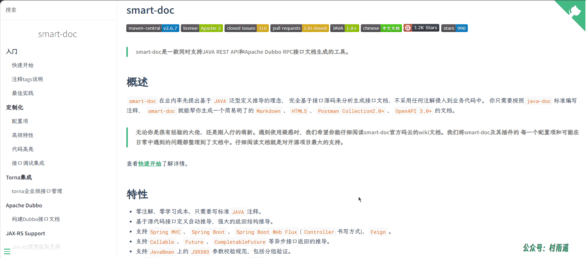
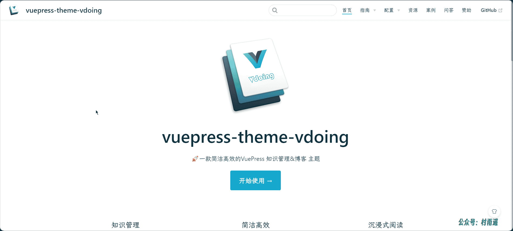
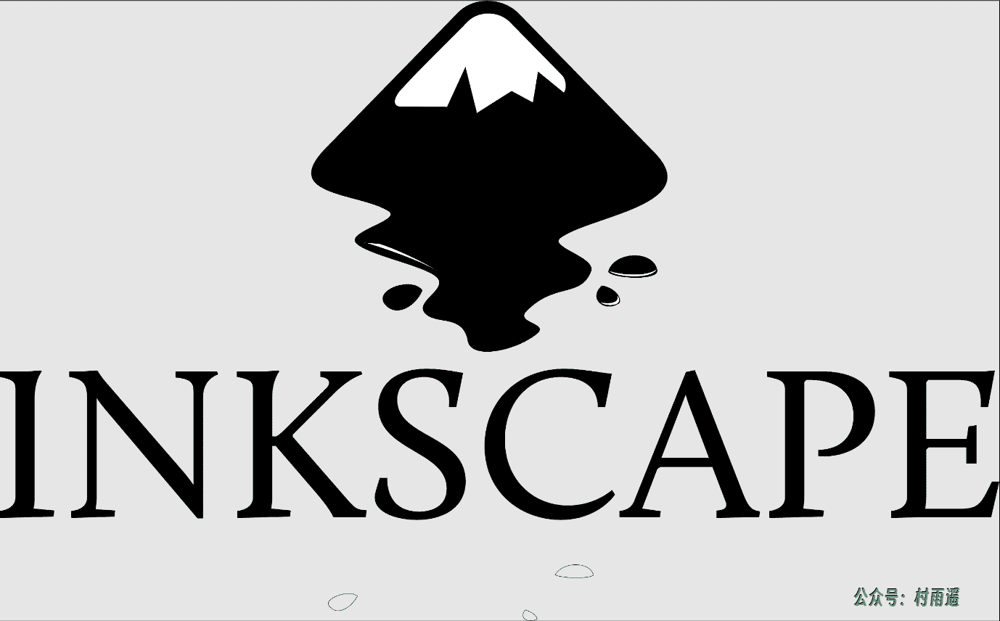
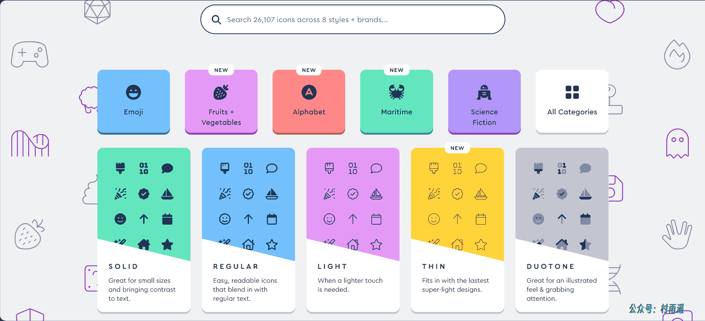
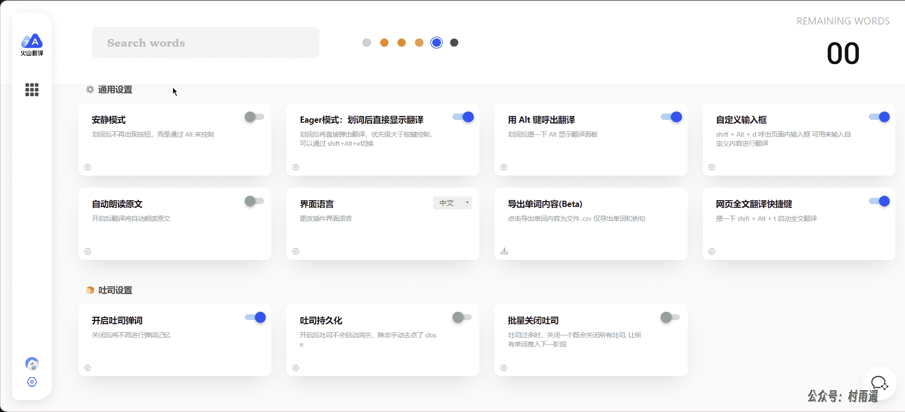
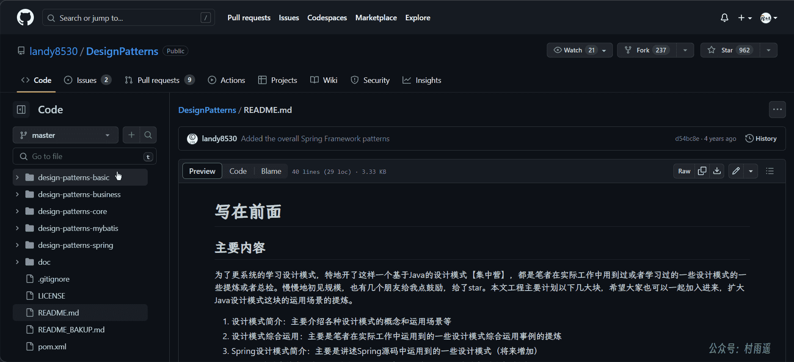
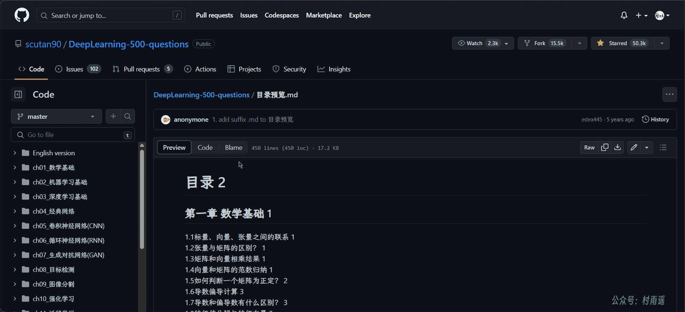

# 好物周刊#5：前端开发必备资源站

::: info 共勉
不要哀求，学会争取。若是如此，终有所获。
:::
::: tip 原文
https://mp.weixin.qq.com/s/kbKCzyn7OtG4iuJEWtQkWA
:::

## 一、项目

### 1. [FastAPI](https://fastapi.tiangolo.com/zh/)

`FastAPI` 是一个用于构建 `API` 的现代、快速（高性能）的 `web` 框架，使用 `Python` 3.6+ 并基于标准的 `Python` 类型提示。关键特性如下:

-   **快速**：可与 `NodeJS` 和 `Go` 并肩的极高性能（归功于 `Starlette` 和 `Pydantic`），是最快的 `Python web` 框架之一。
-   **高效编码**：提高功能开发速度约 `200％` 至 `300％`。
-   **更少 `bug`**：减少约 40％ 的人为（开发者）导致错误。
-   **智能**：极佳的编辑器支持。处处皆可自动补全，减少调试时间。
-   **简单**：设计的易于使用和学习，阅读文档的时间更短。
-   **简短**：使代码重复最小化。通过不同的参数声明实现丰富功能，`bug` 更少。
-   **健壮**：生产可用级别的代码。还有自动生成的交互式文档。
-   **标准化**：基于（并完全兼容）`API` 的相关开放标准。

### 2. [Smart-Doc](https://github.com/smart-doc-group/smart-doc)

`smart-doc` 是一款同时支持 `JAVA REST API`和 `Apache Dubbo RPC` 接口文档生成的工具，在业内率先提出基于 `Java` 泛型定义推导的理念， 完全基于接口源码来分析生成接口文档，不采用任何注解侵入到业务代码中。你只需要按照 `java-doc` 标准编写注释， `smart-doc` 就能帮你生成一个简易明了的 `Markdown`、`HTML5`、`Postman Collection2.0+`、`OpenAPI 3.0+` 的文档。

### 3. [vuepress-theme-voding](https://github.com/xugaoyi/vuepress-theme-vdoing)

一款简洁高效的 `VuePress` 知识管理 & 博客主题，具有以下三大特点：

1.   **知识管理**：包含三种典型的知识管理形态：结构化、碎片化、体系化。轻松打造属于你自己的知识管理平台。
2.   **简洁高效**：以 `Markdown` 为中心的项目结构，内置自动化工具，以更少的配置完成更多的事。配合多维索引快速定位每个知识点。
3.   **沉浸式阅读**：专为阅读设计的 `UI`，配合多种颜色模式、可关闭的侧边栏和导航栏，带给你一种沉浸式阅读体验。

## 二、软件

### 1. [fnm](https://github.com/Schniz/fnm)

`fnm` 是一个基于 `Rust` 的 `Node.js` 版本管理工具，可用于替换 `Node Version Manager（nvm）`，跨平台支持（`macOS`、`Linux`、`Windows`）。

### 2. [Inkscape](https://inkscape.org/zh-hans/)

一个强大，免费的设计工具
无论你是插画师，设计师，网页设计者还是仅想创作一些矢量图的新手，`Inkscape` 都适合你。

该软件的开发目标是成为强大的绘图软件，且能完全遵循与支持 `XML`、`SVG` 及 `CSS` 等开放性的标准格式，而且是跨平台的应用程序，支持`Windows`、`macOS`、`Linux` 及类 `UNIX` 版等操作系统，具有以下特点：

- 灵活的绘图工具
- 支持多种文件格式
- 强大的文本工具
- 贝塞尔曲线和螺旋线

### 3. [Cubox](https://cubox.pro/)

在信息碎片中，重获专注。
一站式信息收集、阅读、管理和回顾，善用网络碎片构建个人知识库。
适用于网页, `iOS`, `iPadOS`, `macOS`, `Android`, `Windows`, 微信等多个终端。

## 三、网站

### 1. [iconfont](https://www.iconfont.cn/)

阿里巴巴矢量图标库。阿里妈妈 `MUX` 倾力打造的矢量图标管理、交流平台，设计师将图标上传到 `iconfont` 平台，用户可以自定义下载多种格式的 `icon`，平台也可将图标转换为字体，便于前端工程师自由调整与调用。

### 2. [IconPark](https://iconpark.oceanengine.com/)

`IconPark` 图标库是一个通过技术驱动矢量图标样式的开源图标库，由字节开源，可以实现根据单一 `SVG` 源文件变换出多种主题，具备丰富的分类、更轻量的代码和更灵活的使用场景；致力于构建高质量、统一化、可定义的图标资源，让大多数人都能够选择适合自己的风格图标。

### 3. [Font Awesome](https://fontawesome.com/)

`Font Awesome` 是一个基于 `CSS` 和 `LESS` 的字体和图标工具包。它由 `Dave Gandy` 制作，用于 `Twitter Bootstrap`，后来被集成到`BootstrapCDN` 中。`Font Awesome` 在使用第三方 `Font Scripts` 的网站中占有 `20％` 的市场份额，排在 `Google` 字体之后的第二位。

## 四、插件

### 1. [火山翻译](https://microsoftedge.microsoft.com/addons/detail/火山翻译-划词和网页翻译/jmnhemdajboodicneejdlpanmijclhef)

字节跳动旗下机器翻译产品，支持网页全文翻译、划词翻译、英语词典、管理生词本、吐司弹词记忆等丰富能力。

### 2. [WeTab 新标签页](https://microsoftedge.microsoft.com/addons/detail/wetab新标签页/bpelnogcookhocnaokfpoeinibimbeff)

`WeTab` 新标签页整合了 `ChatGPT`,自由使用 `ChatGPT`。
`Wetab` 是一款可以亲手打造属于自己的高颜值主页的小组件新标签页插件，跟 `Infinity New Tab` 新标签页一样美观大气，跟 `iTab` 新标签页一样主打小组件功能。`iOS` 苹果小组件卡片设计，内置倒计时、纪念日、天气、热搜、计算器、等超酷小组件，让信息一目了然，标签页整洁美观。
`Wetab` 好看、好用，还好玩，让你的标签页充满无限可能。

### 3. [MONKNOW 新标签页](https://www.monknow.com/zh-CN)

这是您梦寐以求的新标签页。支持网站网址 `URL` 分组管理，数据实时云同步，黑暗深色夜间主题模式。支持的功能如下：

- 搜索 & 快速拨号。
- 自动同步，只要创建一个账号就能自动同步。
- 图标分组，根据您的需要对您的图标分组。
- 添加自定义图标时，根据网页链接自动匹配官方图标图片。
- 自定义图标，您可以上传 `jpg`，`png`，`svg`，甚至 `gif` 作为您的图标图片。
- 自定义图标布局，您可以设置图标大小，间距，不透明度等等。
- 自定义壁纸，您可以上传 `jpg`，`png` 作为您的壁纸。
- 官方图标库包含数以千计的图标。
- 官方壁纸库包含数以千计的高清壁纸。
- 当您不活跃或每次打开新标签页时，展示待机页。
- 支持浅色和深色两种主题模式。
- 待办事项让您随时保持专注。

## 五、资料

### 1. [DesignPatterns](https://github.com/landy8530/DesignPatterns)

经典设计模式讲解以及项目实战（`Java` 版），主要内容有以下两方面：

1.  设计模式简介：主要介绍各种设计模式的概念和运用场景等。
2.  设计模式综合运用：主要是笔者在实际工作中运用到的一些设计模式综合运用事例的提炼。

### 2. [Java-learning](https://github.com/Tyson0314/Java-learning)

`Java` 相关知识总结，包括 `Java` 基础、`MySQL`、`SpringBoot`、`Mybatis`、`Redis`、`RabbitMQ` 等等，面试必备！

### 3. [深度学习500问](https://github.com/scutan90/DeepLearning-500-questions)

深度学习 `500` 问，以问答形式对常用的概率知识、线性代数、机器学习、深度学习、计算机视觉等热点问题进行阐述，以帮助自己及有需要的读者。 全书分为 `18` 个章节，共计 `50` 余万字。

项目系统地描述了深度学习的基本理论算法及应用，先是论述了数学基础、机器学习基础和深度学习基础，接着介绍了一些经典网络及计算机视觉领域中常用的 `CNN`、`RNN`、`GAN` 等网络结构技术，然后介绍了深度学习在计算机视觉领域的目标检测及图像分割两大应用，最后则是介绍了计算机视觉领域主要的优化方法及思路等，包括迁移学习、网络架构及训练、网络优化技巧、超参数调整及模型的压缩和加速等。

---

## ✍️ 说明

周刊专栏相关信息：

- **项目地址**：[Github](https://github.com/cunyu1943/JavaPark/) | [Gitee](https://gitee.com/cunyu1943/JavaPark/) ，觉得不错麻烦给我一个**Star**，感谢 ❤️
- **浏览地址**：公众号 | [电子书](https://cunyu1943.github.io/) | [电子书（国内）](https://cunyu1943.gitee.io/)

如果你阅读到这里，说明我的工作没有白费。如果你想推荐项目/网站/软件/资源，欢迎提交 **[issue](https://github.com/cunyu1943/JavaPark/issues)** 或者添加我 **个人微信：cunyu1943** 与我交流。

---

## 🎬️ 广告

当前大环境下，就业形势严峻，尤其针对即将毕业的大学生。作为一个技术求职者，求职前应该做好哪些准备呢，一些面试实战技巧也十分有必要！而刚好最近掘金出了一本《技术人求职指南》小册，相信一定会对在找工作的你有所帮助。

从求职到拿下 `Offer`，一本职场的全方位攻略，快来和我一起学习吧！

<Share colorful />