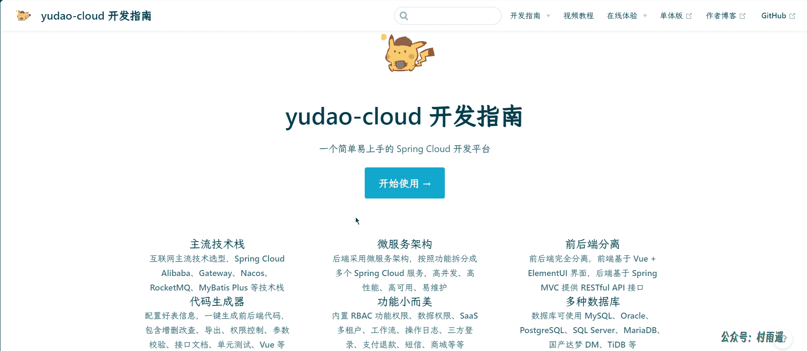
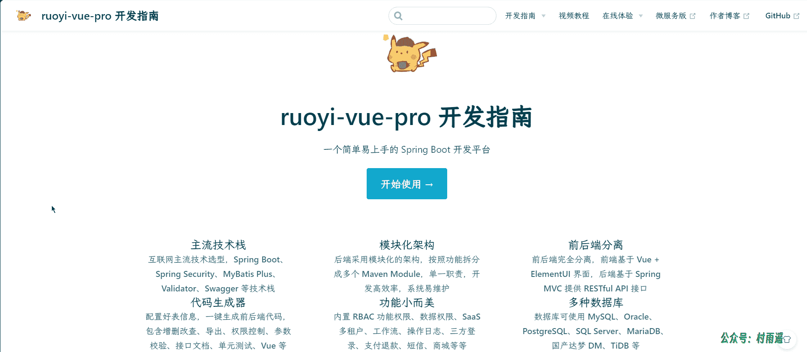
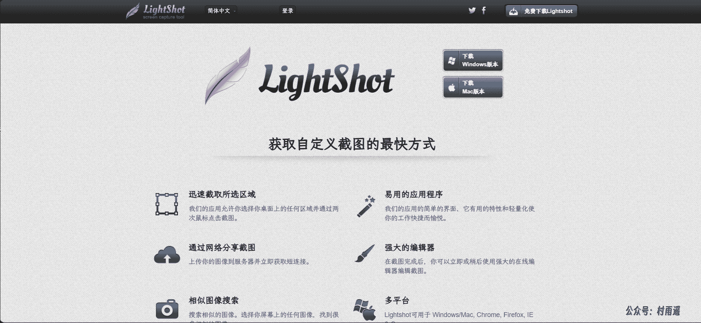
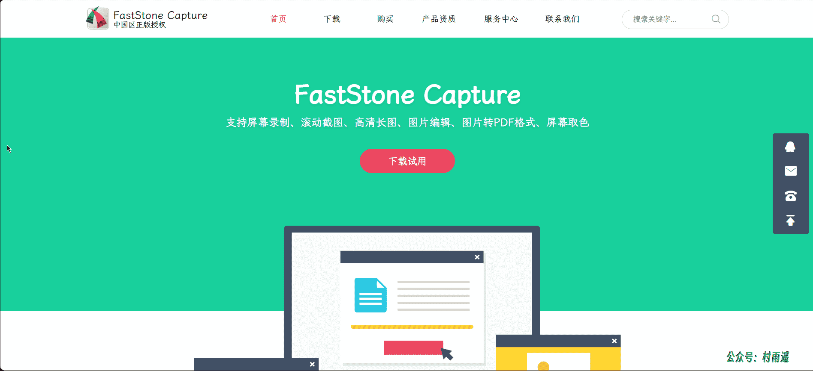
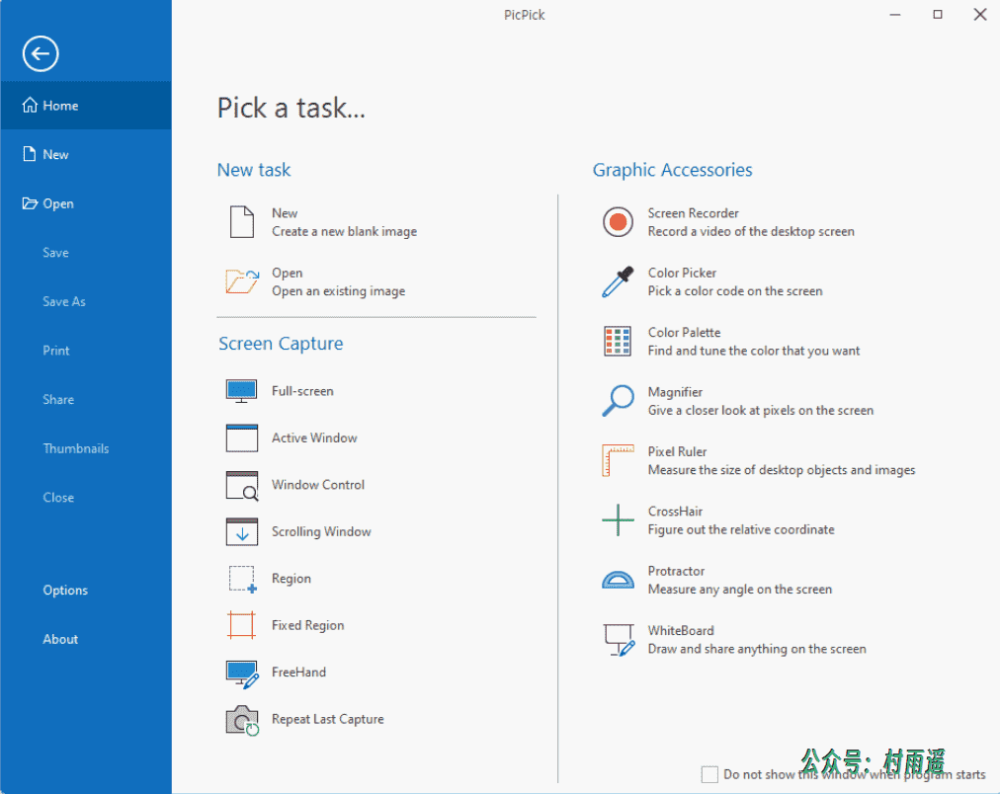
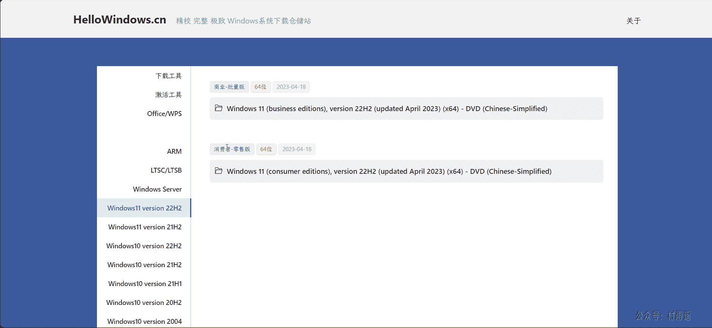
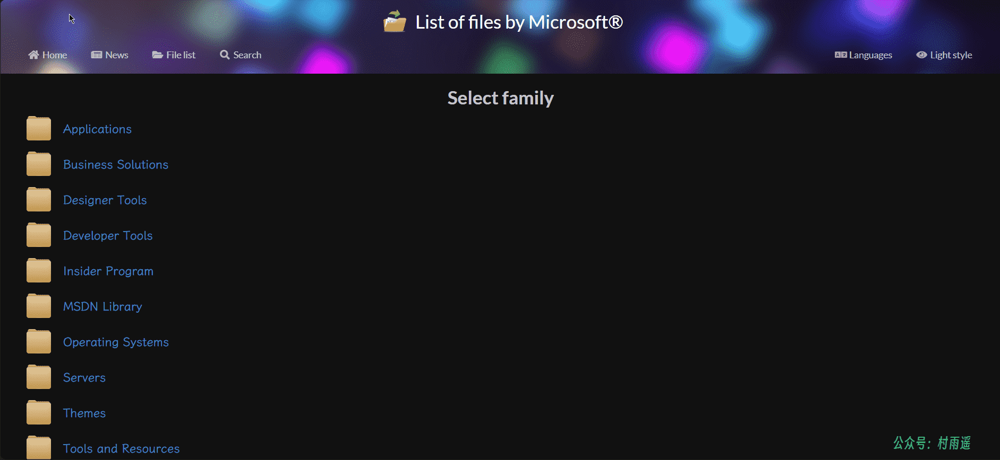
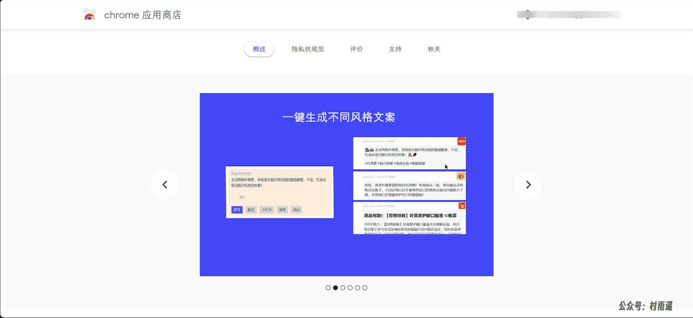
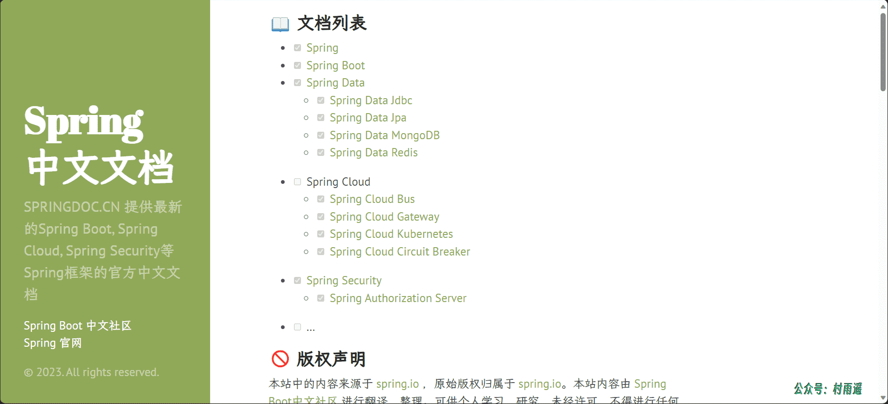
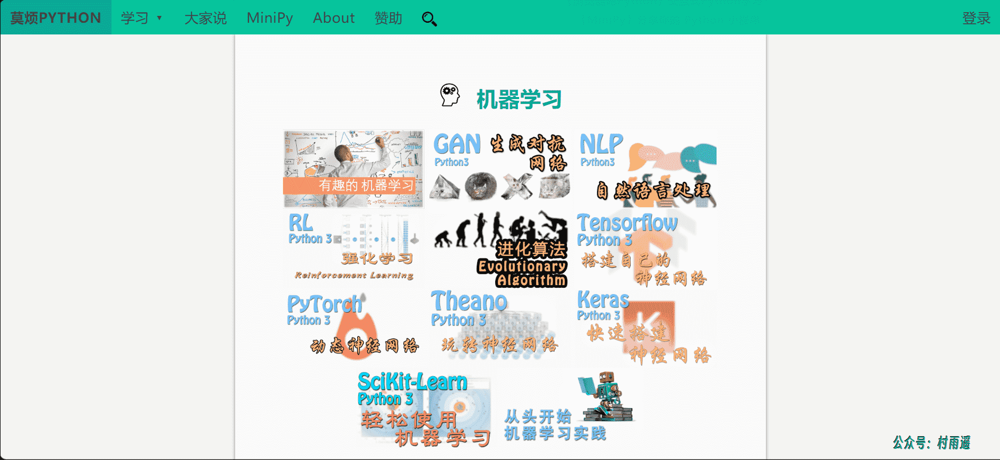

# 好物周刊#6：系统下载最优解

::: info 共勉
不要哀求，学会争取。若是如此，终有所获。
:::
::: tip 原文
https://mp.weixin.qq.com/s/o6aLSsEfFcwgzbwQrKxqYg
:::

## 一、项目

### 1. [Halo](https://halo.run/)

强大易用的开源建站工具，配合上丰富的模板与插件，帮助你构建你心中的理想站点。如果想搭建属于自己的博客，那它不失为一个好的选择。

### 2. [yudao-cloud](https://github.com/YunaiV/yudao-cloud)

`ruoyi-vue-pro` 全新 `Cloud` 版本，优化重构所有功能。基于 `Spring Cloud Alibaba + MyBatis Plus + Vue & Element` 实现的后台管理系统 + 用户小程序，支持 `RBAC` 动态权限、多租户、数据权限、工作流、三方登录、支付、短信、商城等功能。

### 3. [ruoyi-vue-pro](https://github.com/YunaiV/ruoyi-vue-pro)

`RuoYi-Vue` 全新 `Pro` 版本，优化重构所有功能。基于 `Spring Boot + MyBatis Plus + Vue & Element` 实现的后台管理系统 + 微信小程序，支持 `RBAC` 动态权限、数据权限、`SaaS` 多租户、`Flowable` 工作流、三方登录、支付、短信、商城等功能。

## 二、软件

### 1. [LightShot](https://app.prntscr.com/zh-cn/)

`LightShot` 是一款跨平台屏幕截图工具，支持 `macOS` 和 `Windows`。使用它，轻点一下按键，便能存储屏幕上的一切内容。

除了能将图片保存在电脑硬盘中，软件还支持通过 `LightShot` 服务器（免费提供）将截图上传至互联网。

除了自定义截图和图片上传外，软件还支持 `Photoshop` 相类似的工具（支持图层、滤镜、色彩校正、笔刷等功能）在线编辑截图。

### 2. [FastStone Capture](https://www.faststonecapture.cn/)

一款超强大的截图软件，支持多种截图形式，包括捕获活动窗口、捕获窗口/对象、捕获矩形区域、捕获手绘区域、捕获全屏、滚动截屏。

除了截图功能外，软件的图片编辑功能也非常丰富，支持调整大小、绘图、添加标题、图片裁剪、重点突出、模糊等。

### 3. [PicPick](https://picpick.app/zh/)

一款全能的设计工具，并且这款工具适宜每个人使用。

一个全功能的屏幕截图工具,直观的图像编辑器,颜色选择器,颜色调色板,像素标尺,量角器,瞄准线和白板等等。

## 三、网站

### 1. [Hello Windows](https://hellowindows.cn/#)

一个无广告、无登录限制、无收费下载的 `Windows` 系统仓储站，更简单，更直观，更极致。

在这里可以找到全版本的 `Windows` 系统，而且均为官方原版，不用担心携带病毒等其它危害用户的问题。

### 2. [TechBench](https://tb.rg-adguard.net/public.php)

该项目将帮助您无需繁琐的搜索和注册即可直接从 `Microsoft` 服务器下载 `Windows` 操作系统、`Office` 应用程序、语言包和虚拟机。

### 3. [rg-adguard](https://files.rg-adguard.net/)

`TechBench` 的后续版，截止目前 `TechBench` 已不再更新，后续更新都会到这里。除开提供了 `TechBench` 的功能外，还提供了主题、设计工具、应用等方面内容的下载。

## 四、插件

### 1. [听悟](https://www.tingwu.cn/)

实时双语翻译字幕，一键高亮要点，智能提炼总结，高效记录、整理和共享音视频内容。
多种字幕形态随心切换，自动区分发言人，总结关键词、议程、摘要、待办事项和问题。支持一键导出和公开分享。

丰富场景，皆可听悟

-   线上会议：清晰记录沟通细节，智能总结待办、议程，会议信息无损传递
-   面试访谈：自动记录会话内容，智能总结问答、摘要，总结整理高效轻松
-   课程学习：双语课程完整记录，自动提取要点、问答，随时回顾知识点
-   视频浏览：实时双语翻译字幕，英文视频随心看，信息获取更高效

### 2. [AiTuTu ChatGPT侧边栏智能助手](https://chrome.google.com/webstore/detail/aitutu-chatgpt-sidebar-as/emlhccamlobhceppbjdaikinbamncbcl)

`AiTuTu` 是由 `OpenAI` 的 `ChatGPT` 提供支持，支持浏览网站可快速唤醒的人工智能助手；在网页侧边显示，支持自由提问，选中内容一键改写成不同类型文案。

✅ 国内可用，无需科学，无需 `KEY`，欢迎推荐安装！

聊天：在浏览网页时，遇到任何问题，都可以向它提问，包括文案写作、代码生成、问题查找等。 
选中文本快捷操作：浏览网页时，支持将选中的网页文本内容进行以下快捷操作：

1.   在不改变原意的前提下改成新的版本；
2.   翻译成英文；
3.   改写成小红书风格文案；
4.   改写成微博风格文案；
5.   将商品标题、介绍生成新的商品标题简介。

### 3. [字幕精灵](https://microsoftedge.microsoft.com/addons/detail/%E5%AD%97%E5%B9%95%E7%B2%BE%E7%81%B5-%E5%AE%9E%E6%97%B6%E8%AF%AD%E9%9F%B3%E8%AF%86%E5%88%AB%E3%80%81ai%E5%AD%97%E5%B9%95%E7%BF%BB%E8%AF%91/hodednmbnoemidigafhfpbfcafhjlkki?hl=zh-CN)

看海外网剧、学习两不误，新译字幕精灵来相助，基于浏览器的字幕翻译神器。
您是否遭遇过这些烦恼：

1.   想要学习国际前沿的技术提升自我，却苦于听不懂外语视频教程/资料？
2.   终于等来了心爱产品的发布会，可惜没有中文字幕？
3.   苦苦等到美剧、国外综艺、日漫更新，还要等中文字幕版？

以上烦恼，字幕精灵-AI 字幕翻译插件都能帮您解决！

字幕精灵由新译科技推出，可实时识别语音，自动翻译并展示双语字幕。

借助先进的语音识别和 `AI` 翻译技术，无论是听演讲、看课程，还是追剧、听歌，字幕精灵都能快速识别、翻译，并自动生成字幕，让您无惧外语，不再不知所云。

## 五、资料

### 1. [Spring 中文文档](https://springdoc.cn/)

提供最新的 `Spring Boot`, `Spring Cloud`, `Spring Security` 等 `Spring` 框架的官方中文文档。对于想及时追踪 `Spring` 最新更新，但英语基础不太好的同学是一个绝佳的选择。

### 2. [莫烦 Python](https://mofanpy.com/)

汇聚了 `Python` 基础、机器学习、数据处理、效率工具等多方面内容。

### 3. [Hello 算法](https://www.hello-algo.com/)

《Hello 算法》是一本动画图解、能运行、可提问的数据结构与算法入门书，支持 `Java`, `C++`, `Python`, `Go`, `JS`, `TS`, `C#`, `Swift`, `Zig` 等语言。

## ✍️ 说明

周刊专栏相关信息：

- **项目地址**：[Github](https://github.com/cunyu1943/JavaPark/) | [Gitee](https://gitee.com/cunyu1943/JavaPark/) ，觉得不错麻烦给我一个**Star**，感谢 ❤️
- **浏览地址**：公众号 | [电子书](https://cunyu1943.github.io/) | [电子书（国内）](https://cunyu1943.gitee.io/)

如果你阅读到这里，说明我的工作没有白费。如果你想推荐项目/网站/软件/资源，欢迎提交 **[issue](https://github.com/cunyu1943/JavaPark/issues)** 或者添加我 **个人微信：cunyu1943** 与我交流。

---

## 🎬️ 广告

当前大环境下，就业形势严峻，尤其针对即将毕业的大学生。作为一个技术求职者，求职前应该做好哪些准备呢，一些面试实战技巧也十分有必要！而刚好最近掘金出了一本《技术人求职指南》小册，相信一定会对在找工作的你有所帮助。

从求职到拿下 `Offer`，一本职场的全方位攻略，快来和我一起学习吧！

<Share colorful />