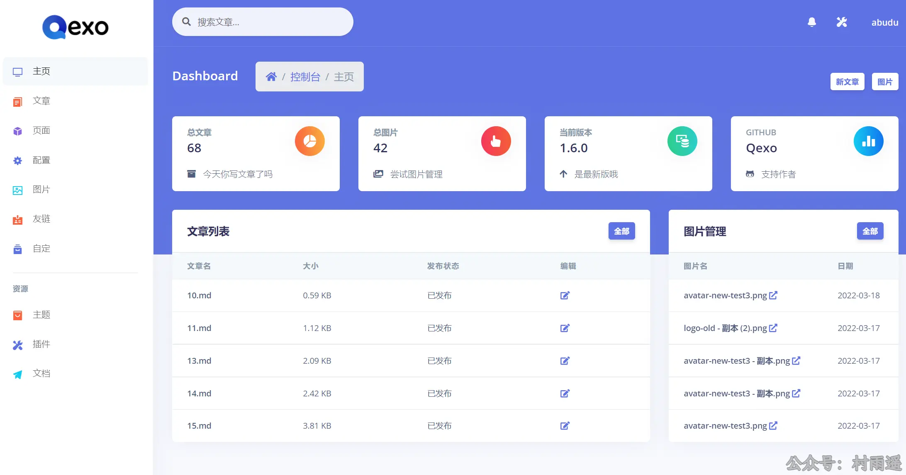
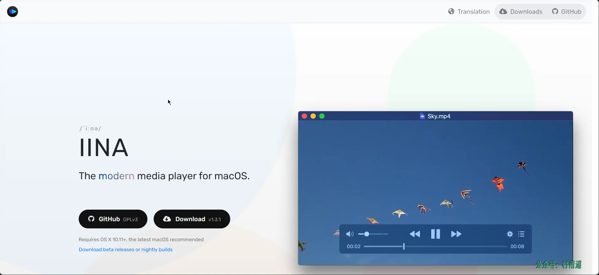
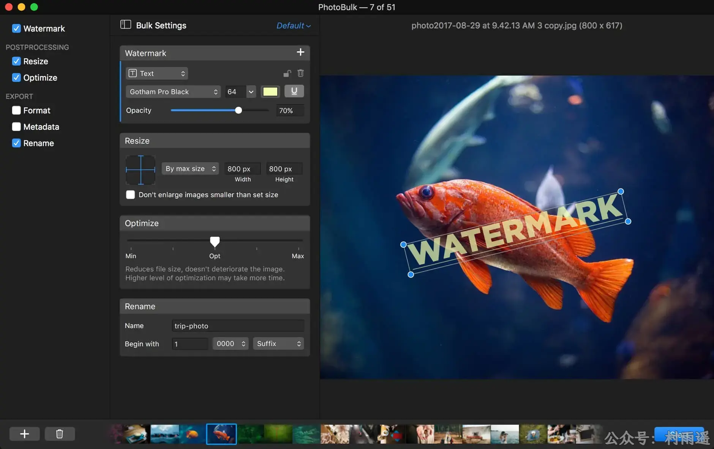
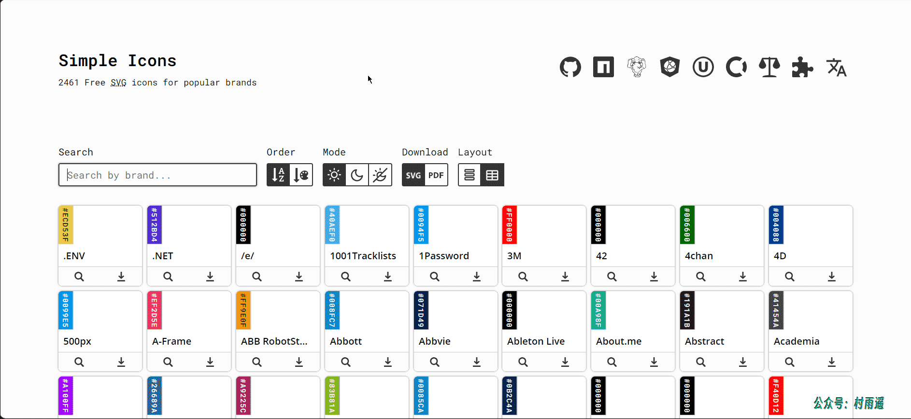
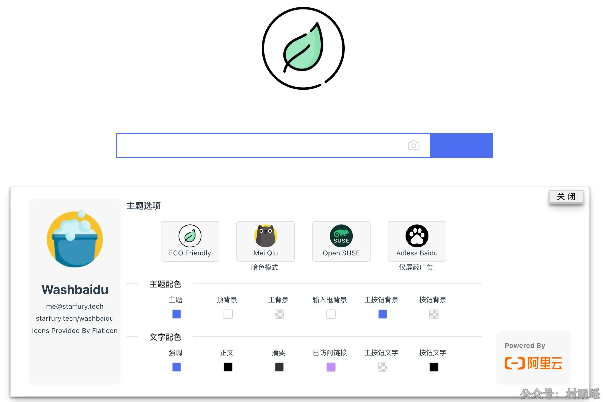
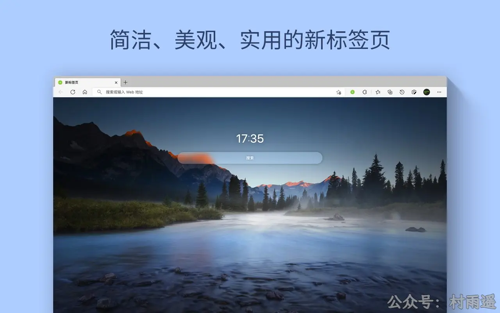
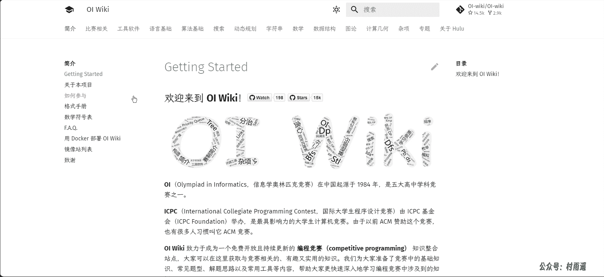
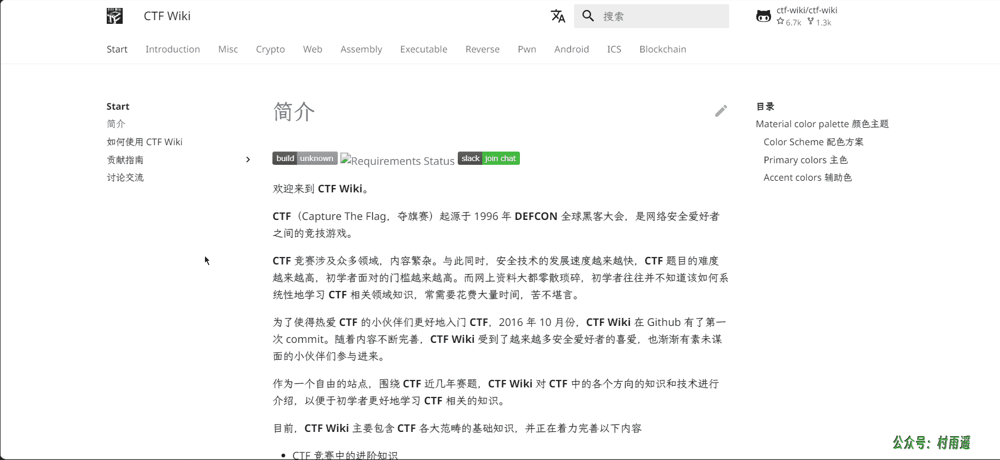

# 好物周刊#7：炫酷的浏览器标签页

::: info 共勉
不要哀求，学会争取。若是如此，终有所获。
:::
::: tip 原文
https://mp.weixin.qq.com/s/s3NpyL6JeybdJfHurlOakw
:::

## 一、项目

### 1. [Qexo](https://github.com/Qexo/Qexo)

一个快速、强大、漂亮的在线 `Hexo` 编辑器，支持以下功能：

-   自定义图床上传图片
-   在线配置编辑
-   在线页面管理
-   开放 `API`
-   自动检查更新
-   在线一键更新
-   快速接入友情链接
-   简单的说说短文
-   类似不算子的统计
-   自动填文章模板

### 2. [Twikoo](https://github.com/imaegoo/twikoo)

一个简洁、安全、免费的静态网站评论系统，具有以下特点：

-   简单
-   易用
-   安全
-   即时
-   个性
-   便捷管理

### 3. [ILLA Builder](https://github.com/illacloud/illa-builder)

`ILLA` 是一个强大的开源低代码平台，供开发人员构建内部工具。 通过使用 `ILLA` 的组件和操作库，开发人员可以节省大量构建工具的时间，具有以下特色功能：

-   ⚽ 实时协作： 我们可以一起实时创建内容。
-   🛠 自定义插件： 构建自定义插件来完成你的任务。
-   🤖 自动化支持： 连接一切组件，并在 5 秒内实现自动化。
-   🖥 本地部署： 支持 `Docker` 和 `k8s`
-   📝 `Page`支持： 创建内容丰富且 `UI` 友好的工具的基础。

## 二、软件

### 1. [IINA](https://iina.io/)

一款类 `macOS` 原生视频播放器，简洁优雅而不失强大。无论是视频解码还是字幕渲染，`IINA` 都无可挑剔。此外，`IINA` 支持在线字幕下载、画中画、视频串流等丰富的功能，充分满足你对一款视频播放器所有的幻想。而且最重要的一点，`IINA` 是完全免费的。

### 2. [PP 鸭](http://ppduck.com/)

PP鸭整合了业内最优秀的数种开源的图片压缩算法，会自动根据图片特征自动选择压缩参数。只需要将图片拖入 PP鸭，就能自动批量压缩，省时省心。

### 3. [PhotoBulk](https://photobulkeditor.com/)

PhotoBulk 是一款 `Mac` 平台的图片批量水印工具，无论是文字类还是图片类的水印，`PhotoBulk` 都能替你加上，通过两侧写着 `text` 和 `image` 的开关就能调节。对于水印，软件提供了一些最基本的设置，比如文字的字体、大小，图片的分辨率、透明度等。

## 三、网站

### 1. [简视频](https://www.aewz.com/)

致力打造好用的视频创作导航，汇聚了视频创作时所需的视频素材、图片素材、制作工具、字幕配音、音乐素材等众多实用性网站。

### 2. [Star Charts](https://starchart.cc/)

根据输入的 `Github` 账户及仓库名，生成随时间推移绘制仓库收获的 `star` 数量。

### 3. [Simple Icons](https://simpleicons.org/)

包含 2461 种流行品牌的免费 `SVG` 图标库，在我们前端开发需要找对应品牌 `Logo` 时绝对是不二之选。

## 四、插件

### 1. [Washbaidu](https://toast.pub/washbaidu/)

优化百度搜索界面，移除过度广告，提升百度体验。

简洁，隐私安全，无数据及网络权限要求。

百度作为老牌搜索引擎，在中文搜索内容和可达性上还是有优势。但界面太复杂、广告偏多。

插件简化了界面，轻度移除了广告，支持自定义头图，提升搜索体验。 

### 2. [青柠起始页](https://microsoftedge.microsoft.com/addons/detail/青柠起始页/pcpnigdkpcgemocnjhebmajldpjlbeom)

青柠起始页是一个简洁、美观、实用的浏览器起始页，以优雅的界面容纳了多引擎搜索、网站捷径、便笺、壁纸、天气等诸多功能。
您可依据喜好对青柠起始页进行高度自定义，让您的网上冲浪体验更加随心所欲。

此扩展由青柠起始页官方开发，主要功能包括：

-   新标签页：将您的浏览器新标签页替换为青柠起始页。
-   多引擎搜索：使用您喜欢的任意搜索引擎，或在百度、必应、谷歌等主流搜索引擎之间一键切换。
-   网站捷径：添加您的常用网站，一键快捷访问。
-   便笺：随时记录您的灵感、待办事项和备忘清单。还可将便笺固定到主屏幕，或创建倒数日计时。
-   壁纸：将您喜爱的任意图片设为壁纸，或使用我们精心挑选的静态 / 动态风景壁纸、每日更新的必应壁纸。
-   一言：每次打开新标签页时，随机显示一句诗词 / 格言。
-   个性化设置：多达 30 余项自定义项目，打造专属于您的新标签页。
-   云同步：网站捷径、便笺、个性化设置等支持跨设备云同步，帮助您在不同设备间流畅切换。
-   美化百度搜索结果页面：为百度使用经过精心设计的界面样式和夜间模式 / 深色主题（默认关闭，可在扩展设置中开启）。

### 3. [iTab](https://itab.link/?from=jjcj)

`iTab` 是新一代组件式标签页的首创者，是您打造个人学习工作台的浏览器必备插件。简洁美观高效无广，获得了数百万用户的一致好评，支持如下功能：

-    `iOS` 式小组件
-   聚合搜索
-    自定义功能
-   极简模式
-   多端数据即时同步与备份
-   海量精美壁纸
-   海量精选网站资源
-   浏览器书签管理
-   ……

## 五、资料

### 1. [OI Wiki](https://oi-wiki.org/)

致力于成为一个免费开放且持续更新的 **编程竞赛（competitive programming）** 知识整合站点，大家可以在这里获取与竞赛相关的、有趣又实用的知识。我们为大家准备了竞赛中的基础知识、常见题型、解题思路以及常用工具等内容，帮助大家更快速深入地学习编程竞赛中涉及到的知识。

### 2. [CTF Wiki](https://ctf-wiki.org/)

**CTF Wiki** 主要包含 **CTF** 各大范畴的基础知识，并正在着力完善以下内容：

-   CTF 竞赛中的进阶知识
-   CTF 竞赛中的优质题目

后续将探索提供以下方面的内容：

-   介绍安全研究中的工具
-   更多地与安全实战结合

### 3. [菜鸟教程](https://www.runoob.com/)

菜鸟教程提供了编程的基础技术教程, 介绍了 `HTML`、`CSS`、`Javascript`、`Python`、`Java`、`Ruby`、`C`、`PHP`、`MySQL` 等各种编程语言的基础知识。

---

## ✍️ 说明

周刊专栏相关信息：

- **项目地址**：[Github](https://github.com/cunyu1943/JavaPark/) | [Gitee](https://gitee.com/cunyu1943/JavaPark/) ，觉得不错麻烦给我一个**Star**，感谢 ❤️
- **浏览地址**：公众号 | [电子书](https://cunyu1943.github.io/) | [电子书（国内）](https://cunyu1943.gitee.io/)

如果你阅读到这里，说明我的工作没有白费。如果你想推荐项目/网站/软件/资源，欢迎提交 **[issue](https://github.com/cunyu1943/JavaPark/issues)** 或者添加我 **个人微信：cunyu1943** 与我交流。

---

## 🎬️ 广告

当前大环境下，就业形势严峻，尤其针对即将毕业的大学生。作为一个技术求职者，求职前应该做好哪些准备呢，一些面试实战技巧也十分有必要！而刚好最近掘金出了一本《技术人求职指南》小册，相信一定会对在找工作的你有所帮助。

从求职到拿下 `Offer`，一本职场的全方位攻略，快来和我一起学习吧！

## ⏳ 联系

想解锁更多知识？不妨关注我的微信公众号：**村雨遥（id：JavaPark）**。

扫一扫，探索另一个全新的世界。

<Share colorful />