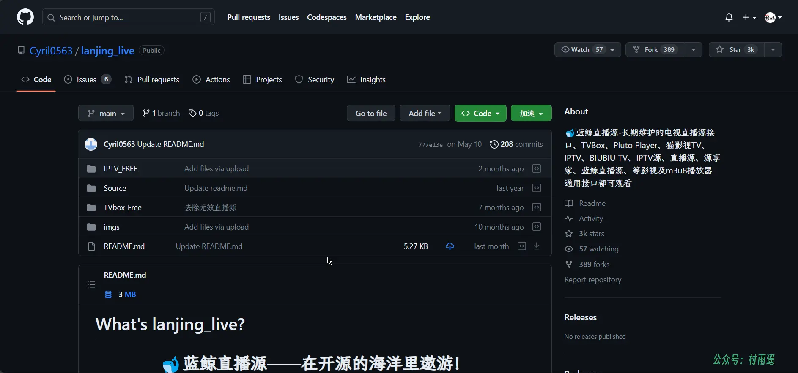
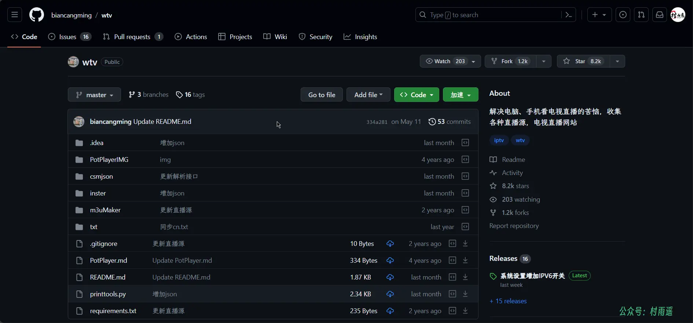
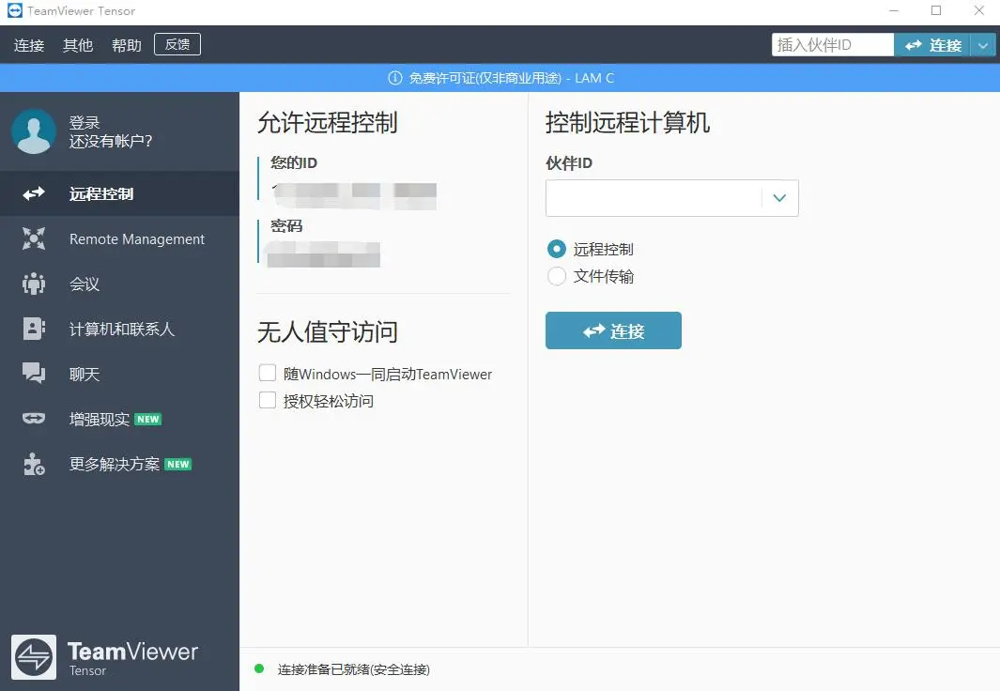
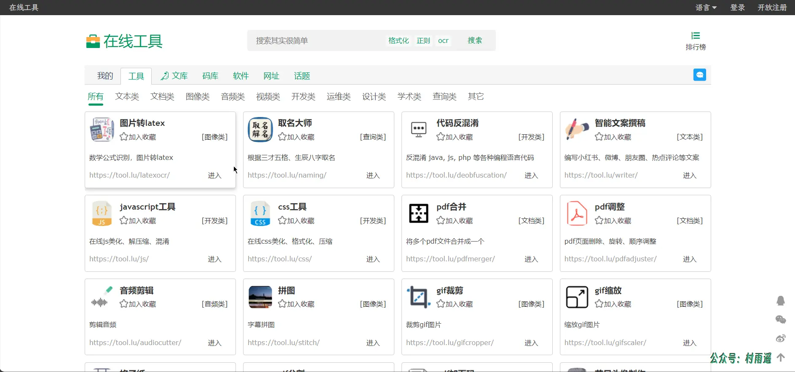
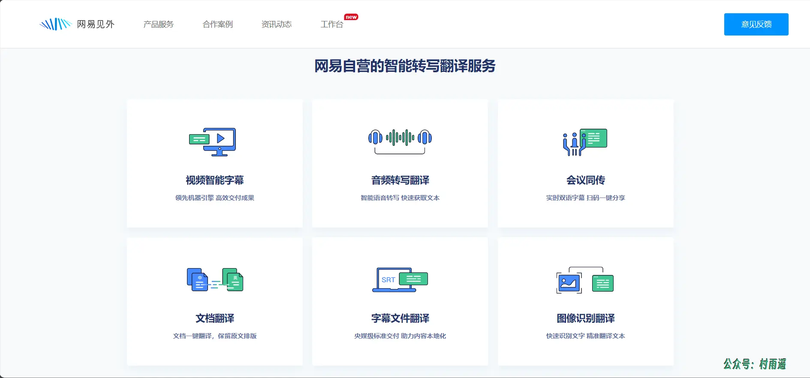
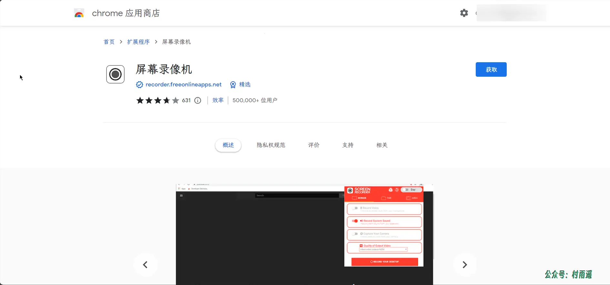
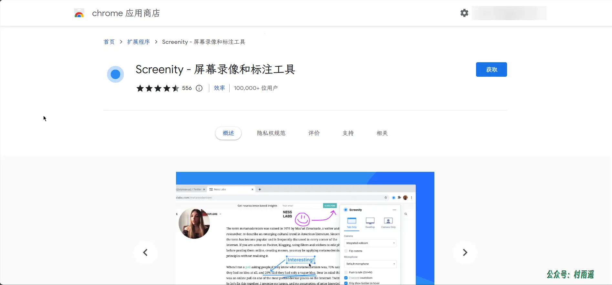
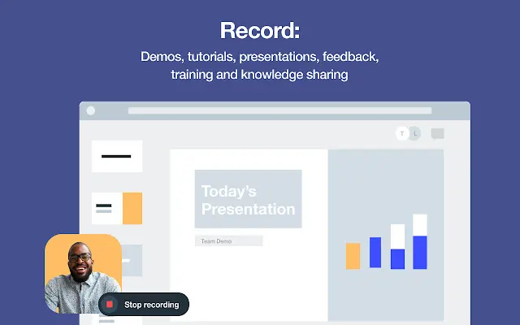
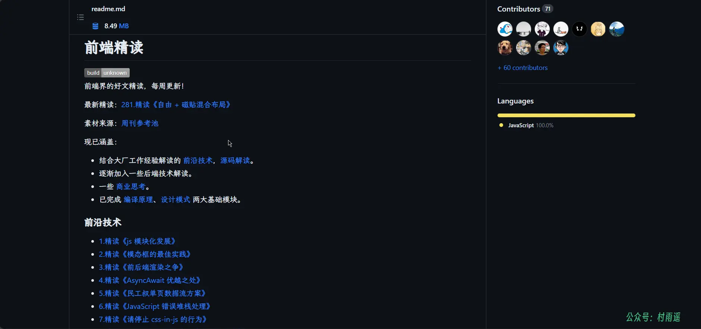
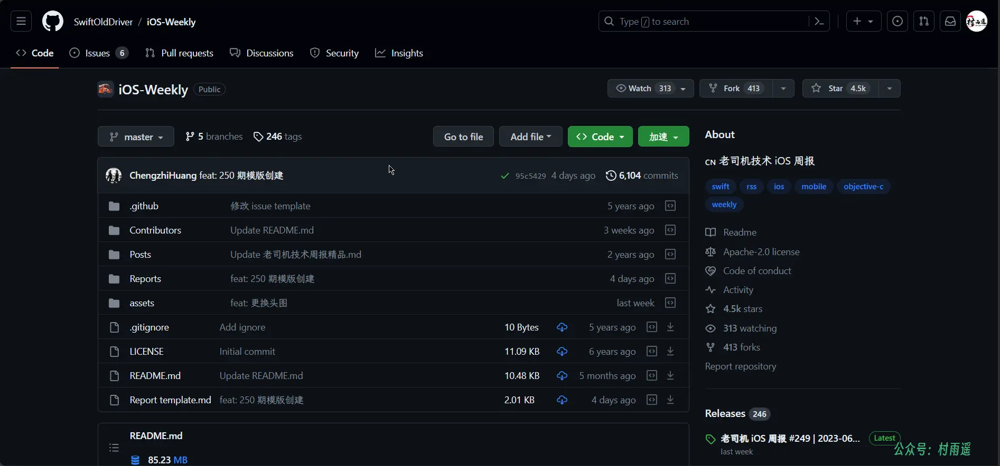

# 好物周刊#11：远程桌面软件

::: info 共勉
不要哀求，学会争取。若是如此，终有所获。
:::
::: tip 原文
https://mp.weixin.qq.com/s/4az9STvM2jiwHhRa_k060Q
:::

## 一、项目

### 1. [live](https://github.com/fanmingming/live)

 一个国内可直连的直播源分享项目，具有以下特点：

-   永久免费 
-   直连访问 
-   完整开源 
-   不含广告 
-   完善的台标 
-   直播源支持 `IPv4`/`IPv6` 双栈访问

### 2. [蓝鲸直播源](https://github.com/Cyril0563/lanjing_live)

长期维护的电视直播源接口、`TVBox`、`Pluto Player`、猫影视 `TV`、`IPTV`、`BIUBIU TV`、`IPTV` 源、直播源、源享家、蓝鲸直播源、等影视及 `m3u8` 播放器通用接口都可观看。

### 3. [wtv](https://github.com/biancangming/wtv)

解决电脑、手机看电视直播的苦恼，收集各种直播源，电视直播网站。

最新 `IPTV` 直播源 `m3u8` 下载，电视直播网站推荐，以中文频道为主。

## 二、软件

### 1. [ToDesk](https://www.todesk.com/)

一款稳定流畅的远程控制电脑手机连接软件，可远程桌面办公，远程协助运维。会话采用端对端加密，让每一次远程访问都安全可靠。

### 2. [向日葵](https://sunlogin.oray.com/download?categ=personal)

一款免费远程桌面工具，既支持控制手机，也支持控制电脑，简单易用。

软件还支持市面上的各种主流系统，如 `Windows`、`macOS`、`Linux`、`Android`、`iOS` 等。除了免费的远程桌面功能外，还有付费使用的摄像头、远程文件、桌面录像、远程开机等功能。

### 3. [TeamViewer](https://www.teamviewer.cn/cn/)

一个能在任何防火墙和 `NAT` 代理的后台用于远程控制，桌面共享和文件传输的简单且快速的解决方案。为了连接到另一台计算机，只需要在两台计算机上同时运行 `TeamViewer` 即可，而不需要进行安装。该软件第一次启动在两台计算机上自动生成 `ID`。只需要输入对方 `ID` 到 `TeamViewer` 即可建立连接。

目前，该软件面向个人使用免费，不过有广告弹窗，而且如果长期使用还会判定为商业行为，会在 5 分钟内强制断连。

## 三、网站

### 1. [在线工具](https://tool.lu/)

主要有工具、文库、码库、软件、网址、话题等方面的内容。而其中，在线工具又可以分为以下类别：

-   文本类
-   文档类
-   图像类
-   音频类
-   视频类
-   开发类
-   运维类
-   设计类
-   学术类
-   查询类
-   其他

### 2. [百度脑图](https://naotu.baidu.com/)

百度旗下的一个在线思维导图工具，具有以下特点：

-   免安装
-   云存储
-   易分享
-   舒适的体验
-   丰富的功能

### 3. [网易见外](https://sight.youdao.com/)

网易旗下 `AI` 智能语音转写听翻平台，主要提供以下服务：

-   视频智能字幕
-   音频转写翻译
-   文档翻译
-   字幕文件翻译
-   图像识别
-   会议同传
-   图像识别翻译

## 四、插件

### 1. [屏幕录像机](https://chrome.google.com/webstore/detail/screen-recorder/jdopnakmnlnccgpfpmjmdjjohmcdgabp)

免费的简单工具，用于从选项卡，页面区域和全屏捕获高质量视频，并带有麦克风，网络摄像头和系统音频。

录制屏幕，镶边选项卡，色度选项卡区域，网络摄像头，语音和麦克风。

一种智能屏幕录像机，可捕获台式机，浏览器/网络摄像头以及系统声音和/或麦克风。

无论您是否要制作教育视频，展示游戏玩法，录制会议，保存直播，或任何其他常规用途。

主要有以下特点：

-   无水印
-   无录制时间限制
-   控件易使用
-   录像即时保存
-   ……

### 2. [Screenity](https://chrome.google.com/webstore/detail/screenity-screen-recorder/kbbdabhdfibnancpjfhlkhafgdilcnji)

`Chrome` 最强大的屏幕录像机。 捕获，注释，编辑等。
借助 `Screenity`，您可以前所未有地录制和标注屏幕, 更好地录制工作、教育等内容，为学生提供情景反馈、详细的解释，或者只是向潜在客户展示您的产品。产品具有以下特点：

-   无限制的录制您的标签页、桌面、任何应用程序和摄像头
-   在屏幕任意位置绘画、添加文本和箭头进行标注
-   高亮您的点击，聚焦您的鼠标，或者在录制时隐藏
-   单独的麦克风和电脑音频控制，一键通（`PTT`）等
-   可定义倒计时，悬停时显示控制栏，以及更多自定义选项
    导出为 `mp4`、`gif` 和 `webm`，也可以保存视频到谷歌云盘
-   对您的录制做修剪或者移除片段

### 3. [Vimeo Record](https://chrome.google.com/webstore/detail/vimeo-record-screen-webca/ejfmffkmeigkphomnpabpdabfddeadcb)

可以在浏览器网页直接录制和分享无限制的视频。无论是产品演示、设计反馈，还是知识传授，通过 `Vimeo` 的屏幕录像机，就能快速录制和分享无限的视频信息。

不仅如此，还可以选择录制你的声音、脸部或组合。一旦你完成录制，立即就可以用私人链接分享你的视频。

每个录制的视频都会自动上传到 `Vimeo`，它为你提供了各种工具，如组织和替换视频，定制播放器，与你的团队分享视频，添加章节标记，以及更多。全球加入超过 2 亿用户选择 `Vimeo` 作为他们视频录制软件。

## 五、资料

### 1. [前端精读周刊](https://github.com/ascoders/weekly)

前端精读周刊。帮你理解最前沿、实用的技术。主要包含以下方面的内容：

-   前沿技术
-   `TS` 类型实操
-   设计模式
-   编译原理
-   源码解读
-   商业思考
-   算法
-   可视化搭建
-   `SQL`

### 2. [科技爱好者周刊](https://github.com/ruanyf/weekly)

科技大牛阮一峰创建的开源项目，记录每周值得分享的科技内容，周五发布。

### 3. [iOS 周报](https://github.com/SwiftOldDriver/iOS-Weekly)

老司机 `iOS` 周报，只为你呈现有价值的信息。汇聚有关 `iOS` 开发相关的信息、文章、工具等。

## ✍️ 说明

周刊专栏相关信息：

- **项目地址**：[Github](https://github.com/cunyu1943/JavaPark/) | [Gitee](https://gitee.com/cunyu1943/JavaPark/) ，觉得不错麻烦给我一个**Star**，感谢 ❤️
- **浏览地址**：公众号 | [电子书](https://cunyu1943.github.io/) | [电子书（国内）](https://cunyu1943.gitee.io/)

如果你阅读到这里，说明我的工作没有白费。如果你想推荐项目/网站/软件/资源，欢迎提交 **[issue](https://github.com/cunyu1943/JavaPark/issues)** 或者添加我 **个人微信：cunyu1943** 与我交流。

---

## 🎬️ 广告

当前大环境下，就业形势严峻，尤其针对即将毕业的大学生。作为一个技术求职者，求职前应该做好哪些准备呢，一些面试实战技巧也十分有必要！而刚好最近掘金出了一本《技术人求职指南》小册，相信一定会对在找工作的你有所帮助。

从求职到拿下 `Offer`，一本职场的全方位攻略，快来和我一起学习吧！

<Share colorful />