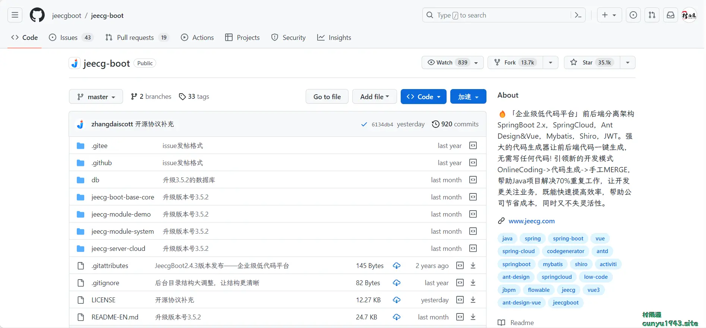
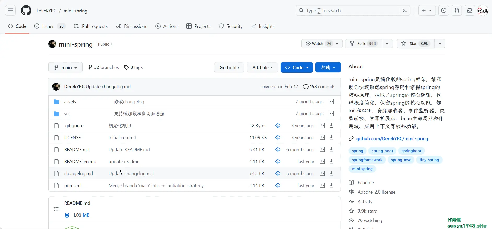
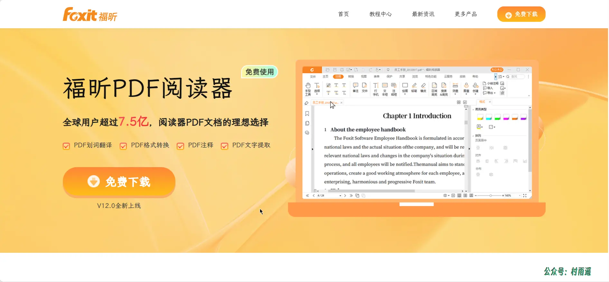
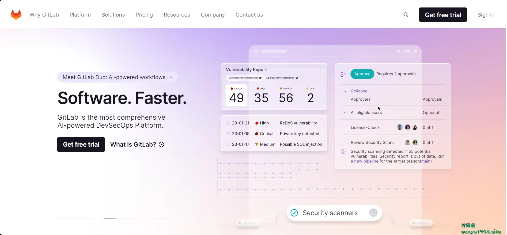
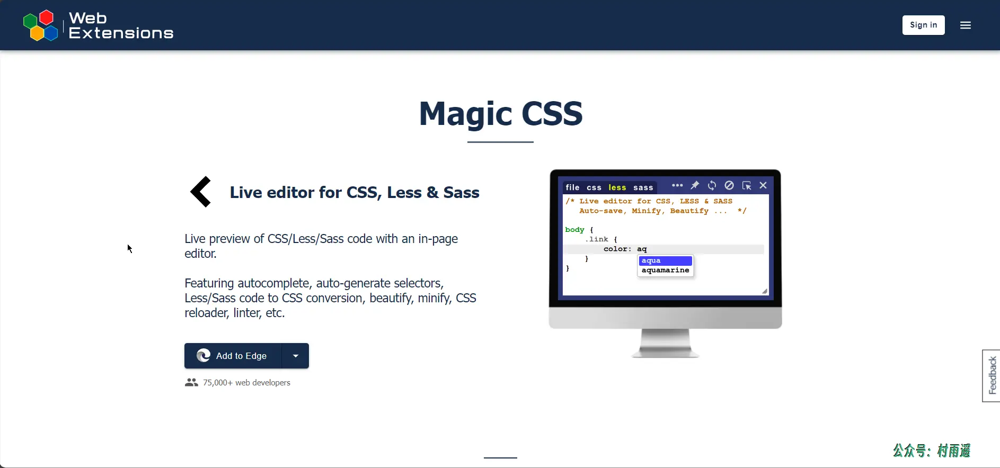
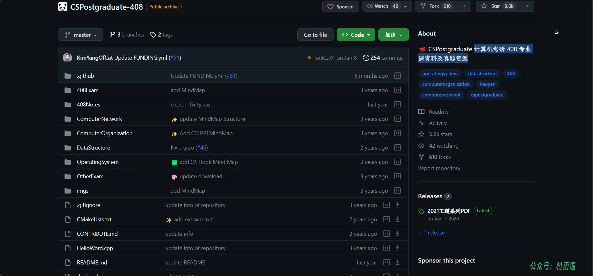
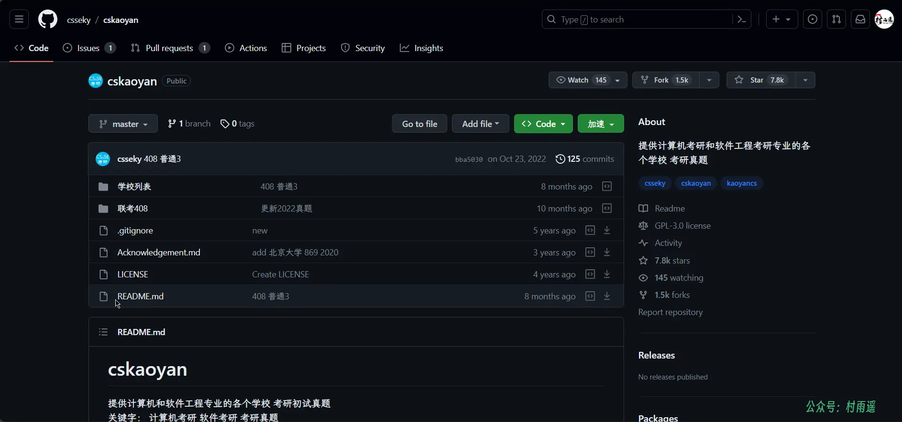

# 好物周刊#12：计算机考研资料

::: info 共勉
不要哀求，学会争取。若是如此，终有所获。
:::
::: tip 原文
https://mp.weixin.qq.com/s/-flJ1uEH5IPhxWp5J6Bexg
:::

## 一、项目

### 1. [JEECG BOOT 低代码开发平台](https://github.com/jeecgboot/jeecg-boot)

一款基于代码生成器的低代码开发平台！前后端分离架构 `SpringBoot2.x`，`SpringCloud`，`Ant Design` & `Vue`，`Mybatis-plus`，`Shiro`，`JWT`，支持微服务。强大的代码生成器让前后端代码一键生成，实现低代码开发! `JeecgBoot` 引领新的低代码开发模式(`OnlineCoding`-> 代码生成器-> 手工 `MERGE`)， 帮助解决 `Java` 项目 70% 的重复工作，让开发更多关注业务。既能快速提高效率，节省研发成本，同时又不失灵活性！

### 2. [mini-spring](https://github.com/DerekYRC/mini-spring)

简化版的 `Spring` 框架，能帮助你快速熟悉 `Spring` 源码和掌握 `Spring` 的核心原理。抽取了 `Spring` 的核心逻辑，代码极度简化，保留 `Spring` 的核心功能，如 `IoC` 和 `AOP`、资源加载器、事件监听器、类型转换、容器扩展点、`Bean` 生命周期和作用域、应用上下文等核心功能。

### 3. [云帆培训考试系统](https://github.com/qiutiandefeng/yfexam-exam)

在线考试系统 云帆在线学习 `Vue` 培训 `Java` 考试系统是一款基于 `Java` 开发的，使用 `SpringBoot` + `Vue` 开发的一款多角色在线培训考试系统平台，系统集成了用户管理、角色管理、部门管理、题库管理、试题管理、试题导入导出、考试管理、在线考试、错题训练等功能。

## 二、软件

### 1. [福昕 PDF 阅读器](https://www.foxitsoftware.cn/pdf-reader/)

全球用户超 7.5 亿，阅读 `PDF` 文档的最佳选择，具有以下特点：

-   文档阅读
-   `PDF` 注释
-   格式转换
-   `PDF` 打印
-   页面管理
-   `PDF` 云服务
-   文字提取
-   划词翻译

### 2. [极速 PDF](https://jisupdf.com/)

一款闪电般好用的 `PDF` 阅读器。

### 3. [Koodo Reader](https://github.com/troyeguo/koodo-reader)

一个跨平台的电子书阅读器，具有以下特点：

-   支持多种阅读格式：
    -   `EPUB` (**.epub**)
    -   扫描文档 (**.pdf**, **.djvu**)
    -   `Kindle` (**.azw3**, **.mobi**, **.azw**)
    -   纯文本 (**.txt**)
    -   漫画 (**.cbr**, **.cbz**, **.cbt**, **.cb7**)
    -   富文本 (**.md**, **.docx**, **.rtf**)
    -   `FB2` (**.fb2**)
    -   超文本 (**.html**, **.xml**, **.xhtml**, **.mhtml**, **.htm**, **.htm**)
-   支持 `Windows`，`macOS`，`Linux` 和网页版
-   备份数据到 `Dropbox` 和 `Webdav`
-   自定义源文件夹，利用 `OneDrive`、百度网盘、`iCloud`、`Dropbox` 等进行多设备同步
-   双页模式，单页模式，滚动模式
-   听书功能，翻译功能，触控屏支持，批量导入图书
-   支持目录，书签，笔记，高亮，书架，标签
-   自定义字体，字体大小，行间距，段落间距，阅读背景色，文字颜色，屏幕亮度，文字下划线、斜体、文字阴影、字体粗细
-   黑夜模式和主题色设置

## 三、网站

### 1. [Github](https://github.com/)

一个在线软件源代码托管服务平台，使用 `Git` 作为版本控制软件。想必每个开发者对它都不陌生，还亲切的称为“世界上最大的同性交友网站”。在这里，你不仅能找到各种各样的宝藏资源，还能结交各种好友，在开发的道路上一起远行。

### 2. [Gitee](https://gitee.com/)

`Gitee` 是开源中国（`OSChina`）推出的基于 `Git` 的代码托管服务。
共包括三个版本，分别是：社区版、企业版和高校版。可以看做是国内的 `Github`，对于难以访问 `Github` 的用户不失为另一种好的选择。

### 3. [Gitlab](https://about.gitlab.com/)

一个用于仓库管理系统的开源项目，使用 `Git` 作为代码管理工具，并在此基础上搭建起来的 `Web` 服务。另外，`GitLab` 还具有 `wiki` 以及在线编辑、`issue` 跟踪功能、`CI`/`CD` 等功能。

## 四、插件

### 1. [User-Agent Switcher](https://chrome.google.com/webstore/detail/user-agent-switcher/kchfmpdcejfkipopnolndinkeoipnoia)

在你的浏览器中切换 `User-Agents` 的最简单的方法!
`User-Agents` 切换器插件操作简单，功能强大。而且上网体验更丝滑，不再受到哪种浏览器或操作系统的限制。它增加了一个工具条按钮，你可以用它在不同的常用 `User-Agents` 字符串之间切换。

### 2. [Magic CSS](https://www.webextensions.org/)

允许用户在任意页面编写 `CSS`/`Less`/`Sass `代码，代码会立即生效，并将保存在浏览器扩展的存储空间或站点的本地存储中。

您可以发挥您的脑洞，给任意网站改写样式！此外还提供各种快速选择等调试功能，更轻松上手。

### 3. [JSON Viewer](https://chrome.google.com/webstore/detail/json-viewer/efknglbfhoddmmfabeihlemgekhhnabb)

一款实用的 `JSON` 格式数据查看器。

## 五、资料

### 1. [CSPostgraduate-408](https://github.com/CodePanda66/CSPostgraduate-408)

计算机考研 408 专业课资料及真题资源。

### 2. [cs-408](https://github.com/ddy-ddy/cs-408)

计算机考研专业课程 408 相关的复习经验，资源和 `OneNote` 笔记。

### 3. [cs-kaoyan](https://github.com/csseky/cskaoyan)

提供各个学校计算机考研和软件工程考研专业的考研真题。

## ✍️ 说明

周刊专栏相关信息：

- **项目地址**：[Github](https://github.com/cunyu1943/JavaPark/) | [Gitee](https://gitee.com/cunyu1943/JavaPark/) ，觉得不错麻烦给我一个**Star**，感谢 ❤️
- **浏览地址**：公众号 | [电子书](https://cunyu1943.github.io/) | [电子书（国内）](https://cunyu1943.gitee.io/)

如果你阅读到这里，说明我的工作没有白费。如果你想推荐项目/网站/软件/资源，欢迎提交 **[issue](https://github.com/cunyu1943/JavaPark/issues)** 或者添加我 **个人微信：cunyu1943** 与我交流。

---

## 🎬️ 广告

作为程序员，掌握数据结构与算法的重要性就不言而喻了。掌握了数据结构与算法，可以说你的编程能力就会有质的飞跃。任凭各种热门技术的如何变化，只要掌握了核心技能，那都可以见招拆招，做一个“赢家”。

专栏共分为 4 个由浅入深的模块：

-   入门篇
-   基础篇
-   高级篇
-   实战篇

作者采用最适合工程师的学习方式，不拘泥于某一特定编程语言，从实际开发场景出发，由浅入深教你学习数据结构与算法的方法，帮你搞懂基本概念和核心理论，深入理解算法精髓，帮你提升使用数据结构和算法思维解决问题的能力。

想要进一步提升自己的竞争力么，那就赶紧加入和我一起学习吧！

<Share colorful />