# 好物周刊#13：免费下载软件

::: info 共勉
不要哀求，学会争取。若是如此，终有所获。
:::
::: tip 原文
https://mp.weixin.qq.com/s/mGTQR1wyFWauahQ3PJ6jPA
:::

## 一、项目
### 1. [Github Profile Summary Cards](https://github.com/vn7n24fzkq/github-profile-summary-cards)

一个为个人资料自述文件生成 `Github` 摘要卡的工具。只需输入你的 `Github` 用户名，选择主题后就能生成关于 `Github` 的 `Commit`、`Top Languages`、`Stats` 等信息。

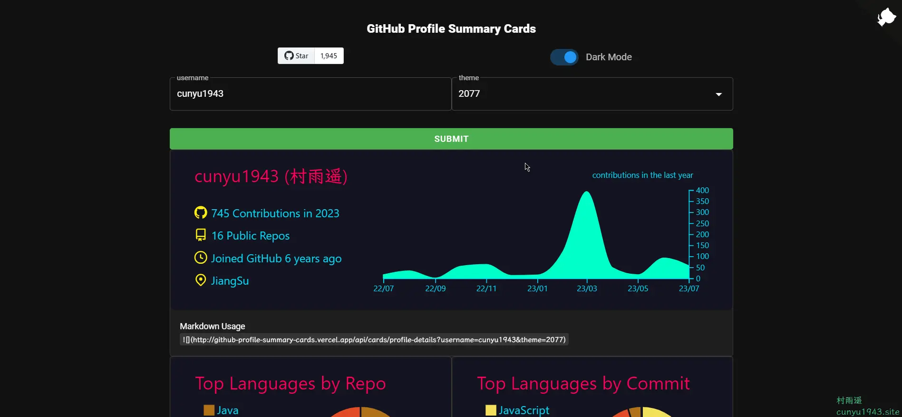

### 2. [Profile Summary](https://github.com/tipsy/profile-summary-for-github)

一个统计 `Github Profile` 的可视化工具。

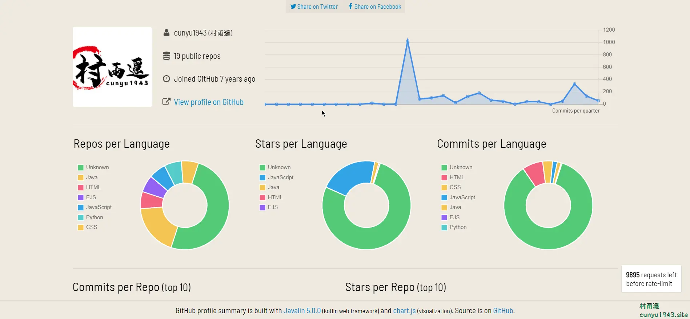

### 3. [GitHub Profile Trophy](https://github.com/ryo-ma/github-profile-trophy)

在自述文件中添加动态生成的 `GitHub Stat` 奖杯，支持多种主题，还支持自定义大小。

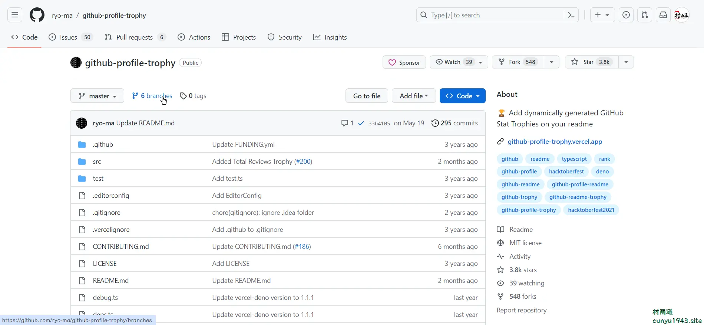

## 二、软件

### 1. [Motrix](https://motrix.app/zh-CN/)

一款全能的下载工具，支持下载 `HTTP`、`FTP`、`BT`、磁力链接等资源。最最重要的是，他完全跨平台且免费。

软件界面设计简约清新，方便实用。用户可轻松监控、管理下载任务，并自由更改下载路径和速度限制。此外，还支持多点续传和流媒体下载，同时提供暂停、恢复、取消等快捷功能。

### 2. [Xdown](https://www.xdown.org/)

专业的文件下载与分享工具(`BitTorrent`/`HTTP`/`FTP`)，具有以下功能：

-   支持浏览器(`Chrome`/`Edge Chromium`/百分浏览器)接管下载
-   支持 `torrent` 下载文件与做种
-   支持 `torrent` 自动屏蔽吸血客户端
-   支持断线重连
-   支持标准 `FTP`/`HTTP`/`HTTPS`/`HTTP2` 协议下载
-   支持 `http header` 自定义字段
-   支持手动设置并发数(最大 128)
    支持多 `IP` 轮询节点下载
-   支持 `BitTorrent` 内置 `tracker list` 设置
-   支持 tls1.0/1.1/1.2/1.3-sni
-   支持磁力链接
-   支持 `DHT` ipv4 + ipv6
-   支持全局限速
-   支持自定义全局代理设置

### 3. [Free Download Manager](https://www.freedownloadmanager.org/zh/download.htm)

强大的下载工具，可以看做是免费版的 `IDM`，不过功能也比 `IDM` 功能略弱。

-   支持 `FTP`，`HTTPS`，还有 `BT` 下载，当然你也可以添加代理。
-   还支持定时下载任务，也支持多线程下载，同时还可以查看多线程的进度。
-   支持远程控制下载，还支持断点续传功能。
-   支持国外视频网站下载，支持浏览器插件，自动捕捉可下载文件，右键即可下载。

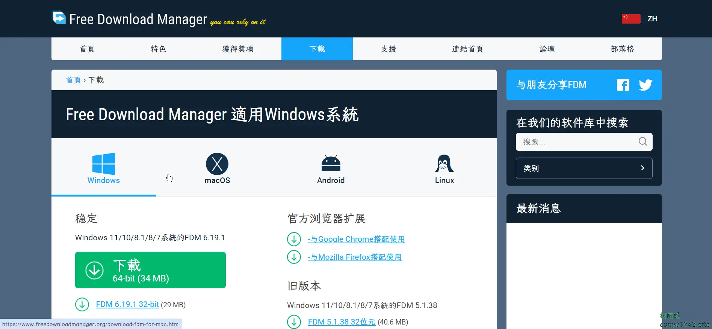

## 三、网站

### 1. [Color Hunt](https://www.colorhunt.co/)

一个在线色彩搭配方案分享网站，在这里可以看到大家分享出来的各种配色方案，如果你是一个设计师，那你绝对不要错过！

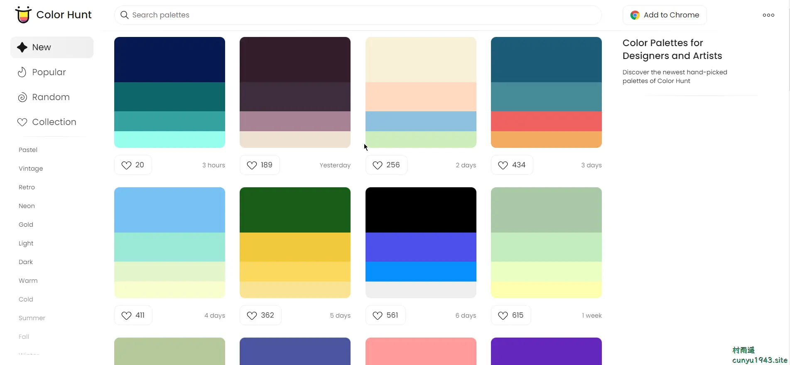

### 2. [WebGradients](https://webgradients.com/)

汇聚了 180 个线性渐变的配色方案，可以将其用作网站任何部分的内容背景，只需要通过 `Copy CSS` 即可将渐变赋值为一段 `CSS` 代码，而且免费供商业或者个人使用。

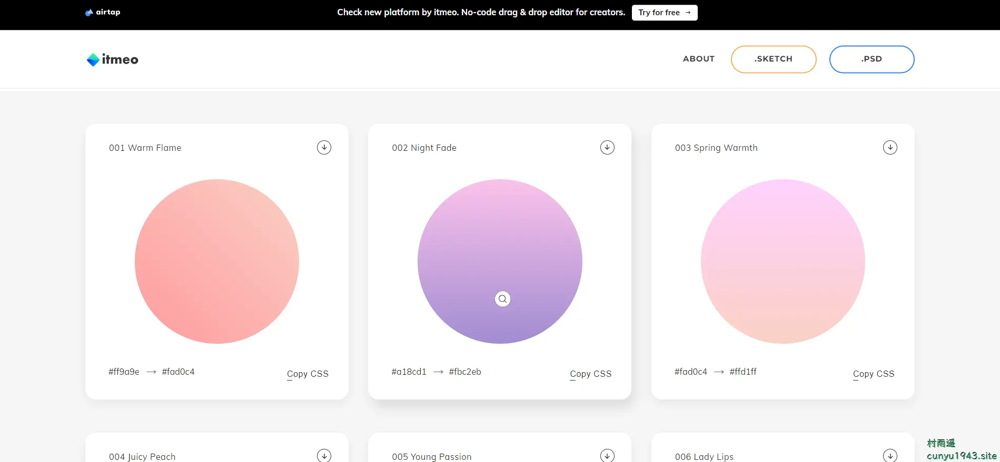

### 3. [ColorDrop](https://colordrop.io/)

和 `Color Hunt` 类似的一个网站，只需要点击配色就会显示各个颜色的色值，但不同于 `Color Hunt` 的是，它不支持用户自己上传配色方案。

## 四、插件

### 1. [Octotree](https://chrome.google.com/webstore/detail/octotree-github-code-tree/bkhaagjahfmjljalopjnoealnfndnagc?utm_campaign=en&utm_source=en-et-na-us-oc-webstrext&utm_medium=et)

一款增强 `Github` 代码 `Review` 的浏览器插件。

具有以下特性：

-   树形结构的快递 `IDE`。
-   支持快速搜索。
-   可对仓库、`issues`、`PR`、文件等加书签。
-   支持 `Github` 主题。
-   支持私有化的仓库。
-   高性能，适用于各种大小的仓库。

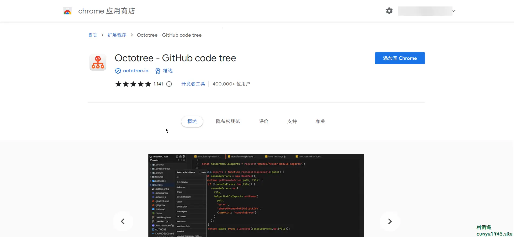

### 2. [Copy as Markdown](https://chrome.google.com/webstore/detail/copy-as-markdown/nlaionblcaejecbkcillglodmmfhjhfi?utm_campaign=en&utm_source=en-et-na-us-oc-webstrext&utm_medium=et)

通过该插件，以将超链接、图像和文本复制为 `Markdown` 格式，具有以下特点：

- 能够将链接、图像和选定的文本复制为 `Markdown`。
- 对于图像将具有单独选择链接或图像的选项。
- 格式化文本，例如斜体、粗体、删除线和内联代码。
- 支持无序列表、有序列表、任务列表。
- 表格遵循 `GFM` 规范。
- 可复制代码块，而且可识别对应编程语言

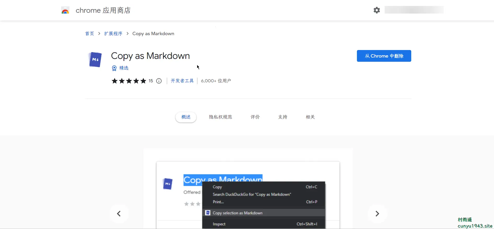

### 3. [Sourcegraph](https://chrome.google.com/webstore/detail/sourcegraph/dgjhfomjieaadpoljlnidmbgkdffpack?utm_campaign=en&utm_source=en-et-na-us-oc-webstrext&utm_medium=et)

向 `GitHub`、`GitLab` 和其他主机添加代码智能：悬停、定义、引用。适用于 20 多种语言。

开源 `Sourcegraph` 扩展为 `GitHub`、`GitHub Enterprise`、`GitLab`、`Bitbucket Server` 和 `Phabricator` 添加了代码导航和代码智能。

* 带有文档和类型信息的悬停工具提示
* 转到定义
* 查找参考资料

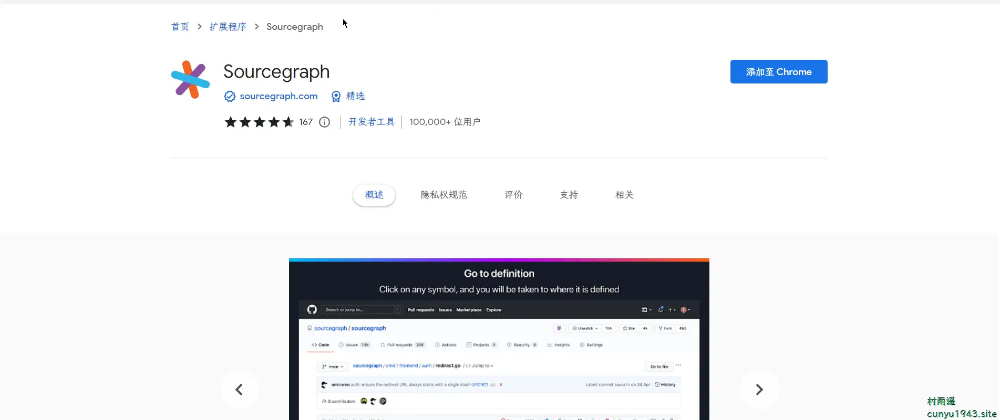

## 五、资料

### 1. [现代 C++ 教程](https://changkun.de/modern-cpp/)

从内容上对二十一世纪二十年代之前产生 `C++` 的相关特性做了非常相对全面的介绍，读者可以自行根据下面的目录选取感兴趣的内容进行学习，快速熟悉需要了解的内容。这些特性并不需要全部掌握，只需针对自己的使用需求和特定的应用场景，学习、查阅最适合自己的新特性即可。

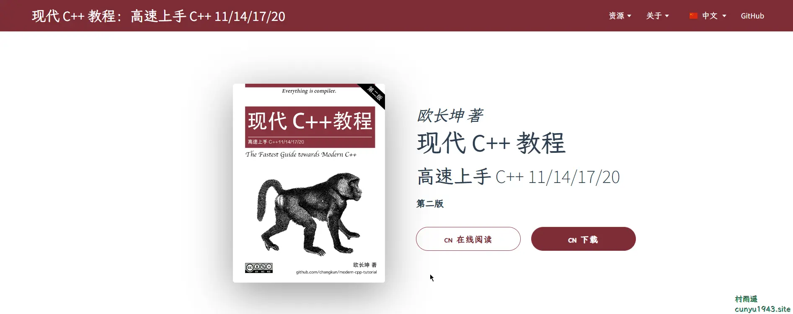

### 2. [小林 coding](https://xiaolincoding.com/)

图解计算机网络、操作系统、计算机组成、数据库，共 1000 张图 + 50 万字，破除晦涩难懂的计算机基础知识，让天下没有难懂的八股文！

### 3. [inteview](https://interview.huihut.com/#/)

`C/C++` 技术面试基础知识总结，包括语言、程序库、数据结构、算法、系统、网络、链接装载库等知识及面试经验、招聘、内推等信息。

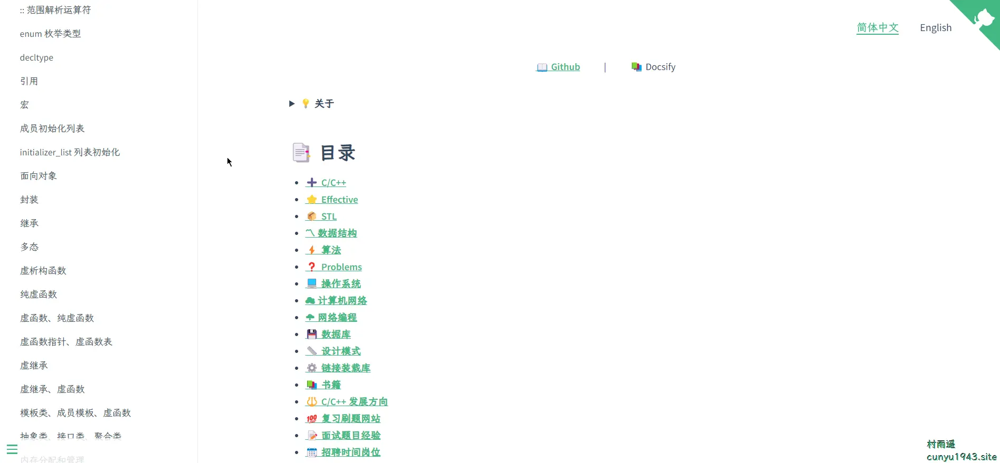

## ✍️ 说明

周刊专栏相关信息：

- **项目地址**：[Github](https://github.com/cunyu1943/JavaPark/) | [Gitee](https://gitee.com/cunyu1943/JavaPark/) ，觉得不错麻烦给我一个**Star**，感谢 ❤️
- **浏览地址**：公众号 | [电子书](https://cunyu1943.github.io/) | [电子书（国内）](https://cunyu1943.gitee.io/)

如果你阅读到这里，说明我的工作没有白费。如果你想推荐项目/网站/软件/资源，欢迎提交 **[issue](https://github.com/cunyu1943/JavaPark/issues)** 或者添加我 **个人微信：cunyu1943** 与我交流。

---

## 🎬️ 广告

当前大环境下，就业形势严峻，尤其针对即将毕业的大学生。作为一个技术求职者，求职前应该做好哪些准备呢，一些面试实战技巧也十分有必要！而刚好最近掘金出了一本《技术人求职指南》小册，相信一定会对在找工作的你有所帮助。

从求职到拿下 `Offer`，一本职场的全方位攻略，快来和我一起学习吧！

## ⏳ 联系

想解锁更多知识？不妨关注我的微信公众号：**村雨遥（id：JavaPark）**。

扫一扫，探索另一个全新的世界。

<Share colorful />