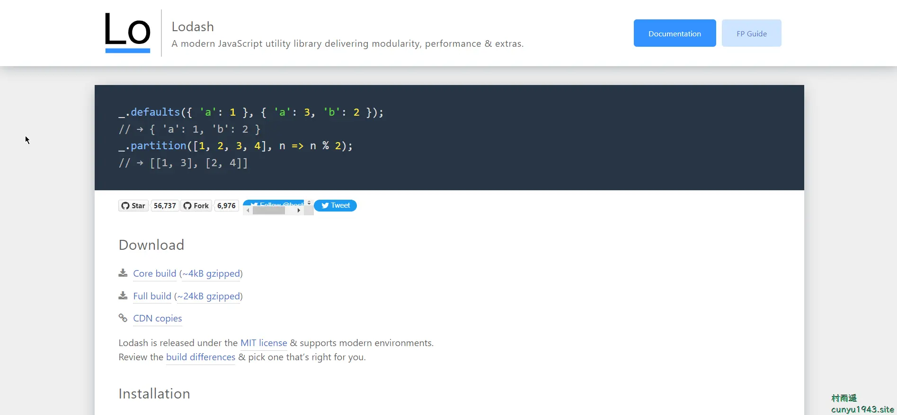
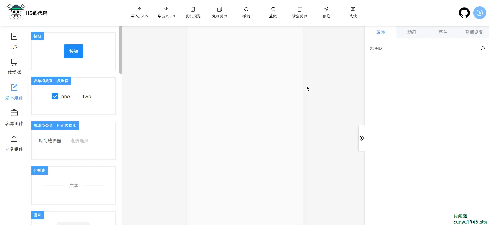
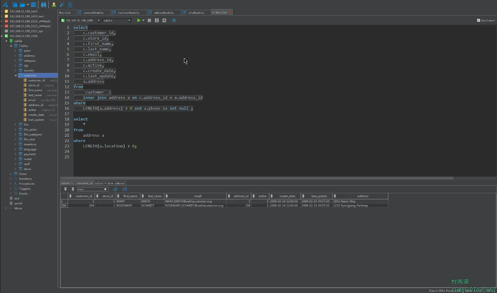
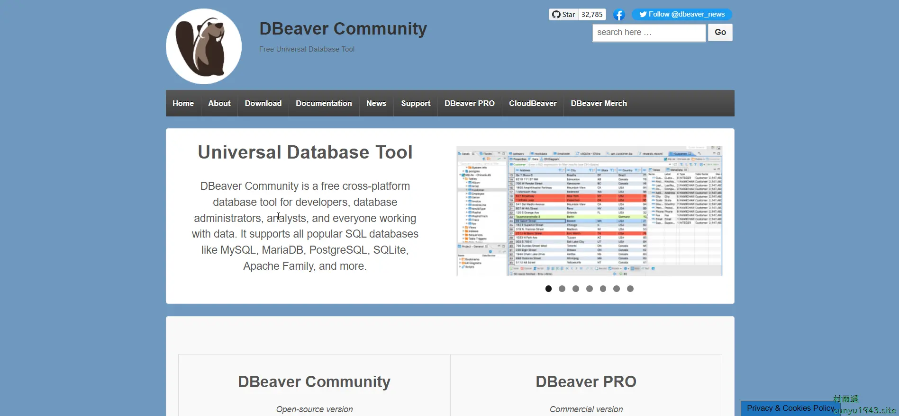
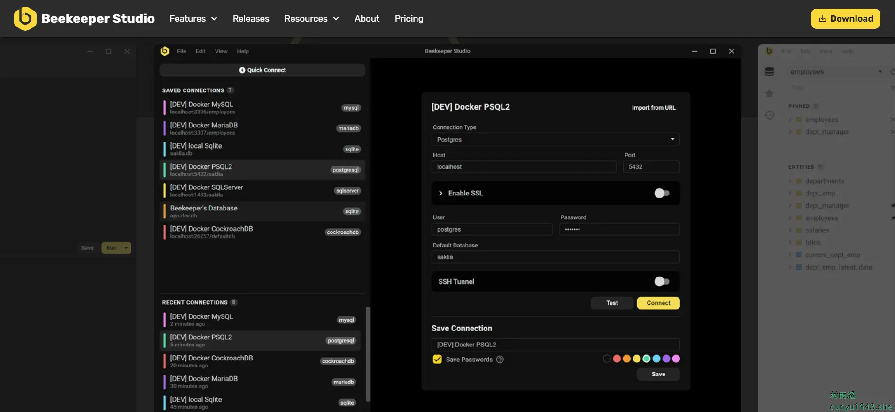
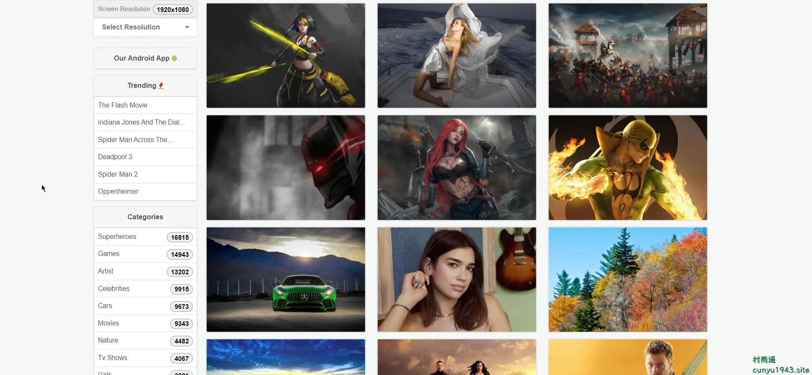
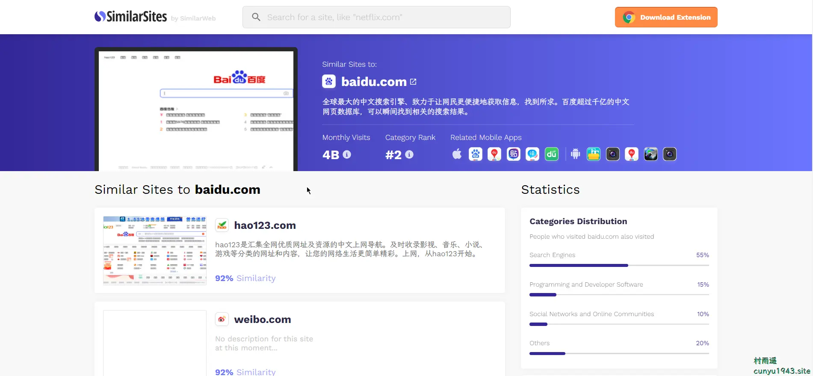
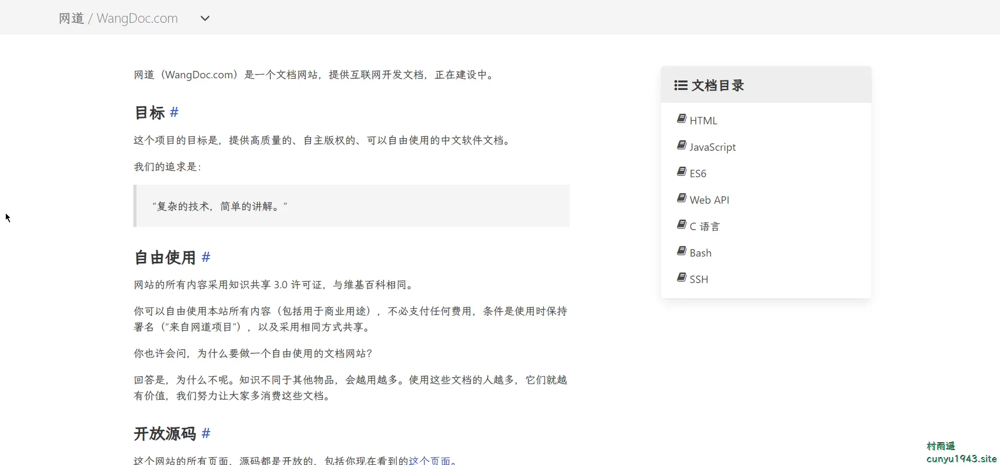
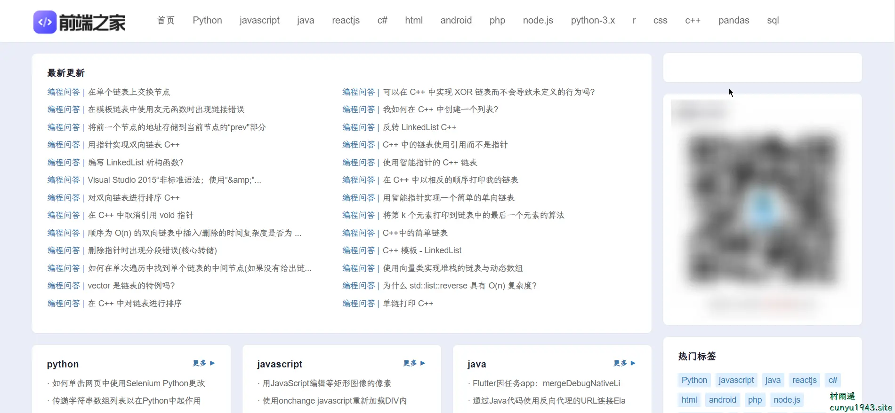

# 好物周刊#14：壁纸下载网站

::: info 共勉
不要哀求，学会争取。若是如此，终有所获。
:::
::: tip 原文
https://mp.weixin.qq.com/s/RZeCM4qnAinMzC94SZupMg
:::

## 一、项目

### [k-form-design](https://github.com/Kchengz/k-form-design)

基于 `Vue` 和 `Ant-design-Vue` 实现的表单设计器，样式使用 `less` 作为开发语言，主要功能是能通过简单操作来生成配置表单，生成可保存的 `JSON` 数据，并能将 `JSON` 还原成表单，使表单开发更简单更快速。

### [lodash](https://github.com/lodash/lodash)

`Lodash` 是一个一致性、模块化、高性能的 `JavaScript` 实用工具库。遵循 `MIT` 开源协议发布，并且支持最新的运行环境。

### [vite-vue3-lowcode](https://github.com/buqiyuan/vite-vue3-lowcode)

`vue3.x` + `vite2.x` + `vant` + `element-plus` `H5` 移动端低代码平台。可视化拖拽，可视化编辑器。类似易企秀的 `H5` 制作、建站工具、可视化搭建工具。

## 二、软件

### [JookDB](https://jookdb.com/)

免费通用的数据库管理工具，支持多种数据库：`MySQL`, `MariaDB`, `Oracle`, `PostgreSQL`, `SQLite`, `MongoDB`, 达梦, `OceanBase` 和 `SQLServer`。

软件具有以下特性：

-   轻便的图像程序
-   表数据编辑
-   数据传输
-   生成或执行 `SQL` 脚本
-   代码自动完成
-   暗色主题模式

### [DBeaver](https://dbeaver.io/)

一款免费的跨平台数据库工具，适用于开发人员、数据库管理员、分析师和所有处理数据的人。它支持所有流行的 `SQL` 数据库，如 `MySQL`、`MariaDB`、`PostgreSQL`、`SQLite`、`Apache` 系列等。

### [Beekeeper](https://www.beekeeperstudio.io/)

您梦想中的 `SQL` 编辑器和数据库管理器
一个现代、易于使用且美观的 `SQL` 客户端，适用于 `MySQL`、`Postgres`、`SQLite`、`SQL Server` 等。

## 三、网站

### [彼岸图网](http://pic.netbian.com/)

提供高清免费壁纸下载，而且网站无广告，但每天仅提供一张壁纸免费下载额度，有更多下载需求的可以对站点进行赞助，从而获取网站会员。

### [Wallpaper Abyss](https://wall.alphacoders.com/?lang=Chinese)

1008233 张壁纸的聚集地，提供免费壁纸下载，种类齐全，高清大图。

### [HDQwalls](https://hdqwalls.com/)

高质量壁纸汇聚地，有 `4K`、`5K`、`8K` 等清晰度的壁纸下载，而且完全免费，更有各种尺寸壁纸供你选择。

## 四、插件

### [V2EX Polish](https://chrome.google.com/webstore/detail/v2ex-polish/onnepejgdiojhiflfoemillegpgpabdm?utm_source=ext_app_menu)

专为 `V2EX` 用户设计，提供了丰富的扩展功能。
为原网站添加了众多便捷的功能，让你的 `V2EX` 页面焕然一新！插件具有以下特点：

-   界面美化
    `UI` 设计更现代化，为你带来愉悦的视觉体验。
-   评论回复嵌套层级，主题下的评论回复支持层级展示，更轻松地跟踪和回复其他用户的评论。
-   热门回复展示，自动筛选出最受欢迎的回复，第一时间了解热评。
-   表情回复支持，评论输入框可以选择表情，让回复更加生动和有趣。
-   长回复优化，智能折叠长篇回复，一键展开查看完整内容。
-   内置主题列表，无需打开网页，插件内即可快速获取最热、最新的主题列表和消息通知。
-   便捷回复操作：文字转 `Base64`、上传图片
-   添加用户信息卡片，快捷查看用户信息。
-   右键菜单扩展：支持解析页面中 `Base64` 编码内容。
-   “稍后阅读”功能：添加感兴趣的主题，方便日后浏览。

### [CrxMouse](https://crxmouse.com/zh-hans/)

使用鼠标手势的轻松浏览器导航，通过直观和可自定义的鼠标手势提高您的效率。

鼠标手势内置动作：按 + 按住右键（在屏幕上的任意位置）并拖动以执行以下操作： 

-   ↓→：关闭当前选项卡
-   ↓→↑：打开一个新窗口
-   ←：返回
-   ←↑：重新打开关闭的标签页
-   →：前进
-   →↓：滚动到底部
-   →↑：滚动到顶部
-   ↑：向上滚动一页
-   ↑↓：刷新
-   ↑↓↑：强制刷新
-   ↑←：移至左侧标签
-   ↑→：移至右侧标签
-   ↓→↓：关闭当前窗口

### [SimilarSites](https://www.similarsites.com/)

立即发现与您当前正在浏览的网站类似的网站。探索网络，了解更多信息。

我们每天都有数以百万计的网站浏览，并且经常会发现自己正在寻找类似的网站来消费内容，购物或仅仅进行浏览。使用 `SimilarSites`，您可以在几秒钟内找到与您当前正在浏览的网站相关的网站！

## 五、资料

### [百度前端技术学园](http://ife.baidu.com/)

面向所有自驱成长，终身学习，热爱生活的人，打造的 `Web` 前端技术学习园地。由百度创办的免费前端技术学习实践、交流、分享平台。

### [网道](https://wangdoc.com/)

一个互联网开发文档网站，提供各种软件文档。目标是提供高质量、自主版权、可自由使用的中文软件文档。目前已有 `HTML`、`JavaScript`、`ES6`、`Web API`、`C 语言`、`Bash`、`SSH` 等诸多内容。

### [前端之家](https://www.f2er.com/)

提供各种基础教程的网站，包括 `Bootstrap`、`Node`、`Angular`、`ReactJs`、`JavaScript` 等各种前端开发编程语言。

## ✍️ 说明

周刊专栏相关信息：

- **项目地址**：[Github](https://github.com/cunyu1943/JavaPark/) | [Gitee](https://gitee.com/cunyu1943/JavaPark/) ，觉得不错麻烦给我一个**Star**，感谢 ❤️
- **浏览地址**：公众号 | [电子书](https://cunyu1943.github.io/) | [电子书（国内）](https://cunyu1943.gitee.io/)

如果你阅读到这里，说明我的工作没有白费。如果你想推荐项目/网站/软件/资源，欢迎提交 **[issue](https://github.com/cunyu1943/JavaPark/issues)** 或者添加我 **个人微信：cunyu1943** 与我交流。

---

## 🎬️ 广告
作为程序员，掌握数据结构与算法的重要性就不言而喻了。掌握了数据结构与算法，可以说你的编程能力就会有质的飞跃。任凭各种热门技术的如何变化，只要掌握了核心技能，那都可以见招拆招，做一个“赢家”。

专栏共分为 4 个由浅入深的模块：

-   入门篇
-   基础篇
-   高级篇
-   实战篇

作者采用最适合工程师的学习方式，不拘泥于某一特定编程语言，从实际开发场景出发，由浅入深教你学习数据结构与算法的方法，帮你搞懂基本概念和核心理论，深入理解算法精髓，帮你提升使用数据结构和算法思维解决问题的能力。

想要进一步提升自己的竞争力么，那就赶紧加入和我一起学习吧！

<Share colorful />