# 好物周刊#15：远程控制软件

::: info 共勉
不要哀求，学会争取。若是如此，终有所获。
:::
::: tip 原文
https://mp.weixin.qq.com/s/XmW-JmHxZh8X9yiGvmWfqg
:::

## 一、项目

### 1. [vue–pure-admin](https://github.com/pure-admin/vue-pure-admin)

`Vue3` + `Vite4` + `Element-Plus` + `TypeScript` 编写的一款后台管理系统（兼容移动端）。

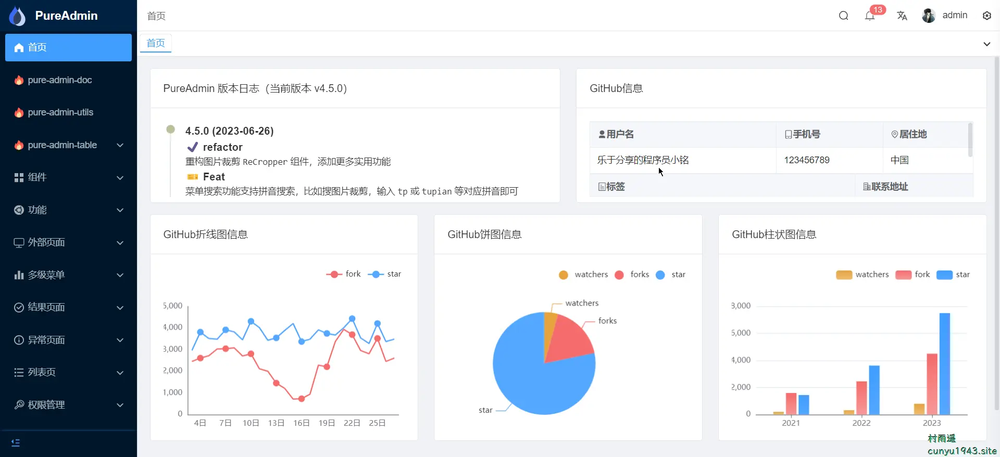

### 2. [Fay](https://github.com/TheRamU/Fay)

一个完整的开源项目，包含 `Fay` 控制器及数字人模型，可灵活组合出不同的应用场景：虚拟主播、现场推销货、商品导购、语音助理、远程语音助理、数字人互动、数字人面试官及心理测评、贾维斯、`Her`。

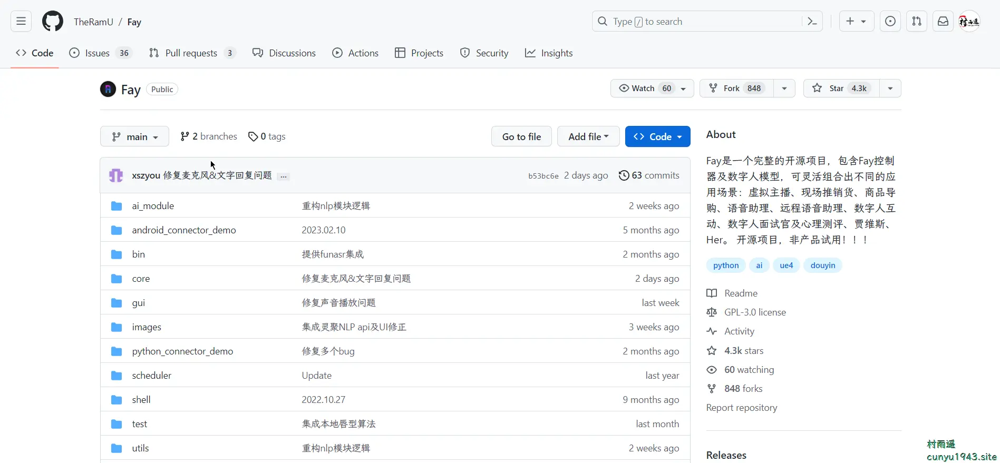

### 3. [Higress](https://github.com/alibaba/higress)

基于阿里内部两年多的 `Envoy` `Gateway` 实践沉淀，以开源 `Istio` 与 `Envoy` 为核心构建的下一代云原生网关。`Higress` 实现了安全防护网关、流量网关、微服务网关三层网关合一，可以显著降低网关的部署和运维成本。

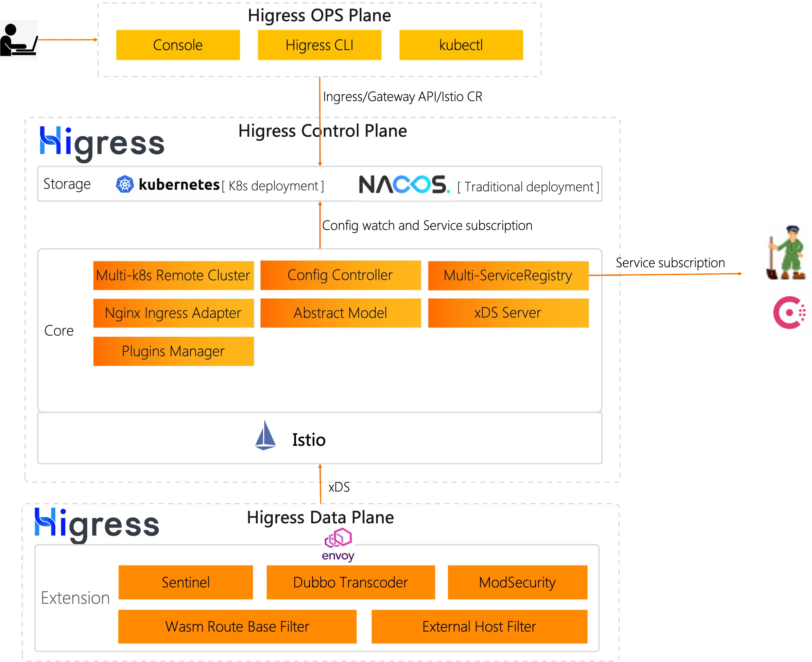

## 二、软件

### 1. [RayLink](https://www.raylink.live/)

一款免费的远程控制软件，专为视觉行业打造的真高清、超流畅远程控制软件！支持 `Windows`、`macOS`、`Linux`、`Android`、`iOS` 等主流操作系统。

### 2. [File Converter](https://file-converter.org/)

支持批量文件转换和压缩的软件，可集成到系统右键菜单中，支持电子书、视频、图片、文档、音频等多种类型文件转换。而且同时支持转换云端和离线文件，耗能少，速度也快，最重要的一点，完全免费！

### 3. [Wallpaper Engine](https://www.wallpaperengine.io/zh-hans)

让你的桌面变“好看”！在你的 `Windows` 桌面使用精美绝伦的动态壁纸，既可以将您自己的图像制作成动画以创建新壁纸或导入视频和网站，同时还可以分享给他人！具有以下特点：

- 性能优化
- 广泛的显示支持
- 海量壁纸供选择
- 自定义调整
- 播放列表和幻灯片
- `LED` 硬件支持

## 三、网站

### 1. [Postcat](https://postcat.com/zh/)

在线 `API` 开发测试工具，一款国产开源免费跨平台的开源 `API` 开发测试工具，超轻量级的接口测试工具，扩展性强。支持 `REST`、`Websocket` 等协议，加速完成 `API` 开发测试工作，十分适合个人及小团队使用。

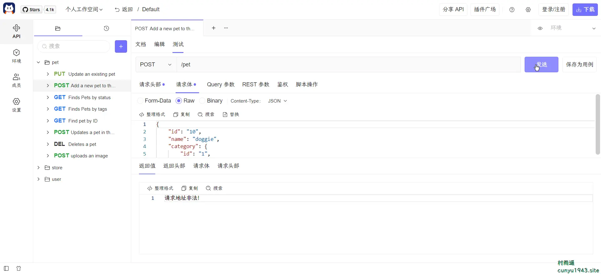

### 2. [Carbon](https://carbon.now.sh/)

一个免费的在线代码截图工具，能够将你的代码生成各种主题的图片并分享，支持自动识别代码编程语言类型。

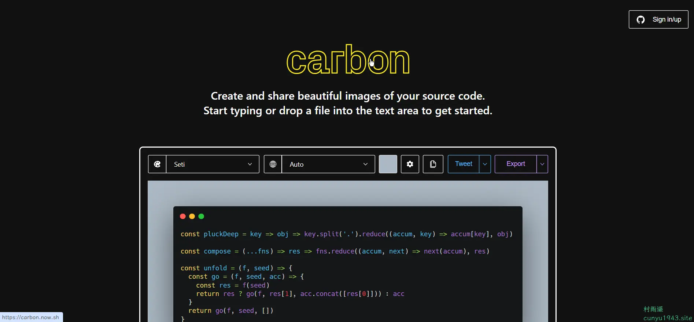

### 3. [here it is](https://www.hereitis.cn/)

一个资源站，免费下载软件、`PPT`、图片素材、精品小工具、小插件等超多资源。

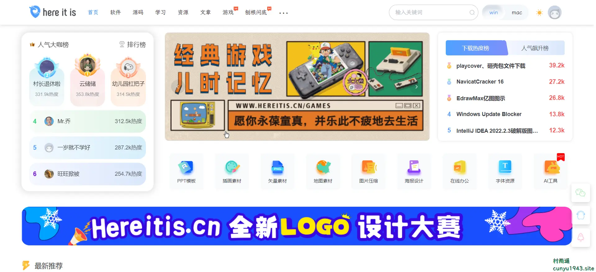

## 四、插件

### 1. [滴答清单](https://chrome.google.com/webstore/detail/ticktick-todo-task-list/diankknpkndanachmlckaikddgcehkod?utm_source=ext_app_menu)

滴答清单是 `Todo` 管理神器 `TickTick` 的中文版，能帮您随时随地记录和管理所有事项。您可以用它制定学习、工作计划，生成读书、购物、旅行清单，设置生日、约会、还款提醒等。

具有以下特点：

- 使用 `QQ`、微博、微信一键登录
- 与 `Android`、`iOS`、网页版完美同步、无缝切换
- 集成微信公众号，随时随地记录想法
- 清单分类、优先级、任务标签等，让任务清晰有条理
- 强大且灵活的提醒备忘功能
- 支持在列表模式下创建子任务
- 可以在日历视图中安排您的计划
- 与家人/朋友/同事分享协作完成重要任务

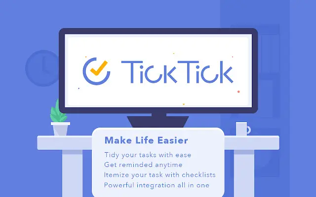

### 2. [专注清单](https://chrome.google.com/webstore/detail/focus-to-do-pomodoro-time/ngceodoilcgpmkijopinlkmohnfifjfb?utm_source=ext_app_menu)

帮助您专注于当前的工作和学习，基于番茄工作法，待办任务清单结合番茄钟计时器，绝佳的时间管理效率工具，帮助提高自律，摆脱拖延。

### 3. [New Tab Todo List](https://chrome.google.com/webstore/detail/new-tab-todo-list-checkli/hdkbnhcgfcokjhlfiicbphafdnipnhjf?utm_source=ext_app_menu)

一个闪电般的新标签生产力页面和仪表板与惊人的背景，待办事项，任务，列表，等等。按照应有的方式制作新的标签页/开始页：快速，可定制，美观而高效！

制作清单，轮廓，待办事项等。随着 `Chrome` 的新标签待办事项列表扩展，只需打开一个新的标签来捕捉你的想法，目标和日常任务。

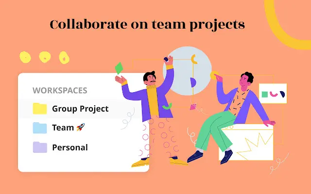

## 五、资料

### 1. [Python-Weekly](https://github.com/chinesehuazhou/python-weekly)

`Python` 潮流周刊，分享文章、教程、开源项目、软件工具、播客和视频、热门话题等内容。

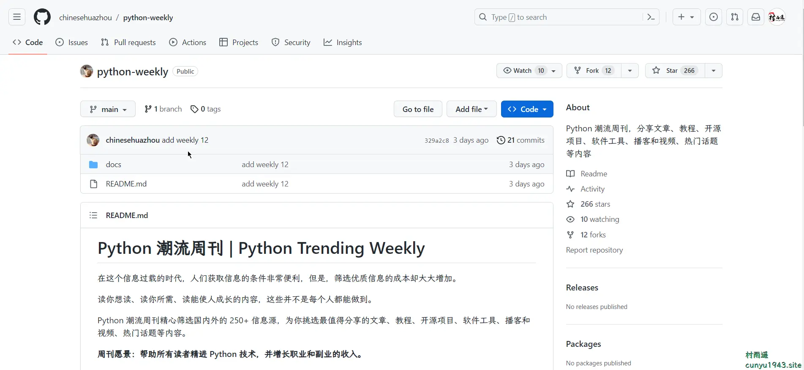

### 2. [《利用Python进行数据分析·第2版》](https://github.com/iamseancheney/python_for_data_analysis_2nd_chinese_version)

内容主要是利用 `Python` 进行数据控制、处理、整理、分析等方面的具体细节和基本要点。作者的目标是介绍 `Python` 编程和用于数据处理的库和工具环境，掌握这些，可以让你成为一个数据分析专家。虽然书的标题是“数据分析”，重点却是 `Python` 编程、库，以及用于数据分析的工具。这就是数据分析要用到的 `Python` 编程。

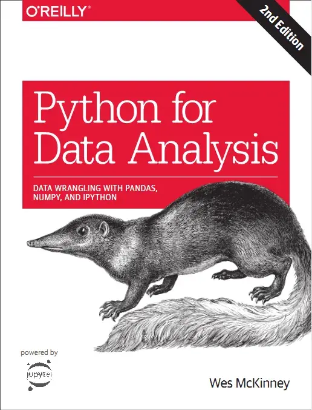

### 3. [矩阵力量](https://github.com/Visualize-ML/Book4_Power-of-Matrix)

全书共 25 章内容，可以归纳为 7 大板块：

- 向量
- 矩阵
- 向量空间
- 矩阵分解
- 微积分
- 空间几何
- 数据

书中在讲解线性代数工具时，会穿插介绍其在数据科学和机器学习领域的应用场景，让大家学以致用。本书读者群包括所有在工作中应用数学的朋友，尤其适用于初级程序员进阶，大学本科数学开窍，高级数据分析师，人工智能开发者。

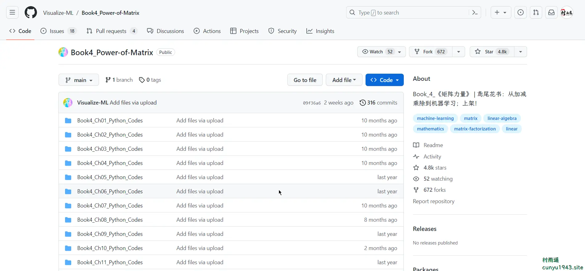

## ✍️ 说明

周刊专栏相关信息：

- **项目地址**：[Github](https://github.com/cunyu1943/JavaPark/) | [Gitee](https://gitee.com/cunyu1943/JavaPark/) ，觉得不错麻烦给我一个**Star**，感谢 ❤️
- **浏览地址**：公众号 | [电子书](https://cunyu1943.github.io/) | [电子书（国内）](https://cunyu1943.gitee.io/)

如果你阅读到这里，说明我的工作没有白费。如果你想推荐项目/网站/软件/资源，欢迎提交 **[issue](https://github.com/cunyu1943/JavaPark/issues)** 或者添加我 **个人微信：cunyu1943** 与我交流。

---

## 🎬️ 广告

当前大环境下，就业形势严峻，尤其针对即将毕业的大学生。作为一个技术求职者，求职前应该做好哪些准备呢，一些面试实战技巧也十分有必要！而刚好最近掘金出了一本《技术人求职指南》小册，相信一定会对在找工作的你有所帮助。

从求职到拿下 `Offer`，一本职场的全方位攻略，快来和我一起学习吧！

<Share colorful />