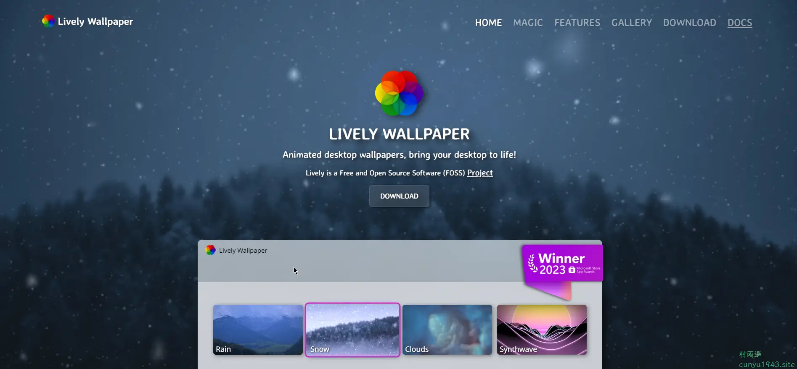
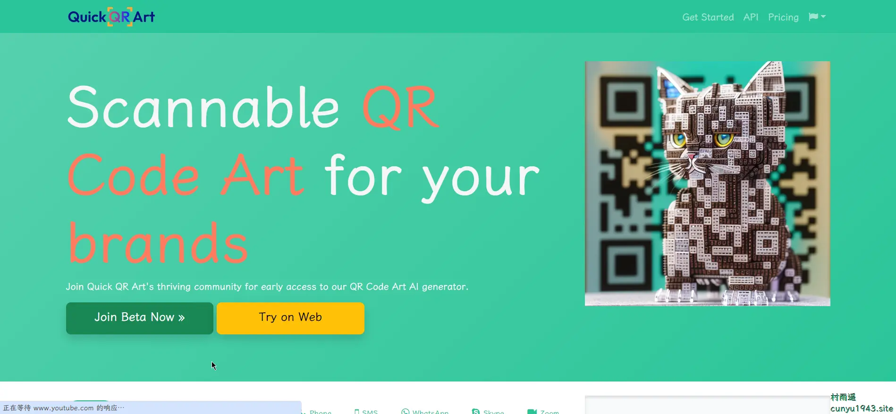
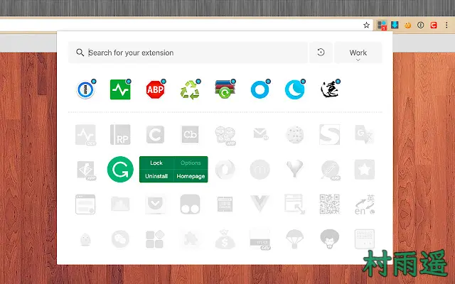

# 好物周刊#16：别致的二维码

::: info 共勉
不要哀求，学会争取。若是如此，终有所获。
:::
::: tip 原文
https://mp.weixin.qq.com/s/ERos0gfETiyjIpqNE_jBsA
:::

## 一、项目

### Hydro

-   **链接**

>   https://github.com/hydro-dev/Hydro

-   **简介**

新一代高效强大的信息学在线测评系统，易安装，跨平台，多功能，可扩展，有题库。系统有如下特点：

1、模块化设计，插件系统，功能热插拔

2、跨平台兼容，数据一键备份/导入

3、单系统多空间，不同班级/院校，分开管理

4、粒度精细的权限系统，灵活调节

5、规模化支持，上千用户无压力，伸缩组秒级自动扩展

6、全题型支持，跟随时代潮流

7、丰富的题库

……

-   **预览**

### kkFileView

-   **链接**

>   https://gitee.com/kekingcn/file-online-preview

-   **简介**

文档在线预览项目解决方案，项目使用流行的 Spring Boot 搭建，易上手和部署。万能的文件预览开源项目，基本支持主流文档格式预览。

- 支持 doc, docx, xls, xlsx, xlsm, ppt, pptx, csv, tsv, dotm, xlt, xltm, dot, dotx, xlam, xla, pages 等 Office 办公文档
- 支持 wps, dps, et, ett, wpt 等国产 WPS Office 办公文档
- 支持 odt, ods, ots, odp, otp, six, ott, fodt, fods 等OpenOffice、LibreOffice 办公文档
- 支持 vsd, vsdx 等 Visio 流程图文件
-   支持 wmf, emf 等 Windows 系统图像文件
-   支持 psd, eps 等 Photoshop 软件模型文件
-   支持 pdf ,ofd, rtf 等文档
-   支持 xmind 软件模型文件
-   支持 bpmn 工作流文件
-   支持 eml 邮件文件
-   支持 epub 图书文档
-   支持 obj, 3ds, stl, ply, gltf, glb, off, 3dm, fbx, dae, wrl, 3mf, ifc, brep, step, iges, fcstd, bim 等 3D 模型文件
-   支持 dwg, dxf, dwf, iges , igs, dwt, dng, ifc, dwfx, stl, cf2, plt 等 CAD 模型文件
-   支持 txt, xml(渲染), md(渲染), java, php, py, js, css 等所有纯文本
-   支持 zip, rar, jar, tar, gzip, 7z 等压缩包
-   支持 jpg, jpeg, png, gif, bmp, ico, jfif, webp 等图片预览（翻转，缩放，镜像）
-   支持 tif, tiff 图信息模型文件
-   支持 tga 图像格式文件
-   支持 svg 矢量图像格式文件
-   支持 mp3,wav,mp4,flv 等音视频格式文件
-   支持 avi,mov,rm,webm,ts,rm,mkv,mpeg,ogg,mpg,rmvb,wmv,3gp,ts,swf 等视频格式转码预览
-   支持 dcm 等医疗数位影像预览
-   支持 drawio 绘图预览

-   **预览**

### 觅思文档

-   **链接**

>   https://gitee.com/zmister/MrDoc

-   **简介**

适合作为个人和中小型团队的私有云文档、云笔记和知识管理工具，致力于成为优秀的私有化在线文档部署方案。

全系产品目前涵盖以下终端：

-   Web 端：开源版、专业版
-   浏览器扩展：支持 Chromium 系列浏览器、Firefox 浏览器
-   桌面客户端：支持 Windows、macOS、Linux
-   移动客户端：支持 Android

-   **预览**

## 二、软件

### 微信输入法

- **链接**

>   https://z.weixin.qq.com/

- **简介**

微信团队出品的输入法，主打简洁、好用、打字快，目前还处于测试阶段，但是已经支持各大主流平台。具有以下特点：

1、语音转文字

2、智能推荐书影音

3、表情推荐

4、智能拼写

5、手写找字

6、边写边译

7、拼写检查

- **预览**

### Lively Wallpaper

- **链接**

>   https://www.rocksdanister.com/lively/

- **简介**

免费开源软件，允许用户设置基于 WinUI 3 制作的动画桌面壁纸和屏幕保护程序。

- **预览**

### 妙记多

- **链接**

>   https://mojidoc.com/login?from=n58Zwp

- **简介**

致力于为新一代知识工作者提供服务，协助个人和团队提升协作效率，大幅解放生产力。

- **预览**

## 三、网站

### 艺码

- **链接**

> https://yima.me/

- **简介**

一款基于 `AI` 的二维码美化工具，能生成跟二维码深度融合的各种艺术风格的绘画，并且扫码后能跳转到指定的任意二维码/网站/公众号等。

- **预览**

### MewXAI 星月熊

- **链接**

> https://qr.mewx.art/

- **简介**

由 `AI` 驱动的下一代艺术二维码，通过该网站，能在短短数秒内创建出令人惊叹的下一代艺术二维码。从此告别单调的黑白二维码，给人留下深刻的印象！

支持微信码、收款码、网站引流、广告 `ROI`、产品包装、展览引导、品牌推广、个人名片、扫描点餐、邀请函、二维码防伪等诸多使用场景。

支持以下两种方式方式创建：

1、上传原始二维码

2、直接输入文本内容/链接

- **预览**

### Quick QR Art

- **链接**

>   https://quickqr.art/

- **简介**

一款借助 `AI` 模型来生成艺术二维码的工具，原理是利用了 `Stable Diffusion` 中的 `Control Net` 模型。仅需几步，就能创建属于自己定制的艺术二维码。

- **预览**

## 四、插件

### YouTube 双字幕

-   **链接**

>   https://chrome.google.com/webstore/detail/youtube-dual-subtitles/hkbdddpiemdeibjoknnofflfgbgnebcm?utm_source=ext_app_menu

-   **简介**

自动切换到本地语言，双语字幕，字幕下载，字幕配音，自定义字幕样式。

默认字幕可设置为翻译语言，而且卡在双语字幕和单字幕之间切换。

可下载视频字幕和翻译字幕，支持 .txt，.srt。

还可以自定义字幕样式，字号，字体，颜色，背景，顺序，文字描边，间距等。

-   **预览**

### 扩展管理器

-   **链接**

>   https://chrome.google.com/webstore/detail/extension-manager/gjldcdngmdknpinoemndlidpcabkggco?utm_source=ext_app_menu

-   **简介**

一键管理所有扩展，快速开启/禁用、批量闪电管理，智能排序，右键卸载、锁定、选项配置，角标提醒，大小布局随心配。快捷、简单、安全。
一键开启/禁用扩展
1. 闪电分组：根据场景快速开启/禁用扩展组（被锁定或主题类扩展除外）
2. 智能排序：可根据您的使用频率智能排序（默认根据名称排序）
3. 右键菜单：提供锁定、卸载、选项配置、主页、APP运行等快捷功能
4. 智能搜索：通过关键字或词组快速找到需要的扩展
5. 角标提醒：实时显示扩展状态，用完后提醒重置，减少资源占用（被锁定或主题类扩展除外）
6. 视图选择：提供列表视图和网格视图，符合用户习惯
7. 分组管理：普通分组和固定分组，灵活管理
8. 扩展命名：给扩展起一个你喜欢的别名
9. 自动匹配：可以根据不同的网站开启和关闭扩展

-   **预览**

### Eagle for Chrome

-   **链接**

>   https://chrome.google.com/webstore/detail/eagle-for-chrome/lieogkinebikhdchceieedcigeafdkid?utm_source=ext_app_menu

-   **简介**

此扩展程序可以轻松保存图像并将屏幕截图保存到 Eagle App。逛网站时看到感兴趣的图片就能立即收藏到 Eagle 里，并迅速完成分类整理。

1. 拖拽收藏：拖曳网页图片立即收藏。
2. Alt + 右键：轻点一下，立即保存。
3. 批量保存：一键收集网页所有图片。
4. 网页截图：快速将整页网页保存下来。

-   **预览**

## 五、资料

### 程序员做饭指南

- **链接**

>   https://github.com/Anduin2017/HowToCook

- **简介**

网上找菜谱和做法，菜谱往往写法千奇百怪，经常中间莫名出来一些材料。对于习惯了形式语言的程序员来说极其不友好。于是作者自己搜寻菜谱并结合实际做菜的经验，用更清晰精准的描述来整理常见菜的做法，以方便程序员在家做饭。

这是一个由社区驱动和维护的开源项目，使更多人能够一起做一个有趣的仓库。

- **预览**

### 猴子都能懂的 Git 入门

- **链接**

> https://backlog.com/git-tutorial/cn/

- **简介**

从名字就知道，一个超简单的 `Git` 入门教程。主要分为针对 `Git` 初学者的入门篇和有 `Git` 使用经验的高级篇。此外，还提供了 `Git` 索引，方便通过 `Git` 的操作来查找期具体方法。

- **预览**

### TeachYourselfCS-CN

-   **链接**

>   https://github.com/izackwu/TeachYourselfCS-CN

-   **简介**

如果你是一个自学成才的工程师，或者从编程培训班毕业，那么你很有必要学习计算机科学。幸运的是，不必为此花上数年光阴和不菲费用去攻读一个学位：仅仅依靠自己，你就可以获得世界一流水平的教育。

互联网上，到处都有许多的学习资源，然而精华与糟粕并存。

我们时常疑惑应当学习哪些科目，为什么？

对于这些科目，最好的书籍或者视频课程 是什么？

在这份指引中，尝试对这些问题做出确定的回答。

-   **预览**

## ✍️ 说明

周刊专栏相关信息：

- **项目地址**：[Github](https://github.com/cunyu1943/weekly/) | [Gitee](https://gitee.com/cunyu1943/weekly/) ，觉得不错麻烦给我一个**Star**，感谢 ❤️
- **浏览地址**：公众号 | [电子书](https://cunyu1943.github.io/weekly)

如果你阅读到这里，说明我的工作没有白费。如果你想推荐项目/网站/软件/资源，欢迎提交 **[issue](https://github.com/cunyu1943/weekly/issues)** 或者添加我 **个人微信：cunyu1943** 与我交流。

---

## 🎬️ 广告

作为程序员，掌握数据结构与算法的重要性就不言而喻了。掌握了数据结构与算法，可以说你的编程能力就会有质的飞跃。任凭各种热门技术的如何变化，只要掌握了核心技能，那都可以见招拆招，做一个“赢家”。

专栏共分为 4 个由浅入深的模块：

-   入门篇
-   基础篇
-   高级篇
-   实战篇

作者采用最适合工程师的学习方式，不拘泥于某一特定编程语言，从实际开发场景出发，由浅入深教你学习数据结构与算法的方法，帮你搞懂基本概念和核心理论，深入理解算法精髓，帮你提升使用数据结构和算法思维解决问题的能力。

想要进一步提升自己的竞争力么，那就赶紧加入和我一起学习吧！

<Share colorful />