# 好物周刊#17：美图合集 App

::: info 共勉
不要哀求，学会争取。若是如此，终有所获。
:::
::: tip 原文
https://mp.weixin.qq.com/s/bPh_VRqv_y1fFZUxfOT_GQ
:::

## 一、项目

### 1. [RxDrag](https://github.com/codebdy/rxdrag)

一款开源企业级可视化低代码前端，目标是可以编辑所有 HTML 基础的组件。比如支持 React、VUE、小程序等，目前仅实现了 React 版。

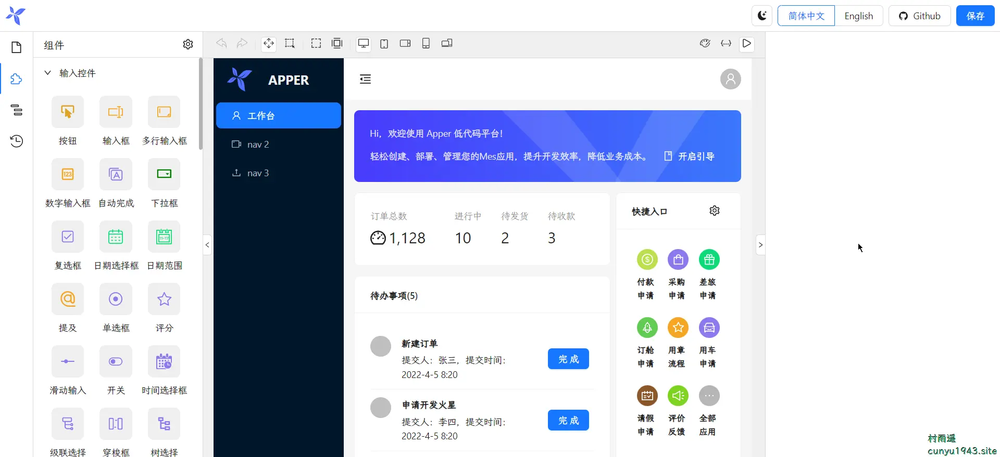

### 2. [paint-board](https://github.com/LHRUN/paint-board)

一款 Canvas 画板，功能包括动态画笔、橡皮擦、文本绘制、元素框选、画板拖拽、图层操作、撤销反撤销保存等内容。

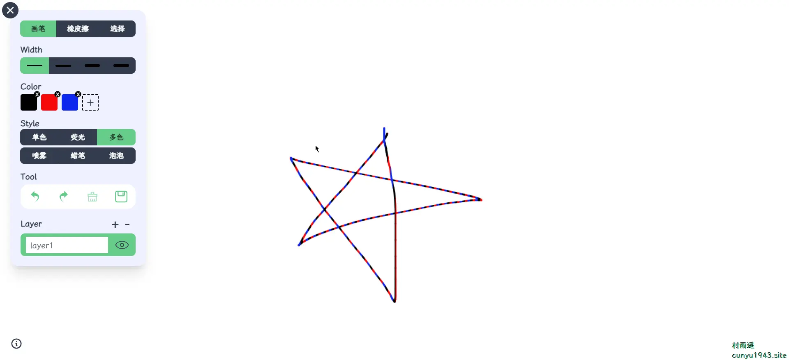

### 3. [V3 Admin Vite](https://github.com/un-pany/v3-admin-vite)

一个免费开源的中后台管理系统基础解决方案，基于 Vue3. TypeScript、Element Plus、Pinia 和 Vite 等主流技术。

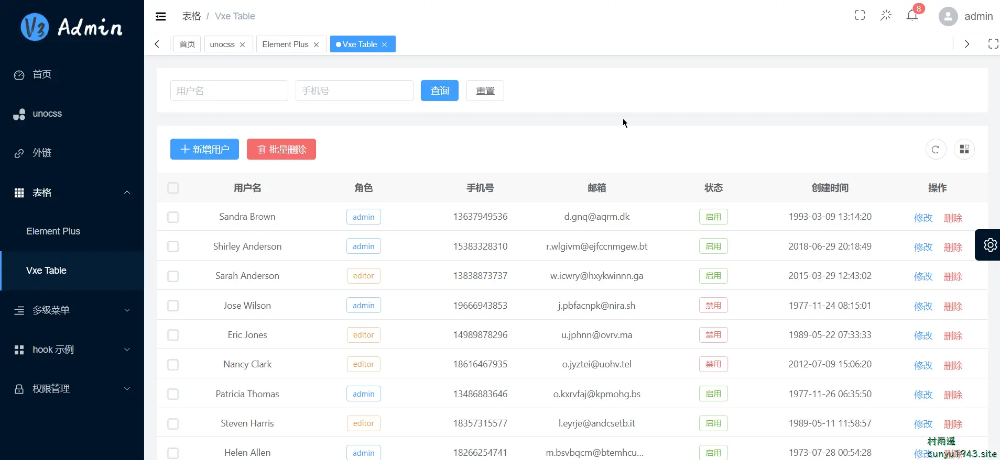

## 二、软件

### 1. [集美美图](https://jmmt.mmkj.tech/)

一款简单纯粹主打每日高清美女写真纸精选的应用，每一张美图均为人工精心挑选和审核，每天只更新 10 张，我们觉得壁纸不在多而在精，我们不用机器操作，也不用算法推荐，我们希望做一款精致、克制、纯粹的超高品质应用。同时支持 `Android` 和 `iOS` 端。

### 2. [汽水音乐](https://www.douyin.com/qishui/)

汽水音乐是抖音官方出品的一款音乐 APP，可以帮你发现更多好音乐。汽水音乐 APP 产品拥有千万量级曲库，支持海量音乐随心听，同时具备个性化推荐、分类电台、特色榜单等功能，汽水音乐官网帮助你发现小众好音乐拒绝千篇一律。用户还可以同步抖音音乐收藏，彰显个人音乐品味，下次听歌更方便。

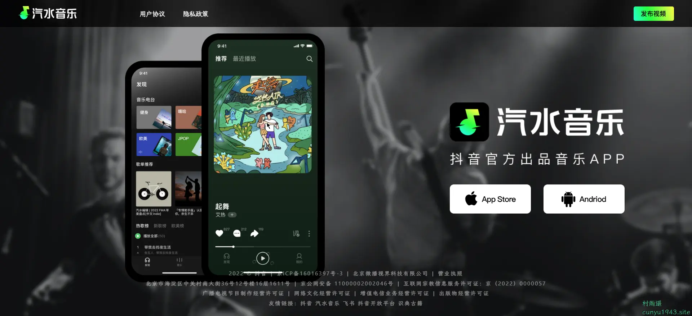

### 3. [BoardOS](https://boardos.online/)

一款强大、免费且易于使用的在线多人实时白板协作系统，帮助您随时随地将团队聚集在一起。

基于白板的在线实时协作系统，拥有多种扩展应用和插件，适用于团队协作、线上教学、在线会议、头脑风暴、在线设计等众多场景，一切为了高效!

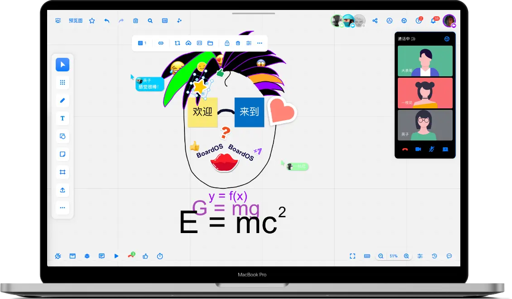

## 三、网站

### 1. [QR-艺术二维码](https://chenyating.github.io/art-qrcode/)

只需输入你要生成二维码的内容，点击开始生成即可生成你的艺术二维码。

### 2. [中国色彩](https://chinese-colors.heyfe.org/)

按照选择的颜色一键生成网站配色，懒人配色必备工具。

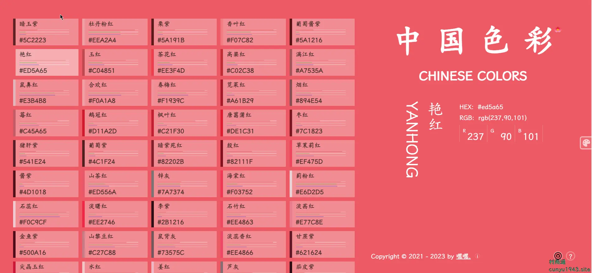

### 3. [BMM](https://bmm.lccl.cc/)

一个设计精美的网址导航网站，收集了众多优质视频、图片、设计、编程、学习等网站；登录后可通过站点独有的标签系统，管理属于自己的网络书签。

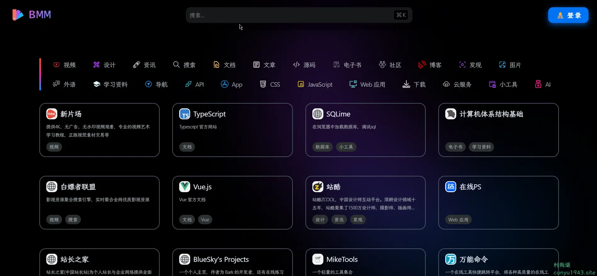

## 四、插件

### 1. [ChatHub](https://chrome.google.com/webstore/detail/chathub-all-in-one-chatbo/iaakpnchhognanibcahlpcplchdfmgma?hl=zh-CN)

一个 ChatBot 聚合客户端，可同时使用 ChatGPT、Bing、Bard 和更多机器人，支持如下功能：

- 在一个应用里使用多种 ChatBot，目前支持 ChatGPT, Bing Chat, Google Bard, Claude, 讯飞星火及一些开源模型，并在持续集成更多机器人
- 同时和多个 ChatBot 聊天，方便对比回答
- 支持 ChatGPT API、Azure OpenAI service
- 支持 GPT-4
- Prompt Library
- 快捷键一键唤起
- Markdown 及代码高亮
- Dark mode
- 联网搜索

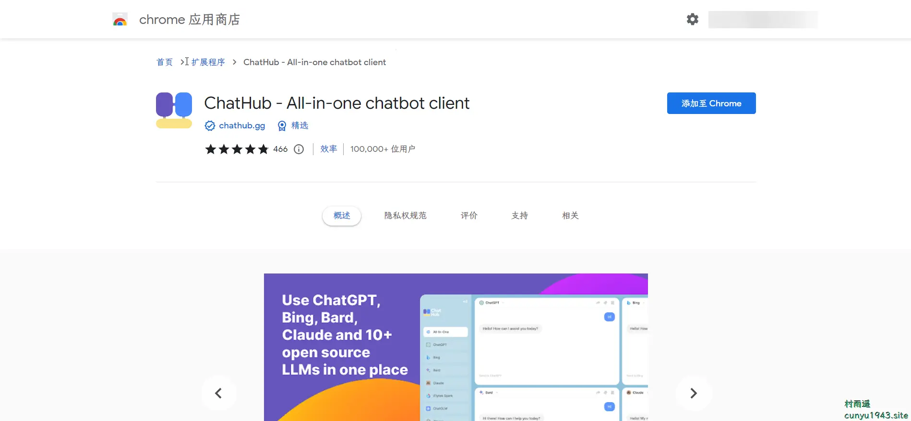

### 2. [Google Keep](https://chrome.google.com/webstore/detail/google-keep-chrome-extens/lpcaedmchfhocbbapmcbpinfpgnhiddi?hl=zh-CN)

想把特定的网页、图片或引用文字保存起来，方便日后使用吗？有了 Google Keep Chrome 扩展程序，您可以轻松将所需内容保存到 Keep，并可在您使用的所有平台同步，包括网页、Android 设备、iOS 设备和 Wear 设备。您还可以通过记事功能记录详细信息，并利用标签快速将记事分门别类，方便日后查找相关记事。

插件支持如下功能：

-   保存网页链接、文本和图片
-   针对已保存的内容创建记事
-   为记事添加标签
-   自动保存到 Google Keep

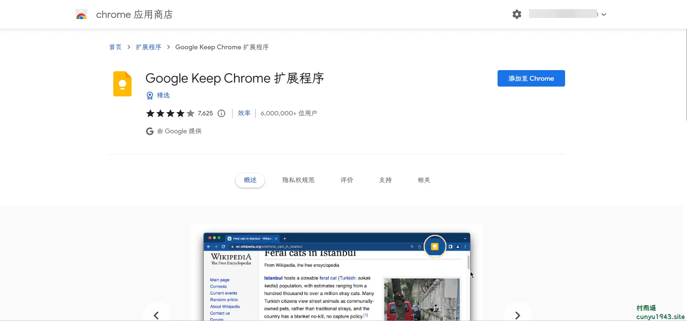

### 3. [ImTranslator](https://chrome.google.com/webstore/detail/imtranslator-translator-d/noaijdpnepcgjemiklgfkcfbkokogabh?hl=zh-CN)

支持选定文本、单词、短语和网页翻译，支持阅读高达 10 种语言的文字，主要有如下特点：

-   在 91 种语言之间翻译
- 每次翻译 5000 个字符
* 翻译历史
* 整个网页翻译，带鼠标悬停翻译选项
* 30 种语言文本-语音转换
* 自动源语言检测
* 回译
* 热键自定义
* 对各种翻译工具的完全自定义
* 本地化的用户界面

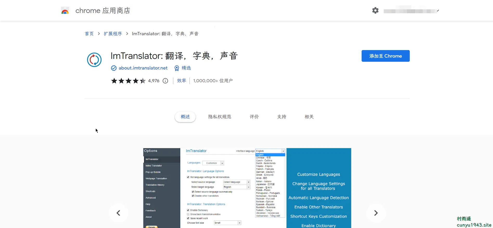

## 五、资料

### 1. [TypeScript 教程](https://github.com/wangdoc/typescript-tutorial)

TypeScript 开源教程，介绍基本概念和用法，面向初学者。

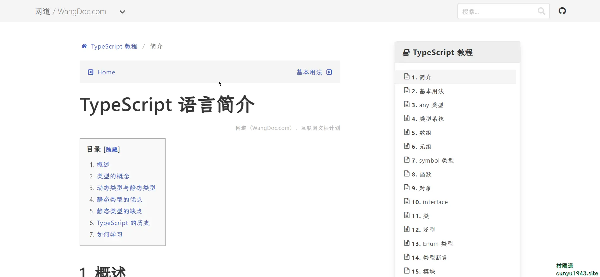

### 2. [陌溪的学习笔记](https://gitee.com/moxi159753/LearningNotes)

陌溪的学习笔记，面试突击宝典，主要来源于 B 站上视频的学习，同时会记录平时一些学习和项目中遇到的问题。

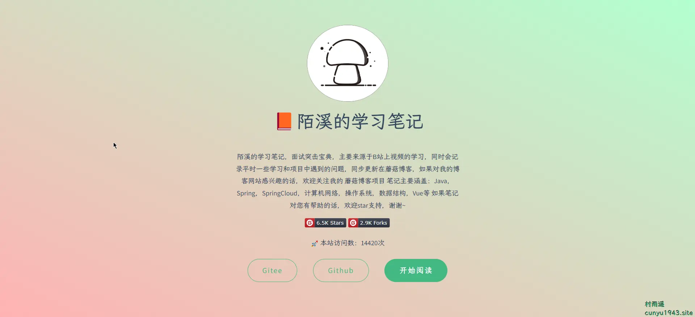

### 3. [从零学 Python](https://gitee.com/52itstyle/Python)

从零学 Python，各种开发案例，不定期更新。

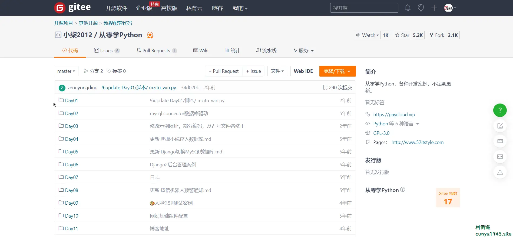

## ✍️ 说明

周刊专栏相关信息：

- **项目地址**：[Github](https://github.com/cunyu1943/JavaPark/) | [Gitee](https://gitee.com/cunyu1943/JavaPark/) ，觉得不错麻烦给我一个**Star**，感谢 ❤️
- **浏览地址**：公众号 | [电子书](https://cunyu1943.github.io/) | [电子书（国内）](https://cunyu1943.gitee.io/)

如果你阅读到这里，说明我的工作没有白费。如果你想推荐项目/网站/软件/资源，欢迎提交 **[issue](https://github.com/cunyu1943/JavaPark/issues)** 或者添加我 **个人微信：cunyu1943** 与我交流。

---

## 🎬️ 广告

当前大环境下，就业形势严峻，尤其针对即将毕业的大学生。作为一个技术求职者，求职前应该做好哪些准备呢，一些面试实战技巧也十分有必要！而刚好最近掘金出了一本《技术人求职指南》小册，相信一定会对在找工作的你有所帮助。

从求职到拿下 `Offer`，一本职场的全方位攻略，快来和我一起学习吧！

## ⏳ 联系

想解锁更多知识？不妨关注我的微信公众号：**村雨遥（id：JavaPark）**。

扫一扫，探索另一个全新的世界。

<Share colorful />