# 好物周刊#18：灵感收集器

::: info 共勉
不要哀求，学会争取。若是如此，终有所获。
:::
::: tip 原文
https://mp.weixin.qq.com/s/6S1Lde5v64sI0R-UttKJgA
:::

## 一、项目

### [layui-vue](https://gitee.com/layui/layui-vue)

一套 Vue 3.0 的桌面端组件库。

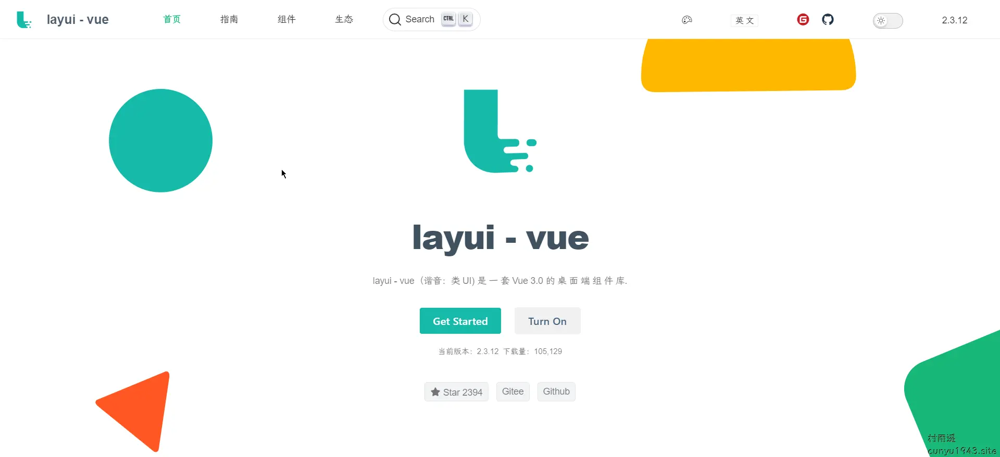

### [Furion](https://gitee.com/dotnetchina/Furion)

一个应用程序框架，您可以将它集成到任何 .NET/C# 应用程序中，让 .NET 开发更简单，更通用，更流行。

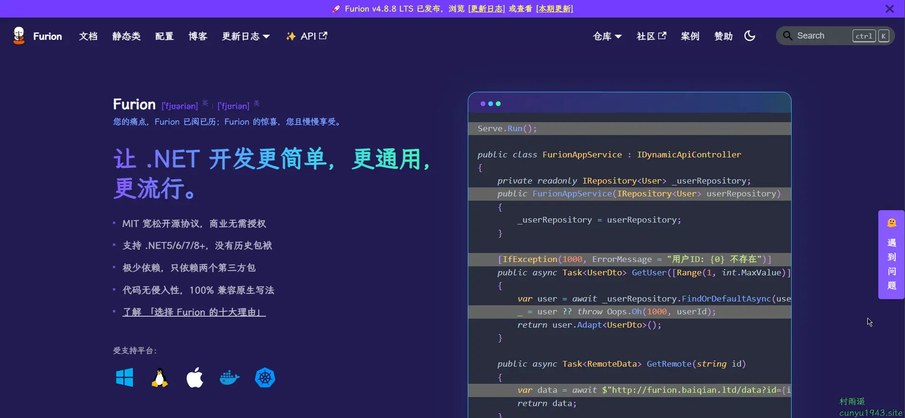

### [TLog](https://gitee.com/dromara/TLog)

一个轻量级的分布式日志标记追踪神器，10 分钟即可接入，自动对日志打标签完成微服务的链路追踪。支持 log4j，log4j2，logback 三大日志框架，支持 Dubbo，Dubbox，Spring Cloud 三大 RPC 框架。

## 二、软件

### [GitMind](https://gitmind.cn/)

新一代**免费**思维导图协作软件，头脑风暴、思想共创，激发思想流动，让智慧自然涌现。

一款全平台 在线思维导图脑图架构图制作软件工具，支持手机手机思维导图，Windows/Mac/Linux 多平台操作及内容同步。它提供有海量的架构图，流程图、思维导图模板可供用户直接使用，支持在线制作流程图、思维导图、组织结构图、类图、用例图、ER 图、网络拓扑图以及 UML 图等十多种图形。

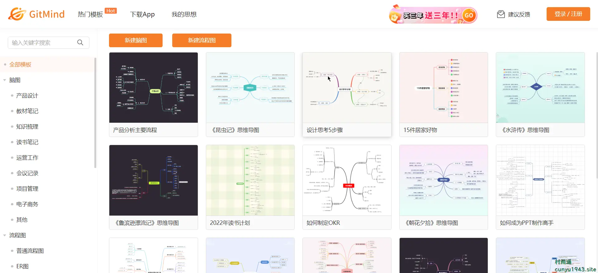

### [Gridea](https://gridea.dev/)

建造你的数字花园，让写作成为最佳谈话方式。

提供撰写、托管、自定义域名的全功能 Blog 工具。

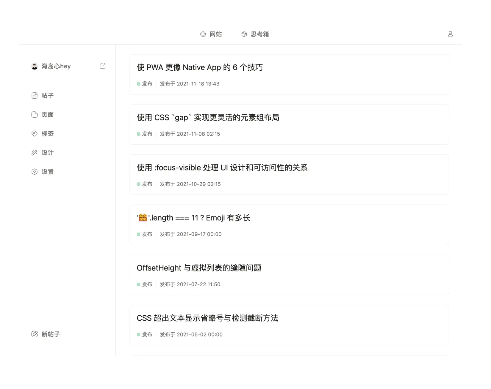

### [Pinbox](https://withpinbox.com/)

一款跨平台的收藏工具，您可以用它来记录灵感，稍后阅读，保存资料甚至网络上的任何内容。

登录输入邀请码 **9eb4d** 即可获得 7 天专业版免费使用权，还不快快行动起来！

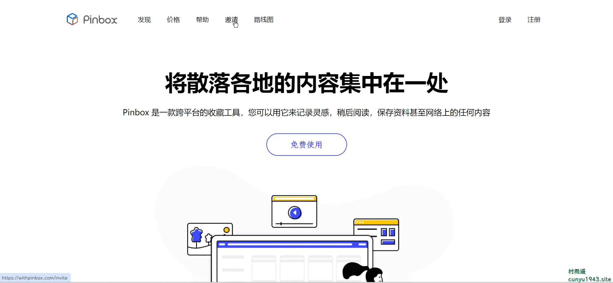

## 三、网站

### [Loading.io](https://loading.io/)

一个简单好用的 loading 制作网站，提供基于各种形式（Ajax Loader, Animated Icons, Live Background）和各种格式（GIF/SVG/APNG/CSS）的loading过渡动画。既有免费内容，也有付费内容，不过免费内容已经足够日常设计使用。

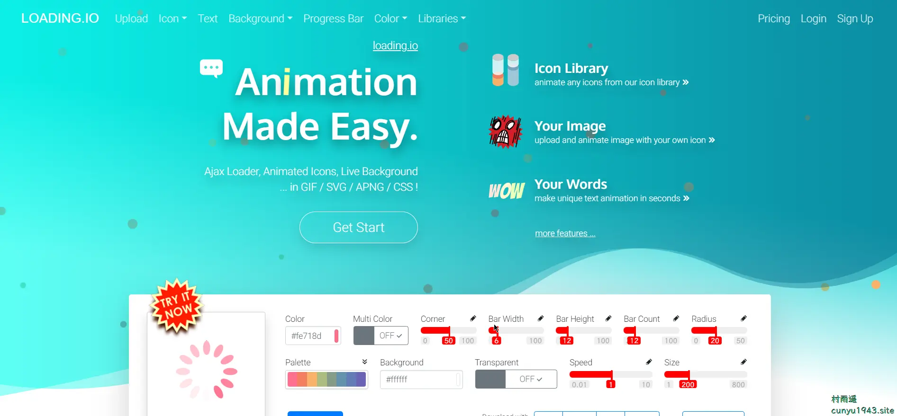

### [unDraw](https://undraw.co/illustrations)

免费可商用矢量插画图库，800 多张工作、生活原创插画。一键即可改变插画主色调，提供 png 和 svg 两种格式下载，目前仍在持续更新中。

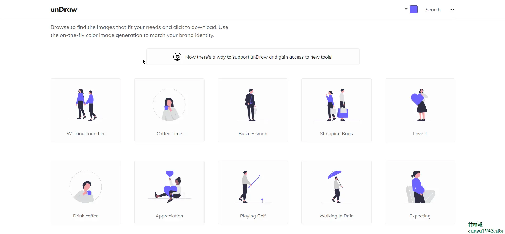

### [ColorGG](https://www.colorgg.com/)

一个免费的颜色工具，提供有关颜色信息，为您生成互补色、类似色、分裂补色、三元、四元、单色等配色方案。
在搜索框中输入颜色值，提供关于该颜色的详细信息并自动生成十六进制、RGB、CMKY、HSL、HSV、CIE-LAB、LUV、LCH、Hunter-Lab、XYZ、xyY 等信息。

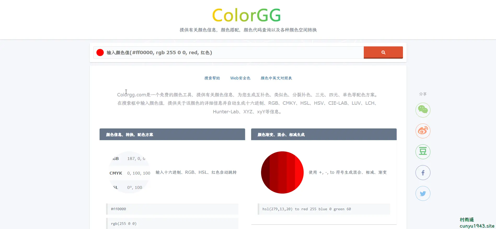

## 四、插件

### [沉浸式翻译](https://immersivetranslate.com/)

沉浸式网页双语翻译扩展，免费使用，支持 Deepl/Google/有道/腾讯翻译等多个翻译服务，支持 Firefox/Chrome/油猴脚本，亦可在 iOS Safari 上使用。

一款免费的，好用的，没有废话的，革命性的，饱受赞誉的，AI 驱动的双语网页翻译扩展，帮助你有效地打破信息差，在手机上也可以用！

主要特性：

-   沉浸式阅读外文网站
-   强大的输入框翻译
-   高效的文件翻译
-   创新的鼠标悬停翻译
-   深度定制优化主流网站
-   全平台支持
-   支持 10+ 种翻译服务

### [Toucan](https://chrome.google.com/webstore/detail/toucan-language-learning/lokjgaehpcnlmkebpmjiofccpklbmoci?hl=zh-CN)

当您访问网站时，Toucan 会自动将页面上的某些单词和短语翻译成您希望学习的语言。通过这种方式，您就可以在自己熟悉语言的语境中，学习新语言中的单词，支持以下语言：

-   英语（适用于讲西班牙母语用户）
-   西班牙语
-   法语
-   日语
-   德语
-   韩语
-   葡萄牙语
-   意大利语
-   阿拉伯语
-   中文（普通话）
-   希伯来语
-   印地语

### [BlockSite](https://chrome.google.com/webstore/detail/blocksite-block-websites/eiimnmioipafcokbfikbljfdeojpcgbh?hl=zh-CN)

保持专注并提高生产力：自定义组织列表、计划的站点组织和密码保护，主要具有以下特点：

-   保持专注扩展
-   工作模式
-   调度
-   时间管理
-   密码保护
-   屏蔽成人内容
-   定制阻止页
-   站点重定向
-   跨浏览器同步
-   卸载预防

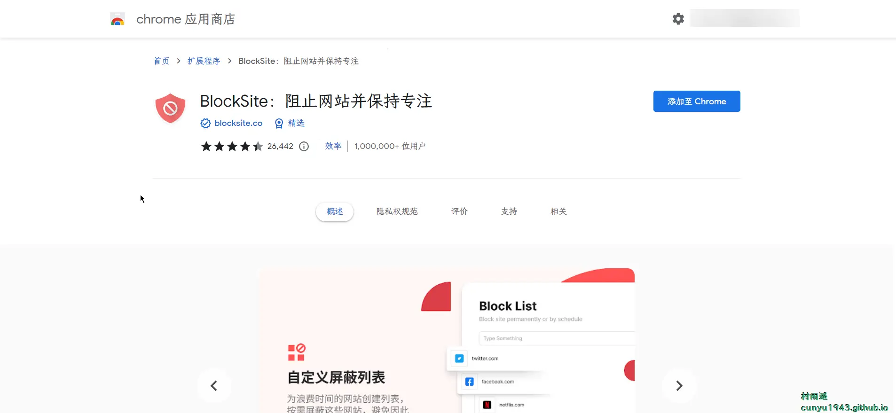

## 五、资料

### [RedTeam_BlueTeam_HW](https://github.com/Mr-xn/RedTeam_BlueTeam_HW)

红蓝对抗以及护网相关工具和资料，内存 shellcode（cs + msf）和内存马查杀工具。

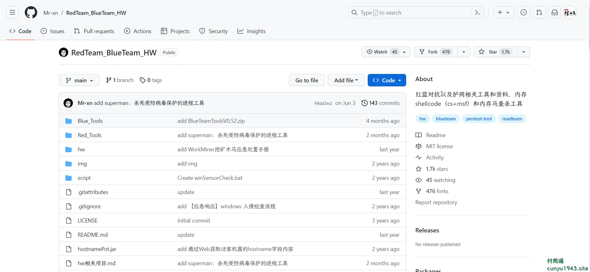

### [Nginx 极简教程](https://github.com/dunwu/nginx-tutorial)

一个 Nginx 极简教程，目的在于帮助新手快速入门 Nginx。

而且仓库中模拟了工作中的一些常用实战场景，并且都可以通过脚本一键式启动，可以快速看到演示效果。

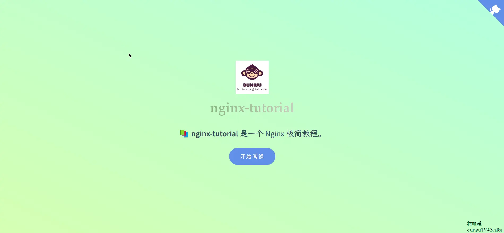

### [Linux 教程](https://github.com/dunwu/linux-tutorial)

主要涵盖以下内容：Linux 命令、Linux 系统运维、软件运维、精选常用 Shell 脚本等。

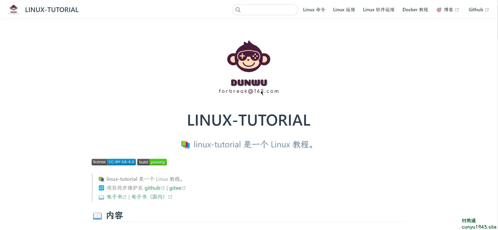

## ✍️ 说明

周刊专栏相关信息：

- **项目地址**：[Github](https://github.com/cunyu1943/weekly/) | [Gitee](https://gitee.com/cunyu1943/weekly/) ，觉得不错麻烦给我一个**Star**，感谢 ❤️
- **浏览地址**：公众号 | [电子书](https://cunyu1943.github.io/weekly)

如果你阅读到这里，说明我的工作没有白费。如果你想推荐项目/网站/软件/资源，欢迎提交 **[issue](https://github.com/cunyu1943/weekly/issues)** 或者添加我 **个人微信：cunyu1943** 与我交流。

---

## 🎬️ 广告

作为程序员，掌握数据结构与算法的重要性就不言而喻了。掌握了数据结构与算法，可以说你的编程能力就会有质的飞跃。任凭各种热门技术的如何变化，只要掌握了核心技能，那都可以见招拆招，做一个“赢家”。

专栏共分为 4 个由浅入深的模块：

-   入门篇
-   基础篇
-   高级篇
-   实战篇

作者采用最适合工程师的学习方式，不拘泥于某一特定编程语言，从实际开发场景出发，由浅入深教你学习数据结构与算法的方法，帮你搞懂基本概念和核心理论，深入理解算法精髓，帮你提升使用数据结构和算法思维解决问题的能力。

想要进一步提升自己的竞争力么，那就赶紧加入和我一起学习吧！

<Share colorful />