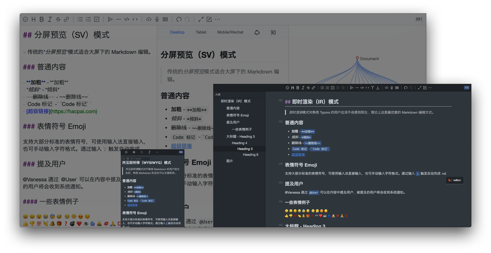
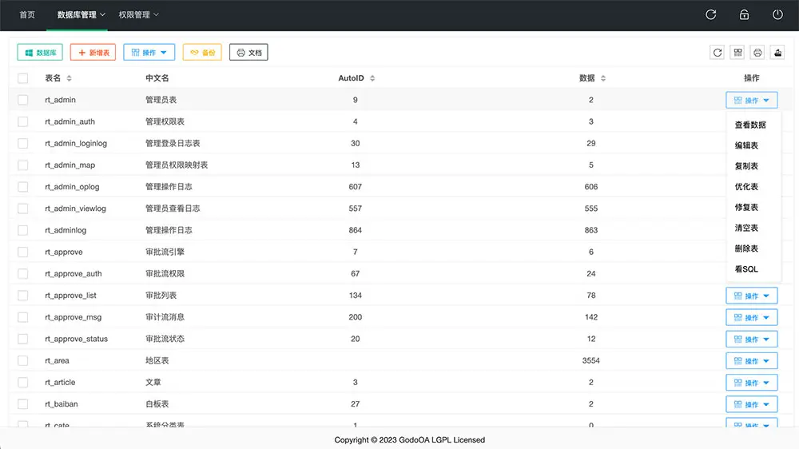
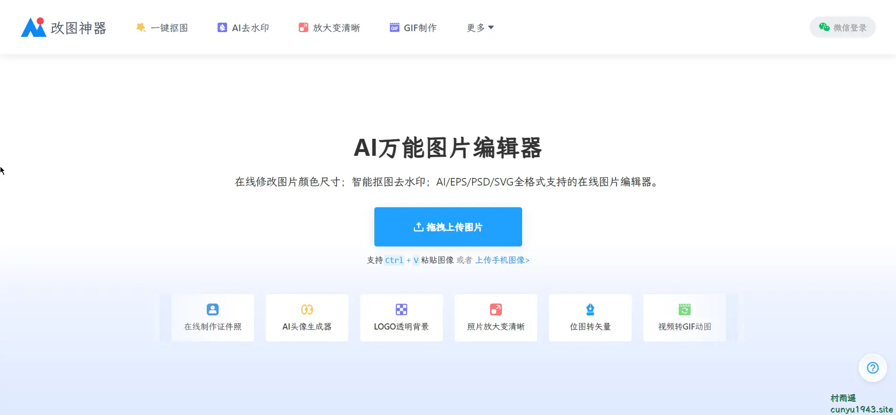
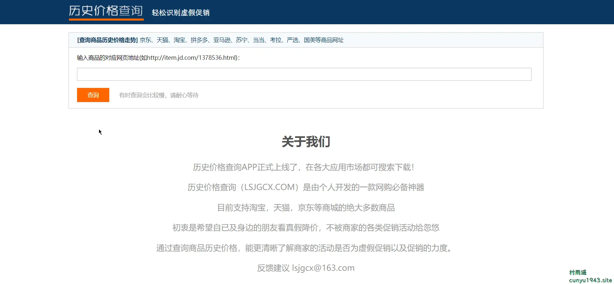
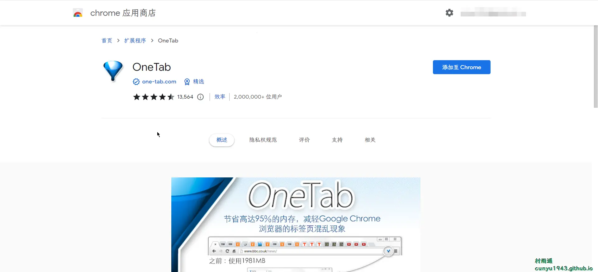
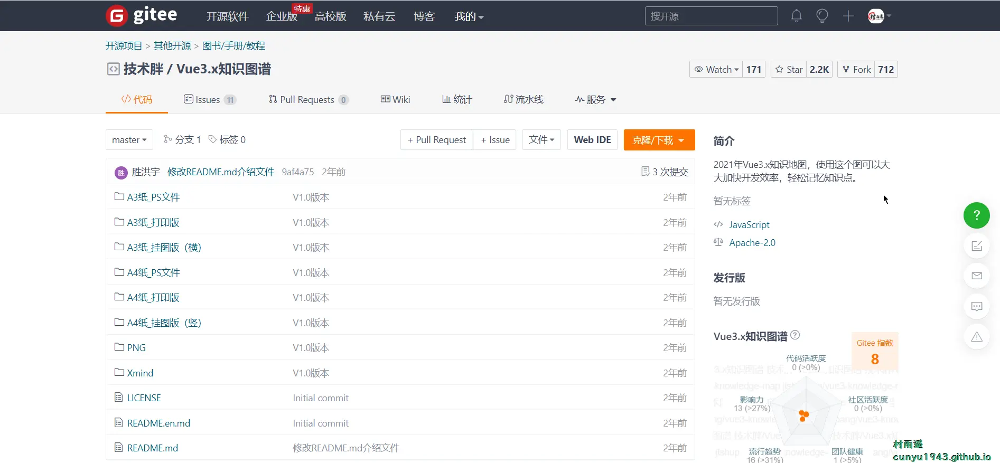

# 好物周刊#19：开源指北

::: info 共勉
不要哀求，学会争取。若是如此，终有所获。
:::
::: tip 原文
https://mp.weixin.qq.com/s/tqZW3qavO8WfYLAgHQANiA
:::

## 一、项目

### 1. [Vditor](https://github.com/Vanessa219/vditor)

一款浏览器端的 Markdown 编辑器，支持所见即所得、即时渲染（类似 Typora）和分屏预览模式。它使用 TypeScript 实现，支持原生 JavaScript 以及 Vue、React、Angular 和 Svelte 等框架。

### 2. [小玄猪商城](https://gitee.com/jeffvon/xxzsource)

小玄猪商城是一套基于前后端分离的 B2B、B2C 商城系统，支持微信小程序、支付宝小程序、H5 商城、APP 商城。支持多商户入驻、适用于直播商城、社交电商、团购、拼团、秒杀、砍价、活动报名、客户管理、知识付费、积分商城、抽奖活动、会员卡、权益卡、成长值、预售、任务中心等场景。商城采用 TP6、VUE、element-vue-admin、uniapp 等技术栈，代码简洁，易于二次开发。

### 3. [godoDb](https://gitee.com/ruitao_admin/gododb)

一款 MySQL 数据库管理工具，具有以下特性：

-   支持数据库备份还原，支持添加数据库；
-   支持自动生成数据库设计文档，md 格式以及实时预览，可以下载成 pdf/word 文件；
-   支持数据表名/注释/autoid 的更改，支持优化表/修复表/删除表/清空表；
-   可查看/编辑/新增/复制任意表数据；
-   可执行 sql 文件，并查看执行后的数据结果；
-   可更改字段名/注释/默认值/排序，可拖拽排序字段，可删除字段；
-   支持连接/管理多个外部数据库，可通过 ssh 连接外部数据库，可导入 pem 文件连接；
-   支持数据库表保护；
-   精细化的权限控制，多角色多用户管理；
-   可查询每个用户的操作记录，方便回查；

## 二、软件

### 1. [MarkText](https://github.com/marktext/marktext)

一个简单优雅的开源 Markdown 编辑器，专注于速度和可用性。而且跨平台，在 Windows、macOS 以及 Linux 平台均可使用。

### 2. [想天工作台](https://www.apps.vip/)

你的副屏操作系统，集效率辅助、游戏娱乐、桌面美化于一身，让你的老设备再次就业，让屏幕解锁更多玩法。此外还支持以下特性：

-   浅/暗色模式切换
-   多屏联动
-   内置浏览器
-   启动器
-   创意市场
-   剪贴板
-   弹幕
-   壁纸
-   轻聊

### 3. [SimpleMindMap](https://wanglin2.github.io/mind-map/#/index)

一个思维导图库，同时也是一个思维导图软件。开源、免费、强大...

无论你是开发者，还是使用者，只要喜欢思维导图，都能在这个项目里找到你需要的。

## 三、网站

### 1. [改图神器](https://img.logosc.cn/)

AI 万能图片编辑器，在线修改图片颜色尺寸、智能抠图去水印，AI/EPS/PSD/SVG 全格式支持的在线图片编辑器。

### 2. [JSFiddle](https://jsfiddle.net/)

一个在线 IDE 服务和在线社区，用于测试和展示用户创建的协作 HTML，CSS 和 JavaScript 代码段。

### 3. [历史价格查询](http://www.lsjgcx.com/)

输入商品对应网址链接，就能查询商品的历史价格走势，让你不再被商家的各种促销活动忽悠，更清晰的了解商家活动是否为虚假促销以及促销力度。

## 四、插件

### 1. [OneTab](https://chrome.google.com/webstore/detail/onetab/chphlpgkkbolifaimnlloiipkdnihall)

当您发现自己有太多的标签页时，单击 OneTab 图标，将所有标签页转换成一个列表。当您需要再次访问这些标签页时，可以单独或全部恢复它们，从而节省高达 95％ 的内存。

### 2. [FireShot](https://chrome.google.com/webstore/detail/take-webpage-screenshots/mcbpblocgmgfnpjjppndjkmgjaogfceg)

捕捉网页截图，编辑并将它们保存为 PDF，JPEG，GIF，PNG 或 BMP。然后用于上传，打印，在 Photoshop 中打开，复制到剪贴板或电子邮件等操作。

### 3. [Adobe Acrobat](https://chrome.google.com/webstore/detail/adobe-acrobat-pdf-edit-co/efaidnbmnnnibpcajpcglclefindmkaj?hl=zh-CN)

利用 Adobe Acrobat PDF 工具在 Google Chrome 中完成更多任务：查看、填充、注释、签名，您还可以试试转换和压缩工具，支持如下功能：

-   查看、下载、打印和存储 PDF
-   免费添加备注编辑 PDF
-   免费填写和签署表格
-   ……

## 五、资料

### 1. [大圣前端进阶指南](https://github.com/shengxinjing/fe-advanced-interview)

一份前端进阶面试指南，解决前端进阶的难点。囊括了以下内容：

-   React + TS 企业级实战 + 组件库
-   Vue3 + TS 企业级实战 + 组件库
-   前端工程师的算法课
-   源码漫游
-   前端面试课
-   大圣前端私教课

### 2. [开源指北](https://gitee.com/gitee-community/opensource-guide)

一份给开源新手的保姆级开源百科，如果你还不知道如何开源该从何做起，不妨参考下这份指南。

### 3. [Vue3.x 知识图谱](https://gitee.com/jishupang/vue3-knowledge-map)

Vue3.x 知识地图，使用这个图可以大大加快开发效率，轻松记忆知识点，对于学习 Vue3 很有帮助。

## ✍️ 说明

周刊专栏相关信息：

- **项目地址**：[Github](https://github.com/cunyu1943/JavaPark/) | [Gitee](https://gitee.com/cunyu1943/JavaPark/) ，觉得不错麻烦给我一个**Star**，感谢 ❤️
- **浏览地址**：公众号 | [电子书](https://cunyu1943.github.io/) | [电子书（国内）](https://cunyu1943.gitee.io/)

如果你阅读到这里，说明我的工作没有白费。如果你想推荐项目/网站/软件/资源，欢迎提交 **[issue](https://github.com/cunyu1943/JavaPark/issues)** 或者添加我 **个人微信：cunyu1943** 与我交流。

---

## 🎬️ 广告

当前大环境下，就业形势严峻，尤其针对即将毕业的大学生。作为一个技术求职者，求职前应该做好哪些准备呢，一些面试实战技巧也十分有必要！而刚好最近掘金出了一本《技术人求职指南》小册，相信一定会对在找工作的你有所帮助。

从求职到拿下 `Offer`，一本职场的全方位攻略，快来和我一起学习吧！

## ⏳ 联系

想解锁更多知识？不妨关注我的微信公众号：**村雨遥（id：JavaPark）**。

扫一扫，探索另一个全新的世界。

<Share colorful />
