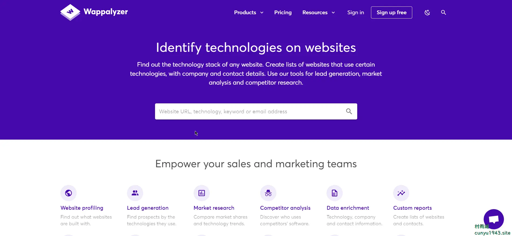
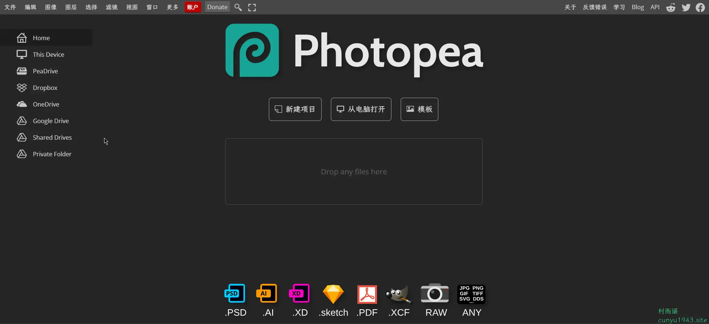
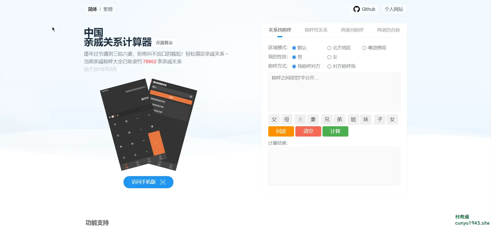

# 好物周刊#21：

::: info 共勉
不要哀求，学会争取。若是如此，终有所获。
:::
::: tip 原文
:::

## 一、项目

## 二、软件

## 三、网站

### [Wappalyzer](https://www.wappalyzer.com/)

一个跨平台程序，能够发现网站上使用的技术。检测网站的内容管理系统、Web 框架、服务器软件、分析工具等等。

### [Photopea](https://www.photopea.com/)

一个在线版的 PhotoShop，支持 PSD、AI、XD、sketch、PDF、XCF、RAW 等多种图片格式。

### [中国亲戚关系计算器](https://passer-by.com/relationship/)

逢年过节遇到三姑六婆，拒绝叫不出口的尴尬！轻松搞定亲戚关系。当前亲戚称呼大全已收录约 **76602** 条亲戚关系。

## 四、插件

## 五、资料

## ✍️ 说明

周刊专栏相关信息：

- **项目地址**：[Github](https://github.com/cunyu1943/JavaPark/) | [Gitee](https://gitee.com/cunyu1943/JavaPark/) ，觉得不错麻烦给我一个**Star**，感谢 ❤️
- **浏览地址**：公众号 | [电子书](https://cunyu1943.github.io/) | [电子书（国内）](https://cunyu1943.gitee.io/)

如果你阅读到这里，说明我的工作没有白费。如果你想推荐项目/网站/软件/资源，欢迎提交 **[issue](https://github.com/cunyu1943/JavaPark/issues)** 或者添加我 **个人微信：cunyu1943** 与我交流。

---

## 🎬️ 广告
当前大环境下，就业形势严峻，尤其针对即将毕业的大学生。作为一个技术求职者，求职前应该做好哪些准备呢，一些面试实战技巧也十分有必要！而刚好最近掘金出了一本《技术人求职指南》小册，相信一定会对在找工作的你有所帮助。

从求职到拿下 `Offer`，一本职场的全方位攻略，快来和我一起学习吧！

<Share colorful />

